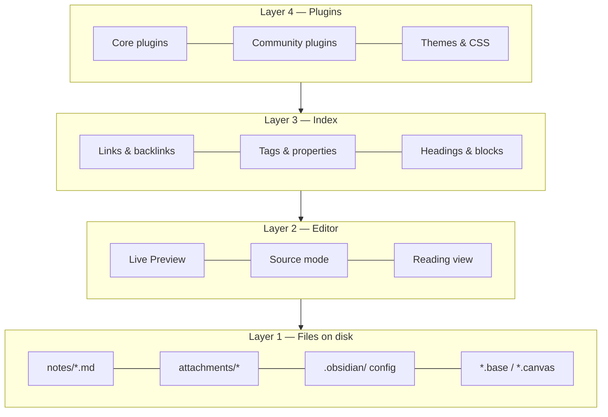
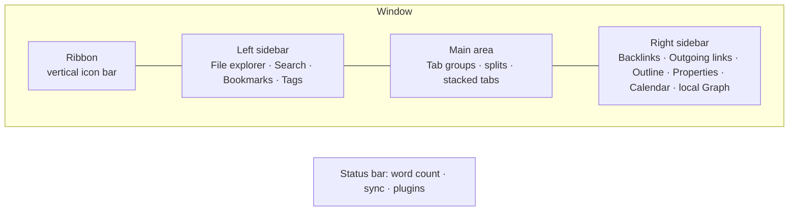
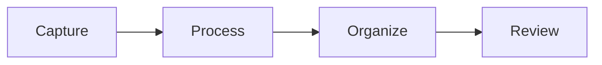
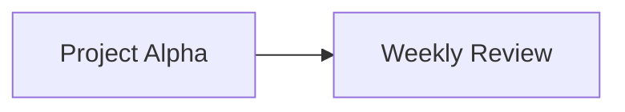

# The Complete Obsidian Mastery Guide

> Single-file edition. Generated automatically from the chapter files in `docs/` by `scripts/build_guide.py`. The web edition lives at <https://gorg667.github.io/obsidian-guide/>.

## Table of contents

1. [Philosophy and Mental Model](#philosophy-and-mental-model)
2. [Setup, Settings and Interface](#setup-settings-and-interface)
3. [Markdown and Editing Mastery](#markdown-and-editing-mastery)

---

# Philosophy and Mental Model

Most people who "fail" with Obsidian do not fail because of a missing feature. They fail because they carry a mental model from another tool — Notion's databases, Evernote's notebooks, Apple Notes' folders — and fight Obsidian instead of using it. This chapter installs the correct mental model. Everything later in the guide builds on it.

## What Obsidian actually is

Strip away the marketing and Obsidian is four things stacked on top of each other:

1. **A folder of plain-text files on your disk.** The vault is a directory. Every note is a `.md` file. Attachments are ordinary files. Configuration is JSON in a hidden `.obsidian/` folder. Nothing is stored in a proprietary database. You can open the folder in Finder or Explorer, `grep` it, back it up with any tool, or point another editor at it.
2. **A Markdown editor with a live-rendering mode.** It is a good editor — multi-cursor, Vim mode, folding, a formatting menu, tables, callouts — but it is still fundamentally editing text.
3. **A link-and-metadata index.** Obsidian scans your vault and builds an in-memory index of links, backlinks, tags, properties, headings and blocks. The graph view, backlinks pane, Bases, and every query plugin read from this index.
4. **A plugin platform.** Core plugins (shipped with the app, toggleable) and community plugins (open-source, installed from a directory) extend all three layers above. The app itself is Electron on desktop and Capacitor on mobile, and plugins are JavaScript with full access to the vault and the UI.



The reason this matters: **the file layer is the truth**. Everything above it is a view. If Obsidian disappeared tomorrow you would lose nothing but convenience. This is the "file over app" principle that Obsidian's CEO Steph Ango has written about, and it has practical consequences throughout this guide: prefer formats and conventions that survive without Obsidian, and treat plugins as accelerators, not as the place where your data lives.

## The five primitives

Everything you will ever build in Obsidian is a combination of five primitives. Learn to see them.

### 1. Notes (files)

A note is a file. Its **title is its filename**. This is more consequential than it sounds:

- Filenames cannot contain `/ \ : * ? " < > |` and Obsidian also forbids `#`, `^`, `[`, `]` and `|` in note names because they conflict with link syntax.
- Renaming a note is a filesystem rename, and Obsidian rewrites every link that points to it (if the setting is on — keep it on).
- Two notes cannot share a name in the same folder, but *can* share a name in different folders — which makes `[[Name]]` links ambiguous. Avoid this.
- Because the title is the filename, "what should I call this note?" is a real design decision. The methodology chapter covers naming conventions in depth.

A note optionally has **properties** (YAML frontmatter), a body of Markdown, and any number of headings and blocks that can be addressed individually.

### 2. Links

A link is a pointer from one note to another: `[[Target]]`, `[[Target#Heading]]`, `[[Target#^blockid]]`, or `[[Target|Shown text]]`. Links are the connective tissue of a vault and the thing Obsidian does better than any competitor. Key properties:

- **Links are bidirectional in the index.** Write `[[Berlin]]` in your travel note and the Berlin note's backlinks pane now shows the travel note — with no action on your part.
- **Links can point to notes that don't exist yet.** They render dimmer and become real the moment you click them. This lets you link *first* and write *later*, which is the core of "bottom-up" knowledge building.
- **Unlinked mentions** surface places where a note's name appears as plain text, offering one-click linking.
- **Embeds** are links with a `!` prefix: `![[Target]]` shows the target's content inline. You can embed notes, headings, blocks, images, PDFs (with page numbers), audio, video, canvases, and bases.

### 3. Tags

`#tag` and `#nested/tag`, in the body or in the `tags` property. Tags are lightweight, cross-cutting labels. They are cheap to add and cheap to query. They are also the most over-used primitive by beginners; Chapter 5 gives a decision framework for tags vs properties vs links vs folders.

### 4. Properties (metadata)

Structured `key: value` data at the top of a note in YAML. Since Obsidian 1.4 they have typed UI (text, list, number, checkbox, date, datetime), and since 1.9 they are the fuel for Bases. Properties turn a pile of notes into a *database* without leaving plain text. A note with:

```yaml
---
type: book
author: "[[Cal Newport]]"
status: reading
rating: 4
started: 2026-08-14
tags: [productivity, focus]
---
```

…is simultaneously a readable page and a row in any table you care to build.

### 5. Folders

Folders are the physical location of a file. They are the primitive people over-invest in first and regret later, because a note can live in only one folder while it can have unlimited links, tags, and properties. Folders still matter — for attachment routing, for templates that auto-apply per folder, for Bases filters like `file.inFolder("Projects")`, and for keeping the file explorer sane — but they should be *few and stable*.

## The three ways to organize, and why you need all of them

There are three fundamentally different organizing strategies, and mature vaults use all three deliberately:

| Strategy | Primitive | Strengths | Weaknesses | Use it for |
| --- | --- | --- | --- | --- |
| **Hierarchy** | Folders | Familiar, physical, works with any tool, supports per-folder automation | One location per note; deep trees rot; encourages filing over thinking | A small number of top-level "kinds of thing" (e.g. `Notes`, `Journal`, `Projects`, `Sources`, `Templates`, `Attachments`) |
| **Network** | Links, MOCs | Emergent structure; supports multiple contexts; serendipity via backlinks | Needs active tending; can become an undifferentiated hairball | Ideas, concepts, people, projects — anything with relationships |
| **Attributes** | Tags, properties | Precise filtering and sorting; enables dashboards; machine-readable | Requires discipline and a schema; meaningless without queries | Status, type, dates, ratings, categories — anything you want to *query* |

The single most useful habit is to ask, for each note, "which of these strategies does this note need?" A meeting note needs attributes (date, attendees, project) and links (to the people and the project) but no special folder. A permanent idea note needs links above all. A recipe needs attributes (cuisine, time, servings) and belongs to one obvious folder.

## Bottom-up vs top-down

Two schools argue about how to build a vault.

**Top-down** designs the structure first: folders, templates, property schemas, MOCs, dashboards. Then notes are filed into it. This is how most productivity content online approaches Obsidian and it produces beautiful screenshots. Its failure mode is a cathedral with no congregation — an elaborate system you stop using after three weeks because maintaining it is a job.

**Bottom-up** writes notes first, links freely, and lets structure emerge. When a cluster of notes becomes noticeable, you create a Map of Content (MOC) to index it. When a pattern of properties recurs, you formalize a template. This is the Zettelkasten / LYT lineage. Its failure mode is a swamp — thousands of notes with no way in.

The guide's position: **structure the containers top-down, let the content grow bottom-up.** Decide your folder skeleton, your note types, your property schema, and your naming conventions up front (Chapter 8 gives you a complete one). Then within that skeleton, write and link without asking permission from your system. Create MOCs and dashboards only when the volume of notes demands them.

## Two modes of use: retrieval and thinking

Obsidian serves two very different jobs and you should know which one you are doing at any moment.

**Retrieval** is "where did I put that?" — the Wi-Fi password, the recipe, the meeting decision, the article you clipped. Retrieval wants *predictability*: consistent names, consistent properties, consistent locations, good search. Bases, properties, folders, and search are the tools. Over-linking retrieval notes wastes time.

**Thinking** is "what do I believe about this?" — ideas, arguments, decisions, syntheses. Thinking wants *connection*: links to related ideas, backlinks that surface forgotten context, writing in your own words, revisiting. Links, MOCs, the local graph, and daily notes are the tools. Over-structuring thinking notes kills them.

A "whole life" vault contains both, and one of the reasons it is worth putting *everything* in Obsidian is that the boundary is porous: a retrieval note (a book you read) becomes a thinking note (what you took from it), and thinking notes feed action (a project). Keeping them in one place with one link syntax is the actual killer feature.

## What Obsidian is bad at (and what to do about it)

Honesty about limits saves months.

- **Real-time collaboration.** Two people editing the same note simultaneously is not a thing. Obsidian Sync supports multiple users on one vault, but with last-writer-wins at the file level (with version history to recover). For team wikis and shared docs, use something else and link to it.
- **Relational data with joins.** Bases and Dataview are excellent for single-table views over notes. Multi-table relational queries are possible (DataviewJS) but awkward. If you need a real database — an inventory with thousands of SKUs, accounting — use one, and keep the *narrative* in Obsidian.
- **Heavy attachments.** Obsidian stores files fine, but a vault with 50 GB of video syncs badly and indexes slowly. Keep large media outside the vault and link to it, or in a separate vault.
- **Rich text fidelity.** Markdown cannot represent every formatting nuance of a Word document. If you need pixel-perfect documents, write in Obsidian and export via Pandoc.
- **Structured forms and input validation.** Plugins like Meta Bind get you far, but there is no native form builder.
- **Mobile power features.** Mobile Obsidian is remarkably complete, but plugins with heavy UI, huge vaults, and Git-based sync are painful on phones. Design mobile workflows for *capture and reading*, not administration.
- **Being a calendar or email client.** It can display calendars (plugins) and you can email into it (automation), but it should not replace them.

## Principles that survive every chapter

These come up again and again. Internalizing them now makes the rest of the guide faster.

!!! tip "1. Plain text is the API"
    Any feature that stores its data as human-readable text in your notes (properties, tasks, inline fields, callouts) is durable and portable. Any feature that stores data in `.obsidian/plugins/*/data.json` is convenient but fragile. Prefer the former for anything you would grieve losing.

!!! tip "2. Titles are links"
    Because the filename is both the title and the link target, name notes the way you would *refer to them in a sentence*. `[[Cal Newport]]` reads naturally; `[[newport_cal_author]]` does not. Aliases handle synonyms.

!!! tip "3. Friction goes at the exit, not the entrance"
    Capturing must be near-zero-friction (hotkey, template, mobile share sheet). Processing — deciding where a note lives, what it links to — can be batched later in a review. Systems that demand perfect filing at capture time die.

!!! tip "4. Query, don't file"
    If you find yourself maintaining a list by hand — "all open projects", "books to read", "recent meetings" — stop. That list should be a Base or a Dataview query driven by properties. Hand-maintained lists are always out of date.

!!! tip "5. One vault unless you have a reason"
    Links do not cross vaults. Search does not cross vaults. Every split costs you connections. Legitimate reasons to split: legal separation (work confidentiality), radically different sync requirements, or a vault that is really a project (a book manuscript, a shared family vault). "It feels cleaner" is not a reason.

!!! tip "6. Plugins are power tools — count them"
    Every plugin is code running with full access to your files, load time on mobile, and a maintenance dependency. A healthy vault has 10–25 community plugins that you can each name the purpose of. Chapter 14 gives tiers; Chapter 32 gives an audit routine.

!!! tip "7. Build for the tired version of you"
    You will use the vault at 11 pm, on a phone, after a bad day. Templates, hotkeys, and dashboards exist so the system works when your willpower does not.

## The four layers of mastery

It helps to know where you are and what comes next. Most users plateau at layer 2.

| Layer | You can… | Typical signs | This guide's chapters |
| --- | --- | --- | --- |
| **1. Editor** | Write Markdown, make links, use folders, search | Vault looks like a fancier Apple Notes | 2, 3, 4 |
| **2. Networker** | Use backlinks deliberately, MOCs, daily notes, tags, a few plugins | Graph view has recognizable clusters | 5, 6, 7, 9 |
| **3. Systems builder** | Design property schemas, templates, Bases/Dataview dashboards, task system, reviews | You *query* your vault; you rarely make lists by hand | 8, 10–13, 15–25 |
| **4. Operator** | Automate with CLI/URI/scripts, integrate external apps and AI, customize the UI, write small plugins, maintain and migrate at scale | The vault is your life's control panel and it runs itself | 26–34 |

The [Mastery Roadmap](35-mastery-roadmap.md) turns this into a schedule.

## Key takeaways

- Obsidian is a folder of text files plus an index plus plugins. The files are the truth; everything else is a view.
- Five primitives — notes, links, tags, properties, folders — combine into every system you will build. Learn to see them.
- Use hierarchy for containers, network for ideas, attributes for anything you will query. Mature vaults use all three deliberately.
- Structure containers top-down; let content grow bottom-up.
- Know whether a note is for *retrieval* or *thinking* and organize accordingly.
- Prefer plain-text-stored features, query instead of filing, keep one vault, count your plugins, and design for your tired self.

## Next

[Chapter 2: Setup, Settings and Interface →](#setup-settings-and-interface)

---

# Setup, Settings and Interface

A vault configured thoughtfully in the first hour saves hundreds of small frustrations later. This chapter is a complete audit: every setting that materially affects how you work, what to set it to and why, plus the interface anatomy and keyboard-first habits that separate fluent users from clickers.

## Installation and installer versions

Obsidian has two version numbers and confusing them causes real problems.

- **App version** (e.g. 1.13.4) — the JavaScript application. Updates automatically in-app on desktop; via the store on mobile.
- **Installer version** — the Electron shell (Chromium + Node) the app runs in. It only updates when you **download and reinstall from obsidian.md**. Check it under **Settings → General → About** ("Installer version").

!!! warning "Reinstall the installer at least once a year"
    Features like the Obsidian CLI require installer 1.12.7+, Bases performance improved with newer Electron builds, and several rendering bugs are installer-level. Reinstalling does not touch your vault. On Windows use the same edition (system vs. per-user) you originally installed to avoid two copies.

| Platform | Recommended install | Notes |
| --- | --- | --- |
| Windows | Official installer from obsidian.md | winget (`winget install Obsidian.Obsidian`) also works and tracks installer versions. |
| macOS | Official DMG or `brew install --cask obsidian` | Universal build; Apple Silicon native. |
| Linux | AppImage (most portable), Flatpak, Snap, or `.deb` | Flatpak and Snap sandbox file access; the CLI and some sync tools work best with AppImage or `.deb`. If using Flatpak, grant filesystem access with Flatseal to your vault folder. |
| iOS/iPadOS | App Store | Vault location: "On My iPhone/Obsidian" (local) or iCloud Drive. See [Sync](26-sync-backup-security.md). |
| Android | Play Store, F-Droid, or GitHub APK | Grant "All files access" for vaults outside app storage. |

## Where to put the vault

Decide this once. Moving later is possible but annoying.

- **Local disk, non-synced folder** — fastest, safest for plugins, zero conflicts. Use if you sync with Obsidian Sync, Git, or Remotely Save (they handle sync themselves).
- **iCloud Drive / OneDrive / Dropbox / Google Drive folder** — works on desktop; on mobile only iCloud is natively supported by Obsidian (iOS). Risks: "files on demand" placeholders (OneDrive) break indexing; conflicts create duplicate files; `.obsidian/` config churn triggers constant re-upload. If you must, exclude nothing and turn off "files on demand" for the vault folder.
- **Syncthing folder** — excellent on desktop and Android; not available on iOS.
- **Network drive / NAS** — avoid. Latency makes the editor sluggish and file watchers unreliable. Obsidian 1.13 warns when loading HTML resources from network paths for the same reason.

Chapter 26 has the full sync matrix.

## Vault-level decisions before you write

1. **One vault or several?** One, unless you have a hard reason (Chapter 1, principle 5). You *can* keep a scratch vault for experimenting with plugins.
2. **Attachment folder.** Set **Settings → Files and links → Default location for new attachments** to *In the folder specified below* → `Attachments` (or `_attachments`, `zz-attachments` to sort last). Never leave it as "vault root" or "same folder as current file" unless you like clutter.
3. **Link format.** *Wikilinks* (`[[Note]]`) are the Obsidian default, faster to type, and every plugin understands them. *Markdown links* (`[Note](Note.md)`) are more portable to other tools and required by some publishing pipelines. For the path style, **Shortest path when possible** produces clean `[[Note]]` links but is only safe if you keep filenames unique across the vault; **Absolute path in vault** produces `[[Folder/Note]]` and is unambiguous but noisier; **Relative path to file** breaks when notes move. Recommendation for a whole-life vault: Wikilinks on, unique filenames enforced by convention, shortest path.
4. **New note location.** *Same folder as current file* is the least surprising once you have a folder skeleton; combined with an `Inbox` folder as your default landing zone for quick capture.
5. **Naming convention.** Decide capitalisation (Title Case vs sentence case) and whether dates are `YYYY-MM-DD`. Decide now; consistency matters more than the choice.

## The complete settings audit

Settings are searchable since 1.13 (++ctrl+comma++ then type). Below, every setting that matters, grouped as Obsidian groups them. Defaults are fine where a setting is not listed.

### General

| Setting | Recommended | Why |
| --- | --- | --- |
| Automatic updates | On | Security and Bases/CLI improvements ship often. |
| Command line interface | On (desktop) | Enables `obsidian` CLI — see Chapter 29. Follow the prompt to register PATH. |
| Language | Your choice | Affects UI only, not your notes. |

### Editor

| Setting | Recommended | Why |
| --- | --- | --- |
| Default editing mode | Live Preview | WYSIWYG-ish while still Markdown. Switch to Source with ++ctrl+e++ (toggle) when you need to see raw syntax. |
| Default view for new tabs | Editing view | Reading view is for consumption; you are mostly writing. |
| Show line numbers | Off (on for code-heavy notes via `cssclasses`) | Noise for prose. |
| Readable line length | On | ~700px measure; disable per note with a CSS class if you need wide tables. |
| Strict line breaks | Off | With off, a single newline renders as a line break (like most note apps). With on, you need two spaces or a blank line — stricter CommonMark. Off is friendlier; on is more portable. Pick and never change (it changes how existing notes render). |
| Properties in document | Visible | Shows the typed property editor. "Source" shows raw YAML; "Hidden" hides it. |
| Show indentation guides | On | Helps with nested lists and tasks. |
| Fold heading / Fold indent | On | You will use folding constantly in long notes. |
| Spellcheck | On; add languages | Right-click → Add to dictionary for your jargon. |
| Auto pair brackets / Markdown syntax | On | Typing `[[` yields `[[]]`. |
| Smart indent lists | On | Tab/Shift-Tab indent list items. |
| Vim key bindings | Off unless you are a Vim user | If you are, it is remarkably complete (see Chapter 3). |
| Auto convert HTML | On | Pasting from the web becomes Markdown. |
| Indent using tabs / Tab size | Spaces, 4 (or tabs) | Some plugins (Tasks, Dataview) were historically picky about mixed indentation. Consistency is what matters. |

### Files and links

| Setting | Recommended | Why |
| --- | --- | --- |
| Confirm file deletion | On | Your trash is one accidental ++del++ away. |
| Deleted files | Move to Obsidian trash (`.trash` folder) | Recoverable within the vault; system trash is the alternative. Chapter 32 covers File Recovery. |
| Always update internal links | On | The reason renaming is safe. |
| Automatically delete attachments | Ask every time (1.12+) | When you delete a note, Obsidian offers to delete attachments only that note used. |
| Default location for new notes | Same folder as current file, *or* a fixed `Inbox` | See above. |
| New link format | Shortest path when possible (unique names) | See above. |
| Use Wikilinks | On | Toggle off only for portability requirements. |
| Detect all file extensions | Off (on temporarily to find stray files) | Otherwise your explorer shows `.DS_Store` and friends. |
| Default location for new attachments | In the folder specified below → `Attachments` | See above. |
| Excluded files | Add `Templates/`, `Attachments/`, `Archive/` if noisy | Excluded files are dimmed in search/suggestions/graph but still linkable and still indexed. Use it liberally for templates so `[[` suggestions are not polluted. |

### Appearance

| Setting | Recommended | Why |
| --- | --- | --- |
| Base color scheme | Adapt to system | Toggle command exists (1.10 replaced the separate light/dark commands with a single **Toggle light/dark mode**). |
| Accent color | Your call | Also used by links and selection. |
| Font size | 16 (desktop) | Zoom with ++ctrl+plus++ / ++ctrl+minus++ as needed. |
| Interface / text / monospace font | System UI; a good reading font (e.g. Inter, iA Writer Duo, Source Serif); JetBrains Mono / Fira Code | Fonts must be installed on each device. |
| Quick font size adjustment | On | ++ctrl++ + scroll. |
| Show inline title | On | The filename rendered as an H1 at the top; means you do not put `# Title` in the body. |
| Show tab title bar | On (desktop) | Off saves vertical space, but you lose the breadcrumb. |
| Ribbon | Reorder / hide items you never click | Right-click the ribbon → Configure. |
| Native menus (macOS) | Off | Obsidian's own menus are more consistent across platforms. |
| Window frame | Hidden (native title bar off) | Less chrome. |
| Zoom level | 100% | |
| Themes / CSS snippets | See Chapter 28 | |

### Hotkeys

Chapter 37 has the complete default list. The philosophy: leave defaults alone unless they conflict, and add hotkeys for the ~15 commands you use hourly. Non-negotiable additions for most people:

| Command | Suggested hotkey | Reason |
| --- | --- | --- |
| Toggle left / right sidebar | ++ctrl+alt+left++ / ++ctrl+alt+right++ (or click) | Focus mode on demand. |
| Open today's daily note | ++ctrl+shift+d++ | Your home base. |
| Insert template | ++alt+t++ | Constantly used until Templater takes over. |
| Toggle reading view | ++ctrl+e++ (default) | |
| Focus on last note / Focus on tab group | | Useful with split panes. |
| Move current file to another folder | ++ctrl+shift+m++ | Processing your inbox. |
| Add file property | ++ctrl+semicolon++ | Metadata without leaving the keyboard. |
| Toggle bullet / checkbox | ++ctrl+l++ (default toggles checkbox) | |
| Navigate back / forward | ++alt+left++ / ++alt+right++ | Web-browser habits. |
| Search in all files | ++ctrl+shift+f++ | |
| Open command palette | ++ctrl+p++ | |
| Open quick switcher | ++ctrl+o++ | |
| Toggle Bases view / Open Bases | | Once you build dashboards. |

!!! tip "Hotkeys are stored in `.obsidian/hotkeys.json`"
    Sync that file (Obsidian Sync can sync hotkeys; Git syncs everything) so your muscle memory survives device changes.

### Core plugins

Turn on: File explorer, Search, Quick switcher, Graph view, Backlinks, Outgoing links, Canvas, Daily notes, Templates, Note composer, Command palette, Bookmarks, Outline, Word count, File recovery, Page preview, Properties view, Tags view, Bases, Slash commands (optional), Unique note creator (if you use Zettelkasten IDs), Workspaces (once you have layouts), Web viewer (if you want in-app browsing), Random note (for serendipitous review), Importer (when migrating), Footnotes view (if you write academically), Sync/Publish (if subscribed), Slides (rarely). Chapter 9 details each.

### Community plugins

Turn off **Restricted mode**. Since 1.13 you can exit Restricted mode *without* re-enabling plugins, which is useful for debugging. Install nothing yet; Chapter 14 curates. The **Check for updates** button is in this tab — do it weekly.

### Sync / Publish

See Chapters 26 and 31. Notable 1.13 behaviour: Sync warns before syncing plugins between devices (because plugin data can be device-specific), and the status-bar icon no longer spins to save battery.

## Interface anatomy



**Ribbon.** Vertical strip of icons on the far left. Every core and community plugin can add one. Right-click → hide the ones you never click; the actions remain in the command palette.

**Sidebars.** Both hold *tabs of views*. Drag any view between sidebars or into the main area (a Backlinks view in the main area is a legitimate way to review connections). Collapse with the small arrows or hotkeys. Pin a sidebar tab to keep it visible.

**Main area.** Tabs, like a browser. Split any tab horizontally/vertically (right-click the tab → Split, or drag it to an edge). A *tab group* is a set of tabs sharing a pane. **Stacked tabs** (right-click tab header → Stack tabs) turns a group into Andy Matuschak-style sliding cards — outstanding for research where you open six notes from one MOC.

**Status bar.** Bottom right: word/character count, backlink count, sync status, plugin indicators. Click items for menus. Hide with CSS if you prefer minimal.

**Tab title bar / inline title.** The breadcrumb (folder › note) and the note's H1-like title. Click the breadcrumb to navigate the folder; click the inline title to rename.

**Settings window.** Since 1.13 opens in a separate window with search and keyboard navigation (arrows to move, ++enter++ to open, ++ctrl+f++ to focus search). Disable "Open settings in new window" under Interface if you prefer the modal.

**Pop-out windows.** Drag a tab out of the app to make it a standalone window (desktop). Useful for a reference note on a second monitor.

## Navigation you should do from the keyboard

The fluent-user baseline. Everything else is optional; these are not.

- **Command palette** ++ctrl+p++ — type any command. Pin favourites (Settings → Command palette) to the top. Also try `>` prefix in Quick switcher.
- **Quick switcher** ++ctrl+o++ — fuzzy-find by filename. Type a new name and ++enter++ to create. ++shift+enter++ creates even if a fuzzy match exists. ++ctrl+enter++ opens in a new tab. Since 1.12 results can be dragged.
- **Search** ++ctrl+shift+f++ — full-text with operators (Chapter 6). ++ctrl+f++ searches within the current note.
- **Follow link under cursor** ++alt+enter++ (or ++ctrl+enter++ to open in a new tab). Hover with ++ctrl++ for a page preview.
- **Back / forward** ++alt+left++ / ++alt+right++ (++cmd+bracket-left++ / ++cmd+bracket-right++ on mac).
- **Go to next/previous tab** ++ctrl+tab++ / ++ctrl+shift+tab++; go to tab N ++ctrl+1++ … ++ctrl+9++.
- **Close tab** ++ctrl+w++; **reopen closed tab** ++ctrl+shift+t++.
- **Toggle sidebars** — assign hotkeys.
- **Reveal current file in navigation** — assign; essential in big trees.
- **Fold/unfold** ++ctrl+up++ / ++ctrl+down++ at heading; **Fold all / Unfold all** commands.
- **Focus on editor** ++esc++ from most panes.

## Workspaces and layouts

The **Workspaces** core plugin saves the entire layout (which panes, which files, which sidebar tabs) under a name and restores it in one command. Build three or four:

- **Writing** — single pane, sidebars collapsed, Outline in right sidebar.
- **Planning** — daily note left, task dashboard right, Calendar in sidebar.
- **Research** — stacked tabs in main, Backlinks + local Graph on the right.
- **Review** — weekly note, project Base, Habit tracker.

Save with *Workspaces: Save layout*, load with *Workspaces: Load layout*. The Obsidian CLI can load them (`obsidian workspace:load name=Planning`), which means a shell alias or a Raycast/Alfred/AutoHotkey script can put you in a mode instantly. Chapter 29 shows this.

!!! note "Workspaces + mobile"
    Mobile has its own layout; workspaces are per-device. The **Workspaces Plus** community plugin adds a switcher and per-workspace settings on desktop.

## Multiple vaults strategy (if you really need it)

- Vaults are completely isolated: separate plugins, settings, index. Cross-vault links use `obsidian://open?vault=Other&file=Note` URIs (they work but feel foreign).
- Share configuration between vaults with a symlink of `.obsidian/` subfolders (snippets, themes) — fragile with sync; do it only on a single machine.
- **Change vault…** (renamed *Manage vaults* in 1.12) lists vaults; the **Open vault…** command (1.12) opens another vault while keeping the current one open. The CLI accepts `vault=Name` as the first parameter.

## First-hour checklist

- [ ] Installer updated; app updated.
- [ ] Vault created in a sensible location; sync approach chosen (Chapter 26).
- [ ] Attachments folder set; excluded files set; link format decided.
- [ ] Editor: Live Preview, readable line length, folding, spellcheck, indentation guides.
- [ ] Appearance: theme (Chapter 28), inline title on, fonts.
- [ ] Core plugins enabled per list above; Restricted mode off.
- [ ] Hotkeys added for daily note, insert template, sidebars, move file, add property.
- [ ] Folder skeleton created (Chapter 8) with `Inbox`, `Templates`, `Attachments` at minimum.
- [ ] Templates folder set in **Templates** core plugin settings; Daily notes folder + format set.
- [ ] `.obsidian/` backed up (Chapter 26).

## Key takeaways

- App version and installer version are different; reinstall the installer periodically.
- Put the vault on a local disk unless your sync method requires a synced folder; avoid network drives.
- Decide attachments folder, link format, new-note location, and naming convention in the first hour.
- Learn the ten keyboard navigation commands; they are the difference between using Obsidian and living in it.
- Use Workspaces (and later the CLI) to switch between purpose-built layouts.

## Next

[Chapter 3: Markdown and Editing Mastery →](#markdown-and-editing-mastery)

---

# Markdown and Editing Mastery

Obsidian speaks a specific dialect: CommonMark plus GitHub-Flavored Markdown extensions plus its own additions (wikilinks, embeds, callouts, block IDs, comments, highlights, properties). Knowing the entire dialect — including the odd corners — lets you write faster, produce notes that render the way you intend, and understand why a query or plugin behaves the way it does. This chapter is the complete reference plus the editing techniques that make writing in Obsidian genuinely fast.

## The three views

| View | Shortcut | What it shows | Use it for |
| --- | --- | --- | --- |
| **Live Preview** | default editing mode | Rendered Markdown that turns into raw syntax where your cursor is | 90% of writing |
| **Source mode** | toggle via command *Toggle Live Preview/Source mode* (assign a hotkey) | Raw text, syntax highlighted | Fixing tables, YAML, nested structures, stubborn formatting |
| **Reading view** | ++ctrl+e++ | Fully rendered, read-only; embeds, queries and Bases render fully | Reading, reviewing dashboards, copying rendered text |

!!! tip "Two-pane editing"
    Right-click a tab → *Open linked view* → *Open in reading view* gives you a side-by-side render that follows your scroll. Useful for complex tables and Mermaid.

In Reading view, if nothing is selected, ++ctrl+c++ copies the *full source* of the note (1.10+). Copying from the editor includes HTML formatting on the clipboard (1.12+) so pasting into Google Docs preserves headings and bold.

## Headings and structure

```markdown
# H1 — avoid in body if "Show inline title" is on (the filename is your H1)
## H2 — main sections
### H3 — subsections
#### H4 …up to ###### H6
```

- Headings are link targets: `[[Note#Heading]]`. Renaming a heading does **not** update links to it automatically unless you rename via the Outline pane or the right-click *Rename* on the heading, which does.
- Headings are foldable (Settings → Editor → Fold heading). ++ctrl+up++/++ctrl+down++ fold/unfold at cursor.
- The Outline pane and the *Go to heading* commands (community: Quiet Outline, or the core Outline view) navigate by heading.
- **Note composer** (core) can *extract* a heading's section into a new note and leave a link or embed behind. Since 1.13 it also rewrites links inside the extracted section to be relative to their new home.

## Paragraphs and line breaks

With **Strict line breaks off** (recommended), a single ++enter++ renders as a line break. With it on, you need two trailing spaces, a backslash `\`, or a blank line. Paragraphs are separated by a blank line either way. ++shift+enter++ inserts a hard break `<br>`-equivalent regardless of setting.

## Emphasis and inline formatting

| Syntax | Result | Notes |
| --- | --- | --- |
| `*italic*` or `_italic_` | *italic* | ++ctrl+i++ |
| `**bold**` or `__bold__` | **bold** | ++ctrl+b++ |
| `***bold italic***` | ***bold italic*** | |
| `~~strike~~` | ~~strike~~ | |
| `==highlight==` | ==highlight== | Obsidian-specific; searchable; styled per theme |
| `` `code` `` | `code` | Inline code; ++ctrl+`++ in some themes/plugins |
| `<u>underline</u>` | <u>underline</u> | No Markdown syntax; use HTML |
| `<sup>2</sup>` / `<sub>2</sub>` | superscript / subscript | HTML |
| `<kbd>Ctrl</kbd>` | keyboard key | HTML; themes style it |
| `<mark>text</mark>` | highlight | Alternative to `==` |
| `<span style="color:red">red</span>` | inline colour | Works but is not portable; prefer CSS classes |
| `%%hidden%%` | (nothing) | Obsidian **comment** — invisible in Reading view and Publish; visible in edit modes. Multi-line: `%%` on its own lines. Always exactly two `%`. |

The **formatting menu** (right-click or the mobile toolbar) offers all of these plus tables and lists for when you forget syntax.

## Lists

```markdown
- Unordered with hyphen (preferred), * or +
    - Nested with 4 spaces or a tab (be consistent — Settings → Editor → Indent using tabs)
1. Ordered
2. Numbers auto-renumber in Live Preview
   1. Nested ordered
- [ ] Task
- [x] Completed task
- [-] Cancelled (rendered by many themes; Tasks plugin treats as cancelled)
- [/] In progress (theme-dependent; see custom checkboxes below)
```

Editing power:

- ++tab++ / ++shift+tab++ indent/outdent list items (Smart indent lists on).
- ++alt+up++ / ++alt+down++ **move line up/down** — with a list item, moves the whole item (and its children with the *Outliner* plugin).
- ++ctrl+enter++ on a task toggles its checkbox; ++ctrl+l++ cycles bullet → checkbox → checked.
- ++enter++ on an empty list item ends the list.
- *Toggle bullet list*, *Toggle numbered list* commands convert selected paragraphs.
- The **Outliner** community plugin adds workflowy-style behaviours (drag-reorder, fold, select whole subtree); **Zoom** focuses on a single subtree.

**Custom checkbox statuses.** `- [?]`, `- [!]`, `- [>]`, `- [<]`, `- [i]`, `- [*]`, `- ["]`, `- [l]`, `- [b]`, `- [S]`, `- [I]`, `- [p]`, `- [c]`, `- [f]`, `- [k]`, `- [w]`, `- [u]`, `- [d]` are all just characters in brackets. Themes like Minimal and AnuPpuccin style many of them (question, important, forwarded, scheduled, info, star, quote, location, bookmark, savings, idea, pros, cons, fire, key, win, up, down). The Tasks plugin can map each to a status type (Todo / In Progress / Done / Cancelled / Non-task). The CLI's `tasks status="?"` filters by them.

## Tables

```markdown
| Column | Aligned right | Centered |
| --- | ---: | :---: |
| Cell | 12.50 | yes |
| Pipe in cell needs escaping \| like this | | |
```

- Live Preview has a table editor: click a cell to edit; ++tab++ moves right; ++enter++ moves down; right-click a cell for insert/delete row/column, align, move. The formatting menu → *Insert table* creates one.
- Inside a cell, `\|` is a literal pipe; `<br>` is a line break.
- Links inside tables work, including embeds (they render small).
- The **Advanced Tables** plugin adds spreadsheet-like formulas (`<!-- TBLFM: @>$3=sum(@I..@-1) -->`), auto-formatting, Excel-style navigation. Since core table editing improved, Advanced Tables is mainly for formulas and CSV import/export.
- Large data tables belong in Bases, not Markdown tables (Chapter 10). Markdown tables are for small, hand-written matrices.

## Blockquotes and callouts

```markdown
> Quote line
> — Attribution
```

**Callouts** are Obsidian's boxed, coloured, optionally collapsible blocks:

```markdown
> [!note] Optional title
> Body. Supports **Markdown**, [[links]], lists, code, nested callouts.

> [!tip]- Collapsed by default (minus sign)
> Hidden until clicked.

> [!warning]+ Expanded by default but collapsible (plus sign)
> Content.

> [!custom-type] Unknown types fall back to "note" styling and can be styled with CSS
```

Built-in types and aliases: `note`, `abstract`/`summary`/`tldr`, `info`, `todo`, `tip`/`hint`/`important`, `success`/`check`/`done`, `question`/`help`/`faq`, `warning`/`caution`/`attention`, `failure`/`fail`/`missing`, `danger`/`error`, `bug`, `example`, `quote`/`cite`.

Custom callouts via CSS snippet (note the **1.13 change**: `--callout-color` now takes a full CSS colour, not an RGB triplet):

```css
.callout[data-callout="decision"] {
  --callout-color: #7c3aed;
  --callout-icon: lucide-gavel;
}
```

Callouts are the right tool for: summaries at the top of long notes, decision records, warnings inside procedures, foldable "details" sections, and dashboard sections (embed a Dataview query inside a callout). Do not use them as your only structure — headings remain the navigable unit.

## Code

````markdown
Inline `code`.

```python
def hello():
    print("fenced code block with language for syntax highlighting")
```

~~~
Tildes also fence.
~~~
````

- Language identifiers follow Prism.js names: `js`, `ts`, `python`, `bash`/`sh`, `yaml`, `json`, `css`, `html`, `sql`, `rust`, `go`, `java`, `c`, `cpp`, `csharp`, `powershell`, `markdown`, `latex`, `mermaid`, `dataview`, `dataviewjs`, `tasks`, `base`, `query` (embedded search), `meta-bind`, `button`, etc. Plugins register their own.
- Code blocks show a **Copy** button on hover in Reading view.
- Indented code (4 spaces) also works but is fragile in lists.
- To show a triple-backtick block *inside* Markdown (like this guide does), fence the outer block with four backticks or tildes.
- Line numbers in code: not native; the *Code Styler* plugin adds numbering, titles, folding, and highlighting lines.

## Links, embeds and block references

Covered in depth in Chapter 4; the syntax summary:

```markdown
[[Note]]                      wikilink
[[Note|Display text]]         alias display
[[Note#Heading]]              heading link
[[Note#Heading#Subheading]]   nested heading path
[[Note#^blockid]]             block link
[[#Heading]]                  heading in the current note
[Display](Note.md)            markdown link (URL-encode spaces as %20)
[Display](<Note with spaces.md>)  angle brackets avoid encoding
[Display](https://example.com)    external link
<https://example.com>         autolink
![[Note]]                     embed whole note
![[Note#Heading]]             embed a section
![[Note#^blockid]]            embed a block
![[image.png]]                embed image
![[image.png|300]]            image width 300px
![[image.png|300x200]]        width x height
![[document.pdf#page=5]]      PDF at page 5
![[document.pdf#height=600]]  PDF viewer height
![[audio.mp3]]  ![[video.mp4]]  media players
![[Drawing.canvas]]           embed a canvas
![[Tracker.base]]             embed a base
![[Tracker.base#ViewName]]    embed a specific base view
   external image
   external image sized (1.13+, Reading view)
```

Block IDs: type `^` followed by an identifier at the end of any paragraph/list item/table/callout: `Some paragraph. ^my-id`. Obsidian generates random ones (`^a1b2c3`) when you type `[[Note#^` and choose a block. IDs must be letters, numbers and hyphens.

## Footnotes

```markdown
Claim that needs a source.[^1] Inline footnote.^[This is written inline.]

[^1]: The footnote text. Can be multiple paragraphs if indented.
```

Footnotes render as superscripts with hover preview and a list at the bottom of Reading view. The **Footnotes view** core plugin (2025) shows them in a sidebar. Named footnotes `[^smith2020]` are fine.

## Math

```markdown
Inline: $E = mc^2$

Block:
$$
\int_0^\infty e^{-x^2}\,dx = \frac{\sqrt{\pi}}{2}
$$
```

MathJax 3. Most LaTeX math works; `\begin{aligned}`, `\begin{cases}`, matrices, `\text{}`. Currency: `$5 and $10` can trigger math — write `\$5` or enable *Auto pair Markdown syntax* awareness; the **Latex Suite** plugin adds snippets and autocompletion for heavy users.

## Diagrams: Mermaid

````markdown

````

Supported: flowchart, sequenceDiagram, classDiagram, stateDiagram, erDiagram, gantt, pie, gitGraph, mindmap, timeline, quadrantChart, xychart-beta, sankey-beta, C4. Mermaid version 11.13 as of Obsidian 1.13. Obsidian 1.13 shows a one-time banner asking to confirm rendering Mermaid in a vault (a security measure). Internal links inside Mermaid nodes work via `click A "obsidian://open?file=Note"` with a URI, or with the `class A internal-link` trick:

````markdown

````

(The node text must equal the note name.)

## HTML

Obsidian renders a safe subset of inline HTML: `<div>`, `<span>`, `<br>`, `<details><summary>`, ``, `<iframe>` (with restrictions), `<table>`, `<kbd>`, `<sup>`, `<sub>`, `<u>`, `<center>` (deprecated but works), `<font>`, `<mark>`, `<abbr title="">`. Scripts are stripped. Markdown *inside* HTML blocks is not rendered unless the block is simple inline HTML on a single line.

`<iframe src="https://…">` embeds web pages (YouTube, maps, Google Docs). Obsidian 1.10 fixed YouTube "Error 153" embeds. The Web viewer core plugin is usually better for browsing.

## Escaping

Backslash escapes any Markdown character: `\*not italic\*`, `\[\[not a link\]\]`, `\#not-a-tag`, `\|`, `\$`. Inside code spans nothing needs escaping. To show `[[wikilink]]` literally in prose, use a code span or escape the first bracket.

## Properties (frontmatter) syntax essentials

Full treatment in Chapter 5. Syntax reminders that trip people:

```yaml
---
title: "Colons: need quotes if the value contains a colon"
aliases:
  - Alias One
  - Alias Two
tags: [one, two/nested]         # or a bulleted list; no leading #
date: 2026-09-06                # date type
created: 2026-09-06T14:30:00    # datetime type
rating: 4                       # number
done: false                     # checkbox
author: "[[Cal Newport]]"       # link — MUST be quoted
related:
  - "[[Note A]]"
  - "[[Note B]]"
url: https://example.com
description: >-
  Multi-line folded text
  continues here.
cssclasses: [wide, no-inline-title]
---
```

- Frontmatter must start on line 1 with `---` and end with `---`.
- Wikilinks in YAML must be quoted or YAML sees a list.
- Since 1.13, text and list properties render Markdown links.
- Duplicate values in list properties are allowed (1.10+).

## Editing techniques that compound

### Selection and multi-cursor

- ++alt++ + click adds a cursor. ++ctrl+d++ (in many setups) or the *Add next occurrence* command via CodeMirror… Obsidian's built-in: ++alt+click++ for extra cursors; ++ctrl+shift+l++ style "select all occurrences" is not native — use *Find and replace* (++ctrl+h++) or the **Multi-cursor** behaviours from plugins like *Code Editor Shortcuts* (adds duplicate line, select word, expand selection, join lines, transform case, etc.).
- ++shift+alt+up++ / ++down++ **duplicate line** — with Code Editor Shortcuts.
- ++ctrl+shift+k++ delete line (plugin) — native is *Delete paragraph*.
- Double-click selects a word; triple-click a paragraph.
- ++ctrl+a++ selects all; inside an embedded Base cell (1.13) it now selects the cell text.

### Find and replace

- ++ctrl+f++ in-note find with match highlighting; ++ctrl+h++ find & replace within the note; supports regex (toggle in the panel).
- Vault-wide search & replace: not native. Use the **Regex Find/Replace** plugin, or VS Code / `sed` on the vault folder (safe because files are plain text — close Obsidian or let it reindex).

### Moving and restructuring

- ++alt+up++/++alt+down++ move line. *Swap line up/down* commands.
- **Note composer**: *Extract current selection* (to a new note, leaving a link), *Merge entire file with…* (append/prepend another note and redirect links). Configure whether it leaves a link, an embed, or nothing.
- **Note Refactor** plugin: extract by heading in bulk, with templates for the new note.
- Drag headings in the **Outline** pane to reorder sections (Outline supports drag-and-drop reordering).
- Drag a file from the explorer into the editor to insert a link; hold ++alt++ (mac: ++shift++?) to insert an embed — behaviour is platform-dependent; alternatively type `![[`.
- Drag text out to another pane to move it.

### Paste behaviours

- Pasting HTML converts to Markdown (setting). ++ctrl+shift+v++ pastes as plain text.
- Pasting an image from the clipboard saves it to the attachments folder as `Pasted image YYYYMMDDHHMMSS.png` and inserts an embed. Rename immediately (right-click → Rename) or use the **Paste image rename** or **Attachment Management** plugins to auto-name by note title.
- Pasting a URL onto selected text makes a Markdown link (with the *Paste URL into selection* plugin; native as of recent versions when text is selected).
- Since 1.13, dragging a folder into the app imports it preserving structure.

### Images

- Resize in Live Preview by dragging the corner (1.12); double-click the corner to reset.
- Select an image with keyboard (1.13); ++plus++/++minus++ resize, ++0++ reset, ++enter++ edit, ++tab++ edit size, ++del++ removes.
- Click or the Zoom button opens the **full-screen viewer** (1.13), navigable between all images in the note; drag to pan; swipe down to dismiss on mobile.
- Right-click → *Copy image* (1.12).
- `![[image.png|200]]` sizes by width. Alignment: not native — use `cssclasses` or the *Image Converter* plugin.

### Slash commands and autocompletion

- The **Slash commands** core plugin: type `/` at line start to search commands inline. Set a trigger character you rarely type.
- `[[` autocompletes notes and aliases; `[[Note#` headings; `[[Note#^` blocks; `#` tags; `[!` callout types; `:emoji:` with the *Emoji Shortcodes* plugin; property names when editing YAML.
- **Various Complements** adds word/phrase autocompletion from your vault and custom dictionaries.
- **Templater** commands run on trigger (Chapter 11).

### Vim mode

Turn on in Settings → Editor. Coverage: normal/insert/visual/visual-line, `:` Ex commands (`:w`, `:noh`, `:s`, `:%s`, `:image grow|shrink|reset` in 1.13 for images with counts), motions, text objects, registers, marks, `.` repeat, search `/`, macros. Missing: some plugins' UI ignore Vim; folding commands differ. The **Vimrc Support** plugin loads a `.obsidian.vimrc` with mappings (`imap jk <Esc>`), `exmap` for Obsidian commands (`exmap back obcommand app:go-back`), and `unmap`. Vim + Obsidian is a legitimate power setup for people who already think in Vim; everyone else should skip it.

### Focus and typewriter modes

- **Toggle sidebars** for focus.
- Community: *Typewriter Scroll* (keeps the cursor line centred, dims other paragraphs), *Focus Mode*, *Stille*.
- *Readable line length* off + zoom for presentation-style reading.

### Word count and reading time

Status bar word count (core Word count plugin) counts the selection when text is selected. *Better Word Count* adds character/sentence/page counts and per-folder totals; *Novel Word Count* shows counts in the file explorer.

## Rendering gotchas worth knowing

- A line starting with `#` followed by a space is a heading; without a space it is a tag. `#1` is not a tag (tags cannot be all-numeric); `#2026-goals` is fine.
- `*` at the start of a line starts a list; to start a paragraph with an asterisk, escape it.
- Numbered lists that start with a number other than 1 render starting from that number.
- Four spaces of indentation on a non-list line creates a code block. This bites when pasting.
- Two callouts in a row need a blank line between them or they merge.
- An embed inside a list item renders with the list indentation (fixed in 1.13).
- `%%%%` is *not* a special comment — comments are exactly two `%` (clarified in 1.13).
- Trailing `\` at end of line forces a line break (CommonMark).
- HTML comments `<!-- -->` are hidden in Reading view but *do* get published/exported; `%% %%` comments do not.

## Key takeaways

- Live Preview for writing, Source for surgery, Reading for consumption; learn the toggles.
- Callouts, block IDs, embeds with sizes, footnotes, math and Mermaid are all part of the core dialect — no plugin needed.
- Keep frontmatter YAML valid: quote wikilinks and colon-containing values.
- Invest in list-manipulation hotkeys, multi-cursor, Note composer, and paste behaviours; those are where minutes per day are saved.
- Know the rendering gotchas so notes render as intended in Obsidian, on Publish, and in other tools.

## Next

[Chapter 4: Links, Backlinks, Graph and Canvas →](04-links-and-graph.md)

---
