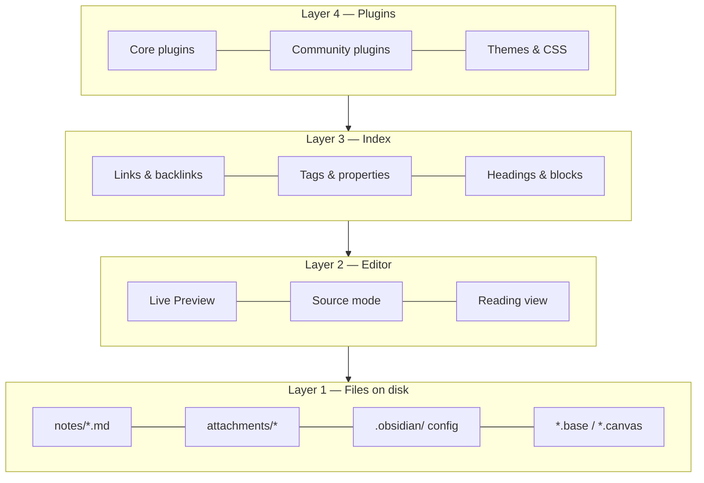
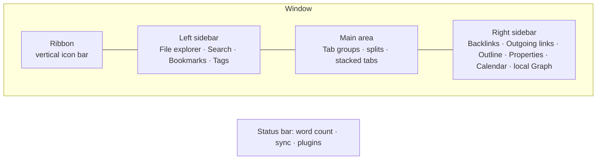
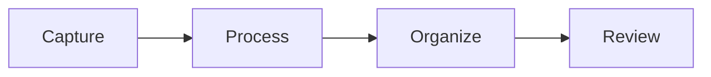
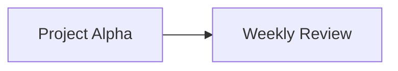
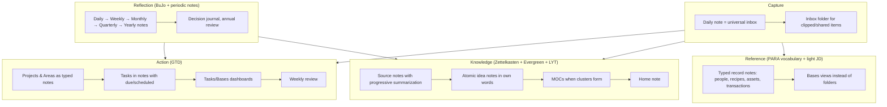
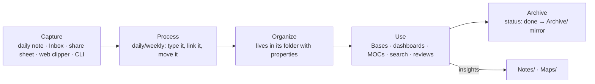
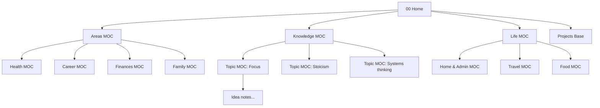

# The Complete Obsidian Mastery Guide

> Single-file edition. Generated automatically from the chapter files in `docs/` by `scripts/build_guide.py`. The web edition lives at <https://gorg667.github.io/obsidian-guide/>.

## Table of contents

1. [Philosophy and Mental Model](#philosophy-and-mental-model)
2. [Setup, Settings and Interface](#setup-settings-and-interface)
3. [Markdown and Editing Mastery](#markdown-and-editing-mastery)
4. [Links, Backlinks, Graph and Canvas](#links-backlinks-graph-and-canvas)
5. [Properties, Tags and Metadata Design](#properties-tags-and-metadata-design)
6. [Search Mastery](#search-mastery)
7. [PKM Methodologies Compared](#pkm-methodologies-compared)
8. [Vault Architecture — the Reference Design](#vault-architecture-the-reference-design)
9. [Core Plugins — Every One, Mastered](#core-plugins-every-one-mastered)
10. [Bases — the Native Database](#bases-the-native-database)
11. [Templates and Templater](#templates-and-templater)
12. [Dataview — Queries and Scripting](#dataview-queries-and-scripting)

---

# Philosophy and Mental Model

Most people who "fail" with Obsidian do not fail because of a missing feature. They fail because they carry a mental model from another tool — Notion's databases, Evernote's notebooks, Apple Notes' folders — and fight Obsidian instead of using it. This chapter installs the correct mental model. Everything later in the guide builds on it.

## What Obsidian actually is

Strip away the marketing and Obsidian is four things stacked on top of each other:

1. **A folder of plain-text files on your disk.** The vault is a directory. Every note is a `.md` file. Attachments are ordinary files. Configuration is JSON in a hidden `.obsidian/` folder. Nothing is stored in a proprietary database. You can open the folder in Finder or Explorer, `grep` it, back it up with any tool, or point another editor at it.
2. **A Markdown editor with a live-rendering mode.** It is a good editor — multi-cursor, Vim mode, folding, a formatting menu, tables, callouts — but it is still fundamentally editing text.
3. **A link-and-metadata index.** Obsidian scans your vault and builds an in-memory index of links, backlinks, tags, properties, headings and blocks. The graph view, backlinks pane, Bases, and every query plugin read from this index.
4. **A plugin platform.** Core plugins (shipped with the app, toggleable) and community plugins (open-source, installed from a directory) extend all three layers above. The app itself is Electron on desktop and Capacitor on mobile, and plugins are JavaScript with full access to the vault and the UI.



The reason this matters: **the file layer is the truth**. Everything above it is a view. If Obsidian disappeared tomorrow you would lose nothing but convenience. This is the "file over app" principle that Obsidian's CEO Steph Ango has written about, and it has practical consequences throughout this guide: prefer formats and conventions that survive without Obsidian, and treat plugins as accelerators, not as the place where your data lives.

## The five primitives

Everything you will ever build in Obsidian is a combination of five primitives. Learn to see them.

### 1. Notes (files)

A note is a file. Its **title is its filename**. This is more consequential than it sounds:

- Filenames cannot contain `/ \ : * ? " < > |` and Obsidian also forbids `#`, `^`, `[`, `]` and `|` in note names because they conflict with link syntax.
- Renaming a note is a filesystem rename, and Obsidian rewrites every link that points to it (if the setting is on — keep it on).
- Two notes cannot share a name in the same folder, but *can* share a name in different folders — which makes `[[Name]]` links ambiguous. Avoid this.
- Because the title is the filename, "what should I call this note?" is a real design decision. The methodology chapter covers naming conventions in depth.

A note optionally has **properties** (YAML frontmatter), a body of Markdown, and any number of headings and blocks that can be addressed individually.

### 2. Links

A link is a pointer from one note to another: `[[Target]]`, `[[Target#Heading]]`, `[[Target#^blockid]]`, or `[[Target|Shown text]]`. Links are the connective tissue of a vault and the thing Obsidian does better than any competitor. Key properties:

- **Links are bidirectional in the index.** Write `[[Berlin]]` in your travel note and the Berlin note's backlinks pane now shows the travel note — with no action on your part.
- **Links can point to notes that don't exist yet.** They render dimmer and become real the moment you click them. This lets you link *first* and write *later*, which is the core of "bottom-up" knowledge building.
- **Unlinked mentions** surface places where a note's name appears as plain text, offering one-click linking.
- **Embeds** are links with a `!` prefix: `![[Target]]` shows the target's content inline. You can embed notes, headings, blocks, images, PDFs (with page numbers), audio, video, canvases, and bases.

### 3. Tags

`#tag` and `#nested/tag`, in the body or in the `tags` property. Tags are lightweight, cross-cutting labels. They are cheap to add and cheap to query. They are also the most over-used primitive by beginners; Chapter 5 gives a decision framework for tags vs properties vs links vs folders.

### 4. Properties (metadata)

Structured `key: value` data at the top of a note in YAML. Since Obsidian 1.4 they have typed UI (text, list, number, checkbox, date, datetime), and since 1.9 they are the fuel for Bases. Properties turn a pile of notes into a *database* without leaving plain text. A note with:

```yaml
---
type: book
author: "[[Cal Newport]]"
status: reading
rating: 4
started: 2026-08-14
tags: [productivity, focus]
---
```

…is simultaneously a readable page and a row in any table you care to build.

### 5. Folders

Folders are the physical location of a file. They are the primitive people over-invest in first and regret later, because a note can live in only one folder while it can have unlimited links, tags, and properties. Folders still matter — for attachment routing, for templates that auto-apply per folder, for Bases filters like `file.inFolder("Projects")`, and for keeping the file explorer sane — but they should be *few and stable*.

## The three ways to organize, and why you need all of them

There are three fundamentally different organizing strategies, and mature vaults use all three deliberately:

| Strategy | Primitive | Strengths | Weaknesses | Use it for |
| --- | --- | --- | --- | --- |
| **Hierarchy** | Folders | Familiar, physical, works with any tool, supports per-folder automation | One location per note; deep trees rot; encourages filing over thinking | A small number of top-level "kinds of thing" (e.g. `Notes`, `Journal`, `Projects`, `Sources`, `Templates`, `Attachments`) |
| **Network** | Links, MOCs | Emergent structure; supports multiple contexts; serendipity via backlinks | Needs active tending; can become an undifferentiated hairball | Ideas, concepts, people, projects — anything with relationships |
| **Attributes** | Tags, properties | Precise filtering and sorting; enables dashboards; machine-readable | Requires discipline and a schema; meaningless without queries | Status, type, dates, ratings, categories — anything you want to *query* |

The single most useful habit is to ask, for each note, "which of these strategies does this note need?" A meeting note needs attributes (date, attendees, project) and links (to the people and the project) but no special folder. A permanent idea note needs links above all. A recipe needs attributes (cuisine, time, servings) and belongs to one obvious folder.

## Bottom-up vs top-down

Two schools argue about how to build a vault.

**Top-down** designs the structure first: folders, templates, property schemas, MOCs, dashboards. Then notes are filed into it. This is how most productivity content online approaches Obsidian and it produces beautiful screenshots. Its failure mode is a cathedral with no congregation — an elaborate system you stop using after three weeks because maintaining it is a job.

**Bottom-up** writes notes first, links freely, and lets structure emerge. When a cluster of notes becomes noticeable, you create a Map of Content (MOC) to index it. When a pattern of properties recurs, you formalize a template. This is the Zettelkasten / LYT lineage. Its failure mode is a swamp — thousands of notes with no way in.

The guide's position: **structure the containers top-down, let the content grow bottom-up.** Decide your folder skeleton, your note types, your property schema, and your naming conventions up front (Chapter 8 gives you a complete one). Then within that skeleton, write and link without asking permission from your system. Create MOCs and dashboards only when the volume of notes demands them.

## Two modes of use: retrieval and thinking

Obsidian serves two very different jobs and you should know which one you are doing at any moment.

**Retrieval** is "where did I put that?" — the Wi-Fi password, the recipe, the meeting decision, the article you clipped. Retrieval wants *predictability*: consistent names, consistent properties, consistent locations, good search. Bases, properties, folders, and search are the tools. Over-linking retrieval notes wastes time.

**Thinking** is "what do I believe about this?" — ideas, arguments, decisions, syntheses. Thinking wants *connection*: links to related ideas, backlinks that surface forgotten context, writing in your own words, revisiting. Links, MOCs, the local graph, and daily notes are the tools. Over-structuring thinking notes kills them.

A "whole life" vault contains both, and one of the reasons it is worth putting *everything* in Obsidian is that the boundary is porous: a retrieval note (a book you read) becomes a thinking note (what you took from it), and thinking notes feed action (a project). Keeping them in one place with one link syntax is the actual killer feature.

## What Obsidian is bad at (and what to do about it)

Honesty about limits saves months.

- **Real-time collaboration.** Two people editing the same note simultaneously is not a thing. Obsidian Sync supports multiple users on one vault, but with last-writer-wins at the file level (with version history to recover). For team wikis and shared docs, use something else and link to it.
- **Relational data with joins.** Bases and Dataview are excellent for single-table views over notes. Multi-table relational queries are possible (DataviewJS) but awkward. If you need a real database — an inventory with thousands of SKUs, accounting — use one, and keep the *narrative* in Obsidian.
- **Heavy attachments.** Obsidian stores files fine, but a vault with 50 GB of video syncs badly and indexes slowly. Keep large media outside the vault and link to it, or in a separate vault.
- **Rich text fidelity.** Markdown cannot represent every formatting nuance of a Word document. If you need pixel-perfect documents, write in Obsidian and export via Pandoc.
- **Structured forms and input validation.** Plugins like Meta Bind get you far, but there is no native form builder.
- **Mobile power features.** Mobile Obsidian is remarkably complete, but plugins with heavy UI, huge vaults, and Git-based sync are painful on phones. Design mobile workflows for *capture and reading*, not administration.
- **Being a calendar or email client.** It can display calendars (plugins) and you can email into it (automation), but it should not replace them.

## Principles that survive every chapter

These come up again and again. Internalizing them now makes the rest of the guide faster.

!!! tip "1. Plain text is the API"
    Any feature that stores its data as human-readable text in your notes (properties, tasks, inline fields, callouts) is durable and portable. Any feature that stores data in `.obsidian/plugins/*/data.json` is convenient but fragile. Prefer the former for anything you would grieve losing.

!!! tip "2. Titles are links"
    Because the filename is both the title and the link target, name notes the way you would *refer to them in a sentence*. `[[Cal Newport]]` reads naturally; `[[newport_cal_author]]` does not. Aliases handle synonyms.

!!! tip "3. Friction goes at the exit, not the entrance"
    Capturing must be near-zero-friction (hotkey, template, mobile share sheet). Processing — deciding where a note lives, what it links to — can be batched later in a review. Systems that demand perfect filing at capture time die.

!!! tip "4. Query, don't file"
    If you find yourself maintaining a list by hand — "all open projects", "books to read", "recent meetings" — stop. That list should be a Base or a Dataview query driven by properties. Hand-maintained lists are always out of date.

!!! tip "5. One vault unless you have a reason"
    Links do not cross vaults. Search does not cross vaults. Every split costs you connections. Legitimate reasons to split: legal separation (work confidentiality), radically different sync requirements, or a vault that is really a project (a book manuscript, a shared family vault). "It feels cleaner" is not a reason.

!!! tip "6. Plugins are power tools — count them"
    Every plugin is code running with full access to your files, load time on mobile, and a maintenance dependency. A healthy vault has 10–25 community plugins that you can each name the purpose of. Chapter 14 gives tiers; Chapter 32 gives an audit routine.

!!! tip "7. Build for the tired version of you"
    You will use the vault at 11 pm, on a phone, after a bad day. Templates, hotkeys, and dashboards exist so the system works when your willpower does not.

## The four layers of mastery

It helps to know where you are and what comes next. Most users plateau at layer 2.

| Layer | You can… | Typical signs | This guide's chapters |
| --- | --- | --- | --- |
| **1. Editor** | Write Markdown, make links, use folders, search | Vault looks like a fancier Apple Notes | 2, 3, 4 |
| **2. Networker** | Use backlinks deliberately, MOCs, daily notes, tags, a few plugins | Graph view has recognizable clusters | 5, 6, 7, 9 |
| **3. Systems builder** | Design property schemas, templates, Bases/Dataview dashboards, task system, reviews | You *query* your vault; you rarely make lists by hand | 8, 10–13, 15–25 |
| **4. Operator** | Automate with CLI/URI/scripts, integrate external apps and AI, customize the UI, write small plugins, maintain and migrate at scale | The vault is your life's control panel and it runs itself | 26–34 |

The [Mastery Roadmap](35-mastery-roadmap.md) turns this into a schedule.

## Key takeaways

- Obsidian is a folder of text files plus an index plus plugins. The files are the truth; everything else is a view.
- Five primitives — notes, links, tags, properties, folders — combine into every system you will build. Learn to see them.
- Use hierarchy for containers, network for ideas, attributes for anything you will query. Mature vaults use all three deliberately.
- Structure containers top-down; let content grow bottom-up.
- Know whether a note is for *retrieval* or *thinking* and organize accordingly.
- Prefer plain-text-stored features, query instead of filing, keep one vault, count your plugins, and design for your tired self.

## Next

[Chapter 2: Setup, Settings and Interface →](#setup-settings-and-interface)

---

# Setup, Settings and Interface

A vault configured thoughtfully in the first hour saves hundreds of small frustrations later. This chapter is a complete audit: every setting that materially affects how you work, what to set it to and why, plus the interface anatomy and keyboard-first habits that separate fluent users from clickers.

## Installation and installer versions

Obsidian has two version numbers and confusing them causes real problems.

- **App version** (e.g. 1.13.4) — the JavaScript application. Updates automatically in-app on desktop; via the store on mobile.
- **Installer version** — the Electron shell (Chromium + Node) the app runs in. It only updates when you **download and reinstall from obsidian.md**. Check it under **Settings → General → About** ("Installer version").

!!! warning "Reinstall the installer at least once a year"
    Features like the Obsidian CLI require installer 1.12.7+, Bases performance improved with newer Electron builds, and several rendering bugs are installer-level. Reinstalling does not touch your vault. On Windows use the same edition (system vs. per-user) you originally installed to avoid two copies.

| Platform | Recommended install | Notes |
| --- | --- | --- |
| Windows | Official installer from obsidian.md | winget (`winget install Obsidian.Obsidian`) also works and tracks installer versions. |
| macOS | Official DMG or `brew install --cask obsidian` | Universal build; Apple Silicon native. |
| Linux | AppImage (most portable), Flatpak, Snap, or `.deb` | Flatpak and Snap sandbox file access; the CLI and some sync tools work best with AppImage or `.deb`. If using Flatpak, grant filesystem access with Flatseal to your vault folder. |
| iOS/iPadOS | App Store | Vault location: "On My iPhone/Obsidian" (local) or iCloud Drive. See [Sync](26-sync-backup-security.md). |
| Android | Play Store, F-Droid, or GitHub APK | Grant "All files access" for vaults outside app storage. |

## Where to put the vault

Decide this once. Moving later is possible but annoying.

- **Local disk, non-synced folder** — fastest, safest for plugins, zero conflicts. Use if you sync with Obsidian Sync, Git, or Remotely Save (they handle sync themselves).
- **iCloud Drive / OneDrive / Dropbox / Google Drive folder** — works on desktop; on mobile only iCloud is natively supported by Obsidian (iOS). Risks: "files on demand" placeholders (OneDrive) break indexing; conflicts create duplicate files; `.obsidian/` config churn triggers constant re-upload. If you must, exclude nothing and turn off "files on demand" for the vault folder.
- **Syncthing folder** — excellent on desktop and Android; not available on iOS.
- **Network drive / NAS** — avoid. Latency makes the editor sluggish and file watchers unreliable. Obsidian 1.13 warns when loading HTML resources from network paths for the same reason.

Chapter 26 has the full sync matrix.

## Vault-level decisions before you write

1. **One vault or several?** One, unless you have a hard reason (Chapter 1, principle 5). You *can* keep a scratch vault for experimenting with plugins.
2. **Attachment folder.** Set **Settings → Files and links → Default location for new attachments** to *In the folder specified below* → `Attachments` (or `_attachments`, `zz-attachments` to sort last). Never leave it as "vault root" or "same folder as current file" unless you like clutter.
3. **Link format.** *Wikilinks* (`[[Note]]`) are the Obsidian default, faster to type, and every plugin understands them. *Markdown links* (`[Note](Note.md)`) are more portable to other tools and required by some publishing pipelines. For the path style, **Shortest path when possible** produces clean `[[Note]]` links but is only safe if you keep filenames unique across the vault; **Absolute path in vault** produces `[[Folder/Note]]` and is unambiguous but noisier; **Relative path to file** breaks when notes move. Recommendation for a whole-life vault: Wikilinks on, unique filenames enforced by convention, shortest path.
4. **New note location.** *Same folder as current file* is the least surprising once you have a folder skeleton; combined with an `Inbox` folder as your default landing zone for quick capture.
5. **Naming convention.** Decide capitalisation (Title Case vs sentence case) and whether dates are `YYYY-MM-DD`. Decide now; consistency matters more than the choice.

## The complete settings audit

Settings are searchable since 1.13 (++ctrl+comma++ then type). Below, every setting that matters, grouped as Obsidian groups them. Defaults are fine where a setting is not listed.

### General

| Setting | Recommended | Why |
| --- | --- | --- |
| Automatic updates | On | Security and Bases/CLI improvements ship often. |
| Command line interface | On (desktop) | Enables `obsidian` CLI — see Chapter 29. Follow the prompt to register PATH. |
| Language | Your choice | Affects UI only, not your notes. |

### Editor

| Setting | Recommended | Why |
| --- | --- | --- |
| Default editing mode | Live Preview | WYSIWYG-ish while still Markdown. Switch to Source with ++ctrl+e++ (toggle) when you need to see raw syntax. |
| Default view for new tabs | Editing view | Reading view is for consumption; you are mostly writing. |
| Show line numbers | Off (on for code-heavy notes via `cssclasses`) | Noise for prose. |
| Readable line length | On | ~700px measure; disable per note with a CSS class if you need wide tables. |
| Strict line breaks | Off | With off, a single newline renders as a line break (like most note apps). With on, you need two spaces or a blank line — stricter CommonMark. Off is friendlier; on is more portable. Pick and never change (it changes how existing notes render). |
| Properties in document | Visible | Shows the typed property editor. "Source" shows raw YAML; "Hidden" hides it. |
| Show indentation guides | On | Helps with nested lists and tasks. |
| Fold heading / Fold indent | On | You will use folding constantly in long notes. |
| Spellcheck | On; add languages | Right-click → Add to dictionary for your jargon. |
| Auto pair brackets / Markdown syntax | On | Typing `[[` yields `[[]]`. |
| Smart indent lists | On | Tab/Shift-Tab indent list items. |
| Vim key bindings | Off unless you are a Vim user | If you are, it is remarkably complete (see Chapter 3). |
| Auto convert HTML | On | Pasting from the web becomes Markdown. |
| Indent using tabs / Tab size | Spaces, 4 (or tabs) | Some plugins (Tasks, Dataview) were historically picky about mixed indentation. Consistency is what matters. |

### Files and links

| Setting | Recommended | Why |
| --- | --- | --- |
| Confirm file deletion | On | Your trash is one accidental ++del++ away. |
| Deleted files | Move to Obsidian trash (`.trash` folder) | Recoverable within the vault; system trash is the alternative. Chapter 32 covers File Recovery. |
| Always update internal links | On | The reason renaming is safe. |
| Automatically delete attachments | Ask every time (1.12+) | When you delete a note, Obsidian offers to delete attachments only that note used. |
| Default location for new notes | Same folder as current file, *or* a fixed `Inbox` | See above. |
| New link format | Shortest path when possible (unique names) | See above. |
| Use Wikilinks | On | Toggle off only for portability requirements. |
| Detect all file extensions | Off (on temporarily to find stray files) | Otherwise your explorer shows `.DS_Store` and friends. |
| Default location for new attachments | In the folder specified below → `Attachments` | See above. |
| Excluded files | Add `Templates/`, `Attachments/`, `Archive/` if noisy | Excluded files are dimmed in search/suggestions/graph but still linkable and still indexed. Use it liberally for templates so `[[` suggestions are not polluted. |

### Appearance

| Setting | Recommended | Why |
| --- | --- | --- |
| Base color scheme | Adapt to system | Toggle command exists (1.10 replaced the separate light/dark commands with a single **Toggle light/dark mode**). |
| Accent color | Your call | Also used by links and selection. |
| Font size | 16 (desktop) | Zoom with ++ctrl+plus++ / ++ctrl+minus++ as needed. |
| Interface / text / monospace font | System UI; a good reading font (e.g. Inter, iA Writer Duo, Source Serif); JetBrains Mono / Fira Code | Fonts must be installed on each device. |
| Quick font size adjustment | On | ++ctrl++ + scroll. |
| Show inline title | On | The filename rendered as an H1 at the top; means you do not put `# Title` in the body. |
| Show tab title bar | On (desktop) | Off saves vertical space, but you lose the breadcrumb. |
| Ribbon | Reorder / hide items you never click | Right-click the ribbon → Configure. |
| Native menus (macOS) | Off | Obsidian's own menus are more consistent across platforms. |
| Window frame | Hidden (native title bar off) | Less chrome. |
| Zoom level | 100% | |
| Themes / CSS snippets | See Chapter 28 | |

### Hotkeys

Chapter 37 has the complete default list. The philosophy: leave defaults alone unless they conflict, and add hotkeys for the ~15 commands you use hourly. Non-negotiable additions for most people:

| Command | Suggested hotkey | Reason |
| --- | --- | --- |
| Toggle left / right sidebar | ++ctrl+alt+left++ / ++ctrl+alt+right++ (or click) | Focus mode on demand. |
| Open today's daily note | ++ctrl+shift+d++ | Your home base. |
| Insert template | ++alt+t++ | Constantly used until Templater takes over. |
| Toggle reading view | ++ctrl+e++ (default) | |
| Focus on last note / Focus on tab group | | Useful with split panes. |
| Move current file to another folder | ++ctrl+shift+m++ | Processing your inbox. |
| Add file property | ++ctrl+semicolon++ | Metadata without leaving the keyboard. |
| Toggle bullet / checkbox | ++ctrl+l++ (default toggles checkbox) | |
| Navigate back / forward | ++alt+left++ / ++alt+right++ | Web-browser habits. |
| Search in all files | ++ctrl+shift+f++ | |
| Open command palette | ++ctrl+p++ | |
| Open quick switcher | ++ctrl+o++ | |
| Toggle Bases view / Open Bases | | Once you build dashboards. |

!!! tip "Hotkeys are stored in `.obsidian/hotkeys.json`"
    Sync that file (Obsidian Sync can sync hotkeys; Git syncs everything) so your muscle memory survives device changes.

### Core plugins

Turn on: File explorer, Search, Quick switcher, Graph view, Backlinks, Outgoing links, Canvas, Daily notes, Templates, Note composer, Command palette, Bookmarks, Outline, Word count, File recovery, Page preview, Properties view, Tags view, Bases, Slash commands (optional), Unique note creator (if you use Zettelkasten IDs), Workspaces (once you have layouts), Web viewer (if you want in-app browsing), Random note (for serendipitous review), Importer (when migrating), Footnotes view (if you write academically), Sync/Publish (if subscribed), Slides (rarely). Chapter 9 details each.

### Community plugins

Turn off **Restricted mode**. Since 1.13 you can exit Restricted mode *without* re-enabling plugins, which is useful for debugging. Install nothing yet; Chapter 14 curates. The **Check for updates** button is in this tab — do it weekly.

### Sync / Publish

See Chapters 26 and 31. Notable 1.13 behaviour: Sync warns before syncing plugins between devices (because plugin data can be device-specific), and the status-bar icon no longer spins to save battery.

## Interface anatomy



**Ribbon.** Vertical strip of icons on the far left. Every core and community plugin can add one. Right-click → hide the ones you never click; the actions remain in the command palette.

**Sidebars.** Both hold *tabs of views*. Drag any view between sidebars or into the main area (a Backlinks view in the main area is a legitimate way to review connections). Collapse with the small arrows or hotkeys. Pin a sidebar tab to keep it visible.

**Main area.** Tabs, like a browser. Split any tab horizontally/vertically (right-click the tab → Split, or drag it to an edge). A *tab group* is a set of tabs sharing a pane. **Stacked tabs** (right-click tab header → Stack tabs) turns a group into Andy Matuschak-style sliding cards — outstanding for research where you open six notes from one MOC.

**Status bar.** Bottom right: word/character count, backlink count, sync status, plugin indicators. Click items for menus. Hide with CSS if you prefer minimal.

**Tab title bar / inline title.** The breadcrumb (folder › note) and the note's H1-like title. Click the breadcrumb to navigate the folder; click the inline title to rename.

**Settings window.** Since 1.13 opens in a separate window with search and keyboard navigation (arrows to move, ++enter++ to open, ++ctrl+f++ to focus search). Disable "Open settings in new window" under Interface if you prefer the modal.

**Pop-out windows.** Drag a tab out of the app to make it a standalone window (desktop). Useful for a reference note on a second monitor.

## Navigation you should do from the keyboard

The fluent-user baseline. Everything else is optional; these are not.

- **Command palette** ++ctrl+p++ — type any command. Pin favourites (Settings → Command palette) to the top. Also try `>` prefix in Quick switcher.
- **Quick switcher** ++ctrl+o++ — fuzzy-find by filename. Type a new name and ++enter++ to create. ++shift+enter++ creates even if a fuzzy match exists. ++ctrl+enter++ opens in a new tab. Since 1.12 results can be dragged.
- **Search** ++ctrl+shift+f++ — full-text with operators (Chapter 6). ++ctrl+f++ searches within the current note.
- **Follow link under cursor** ++alt+enter++ (or ++ctrl+enter++ to open in a new tab). Hover with ++ctrl++ for a page preview.
- **Back / forward** ++alt+left++ / ++alt+right++ (++cmd+bracket-left++ / ++cmd+bracket-right++ on mac).
- **Go to next/previous tab** ++ctrl+tab++ / ++ctrl+shift+tab++; go to tab N ++ctrl+1++ … ++ctrl+9++.
- **Close tab** ++ctrl+w++; **reopen closed tab** ++ctrl+shift+t++.
- **Toggle sidebars** — assign hotkeys.
- **Reveal current file in navigation** — assign; essential in big trees.
- **Fold/unfold** ++ctrl+up++ / ++ctrl+down++ at heading; **Fold all / Unfold all** commands.
- **Focus on editor** ++esc++ from most panes.

## Workspaces and layouts

The **Workspaces** core plugin saves the entire layout (which panes, which files, which sidebar tabs) under a name and restores it in one command. Build three or four:

- **Writing** — single pane, sidebars collapsed, Outline in right sidebar.
- **Planning** — daily note left, task dashboard right, Calendar in sidebar.
- **Research** — stacked tabs in main, Backlinks + local Graph on the right.
- **Review** — weekly note, project Base, Habit tracker.

Save with *Workspaces: Save layout*, load with *Workspaces: Load layout*. The Obsidian CLI can load them (`obsidian workspace:load name=Planning`), which means a shell alias or a Raycast/Alfred/AutoHotkey script can put you in a mode instantly. Chapter 29 shows this.

!!! note "Workspaces + mobile"
    Mobile has its own layout; workspaces are per-device. The **Workspaces Plus** community plugin adds a switcher and per-workspace settings on desktop.

## Multiple vaults strategy (if you really need it)

- Vaults are completely isolated: separate plugins, settings, index. Cross-vault links use `obsidian://open?vault=Other&file=Note` URIs (they work but feel foreign).
- Share configuration between vaults with a symlink of `.obsidian/` subfolders (snippets, themes) — fragile with sync; do it only on a single machine.
- **Change vault…** (renamed *Manage vaults* in 1.12) lists vaults; the **Open vault…** command (1.12) opens another vault while keeping the current one open. The CLI accepts `vault=Name` as the first parameter.

## First-hour checklist

- [ ] Installer updated; app updated.
- [ ] Vault created in a sensible location; sync approach chosen (Chapter 26).
- [ ] Attachments folder set; excluded files set; link format decided.
- [ ] Editor: Live Preview, readable line length, folding, spellcheck, indentation guides.
- [ ] Appearance: theme (Chapter 28), inline title on, fonts.
- [ ] Core plugins enabled per list above; Restricted mode off.
- [ ] Hotkeys added for daily note, insert template, sidebars, move file, add property.
- [ ] Folder skeleton created (Chapter 8) with `Inbox`, `Templates`, `Attachments` at minimum.
- [ ] Templates folder set in **Templates** core plugin settings; Daily notes folder + format set.
- [ ] `.obsidian/` backed up (Chapter 26).

## Key takeaways

- App version and installer version are different; reinstall the installer periodically.
- Put the vault on a local disk unless your sync method requires a synced folder; avoid network drives.
- Decide attachments folder, link format, new-note location, and naming convention in the first hour.
- Learn the ten keyboard navigation commands; they are the difference between using Obsidian and living in it.
- Use Workspaces (and later the CLI) to switch between purpose-built layouts.

## Next

[Chapter 3: Markdown and Editing Mastery →](#markdown-and-editing-mastery)

---

# Markdown and Editing Mastery

Obsidian speaks a specific dialect: CommonMark plus GitHub-Flavored Markdown extensions plus its own additions (wikilinks, embeds, callouts, block IDs, comments, highlights, properties). Knowing the entire dialect — including the odd corners — lets you write faster, produce notes that render the way you intend, and understand why a query or plugin behaves the way it does. This chapter is the complete reference plus the editing techniques that make writing in Obsidian genuinely fast.

## The three views

| View | Shortcut | What it shows | Use it for |
| --- | --- | --- | --- |
| **Live Preview** | default editing mode | Rendered Markdown that turns into raw syntax where your cursor is | 90% of writing |
| **Source mode** | toggle via command *Toggle Live Preview/Source mode* (assign a hotkey) | Raw text, syntax highlighted | Fixing tables, YAML, nested structures, stubborn formatting |
| **Reading view** | ++ctrl+e++ | Fully rendered, read-only; embeds, queries and Bases render fully | Reading, reviewing dashboards, copying rendered text |

!!! tip "Two-pane editing"
    Right-click a tab → *Open linked view* → *Open in reading view* gives you a side-by-side render that follows your scroll. Useful for complex tables and Mermaid.

In Reading view, if nothing is selected, ++ctrl+c++ copies the *full source* of the note (1.10+). Copying from the editor includes HTML formatting on the clipboard (1.12+) so pasting into Google Docs preserves headings and bold.

## Headings and structure

```markdown
# H1 — avoid in body if "Show inline title" is on (the filename is your H1)
## H2 — main sections
### H3 — subsections
#### H4 …up to ###### H6
```

- Headings are link targets: `[[Note#Heading]]`. Renaming a heading does **not** update links to it automatically unless you rename via the Outline pane or the right-click *Rename* on the heading, which does.
- Headings are foldable (Settings → Editor → Fold heading). ++ctrl+up++/++ctrl+down++ fold/unfold at cursor.
- The Outline pane and the *Go to heading* commands (community: Quiet Outline, or the core Outline view) navigate by heading.
- **Note composer** (core) can *extract* a heading's section into a new note and leave a link or embed behind. Since 1.13 it also rewrites links inside the extracted section to be relative to their new home.

## Paragraphs and line breaks

With **Strict line breaks off** (recommended), a single ++enter++ renders as a line break. With it on, you need two trailing spaces, a backslash `\`, or a blank line. Paragraphs are separated by a blank line either way. ++shift+enter++ inserts a hard break `<br>`-equivalent regardless of setting.

## Emphasis and inline formatting

| Syntax | Result | Notes |
| --- | --- | --- |
| `*italic*` or `_italic_` | *italic* | ++ctrl+i++ |
| `**bold**` or `__bold__` | **bold** | ++ctrl+b++ |
| `***bold italic***` | ***bold italic*** | |
| `~~strike~~` | ~~strike~~ | |
| `==highlight==` | ==highlight== | Obsidian-specific; searchable; styled per theme |
| `` `code` `` | `code` | Inline code; ++ctrl+`++ in some themes/plugins |
| `<u>underline</u>` | <u>underline</u> | No Markdown syntax; use HTML |
| `<sup>2</sup>` / `<sub>2</sub>` | superscript / subscript | HTML |
| `<kbd>Ctrl</kbd>` | keyboard key | HTML; themes style it |
| `<mark>text</mark>` | highlight | Alternative to `==` |
| `<span style="color:red">red</span>` | inline colour | Works but is not portable; prefer CSS classes |
| `%%hidden%%` | (nothing) | Obsidian **comment** — invisible in Reading view and Publish; visible in edit modes. Multi-line: `%%` on its own lines. Always exactly two `%`. |

The **formatting menu** (right-click or the mobile toolbar) offers all of these plus tables and lists for when you forget syntax.

## Lists

```markdown
- Unordered with hyphen (preferred), * or +
    - Nested with 4 spaces or a tab (be consistent — Settings → Editor → Indent using tabs)
1. Ordered
2. Numbers auto-renumber in Live Preview
   1. Nested ordered
- [ ] Task
- [x] Completed task
- [-] Cancelled (rendered by many themes; Tasks plugin treats as cancelled)
- [/] In progress (theme-dependent; see custom checkboxes below)
```

Editing power:

- ++tab++ / ++shift+tab++ indent/outdent list items (Smart indent lists on).
- ++alt+up++ / ++alt+down++ **move line up/down** — with a list item, moves the whole item (and its children with the *Outliner* plugin).
- ++ctrl+enter++ on a task toggles its checkbox; ++ctrl+l++ cycles bullet → checkbox → checked.
- ++enter++ on an empty list item ends the list.
- *Toggle bullet list*, *Toggle numbered list* commands convert selected paragraphs.
- The **Outliner** community plugin adds workflowy-style behaviours (drag-reorder, fold, select whole subtree); **Zoom** focuses on a single subtree.

**Custom checkbox statuses.** `- [?]`, `- [!]`, `- [>]`, `- [<]`, `- [i]`, `- [*]`, `- ["]`, `- [l]`, `- [b]`, `- [S]`, `- [I]`, `- [p]`, `- [c]`, `- [f]`, `- [k]`, `- [w]`, `- [u]`, `- [d]` are all just characters in brackets. Themes like Minimal and AnuPpuccin style many of them (question, important, forwarded, scheduled, info, star, quote, location, bookmark, savings, idea, pros, cons, fire, key, win, up, down). The Tasks plugin can map each to a status type (Todo / In Progress / Done / Cancelled / Non-task). The CLI's `tasks status="?"` filters by them.

## Tables

```markdown
| Column | Aligned right | Centered |
| --- | ---: | :---: |
| Cell | 12.50 | yes |
| Pipe in cell needs escaping \| like this | | |
```

- Live Preview has a table editor: click a cell to edit; ++tab++ moves right; ++enter++ moves down; right-click a cell for insert/delete row/column, align, move. The formatting menu → *Insert table* creates one.
- Inside a cell, `\|` is a literal pipe; `<br>` is a line break.
- Links inside tables work, including embeds (they render small).
- The **Advanced Tables** plugin adds spreadsheet-like formulas (`<!-- TBLFM: @>$3=sum(@I..@-1) -->`), auto-formatting, Excel-style navigation. Since core table editing improved, Advanced Tables is mainly for formulas and CSV import/export.
- Large data tables belong in Bases, not Markdown tables (Chapter 10). Markdown tables are for small, hand-written matrices.

## Blockquotes and callouts

```markdown
> Quote line
> — Attribution
```

**Callouts** are Obsidian's boxed, coloured, optionally collapsible blocks:

```markdown
> [!note] Optional title
> Body. Supports **Markdown**, [[links]], lists, code, nested callouts.

> [!tip]- Collapsed by default (minus sign)
> Hidden until clicked.

> [!warning]+ Expanded by default but collapsible (plus sign)
> Content.

> [!custom-type] Unknown types fall back to "note" styling and can be styled with CSS
```

Built-in types and aliases: `note`, `abstract`/`summary`/`tldr`, `info`, `todo`, `tip`/`hint`/`important`, `success`/`check`/`done`, `question`/`help`/`faq`, `warning`/`caution`/`attention`, `failure`/`fail`/`missing`, `danger`/`error`, `bug`, `example`, `quote`/`cite`.

Custom callouts via CSS snippet (note the **1.13 change**: `--callout-color` now takes a full CSS colour, not an RGB triplet):

```css
.callout[data-callout="decision"] {
  --callout-color: #7c3aed;
  --callout-icon: lucide-gavel;
}
```

Callouts are the right tool for: summaries at the top of long notes, decision records, warnings inside procedures, foldable "details" sections, and dashboard sections (embed a Dataview query inside a callout). Do not use them as your only structure — headings remain the navigable unit.

## Code

````markdown
Inline `code`.

```python
def hello():
    print("fenced code block with language for syntax highlighting")
```

~~~
Tildes also fence.
~~~
````

- Language identifiers follow Prism.js names: `js`, `ts`, `python`, `bash`/`sh`, `yaml`, `json`, `css`, `html`, `sql`, `rust`, `go`, `java`, `c`, `cpp`, `csharp`, `powershell`, `markdown`, `latex`, `mermaid`, `dataview`, `dataviewjs`, `tasks`, `base`, `query` (embedded search), `meta-bind`, `button`, etc. Plugins register their own.
- Code blocks show a **Copy** button on hover in Reading view.
- Indented code (4 spaces) also works but is fragile in lists.
- To show a triple-backtick block *inside* Markdown (like this guide does), fence the outer block with four backticks or tildes.
- Line numbers in code: not native; the *Code Styler* plugin adds numbering, titles, folding, and highlighting lines.

## Links, embeds and block references

Covered in depth in Chapter 4; the syntax summary:

```markdown
[[Note]]                      wikilink
[[Note|Display text]]         alias display
[[Note#Heading]]              heading link
[[Note#Heading#Subheading]]   nested heading path
[[Note#^blockid]]             block link
[[#Heading]]                  heading in the current note
[Display](Note.md)            markdown link (URL-encode spaces as %20)
[Display](<Note with spaces.md>)  angle brackets avoid encoding
[Display](https://example.com)    external link
<https://example.com>         autolink
![[Note]]                     embed whole note
![[Note#Heading]]             embed a section
![[Note#^blockid]]            embed a block
![[image.png]]                embed image
![[image.png|300]]            image width 300px
![[image.png|300x200]]        width x height
![[document.pdf#page=5]]      PDF at page 5
![[document.pdf#height=600]]  PDF viewer height
![[audio.mp3]]  ![[video.mp4]]  media players
![[Drawing.canvas]]           embed a canvas
![[Tracker.base]]             embed a base
![[Tracker.base#ViewName]]    embed a specific base view
   external image
   external image sized (1.13+, Reading view)
```

Block IDs: type `^` followed by an identifier at the end of any paragraph/list item/table/callout: `Some paragraph. ^my-id`. Obsidian generates random ones (`^a1b2c3`) when you type `[[Note#^` and choose a block. IDs must be letters, numbers and hyphens.

## Footnotes

```markdown
Claim that needs a source.[^1] Inline footnote.^[This is written inline.]

[^1]: The footnote text. Can be multiple paragraphs if indented.
```

Footnotes render as superscripts with hover preview and a list at the bottom of Reading view. The **Footnotes view** core plugin (2025) shows them in a sidebar. Named footnotes `[^smith2020]` are fine.

## Math

```markdown
Inline: $E = mc^2$

Block:
$$
\int_0^\infty e^{-x^2}\,dx = \frac{\sqrt{\pi}}{2}
$$
```

MathJax 3. Most LaTeX math works; `\begin{aligned}`, `\begin{cases}`, matrices, `\text{}`. Currency: `$5 and $10` can trigger math — write `\$5` or enable *Auto pair Markdown syntax* awareness; the **Latex Suite** plugin adds snippets and autocompletion for heavy users.

## Diagrams: Mermaid

````markdown

````

Supported: flowchart, sequenceDiagram, classDiagram, stateDiagram, erDiagram, gantt, pie, gitGraph, mindmap, timeline, quadrantChart, xychart-beta, sankey-beta, C4. Mermaid version 11.13 as of Obsidian 1.13. Obsidian 1.13 shows a one-time banner asking to confirm rendering Mermaid in a vault (a security measure). Internal links inside Mermaid nodes work via `click A "obsidian://open?file=Note"` with a URI, or with the `class A internal-link` trick:

````markdown

````

(The node text must equal the note name.)

## HTML

Obsidian renders a safe subset of inline HTML: `<div>`, `<span>`, `<br>`, `<details><summary>`, ``, `<iframe>` (with restrictions), `<table>`, `<kbd>`, `<sup>`, `<sub>`, `<u>`, `<center>` (deprecated but works), `<font>`, `<mark>`, `<abbr title="">`. Scripts are stripped. Markdown *inside* HTML blocks is not rendered unless the block is simple inline HTML on a single line.

`<iframe src="https://…">` embeds web pages (YouTube, maps, Google Docs). Obsidian 1.10 fixed YouTube "Error 153" embeds. The Web viewer core plugin is usually better for browsing.

## Escaping

Backslash escapes any Markdown character: `\*not italic\*`, `\[\[not a link\]\]`, `\#not-a-tag`, `\|`, `\$`. Inside code spans nothing needs escaping. To show `[[wikilink]]` literally in prose, use a code span or escape the first bracket.

## Properties (frontmatter) syntax essentials

Full treatment in Chapter 5. Syntax reminders that trip people:

```yaml
---
title: "Colons: need quotes if the value contains a colon"
aliases:
  - Alias One
  - Alias Two
tags: [one, two/nested]         # or a bulleted list; no leading #
date: 2026-09-06                # date type
created: 2026-09-06T14:30:00    # datetime type
rating: 4                       # number
done: false                     # checkbox
author: "[[Cal Newport]]"       # link — MUST be quoted
related:
  - "[[Note A]]"
  - "[[Note B]]"
url: https://example.com
description: >-
  Multi-line folded text
  continues here.
cssclasses: [wide, no-inline-title]
---
```

- Frontmatter must start on line 1 with `---` and end with `---`.
- Wikilinks in YAML must be quoted or YAML sees a list.
- Since 1.13, text and list properties render Markdown links.
- Duplicate values in list properties are allowed (1.10+).

## Editing techniques that compound

### Selection and multi-cursor

- ++alt++ + click adds a cursor. ++ctrl+d++ (in many setups) or the *Add next occurrence* command via CodeMirror… Obsidian's built-in: ++alt+click++ for extra cursors; ++ctrl+shift+l++ style "select all occurrences" is not native — use *Find and replace* (++ctrl+h++) or the **Multi-cursor** behaviours from plugins like *Code Editor Shortcuts* (adds duplicate line, select word, expand selection, join lines, transform case, etc.).
- ++shift+alt+up++ / ++down++ **duplicate line** — with Code Editor Shortcuts.
- ++ctrl+shift+k++ delete line (plugin) — native is *Delete paragraph*.
- Double-click selects a word; triple-click a paragraph.
- ++ctrl+a++ selects all; inside an embedded Base cell (1.13) it now selects the cell text.

### Find and replace

- ++ctrl+f++ in-note find with match highlighting; ++ctrl+h++ find & replace within the note; supports regex (toggle in the panel).
- Vault-wide search & replace: not native. Use the **Regex Find/Replace** plugin, or VS Code / `sed` on the vault folder (safe because files are plain text — close Obsidian or let it reindex).

### Moving and restructuring

- ++alt+up++/++alt+down++ move line. *Swap line up/down* commands.
- **Note composer**: *Extract current selection* (to a new note, leaving a link), *Merge entire file with…* (append/prepend another note and redirect links). Configure whether it leaves a link, an embed, or nothing.
- **Note Refactor** plugin: extract by heading in bulk, with templates for the new note.
- Drag headings in the **Outline** pane to reorder sections (Outline supports drag-and-drop reordering).
- Drag a file from the explorer into the editor to insert a link; hold ++alt++ (mac: ++shift++?) to insert an embed — behaviour is platform-dependent; alternatively type `![[`.
- Drag text out to another pane to move it.

### Paste behaviours

- Pasting HTML converts to Markdown (setting). ++ctrl+shift+v++ pastes as plain text.
- Pasting an image from the clipboard saves it to the attachments folder as `Pasted image YYYYMMDDHHMMSS.png` and inserts an embed. Rename immediately (right-click → Rename) or use the **Paste image rename** or **Attachment Management** plugins to auto-name by note title.
- Pasting a URL onto selected text makes a Markdown link (with the *Paste URL into selection* plugin; native as of recent versions when text is selected).
- Since 1.13, dragging a folder into the app imports it preserving structure.

### Images

- Resize in Live Preview by dragging the corner (1.12); double-click the corner to reset.
- Select an image with keyboard (1.13); ++plus++/++minus++ resize, ++0++ reset, ++enter++ edit, ++tab++ edit size, ++del++ removes.
- Click or the Zoom button opens the **full-screen viewer** (1.13), navigable between all images in the note; drag to pan; swipe down to dismiss on mobile.
- Right-click → *Copy image* (1.12).
- `![[image.png|200]]` sizes by width. Alignment: not native — use `cssclasses` or the *Image Converter* plugin.

### Slash commands and autocompletion

- The **Slash commands** core plugin: type `/` at line start to search commands inline. Set a trigger character you rarely type.
- `[[` autocompletes notes and aliases; `[[Note#` headings; `[[Note#^` blocks; `#` tags; `[!` callout types; `:emoji:` with the *Emoji Shortcodes* plugin; property names when editing YAML.
- **Various Complements** adds word/phrase autocompletion from your vault and custom dictionaries.
- **Templater** commands run on trigger (Chapter 11).

### Vim mode

Turn on in Settings → Editor. Coverage: normal/insert/visual/visual-line, `:` Ex commands (`:w`, `:noh`, `:s`, `:%s`, `:image grow|shrink|reset` in 1.13 for images with counts), motions, text objects, registers, marks, `.` repeat, search `/`, macros. Missing: some plugins' UI ignore Vim; folding commands differ. The **Vimrc Support** plugin loads a `.obsidian.vimrc` with mappings (`imap jk <Esc>`), `exmap` for Obsidian commands (`exmap back obcommand app:go-back`), and `unmap`. Vim + Obsidian is a legitimate power setup for people who already think in Vim; everyone else should skip it.

### Focus and typewriter modes

- **Toggle sidebars** for focus.
- Community: *Typewriter Scroll* (keeps the cursor line centred, dims other paragraphs), *Focus Mode*, *Stille*.
- *Readable line length* off + zoom for presentation-style reading.

### Word count and reading time

Status bar word count (core Word count plugin) counts the selection when text is selected. *Better Word Count* adds character/sentence/page counts and per-folder totals; *Novel Word Count* shows counts in the file explorer.

## Rendering gotchas worth knowing

- A line starting with `#` followed by a space is a heading; without a space it is a tag. `#1` is not a tag (tags cannot be all-numeric); `#2026-goals` is fine.
- `*` at the start of a line starts a list; to start a paragraph with an asterisk, escape it.
- Numbered lists that start with a number other than 1 render starting from that number.
- Four spaces of indentation on a non-list line creates a code block. This bites when pasting.
- Two callouts in a row need a blank line between them or they merge.
- An embed inside a list item renders with the list indentation (fixed in 1.13).
- `%%%%` is *not* a special comment — comments are exactly two `%` (clarified in 1.13).
- Trailing `\` at end of line forces a line break (CommonMark).
- HTML comments `<!-- -->` are hidden in Reading view but *do* get published/exported; `%% %%` comments do not.

## Key takeaways

- Live Preview for writing, Source for surgery, Reading for consumption; learn the toggles.
- Callouts, block IDs, embeds with sizes, footnotes, math and Mermaid are all part of the core dialect — no plugin needed.
- Keep frontmatter YAML valid: quote wikilinks and colon-containing values.
- Invest in list-manipulation hotkeys, multi-cursor, Note composer, and paste behaviours; those are where minutes per day are saved.
- Know the rendering gotchas so notes render as intended in Obsidian, on Publish, and in other tools.

## Next

[Chapter 4: Links, Backlinks, Graph and Canvas →](#links-backlinks-graph-and-canvas)

---

# Links, Backlinks, Graph and Canvas

Linking is the feature that justifies Obsidian's existence. Everything else — Markdown editing, properties, plugins — exists in other tools. What Obsidian does uniquely well is make the *connections between notes* first-class: cheap to create, automatically bidirectional, navigable, queryable, and visualizable. This chapter covers the full mechanics of links, how to use backlinks as a thinking tool rather than a curiosity, how to make the Graph view actually useful, and how Canvas turns links into spatial thinking.

## Link anatomy

```markdown
[[Target]]
[[Target|Displayed text]]
[[Target#Heading]]
[[Target#Heading|Displayed]]
[[Target#^blockid]]
[[Target#^blockid|Displayed]]
[[Folder/Target]]                (path link — needed when names collide)
[[Target.md]]                    (extension optional for .md; required for other types: [[file.pdf]])
[[#Heading in this note]]
[[##Heading search across vault]]  (typing ## in the [[ suggester searches all headings)
```

### Resolution rules

When you write `[[Target]]` Obsidian looks for a file named `Target.md` (case-insensitive) anywhere in the vault. If there is exactly one, the link resolves. If there are several, the "shortest path" setting decides: Obsidian picks one (the closest) and you probably did not want that — hence the guide's insistence on unique filenames. If there is none, the link is **unresolved**: rendered dimmer, listed in the Graph as a hollow node, and creatable with one click. `obsidian unresolved` (CLI) lists them all.

A link also resolves against **aliases**: if a note has `aliases: [CN]` in properties, `[[CN]]` resolves to it and the suggester shows the alias. Aliased links display the alias text.

### Aliases in depth

```yaml
---
aliases:
  - Cal Newport
  - Newport
  - C. Newport
---
```

Uses: people's nicknames, acronyms (`[[Getting Things Done]]` ↔ `GTD`), singular/plural (`Habit` / `Habits`), translations, old titles after a rename (keep the old name as an alias so `[[Old Name]]` in other tools still resolves). The **Unlinked mentions** pane matches aliases too, so adding aliases retroactively finds more connections.

### Display text and piping

`[[Target|text]]` shows *text*. Common idioms:

- Grammatical fit: `we discussed [[Deep Work|deep work]] yesterday`.
- Hiding folders: `[[People/Jane Doe|Jane]]`.
- Semantic hint: `[[2026-09-06|today's note]]`.

Renaming a note updates the target but keeps your display text. This is why *aliases* are for identity and *display text* is for grammar.

### Heading and block links

Heading links `[[Note#Heading]]` break silently if the heading is renamed by editing the text (Obsidian does not track heading identity). Renaming through the Outline pane's context menu or the heading's right-click *Rename* **does** update links. Nested headings can be pathed `[[Note#H2#H3]]`.

Block links `[[Note#^id]]` are stable across edits because the ID travels with the block. Blocks can be paragraphs, list items, tables, callouts, code blocks, and math blocks. For paragraphs and list items the `^id` goes at the end of the line. For tables, code blocks, callouts and math blocks, put `^id` on its own line directly below the block, separated from it by a blank line. The suggester (`[[Note#^`) searches block text and creates IDs on demand.

!!! tip "Block links as the atomic unit"
    A note is often too coarse to reference. "The third principle in my Values note" is a block. Long-form writers and researchers should get comfortable with `![[Source#^claim-3]]` transclusion — you keep one source of truth and quote it wherever needed.

### Markdown-style links

`[text](Target.md)` and `[text](Target.md#Heading)` are supported and updated on rename. Spaces must be `%20`-encoded or the path wrapped in `<angle brackets>`. Choose Markdown links only if you plan to publish through a tool that does not understand wikilinks (many static-site generators handle both now — Quartz, MkDocs with a plugin, Hugo with a shortcode). Toggle *Use Wikilinks* off to make the suggester insert Markdown links.

### External links and URIs

`[text](https://…)`, bare `https://…` autolinks, and `obsidian://` URIs. Obsidian 1.13 shows a **confirmation dialog** before running any `obsidian://` URI action (choose *Don't ask again* to allow-list it). Links to local files: `[Report](file:///Users/me/report.pdf)` opens in the system app; on 1.12+ a confirmation dialog appears for external apps and a warning for executables.

## Embeds (transclusion)

`![[…]]` renders the target inline and stays live: edit the source, and every embed updates. Embedded notes show a link icon to jump to the source; embedded sections show just that section; embedded blocks show just the block (with its list children for list items).

Design patterns:

- **Single source of truth.** Keep your goals in `Goals.md` and embed `![[Goals#2026]]` into the yearly note, quarterly notes, and weekly template.
- **Dashboards.** A `Home.md` note that is nothing but embeds of Bases, Dataview queries, and sections of other notes.
- **Templates that embed guidance.** A meeting template embeds `![[Meeting Checklist]]` so the checklist lives in one place.
- **Embedded search**: a `query` code block renders live search results:

````markdown
```query
tag:#waiting -path:Archive
```
````

Embed limits: embeds nest but Obsidian stops rendering recursion at a few levels; a note embedding itself shows an error. Embedding a heading includes everything until the next heading of the same or higher level. Embeds do not render inside tables well (small) and do not render in properties.

## Backlinks: the thinking tool

The **Backlinks** core plugin shows, for the current note, every note that links to it (*Linked mentions*) and every note that contains its name or aliases as plain text (*Unlinked mentions*). Configure it in the right sidebar and/or **Backlinks in document** (Settings → Backlinks) which appends a backlinks section at the bottom of every note — excellent for reading-heavy vaults.

Backlinks turn a flat pile of notes into a graph *without you doing anything*. The practical implications:

1. **Write forward, harvest backward.** In your daily note, link liberally to people, projects, and concepts. Weeks later, opening the project note shows every day you touched it. Opening a person's note shows every meeting and mention. You never "filed" anything.
2. **Hub notes get built by their backlinks.** A note titled `Decision Fatigue` may have three paragraphs of your own writing and forty backlinks from books, articles, and journal entries. The backlinks *are* the content. Periodically promote the best backlinked context into the note body (this is what "progressive" Zettelkasten practice looks like in Obsidian).
3. **Unlinked mentions are a to-do list for connection.** Click *Link* next to each unlinked mention to convert plain text into a link. Do this in a weekly review for your most important hub notes.
4. **Backlink context is searchable.** The backlinks pane has a filter box and can sort. In a Base, `file.backlinks` gives the list (expensive — prefer `file.hasLink(this.file)` on the other side). In Dataview, `file.inlinks`.

!!! tip "Backlinks panel tricks"
    *Collapse results* to see just note names. *Show more context* to see the whole paragraph. Right-click the pane → *Open in main area* to give it space. The **Strange New Worlds** plugin shows inline counts of how many notes reference each block/heading right in the editor.

## Outgoing links

The **Outgoing links** core plugin lists links *from* the current note plus its unlinked mentions of other notes' names. Useful during writing to sanity-check that you linked everything relevant, and for finding candidates to link (each unlinked candidate has a Link button).

## Link maintenance

- **Rename** a note (++f2++ in file explorer, or click the inline title) — links update vault-wide if *Automatically update internal links* is on. Prefer renaming inside Obsidian, not in Finder/Explorer.
- **Move** with drag or *Move current file to another folder* — links update (path links) or are unaffected (shortest path).
- **Merge**: Note composer → *Merge entire file with…* redirects links to the surviving note.
- **Delete**: links become unresolved (dim). The CLI's `obsidian unresolved counts verbose` finds them; `orphans` lists notes with no incoming links; `deadends` lists notes with no outgoing links. The Dataview query below does the same inside Obsidian:

```dataview
TABLE length(file.inlinks) AS "Inlinks", length(file.outlinks) AS "Outlinks"
FROM ""
WHERE length(file.inlinks) = 0 AND length(file.outlinks) = 0 AND !contains(file.folder, "Templates")
SORT file.mtime DESC
```

- **Janitor** plugin: finds orphans, empty notes, big attachments, and unused attachments for bulk cleanup. Obsidian 1.12's *Automatically delete attachments* prompt handles the common case when deleting a note.

## The Graph view

The global graph (++ctrl+g++ or the ribbon) shows every note as a node and every link as an edge. As shipped it is a hairball. Making it useful takes 10 minutes of configuration and then it becomes a genuine analytical tool.

### Filters

- **Search** field accepts full search syntax: `path:Projects`, `tag:#person`, `-path:Journal`, `file:2026`. Combine with `OR`.
- **Tags** toggle shows tags as nodes (usually off — too many edges).
- **Attachments** off; **Existing files only** on to hide unresolved links (or off to *see* what you keep referring to without creating — a great "notes I should write" finder).
- **Orphans** toggle shows/hides unlinked notes.

### Groups (colours)

Add a group per note type using search queries and pick a colour:

| Query | Colour idea |
| --- | --- |
| `path:Journal` | grey (many, low importance) |
| `tag:#person` or `["type":person]` | orange |
| `["type":project]` | green |
| `path:Sources` | blue |
| `tag:#moc` | purple, and bump node size via display |
| `["status":active]` | bright accent |

Groups evaluate in order; the first match wins. Property-based queries (`["type":project]`) make groups resilient to folder changes.

### Display and forces

Node size: **by link count** so hubs stand out. Arrows on for direction. **Center force** low and **repel force** high to spread clusters. **Link distance** medium. Text fade threshold so labels appear on zoom.

### Local graph

The **local graph** (command *Open local graph*, or the icon in a note's more-options menu) shows the current note's neighbourhood at depth 1–5. Put it in the right sidebar and it follows your active note. Depth 2 with *Incoming/Outgoing* both on is the sweet spot for "what is this idea connected to". It is also the best way to spot a MOC candidate: if the local graph at depth 1 already has 30+ nodes, that note deserves a curated map.

### What the graph is actually for

- **Finding clusters without hubs.** Dense clumps with no large node in the middle are topics you think about but never summarized → create a MOC.
- **Spotting isolated islands.** Groups of notes disconnected from the main body — usually an imported dump or a project that never got linked into Areas.
- **Time-lapse.** The timeline slider at the bottom (with the play button) animates your vault's growth by file creation date; great for annual reviews.
- **Presentation and motivation.** It looks good. That is a legitimate use.

What it is *not* for: navigation. You will not find a note by clicking around a 5,000-node graph. Use search and MOCs.

### Saving graph configurations

Bookmarks (core) can bookmark a *graph view with its settings*. Create one per configuration (Overview, Projects only, People network).

## Canvas

Canvas (core, since 1.1; open `.canvas` JSON format) is an infinite spatial board holding **cards** (freeform text), **notes** (embedded vault notes, live), **media** (images, PDFs, audio), **web pages** (embedded web viewer), and **groups**, connected by labelled arrows. It is where links become *spatial* — position and proximity carry meaning that a list cannot.

### Fundamentals

- Create: right-click in File explorer → New canvas, or the ribbon icon. Double-click empty space to add a card; drag from the bottom toolbar; drag notes in from the explorer.
- ++ctrl+scroll++ zoom, ++space+drag++ or middle mouse to pan; select and ++ctrl+g++ to group; ++alt+drag++ to duplicate; hover a card edge and drag to create an arrow; double-click an arrow to label it.
- Card colours (6 presets + custom hex); groups have labels and colours; **Zoom to selection**, **Zoom to fit**.
- Narrow to a heading: a note card can display only a section via its menu (*Narrow to heading/block*).
- **Convert card to file** turns a scratch card into a real note; the card becomes a note embed.
- Canvas cards are searchable (Search finds text in `.canvas` files); since 1.12 links inside canvases appear as **backlinks** and count in the graph, so a canvas that references `[[Project X]]` shows up in Project X's backlinks.
- Export: *Export as image* (PNG with transparent or themed background). Embedding `![[Board.canvas]]` in a note renders a live, zoomable view.
- Presentation: with cards arranged, use *Canvas: Zoom to next/previous group* — a lightweight slide deck.

### Patterns that work

| Use case | Layout |
| --- | --- |
| **Project planning** | Goal card top-centre; milestone groups left→right; task notes inside groups; arrows for dependencies. |
| **Decision making** | Options as columns; pros/cons as coloured cards; embedded evidence notes; a decision card at the bottom linking to the Decision log. |
| **Literature review / synthesis** | Source notes on the left, claim cards in the middle, thesis on the right; arrows labelled "supports"/"contradicts". |
| **Weekly review board** | Embedded daily notes for the week in a row, a Base of open tasks, a reflection card. Rebuild weekly from a template (Templater can generate canvas JSON). |
| **Life map / Areas** | One group per Area of life with its key notes embedded; this is a *visual MOC* and a good home screen. |
| **Course notes** | Lectures in chronological row; concept cards linked across lectures. |
| **Relationships map** | People notes as nodes; arrows labelled with relationship. Beware of privacy if the vault is synced. |
| **Storyboarding / writing** | Scenes as cards, arcs as groups, characters embedded from notes. |

### Canvas vs Excalidraw vs Graph

- **Canvas**: structured spatial arrangement of *notes*; live embeds; open JSON; searchable and backlinked. Best for planning and synthesis.
- **Excalidraw** (plugin): freehand drawing, diagrams, sketches, whiteboarding, with Obsidian links inside drawings. Best for visual thinking, diagrams, hand-drawn explanations.
- **Graph**: automatic, not editable, analytical.

Many mature vaults use all three: Excalidraw for drawings embedded in notes, Canvas for project boards, Graph for periodic analysis.

### JSON Canvas

The `.canvas` format is documented at jsoncanvas.org: a `nodes` array (type `text`, `file`, `link`, `group`; each with id, x, y, width, height, color) and an `edges` array (fromNode, toNode, fromSide, toSide, label). Because it is plain JSON, scripts can generate canvases — a Templater or Python script that lays out this month's daily notes in a grid, or a project board from a Base query. Other apps (Kinopio, Logseq forks, various web tools) read the format.

## Linking strategy: how much is too much

- Link **nouns you will want to revisit**: people, projects, places, concepts, sources, decisions. Not every word.
- A link to a note that does not exist is a promise; unresolved links accumulate. Either create the note (even one line) or accept that the graph shows the promise. Periodically review unresolved links with high counts — they are notes your vault is asking you to write.
- Prefer **links over tags** for anything that could have content of its own. `#cal-newport` cannot hold a biography; `[[Cal Newport]]` can.
- Use **MOCs** (Chapter 7) when a topic has more than ~15 related notes. The MOC is a curated, ordered, annotated list of links — something backlinks alone cannot provide.
- Add a **`## Related`** section at the bottom of thinking notes for links that do not fit the prose. Keep it short; if it grows, it is a MOC.

## Key takeaways

- Links resolve by filename and alias; keep names unique and use aliases for synonyms, display text for grammar.
- Block references (`^id`) are the stable atomic unit; headings are convenient but fragile when renamed by editing.
- Backlinks are the payoff: write forward, harvest backward, and promote backlink context into hub notes over time.
- Configure the Graph (filters, property-based groups, size by links) and use the local graph at depth 2 as a daily tool; the global graph is for analysis, not navigation.
- Canvas is spatial linking with an open JSON format; use it for planning, decisions, synthesis, and visual maps of your life's areas.

## Next

[Chapter 5: Properties, Tags and Metadata Design →](#properties-tags-and-metadata-design)

---

# Properties, Tags and Metadata Design

Metadata is what turns a folder of notes into a database you can query. In Obsidian that means **properties** (typed YAML frontmatter), **tags**, and to a lesser extent **inline fields** (a Dataview convention). Get the schema right and Bases, Dataview, templates, and dashboards all become trivial. Get it wrong — fifteen synonyms for the same status, tags that should be links, dates as free text — and every query becomes a cleanup job. This chapter covers the mechanics precisely, then gives a decision framework and a concrete schema for a whole-life vault.

## Properties: mechanics

Properties live in YAML frontmatter between `---` fences at the very top of a note. Since Obsidian 1.4 there is a typed editor (Settings → Editor → *Properties in document*: Visible / Source / Hidden); since 1.9 properties are the fuel for Bases; since 1.10 the Properties core plugin is on by default.

### Types

| Type | YAML example | Notes |
| --- | --- | --- |
| **Text** | `title: My note` | Default. Since 1.13, renders Markdown links inside. |
| **List** | `tags: [a, b]` or bulleted list | Each item a text (or link). Duplicates allowed since 1.10. |
| **Number** | `rating: 4.5` | Sortable and summable in Bases. |
| **Checkbox** | `done: true` | `true`/`false`; `null` (indeterminate) sorts with false. |
| **Date** | `date: 2026-09-06` | ISO `YYYY-MM-DD`; date picker in UI. |
| **Date & time** | `created: 2026-09-06T14:30:00` | ISO 8601; timezone offsets parsed since 1.10. |

The **type is per property name, vault-wide** (stored in `.obsidian/types.json`). If `rating` is a number in one note it is a number everywhere. Change a type via the property's icon menu → *Property type*. Since 1.13 the menu makes clear whether a type was inferred or set manually. When Obsidian cannot parse a value as the declared type it shows a warning icon — this is how you find `rating: four`.

### Reserved / special properties

| Property | Effect |
| --- | --- |
| `tags` | Tags (no `#`). `tag` singular also works but do not mix. |
| `aliases` | Alternative names for links and the quick switcher. |
| `cssclasses` | Adds CSS classes to the note's view container for per-note styling (`cssclass` singular is legacy). |
| `publish` | `true`/`false` controls Obsidian Publish inclusion. |
| `permalink` | Custom URL slug on Publish. |
| `description`, `image`, `cover` | Used by Publish for social metadata. |
| `title` | *Not* special in Obsidian (filename is the title) but used by some plugins and publishers. |

### Editing properties

- The property editor: click the value; ++tab++ moves between fields; type a new key name in the empty row; the suggester offers existing keys and values.
- **Add file property** command (assign a hotkey) and **Add property in current file** via the command palette.
- Right-click a key → *Rename* (only this note) or use the **Properties view** (sidebar, core) to see every property in the vault with counts, rename or delete vault-wide (1.10+), and change types. ++backspace++ deletes selected properties in that view (1.13).
- The CLI: `obsidian property:set name=status value=active`, `property:read`, `property:remove`, `properties counts sort=count` — see Chapter 29.
- Templater and QuickAdd write properties at note creation (Chapter 11). Meta Bind renders input widgets bound to properties inside the note body.

### YAML rules that bite

```yaml
---
# Comments are allowed.
title: "Meeting: kickoff"        # colon in value → quote it
author: "[[Jane Doe]]"           # wikilink → MUST quote, or YAML reads a nested list
links:
  - "[[Note A]]"
  - "[[Note B]]"
tags:
  - project/alpha                # no leading #; nested via /
  - meeting
status: active                   # plain word, fine
score: 08                        # leading zero → string, not number! use 8
version: 1.0                     # number; "1.0" would be text
time: 14:30                      # YAML may parse as sexagesimal number → quote "14:30"
yes_field: yes                   # YAML 1.1 turns yes/no/on/off into booleans → quote
empty:                           # null; Bases treats as empty
multiline: |
  Preserved
  line breaks
folded: >-
  Joined into
  one line
---
```

- Frontmatter must begin on **line 1**. A blank line before `---` makes it plain text.
- Indentation is spaces, never tabs.
- Unknown structures (nested objects) are preserved but shown as raw text in the editor; Bases can read them with `note.obj.key`.
- Obsidian rewrites the frontmatter when you edit via UI; it preserves key order but may reformat lists. If exact formatting matters (e.g. for another tool), edit in Source mode.

### Properties vs inline fields

Dataview introduced **inline fields**: `key:: value` anywhere in the body, or `[key:: value]` inline, or `(key:: value)` hidden-key. They are *not* properties: Obsidian core ignores them, Bases cannot see them, and search treats them as text. Use them only for data that genuinely belongs at a specific line (e.g. `- 07:30 wake [mood:: 7]` in a daily log that Dataview will chart). For everything else, use properties.

## Tags: mechanics

- `#tag` in body text or `tags: [tag]` in properties. Both count identically for search, the Tags view, Bases `file.tags`, and Dataview `file.tags`.
- Nested: `#area/health/sleep`. Searching `tag:#area/health` matches children. `file.hasTag("area")` in Bases matches nested tags too.
- Allowed characters: letters, numbers, `_`, `-`, `/`. Cannot be all digits. Case-insensitive for matching but the Tags view shows the first-seen casing — pick one.
- Click a tag to search for it. The **Tags view** (core) lists all tags with counts, nesting, and sort options; drag-and-drop nesting is via the **Tag Wrangler** plugin, which also renames tags vault-wide (core cannot).
- Escape a literal hash with `\#`.
- Tags in `%% comments %%` still count as tags. Tags in code blocks do not.

## The decision framework: folder, tag, property or link?

The most common structural mistake is using the wrong primitive. Use this table.

| Question about the data | Use | Example |
| --- | --- | --- |
| Is it the **kind** of note, with one value, driving templates and dashboards? | **Property `type`** (and usually a folder) | `type: meeting`, `type: person`, `type: book` |
| Does it have a **fixed set of values** you will filter/sort by? | **Property** | `status: active`, `priority: 2`, `rating: 4` |
| Is it a **date or number**? | **Property** (typed) | `due: 2026-10-01`, `cost: 49.99` |
| Could the value **have its own note** with content? | **Link** (in a property if structured, in text if narrative) | `project: "[[Alpha]]"`, `author: "[[Cal Newport]]"` |
| Is it a **cross-cutting, informal label** used for quick filtering across many types? | **Tag** | `#review`, `#idea`, `#favorite`, `#urgent` |
| Is it a **state of the note itself** (workflow) rather than of its subject? | **Tag** or `status` property | `#inbox`, `#to-process`, `#stub` |
| Does it determine **where attachments and templates apply**, or need physical separation? | **Folder** | `Journal/`, `Templates/`, `Attachments/`, `Archive/` |
| Is it a **hierarchy of topics**? | **Links to MOCs**, not nested tags or deep folders | `[[Health MOC]]` ← `[[Sleep MOC]]` |

Rules of thumb:

1. **If you would ever want to write a sentence about it, it is a link, not a tag.** Tags cannot hold content; notes can.
2. **If you would ever sort by it, it is a property.** Tags are booleans; properties have values.
3. **Tags are for verbs and adjectives; links are for nouns.** `#todo`, `#unclear`, `#favorite` vs `[[Berlin]]`, `[[Stoicism]]`.
4. **Folders are for the machine, not for meaning.** Attachments route to them; templates apply per folder; sync/publish exclude them. Beyond ~10 top-level folders you are filing, not thinking.
5. **Prefer one `type` property over one folder per type.** A folder per type *also* works — and Bases can filter by either — but properties survive when you move notes.

## Designing the schema for a whole-life vault

A schema is the list of property names, their types, and their allowed values. Write it down in a note (`Meta/Schema.md`) and keep it current — future you and every template depend on it.

### Universal properties (every note type)

```yaml
type: <note type>          # required; drives everything
created: 2026-09-06        # date; Templater fills
tags: []                   # optional labels
aliases: []                # optional
```

Do **not** add `modified` — `file.mtime` already exists and hand-maintained modified dates are always wrong. Do not add `title` unless a publishing tool needs it.

### Type catalogue

The recommended note types for a whole-life vault, with their extra properties. Every later chapter builds on this list.

| `type` | Extra properties | Folder (suggested) |
| --- | --- | --- |
| `daily` | `date` (date), `mood` (number 1–5), `energy` (number), `sleep_h` (number), `weight` (number, optional), `highlights` (list) | `Journal/Daily` |
| `weekly` / `monthly` / `quarterly` / `yearly` | `period_start`, `period_end` (date) | `Journal/Weekly`… |
| `project` | `status` (idea/active/on-hold/done/dropped), `area` (link), `start`, `due`, `completed` (dates), `priority` (1–3), `goal` (link) | `Projects` |
| `area` | `review_cadence` (weekly/monthly/quarterly), `standard` (text: what "good" looks like) | `Areas` |
| `goal` | `horizon` (year/quarter/life), `status`, `area` (link), `metric` (text), `target` (number), `current` (number), `due` | `Goals` |
| `task-note` (only for tasks big enough to have a page) | `status`, `project` (link), `due` | inside project folder |
| `person` | `relationship` (family/friend/colleague/acquaintance/professional), `birthday` (date), `email`, `phone`, `company` (link), `location`, `last_contact` (date), `contact_every` (number, days), `tags` | `People` |
| `meeting` | `date`, `attendees` (list of links), `project` (link), `decisions` (list), `next_meeting` (date) | `Work/Meetings` |
| `source` (umbrella) with `medium`: `book` / `article` / `paper` / `podcast` / `video` / `course` | `author` (list of links), `url`, `medium`, `status` (to-read/reading/read/abandoned), `rating` (1–5), `started`, `finished` (dates), `pages`, `isbn`/`doi`, `cover` (url), `topics` (list of links) | `Sources/<medium>` |
| `note` (permanent/evergreen idea) | `status` (seedling/budding/evergreen), `topics` (list of links), `sources` (list of links) | `Notes` |
| `moc` | `area` (link) | `Maps` |
| `recipe` | `cuisine`, `course` (breakfast/main/dessert…), `servings` (number), `prep_min`, `cook_min` (numbers), `rating`, `ingredients` (list), `last_made` (date), `tags` | `Life/Recipes` |
| `workout` | `date`, `kind` (strength/run/bike/swim/yoga…), `duration_min`, `distance_km`, `calories`, `rpe` (1–10), `exercises` (in body as table) | `Health/Workouts` |
| `health-event` | `date`, `kind` (symptom/appointment/medication/lab), `provider` (link), `severity` | `Health/Log` |
| `transaction` or `expense` | `date`, `amount` (number), `currency`, `category`, `account` (link), `merchant`, `recurring` (checkbox) | `Finance/Transactions` (or a single ledger note with inline table) |
| `subscription` | `cost`, `billing` (monthly/yearly), `renews` (date), `status`, `cancel_url` | `Finance/Subscriptions` |
| `asset` / `item` | `purchased` (date), `price`, `warranty_until` (date), `serial`, `location`, `manual` (link/url) | `Life/Inventory` |
| `trip` | `destination`, `start`, `end`, `status` (idea/planned/booked/done), `budget`, `companions` (links) | `Life/Travel` |
| `decision` | `date`, `status` (open/decided/reviewed), `options` (list), `chosen` (text), `review_on` (date), `confidence` (1–10) | `Mind/Decisions` |
| `habit` | `cadence` (daily/weekly), `active` (checkbox), `start` (date), `why` (text) | `Life/Habits` |
| `template` | none (excluded folder) | `Templates` |

You will not use all of these. Start with `daily`, `project`, `area`, `person`, `source`, `note`, `meeting`, and add as domains come online.

### Controlled vocabularies

For every property whose value is a category, decide the allowed values and write them in the schema note. The property editor's value suggester shows existing values, which nudges consistency, but it does not enforce. Options for enforcement:

- **Templates** pre-fill the property with a default so you rarely type it.
- **Meta Bind** renders a dropdown (`INPUT[inlineSelect(option(active), option(done)):status]`) bound to the property.
- **Linter** plugin can normalize casing and order of properties on save.
- **Bases** views with `status != "active" && status != "done" && …` filter surface typos.
- A periodic **schema audit** query (below).

```dataview
TABLE WITHOUT ID status, length(rows) AS "count"
FROM ""
WHERE type = "project"
GROUP BY status
```

Any row with an unexpected `status` value is a typo to fix.

### Naming properties

- `snake_case` or `kebab-case`? Either; Bases and Dataview accept both, but Dataview *also* auto-generates a sanitized alias (`sleep-hours` → `sleep-hours` and `sleephours`), and Bases requires `note["sleep-hours"]` bracket syntax for hyphens in some contexts. **`snake_case` avoids all of it.** Lowercase always.
- Singular for single values (`author`), plural for lists (`topics`, `attendees`).
- Dates end in a noun that says what they are: `due`, `start`, `finished`, `renews`, `last_contact`. Avoid a bare `date` except on notes that *are* a date (daily notes, meetings, transactions).
- Prefer a `type` property over multiple boolean properties (`is_project: true`).

### Migrating and refactoring metadata

- Rename a property everywhere: **Properties view** → right-click → Rename. Or the CLI/scripting. Or a careful `sed` across the vault while Obsidian is closed.
- Convert tags to a property: search `tag:#book`, then for each file add `type: book` — tedious by hand; Templater/QuickAdd macros, the **Metadata Menu** plugin (bulk field editing), or a short Python script over the folder do it in minutes.
- Merge synonyms (`status: doing` → `active`): Dataview query to list offenders, fix in Bases table view by editing cells inline (Bases table cells are editable and support copy/paste and undo since 1.10 — select a column of wrong values, paste the right one).

## Bases and Dataview see the same data

Both read frontmatter. Differences that matter for schema design:

| | Bases | Dataview |
| --- | --- | --- |
| Reads properties | yes | yes |
| Reads inline fields `key:: value` | no | yes |
| Reads tasks | no (only via plugins' views) | yes (`TASK` queries) |
| Edits values in place | yes (table cells) | no (read-only; DataviewJS can write via API) |
| Lists inside properties | `list.contains()`, `map`, `filter` | `contains()`, `map`, `filter` |
| Links in properties | Link objects; `author == this`, `authors.contains(this)` | Link objects; `contains(author, this.file.link)` |

Design for the intersection: typed properties, links quoted, lists for multi-values, nothing important in inline fields.

## Metadata hygiene routine

Monthly, 15 minutes:

1. Open the **Properties view**; scan for near-duplicates (`Status` vs `status`, `tag` vs `tags`); rename or delete.
2. Run the schema audit query per major type; fix stray values inline in a Base table.
3. Check for notes missing `type` (`WHERE !type` in Dataview, or a Base filter `type.isEmpty()`), and fix or archive.
4. Check the Tags view for tags used once — convert to a link, a property value, or delete.

## Key takeaways

- Properties are typed, vault-wide by name, and the substrate for Bases, Dataview, templates and dashboards; keep the YAML valid (quote links and colons).
- Tags are booleans for adjectives and workflow states; links are for nouns; properties are for anything you sort or filter; folders are for the machine.
- Write down a schema — a `type` property on every note plus a small, controlled set of typed properties per type — and enforce it with templates, Bases views and a monthly audit.
- Use `snake_case`, plural names for lists, and meaningful date names.
- Design for the intersection of Bases and Dataview: properties, not inline fields.

## Next

[Chapter 6: Search Mastery →](#search-mastery)

---

# Search Mastery

Obsidian's search is far more capable than the box suggests. It has a full operator language, regular expressions, property queries, block and section scoping, and it can be embedded live inside notes. Combined with the Quick switcher, Omnisearch, and the CLI, retrieval in a 10,000-note vault takes seconds — if you know the syntax. This chapter is the complete reference plus the workflows built on it.

## Where search happens

| Tool | Scope | Opens with |
| --- | --- | --- |
| **Search** (core, left sidebar) | Full text of all files, with operators | ++ctrl+shift+f++ |
| **Quick switcher** | Filenames, aliases (fuzzy); headings with `#`; not content | ++ctrl+o++ |
| **In-note find** | Current note only | ++ctrl+f++ (replace: ++ctrl+h++) |
| **Command palette** | Commands | ++ctrl+p++ |
| **Settings search** (1.13) | Settings by name/description | ++ctrl+comma++ then type |
| **Bookmarks search** (1.13) | Your bookmarks | Bookmarks pane filter |
| **Bases search toolbar** (1.12) | Rows of the current base | Magnifier in the base toolbar |
| **Omnisearch** (plugin) | Full text with BM25 ranking, typo tolerance, PDF/image OCR | its own hotkey |
| **Obsidian CLI** | `obsidian search query="…"`, `search:context` for grep-style output | terminal |

## Search operators (core)

Terms are ANDed by default; matching is case-insensitive unless you toggle the `Aa` (match case) button in the search pane — case sensitivity is a toggle, not an operator. Quoted phrases match exactly.

| Syntax | Meaning | Example |
| --- | --- | --- |
| `word` | contains word | `retrospective` |
| `"exact phrase"` | phrase match | `"weekly review"` |
| `a b` | both (AND) | `budget 2026` |
| `a OR b` | either | `sleep OR insomnia` |
| `-a` | not | `meeting -cancelled` |
| `(a OR b) c` | grouping | `(run OR bike) -rest` |
| `file:` | filename contains | `file:2026-09` |
| `path:` | path contains (folders) | `path:Projects/Alpha` |
| `content:` | body only (excludes filename/path/props) | `content:"open question"` |
| `tag:` | tag (nested included) | `tag:#person` or `tag:person` |
| `line:(a b)` | both terms on the same line | `line:(decision approved)` |
| `block:(a b)` | both in the same block (paragraph/list item) | `block:(TODO urgent)` |
| `section:(a b)` | both under the same heading | `section:(Risks mitigations)` |
| `task:` | inside any task | `task:call` |
| `task-todo:` | inside an unchecked task | `task-todo:invoice` |
| `task-done:` | inside a checked task | `task-done:invoice` |
| `[property]` | note has property | `[due]` |
| `[property:value]` | property equals/contains value | `[status:active]`, `["type":book]` |
| `/regex/` | regular expression (JS flavour) | `/\b20\d\d-\d\d-\d\d\b/` |

Notes on property search:

- Quote keys with spaces or special characters: `["sleep hours":7]`.
- Matching is substring for text (`[author:Newport]` matches `Cal Newport`), exact for numbers/booleans.
- Lists: `[tags:reading]` matches any element. `[attendees:"[[Jane Doe]]"]` matches a link — quote the brackets.
- Presence: `[due]`; absence: `-[due]`.
- Property search cannot do ranges (`due > today`). Use Bases or Dataview for that.

Regex specifics: JavaScript regex; forward slashes inside must be escaped `\/`; `\d`, `\w`, `\b`, lookaheads work; multi-line matching is per line. Regex can combine with operators: `path:Journal /\[mood:: [1-3]\]/` finds low-mood days recorded as inline fields.

## Search pane features

- **Match case** (`Aa`), **Explain search term** (shows how the query parsed — use it when results surprise you), **Collapse results**, **Show more context**, and **Sort** (file name, modified time, created time — each ascending or descending).
- **Copy search results** (the `…` menu) copies results as a Markdown list of links, optionally with context — instant MOC or reading list.
- Results show heading and block context; click a match to open at that line.
- **Search history**: press ++down++ in an empty search box.
- Drag the search view into the main area for a wide, persistent results list.
- `path:` defaults to substring; anchor to the root with the folder name at the start — there is no `^` anchor for paths, so avoid folder names that are substrings of others (`Notes` and `Meeting Notes`).

## Embedded (live) searches

A `query` code block renders results inside a note, updating live:

````markdown
```query
tag:#waiting -path:Archive
```
````

Where embedded search beats Dataview/Bases: full-text matches (Bases/Dataview only see metadata and tasks), phrase and regex hunts, and "find every mention of X" widgets on a person or project note:

````markdown
## Mentions elsewhere
```query
"Project Alpha" -file:"Project Alpha" -path:Templates
```
````

Limits: no sorting or column control, results are a match list, and each block re-runs when visible (fine for a handful per note).

## Saved searches and bookmarks

Bookmark a search: run it, then in the Bookmarks pane choose *Bookmark current search*, or drag the search into the Bookmarks view. Bookmarks can be grouped in folders; since 1.13 the Bookmarks pane has its own search. Build a "Saved searches" bookmark group: `Inbox to process`, `Waiting for`, `Stubs (<50 words)`, `Untyped notes`, `Recent decisions`.

## Quick switcher tricks

- Fuzzy across filename **and aliases**; results ordered by recency and match quality.
- Type text and press ++shift+enter++ to **create** a note with that name even if a similar note exists; ++ctrl+enter++ opens in a new tab; ++ctrl+alt+enter++ in a new split.
- `#heading` searches headings across the vault (in the `[[` link suggester too).
- Since 1.12 you can drag a result out of the switcher into the editor (insert link) or a pane.
- **Quick Switcher++** (plugin) adds modes: `@` symbols in current note, `/` related items, `:` commands, `#` headings, `+` starred/bookmarks, and editor-tab switching.
- The default switcher ignores excluded folders (Settings → Files and links → Excluded files) — the right place to hide `Templates/` and `Attachments/` from your `[[` suggestions.

## Omnisearch (plugin) — when to add it

Core search is exact-token; Omnisearch is a ranked engine (BM25 via MiniSearch) with prefix and fuzzy matching, weighting of title/headings/tags, PDF text extraction, image OCR (via Text Extractor), and a "vault-wide" and "in-file" mode. It excels at "I remember roughly what it said" queries and typos. It does **not** replace core search for operators, regex, or property queries — keep both. Enable *Ignore diacritics* and set *Weight of headings* higher if you write structured notes.

## Search-driven workflows

**Inbox processing.** Saved search `path:Inbox`; open each result, decide (link, type, move), done when the search is empty.

**Weekly review sweep.** Saved searches: `task-todo:` inside `path:Journal` for stray tasks in daily notes; `[status:waiting]`; `tag:#followup`; `/\?\?/` for open questions you marked with `??`.

**Retroactive linking.** Search a note's title as a phrase (`"Cal Newport" -file:"Cal Newport"`) to see mentions, then use the Backlinks pane's unlinked mentions to convert them. The **Various Complements** or **Auto Link** plugins can automate.

**Content audit.** `-[type] -path:Templates -path:Journal` finds notes missing a `type`; `/^\s*$/` inside a `file:` scope finds empties; the *Novel word count* plugin plus `sort by size` finds stubs.

**Date hunts.** `/\b2026-09-\d\d\b/ -path:Journal` finds every September date mention outside the journal — a way to reconstruct a timeline.

**Task archaeology.** `task-done:` with `path:Journal/Daily` and a `"Project Alpha"` term shows every completed task that mentioned the project across all daily notes.

## Search vs Bases vs Dataview: choosing

| Need | Tool |
| --- | --- |
| Find text/phrases/regex anywhere | **Search** |
| Table of notes filtered/sorted by properties, editable | **Bases** |
| Table with computed columns, group by, inline fields, tasks | **Dataview** (or Bases formulas for property-only cases) |
| List of tasks across notes with due dates | **Tasks plugin** queries |
| "Which notes mention X" widget on a note | Embedded **Search** or Backlinks |
| Fuzzy / typo-tolerant discovery | **Omnisearch** |
| Scripted/batch queries from the terminal | **CLI** `search`, `search:context`, `base:query` |

## Key takeaways

- Learn the operator set — `path:`, `file:`, `tag:`, `line:`/`block:`/`section:`, `task-todo:`, `[prop:value]`, `/regex/` — and use *Explain search term* when results surprise you.
- Embedded `query` blocks give live, full-text widgets that Bases and Dataview cannot.
- Bookmark your recurring searches; they are the backbone of inbox processing and weekly review.
- Quick switcher is for names and aliases; Omnisearch adds ranked fuzzy discovery; the CLI adds scripting. Keep core search for precision.

## Next

[Chapter 7: PKM Methodologies Compared →](#pkm-methodologies-compared)

---

# PKM Methodologies Compared

Every popular knowledge-management method — Zettelkasten, PARA, LYT, GTD, Johnny.Decimal, Building a Second Brain — was designed for a specific problem and a specific kind of person. Adopting one wholesale usually means adopting its blind spots too. This chapter explains each method faithfully, shows exactly how it maps onto Obsidian primitives, states what it is good and bad at, and then assembles a hybrid that works for someone who wants to run *all* of life in one vault. Chapter 8 turns that hybrid into a concrete folder tree and templates.

## The problems the methods solve

Before the methods, the problems. Any system for a whole life must handle five distinct jobs:

1. **Capture** — get things out of your head and off the web with minimal friction.
2. **Action** — track commitments (tasks, projects, goals) and surface the right ones at the right time.
3. **Reference** — store and retrieve facts, documents, and records.
4. **Knowledge** — develop understanding: read, connect, write, revisit.
5. **Reflection** — journal, review, and course-correct.

| Method | Capture | Action | Reference | Knowledge | Reflection |
| --- | :-: | :-: | :-: | :-: | :-: |
| Zettelkasten | ○ | – | – | ●●● | ○ |
| Evergreen notes | ○ | – | – | ●●● | ○ |
| LYT / MOCs | ○ | ○ | ● | ●●● | ○ |
| PARA | ● | ●● | ●●● | ○ | ○ |
| CODE / Second Brain | ●●● | ● | ●● | ●● | ○ |
| GTD | ●●● | ●●● | ● | – | ●● |
| Johnny.Decimal | – | – | ●●● | – | – |
| Bullet Journal / Daily notes | ●● | ●● | – | ○ | ●●● |
| Periodic reviews (weekly/quarterly/annual) | – | ●● | – | ○ | ●●● |

No single method covers the row. That is the argument for a hybrid.

## Zettelkasten

**Origin.** Niklas Luhmann's slip-box: ~90,000 index cards, each one idea, each numbered so that it could be placed *next to* related cards (branching IDs like `21/3a7`), each linking to others by number. Popularized for digital use by Sönke Ahrens' *How to Take Smart Notes*.

**Core rules.**

- **Atomicity**: one idea per note, so it can be linked from many contexts.
- **Own words**: rewrite, never copy — the rewriting *is* the thinking.
- **Link with reasons**: every link says *why* it connects ("contradicts", "generalizes", "example of").
- **Note types**: *fleeting* (scratch, discard within days), *literature* (what a source says, with page refs), *permanent* (your ideas, written for your future self), plus *structure/hub notes* (entry points).
- **No categories up front**: structure emerges from links.

**In Obsidian.** Permanent notes live in one flat folder (`Notes/`), titled as *claims* rather than topics (`Attention is the scarce resource, not time` rather than `Attention`). Links carry context in the sentence around them. Fleeting notes go to daily notes or `Inbox/`. Literature notes live with their source. Structure notes are MOCs. Unique IDs (`202609061430`) via the **Unique note creator** core plugin are *optional* — Obsidian resolves links by title, so IDs mainly help when titles change often or when you want chronology in the filename. Most Obsidian users drop the numeric IDs and keep the rest.

**Strengths.** Unmatched for generating original thinking over years; scales because atomic notes stay relevant; forces understanding.

**Weaknesses.** Useless for tasks, records, and admin. Overhead is real — proper permanent notes take 10–30 minutes each. Purists' insistence on IDs and folder-less-ness confuses newcomers. Many people build a Zettelkasten and never *use* it because there is no output driving the input.

**Verdict.** Adopt the *note-making discipline* (atomic, own words, linked with reasons, claim-titles) for the knowledge job. Ignore the rest.

## Evergreen notes (Andy Matuschak)

A modern restatement of Zettelkasten principles for digital tools: notes should be *atomic*, *concept-oriented* (about concepts, not sources or projects), *densely linked*, and *evergreen* — revised over time rather than written once. Matuschak adds "prefer associative ontologies to hierarchical taxonomies" and "write notes for yourself by default, disregarding audience". He also popularized the *stacked panes* reading interface that Obsidian's Stack tabs reproduces.

**In Obsidian.** Same as Zettelkasten in practice. The practical addition is a `status` property on idea notes — `seedling` → `budding` → `evergreen` — which lets a Base show you which ideas to develop next. Stack tabs for exploration.

**Verdict.** The best short articulation of *how to write* notes that stay valuable. Read Matuschak's public notes on the subject once; they are the manual.

## LYT — Linking Your Thinking (Nick Milo)

**Core idea.** Networks of notes need *navigational* structures that are not folders: **Maps of Content (MOCs)** — notes that curate links to other notes, with commentary, in a deliberate order. MOCs are created *when the pressure of related notes demands it* ("mental squeeze point"), not in advance. A **Home note** sits at the top; MOCs link down to notes and up to Home; notes link laterally. The **ACCESS** folder scheme (Atlas, Calendar, Cards, Extras, Sources, Spaces) is Milo's suggested skeleton: *Atlas* for maps, *Calendar* for time-based notes, *Cards* for ideas, *Extras* for templates and attachments, *Sources* for external material, *Spaces* for areas/projects/efforts. LYT also emphasizes "fluid frameworks" — structure that can be reorganized cheaply because it is made of links.

**In Obsidian.** MOCs are ordinary notes with `type: moc`. A `Home.md` with links to top-level MOCs (and, in a modern vault, embedded Bases for tasks and projects). The local graph and backlinks find MOC candidates. Nothing is prescribed about properties or tasks.

**Strengths.** The single most useful structural idea for an Obsidian vault after links themselves. MOCs make big vaults navigable without deep folders. ACCESS is a sane, shallow folder skeleton.

**Weaknesses.** Thin on action management and records; MOCs need periodic gardening or they rot; "fluid" can become "never decided".

**Verdict.** Adopt MOCs completely. Use ACCESS or a close variant as the top-level folder skeleton (Chapter 8 does).

## PARA — Projects, Areas, Resources, Archive (Tiago Forte)

**Core idea.** Organize *everything* — notes, files, tasks — into four buckets by **actionability**: **Projects** (goal with a deadline), **Areas** (standards to maintain indefinitely: Health, Finances, Career), **Resources** (topics of interest), **Archive** (inactive items from the other three). The same four folders appear in every tool you use. Items move between buckets as their status changes — a Resource becomes a Project when you commit to doing something with it.

**In Obsidian.** Four top-level folders, or a `type` property with those values, or both. PARA maps nicely onto the `project`/`area` note types with `status` and `area` links from Chapter 5. "Move to Archive" is a status change (`status: done`) plus, optionally, a folder move; a Base view with `status != "done"` makes the folder move unnecessary.

**Strengths.** Dead simple; the Project/Area distinction is genuinely clarifying ("is this something I finish, or something I maintain?"); it forces you to *have* a project list, which is where most productivity failures start.

**Weaknesses.** Designed around folders and moving things, which fights Obsidian's link-centric nature — a note about *Sleep* is a Resource, an Area (Health), and relevant to a Project (Fix insomnia) all at once. "Resources" becomes a landfill. Nothing about how to write notes or think.

**Verdict.** Adopt the *vocabulary* and the Projects/Areas split as note types and dashboards. Do not literally move files between four folders; use `status` and links instead.

## CODE / Building a Second Brain (Tiago Forte)

**Core idea.** The workflow layer over PARA: **Capture** (only what resonates), **Organize** (by actionability — PARA), **Distill** (progressive summarization: bold the key passages, then highlight the best of the bold, then write an executive summary at the top — layers you add *on revisit*, not at capture), **Express** (produce output; "intermediate packets" — reusable chunks of past work).

**In Obsidian.** Capture via Web Clipper, mobile share sheet, daily note. Distill with `**bold**` and `==highlight==` layers plus a `> [!summary]` callout at the top of source notes. Express via writing notes that embed blocks (`![[Source#^key-claim]]`) from distilled sources.

**Strengths.** Progressive summarization is a practical, low-guilt way to process the firehose — you invest in a note only when you return to it, so attention follows actual use. "Intermediate packets" reframes notes as reusable assets.

**Weaknesses.** Bias toward *collecting*; many Second Brains are huge and unread. Weak on original thinking compared to Zettelkasten.

**Verdict.** Adopt progressive summarization for source notes and the "express" mindset that every capture should eventually feed an output.

## GTD — Getting Things Done (David Allen)

**Core idea.** The complete action-management system: **Capture** everything into inboxes; **Clarify** each item (actionable? what's the next action? is it a project?); **Organize** into lists — Next Actions (by context), Projects (anything requiring >1 action), Waiting For, Someday/Maybe, Calendar (hard landscape), Reference; **Reflect** with a **Weekly Review** (empty inboxes, review every list, review calendar, update projects); **Engage** by choosing actions by context, time, energy, priority. The **Horizons of Focus** (runway actions → projects → areas of responsibility → 1–2 year goals → 3–5 year vision → purpose/principles) connect daily action to life direction.

**In Obsidian.** Inbox = `Inbox/` folder plus tasks captured in the daily note. Projects = `type: project` notes with a `## Next actions` list. Next Actions = tasks with `#context` tags or emoji signifiers, surfaced by a **Tasks** query. Waiting For = tasks tagged `#waiting` or with a `👤` delegate convention. Someday/Maybe = projects with `status: someday`. Calendar = due/scheduled dates on tasks, optionally synced to a real calendar. Weekly Review = a weekly note template with the checklist embedded. Horizons = `area` and `goal` notes.

**Strengths.** The only method here that fully solves *Action*. The weekly review is the highest-leverage habit in personal productivity. The "next action" question dissolves procrastination on vague projects.

**Weaknesses.** Says nothing about knowledge; the full system is heavy for people with few commitments; contexts (`@phone`, `@office`) matter less in a laptop-everywhere world.

**Verdict.** Adopt: inboxes, next-action thinking, project list, waiting-for, someday/maybe, the weekly review, horizons (as `area` and `goal` notes). Chapter 16 builds the whole thing.

## Johnny.Decimal

**Core idea.** A numbering system for reference material: at most 10 **areas** (`10-19 Finance`), each with at most 10 **categories** (`11 Banking`), each with numbered **IDs** (`11.01 Current account`). Everything has one place, the number is short enough to remember, and the same numbers are used in files, email folders, and paper.

**In Obsidian.** Folder names prefixed with numbers, or a `jd` property. Works for the *Reference* job (documents, admin records) and for people who like fixed shelves.

**Strengths.** Ends "where does this go?" for admin material; numbers sort predictably everywhere; excellent for shared or cross-tool file systems.

**Weaknesses.** Hierarchical and rigid — exactly what links make unnecessary for ideas. 10×10 limits are arbitrary. Adds cognitive load for every new item.

**Verdict.** Optional. Useful for the `Life/Admin` and documents corner of the vault (and your actual filesystem); pointless for notes that live by links.

## Bullet Journal and daily-note methods

**Core idea.** (Ryder Carroll) A dated log where tasks, events, and notes are rapid-logged with symbols; monthly and future logs; **migration** — periodically rewriting unfinished tasks forward, which forces a decision about each. Digital equivalent: the **daily note** as the default landing page for everything, with structure extracted later.

**In Obsidian.** The Daily notes core plugin (or Periodic Notes for weekly/monthly/quarterly/yearly). Tasks written in the daily note are surfaced by Tasks/Dataview queries so they never need manual migration. **Interstitial journaling** — timestamped one-liners throughout the day (`- 14:32 finished the draft; switching to email`) — provides a record and a focus ritual. Chapter 15 goes deep.

**Verdict.** Adopt the daily note as the *universal inbox and log*. Let queries do migration.

## Other frameworks worth knowing

- **Progressive summarization** — see CODE.
- **Cornell / Feynman / Zettel-style literature notes** — techniques for the *reading* stage; Chapter 17.
- **Digital Gardening** — publishing notes publicly as they grow, with maturity labels; Chapter 31.
- **12 Favorite Problems** (Feynman, via Forte) — a note listing the open questions you care about; every capture is checked against them. Cheap and powerful as a filter.
- **OKRs / 12-Week Year / Quarterly planning** — goal frameworks that slot into the `goal` type; Chapter 16.
- **Commonplace book** — quotes and passages by theme; a `Mind/Commonplace` MOC in Chapter 25.
- **Hipster PDA / Pocket notebook** — analog capture feeding the daily note; fine.

## Anti-patterns (things that look like systems but kill vaults)

1. **Folder taxonomies deeper than three levels.** Every level is a decision at filing time and a dead end at retrieval time.
2. **Tag explosion.** Hundreds of tags used once. Tags should be a short, stable vocabulary; everything else is a link or a property.
3. **Template maximalism.** Twenty-property templates that take longer to fill than the note takes to write. Start with 3–5 properties; add when a query needs one.
4. **Dashboard-first.** Building elaborate Dataview dashboards before there is data. Build the dashboard when the hand-maintained list becomes annoying.
5. **Collector's fallacy.** Clipping hundreds of articles that are never read. Add a `status: to-read` and a Base that shows the pile; if it grows unbounded, stop clipping and start deleting.
6. **Plugin churn.** Rebuilding the system around every new plugin. Freeze the architecture; evaluate plugins against it.
7. **Perfectionist processing.** Refusing to write until you know where a note goes. Write in the daily note; process later.
8. **Single-method zealotry.** "A real Zettelkasten has no folders" / "PARA says move it to Archive". The vault is yours.
9. **No review ritual.** Every method above assumes periodic review. Without it, all of them decay into a pile within months.
10. **Copying someone's vault.** Downloaded showcase vaults encode *their* life. Take ideas; build your own.

## The hybrid this guide recommends

Combine the strongest component of each method for each job:



Concretely:

| Job | Method borrowed | Obsidian implementation |
| --- | --- | --- |
| Capture | GTD inboxes, BuJo daily log, CODE "capture what resonates" | Daily note as default target; `Inbox/` folder for clipped/shared items; mobile quick-capture template |
| Action | GTD wholesale; PARA's Project/Area distinction; OKR-style goals | `project`, `area`, `goal` note types; Tasks plugin with due/scheduled/priority; Bases views for project portfolio; weekly review template |
| Reference | PARA vocabulary; Johnny.Decimal only for documents | Typed record notes (`person`, `recipe`, `asset`, `subscription`…) with properties; Bases tables as the "folders"; a few real folders |
| Knowledge | Zettelkasten discipline; Evergreen maturity; LYT MOCs; CODE progressive summarization | `Sources/` with distilled highlights; `Notes/` atomic claims with `status` maturity; `Maps/` MOCs created at squeeze points; `Home.md` |
| Reflection | BuJo, periodic notes, decision journals, annual review | Periodic Notes hierarchy with templates that roll up (weekly embeds/links dailies, monthly summarizes weeklies…); `decision` notes; yearly review template |

The folder skeleton that hosts this is a lightly modified ACCESS; Chapter 8 gives it in full.

## How to choose your emphasis

Everyone's vault leans one way. Decide yours explicitly:

- **Knowledge-heavy** (researcher, writer, student): invest in `Sources/`, `Notes/`, MOCs, spaced repetition, Zotero. Keep action management minimal — a project list and a weekly review.
- **Action-heavy** (manager, founder, parent running a household): invest in projects, tasks dashboards, people notes, meeting notes, periodic reviews. Keep knowledge as a curated reading pipeline.
- **Records-heavy** (life admin, health tracking, finances): invest in typed record notes and Bases; templates and quick-capture on mobile matter most.
- **Reflection-heavy** (journaling, self-development): invest in the periodic-notes hierarchy, mood/energy properties, decision journal, and the reviews.

The whole-life vault needs all four, but you will start with one, and the others come online over months. The [Roadmap](35-mastery-roadmap.md) sequences this.

## Key takeaways

- Methods solve different jobs: Zettelkasten/Evergreen/LYT → knowledge; GTD → action; PARA → vocabulary for projects vs areas; CODE → capture and distillation; BuJo/periodic notes → reflection; Johnny.Decimal → documents.
- Take the strongest component of each: daily-note capture, GTD action management with a weekly review, atomic idea notes with MOCs, typed record notes viewed through Bases, and a periodic-notes reflection ladder.
- Avoid the anti-patterns: deep folders, tag explosion, template and dashboard maximalism, the collector's fallacy, plugin churn, and no review ritual.
- Decide which of knowledge/action/records/reflection you are emphasizing first; the rest follows.

## Next

[Chapter 8: Vault Architecture — the Reference Design →](#vault-architecture-the-reference-design)

---

# Vault Architecture — the Reference Design

This chapter is the blueprint. It gives a complete, opinionated vault design for someone who wants to run their whole life in Obsidian: the folder tree, naming conventions, the note-type catalogue with schemas, the flow of information from capture to archive, the MOC hierarchy, and the policies for attachments and archiving. Every domain chapter in Part IV assumes this design (and says how to adapt it). You can copy it wholesale or take pieces; either way, write your own version down in a `Meta/Vault Guide.md` note so the design survives your memory.

## Design goals

1. **Shallow.** No more than two folder levels in daily use. Depth comes from links and Bases, not folders.
2. **Typed.** Every note has a `type` property. Dashboards, templates, and queries key off it.
3. **Capture-first.** There is always an obvious, zero-decision place to put something: the daily note or `Inbox/`.
4. **Query, don't file.** Lists of things are Bases/Dataview views over properties, never hand-maintained.
5. **Portable.** Nothing essential lives only in a plugin's `data.json`. Folder names and properties make sense without Obsidian.
6. **Mobile-sane.** Capture and reading work on a phone with a handful of plugins; administration happens on desktop.

## The folder tree

```text
Vault/
├── 00 Home.md                  ← the front door (dashboard)
├── Inbox/                      ← unprocessed captures (clips, shares, quick notes)
├── Journal/
│   ├── Daily/                  ← 2026-09-06.md
│   ├── Weekly/                 ← 2026-W36.md
│   ├── Monthly/                ← 2026-09.md
│   ├── Quarterly/              ← 2026-Q3.md
│   └── Yearly/                 ← 2026.md
├── Projects/                   ← one note per project (or one subfolder per big project)
├── Areas/                      ← one note per area of life + area MOCs
├── Goals/                      ← goal notes (year / quarter / life)
├── People/                     ← one note per person
├── Sources/                    ← things other people made
│   ├── Books/
│   ├── Articles/
│   ├── Papers/
│   ├── Podcasts/
│   ├── Videos/
│   └── Courses/
├── Notes/                      ← your atomic ideas (Zettelkasten "permanent notes")
├── Maps/                       ← MOCs (maps of content)
├── Work/                       ← meetings, decisions, docs (or a separate vault if confidentiality demands)
│   ├── Meetings/
│   └── Docs/
├── Life/                       ← records: admin, home, travel, recipes, inventory, habits
│   ├── Admin/
│   ├── Home/
│   ├── Travel/
│   ├── Recipes/
│   ├── Inventory/
│   └── Habits/
├── Health/
│   ├── Workouts/
│   └── Log/
├── Finance/
│   ├── Accounts/
│   ├── Subscriptions/
│   └── Ledger/
├── Mind/                       ← reflection: decisions, values, principles, quotes, reviews
├── Bases/                      ← .base files (dashboards)
├── Canvases/
├── Templates/                  ← excluded from search/suggestions
├── Scripts/                    ← Templater user scripts, CSS snippets source, misc
├── Attachments/                ← everything binary (auto-routed)
├── Archive/                    ← mirrors the top-level structure for finished/inactive items
└── Meta/                       ← Vault Guide.md, Schema.md, Plugin list.md, Changelog.md
```

Why this shape:

- It is **ACCESS-adjacent** (Atlas→Maps, Calendar→Journal, Cards→Notes, Extras→Templates/Attachments/Scripts, Sources→Sources, Spaces→Projects/Areas/Work/Life…) but names folders by *what is inside* so they make sense without reading Nick Milo.
- **Projects, Areas, Goals, People** are top-level because they are the nouns every other note links to; you want them visible and quick to reach.
- **Life/Health/Finance** are separate from Areas: `Areas/Health.md` is the *area note* (standards, goals, review cadence); `Health/` holds the *records*. This distinction keeps the area note readable.
- **Work** is separate so it can be excluded from Publish, moved to its own vault, or deleted when you change jobs.
- **`00 Home.md`** sorts first; the numeric prefix is the only one in the vault.
- **Bases/** collects `.base` files so they are easy to find and embed; embedded bases in notes are fine too.
- **Archive/** mirrors the structure so moving something is mechanical and finding it later is predictable. Archiving is a *status change first*, a move second (see policy below).

!!! tip "Adapting"
    Fewer folders is always fine. A minimal variant: `Inbox, Journal, Notes, Sources, Projects, People, Life, Templates, Attachments, Archive`. Add a folder only when a Base filter by `type` is not enough — usually because of attachment routing, templates-per-folder, or publish/sync exclusion.

## Naming conventions

| Thing | Convention | Example |
| --- | --- | --- |
| Daily note | `YYYY-MM-DD` | `2026-09-06` |
| Weekly | `YYYY-[W]WW` (ISO week) | `2026-W36` |
| Monthly | `YYYY-MM` | `2026-09` |
| Quarterly | `YYYY-[Q]Q` | `2026-Q3` |
| Yearly | `YYYY` | `2026` |
| Project | Imperative or noun phrase, Title Case | `Launch Newsletter`, `Kitchen Renovation` |
| Area | Single noun, Title Case | `Health`, `Finances`, `Career`, `Family` |
| Goal | Outcome statement, optionally with year | `Run a Half Marathon 2027` |
| Person | Full name as you would say it | `Jane Doe`; aliases for nicknames |
| Source | Title of the work (no author) | `Deep Work`; author is a property + link |
| Idea note | A declarative claim in sentence case | `Constraints increase creativity` |
| MOC | Topic + " MOC" (or "Map") | `Sleep MOC`, `Stoicism Map` |
| Meeting | `YYYY-MM-DD Topic` | `2026-09-06 Alpha kickoff` |
| Decision | `YYYY-MM-DD Decision - Topic` or claim | `2026-09-06 Decision - Switch to Fastmail` |
| Recipe | Dish name | `Shakshuka` |
| Workout | `YYYY-MM-DD Kind` | `2026-09-06 Strength A` |
| Templates | `tpl-<type>` | `tpl-project`, `tpl-daily` |
| Bases | `<Noun> Base` or purpose | `Projects.base`, `Reading List.base` |
| Attachments | `<note-slug>-<description>.<ext>` or `YYYYMMDD-<desc>` | `kitchen-renovation-floorplan.png` |

Rules:

- **Unique names across the vault.** If two things want the same name, disambiguate with a qualifier in the title (`Alpha (project)` / `Alpha (person)`) — or better, rename one.
- **No dates in idea-note titles; always dates in event-note titles.**
- **Title Case for nouns (people, projects, sources); sentence case for claims.** It signals the note type at a glance.
- **Avoid special characters** (`: / \ | # ^ [ ] ?`) — Obsidian forbids most of them anyway; `&` and `'` are fine but hurt URLs on Publish.
- **Do not put the type in the filename** (`Project - Alpha`). The `type` property and the folder carry that.

## Note types and schemas (the catalogue)

Chapter 5 listed the schema; here are the *templates' skeletons* for the core types. Full Templater versions are in Chapters 11 and 36.

### Daily note

```markdown
---
type: daily
date: 2026-09-06
mood:
energy:
sleep_h:
tags: []
---
« [[2026-09-05]] | [[2026-W36]] | [[2026-09-07]] »

## Plan
- [ ]

## Log
- 07:10

## Notes

## Gratitude / reflection
```

### Project

```markdown
---
type: project
status: active          # idea | active | on-hold | done | dropped
area: "[[Career]]"
goal:
priority: 2             # 1 high · 2 normal · 3 low
start: 2026-09-01
due:
completed:
tags: []
---
## Outcome
One sentence: what "done" looks like.

## Next actions
- [ ]

## Log
- 2026-09-01 — Kicked off.

## Notes & links

## Review
Last reviewed: 2026-09-06
```

### Area

```markdown
---
type: area
review_cadence: monthly
standard: "Sleep 7.5h avg, train 3×/week, resting HR < 60"
tags: []
---
## Why this matters

## Current standard
(what "good enough" looks like — the bar you maintain)

## Active projects
```base
filters:
  and:
    - type == "project"
    - status == "active"
    - area == this
views:
  - type: table
    name: Active
    order: [file.name, due, priority]
```

## Habits & routines

## Related maps
```

### Person

```markdown
---
type: person
relationship: friend    # family | friend | colleague | acquaintance | professional
birthday:
email:
phone:
company:
location:
last_contact:
contact_every: 60       # days
tags: []
---
## About

## Interactions
(Backlinks from daily notes and meetings do most of the work; add a line here for significant events.)

## Gift ideas / preferences

## Family & connections
```

### Source (book example)

```markdown
---
type: source
medium: book            # book | article | paper | podcast | video | course
author: ["[[Cal Newport]]"]
status: reading         # to-read | reading | read | abandoned
rating:
started: 2026-08-14
finished:
url:
isbn:
topics: ["[[Focus]]", "[[Productivity]]"]
tags: []
---
> [!summary] In one paragraph
> (fill in after finishing)

## Key ideas (own words, one per bullet → candidates for [[Notes]])
-

## Highlights & notes
(progressive summarization: **bold** the important, ==highlight== the essential)

## Quotes
```

### Idea note

```markdown
---
type: note
status: seedling        # seedling | budding | evergreen
topics: []
sources: []
tags: []
---
(The claim in the title, argued in 1–5 paragraphs, in your own words. Link generously, with reasons.)

## Related
-
```

### MOC

```markdown
---
type: moc
area:
tags: [moc]
---
> [!abstract] Scope
> What this map covers and how it is organized.

## Start here
-

## Core ideas
-

## Sources
-

## Open questions
-

## Unsorted (recent notes tagged/linked here)
```dataview
LIST FROM [[]] AND -"Maps" WHERE type = "note" SORT file.ctime DESC LIMIT 20
```
```

### Meeting

```markdown
---
type: meeting
date: 2026-09-06
attendees: ["[[Jane Doe]]"]
project: "[[Launch Newsletter]]"
decisions: []
next_meeting:
tags: []
---
## Agenda
## Notes
## Decisions
## Actions
- [ ] 👤 Jane —
- [ ] Me —
```

### Decision

```markdown
---
type: decision
date: 2026-09-06
status: decided         # open | decided | reviewed
confidence: 7
review_on: 2027-03-06
options: []
chosen:
tags: []
---
## Context
## Options considered
## Decision & reasoning
## Expected outcome (falsifiable)
## Review (fill on review_on)
```

## The flow: capture → process → organize → use → archive



**Capture** — four entrances, all zero-decision:

1. *Daily note* (hotkey): tasks, log lines, fleeting ideas, links to people and projects as they come up.
2. *Inbox/* (default new-note location for quick switcher creates, Web Clipper, mobile Share Sheet, `obsidian create` from scripts).
3. *Directly typed* when the type is obvious (a new person, a new recipe) via a QuickAdd/Templater command that asks for the type and files it.
4. *Automated* (Readwise export, calendar → meeting notes, email-to-vault) landing in `Inbox/` or the correct folder with properties pre-filled.

**Process** — daily (5 min) or weekly (30 min): open `Inbox/` (a Base sorted by ctime), for each item: give it a `type` (template), link it to its project/area/person/topic, move it to its folder (or delete it). Tasks written in daily notes need no processing — queries surface them. Ideas noted in the daily note that deserve their own page get extracted (Note composer) into `Notes/`.

**Organize** — the folder + properties are the organization. Nothing else to do.

**Use** — `00 Home.md` is the daily entry (embedded Bases: today's tasks, active projects, people to contact, reading in progress; links to this week's note and top MOCs). Area notes are the monthly entry. MOCs are the knowledge entry. Search for everything else.

**Archive** — see policy below.

## The MOC hierarchy



- **Home** links to ≤ 12 things. If it needs more, add a level.
- **Area MOCs** (one per area) combine the area note's standards with links to its projects, habits, records bases, and topic MOCs.
- **Topic MOCs** curate idea notes and sources on a subject. Create one when ~15 notes cluster (local graph tells you).
- **Life MOCs** index records: recipes, travel, home. Often just an embedded Base plus a few links.
- Every MOC links *up* to its parent in a first line (`Up: [[Knowledge MOC]]`) so navigation works both ways; the **Breadcrumbs** plugin can formalize this if you like hierarchies.

## Attachments policy

- Everything binary goes to `Attachments/` (setting). One flat folder is fine up to a few thousand files; beyond that, `Attachments/YYYY/` via the **Attachment Management** or **Custom Attachment Location** plugins.
- Rename pasted images at paste time (`Pasted image 2026….png` is unsearchable). Plugins: *Paste image rename*, *Attachment Management* (auto-renames to `<note>-<n>`).
- PDFs of sources go to `Attachments/` and are *embedded* in the source note (`![[book.pdf#page=12]]`); annotations live in the note (PDF++ writes highlights as links).
- Large media (video, raw photos, datasets) live **outside** the vault (cloud drive or NAS) and are linked with `file:///` or `https://` links; the vault stays small enough to sync to a phone.
- Exclude `Attachments/` in *Excluded files* so it never pollutes search or the `[[` suggester.
- Monthly: the **Janitor** plugin (or 1.12's delete-attachments prompt as you go) removes orphans.

## Archive policy

1. **Status first.** When a project finishes: `status: done`, `completed: <date>`. Bases and dashboards already hide it. Do this immediately.
2. **Move later.** Quarterly, move `done`/`dropped` projects, finished trips, past years' meetings, etc. into `Archive/<mirrored path>`. Links keep working (shortest-path or auto-update).
3. **Never archive** People, Sources, Notes, Maps, or Areas — they are timeless. A person you lost contact with gets `relationship: former`; a dead source is still a source.
4. **Journal is never moved.** `Journal/Daily/` grows forever; years of daily notes are the point.
5. **Exclude `Archive/`** from search suggestions if it gets noisy (it still searches when you use `path:Archive`).

## Templates set

The minimum: `tpl-daily`, `tpl-weekly`, `tpl-monthly`, `tpl-quarterly`, `tpl-yearly`, `tpl-project`, `tpl-area`, `tpl-goal`, `tpl-person`, `tpl-source`, `tpl-note`, `tpl-moc`, `tpl-meeting`, `tpl-decision`. Domain-specific (`tpl-recipe`, `tpl-workout`, `tpl-trip`, `tpl-subscription`…) get added as domains come online. Chapter 11 implements them with Templater (folder templates auto-apply: new note in `People/` → `tpl-person`), Chapter 36 collects them.

## Bases set (dashboards)

Kept in `Bases/`, embedded where needed:

| Base | Filter | Views |
| --- | --- | --- |
| `Inbox.base` | `file.inFolder("Inbox")` | table by ctime |
| `Projects.base` | `type == "project"` | Active (table), By area (grouped), Timeline (sorted by due), Done this year |
| `People.base` | `type == "person"` | Contact due (`last_contact + contact_every days < today()`), Birthdays this month, By relationship |
| `Reading.base` | `type == "source"` | To read, Reading, Finished by year (cards with covers) |
| `Ideas.base` | `type == "note"` | Seedlings to develop, Evergreens, Recently touched |
| `Meetings.base` | `type == "meeting"` | This week, By project |
| `Decisions.base` | `type == "decision"` | Open, Due for review |
| `Recipes.base` | `type == "recipe"` | Cards by cuisine, Not made in 60 days |
| `Subscriptions.base` | `type == "subscription"` | Active with monthly cost sum, Renewing in 30 days |
| `Workouts.base` | `type == "workout"` | Last 30 days, By kind with duration sums |
| `Habits.base` | `type == "habit"` | Active |

Chapter 10 provides the YAML for all of these.

## The Home note

```markdown
---
type: moc
cssclasses: [dashboard]
---
# Home
**Today:** [[<% tp.date.now("YYYY-MM-DD") %>]] · **Week:** [[<% tp.date.now("YYYY-[W]WW") %>]] · [[Weekly Review]]

## Today's tasks
```tasks
not done
(due before tomorrow) OR (scheduled before tomorrow)
sort by priority
```

## Active projects
![[Projects.base#Active]]

## People to reach out to
![[People.base#Contact due]]

## Reading
![[Reading.base#Reading]]

## Maps
[[Areas MOC]] · [[Knowledge MOC]] · [[Life MOC]] · [[Inbox.base|Inbox]]
```

(The `<% %>` date is a Templater snippet — the Home note is regenerated daily by a Templater "startup template", or use the **Homepage** plugin to open it on launch and Dataview inline `= date(today)` for the date.)

## Multi-vault vs single vault (final word)

Single vault for personal life. Consider a second vault only for: an employer's confidential material (legal/contractual separation), a shared vault with family or a team (different sync permissions), or a publish-only vault (a digital garden built from copied notes). If you split, keep the *same* folder skeleton and templates in both so muscle memory transfers.

## Setting it up in 30 minutes

1. Create the folders (copy the tree; delete what you will not use this quarter).
2. Settings: attachments → `Attachments/`; new notes → `Inbox/`; excluded files → `Templates/`, `Attachments/`, `Archive/`; Templates folder → `Templates/`; Daily notes → `Journal/Daily`, format `YYYY-MM-DD`, template `tpl-daily`.
3. Install Templater, Tasks, Dataview (Chapter 14 tiers) — three plugins are enough to start.
4. Paste the templates above into `Templates/` (Templater versions in Chapter 11).
5. Create `00 Home.md`, `Areas/` notes for your 5–8 areas, and one project note per active project.
6. Create `Projects.base` and `Inbox.base` (Chapter 10) and embed them in Home.
7. Write today's daily note. Stop building. Use it for two weeks before adding anything.

## Key takeaways

- Shallow, typed, capture-first, query-not-file, portable, mobile-sane — every decision in the design follows from these six goals.
- The folder tree is ACCESS-shaped with plain names; Projects/Areas/Goals/People are top-level nouns; records (Life/Health/Finance) are separate from area notes; Archive mirrors the tree.
- Naming: dates for events, claims for ideas, Title Case for nouns, unique names always, no type in filenames.
- Four capture entrances (daily note, Inbox, typed create, automation), one processing ritual, Bases as the organization layer, Home → Area/Topic/Life MOCs as the navigation layer.
- Archive by status first, move quarterly; never archive people, sources, ideas, maps or the journal.
- Set it up in 30 minutes, then use it for two weeks before building more.

## Next

[Chapter 9: Core Plugins — Every One, Mastered →](#core-plugins-every-one-mastered)

---

# Core Plugins — Every One, Mastered

Core plugins ship with Obsidian, are maintained by the Obsidian team, work identically on desktop and mobile, and are the most stable foundation you can build on. Many users never look past the defaults and then install a community plugin for something a core plugin already does. This chapter goes through every core plugin (as of 1.13): what it does, the settings that matter, and the non-obvious tricks. Bases gets its own chapter (10) because of its depth.

## Enabling and finding them

Settings → Core plugins (searchable since 1.13). Each has a toggle and, where relevant, a gear for options. Their commands appear in the command palette prefixed by the plugin name; hotkeys are assignable for all of them. Disabled core plugins cost nothing; enabled-but-unused ones cost almost nothing (unlike community plugins).

## Navigation & structure

### File explorer

The tree of files and folders.

- Sort: by name, modified, created (ascending/descending); the sort is saved with the layout (1.10+).
- **Auto reveal current file** (gear) keeps the tree following your active note; turn off if you find it jumpy (since 1.13 it no longer fires while you are renaming).
- Multi-select with ++shift++-click (range) or ++ctrl++-click (toggle); ++alt++-click adds the previously active item to the selection (1.12). Then drag, delete, or move together.
- Copy/paste files with ++ctrl+c++/++ctrl+v++ (1.12); duplicate via context menu.
- Right-click a folder → *New note*, *New canvas*, *New base*, *New folder*, *Set as attachment folder*, *Search in folder*.
- Drag a note into the editor to insert a link. Drag a folder from your OS onto the app to import it with structure (1.13).
- Collapse all / expand all icons at the top; ++esc++ clears selection.
- The explorer honours *Excluded files* only for dimming; to hide folders entirely use a CSS snippet (Chapter 28) or the *Hider* plugin.

### Search

Covered in Chapter 6.

### Quick switcher

Covered in Chapters 2 and 6. Setting worth knowing: *Show existing only* (hides the "create new" suggestion) and *Show attachments* / *Show all file types*.

### Bookmarks

Bookmarks replace the old "Starred" plugin and can bookmark **files, folders, headings, blocks, searches, graph views, and URLs**, organized in nested groups with drag-and-drop. 1.13 added a search box to the pane and keyboard navigation.

Use it for: a "Daily driver" group (Home, this week, current project), "Saved searches" (Chapter 6), "Reference blocks" (the exact paragraph with your Wi-Fi setup, the block with your standard meeting agenda), and per-project groups you delete when the project ends. Bookmarks are stored in `.obsidian/bookmarks.json`; the CLI can add them (`obsidian bookmark file=… subpath=…`).

### Outline

Heading tree of the current note in a sidebar. Click to jump; drag headings to reorder sections (with their content); right-click → rename heading (updates links). Settings: *Auto-follow cursor*, *Show search*. For long notes, pin an Outline tab in the right sidebar and never scroll again. The community *Quiet Outline* adds levels, search-as-you-type, and better styling.

### Tags view

All tags with counts, nested tags collapsible, sort by name or frequency, click to search. Renaming and drag-nesting need **Tag Wrangler**.

### Properties view

Two views: the in-note property editor (managed under Editor → Properties in document) and the **All properties** sidebar view listing every property name in the vault with counts. From the sidebar: rename a property everywhere, change its type, delete it from all notes (1.10). Keyboard: arrows to move, ++backspace++ to delete (1.13). This is your schema-hygiene console.

### Backlinks / Outgoing links

Chapter 4. Settings: *Backlink in document* (footer section on every note), *Show more context*, *Collapse results*.

### Page preview

Hover a link with ++ctrl++ (or without, per setting) to see a popup preview of the target — including the specific heading or block. Works for images, PDFs, and bases. Setting per-context (editor, search, backlinks…). **Hover Editor** (community) upgrades previews into editable floating windows.

### Graph view

Chapter 4.

### Canvas

Chapter 4. Settings: default new-file location for canvases, snap to grid/objects, zoom sensitivity, show label at zoom threshold. Canvas rendering got faster in 1.13.

### Workspaces

Save/load layouts (Chapter 2). *Save layout*, *Load layout*, *Manage workspaces* commands; keep 3–5 named ones. CLI: `workspace:save`, `workspace:load name=…`.

### Web viewer

Since 1.8. Opens external links in an in-app browser tab (desktop). Settings: open external links in-app or in the default browser; search engine; whether to save browsing history. Useful when researching (highlight text → *Save to note*, *Copy link to selection*), and you can embed a web page in Canvas. Ad blocking is not included; heavy sites are slow. For clipping, the Web Clipper browser extension (Chapter 29) is better.

## Creating & editing

### Daily notes

The most-used core plugin. Settings: **Date format** (`YYYY-MM-DD` — never anything else), **New file location** (`Journal/Daily`), **Template file** (`Templates/tpl-daily`), **Open daily note on startup**. Commands: *Open today's daily note* (hotkey it), *Open previous/next daily note* (great for reading back through the week). The template's `{{date}}`, `{{time}}`, `{{title}}` placeholders work with core Templates; Templater can be set to process the daily note instead. For weekly/monthly/quarterly/yearly you need **Periodic Notes** (community) or Templater-generated notes. The CLI has `daily`, `daily:append`, `daily:prepend`, `daily:read`, `daily:path`.

### Templates

Insert a template file into the current note at the cursor. Settings: template folder, date format (`YYYY-MM-DD`), time format (`HH:mm`). Placeholders: `{{title}}`, `{{date}}`, `{{time}}`, `{{date:YYYY-MM-DD HH:mm}}` (Moment.js format). That is the whole feature. It is enough for simple vaults, and *Templater* (Chapter 11) supersedes it entirely for anything dynamic. Keep both enabled: core Templates is what the Daily notes plugin, the CLI (`template:insert`, `create template=…`) and the Unique note creator use by default.

### Unique note creator

Creates a note whose name is a timestamp (`YYYYMMDDHHmm` by default — set your own format) in a chosen folder with a chosen template. This is the Zettelkasten-ID workflow; also useful for quick capture when you do not want to think of a title (the title becomes an alias or H1 later). Since 1.13 it links to its own settings when it cannot find the template. The 1.12 `unique` URI action and the CLI `unique` command trigger it externally.

### Note composer

Three commands: **Extract current selection** (moves selected text to a new note, replaces with link/embed/nothing), **Extract this heading** (right-click a heading), **Merge entire file with…** (appends/prepends the current note into another and redirects links). Settings control the replacement text and whether extracted heading links are rewritten (1.13 does this automatically). This is how daily-note scribbles become idea notes without copying and pasting.

### Slash commands

Type `/` at the start of a line (or anywhere, depending on setting) to search and run any command inline. Configure the trigger character. Mobile users love it; desktop users mostly use the palette.

### Format converter

Converts legacy syntaxes (Roam-style `#[[tag]]`, `__bold__` variants, `{{TODO}}` tasks, etc.) after an import. Run once, then disable.

### Footnotes view

A sidebar listing the current note's footnotes; click to jump between reference and definition. Academic writers turn it on; everyone else can leave it off.

### Slides

Turns a note into a presentation: `---` separates slides; the *Start presentation* command shows it full screen with arrow-key navigation. Minimal styling, no speaker notes. For real talks use the **Advanced Slides** community plugin (reveal.js with themes, fragments, speaker view, PDF export) — but core Slides is enough for a 5-slide stand-up.

### Word count

Status bar word/character count; counts the selection when text is selected. Click for details. CLI: `wordcount`.

### Random note

Opens a random note (optionally limited to a folder via the CLI `random folder=Notes`). The cheapest possible spaced-review system: hit it three times a day and read old ideas. Use with the **Smart Random Note** plugin to restrict to a search query (e.g. `type: note status: seedling`).

## Data & files

### File recovery

Snapshots every changed file at an interval (default 5 minutes) and keeps them for N days (default 7). Settings → File recovery → *Snapshot interval*, *History length* — raise to 30+ days; the storage cost is small (it lives in IndexedDB, not your vault). Recover via the *Open file recovery* command or the CLI (`history`, `history:read`, `history:restore version=…`, `diff file=… from=1`). It is not a backup (it lives on the device) but it saves you from bad edits and plugin mishaps constantly.

### Importer

Imports from Notion (including databases → Bases, since Nov 2025), Evernote (.enex), Apple Notes, Bear, Roam Research (JSON), Google Keep, OneNote, Microsoft OneNote, HTML, Markdown variants, Airtable (Aug 2026), and more. Chapter 33 covers migration end-to-end.

### Sync

The paid Obsidian Sync service; end-to-end encrypted; selective sync of folders and settings/plugins/themes; version history (up to a year on Plus); multiple vaults. Settings: what to sync (images, audio, video, PDFs, other types, size limits — since 1.12 Sync logs skipped-too-large files), which settings to sync (appearance, hotkeys, core plugins, community plugins + their data; 1.13 warns before syncing community plugins because plugin data can be device-specific). The Sync view in the sidebar (1.13) shows recent changes with context menus, drag-and-drop, multi-select, and delete. The CLI adds `sync`, `sync:status`, `sync:history`, `sync:read`, `sync:restore`, `sync:deleted`. Chapter 26 compares Sync with alternatives.

### Publish

The paid Obsidian Publish service: choose notes to publish, get a hosted site with graph, search, backlinks, and custom domain. `publish: true/false` property controls inclusion; `permalink`, `description`, `image` customize pages. CLI: `publish:add`, `publish:remove`, `publish:status`, `publish:site`. Chapter 31 covers Publish and free alternatives.

## Interface

### Command palette

++ctrl+p++. Settings → *Pinned commands* puts your favourites on top. Recent commands rise automatically. Type a few letters of each word to fuzzy match. ++ctrl+n++/++ctrl+p++ move through suggestions on all platforms (1.13).

### Bases

Chapter 10. Enabled by default on new vaults; older vaults need to toggle it on.

## Core plugin combinations worth stealing

- **Daily notes + Templates + Note composer** = capture-in-daily-note, extract-to-idea-note.
- **Bookmarks (search) + Backlinks in document** = a review workflow with no plugins.
- **Random note + Outline** = resurfacing old notes and skimming them quickly.
- **Workspaces + Canvas** = a "Planning" layout with a project board.
- **File recovery + Sync history + CLI `diff`** = three layers of undo.
- **Unique note creator + Slash commands** = mobile quick capture without thinking.
- **Web viewer + Canvas** = research board with live web pages beside your notes.

## What core plugins cannot do (so you know what to install)

| Need | Core answer | Community answer |
| --- | --- | --- |
| Weekly/monthly/quarterly notes | none | Periodic Notes, or Templater |
| Dynamic templates (prompts, dates math, logic) | Templates placeholders only | Templater, QuickAdd |
| Task queries with due dates/recurrence | Search operators `task-todo:` | Tasks |
| Computed tables with inline fields | Bases (properties only) | Dataview |
| Rename tags | none | Tag Wrangler |
| Kanban boards | Bases (no kanban view) | Kanban plugin, or Bases + a Kanban view plugin |
| Spaced repetition | Random note (crude) | Spaced Repetition |
| Calendar widget | none | Calendar, Full Calendar |
| Git sync | none | Git |
| Drawings | Canvas (boxes/arrows) | Excalidraw |
| Per-folder auto templates | none | Templater folder templates |
| Vault-wide find & replace | none | Regex Find/Replace |
| Hide folders | Excluded files (dims only) | CSS / Hider |

## Key takeaways

- Core plugins are stable, mobile-safe, and free of maintenance risk — exhaust them before installing community alternatives.
- The highest-value ones for a whole-life vault: Daily notes, Templates, Bookmarks, Backlinks, Outline, Properties view, Note composer, File recovery, Workspaces, Bases, Canvas, Random note.
- Raise File recovery's history length; bookmark your searches; hotkey today's daily note; learn Note composer's extract/merge.
- Know the gaps (periodic notes, dynamic templates, task queries, computed tables, tag renaming, Git) so you install exactly the community plugins that fill them.

## Next

[Chapter 10: Bases — the Native Database →](#bases-the-native-database)

---

# Bases — the Native Database

Bases (core plugin, Obsidian 1.9, August 2025) turns any set of notes into a database view — table, cards, list, map, and (from 1.14) kanban — driven by properties, with filters, formulas, grouping, summaries, inline editing, and an open YAML file format. For most "show me all my X sorted by Y" needs it replaces Dataview with something faster, editable, mobile-native, and maintained by the Obsidian team. This chapter is the complete practical reference: the file format, every view type, the filter and formula language with the full function list condensed, and two dozen ready-to-paste bases for a whole-life vault.

## What a base is

A `.base` file is YAML describing **filters** (which notes), **formulas** (computed columns), **properties** (display config), **summaries** (aggregations), and **views** (how to show them). The set of notes is always "every file in the vault, narrowed by filters" — there is no `FROM`. Bases read **properties** (frontmatter), **file metadata** (name, path, folder, size, times, tags, links, embeds, backlinks) and, for non-Markdown files, file properties only. They do **not** read inline `key:: value` fields, tasks, or body text.

Create one: File explorer right-click → *New base*, the ribbon, or *Bases: Create new base* command. Or type it by hand — the UI and the YAML stay in sync. Embed with `![[Name.base]]` or `![[Name.base#View name]]`, or inline in any note:

````markdown
```base
filters:
  and:
    - type == "project"
    - status == "active"
views:
  - type: table
    name: Active projects
    order: [file.name, due, priority]
```
````

Inline bases are ideal for a project list inside an Area note; `.base` files are better for anything embedded in more than one place.

## The file format

```yaml
# Projects.base
filters:                       # global — applied to every view (AND-ed with view filters)
  and:
    - type == "project"
    - '!file.inFolder("Archive")'

formulas:                      # computed properties, referenced as formula.<name>
  days_left: 'if(due, (due - today()) / 86400000, "")'
  overdue: 'due && due < today() && status != "done"'
  age_days: '((now() - file.ctime) / 86400000).round(0)'

properties:                    # display configuration only (not used in filters/formulas)
  status:
    displayName: Status
  formula.days_left:
    displayName: Days left
  file.name:
    displayName: Project

summaries:                     # custom aggregations (optional; built-ins exist)
  pct_done: 'values.filter(value == "done").length / values.length'

views:
  - type: table
    name: Active
    filters:
      and:
        - status == "active"
    order:                     # columns, in order
      - file.name
      - area
      - due
      - formula.days_left
      - priority
    sort:
      - property: due
        direction: ASC
      - property: priority
        direction: ASC
    limit: 50
    summaries:
      formula.days_left: Min
  - type: table
    name: By area
    groupBy:
      property: area
      direction: ASC
    order: [file.name, status, due]
  - type: cards
    name: Gallery
    order: [file.name, status, area]
    image: cover               # property holding an image link/URL/hex colour
    imageFit: cover
    imageAspectRatio: 0.6
    cardSize: 240
  - type: list
    name: Quick list
    order: [file.name, status]
```

Key facts:

- Filters: a **string expression** or a **nested object** with exactly one of `and`, `or`, `not`, containing a list of expressions or further objects. Global `filters` and view `filters` are combined with AND.
- Formulas are strings in YAML; text literals inside need their own quotes (`'if(x, "yes", "no")'`). Output type follows the data (a formula returning a date sorts as a date).
- `order` lists the columns/properties shown; `sort` is a list of `{property, direction}`; `groupBy` takes one property (and a direction); `limit` caps rows.
- Property references: `note.price` or just `price` for frontmatter; `file.<x>` for file metadata; `formula.<x>` for formulas. Hyphenated names need brackets: `note["sleep-hours"]` — one more reason to use `snake_case`.
- Views can store extra keys for their layout (cards' `image`, `cardSize`, table column widths, etc.). The UI writes these; you rarely hand-edit them.

## Views

### Table

Rows are files; columns are properties/formulas. Cells for **note properties are editable inline** (text, number, date pickers, checkboxes, lists), and edits write straight to the note's frontmatter. Since 1.10: cell **selection** (shift-click, ++ctrl+shift+arrow++), **copy/paste** across cells (paste a value down a column — the fastest way to fix a hundred `status` typos), **undo/redo**, full keyboard navigation (++tab++, ++enter++ to edit, ++esc++, ++home++/++end++, ++ctrl+space++ column, ++shift+space++ row), **row height** setting, column resize (1.13 menu item), and right-click on a row for the file's context menu (1.12). Formula cells open a formula editor on ++enter++.

**Summaries** (1.10): right-click a column header → *Summarize…* → Average, Min, Max, Sum, Range, Median, Stddev (numbers); Earliest, Latest, Range (dates); Checked, Unchecked (booleans); Empty, Filled, Unique (any); or a custom summary formula operating on `values`. Summaries appear in a footer row and respect the current filters — a live "total monthly subscription cost" or "average mood this month".

**Group by** (1.10): one property; groups collapse; summaries apply per group when grouped.

### Cards

A gallery grid. Settings: card size, image property (a property holding `"[[cover.jpg]]"`, an `https://` URL, or a hex colour like `#7c3aed`), image fit (cover/contain), aspect ratio. Perfect for books with covers, recipes with photos, people with avatars, trips with a hero image, and colour-coded projects (put a hex colour in a `color` property).

### List

Bulleted or numbered list of files with chosen properties inline; supports multi-line content and nested properties. Great embedded in MOCs and area notes where a table is too heavy.

### Map

Requires the official **Maps** plugin (community directory, open source — also the reference implementation of a Bases view plugin). Pins are placed by latitude/longitude properties with a title property. Travel logs, restaurants, running routes' start points, people by city.

### Kanban (1.14+, early access at time of writing)

Columns are the values of the **group-by property**; drag a card to another column to change that property in the note; `+` in a column creates a note pre-filled with the value; drag column headers to reorder (right-click → *Reset order*). Options: hide empty columns, column width, image property. Grouping by a formula or file property makes the board read-only. This replaces the community Kanban plugin for property-driven boards (project status, reading pipeline, hiring pipeline, recipe test status) — the community plugin remains better for free-form boards of ad-hoc cards.

### Plugin views

The Bases API (1.10) lets plugins register view types. Beyond Maps, expect calendar, timeline, gallery, chart, and graph views from the community. Check the plugin directory for "Bases view".

## The toolbar

View menu (add/switch/reorder/configure views) · Results (count, **limit**, **Copy to clipboard** as a table that pastes into Sheets/Excel, **Export CSV**) · Sort (sort and group) · Filter (point-and-click builder with **All views** / **This view** sections and an *advanced* code editor for raw expressions) · Properties (choose displayed columns, **create formulas**) · Search (1.12: filter rows by displayed text) · New (create a file that satisfies the current filters — Bases infers `type: project` and `status: active` from equality filters).

Drag-and-drop: drop files onto a base to import them (1.12); drag a row's link from a base into the File explorer to move the file (1.13).

## Filters and formulas: the language

Bases expressions follow JavaScript semantics. Property names are bare identifiers; strings are quoted; numbers plain; booleans `true`/`false`; regex literals `/pattern/flags`.

### Operators

| Kind | Operators |
| --- | --- |
| Arithmetic | `+ - * / %` and parentheses |
| Comparison | `== != > < >= <=` (dates and numbers; `==`/`!=` on anything, including links vs files) |
| Boolean | `!`, `&&`, `\|\|` |
| Date arithmetic | `date + "1M"`, `now() - "2h"`, `today() + "7d"`; units `y M d w h m s` and long forms (`"1 week"`). `date - date` → milliseconds. `duration("5h") * 2` (duration on the left). |

### `this`

- In a base opened in the main area: `this` = the base file.
- In a base **embedded** in a note or canvas: `this` = the embedding note. So `area == this` inside `Areas/Health.md` shows Health's projects; `file.hasLink(this.file)` shows the note's backlinks.
- In a base in the **sidebar**: `this` = the active note in the main area — a live "related items" panel that follows you around.

### Global functions

`date(str)` · `duration(str)` · `now()` · `today()` · `file(pathOrLink)` · `link(path, display?)` · `image(pathOrUrl)` · `icon(lucideName)` · `html(str)` · `escapeHTML(str)` · `if(cond, a, b?)` · `list(x)` (wrap non-list into list — essential when a property is sometimes a string, sometimes a list) · `number(x)` · `min(...)` · `max(...)` · `random()`.

### By type (condensed)

| Type | Fields / functions |
| --- | --- |
| **Any** | `.isTruthy()`, `.isType("string")` etc., `.toString()`, `.isEmpty()` |
| **String** | `.length`, `.contains(s)`, `.containsAll(...)`, `.containsAny(...)`, `.startsWith(s)`, `.endsWith(s)`, `.lower()`, `.title()`, `.trim()`, `.slice(a,b?)`, `.split(sep, n?)`, `.replace(pattern\|regex, repl)` (capture groups `$1`), `.repeat(n)`, `.reverse()` |
| **Number** | `.abs()`, `.ceil()`, `.floor()`, `.round(digits?)`, `.toFixed(digits)` |
| **Date** | `.year .month .day .hour .minute .second .millisecond`, `.date()` (strip time), `.time()`, `.format("YYYY-MM-DD")` (Moment format), `.relative()` ("3 days ago") |
| **List** | `.length`, `.contains(v)`, `.containsAll(...)`, `.containsAny(...)`, `.filter(expr)` and `.map(expr)` (use `value`, `index`), `.reduce(expr, init)` (use `acc`, `value`), `.flat()`, `.join(sep)`, `.reverse()`, `.slice(a,b?)`, `.sort()`, `.unique()`, `.mean()`, `.median()`, `.stddev()` |
| **Link** | `.asFile()`, `.linksTo(file)` |
| **File** | `.name .basename .path .folder .ext .size .ctime .mtime .tags .links .embeds .backlinks .properties`, `.asLink(display?)`, `.hasLink(fileOrPath)`, `.hasTag(...tags)` (nested included), `.hasProperty(name)`, `.inFolder(folder)` (subfolders included) |
| **Object** | `.keys()`, `.values()`, `.isEmpty()` |
| **Regexp** | `.matches(str)` |

`file.backlinks` and `file.properties` are expensive and do not auto-refresh; prefer reversing the lookup (`file.hasLink(this.file)` on the other side).

### Formula cookbook

```yaml
formulas:
  # Days until due (negative = overdue), blank if no due date
  days_left: 'if(due, ((due - today()) / 86400000).round(0), "")'
  # Traffic light
  health: 'if(!due, "", if(due < today(), "🔴", if(due < today() + "7d", "🟡", "🟢")))'
  # Age of note in days
  age: '((now() - file.ctime) / 86400000).floor()'
  # Reading progress
  progress: 'if(pages && pages_read, (pages_read / pages * 100).round(0) + "%", "")'
  # Monthly cost normalised
  monthly: 'if(billing == "yearly", (cost / 12).round(2), cost)'
  # Contact overdue?
  contact_due: 'if(last_contact && contact_every, last_contact + (contact_every + "d") < today(), false)'
  # Birthday this year
  bday_this_year: 'if(birthday, date(today().year + "-" + birthday.format("MM-DD")), "")'
  # Link back to the area with an icon
  area_link: 'if(area, link(area, icon("compass")), "")'
  # Cover image from URL or attachment
  cover_img: 'if(cover, image(cover), "")'
  # First topic only, when topics may be string or list
  first_topic: 'list(topics)[0]'
  # Tag list as a string
  tag_str: 'file.tags.join(", ")'
  # Size in KB
  size_kb: '(file.size / 1024).toFixed(1) + " KB"'
  # Week number of the daily note
  week: 'if(date, date.format("YYYY-[W]WW"), "")'
  # Rating stars
  stars: 'if(rating, "★".repeat(rating) + "☆".repeat(5 - rating), "")'
  # Relative modified
  touched: 'file.mtime.relative()'
```

### Filter cookbook

```yaml
# Notes modified this week
- file.mtime > now() - "1w"
# Created this month
- file.ctime.month == today().month && file.ctime.year == today().year
# Any of several tags (nested included)
- file.hasTag("idea", "question")
# Property list contains a link to the current note
- topics.contains(this)
# Notes linking to this note (backlinks)
- file.hasLink(this.file)
# Notes this note links to (outlinks)
- this.file.hasLink(file)
# Empty or missing property
- status.isEmpty()
# Regex on file name
- /^\d{4}-\d{2}-\d{2}/.matches(file.name)
# Only Markdown, exclude templates
- file.ext == "md"
- '!file.inFolder("Templates")'
# Overdue and not done
- due < today() && status != "done"
# Big attachments
- file.ext != "md" && file.size > 5000000
```

YAML gotcha: expressions starting with `!` must be quoted (`'!file.inFolder("Archive")'`), and expressions containing `: ` or `#` should be quoted too.

## Ready-made bases for a whole-life vault

Paste each into `Bases/<name>.base`. They assume the Chapter 5/8 schema.

### Inbox

```yaml
filters:
  and:
    - file.inFolder("Inbox")
views:
  - type: table
    name: To process
    order: [file.name, type, file.ctime, file.size]
    sort:
      - property: file.ctime
        direction: DESC
```

### Projects

```yaml
filters:
  and:
    - type == "project"
formulas:
  days_left: 'if(due, ((due - today()) / 86400000).round(0), "")'
  health: 'if(status == "done", "✅", if(!due, "", if(due < today(), "🔴", if(due < today() + "7d", "🟡", "🟢"))))'
  last_review_age: 'if(reviewed, ((today() - reviewed) / 86400000).floor(), "")'
properties:
  formula.days_left: {displayName: "Days left"}
  formula.health: {displayName: ""}
views:
  - type: table
    name: Active
    filters:
      and:
        - status == "active"
    order: [formula.health, file.name, area, due, formula.days_left, priority]
    sort:
      - {property: priority, direction: ASC}
      - {property: due, direction: ASC}
  - type: table
    name: By area
    filters:
      and:
        - status != "done"
        - status != "dropped"
    groupBy: {property: area, direction: ASC}
    order: [file.name, status, due, priority]
  - type: table
    name: Needs review
    filters:
      and:
        - status == "active"
        - 'formula.last_review_age > 14 || reviewed.isEmpty()'
    order: [file.name, reviewed, formula.last_review_age]
  - type: table
    name: Done this year
    filters:
      and:
        - status == "done"
        - completed.year == today().year
    order: [file.name, area, completed]
    sort: [{property: completed, direction: DESC}]
  - type: table
    name: Someday
    filters:
      and:
        - 'status == "idea" || status == "on-hold"'
    order: [file.name, area, file.mtime]
```

### People

```yaml
filters:
  and:
    - type == "person"
formulas:
  next_contact: 'if(last_contact && contact_every, last_contact + (contact_every + "d"), "")'
  overdue_days: 'if(formula.next_contact, ((today() - formula.next_contact) / 86400000).floor(), "")'
  bday_md: 'if(birthday, birthday.format("MM-DD"), "")'
  age: 'if(birthday, ((today() - birthday) / 31557600000).floor(), "")'
views:
  - type: table
    name: Contact due
    filters:
      and:
        - 'formula.next_contact && formula.next_contact <= today()'
        - relationship != "former"
    order: [file.name, relationship, last_contact, formula.overdue_days]
    sort: [{property: formula.overdue_days, direction: DESC}]
  - type: table
    name: Birthdays this month
    filters:
      and:
        - birthday.month == today().month
    order: [file.name, birthday, formula.age]
    sort: [{property: formula.bday_md, direction: ASC}]
  - type: cards
    name: Directory
    groupBy: {property: relationship, direction: ASC}
    order: [file.name, company, location, email]
    image: photo
    cardSize: 180
```

### Reading / sources

```yaml
filters:
  and:
    - type == "source"
formulas:
  stars: 'if(rating, "★".repeat(rating), "")'
  days_reading: 'if(started && !finished, ((today() - started) / 86400000).floor(), "")'
  progress: 'if(pages && pages_read, (pages_read / pages * 100).round(0) + "%", "")'
views:
  - type: table
    name: Reading now
    filters: {and: [status == "reading"]}
    order: [file.name, author, medium, started, formula.days_reading, formula.progress]
  - type: cards
    name: To read
    filters: {and: [status == "to-read"]}
    order: [file.name, author, medium]
    image: cover
    imageAspectRatio: 1.5
    cardSize: 160
    sort: [{property: file.ctime, direction: DESC}]
  - type: table
    name: Finished by year
    filters: {and: [status == "read"]}
    groupBy: {property: finished, direction: DESC}
    order: [file.name, author, medium, formula.stars, finished]
    summaries:
      rating: Average
  - type: table
    name: By topic
    filters: {and: [status != "abandoned"]}
    groupBy: {property: topics, direction: ASC}
    order: [file.name, medium, status]
```

### Ideas (evergreen pipeline)

```yaml
filters:
  and:
    - type == "note"
views:
  - type: table
    name: Seedlings to develop
    filters: {and: [status == "seedling"]}
    order: [file.name, topics, file.mtime]
    sort: [{property: file.mtime, direction: ASC}]
    limit: 25
  - type: list
    name: Evergreens
    filters: {and: [status == "evergreen"]}
    order: [file.name, topics]
  - type: table
    name: Recently touched
    order: [file.name, status, file.mtime]
    sort: [{property: file.mtime, direction: DESC}]
    limit: 30
```

### Meetings

```yaml
filters:
  and:
    - type == "meeting"
views:
  - type: table
    name: This week
    filters:
      and:
        - date >= today() - "7d"
    order: [file.name, date, project, attendees]
    sort: [{property: date, direction: DESC}]
  - type: table
    name: By project
    groupBy: {property: project, direction: ASC}
    order: [file.name, date, attendees]
    sort: [{property: date, direction: DESC}]
  - type: table
    name: With this person   # embed in a person note
    filters:
      and:
        - attendees.contains(this)
    order: [file.name, date, project]
    sort: [{property: date, direction: DESC}]
```

### Decisions

```yaml
filters:
  and:
    - type == "decision"
views:
  - type: table
    name: Open
    filters: {and: [status == "open"]}
    order: [file.name, date, options]
  - type: table
    name: Due for review
    filters:
      and:
        - status == "decided"
        - review_on <= today()
    order: [file.name, date, chosen, confidence, review_on]
  - type: table
    name: All
    order: [file.name, date, status, confidence]
    sort: [{property: date, direction: DESC}]
    summaries:
      confidence: Average
```

### Recipes

```yaml
filters:
  and:
    - type == "recipe"
formulas:
  total_min: '(prep_min + cook_min)'
  since_made: 'if(last_made, ((today() - last_made) / 86400000).floor(), "never")'
views:
  - type: cards
    name: Gallery
    groupBy: {property: cuisine, direction: ASC}
    order: [file.name, course, formula.total_min, rating]
    image: photo
    imageAspectRatio: 0.75
  - type: table
    name: Quick weeknight
    filters:
      and:
        - formula.total_min <= 35
        - course == "main"
    order: [file.name, cuisine, formula.total_min, rating]
    sort: [{property: rating, direction: DESC}]
  - type: table
    name: Not made in 60 days
    filters:
      and:
        - 'last_made.isEmpty() || last_made < today() - "60d"'
        - rating >= 4
    order: [file.name, cuisine, formula.since_made]
```

### Subscriptions

```yaml
filters:
  and:
    - type == "subscription"
formulas:
  monthly: 'if(billing == "yearly", (cost / 12).round(2), cost)'
  yearly: 'if(billing == "yearly", cost, (cost * 12).round(2))'
  renews_in: 'if(renews, ((renews - today()) / 86400000).floor(), "")'
views:
  - type: table
    name: Active
    filters: {and: [status == "active"]}
    order: [file.name, cost, billing, formula.monthly, formula.yearly, renews, formula.renews_in]
    sort: [{property: formula.monthly, direction: DESC}]
    summaries:
      formula.monthly: Sum
      formula.yearly: Sum
  - type: table
    name: Renewing in 30 days
    filters:
      and:
        - status == "active"
        - renews <= today() + "30d"
    order: [file.name, cost, renews, cancel_url]
```

### Workouts

```yaml
filters:
  and:
    - type == "workout"
views:
  - type: table
    name: Last 30 days
    filters: {and: [date >= today() - "30d"]}
    order: [file.name, date, kind, duration_min, distance_km, rpe]
    sort: [{property: date, direction: DESC}]
    summaries:
      duration_min: Sum
      distance_km: Sum
      rpe: Average
  - type: table
    name: By kind (this year)
    filters: {and: [date.year == today().year]}
    groupBy: {property: kind, direction: ASC}
    order: [file.name, date, duration_min, distance_km]
    summaries:
      duration_min: Sum
      distance_km: Sum
```

### Daily notes (mood/energy/sleep)

```yaml
filters:
  and:
    - type == "daily"
formulas:
  week: 'if(date, date.format("YYYY-[W]WW"), "")'
views:
  - type: table
    name: Last 30 days
    filters: {and: [date >= today() - "30d"]}
    order: [file.name, mood, energy, sleep_h, highlights]
    sort: [{property: date, direction: DESC}]
    summaries:
      mood: Average
      energy: Average
      sleep_h: Average
  - type: table
    name: This month by week
    filters: {and: [date.month == today().month, date.year == today().year]}
    groupBy: {property: formula.week, direction: DESC}
    order: [file.name, mood, energy, sleep_h]
    summaries:
      sleep_h: Average
```

### Attachments audit

```yaml
filters:
  and:
    - file.ext != "md"
    - file.ext != "base"
    - file.ext != "canvas"
formulas:
  mb: '(file.size / 1048576).toFixed(2)'
  linked: file.backlinks.length > 0
views:
  - type: table
    name: Largest
    order: [file.name, file.ext, formula.mb, file.folder]
    sort: [{property: file.size, direction: DESC}]
    limit: 100
  - type: table
    name: Possibly unused
    filters: {and: ['!formula.linked']}
    order: [file.name, file.ext, formula.mb]
```

### Sidebar "related to active note"

Open this base in a right-sidebar tab; `this` becomes the active note.

```yaml
views:
  - type: list
    name: Backlinks
    filters: {and: [file.hasLink(this.file)]}
    order: [file.name, type]
    sort: [{property: file.mtime, direction: DESC}]
  - type: list
    name: Same topics
    filters:
      and:
        - file != this.file
        - 'list(topics).filter(list(this.topics).contains(value)).length > 0'
    order: [file.name, status]
```

### Schema audit

```yaml
views:
  - type: table
    name: Missing type
    filters:
      and:
        - file.ext == "md"
        - type.isEmpty()
        - '!file.inFolder("Templates")'
        - '!file.inFolder("Journal")'
    order: [file.name, file.folder, file.mtime]
  - type: table
    name: Project status values
    filters: {and: [type == "project"]}
    groupBy: {property: status, direction: ASC}
    order: [file.name]
```

## Bases vs Dataview

| | Bases | Dataview |
| --- | --- | --- |
| Maintained by | Obsidian team (core) | Community (feature-frozen, maintenance only) |
| Data sources | Properties, file metadata | Properties, file metadata, **inline fields, tasks, list items** |
| Editing | **Inline** in table/kanban | Read-only (JS API can write) |
| Views | Table, cards, list, map, kanban (1.14), plugin views | Table, list, task, calendar, DataviewJS custom rendering |
| Computation | Formulas (expression language) | DQL functions + full JavaScript |
| Cross-note joins | Limited (`file()`, `link.asFile()`) | Full via JS |
| Aggregations | Summaries (footer), groupBy | `GROUP BY` with `rows`, JS |
| Performance | Fast, indexed, lazy | Fine to a few thousand notes; JS can be slow |
| Mobile | Native | Works; heavy JS slow |
| Export | CSV / clipboard | Via JS |
| Charts | Via plugin views | Via Charts + DataviewJS |
| Future | Actively expanding | Stable, no new features |

Rule: **Bases first.** Use Dataview when you need inline fields, task queries with custom rendering, joins, charts from computed data, or arbitrary JavaScript. Chapter 12 covers Dataview in the same depth.

### Migrating a Dataview table to a Base

```text
TABLE author, status, rating FROM "Sources" WHERE status = "reading" SORT started DESC
```

becomes

```yaml
filters:
  and:
    - file.inFolder("Sources")
    - status == "reading"
views:
  - type: table
    name: Reading
    order: [file.name, author, status, rating]
    sort: [{property: started, direction: DESC}]
```

Mapping: `FROM "folder"` → `file.inFolder()`; `FROM #tag` → `file.hasTag()`; `FROM [[Note]]` → `file.hasLink("Note")`; `WHERE` → filters; `SORT` → `sort`; `TABLE cols` → `order`; `GROUP BY` → `groupBy` (one level); `contains(list, x)` → `list.contains(x)`; `dateformat(d, "…")` → `d.format("…")`; `date(today)` → `today()`; `dur(7 days)` → `"7d"`; `length(rows)` → summaries `Filled`/`Unique` or `values.length`.

## Performance and hygiene

- Global filters that cut the vault early (`type == …`, `file.inFolder()`) make everything faster.
- Avoid `file.backlinks` and `file.properties` in large bases.
- A view embedded in a note re-renders when the note is opened; a dozen embedded bases in one dashboard is fine, fifty is not.
- Keep `.base` files in `Bases/`; name views as you would say them ("Contact due", "Renewing soon").
- The CLI's `obsidian base:query file=Projects view=Active format=csv` exports a view from the terminal — use it for backups, spreadsheets, or feeding scripts (Chapter 29).

## Key takeaways

- Bases are property-driven, editable, fast, core, and expanding (kanban in 1.14, plugin views). Default to them for every list-of-things.
- Learn the file format — filters (`and`/`or`/`not`), formulas (`if`, date math, list ops), views (`order`, `sort`, `groupBy`, `limit`, `summaries`) — so you can paste and adapt bases as fast as you can type.
- `this` changes meaning by context (base file / embedding note / active note) and enables area-scoped, person-scoped, and sidebar-related views.
- Summaries and group-by turn tables into dashboards without any scripting.
- Keep Dataview for inline fields, tasks, joins and JavaScript; migrate everything else.

## Next

[Chapter 11: Templates and Templater →](#templates-and-templater)

---

# Templates and Templater

Templates are how a vault enforces its own schema without willpower. Core Templates handles static text with a date; **Templater** (community, by SilentVoid13) adds a full scripting layer — dates with arithmetic, prompts, file operations, conditional content, folder-based auto-templates, and user-defined JavaScript. Almost every "how do I automate X in Obsidian" question that does not involve external tools is answered by Templater. This chapter covers the syntax and modules exhaustively, the patterns that matter, and a full set of production templates for the reference vault.

## Core Templates (recap)

Settings: template folder, date/time formats. Insert with *Templates: Insert template*. Placeholders: `{{title}}`, `{{date}}`, `{{time}}`, `{{date:YYYY-MM-DD}}` (Moment format). Used by Daily notes, Unique note creator, CLI `create template=…`. Keep it enabled; write everything real in Templater.

## Templater: setup

Install **Templater** from the community directory. Settings that matter:

| Setting | Recommended | Why |
| --- | --- | --- |
| Template folder location | `Templates` | Same folder as core Templates. |
| Syntax highlighting | On | |
| Automatic jump to cursor | On | Enables `<% tp.file.cursor() %>`. |
| **Trigger Templater on new file creation** | **On** | The key setting: every new note (from quick switcher, link click, daily notes, Unique note creator, URI, CLI) gets processed. |
| Enable folder templates | On | Map folders → templates (see below). |
| Enable file regex templates | Optional | Match file *names* to templates (e.g. `^\d{4}-W\d{2}$` → weekly template). Mutually exclusive with folder templates in older versions; newer versions allow both. |
| Startup templates | Optional | Run a template when Obsidian starts (regenerate Home dashboard). |
| Template hotkeys | Assign for daily, meeting, person, quick capture | Each template can have its own hotkey. |
| User script functions | Point to `Scripts/templater` | Enables `tp.user.*`. |
| System command user functions | Off unless needed | Runs shell commands — powerful but a security surface. |

**Daily notes integration.** Either set the Daily notes core plugin's template to your Templater file (Templater processes it because "trigger on new file creation" is on), or use Templater's own daily-note command. Both work; the first is simpler.

!!! warning "Templater and core Templates use different syntax"
    Core: `{{date}}`. Templater: `<% tp.date.now("YYYY-MM-DD") %>`. If a template contains `{{date}}` and Templater processes it, `{{date}}` stays literal. Convert templates fully when you adopt Templater.

## Syntax

```text
<% expression %>          output the value
<%* code %>               execute JavaScript, no output (use tR += "text" to output)
<%- expression -%>        whitespace control (trim newline before/after)
<%_ … _%>                 trim all whitespace
<% "text" %>              string literal
```

Everything inside `<% %>` is JavaScript. `tp` is the Templater object. Multi-line code blocks use `<%* … %>`; to emit text from them, append to the special string `tR`:

```javascript
<%*
const status = await tp.system.suggester(["active", "idea", "on-hold"], ["active", "idea", "on-hold"]);
tR += `status: ${status}\n`;
%>
```

## The `tp` modules

### `tp.date`

| Function | Purpose |
| --- | --- |
| `tp.date.now(format?, offset?, reference?, reference_format?)` | Now, formatted (Moment). `offset` in days (number) or ISO duration string (`"P1M"`, `"-P1W"`). `reference` lets you compute relative to another date string. |
| `tp.date.tomorrow(format?)` / `tp.date.yesterday(format?)` | |
| `tp.date.weekday(format, weekday, reference?, reference_format?)` | Day of the current week; `weekday` 0 = Monday … 6 = Sunday (locale-dependent). |
| `moment` | Full Moment.js is available globally in Templater code. |

```text
<% tp.date.now("YYYY-MM-DD") %>
<% tp.date.now("dddd, D MMMM YYYY") %>                     → Saturday, 6 September 2026
<% tp.date.now("YYYY-MM-DD", 7) %>                          → +7 days
<% tp.date.now("YYYY-MM-DD", "P1M") %>                      → +1 month
<% tp.date.now("YYYY-[W]WW") %>                             → 2026-W36
<% tp.date.now("YYYY-MM-DD", -1, tp.file.title, "YYYY-MM-DD") %>   → the day before this daily note's date
<% tp.date.weekday("YYYY-MM-DD", 0) %>                      → Monday of this week
<% moment(tp.file.title, "YYYY-MM-DD").add(1, "week").format("YYYY-[W]WW") %>
```

### `tp.file`

| Function | Purpose |
| --- | --- |
| `tp.file.title` | Filename without extension. |
| `tp.file.path(relative?)` | Path. |
| `tp.file.folder(relative?)` | Folder name (or path). |
| `tp.file.content` | Current content. |
| `tp.file.creation_date(format?)` / `tp.file.last_modified_date(format?)` | |
| `tp.file.tags` | Tags in the file (array). |
| `tp.file.selection()` | Selected text at insertion time. |
| `tp.file.cursor(order?)` | Where the cursor lands after insertion; multiple cursors with ordering. |
| `tp.file.cursor_append(text)` | Append at cursor. |
| `tp.file.include(link_or_path)` | Include another template/file — **templates inside templates**. `tp.file.include("[[tpl-meeting-checklist]]")`. |
| `tp.file.exists(path)` | Boolean. |
| `tp.file.find_tfile(name)` | Get a TFile for other API calls. |
| `tp.file.create_new(template_or_content, filename?, open_new?, folder?)` | **Create another note** from a template. |
| `tp.file.rename(new_title)` | Rename the current note (e.g. after prompting for a title). |
| `tp.file.move(new_path)` | Move to a folder (`"People/" + tp.file.title`). |

### `tp.frontmatter`

Read the current note's properties: `tp.frontmatter.status`, `tp.frontmatter["due"]`. Works after the file exists; in a new-file template the frontmatter is whatever the template itself produced above the call — so put reads below the YAML block, or better, compute values in JS first and emit the YAML.

### `tp.system`

| Function | Purpose |
| --- | --- |
| `tp.system.prompt(prompt_text?, default?, throw_on_cancel?, multiline?)` | Text input dialog. |
| `tp.system.suggester(text_items, items, throw_on_cancel?, placeholder?, limit?)` | Fuzzy pick from a list; `text_items` shown, `items` returned. Both can be arrays or functions. |
| `tp.system.clipboard()` | Clipboard contents. |

The suggester over vault files is the workhorse:

```javascript
<%*
const people = app.vault.getMarkdownFiles().filter(f => f.path.startsWith("People/"));
const person = await tp.system.suggester(f => f.basename, people, false, "Who did you meet?");
tR += person ? `attendees: ["[[${person.basename}]]"]` : "attendees: []";
%>
```

### `tp.web`

`tp.web.daily_quote()`, `tp.web.random_picture(size?, query?, include_size?)`, `tp.web.request(url, path?)` (fetch JSON and optionally pick a path). Use sparingly — templates should not fail offline.

### `tp.obsidian` and `app`

`tp.obsidian` exposes the Obsidian API module (Notice, requestUrl, normalizePath, etc.); `app` is the global app object (vault, metadataCache, workspace, fileManager). This means a template can do anything a plugin can:

```javascript
<%*
const file = tp.file.find_tfile("Projects/Alpha");
await app.fileManager.processFrontMatter(file, fm => { fm.reviewed = tp.date.now("YYYY-MM-DD"); });
new tp.obsidian.Notice("Alpha marked reviewed");
%>
```

### `tp.hooks`

`tp.hooks.on_all_templates_executed(callback)` — run code after the template finishes (e.g. move the file *after* the rename has happened).

### `tp.config`

`tp.config.active_file`, `tp.config.run_mode`, `tp.config.target_file`, `tp.config.template_file`. Useful for templates that behave differently when inserted vs. applied on creation.

### `tp.user`

Your own functions. Put `.js` files in the user-scripts folder; each exports one function:

```javascript
// Scripts/templater/slug.js
function slug(text) {
  return text.toLowerCase().replace(/[^a-z0-9]+/g, "-").replace(/(^-|-$)/g, "");
}
module.exports = slug;
```

Call with `<% tp.user.slug(tp.file.title) %>`. Functions receive `tp` if you pass it (`tp.user.fn(tp, …)`) — anything the template can do, a user script can do, and you keep templates readable.

## Patterns

### Folder templates

Settings → Folder templates: `People/` → `tpl-person`, `Projects/` → `tpl-project`, `Sources/Books/` → `tpl-book`, `Journal/Daily/` → `tpl-daily`, `Work/Meetings/` → `tpl-meeting`, `Inbox/` → `tpl-inbox`. Now *creating a note in a folder types it* — from the file explorer, from a link click when the new-note location is that folder, from the CLI, from Bases' *New* button. This is the single most valuable Templater feature for schema discipline.

### Ask-then-file ("one command to create anything")

A single `tpl-new` template with a hotkey: pick a type, prompt for a title, create the note from the type's template in the right folder.

```javascript
<%*
const types = {
  "Project": ["Projects", "tpl-project"],
  "Person": ["People", "tpl-person"],
  "Source (book)": ["Sources/Books", "tpl-book"],
  "Idea note": ["Notes", "tpl-note"],
  "Meeting": ["Work/Meetings", "tpl-meeting"],
  "Decision": ["Mind/Decisions", "tpl-decision"],
  "Recipe": ["Life/Recipes", "tpl-recipe"],
};
const choice = await tp.system.suggester(Object.keys(types), Object.keys(types), false, "Create what?");
if (!choice) return;
let title = await tp.system.prompt("Title");
if (!title) return;
const [folder, tplName] = types[choice];
if (choice === "Meeting") title = tp.date.now("YYYY-MM-DD") + " " + title;
const tpl = tp.file.find_tfile(tplName);
await tp.file.create_new(tpl, title, true, app.vault.getAbstractFileByPath(folder));
%>
```

Because the target template is applied by `create_new`, the folder template is not needed for this path — but keep both so either entrance works.

### Prompt-driven frontmatter

```javascript
---
type: project
status: <% await tp.system.suggester(["active","idea","on-hold"], ["active","idea","on-hold"]) %>
area: "[[<% (await tp.system.suggester(f => f.basename, app.vault.getMarkdownFiles().filter(f => f.path.startsWith("Areas/")))).basename %>]]"
priority: <% await tp.system.suggester(["1 — high","2 — normal","3 — low"], [1,2,3]) %>
start: <% tp.date.now("YYYY-MM-DD") %>
due:
---
```

Keep prompts to two or three per template; more and you will avoid creating notes.

### Rename from a prompt (for untitled captures)

```javascript
<%*
if (tp.file.title.startsWith("Untitled")) {
  const t = await tp.system.prompt("Note title");
  if (t) await tp.file.rename(t);
}
%>
```

### Move after creation

```javascript
<%* await tp.file.move("/Notes/" + tp.file.title) %>
```

### Conditional sections

```javascript
<%* if (tp.date.now("d") === "1") { %>
## Monday planning
- [ ] Review calendar for the week
<%* } %>
<%* if (tp.date.now("D") === "1") tR += "## Monthly review due\n" %>
```

### Include shared fragments

`<% tp.file.include("[[frag-review-checklist]]") %>` — the checklist lives once; every weekly note gets the current version at creation.

### Cursor placement

```text
## Notes
<% tp.file.cursor(1) %>

## Actions
- [ ] <% tp.file.cursor(2) %>
```

The *Jump to next cursor location* command (assign ++ctrl+j++… or any hotkey) hops between them.

### Insert into another note (append to a log)

```javascript
<%*
const daily = tp.file.find_tfile(tp.date.now("YYYY-MM-DD"));
if (daily) await app.vault.append(daily, `\n- ${tp.date.now("HH:mm")} Created [[${tp.file.title}]]`);
%>
```

### Dynamic commands (execute on view, not on creation)

Templater's **dynamic commands** `<%+ … %>` re-evaluate every time the note is rendered in Reading view — a live clock or "days since" counter. Rarely needed; Dataview inline `= …` and Bases formulas cover most live needs.

### Startup template (regenerate Home)

Settings → Startup templates → `tpl-home-refresh`, which rewrites the date links in `00 Home.md`:

```javascript
<%*
const home = tp.file.find_tfile("00 Home");
let c = await app.vault.read(home);
c = c.replace(/\*\*Today:\*\* \[\[.*?\]\]/, `**Today:** [[${tp.date.now("YYYY-MM-DD")}]]`)
     .replace(/\*\*Week:\*\* \[\[.*?\]\]/, `**Week:** [[${tp.date.now("YYYY-[W]WW")}]]`);
await app.vault.modify(home, c);
%>
```

## The production template set

These are the Templater versions of the Chapter 8 skeletons plus a few more. Navigation links assume ISO weeks and the `Journal/` folders; adjust formats to your conventions.

### `tpl-daily`

```markdown
---
type: daily
date: <% tp.date.now("YYYY-MM-DD", 0, tp.file.title, "YYYY-MM-DD") %>
mood:
energy:
sleep_h:
tags: []
---
« [[<% tp.date.now("YYYY-MM-DD", -1, tp.file.title, "YYYY-MM-DD") %>]] · [[<% moment(tp.file.title, "YYYY-MM-DD").format("YYYY-[W]WW") %>|week]] · [[<% tp.date.now("YYYY-MM-DD", 1, tp.file.title, "YYYY-MM-DD") %>]] »

## Plan
```tasks
not done
(due on <% tp.date.now("YYYY-MM-DD", 0, tp.file.title, "YYYY-MM-DD") %>) OR (scheduled on <% tp.date.now("YYYY-MM-DD", 0, tp.file.title, "YYYY-MM-DD") %>) OR (due before <% tp.date.now("YYYY-MM-DD", 0, tp.file.title, "YYYY-MM-DD") %>)
sort by priority
short mode
```
- [ ] <% tp.file.cursor(1) %>

## Log
- <% tp.date.now("HH:mm") %>

## Notes

## Evening
- Went well:
- Could improve:
- Grateful for:
```

### `tpl-weekly` (file regex `^\d{4}-W\d{2}$` or Periodic Notes)

```markdown
---
type: weekly
period_start: <% moment(tp.file.title, "YYYY-[W]WW").startOf("isoWeek").format("YYYY-MM-DD") %>
period_end: <% moment(tp.file.title, "YYYY-[W]WW").endOf("isoWeek").format("YYYY-MM-DD") %>
tags: []
---
« [[<% moment(tp.file.title, "YYYY-[W]WW").subtract(1, "week").format("YYYY-[W]WW") %>]] · [[<% moment(tp.file.title, "YYYY-[W]WW").format("YYYY-MM") %>|month]] · [[<% moment(tp.file.title, "YYYY-[W]WW").add(1, "week").format("YYYY-[W]WW") %>]] »

## Days
<%*
const start = moment(tp.file.title, "YYYY-[W]WW").startOf("isoWeek");
for (let i = 0; i < 7; i++) tR += `- [[${start.clone().add(i, "days").format("YYYY-MM-DD")}|${start.clone().add(i, "days").format("ddd D")}]]\n`;
%>

## Focus this week
1. <% tp.file.cursor(1) %>
2.
3.

## Review (fill on Sunday)
<% tp.file.include("[[frag-weekly-review]]") %>

## Mood & energy
```base
filters:
  and:
    - type == "daily"
    - date >= this.period_start
    - date <= this.period_end
views:
  - type: table
    name: Week
    order: [file.name, mood, energy, sleep_h]
    summaries: {mood: Average, energy: Average, sleep_h: Average}
```
```

### `frag-weekly-review`

```markdown
- [ ] Inbox to zero (`Inbox/`, email, downloads, photos)
- [ ] Daily notes of the week skimmed; loose tasks captured or dropped
- [ ] Every active project has a next action
- [ ] Waiting-for list reviewed
- [ ] Calendar: last week (anything to capture?) and next two weeks
- [ ] Someday/maybe skimmed
- [ ] People: contact-due list
- [ ] Health, finance, home quick check
- [ ] Three wins · one lesson · one thing to change
```

### `tpl-monthly`

```markdown
---
type: monthly
period_start: <% moment(tp.file.title, "YYYY-MM").startOf("month").format("YYYY-MM-DD") %>
period_end: <% moment(tp.file.title, "YYYY-MM").endOf("month").format("YYYY-MM-DD") %>
---
« [[<% moment(tp.file.title, "YYYY-MM").subtract(1, "month").format("YYYY-MM") %>]] · [[<% moment(tp.file.title, "YYYY-MM").format("YYYY-[Q]Q") %>|quarter]] · [[<% moment(tp.file.title, "YYYY-MM").add(1, "month").format("YYYY-MM") %>]] »

## Weeks
<%*
const s = moment(tp.file.title, "YYYY-MM").startOf("month").startOf("isoWeek");
const e = moment(tp.file.title, "YYYY-MM").endOf("month");
for (let w = s.clone(); w.isSameOrBefore(e); w.add(1, "week")) tR += `- [[${w.format("YYYY-[W]WW")}]]\n`;
%>

## Goals for the month
- [ ] <% tp.file.cursor() %>

## Areas check-in
<%*
const areas = app.vault.getMarkdownFiles().filter(f => f.path.startsWith("Areas/")).sort((a,b)=>a.basename.localeCompare(b.basename));
for (const a of areas) tR += `### [[${a.basename}]]\n- \n\n`;
%>

## Month in review
- Highlights:
- Lowlights:
- Finished projects: ![[Projects.base#Done this year]]
```

### `tpl-project`

```markdown
---
type: project
status: <% await tp.system.suggester(["active","idea","on-hold"], ["active","idea","on-hold"], false, "Status") %>
area: "[[<% (await tp.system.suggester(f => f.basename, app.vault.getMarkdownFiles().filter(f => f.path.startsWith("Areas/")), false, "Area")).basename %>]]"
goal:
priority: 2
start: <% tp.date.now("YYYY-MM-DD") %>
due:
completed:
reviewed: <% tp.date.now("YYYY-MM-DD") %>
tags: []
---
## Outcome
<% tp.file.cursor(1) %>

## Next actions
- [ ]

## Log
- <% tp.date.now("YYYY-MM-DD") %> — Created.

## Meetings
![[Meetings.base#By project]]

## Notes & links
```

### `tpl-person`

```markdown
---
type: person
relationship: <% await tp.system.suggester(["family","friend","colleague","acquaintance","professional"], ["family","friend","colleague","acquaintance","professional"]) %>
birthday:
email:
phone:
company:
location:
last_contact: <% tp.date.now("YYYY-MM-DD") %>
contact_every: 60
photo:
aliases: []
tags: []
---
## About
<% tp.file.cursor() %>

## Interactions
![[Meetings.base#With this person]]

## Gift ideas & preferences

## Connections
```

### `tpl-book`

```markdown
---
type: source
medium: book
author: []
status: to-read
rating:
started:
finished:
pages:
pages_read:
isbn:
cover:
url:
topics: []
tags: []
---
> [!summary] In one paragraph
>

## Key ideas (own words)
- <% tp.file.cursor() %>

## Highlights & notes

## Quotes
```

(The **Book Search** plugin fills author/cover/ISBN/pages from an online lookup and then applies this template — see Chapter 17.)

### `tpl-note` (idea)

```markdown
---
type: note
status: seedling
topics: []
sources: []
created: <% tp.date.now("YYYY-MM-DD") %>
tags: []
---
<% tp.file.cursor() %>

## Related
-
```

### `tpl-meeting`

```markdown
---
type: meeting
date: <% tp.date.now("YYYY-MM-DD") %>
attendees: <%* const ppl = app.vault.getMarkdownFiles().filter(f => f.path.startsWith("People/")); const p = await tp.system.suggester(f => f.basename, ppl, false, "Main attendee (Esc to skip)"); tR += p ? `["[[${p.basename}]]"]` : "[]"; %>
project: <%* const prj = app.vault.getMarkdownFiles().filter(f => f.path.startsWith("Projects/")); const q = await tp.system.suggester(f => f.basename, prj, false, "Project (Esc to skip)"); tR += q ? `"[[${q.basename}]]"` : '""'; %>
decisions: []
next_meeting:
tags: []
---
## Agenda
- <% tp.file.cursor(1) %>

## Notes

## Decisions

## Actions
- [ ] 👤 
- [ ] Me — 
```

### `tpl-decision`

```markdown
---
type: decision
date: <% tp.date.now("YYYY-MM-DD") %>
status: open
confidence:
review_on: <% tp.date.now("YYYY-MM-DD", "P6M") %>
options: []
chosen:
tags: []
---
## Context
<% tp.file.cursor() %>

## Options considered
| Option | Pros | Cons | Reversible? |
| --- | --- | --- | --- |

## Decision & reasoning

## What would change my mind

## Expected outcome (check on review_on)

## Review
```

### `tpl-recipe`

```markdown
---
type: recipe
cuisine:
course: main
servings: 2
prep_min:
cook_min:
rating:
last_made:
photo:
source:
tags: []
---
## Ingredients
- <% tp.file.cursor() %>

## Method
1.

## Notes & variations
```

### `tpl-workout`

```markdown
---
type: workout
date: <% tp.date.now("YYYY-MM-DD") %>
kind: <% await tp.system.suggester(["strength","run","bike","swim","yoga","walk","other"], ["strength","run","bike","swim","yoga","walk","other"]) %>
duration_min:
distance_km:
rpe:
tags: []
---
| Exercise | Set 1 | Set 2 | Set 3 | Notes |
| --- | --- | --- | --- | --- |
| <% tp.file.cursor() %> | | | | |

## How it felt
```

### `tpl-inbox` (quick capture)

```markdown
---
type: inbox
created: <% tp.date.now("YYYY-MM-DD HH:mm") %>
source: <% tp.config.run_mode === 0 ? "manual" : "auto" %>
---
<% tp.file.cursor() %>
```

### `tpl-quick-task` (insert into daily note from anywhere)

Bind to a hotkey; works from any note:

```javascript
<%*
const text = await tp.system.prompt("Task");
if (!text) return;
const dailyName = tp.date.now("YYYY-MM-DD");
let daily = tp.file.find_tfile(dailyName);
if (!daily) {
  const tpl = tp.file.find_tfile("tpl-daily");
  daily = await tp.file.create_new(tpl, dailyName, false, app.vault.getAbstractFileByPath("Journal/Daily"));
}
let content = await app.vault.read(daily);
content = content.replace(/## Plan\n/, `## Plan\n- [ ] ${text}\n`);
await app.vault.modify(daily, content);
new tp.obsidian.Notice("Added to today: " + text);
%>
```

## Templater vs QuickAdd vs Meta Bind

- **Templater**: templates + scripting; runs on file creation; the foundation.
- **QuickAdd**: a *command builder* — captures (append text to a target file with a format), templates (create from template into a folder with a name format), macros (chains of commands/scripts/prompts), multis (menus). QuickAdd is faster to configure for "append a line to my daily note under ## Log" or "create a book note with these prompts" and has a nicer choice menu. Many power users run both: Templater for templates, QuickAdd for capture commands and macros. QuickAdd can call Templater templates.
- **Meta Bind**: in-note **input widgets** bound to properties (`INPUT[toggle:done]`, `INPUT[inlineSelect(option(a), option(b)):status]`, `INPUT[date:due]`, `INPUT[slider(minValue(1), maxValue(10)):mood]`) and buttons that run commands/JS. It is how you make a daily note *form* on mobile without editing YAML.

## Debugging templates

- A template that errors shows a Notice with the JS error; open the developer console (++ctrl+shift+i++) for the stack trace.
- YAML errors after generation: usually an unquoted `[[link]]`, a stray colon, or a prompt cancelled (returning `null` into YAML). Guard: `const x = await …; if (!x) return;` or emit a default.
- "Template not applied" on new files: check *Trigger Templater on new file creation* and that the folder template mapping matches the actual folder path (case-sensitive).
- Templates with `await` must be inside `<%* %>` blocks or single-expression `<% await … %>`.
- Templater runs `tp.file.rename`/`move` asynchronously; use `tp.hooks.on_all_templates_executed` if later code depends on the new path.

## Key takeaways

- Templater's *Trigger on new file creation* plus folder templates makes every new note typed and structured with zero effort.
- Learn `tp.date.now` (with offsets and reference dates), `tp.system.suggester`/`prompt`, `tp.file.create_new/rename/move/include`, `tp.file.cursor`, and `tR` — that is 90% of daily use.
- Templates can call the full Obsidian API (`app`, `tp.obsidian`) and your own `tp.user` scripts; keep templates readable by moving logic to scripts.
- Use a single "create anything" command, keep prompts to a few per template, and include shared fragments so checklists live in one place.
- Pair with QuickAdd for capture commands and Meta Bind for in-note inputs.

## Next

[Chapter 12: Dataview — Queries and Scripting →](#dataview-queries-and-scripting)

---

# Dataview — Queries and Scripting

Dataview (community, by blacksmithgu) was for years the reason people chose Obsidian over everything else: SQL-like queries over your notes' metadata, rendered live as tables, lists, task lists, and calendars, plus a JavaScript API for anything the query language cannot express. Bases now covers the common cases better (Chapter 10), but Dataview remains essential for **inline fields**, **task queries with custom logic**, **cross-note joins**, **charts**, and **arbitrary computation**. Dataview is in maintenance mode — stable, widely used, not gaining features — which is fine: it does what it does. This chapter is the complete practical reference plus 40+ queries for a whole-life vault.

## Setup

Install **Dataview**. Settings that matter:

| Setting | Recommended |
| --- | --- |
| Enable JavaScript queries | On (you will need DataviewJS) |
| Enable inline JavaScript queries | On |
| Enable inline field highlighting | On |
| Date format / Date + time format | `yyyy-MM-dd`, `yyyy-MM-dd HH:mm` (Luxon tokens — lowercase `yyyy`, unlike Moment) |
| Automatic view refreshing | On; refresh interval 2500 ms |
| Inline query prefix | `=` (default) |
| Recursive sub-task completion | On if you use nested tasks |
| Task completion tracking | On + `completion` text if you want `[completion:: date]` stamped when checking boxes in Dataview views |

## Data model

Every Markdown file is a page with:

- **Frontmatter properties** as fields (`status`, `due`, …). Names are also available sanitized: `Sleep Hours` → `sleep-hours`; `snake_case` stays as is.
- **Inline fields** `key:: value` (own line), `[key:: value]` (inline, visible key) or `(key:: value)` (inline, hidden key). Inline fields inside list items/tasks attach to that item.
- **Implicit fields** under `file`: `file.name`, `file.folder`, `file.path`, `file.ext`, `file.link`, `file.size`, `file.ctime`, `file.cday`, `file.mtime`, `file.mday`, `file.tags` (with nesting expanded), `file.etags` (exact tags), `file.inlinks`, `file.outlinks`, `file.aliases`, `file.tasks`, `file.lists`, `file.frontmatter`, `file.day` (a date parsed from the filename like `2026-09-06`), `file.starred`.
- **Types**: text, number, boolean, date (`2026-09-06` or `2026-09-06T14:30`), duration (`3 days`, `2h 30m`), link, list, object. Types are inferred; property types set in Obsidian are respected for dates.

## DQL — the query language

````markdown
```dataview
TABLE [WITHOUT ID] col1 [AS "Name"], col2, ...
FROM source
WHERE condition
SORT field [ASC|DESC], field2 ...
GROUP BY field [AS "name"]
FLATTEN field [AS name]
LIMIT n
```
````

### Query types

| Type | Renders |
| --- | --- |
| `LIST` / `LIST expr` | Bulleted list of page links, optionally with one expression after each |
| `TABLE cols` | Table with a first column of page links (suppress with `WITHOUT ID`) |
| `TASK` | Interactive task list (check boxes update source files); `GROUP BY file.link` groups per note |
| `CALENDAR date_field` | Month calendar with dots per page on the date |

### `FROM` sources

```text
FROM "Projects"                      folder (and subfolders)
FROM "Projects/Active"
FROM #project                        tag (nested included)
FROM [[Alpha]]                       pages linking TO Alpha (inlinks)
FROM outgoing([[Alpha]])             pages Alpha links to
FROM "Projects" OR #project
FROM #a AND -#b                      exclude
FROM -"Templates"                    everything except a folder
FROM csv("Files/data.csv")           a CSV file as rows
(omit FROM)                          entire vault
```

### `WHERE` and expressions

Operators: `= != > < >= <=`, `AND OR !`, `+ - * / %`, `contains(list_or_string, x)`, `!contains(...)`. Field access `a.b`, `a[0]`, `a["key with space"]`. Dates and durations: `date(today)`, `date(now)`, `date(tomorrow)`, `date(yesterday)`, `date(sow)` / `date(eow)` (start/end of week), `date(som)`/`date(eom)`, `date(soy)`/`date(eoy)`, `dur(7 days)`, `date(today) - dur(1 week)`, `due - date(today)` gives a duration; `(due - date(today)).days`.

### Functions (the ones you will actually use)

| Category | Functions |
| --- | --- |
| Constructors | `date(x)`, `dur(x)`, `number(x)`, `string(x)`, `link(path, display?)`, `elink(url, display?)`, `list(...)`, `object(k, v, …)`, `typeof(x)`, `embed(link)` |
| Numeric | `round(n, digits?)`, `trunc`, `floor`, `ceil`, `min`, `max`, `sum(list)`, `average(list)`, `minby(list, fn)`, `maxby(list, fn)`, `product`, `reduce(list, op)` |
| Object/list | `contains`, `icontains`, `econtains` (exact), `containsword`, `extract(obj, keys…)`, `sort(list)`, `reverse`, `length`, `nonnull`, `all`, `any`, `none`, `join(list, sep)`, `filter(list, (x) => …)`, `map(list, (x) => …)`, `flat(list, depth?)`, `slice(list, a, b)`, `unique(list)`, `first(list)`, `last(list)` |
| String | `regextest(pattern, s)`, `regexmatch`, `regexreplace(s, pattern, repl)`, `replace`, `lower`, `upper`, `split(s, sep)`, `startswith`, `endswith`, `padleft`, `padright`, `substring`, `truncate(s, n, suffix?)` |
| Date | `dateformat(date, "yyyy-MM-dd")` (Luxon), `durationformat(dur, "h'h' m'm'")`, `striptime(date)`, `date.year/.month/.day/.weekday/.week/.hour`, `localtime` |
| Utility | `default(x, fallback)`, `choice(cond, a, b)`, `hash(seed, …)`, `striptime`, `meta(link)` (link metadata: `.display`, `.embed`, `.path`, `.subpath`) |

### `GROUP BY` and `rows`

After `GROUP BY`, each result is a group with `key` and `rows` (the pages). `TABLE rows.file.link, length(rows) GROUP BY status` shows each status with its notes. `FLATTEN` does the reverse — explodes a list field into one row per element (`FLATTEN attendees AS person`), which is how you count "meetings per person".

### Inline queries

`` `= this.due - date(today)` `` renders inside a sentence. `` `= length(filter(this.file.tasks, (t) => !t.completed))` `` gives a live count. `this` is the current page. Inline DataviewJS: `` `$= dv.current().file.mtime` ``.

## DataviewJS

````markdown
```dataviewjs
const pages = dv.pages('"Projects"').where(p => p.status === "active");
dv.table(["Project", "Due", "Days left"], pages.map(p => [p.file.link, p.due, p.due ? Math.round(p.due.diff(dv.date("today"), "days").days) : ""]));
```
````

The `dv` API:

| Method | Purpose |
| --- | --- |
| `dv.pages(source)` | Data array of pages (`'"Folder"'`, `'#tag'`, `'[[Note]]'`, combinations) |
| `dv.page(path)` / `dv.current()` | One page |
| `dv.pagePaths(source)` | Paths only |
| `dv.list(arr)`, `dv.table(headers, rows)`, `dv.taskList(tasks, groupByFile?)` | Render |
| `dv.header(level, text)`, `dv.paragraph(text)`, `dv.span(text)`, `dv.el(tag, text, attrs)` | Render arbitrary content (Markdown rendered) |
| `dv.date(x)`, `dv.duration(x)`, `dv.fileLink(path, embed?, display?)`, `dv.sectionLink`, `dv.blockLink` | Constructors |
| `dv.array(...)` | Wrap a JS array as a Data array (`.where`, `.sort`, `.groupBy`, `.map`, `.flatMap`, `.limit`, `.distinct`, `.sum`, `.length`) |
| `dv.compare`, `dv.equal` | Comparisons that understand Dataview types |
| `dv.io.csv(path)`, `dv.io.load(path)` | Read CSV / file text |
| `dv.view("Scripts/views/name", input)` | Run a `.js`/`.css` view script from a folder (reusable widgets) |
| `dv.execute(dql)`, `dv.executeJs(js)`, `dv.query(dql)`, `dv.tryQuery` | Run DQL from JS (returns structured results) |
| `app`, `dv.app` | Full Obsidian API — read and *write* files |

Dates are **Luxon** DateTime objects (`.diff()`, `.plus({days: 7})`, `.toFormat("yyyy-MM-dd")`, `.startOf("week")`), durations are Luxon Durations.

### Reusable views

`Scripts/views/progress/view.js`:

```javascript
// input: {source: '"Projects"', field: "status", done: "done"}
const pages = dv.pages(input.source);
const done = pages.where(p => p[input.field] === input.done).length;
const pct = pages.length ? Math.round(100 * done / pages.length) : 0;
dv.paragraph(`**${done}/${pages.length}** (${pct}%)  \n\`${"█".repeat(pct/5)}${"░".repeat(20 - pct/5)}\``);
```

Use anywhere: `` ```dataviewjs dv.view("Scripts/views/progress", {source: '"Projects"', field: "status", done: "done"}) ``` ``.

## Query library for a whole-life vault

Assumes the Chapter 5 schema. Each fits in a `dataview` block unless marked `dataviewjs`.

### Daily note widgets

Notes created or modified on this day (put in `tpl-daily`; uses `this.file.day`):

```text
TABLE WITHOUT ID file.link AS "Note", type
FROM -"Journal" AND -"Templates"
WHERE file.cday = this.file.day OR file.mday = this.file.day
SORT file.mtime DESC
```

Tasks due today or overdue:

```text
TASK
FROM -"Templates"
WHERE !completed AND due AND due <= this.file.day
SORT due ASC
```

"On this day" in previous years:

```text
LIST
FROM "Journal/Daily"
WHERE file.day.month = this.file.day.month AND file.day.day = this.file.day.day AND file.day.year != this.file.day.year
```

Interstitial log with inline mood: given lines like `- 14:30 finished draft [mood:: 7] [energy:: 6]` in daily notes:

```text
TABLE WITHOUT ID file.link AS Day, round(average(rows.L.mood),1) AS Mood, round(average(rows.L.energy),1) AS Energy
FROM "Journal/Daily"
FLATTEN file.lists AS L
WHERE L.mood
GROUP BY file.link
SORT file.link DESC
LIMIT 30
```

### Weekly review

Completed tasks this week (uses `[completion:: date]` stamped by Dataview or Tasks' `✅ 2026-09-06`):

```text
TASK
WHERE completed AND completion >= date(sow) AND completion <= date(eow)
GROUP BY file.link
```

Projects without a next action:

```text
TABLE WITHOUT ID file.link AS Project, status
FROM "Projects"
WHERE status = "active" AND length(filter(file.tasks, (t) => !t.completed)) = 0
```

Stale active projects (no edit in 14 days):

```text
TABLE file.mtime AS "Last touched", (date(today) - file.mday).days AS "Days"
FROM "Projects"
WHERE status = "active" AND file.mday < date(today) - dur(14 days)
SORT file.mday ASC
```

Waiting-for items across the vault (tasks containing `#waiting` or the `👤` convention):

```text
TASK
WHERE !completed AND (contains(tags, "#waiting") OR contains(text, "👤"))
GROUP BY file.link
```

### Projects & goals

Project portfolio with task progress:

```text
TABLE WITHOUT ID file.link AS Project, area, due,
  length(filter(file.tasks, (t) => t.completed)) + "/" + length(file.tasks) AS Tasks,
  choice(due AND due < date(today), "🔴", "🟢") AS ""
FROM "Projects"
WHERE status = "active"
SORT priority ASC, due ASC
```

Goals with linked project counts:

```text
TABLE WITHOUT ID file.link AS Goal, horizon, status, length(filter(file.inlinks, (l) => meta(l).path AND contains(string(l), "Projects"))) AS Projects
FROM "Goals"
WHERE status != "done"
```

(Bases handles most of these more cleanly; keep Dataview where task counting is needed.)

### People

Last mention of each person in daily notes:

```text
TABLE WITHOUT ID file.link AS Person, max(filter(file.inlinks, (l) => contains(string(l), "Journal/Daily"))) AS "Last daily mention"
FROM "People"
SORT file.name ASC
```

Meetings per person (FLATTEN):

```text
TABLE WITHOUT ID person AS Person, length(rows) AS Meetings, max(rows.date) AS Last
FROM "Work/Meetings"
FLATTEN attendees AS person
GROUP BY person
SORT length(rows) DESC
```

Upcoming birthdays (next 30 days, year-agnostic):

```dataviewjs
const today = dv.date("today");
const rows = dv.pages('"People"').where(p => p.birthday).map(p => {
  let next = p.birthday.set({year: today.year});
  if (next < today) next = next.plus({years: 1});
  return {p, next, days: Math.ceil(next.diff(today, "days").days), age: next.year - p.birthday.year};
}).where(r => r.days <= 30).sort(r => r.days);
dv.table(["Person", "Birthday", "In", "Turns"], rows.map(r => [r.p.file.link, r.next.toFormat("d MMM"), r.days + " d", r.age]));
```

### Reading & learning

Reading stats by year:

```text
TABLE WITHOUT ID finished.year AS Year, length(rows) AS Books, round(average(rows.rating), 2) AS "Avg rating", sum(rows.pages) AS Pages
FROM "Sources/Books"
WHERE status = "read" AND finished
GROUP BY finished.year
SORT finished.year DESC
```

Highlights tagged for review (lines with `#review` inside source notes):

```text
TABLE WITHOUT ID L.text AS Highlight, file.link AS Source
FROM "Sources"
FLATTEN file.lists AS L
WHERE contains(L.tags, "#review")
LIMIT 50
```

Ideas without sources / sources without ideas:

```text
LIST FROM "Notes" WHERE !sources OR length(sources) = 0
```

```text
LIST FROM "Sources" WHERE status = "read" AND length(filter(file.inlinks, (l) => contains(string(l), "Notes/"))) = 0
```

### Health & habits

Habit streaks from daily-note checkboxes (tasks in a `## Habits` section like `- [x] Meditate #habit/meditate`):

```dataviewjs
const habit = "#habit/meditate";
const days = dv.pages('"Journal/Daily"').sort(p => p.file.day, "desc");
let streak = 0;
for (const d of days) {
  const t = d.file.tasks.find(t => t.tags.includes(habit));
  if (t && t.completed) streak++; else break;
}
dv.paragraph(`**${habit}** current streak: **${streak}** days`);
```

Workout volume by week:

```text
TABLE WITHOUT ID dateformat(date, "kkkk-'W'WW") AS Week, length(rows) AS Sessions, sum(rows.duration_min) AS Minutes, round(sum(rows.distance_km),1) AS km
FROM "Health/Workouts"
GROUP BY dateformat(date, "kkkk-'W'WW")
SORT dateformat(date, "kkkk-'W'WW") DESC
LIMIT 12
```

Sleep vs mood correlation (quick and dirty):

```dataviewjs
const ps = dv.pages('"Journal/Daily"').where(p => p.sleep_h && p.mood);
const n = ps.length; if (n < 5) { dv.paragraph("Not enough data"); return; }
const mx = ps.map(p=>p.sleep_h).array().reduce((a,b)=>a+b)/n, my = ps.map(p=>p.mood).array().reduce((a,b)=>a+b)/n;
let num=0, dx=0, dy=0;
for (const p of ps) { num += (p.sleep_h-mx)*(p.mood-my); dx += (p.sleep_h-mx)**2; dy += (p.mood-my)**2; }
dv.paragraph(`Sleep↔mood correlation over ${n} days: **r = ${(num/Math.sqrt(dx*dy)).toFixed(2)}**`);
```

### Finance

Monthly spend from a transactions ledger note where each line is `- 2026-09-03 Groceries [amount:: 54.20] [cat:: food]`:

```text
TABLE WITHOUT ID cat AS Category, round(sum(rows.L.amount), 2) AS Total, length(rows) AS Items
FROM "Finance/Ledger"
FLATTEN file.lists AS L
FLATTEN L.cat AS cat
WHERE L.amount AND dateformat(date(regexreplace(L.text, "^(\d{4}-\d{2}-\d{2}).*", "$1")), "yyyy-MM") = dateformat(date(today), "yyyy-MM")
GROUP BY cat
SORT sum(rows.L.amount) DESC
```

Subscriptions total (Bases does this better, but for completeness):

```text
TABLE WITHOUT ID file.link AS Service, cost, billing, round(choice(billing = "yearly", cost/12, cost), 2) AS Monthly
FROM "Finance/Subscriptions"
WHERE status = "active"
SORT choice(billing = "yearly", cost/12, cost) DESC
```

Inline total for a sentence (inline DQL cannot query other pages, so use inline JS): `` `$= Math.round(dv.pages('"Finance/Subscriptions"').where(p=>p.status==="active").map(p=>p.billing==="yearly"?p.cost/12:p.cost).array().reduce((a,b)=>a+b,0)*100)/100` ``.

### Knowledge maintenance

Orphans and dead ends:

```text
TABLE WITHOUT ID file.link, length(file.inlinks) AS In, length(file.outlinks) AS Out
FROM -"Templates" AND -"Journal" AND -"Attachments"
WHERE length(file.inlinks) = 0 AND length(file.outlinks) = 0
```

Most linked notes (hub candidates without MOCs):

```text
TABLE WITHOUT ID file.link AS Note, length(file.inlinks) AS Inlinks
FROM -"Maps"
WHERE type != "moc" AND length(file.inlinks) > 15
SORT length(file.inlinks) DESC
```

Notes touched in the last 7 days, by type:

```text
TABLE WITHOUT ID type AS Type, rows.file.link AS Notes
FROM -"Journal" AND -"Templates"
WHERE file.mday >= date(today) - dur(7 days)
GROUP BY type
```

Unresolved-link frequency (DataviewJS via metadataCache):

```dataviewjs
const unres = app.metadataCache.unresolvedLinks;
const counts = {};
for (const src in unres) for (const t in unres[src]) counts[t] = (counts[t] || 0) + unres[src][t];
const rows = Object.entries(counts).sort((a,b)=>b[1]-a[1]).slice(0, 25);
dv.table(["Missing note", "Referenced"], rows.map(([t,c]) => [t, c]));
```

### MOC helpers

Unsorted notes that link to this MOC's topic but are not listed in it:

```text
LIST
FROM [[]] AND -"Maps"
WHERE !contains(this.file.outlinks, file.link)
SORT file.ctime DESC
```

Random note from this MOC's neighbourhood for review:

```dataviewjs
const ps = dv.pages("[[]]").where(p => p.type === "note").array();
if (ps.length) { const p = ps[Math.floor(Math.random()*ps.length)]; dv.paragraph(`🎲 ${p.file.link}`); }
```

## Charts

Dataview does not chart, but two plugins render charts from Dataview output:

- **Obsidian Charts** — a `chart` code block (Chart.js). DataviewJS can build one: `dv.paragraph("```chart\ntype: bar\nlabels: [" + labels + "]\nseries:\n  - title: km\n    data: [" + data + "]\n```")` — or use `window.renderChart(config, container)`.
- **Tracker** — habit/metric charts over daily notes with its own query language (line, bar, heatmap, summary).
- **Heatmap Calendar** — GitHub-style yearly heatmaps from a DataviewJS array (mood, workouts, words written).

```dataviewjs
// Heatmap Calendar of workout minutes
const entries = dv.pages('"Health/Workouts"').where(p => p.date && p.duration_min).map(p => ({date: p.date.toFormat("yyyy-MM-dd"), intensity: p.duration_min, content: ""})).array();
renderHeatmapCalendar(this.container, {year: dv.date("today").year, colors: {c: ["#ede9fe","#c4b5fd","#8b5cf6","#6d28d9"]}, entries});
```

## Performance

- Dataview indexes the whole vault at startup; on mobile with 10k+ notes this can take seconds. There is no per-folder exclusion (Obsidian's *Excluded files* does not affect Dataview), so keep the vault lean instead.
- `FROM` a folder or tag before `WHERE` — it narrows before evaluating expressions.
- Avoid `file.inlinks`/`file.outlinks` computations over the whole vault in notes you open often.
- DataviewJS that loops over all pages and reads files (`app.vault.read`) is slow; read metadata (`file.tasks`, `file.lists`) instead — it is already indexed.
- Every open note with queries re-renders on the refresh interval; dashboards with 20 queries are fine on desktop, sluggish on phones. Move heavy dashboards to Bases.

## Common errors

| Symptom | Cause |
| --- | --- |
| "No results" but notes exist | `FROM "Folder"` case/path mismatch; property is a string but compared to a number; date property stored as text (`due: "2026-09-01"` in quotes is still parsed; `due: 1 Sept` is not) |
| Field shows as `-` | Field missing on that page; use `default(field, "")` |
| `contains()` on a link field fails | Compare links properly: `contains(attendees, [[Jane Doe]])`, or `contains(string(attendees), "Jane")` |
| Dates off by hours | Property has time/timezone; use `striptime()` |
| Query renders in Live Preview but not in Reading view (or vice versa) | Usually a nested code fence issue — use four backticks around examples |
| `TASK` query shows tasks twice | Nested tasks with *Recursive sub-task completion*; add `WHERE !parent` or flatten intentionally |
| Slow vault open | Too many pages with heavy DataviewJS; disable the plugin to confirm |

## Dataview ↔ Bases coexistence

Use Dataview for: `TASK` queries with logic, inline fields (`[mood:: 7]`), FLATTEN-based stats, joins, charts, anything JavaScript. Use Bases for: every list of notes filtered by properties, anything you edit, anything on mobile. When you write a new Dataview `TABLE`, ask whether a Base would do; usually yes.

## Key takeaways

- Dataview reads properties, inline fields, tasks, and list items — the last three are what Bases cannot see, and where Dataview remains irreplaceable.
- DQL: `TABLE/LIST/TASK/CALENDAR` + `FROM/WHERE/SORT/GROUP BY/FLATTEN/LIMIT`; learn `contains`, `filter`, `map`, `length`, `sum`, `dateformat`, `default`, `choice`, and date/duration arithmetic.
- DataviewJS with `dv.pages/.where/.map/.table` and Luxon dates handles everything else; `dv.view` makes widgets reusable; `app` gives write access.
- Keep a library of the queries above in `Meta/Query Library.md` and copy from it.
- Use charts plugins for visuals, keep heavy dashboards on desktop, and migrate plain tables to Bases.

## Next

[Chapter 13: Tasks, Time and Planning →](13-tasks-and-time.md)

---
