# The Complete Obsidian Mastery Guide

> Single-file edition. Generated automatically from the chapter files in `docs/` by `scripts/build_guide.py`. The web edition lives at <https://gorg667.github.io/obsidian-guide/>.

## Table of contents

1. [Philosophy and Mental Model](#philosophy-and-mental-model)
2. [Setup, Settings and Interface](#setup-settings-and-interface)
3. [Markdown and Editing Mastery](#markdown-and-editing-mastery)
4. [Links, Backlinks, Graph and Canvas](#links-backlinks-graph-and-canvas)
5. [Properties, Tags and Metadata Design](#properties-tags-and-metadata-design)
6. [Search Mastery](#search-mastery)
7. [PKM Methodologies Compared](#pkm-methodologies-compared)
8. [Vault Architecture — the Reference Design](#vault-architecture-the-reference-design)
9. [Core Plugins — Every One, Mastered](#core-plugins-every-one-mastered)
10. [Bases — the Native Database](#bases-the-native-database)
11. [Templates and Templater](#templates-and-templater)
12. [Dataview — Queries and Scripting](#dataview-queries-and-scripting)
13. [Tasks, Time and Planning](#tasks-time-and-planning)
14. [Essential Community Plugins](#essential-community-plugins)
15. [Daily Notes and Journaling](#daily-notes-and-journaling)
16. [Tasks, Projects and Goals — the Action System](#tasks-projects-and-goals-the-action-system)
17. [Knowledge and Learning](#knowledge-and-learning)
18. [Academic Research](#academic-research)
19. [Work and Career](#work-and-career)
20. [Health, Fitness and Food](#health-fitness-and-food)
21. [Finance](#finance)
22. [Home and Life Admin](#home-and-life-admin)
23. [Relationships and People](#relationships-and-people)
24. [Creativity, Writing and Media](#creativity-writing-and-media)
25. [Mind and Self](#mind-and-self)
26. [Sync, Backup and Security](#sync-backup-and-security)
27. [Mobile](#mobile)
28. [Customization — Themes, CSS and Layout](#customization-themes-css-and-layout)
29. [Automation and Integrations](#automation-and-integrations)

---

# Philosophy and Mental Model

Most people who "fail" with Obsidian do not fail because of a missing feature. They fail because they carry a mental model from another tool — Notion's databases, Evernote's notebooks, Apple Notes' folders — and fight Obsidian instead of using it. This chapter installs the correct mental model. Everything later in the guide builds on it.

## What Obsidian actually is

Strip away the marketing and Obsidian is four things stacked on top of each other:

1. **A folder of plain-text files on your disk.** The vault is a directory. Every note is a `.md` file. Attachments are ordinary files. Configuration is JSON in a hidden `.obsidian/` folder. Nothing is stored in a proprietary database. You can open the folder in Finder or Explorer, `grep` it, back it up with any tool, or point another editor at it.
2. **A Markdown editor with a live-rendering mode.** It is a good editor — multi-cursor, Vim mode, folding, a formatting menu, tables, callouts — but it is still fundamentally editing text.
3. **A link-and-metadata index.** Obsidian scans your vault and builds an in-memory index of links, backlinks, tags, properties, headings and blocks. The graph view, backlinks pane, Bases, and every query plugin read from this index.
4. **A plugin platform.** Core plugins (shipped with the app, toggleable) and community plugins (open-source, installed from a directory) extend all three layers above. The app itself is Electron on desktop and Capacitor on mobile, and plugins are JavaScript with full access to the vault and the UI.

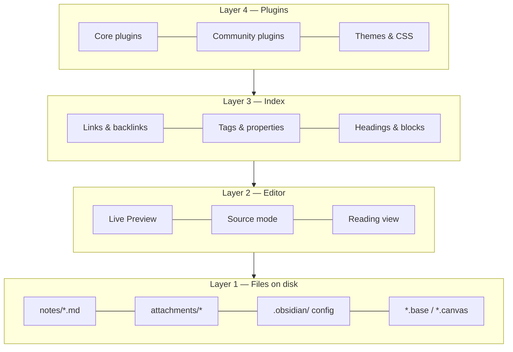

The reason this matters: **the file layer is the truth**. Everything above it is a view. If Obsidian disappeared tomorrow you would lose nothing but convenience. This is the "file over app" principle that Obsidian's CEO Steph Ango has written about, and it has practical consequences throughout this guide: prefer formats and conventions that survive without Obsidian, and treat plugins as accelerators, not as the place where your data lives.

## The five primitives

Everything you will ever build in Obsidian is a combination of five primitives. Learn to see them.

### 1. Notes (files)

A note is a file. Its **title is its filename**. This is more consequential than it sounds:

- Filenames cannot contain `/ \ : * ? " < > |` and Obsidian also forbids `#`, `^`, `[`, `]` and `|` in note names because they conflict with link syntax.
- Renaming a note is a filesystem rename, and Obsidian rewrites every link that points to it (if the setting is on — keep it on).
- Two notes cannot share a name in the same folder, but *can* share a name in different folders — which makes `[[Name]]` links ambiguous. Avoid this.
- Because the title is the filename, "what should I call this note?" is a real design decision. The methodology chapter covers naming conventions in depth.

A note optionally has **properties** (YAML frontmatter), a body of Markdown, and any number of headings and blocks that can be addressed individually.

### 2. Links

A link is a pointer from one note to another: `[[Target]]`, `[[Target#Heading]]`, `[[Target#^blockid]]`, or `[[Target|Shown text]]`. Links are the connective tissue of a vault and the thing Obsidian does better than any competitor. Key properties:

- **Links are bidirectional in the index.** Write `[[Berlin]]` in your travel note and the Berlin note's backlinks pane now shows the travel note — with no action on your part.
- **Links can point to notes that don't exist yet.** They render dimmer and become real the moment you click them. This lets you link *first* and write *later*, which is the core of "bottom-up" knowledge building.
- **Unlinked mentions** surface places where a note's name appears as plain text, offering one-click linking.
- **Embeds** are links with a `!` prefix: `![[Target]]` shows the target's content inline. You can embed notes, headings, blocks, images, PDFs (with page numbers), audio, video, canvases, and bases.

### 3. Tags

`#tag` and `#nested/tag`, in the body or in the `tags` property. Tags are lightweight, cross-cutting labels. They are cheap to add and cheap to query. They are also the most over-used primitive by beginners; Chapter 5 gives a decision framework for tags vs properties vs links vs folders.

### 4. Properties (metadata)

Structured `key: value` data at the top of a note in YAML. Since Obsidian 1.4 they have typed UI (text, list, number, checkbox, date, datetime), and since 1.9 they are the fuel for Bases. Properties turn a pile of notes into a *database* without leaving plain text. A note with:

```yaml
---
type: book
author: "[[Cal Newport]]"
status: reading
rating: 4
started: 2026-08-14
tags: [productivity, focus]
---
```

…is simultaneously a readable page and a row in any table you care to build.

### 5. Folders

Folders are the physical location of a file. They are the primitive people over-invest in first and regret later, because a note can live in only one folder while it can have unlimited links, tags, and properties. Folders still matter — for attachment routing, for templates that auto-apply per folder, for Bases filters like `file.inFolder("Projects")`, and for keeping the file explorer sane — but they should be *few and stable*.

## The three ways to organize, and why you need all of them

There are three fundamentally different organizing strategies, and mature vaults use all three deliberately:

| Strategy | Primitive | Strengths | Weaknesses | Use it for |
| --- | --- | --- | --- | --- |
| **Hierarchy** | Folders | Familiar, physical, works with any tool, supports per-folder automation | One location per note; deep trees rot; encourages filing over thinking | A small number of top-level "kinds of thing" (e.g. `Notes`, `Journal`, `Projects`, `Sources`, `Templates`, `Attachments`) |
| **Network** | Links, MOCs | Emergent structure; supports multiple contexts; serendipity via backlinks | Needs active tending; can become an undifferentiated hairball | Ideas, concepts, people, projects — anything with relationships |
| **Attributes** | Tags, properties | Precise filtering and sorting; enables dashboards; machine-readable | Requires discipline and a schema; meaningless without queries | Status, type, dates, ratings, categories — anything you want to *query* |

The single most useful habit is to ask, for each note, "which of these strategies does this note need?" A meeting note needs attributes (date, attendees, project) and links (to the people and the project) but no special folder. A permanent idea note needs links above all. A recipe needs attributes (cuisine, time, servings) and belongs to one obvious folder.

## Bottom-up vs top-down

Two schools argue about how to build a vault.

**Top-down** designs the structure first: folders, templates, property schemas, MOCs, dashboards. Then notes are filed into it. This is how most productivity content online approaches Obsidian and it produces beautiful screenshots. Its failure mode is a cathedral with no congregation — an elaborate system you stop using after three weeks because maintaining it is a job.

**Bottom-up** writes notes first, links freely, and lets structure emerge. When a cluster of notes becomes noticeable, you create a Map of Content (MOC) to index it. When a pattern of properties recurs, you formalize a template. This is the Zettelkasten / LYT lineage. Its failure mode is a swamp — thousands of notes with no way in.

The guide's position: **structure the containers top-down, let the content grow bottom-up.** Decide your folder skeleton, your note types, your property schema, and your naming conventions up front (Chapter 8 gives you a complete one). Then within that skeleton, write and link without asking permission from your system. Create MOCs and dashboards only when the volume of notes demands them.

## Two modes of use: retrieval and thinking

Obsidian serves two very different jobs and you should know which one you are doing at any moment.

**Retrieval** is "where did I put that?" — the Wi-Fi password, the recipe, the meeting decision, the article you clipped. Retrieval wants *predictability*: consistent names, consistent properties, consistent locations, good search. Bases, properties, folders, and search are the tools. Over-linking retrieval notes wastes time.

**Thinking** is "what do I believe about this?" — ideas, arguments, decisions, syntheses. Thinking wants *connection*: links to related ideas, backlinks that surface forgotten context, writing in your own words, revisiting. Links, MOCs, the local graph, and daily notes are the tools. Over-structuring thinking notes kills them.

A "whole life" vault contains both, and one of the reasons it is worth putting *everything* in Obsidian is that the boundary is porous: a retrieval note (a book you read) becomes a thinking note (what you took from it), and thinking notes feed action (a project). Keeping them in one place with one link syntax is the actual killer feature.

## What Obsidian is bad at (and what to do about it)

Honesty about limits saves months.

- **Real-time collaboration.** Two people editing the same note simultaneously is not a thing. Obsidian Sync supports multiple users on one vault, but with last-writer-wins at the file level (with version history to recover). For team wikis and shared docs, use something else and link to it.
- **Relational data with joins.** Bases and Dataview are excellent for single-table views over notes. Multi-table relational queries are possible (DataviewJS) but awkward. If you need a real database — an inventory with thousands of SKUs, accounting — use one, and keep the *narrative* in Obsidian.
- **Heavy attachments.** Obsidian stores files fine, but a vault with 50 GB of video syncs badly and indexes slowly. Keep large media outside the vault and link to it, or in a separate vault.
- **Rich text fidelity.** Markdown cannot represent every formatting nuance of a Word document. If you need pixel-perfect documents, write in Obsidian and export via Pandoc.
- **Structured forms and input validation.** Plugins like Meta Bind get you far, but there is no native form builder.
- **Mobile power features.** Mobile Obsidian is remarkably complete, but plugins with heavy UI, huge vaults, and Git-based sync are painful on phones. Design mobile workflows for *capture and reading*, not administration.
- **Being a calendar or email client.** It can display calendars (plugins) and you can email into it (automation), but it should not replace them.

## Principles that survive every chapter

These come up again and again. Internalizing them now makes the rest of the guide faster.

!!! tip "1. Plain text is the API"
    Any feature that stores its data as human-readable text in your notes (properties, tasks, inline fields, callouts) is durable and portable. Any feature that stores data in `.obsidian/plugins/*/data.json` is convenient but fragile. Prefer the former for anything you would grieve losing.

!!! tip "2. Titles are links"
    Because the filename is both the title and the link target, name notes the way you would *refer to them in a sentence*. `[[Cal Newport]]` reads naturally; `[[newport_cal_author]]` does not. Aliases handle synonyms.

!!! tip "3. Friction goes at the exit, not the entrance"
    Capturing must be near-zero-friction (hotkey, template, mobile share sheet). Processing — deciding where a note lives, what it links to — can be batched later in a review. Systems that demand perfect filing at capture time die.

!!! tip "4. Query, don't file"
    If you find yourself maintaining a list by hand — "all open projects", "books to read", "recent meetings" — stop. That list should be a Base or a Dataview query driven by properties. Hand-maintained lists are always out of date.

!!! tip "5. One vault unless you have a reason"
    Links do not cross vaults. Search does not cross vaults. Every split costs you connections. Legitimate reasons to split: legal separation (work confidentiality), radically different sync requirements, or a vault that is really a project (a book manuscript, a shared family vault). "It feels cleaner" is not a reason.

!!! tip "6. Plugins are power tools — count them"
    Every plugin is code running with full access to your files, load time on mobile, and a maintenance dependency. A healthy vault has 10–25 community plugins that you can each name the purpose of. Chapter 14 gives tiers; Chapter 32 gives an audit routine.

!!! tip "7. Build for the tired version of you"
    You will use the vault at 11 pm, on a phone, after a bad day. Templates, hotkeys, and dashboards exist so the system works when your willpower does not.

## The four layers of mastery

It helps to know where you are and what comes next. Most users plateau at layer 2.

| Layer | You can… | Typical signs | This guide's chapters |
| --- | --- | --- | --- |
| **1. Editor** | Write Markdown, make links, use folders, search | Vault looks like a fancier Apple Notes | 2, 3, 4 |
| **2. Networker** | Use backlinks deliberately, MOCs, daily notes, tags, a few plugins | Graph view has recognizable clusters | 5, 6, 7, 9 |
| **3. Systems builder** | Design property schemas, templates, Bases/Dataview dashboards, task system, reviews | You *query* your vault; you rarely make lists by hand | 8, 10–13, 15–25 |
| **4. Operator** | Automate with CLI/URI/scripts, integrate external apps and AI, customize the UI, write small plugins, maintain and migrate at scale | The vault is your life's control panel and it runs itself | 26–34 |

The [Mastery Roadmap](35-mastery-roadmap.md) turns this into a schedule.

## Key takeaways

- Obsidian is a folder of text files plus an index plus plugins. The files are the truth; everything else is a view.
- Five primitives — notes, links, tags, properties, folders — combine into every system you will build. Learn to see them.
- Use hierarchy for containers, network for ideas, attributes for anything you will query. Mature vaults use all three deliberately.
- Structure containers top-down; let content grow bottom-up.
- Know whether a note is for *retrieval* or *thinking* and organize accordingly.
- Prefer plain-text-stored features, query instead of filing, keep one vault, count your plugins, and design for your tired self.

## Next

[Chapter 2: Setup, Settings and Interface →](#setup-settings-and-interface)

---

# Setup, Settings and Interface

A vault configured thoughtfully in the first hour saves hundreds of small frustrations later. This chapter is a complete audit: every setting that materially affects how you work, what to set it to and why, plus the interface anatomy and keyboard-first habits that separate fluent users from clickers.

## Installation and installer versions

Obsidian has two version numbers and confusing them causes real problems.

- **App version** (e.g. 1.13.4) — the JavaScript application. Updates automatically in-app on desktop; via the store on mobile.
- **Installer version** — the Electron shell (Chromium + Node) the app runs in. It only updates when you **download and reinstall from obsidian.md**. Check it under **Settings → General → About** ("Installer version").

!!! warning "Reinstall the installer at least once a year"
    Features like the Obsidian CLI require installer 1.12.7+, Bases performance improved with newer Electron builds, and several rendering bugs are installer-level. Reinstalling does not touch your vault. On Windows use the same edition (system vs. per-user) you originally installed to avoid two copies.

| Platform | Recommended install | Notes |
| --- | --- | --- |
| Windows | Official installer from obsidian.md | winget (`winget install Obsidian.Obsidian`) also works and tracks installer versions. |
| macOS | Official DMG or `brew install --cask obsidian` | Universal build; Apple Silicon native. |
| Linux | AppImage (most portable), Flatpak, Snap, or `.deb` | Flatpak and Snap sandbox file access; the CLI and some sync tools work best with AppImage or `.deb`. If using Flatpak, grant filesystem access with Flatseal to your vault folder. |
| iOS/iPadOS | App Store | Vault location: "On My iPhone/Obsidian" (local) or iCloud Drive. See [Sync](#sync-backup-and-security). |
| Android | Play Store, F-Droid, or GitHub APK | Grant "All files access" for vaults outside app storage. |

## Where to put the vault

Decide this once. Moving later is possible but annoying.

- **Local disk, non-synced folder** — fastest, safest for plugins, zero conflicts. Use if you sync with Obsidian Sync, Git, or Remotely Save (they handle sync themselves).
- **iCloud Drive / OneDrive / Dropbox / Google Drive folder** — works on desktop; on mobile only iCloud is natively supported by Obsidian (iOS). Risks: "files on demand" placeholders (OneDrive) break indexing; conflicts create duplicate files; `.obsidian/` config churn triggers constant re-upload. If you must, exclude nothing and turn off "files on demand" for the vault folder.
- **Syncthing folder** — excellent on desktop and Android; not available on iOS.
- **Network drive / NAS** — avoid. Latency makes the editor sluggish and file watchers unreliable. Obsidian 1.13 warns when loading HTML resources from network paths for the same reason.

Chapter 26 has the full sync matrix.

## Vault-level decisions before you write

1. **One vault or several?** One, unless you have a hard reason (Chapter 1, principle 5). You *can* keep a scratch vault for experimenting with plugins.
2. **Attachment folder.** Set **Settings → Files and links → Default location for new attachments** to *In the folder specified below* → `Attachments` (or `_attachments`, `zz-attachments` to sort last). Never leave it as "vault root" or "same folder as current file" unless you like clutter.
3. **Link format.** *Wikilinks* (`[[Note]]`) are the Obsidian default, faster to type, and every plugin understands them. *Markdown links* (`[Note](Note.md)`) are more portable to other tools and required by some publishing pipelines. For the path style, **Shortest path when possible** produces clean `[[Note]]` links but is only safe if you keep filenames unique across the vault; **Absolute path in vault** produces `[[Folder/Note]]` and is unambiguous but noisier; **Relative path to file** breaks when notes move. Recommendation for a whole-life vault: Wikilinks on, unique filenames enforced by convention, shortest path.
4. **New note location.** *Same folder as current file* is the least surprising once you have a folder skeleton; combined with an `Inbox` folder as your default landing zone for quick capture.
5. **Naming convention.** Decide capitalisation (Title Case vs sentence case) and whether dates are `YYYY-MM-DD`. Decide now; consistency matters more than the choice.

## The complete settings audit

Settings are searchable since 1.13 (++ctrl+comma++ then type). Below, every setting that matters, grouped as Obsidian groups them. Defaults are fine where a setting is not listed.

### General

| Setting | Recommended | Why |
| --- | --- | --- |
| Automatic updates | On | Security and Bases/CLI improvements ship often. |
| Command line interface | On (desktop) | Enables `obsidian` CLI — see Chapter 29. Follow the prompt to register PATH. |
| Language | Your choice | Affects UI only, not your notes. |

### Editor

| Setting | Recommended | Why |
| --- | --- | --- |
| Default editing mode | Live Preview | WYSIWYG-ish while still Markdown. Switch to Source with ++ctrl+e++ (toggle) when you need to see raw syntax. |
| Default view for new tabs | Editing view | Reading view is for consumption; you are mostly writing. |
| Show line numbers | Off (on for code-heavy notes via `cssclasses`) | Noise for prose. |
| Readable line length | On | ~700px measure; disable per note with a CSS class if you need wide tables. |
| Strict line breaks | Off | With off, a single newline renders as a line break (like most note apps). With on, you need two spaces or a blank line — stricter CommonMark. Off is friendlier; on is more portable. Pick and never change (it changes how existing notes render). |
| Properties in document | Visible | Shows the typed property editor. "Source" shows raw YAML; "Hidden" hides it. |
| Show indentation guides | On | Helps with nested lists and tasks. |
| Fold heading / Fold indent | On | You will use folding constantly in long notes. |
| Spellcheck | On; add languages | Right-click → Add to dictionary for your jargon. |
| Auto pair brackets / Markdown syntax | On | Typing `[[` yields `[[]]`. |
| Smart indent lists | On | Tab/Shift-Tab indent list items. |
| Vim key bindings | Off unless you are a Vim user | If you are, it is remarkably complete (see Chapter 3). |
| Auto convert HTML | On | Pasting from the web becomes Markdown. |
| Indent using tabs / Tab size | Spaces, 4 (or tabs) | Some plugins (Tasks, Dataview) were historically picky about mixed indentation. Consistency is what matters. |

### Files and links

| Setting | Recommended | Why |
| --- | --- | --- |
| Confirm file deletion | On | Your trash is one accidental ++del++ away. |
| Deleted files | Move to Obsidian trash (`.trash` folder) | Recoverable within the vault; system trash is the alternative. Chapter 32 covers File Recovery. |
| Always update internal links | On | The reason renaming is safe. |
| Automatically delete attachments | Ask every time (1.12+) | When you delete a note, Obsidian offers to delete attachments only that note used. |
| Default location for new notes | Same folder as current file, *or* a fixed `Inbox` | See above. |
| New link format | Shortest path when possible (unique names) | See above. |
| Use Wikilinks | On | Toggle off only for portability requirements. |
| Detect all file extensions | Off (on temporarily to find stray files) | Otherwise your explorer shows `.DS_Store` and friends. |
| Default location for new attachments | In the folder specified below → `Attachments` | See above. |
| Excluded files | Add `Templates/`, `Attachments/`, `Archive/` if noisy | Excluded files are dimmed in search/suggestions/graph but still linkable and still indexed. Use it liberally for templates so `[[` suggestions are not polluted. |

### Appearance

| Setting | Recommended | Why |
| --- | --- | --- |
| Base color scheme | Adapt to system | Toggle command exists (1.10 replaced the separate light/dark commands with a single **Toggle light/dark mode**). |
| Accent color | Your call | Also used by links and selection. |
| Font size | 16 (desktop) | Zoom with ++ctrl+plus++ / ++ctrl+minus++ as needed. |
| Interface / text / monospace font | System UI; a good reading font (e.g. Inter, iA Writer Duo, Source Serif); JetBrains Mono / Fira Code | Fonts must be installed on each device. |
| Quick font size adjustment | On | ++ctrl++ + scroll. |
| Show inline title | On | The filename rendered as an H1 at the top; means you do not put `# Title` in the body. |
| Show tab title bar | On (desktop) | Off saves vertical space, but you lose the breadcrumb. |
| Ribbon | Reorder / hide items you never click | Right-click the ribbon → Configure. |
| Native menus (macOS) | Off | Obsidian's own menus are more consistent across platforms. |
| Window frame | Hidden (native title bar off) | Less chrome. |
| Zoom level | 100% | |
| Themes / CSS snippets | See Chapter 28 | |

### Hotkeys

Chapter 37 has the complete default list. The philosophy: leave defaults alone unless they conflict, and add hotkeys for the ~15 commands you use hourly. Non-negotiable additions for most people:

| Command | Suggested hotkey | Reason |
| --- | --- | --- |
| Toggle left / right sidebar | ++ctrl+alt+left++ / ++ctrl+alt+right++ (or click) | Focus mode on demand. |
| Open today's daily note | ++ctrl+shift+d++ | Your home base. |
| Insert template | ++alt+t++ | Constantly used until Templater takes over. |
| Toggle reading view | ++ctrl+e++ (default) | |
| Focus on last note / Focus on tab group | | Useful with split panes. |
| Move current file to another folder | ++ctrl+shift+m++ | Processing your inbox. |
| Add file property | ++ctrl+semicolon++ | Metadata without leaving the keyboard. |
| Toggle bullet / checkbox | ++ctrl+l++ (default toggles checkbox) | |
| Navigate back / forward | ++alt+left++ / ++alt+right++ | Web-browser habits. |
| Search in all files | ++ctrl+shift+f++ | |
| Open command palette | ++ctrl+p++ | |
| Open quick switcher | ++ctrl+o++ | |
| Toggle Bases view / Open Bases | | Once you build dashboards. |

!!! tip "Hotkeys are stored in `.obsidian/hotkeys.json`"
    Sync that file (Obsidian Sync can sync hotkeys; Git syncs everything) so your muscle memory survives device changes.

### Core plugins

Turn on: File explorer, Search, Quick switcher, Graph view, Backlinks, Outgoing links, Canvas, Daily notes, Templates, Note composer, Command palette, Bookmarks, Outline, Word count, File recovery, Page preview, Properties view, Tags view, Bases, Slash commands (optional), Unique note creator (if you use Zettelkasten IDs), Workspaces (once you have layouts), Web viewer (if you want in-app browsing), Random note (for serendipitous review), Importer (when migrating), Footnotes view (if you write academically), Sync/Publish (if subscribed), Slides (rarely). Chapter 9 details each.

### Community plugins

Turn off **Restricted mode**. Since 1.13 you can exit Restricted mode *without* re-enabling plugins, which is useful for debugging. Install nothing yet; Chapter 14 curates. The **Check for updates** button is in this tab — do it weekly.

### Sync / Publish

See Chapters 26 and 31. Notable 1.13 behaviour: Sync warns before syncing plugins between devices (because plugin data can be device-specific), and the status-bar icon no longer spins to save battery.

## Interface anatomy

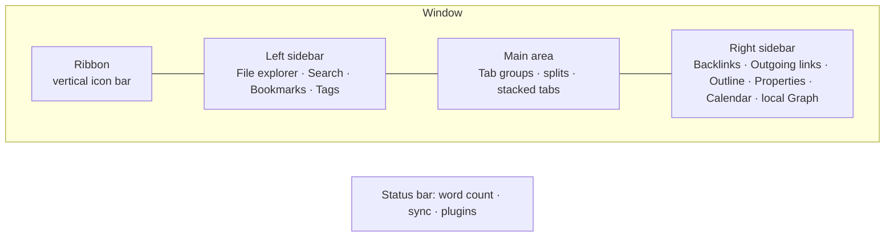

**Ribbon.** Vertical strip of icons on the far left. Every core and community plugin can add one. Right-click → hide the ones you never click; the actions remain in the command palette.

**Sidebars.** Both hold *tabs of views*. Drag any view between sidebars or into the main area (a Backlinks view in the main area is a legitimate way to review connections). Collapse with the small arrows or hotkeys. Pin a sidebar tab to keep it visible.

**Main area.** Tabs, like a browser. Split any tab horizontally/vertically (right-click the tab → Split, or drag it to an edge). A *tab group* is a set of tabs sharing a pane. **Stacked tabs** (right-click tab header → Stack tabs) turns a group into Andy Matuschak-style sliding cards — outstanding for research where you open six notes from one MOC.

**Status bar.** Bottom right: word/character count, backlink count, sync status, plugin indicators. Click items for menus. Hide with CSS if you prefer minimal.

**Tab title bar / inline title.** The breadcrumb (folder › note) and the note's H1-like title. Click the breadcrumb to navigate the folder; click the inline title to rename.

**Settings window.** Since 1.13 opens in a separate window with search and keyboard navigation (arrows to move, ++enter++ to open, ++ctrl+f++ to focus search). Disable "Open settings in new window" under Interface if you prefer the modal.

**Pop-out windows.** Drag a tab out of the app to make it a standalone window (desktop). Useful for a reference note on a second monitor.

## Navigation you should do from the keyboard

The fluent-user baseline. Everything else is optional; these are not.

- **Command palette** ++ctrl+p++ — type any command. Pin favourites (Settings → Command palette) to the top. Also try `>` prefix in Quick switcher.
- **Quick switcher** ++ctrl+o++ — fuzzy-find by filename. Type a new name and ++enter++ to create. ++shift+enter++ creates even if a fuzzy match exists. ++ctrl+enter++ opens in a new tab. Since 1.12 results can be dragged.
- **Search** ++ctrl+shift+f++ — full-text with operators (Chapter 6). ++ctrl+f++ searches within the current note.
- **Follow link under cursor** ++alt+enter++ (or ++ctrl+enter++ to open in a new tab). Hover with ++ctrl++ for a page preview.
- **Back / forward** ++alt+left++ / ++alt+right++ (++cmd+bracket-left++ / ++cmd+bracket-right++ on mac).
- **Go to next/previous tab** ++ctrl+tab++ / ++ctrl+shift+tab++; go to tab N ++ctrl+1++ … ++ctrl+9++.
- **Close tab** ++ctrl+w++; **reopen closed tab** ++ctrl+shift+t++.
- **Toggle sidebars** — assign hotkeys.
- **Reveal current file in navigation** — assign; essential in big trees.
- **Fold/unfold** ++ctrl+up++ / ++ctrl+down++ at heading; **Fold all / Unfold all** commands.
- **Focus on editor** ++esc++ from most panes.

## Workspaces and layouts

The **Workspaces** core plugin saves the entire layout (which panes, which files, which sidebar tabs) under a name and restores it in one command. Build three or four:

- **Writing** — single pane, sidebars collapsed, Outline in right sidebar.
- **Planning** — daily note left, task dashboard right, Calendar in sidebar.
- **Research** — stacked tabs in main, Backlinks + local Graph on the right.
- **Review** — weekly note, project Base, Habit tracker.

Save with *Workspaces: Save layout*, load with *Workspaces: Load layout*. The Obsidian CLI can load them (`obsidian workspace:load name=Planning`), which means a shell alias or a Raycast/Alfred/AutoHotkey script can put you in a mode instantly. Chapter 29 shows this.

!!! note "Workspaces + mobile"
    Mobile has its own layout; workspaces are per-device. The **Workspaces Plus** community plugin adds a switcher and per-workspace settings on desktop.

## Multiple vaults strategy (if you really need it)

- Vaults are completely isolated: separate plugins, settings, index. Cross-vault links use `obsidian://open?vault=Other&file=Note` URIs (they work but feel foreign).
- Share configuration between vaults with a symlink of `.obsidian/` subfolders (snippets, themes) — fragile with sync; do it only on a single machine.
- **Change vault…** (renamed *Manage vaults* in 1.12) lists vaults; the **Open vault…** command (1.12) opens another vault while keeping the current one open. The CLI accepts `vault=Name` as the first parameter.

## First-hour checklist

- [ ] Installer updated; app updated.
- [ ] Vault created in a sensible location; sync approach chosen (Chapter 26).
- [ ] Attachments folder set; excluded files set; link format decided.
- [ ] Editor: Live Preview, readable line length, folding, spellcheck, indentation guides.
- [ ] Appearance: theme (Chapter 28), inline title on, fonts.
- [ ] Core plugins enabled per list above; Restricted mode off.
- [ ] Hotkeys added for daily note, insert template, sidebars, move file, add property.
- [ ] Folder skeleton created (Chapter 8) with `Inbox`, `Templates`, `Attachments` at minimum.
- [ ] Templates folder set in **Templates** core plugin settings; Daily notes folder + format set.
- [ ] `.obsidian/` backed up (Chapter 26).

## Key takeaways

- App version and installer version are different; reinstall the installer periodically.
- Put the vault on a local disk unless your sync method requires a synced folder; avoid network drives.
- Decide attachments folder, link format, new-note location, and naming convention in the first hour.
- Learn the ten keyboard navigation commands; they are the difference between using Obsidian and living in it.
- Use Workspaces (and later the CLI) to switch between purpose-built layouts.

## Next

[Chapter 3: Markdown and Editing Mastery →](#markdown-and-editing-mastery)

---

# Markdown and Editing Mastery

Obsidian speaks a specific dialect: CommonMark plus GitHub-Flavored Markdown extensions plus its own additions (wikilinks, embeds, callouts, block IDs, comments, highlights, properties). Knowing the entire dialect — including the odd corners — lets you write faster, produce notes that render the way you intend, and understand why a query or plugin behaves the way it does. This chapter is the complete reference plus the editing techniques that make writing in Obsidian genuinely fast.

## The three views

| View | Shortcut | What it shows | Use it for |
| --- | --- | --- | --- |
| **Live Preview** | default editing mode | Rendered Markdown that turns into raw syntax where your cursor is | 90% of writing |
| **Source mode** | toggle via command *Toggle Live Preview/Source mode* (assign a hotkey) | Raw text, syntax highlighted | Fixing tables, YAML, nested structures, stubborn formatting |
| **Reading view** | ++ctrl+e++ | Fully rendered, read-only; embeds, queries and Bases render fully | Reading, reviewing dashboards, copying rendered text |

!!! tip "Two-pane editing"
    Right-click a tab → *Open linked view* → *Open in reading view* gives you a side-by-side render that follows your scroll. Useful for complex tables and Mermaid.

In Reading view, if nothing is selected, ++ctrl+c++ copies the *full source* of the note (1.10+). Copying from the editor includes HTML formatting on the clipboard (1.12+) so pasting into Google Docs preserves headings and bold.

## Headings and structure

```markdown
# H1 — avoid in body if "Show inline title" is on (the filename is your H1)
## H2 — main sections
### H3 — subsections
#### H4 …up to ###### H6
```

- Headings are link targets: `[[Note#Heading]]`. Renaming a heading does **not** update links to it automatically unless you rename via the Outline pane or the right-click *Rename* on the heading, which does.
- Headings are foldable (Settings → Editor → Fold heading). ++ctrl+up++/++ctrl+down++ fold/unfold at cursor.
- The Outline pane and the *Go to heading* commands (community: Quiet Outline, or the core Outline view) navigate by heading.
- **Note composer** (core) can *extract* a heading's section into a new note and leave a link or embed behind. Since 1.13 it also rewrites links inside the extracted section to be relative to their new home.

## Paragraphs and line breaks

With **Strict line breaks off** (recommended), a single ++enter++ renders as a line break. With it on, you need two trailing spaces, a backslash `\`, or a blank line. Paragraphs are separated by a blank line either way. ++shift+enter++ inserts a hard break `<br>`-equivalent regardless of setting.

## Emphasis and inline formatting

| Syntax | Result | Notes |
| --- | --- | --- |
| `*italic*` or `_italic_` | *italic* | ++ctrl+i++ |
| `**bold**` or `__bold__` | **bold** | ++ctrl+b++ |
| `***bold italic***` | ***bold italic*** | |
| `~~strike~~` | ~~strike~~ | |
| `==highlight==` | ==highlight== | Obsidian-specific; searchable; styled per theme |
| `` `code` `` | `code` | Inline code; ++ctrl+`++ in some themes/plugins |
| `<u>underline</u>` | <u>underline</u> | No Markdown syntax; use HTML |
| `<sup>2</sup>` / `<sub>2</sub>` | superscript / subscript | HTML |
| `<kbd>Ctrl</kbd>` | keyboard key | HTML; themes style it |
| `<mark>text</mark>` | highlight | Alternative to `==` |
| `<span style="color:red">red</span>` | inline colour | Works but is not portable; prefer CSS classes |
| `%%hidden%%` | (nothing) | Obsidian **comment** — invisible in Reading view and Publish; visible in edit modes. Multi-line: `%%` on its own lines. Always exactly two `%`. |

The **formatting menu** (right-click or the mobile toolbar) offers all of these plus tables and lists for when you forget syntax.

## Lists

```markdown
- Unordered with hyphen (preferred), * or +
    - Nested with 4 spaces or a tab (be consistent — Settings → Editor → Indent using tabs)
1. Ordered
2. Numbers auto-renumber in Live Preview
   1. Nested ordered
- [ ] Task
- [x] Completed task
- [-] Cancelled (rendered by many themes; Tasks plugin treats as cancelled)
- [/] In progress (theme-dependent; see custom checkboxes below)
```

Editing power:

- ++tab++ / ++shift+tab++ indent/outdent list items (Smart indent lists on).
- ++alt+up++ / ++alt+down++ **move line up/down** — with a list item, moves the whole item (and its children with the *Outliner* plugin).
- ++ctrl+enter++ on a task toggles its checkbox; ++ctrl+l++ cycles bullet → checkbox → checked.
- ++enter++ on an empty list item ends the list.
- *Toggle bullet list*, *Toggle numbered list* commands convert selected paragraphs.
- The **Outliner** community plugin adds workflowy-style behaviours (drag-reorder, fold, select whole subtree); **Zoom** focuses on a single subtree.

**Custom checkbox statuses.** `- [?]`, `- [!]`, `- [>]`, `- [<]`, `- [i]`, `- [*]`, `- ["]`, `- [l]`, `- [b]`, `- [S]`, `- [I]`, `- [p]`, `- [c]`, `- [f]`, `- [k]`, `- [w]`, `- [u]`, `- [d]` are all just characters in brackets. Themes like Minimal and AnuPpuccin style many of them (question, important, forwarded, scheduled, info, star, quote, location, bookmark, savings, idea, pros, cons, fire, key, win, up, down). The Tasks plugin can map each to a status type (Todo / In Progress / Done / Cancelled / Non-task). The CLI's `tasks status="?"` filters by them.

## Tables

```markdown
| Column | Aligned right | Centered |
| --- | ---: | :---: |
| Cell | 12.50 | yes |
| Pipe in cell needs escaping \| like this | | |
```

- Live Preview has a table editor: click a cell to edit; ++tab++ moves right; ++enter++ moves down; right-click a cell for insert/delete row/column, align, move. The formatting menu → *Insert table* creates one.
- Inside a cell, `\|` is a literal pipe; `<br>` is a line break.
- Links inside tables work, including embeds (they render small).
- The **Advanced Tables** plugin adds spreadsheet-like formulas (`<!-- TBLFM: @>$3=sum(@I..@-1) -->`), auto-formatting, Excel-style navigation. Since core table editing improved, Advanced Tables is mainly for formulas and CSV import/export.
- Large data tables belong in Bases, not Markdown tables (Chapter 10). Markdown tables are for small, hand-written matrices.

## Blockquotes and callouts

```markdown
> Quote line
> — Attribution
```

**Callouts** are Obsidian's boxed, coloured, optionally collapsible blocks:

```markdown
> [!note] Optional title
> Body. Supports **Markdown**, [[links]], lists, code, nested callouts.

> [!tip]- Collapsed by default (minus sign)
> Hidden until clicked.

> [!warning]+ Expanded by default but collapsible (plus sign)
> Content.

> [!custom-type] Unknown types fall back to "note" styling and can be styled with CSS
```

Built-in types and aliases: `note`, `abstract`/`summary`/`tldr`, `info`, `todo`, `tip`/`hint`/`important`, `success`/`check`/`done`, `question`/`help`/`faq`, `warning`/`caution`/`attention`, `failure`/`fail`/`missing`, `danger`/`error`, `bug`, `example`, `quote`/`cite`.

Custom callouts via CSS snippet (note the **1.13 change**: `--callout-color` now takes a full CSS colour, not an RGB triplet):

```css
.callout[data-callout="decision"] {
  --callout-color: #7c3aed;
  --callout-icon: lucide-gavel;
}
```

Callouts are the right tool for: summaries at the top of long notes, decision records, warnings inside procedures, foldable "details" sections, and dashboard sections (embed a Dataview query inside a callout). Do not use them as your only structure — headings remain the navigable unit.

## Code

````markdown
Inline `code`.

```python
def hello():
    print("fenced code block with language for syntax highlighting")
```

~~~
Tildes also fence.
~~~
````

- Language identifiers follow Prism.js names: `js`, `ts`, `python`, `bash`/`sh`, `yaml`, `json`, `css`, `html`, `sql`, `rust`, `go`, `java`, `c`, `cpp`, `csharp`, `powershell`, `markdown`, `latex`, `mermaid`, `dataview`, `dataviewjs`, `tasks`, `base`, `query` (embedded search), `meta-bind`, `button`, etc. Plugins register their own.
- Code blocks show a **Copy** button on hover in Reading view.
- Indented code (4 spaces) also works but is fragile in lists.
- To show a triple-backtick block *inside* Markdown (like this guide does), fence the outer block with four backticks or tildes.
- Line numbers in code: not native; the *Code Styler* plugin adds numbering, titles, folding, and highlighting lines.

## Links, embeds and block references

Covered in depth in Chapter 4; the syntax summary:

```markdown
[[Note]]                      wikilink
[[Note|Display text]]         alias display
[[Note#Heading]]              heading link
[[Note#Heading#Subheading]]   nested heading path
[[Note#^blockid]]             block link
[[#Heading]]                  heading in the current note
[Display](Note.md)            markdown link (URL-encode spaces as %20)
[Display](<Note with spaces.md>)  angle brackets avoid encoding
[Display](https://example.com)    external link
<https://example.com>         autolink
![[Note]]                     embed whole note
![[Note#Heading]]             embed a section
![[Note#^blockid]]            embed a block
![[image.png]]                embed image
![[image.png|300]]            image width 300px
![[image.png|300x200]]        width x height
![[document.pdf#page=5]]      PDF at page 5
![[document.pdf#height=600]]  PDF viewer height
![[audio.mp3]]  ![[video.mp4]]  media players
![[Drawing.canvas]]           embed a canvas
![[Tracker.base]]             embed a base
![[Tracker.base#ViewName]]    embed a specific base view
   external image
   external image sized (1.13+, Reading view)
```

Block IDs: type `^` followed by an identifier at the end of any paragraph/list item/table/callout: `Some paragraph. ^my-id`. Obsidian generates random ones (`^a1b2c3`) when you type `[[Note#^` and choose a block. IDs must be letters, numbers and hyphens.

## Footnotes

```markdown
Claim that needs a source.[^1] Inline footnote.^[This is written inline.]

[^1]: The footnote text. Can be multiple paragraphs if indented.
```

Footnotes render as superscripts with hover preview and a list at the bottom of Reading view. The **Footnotes view** core plugin (2025) shows them in a sidebar. Named footnotes `[^smith2020]` are fine.

## Math

```markdown
Inline: $E = mc^2$

Block:
$$
\int_0^\infty e^{-x^2}\,dx = \frac{\sqrt{\pi}}{2}
$$
```

MathJax 3. Most LaTeX math works; `\begin{aligned}`, `\begin{cases}`, matrices, `\text{}`. Currency: `$5 and $10` can trigger math — write `\$5` or enable *Auto pair Markdown syntax* awareness; the **Latex Suite** plugin adds snippets and autocompletion for heavy users.

## Diagrams: Mermaid

````markdown
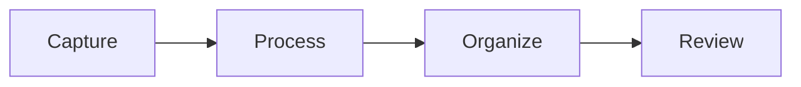
````

Supported: flowchart, sequenceDiagram, classDiagram, stateDiagram, erDiagram, gantt, pie, gitGraph, mindmap, timeline, quadrantChart, xychart-beta, sankey-beta, C4. Mermaid version 11.13 as of Obsidian 1.13. Obsidian 1.13 shows a one-time banner asking to confirm rendering Mermaid in a vault (a security measure). Internal links inside Mermaid nodes work via `click A "obsidian://open?file=Note"` with a URI, or with the `class A internal-link` trick:

````markdown
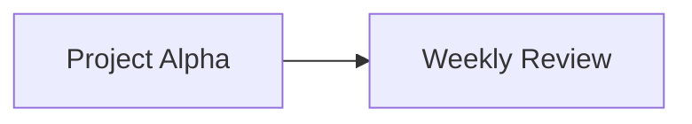
````

(The node text must equal the note name.)

## HTML

Obsidian renders a safe subset of inline HTML: `<div>`, `<span>`, `<br>`, `<details><summary>`, ``, `<iframe>` (with restrictions), `<table>`, `<kbd>`, `<sup>`, `<sub>`, `<u>`, `<center>` (deprecated but works), `<font>`, `<mark>`, `<abbr title="">`. Scripts are stripped. Markdown *inside* HTML blocks is not rendered unless the block is simple inline HTML on a single line.

`<iframe src="https://…">` embeds web pages (YouTube, maps, Google Docs). Obsidian 1.10 fixed YouTube "Error 153" embeds. The Web viewer core plugin is usually better for browsing.

## Escaping

Backslash escapes any Markdown character: `\*not italic\*`, `\[\[not a link\]\]`, `\#not-a-tag`, `\|`, `\$`. Inside code spans nothing needs escaping. To show `[[wikilink]]` literally in prose, use a code span or escape the first bracket.

## Properties (frontmatter) syntax essentials

Full treatment in Chapter 5. Syntax reminders that trip people:

```yaml
---
title: "Colons: need quotes if the value contains a colon"
aliases:
  - Alias One
  - Alias Two
tags: [one, two/nested]         # or a bulleted list; no leading #
date: 2026-09-06                # date type
created: 2026-09-06T14:30:00    # datetime type
rating: 4                       # number
done: false                     # checkbox
author: "[[Cal Newport]]"       # link — MUST be quoted
related:
  - "[[Note A]]"
  - "[[Note B]]"
url: https://example.com
description: >-
  Multi-line folded text
  continues here.
cssclasses: [wide, no-inline-title]
---
```

- Frontmatter must start on line 1 with `---` and end with `---`.
- Wikilinks in YAML must be quoted or YAML sees a list.
- Since 1.13, text and list properties render Markdown links.
- Duplicate values in list properties are allowed (1.10+).

## Editing techniques that compound

### Selection and multi-cursor

- ++alt++ + click adds a cursor. ++ctrl+d++ (in many setups) or the *Add next occurrence* command via CodeMirror… Obsidian's built-in: ++alt+click++ for extra cursors; ++ctrl+shift+l++ style "select all occurrences" is not native — use *Find and replace* (++ctrl+h++) or the **Multi-cursor** behaviours from plugins like *Code Editor Shortcuts* (adds duplicate line, select word, expand selection, join lines, transform case, etc.).
- ++shift+alt+up++ / ++down++ **duplicate line** — with Code Editor Shortcuts.
- ++ctrl+shift+k++ delete line (plugin) — native is *Delete paragraph*.
- Double-click selects a word; triple-click a paragraph.
- ++ctrl+a++ selects all; inside an embedded Base cell (1.13) it now selects the cell text.

### Find and replace

- ++ctrl+f++ in-note find with match highlighting; ++ctrl+h++ find & replace within the note; supports regex (toggle in the panel).
- Vault-wide search & replace: not native. Use the **Regex Find/Replace** plugin, or VS Code / `sed` on the vault folder (safe because files are plain text — close Obsidian or let it reindex).

### Moving and restructuring

- ++alt+up++/++alt+down++ move line. *Swap line up/down* commands.
- **Note composer**: *Extract current selection* (to a new note, leaving a link), *Merge entire file with…* (append/prepend another note and redirect links). Configure whether it leaves a link, an embed, or nothing.
- **Note Refactor** plugin: extract by heading in bulk, with templates for the new note.
- Drag headings in the **Outline** pane to reorder sections (Outline supports drag-and-drop reordering).
- Drag a file from the explorer into the editor to insert a link; hold ++alt++ (mac: ++shift++?) to insert an embed — behaviour is platform-dependent; alternatively type `![[`.
- Drag text out to another pane to move it.

### Paste behaviours

- Pasting HTML converts to Markdown (setting). ++ctrl+shift+v++ pastes as plain text.
- Pasting an image from the clipboard saves it to the attachments folder as `Pasted image YYYYMMDDHHMMSS.png` and inserts an embed. Rename immediately (right-click → Rename) or use the **Paste image rename** or **Attachment Management** plugins to auto-name by note title.
- Pasting a URL onto selected text makes a Markdown link (with the *Paste URL into selection* plugin; native as of recent versions when text is selected).
- Since 1.13, dragging a folder into the app imports it preserving structure.

### Images

- Resize in Live Preview by dragging the corner (1.12); double-click the corner to reset.
- Select an image with keyboard (1.13); ++plus++/++minus++ resize, ++0++ reset, ++enter++ edit, ++tab++ edit size, ++del++ removes.
- Click or the Zoom button opens the **full-screen viewer** (1.13), navigable between all images in the note; drag to pan; swipe down to dismiss on mobile.
- Right-click → *Copy image* (1.12).
- `![[image.png|200]]` sizes by width. Alignment: not native — use `cssclasses` or the *Image Converter* plugin.

### Slash commands and autocompletion

- The **Slash commands** core plugin: type `/` at line start to search commands inline. Set a trigger character you rarely type.
- `[[` autocompletes notes and aliases; `[[Note#` headings; `[[Note#^` blocks; `#` tags; `[!` callout types; `:emoji:` with the *Emoji Shortcodes* plugin; property names when editing YAML.
- **Various Complements** adds word/phrase autocompletion from your vault and custom dictionaries.
- **Templater** commands run on trigger (Chapter 11).

### Vim mode

Turn on in Settings → Editor. Coverage: normal/insert/visual/visual-line, `:` Ex commands (`:w`, `:noh`, `:s`, `:%s`, `:image grow|shrink|reset` in 1.13 for images with counts), motions, text objects, registers, marks, `.` repeat, search `/`, macros. Missing: some plugins' UI ignore Vim; folding commands differ. The **Vimrc Support** plugin loads a `.obsidian.vimrc` with mappings (`imap jk <Esc>`), `exmap` for Obsidian commands (`exmap back obcommand app:go-back`), and `unmap`. Vim + Obsidian is a legitimate power setup for people who already think in Vim; everyone else should skip it.

### Focus and typewriter modes

- **Toggle sidebars** for focus.
- Community: *Typewriter Scroll* (keeps the cursor line centred, dims other paragraphs), *Focus Mode*, *Stille*.
- *Readable line length* off + zoom for presentation-style reading.

### Word count and reading time

Status bar word count (core Word count plugin) counts the selection when text is selected. *Better Word Count* adds character/sentence/page counts and per-folder totals; *Novel Word Count* shows counts in the file explorer.

## Rendering gotchas worth knowing

- A line starting with `#` followed by a space is a heading; without a space it is a tag. `#1` is not a tag (tags cannot be all-numeric); `#2026-goals` is fine.
- `*` at the start of a line starts a list; to start a paragraph with an asterisk, escape it.
- Numbered lists that start with a number other than 1 render starting from that number.
- Four spaces of indentation on a non-list line creates a code block. This bites when pasting.
- Two callouts in a row need a blank line between them or they merge.
- An embed inside a list item renders with the list indentation (fixed in 1.13).
- `%%%%` is *not* a special comment — comments are exactly two `%` (clarified in 1.13).
- Trailing `\` at end of line forces a line break (CommonMark).
- HTML comments `<!-- -->` are hidden in Reading view but *do* get published/exported; `%% %%` comments do not.

## Key takeaways

- Live Preview for writing, Source for surgery, Reading for consumption; learn the toggles.
- Callouts, block IDs, embeds with sizes, footnotes, math and Mermaid are all part of the core dialect — no plugin needed.
- Keep frontmatter YAML valid: quote wikilinks and colon-containing values.
- Invest in list-manipulation hotkeys, multi-cursor, Note composer, and paste behaviours; those are where minutes per day are saved.
- Know the rendering gotchas so notes render as intended in Obsidian, on Publish, and in other tools.

## Next

[Chapter 4: Links, Backlinks, Graph and Canvas →](#links-backlinks-graph-and-canvas)

---

# Links, Backlinks, Graph and Canvas

Linking is the feature that justifies Obsidian's existence. Everything else — Markdown editing, properties, plugins — exists in other tools. What Obsidian does uniquely well is make the *connections between notes* first-class: cheap to create, automatically bidirectional, navigable, queryable, and visualizable. This chapter covers the full mechanics of links, how to use backlinks as a thinking tool rather than a curiosity, how to make the Graph view actually useful, and how Canvas turns links into spatial thinking.

## Link anatomy

```markdown
[[Target]]
[[Target|Displayed text]]
[[Target#Heading]]
[[Target#Heading|Displayed]]
[[Target#^blockid]]
[[Target#^blockid|Displayed]]
[[Folder/Target]]                (path link — needed when names collide)
[[Target.md]]                    (extension optional for .md; required for other types: [[file.pdf]])
[[#Heading in this note]]
[[##Heading search across vault]]  (typing ## in the [[ suggester searches all headings)
```

### Resolution rules

When you write `[[Target]]` Obsidian looks for a file named `Target.md` (case-insensitive) anywhere in the vault. If there is exactly one, the link resolves. If there are several, the "shortest path" setting decides: Obsidian picks one (the closest) and you probably did not want that — hence the guide's insistence on unique filenames. If there is none, the link is **unresolved**: rendered dimmer, listed in the Graph as a hollow node, and creatable with one click. `obsidian unresolved` (CLI) lists them all.

A link also resolves against **aliases**: if a note has `aliases: [CN]` in properties, `[[CN]]` resolves to it and the suggester shows the alias. Aliased links display the alias text.

### Aliases in depth

```yaml
---
aliases:
  - Cal Newport
  - Newport
  - C. Newport
---
```

Uses: people's nicknames, acronyms (`[[Getting Things Done]]` ↔ `GTD`), singular/plural (`Habit` / `Habits`), translations, old titles after a rename (keep the old name as an alias so `[[Old Name]]` in other tools still resolves). The **Unlinked mentions** pane matches aliases too, so adding aliases retroactively finds more connections.

### Display text and piping

`[[Target|text]]` shows *text*. Common idioms:

- Grammatical fit: `we discussed [[Deep Work|deep work]] yesterday`.
- Hiding folders: `[[People/Jane Doe|Jane]]`.
- Semantic hint: `[[2026-09-06|today's note]]`.

Renaming a note updates the target but keeps your display text. This is why *aliases* are for identity and *display text* is for grammar.

### Heading and block links

Heading links `[[Note#Heading]]` break silently if the heading is renamed by editing the text (Obsidian does not track heading identity). Renaming through the Outline pane's context menu or the heading's right-click *Rename* **does** update links. Nested headings can be pathed `[[Note#H2#H3]]`.

Block links `[[Note#^id]]` are stable across edits because the ID travels with the block. Blocks can be paragraphs, list items, tables, callouts, code blocks, and math blocks. For paragraphs and list items the `^id` goes at the end of the line. For tables, code blocks, callouts and math blocks, put `^id` on its own line directly below the block, separated from it by a blank line. The suggester (`[[Note#^`) searches block text and creates IDs on demand.

!!! tip "Block links as the atomic unit"
    A note is often too coarse to reference. "The third principle in my Values note" is a block. Long-form writers and researchers should get comfortable with `![[Source#^claim-3]]` transclusion — you keep one source of truth and quote it wherever needed.

### Markdown-style links

`[text](Target.md)` and `[text](Target.md#Heading)` are supported and updated on rename. Spaces must be `%20`-encoded or the path wrapped in `<angle brackets>`. Choose Markdown links only if you plan to publish through a tool that does not understand wikilinks (many static-site generators handle both now — Quartz, MkDocs with a plugin, Hugo with a shortcode). Toggle *Use Wikilinks* off to make the suggester insert Markdown links.

### External links and URIs

`[text](https://…)`, bare `https://…` autolinks, and `obsidian://` URIs. Obsidian 1.13 shows a **confirmation dialog** before running any `obsidian://` URI action (choose *Don't ask again* to allow-list it). Links to local files: `[Report](file:///Users/me/report.pdf)` opens in the system app; on 1.12+ a confirmation dialog appears for external apps and a warning for executables.

## Embeds (transclusion)

`![[…]]` renders the target inline and stays live: edit the source, and every embed updates. Embedded notes show a link icon to jump to the source; embedded sections show just that section; embedded blocks show just the block (with its list children for list items).

Design patterns:

- **Single source of truth.** Keep your goals in `Goals.md` and embed `![[Goals#2026]]` into the yearly note, quarterly notes, and weekly template.
- **Dashboards.** A `Home.md` note that is nothing but embeds of Bases, Dataview queries, and sections of other notes.
- **Templates that embed guidance.** A meeting template embeds `![[Meeting Checklist]]` so the checklist lives in one place.
- **Embedded search**: a `query` code block renders live search results:

````markdown
```query
tag:#waiting -path:Archive
```
````

Embed limits: embeds nest but Obsidian stops rendering recursion at a few levels; a note embedding itself shows an error. Embedding a heading includes everything until the next heading of the same or higher level. Embeds do not render inside tables well (small) and do not render in properties.

## Backlinks: the thinking tool

The **Backlinks** core plugin shows, for the current note, every note that links to it (*Linked mentions*) and every note that contains its name or aliases as plain text (*Unlinked mentions*). Configure it in the right sidebar and/or **Backlinks in document** (Settings → Backlinks) which appends a backlinks section at the bottom of every note — excellent for reading-heavy vaults.

Backlinks turn a flat pile of notes into a graph *without you doing anything*. The practical implications:

1. **Write forward, harvest backward.** In your daily note, link liberally to people, projects, and concepts. Weeks later, opening the project note shows every day you touched it. Opening a person's note shows every meeting and mention. You never "filed" anything.
2. **Hub notes get built by their backlinks.** A note titled `Decision Fatigue` may have three paragraphs of your own writing and forty backlinks from books, articles, and journal entries. The backlinks *are* the content. Periodically promote the best backlinked context into the note body (this is what "progressive" Zettelkasten practice looks like in Obsidian).
3. **Unlinked mentions are a to-do list for connection.** Click *Link* next to each unlinked mention to convert plain text into a link. Do this in a weekly review for your most important hub notes.
4. **Backlink context is searchable.** The backlinks pane has a filter box and can sort. In a Base, `file.backlinks` gives the list (expensive — prefer `file.hasLink(this.file)` on the other side). In Dataview, `file.inlinks`.

!!! tip "Backlinks panel tricks"
    *Collapse results* to see just note names. *Show more context* to see the whole paragraph. Right-click the pane → *Open in main area* to give it space. The **Strange New Worlds** plugin shows inline counts of how many notes reference each block/heading right in the editor.

## Outgoing links

The **Outgoing links** core plugin lists links *from* the current note plus its unlinked mentions of other notes' names. Useful during writing to sanity-check that you linked everything relevant, and for finding candidates to link (each unlinked candidate has a Link button).

## Link maintenance

- **Rename** a note (++f2++ in file explorer, or click the inline title) — links update vault-wide if *Automatically update internal links* is on. Prefer renaming inside Obsidian, not in Finder/Explorer.
- **Move** with drag or *Move current file to another folder* — links update (path links) or are unaffected (shortest path).
- **Merge**: Note composer → *Merge entire file with…* redirects links to the surviving note.
- **Delete**: links become unresolved (dim). The CLI's `obsidian unresolved counts verbose` finds them; `orphans` lists notes with no incoming links; `deadends` lists notes with no outgoing links. The Dataview query below does the same inside Obsidian:

```dataview
TABLE length(file.inlinks) AS "Inlinks", length(file.outlinks) AS "Outlinks"
FROM ""
WHERE length(file.inlinks) = 0 AND length(file.outlinks) = 0 AND !contains(file.folder, "Templates")
SORT file.mtime DESC
```

- **Janitor** plugin: finds orphans, empty notes, big attachments, and unused attachments for bulk cleanup. Obsidian 1.12's *Automatically delete attachments* prompt handles the common case when deleting a note.

## The Graph view

The global graph (++ctrl+g++ or the ribbon) shows every note as a node and every link as an edge. As shipped it is a hairball. Making it useful takes 10 minutes of configuration and then it becomes a genuine analytical tool.

### Filters

- **Search** field accepts full search syntax: `path:Projects`, `tag:#person`, `-path:Journal`, `file:2026`. Combine with `OR`.
- **Tags** toggle shows tags as nodes (usually off — too many edges).
- **Attachments** off; **Existing files only** on to hide unresolved links (or off to *see* what you keep referring to without creating — a great "notes I should write" finder).
- **Orphans** toggle shows/hides unlinked notes.

### Groups (colours)

Add a group per note type using search queries and pick a colour:

| Query | Colour idea |
| --- | --- |
| `path:Journal` | grey (many, low importance) |
| `tag:#person` or `["type":person]` | orange |
| `["type":project]` | green |
| `path:Sources` | blue |
| `tag:#moc` | purple, and bump node size via display |
| `["status":active]` | bright accent |

Groups evaluate in order; the first match wins. Property-based queries (`["type":project]`) make groups resilient to folder changes.

### Display and forces

Node size: **by link count** so hubs stand out. Arrows on for direction. **Center force** low and **repel force** high to spread clusters. **Link distance** medium. Text fade threshold so labels appear on zoom.

### Local graph

The **local graph** (command *Open local graph*, or the icon in a note's more-options menu) shows the current note's neighbourhood at depth 1–5. Put it in the right sidebar and it follows your active note. Depth 2 with *Incoming/Outgoing* both on is the sweet spot for "what is this idea connected to". It is also the best way to spot a MOC candidate: if the local graph at depth 1 already has 30+ nodes, that note deserves a curated map.

### What the graph is actually for

- **Finding clusters without hubs.** Dense clumps with no large node in the middle are topics you think about but never summarized → create a MOC.
- **Spotting isolated islands.** Groups of notes disconnected from the main body — usually an imported dump or a project that never got linked into Areas.
- **Time-lapse.** The timeline slider at the bottom (with the play button) animates your vault's growth by file creation date; great for annual reviews.
- **Presentation and motivation.** It looks good. That is a legitimate use.

What it is *not* for: navigation. You will not find a note by clicking around a 5,000-node graph. Use search and MOCs.

### Saving graph configurations

Bookmarks (core) can bookmark a *graph view with its settings*. Create one per configuration (Overview, Projects only, People network).

## Canvas

Canvas (core, since 1.1; open `.canvas` JSON format) is an infinite spatial board holding **cards** (freeform text), **notes** (embedded vault notes, live), **media** (images, PDFs, audio), **web pages** (embedded web viewer), and **groups**, connected by labelled arrows. It is where links become *spatial* — position and proximity carry meaning that a list cannot.

### Fundamentals

- Create: right-click in File explorer → New canvas, or the ribbon icon. Double-click empty space to add a card; drag from the bottom toolbar; drag notes in from the explorer.
- ++ctrl+scroll++ zoom, ++space+drag++ or middle mouse to pan; select and ++ctrl+g++ to group; ++alt+drag++ to duplicate; hover a card edge and drag to create an arrow; double-click an arrow to label it.
- Card colours (6 presets + custom hex); groups have labels and colours; **Zoom to selection**, **Zoom to fit**.
- Narrow to a heading: a note card can display only a section via its menu (*Narrow to heading/block*).
- **Convert card to file** turns a scratch card into a real note; the card becomes a note embed.
- Canvas cards are searchable (Search finds text in `.canvas` files); since 1.12 links inside canvases appear as **backlinks** and count in the graph, so a canvas that references `[[Project X]]` shows up in Project X's backlinks.
- Export: *Export as image* (PNG with transparent or themed background). Embedding `![[Board.canvas]]` in a note renders a live, zoomable view.
- Presentation: with cards arranged, use *Canvas: Zoom to next/previous group* — a lightweight slide deck.

### Patterns that work

| Use case | Layout |
| --- | --- |
| **Project planning** | Goal card top-centre; milestone groups left→right; task notes inside groups; arrows for dependencies. |
| **Decision making** | Options as columns; pros/cons as coloured cards; embedded evidence notes; a decision card at the bottom linking to the Decision log. |
| **Literature review / synthesis** | Source notes on the left, claim cards in the middle, thesis on the right; arrows labelled "supports"/"contradicts". |
| **Weekly review board** | Embedded daily notes for the week in a row, a Base of open tasks, a reflection card. Rebuild weekly from a template (Templater can generate canvas JSON). |
| **Life map / Areas** | One group per Area of life with its key notes embedded; this is a *visual MOC* and a good home screen. |
| **Course notes** | Lectures in chronological row; concept cards linked across lectures. |
| **Relationships map** | People notes as nodes; arrows labelled with relationship. Beware of privacy if the vault is synced. |
| **Storyboarding / writing** | Scenes as cards, arcs as groups, characters embedded from notes. |

### Canvas vs Excalidraw vs Graph

- **Canvas**: structured spatial arrangement of *notes*; live embeds; open JSON; searchable and backlinked. Best for planning and synthesis.
- **Excalidraw** (plugin): freehand drawing, diagrams, sketches, whiteboarding, with Obsidian links inside drawings. Best for visual thinking, diagrams, hand-drawn explanations.
- **Graph**: automatic, not editable, analytical.

Many mature vaults use all three: Excalidraw for drawings embedded in notes, Canvas for project boards, Graph for periodic analysis.

### JSON Canvas

The `.canvas` format is documented at jsoncanvas.org: a `nodes` array (type `text`, `file`, `link`, `group`; each with id, x, y, width, height, color) and an `edges` array (fromNode, toNode, fromSide, toSide, label). Because it is plain JSON, scripts can generate canvases — a Templater or Python script that lays out this month's daily notes in a grid, or a project board from a Base query. Other apps (Kinopio, Logseq forks, various web tools) read the format.

## Linking strategy: how much is too much

- Link **nouns you will want to revisit**: people, projects, places, concepts, sources, decisions. Not every word.
- A link to a note that does not exist is a promise; unresolved links accumulate. Either create the note (even one line) or accept that the graph shows the promise. Periodically review unresolved links with high counts — they are notes your vault is asking you to write.
- Prefer **links over tags** for anything that could have content of its own. `#cal-newport` cannot hold a biography; `[[Cal Newport]]` can.
- Use **MOCs** (Chapter 7) when a topic has more than ~15 related notes. The MOC is a curated, ordered, annotated list of links — something backlinks alone cannot provide.
- Add a **`## Related`** section at the bottom of thinking notes for links that do not fit the prose. Keep it short; if it grows, it is a MOC.

## Key takeaways

- Links resolve by filename and alias; keep names unique and use aliases for synonyms, display text for grammar.
- Block references (`^id`) are the stable atomic unit; headings are convenient but fragile when renamed by editing.
- Backlinks are the payoff: write forward, harvest backward, and promote backlink context into hub notes over time.
- Configure the Graph (filters, property-based groups, size by links) and use the local graph at depth 2 as a daily tool; the global graph is for analysis, not navigation.
- Canvas is spatial linking with an open JSON format; use it for planning, decisions, synthesis, and visual maps of your life's areas.

## Next

[Chapter 5: Properties, Tags and Metadata Design →](#properties-tags-and-metadata-design)

---

# Properties, Tags and Metadata Design

Metadata is what turns a folder of notes into a database you can query. In Obsidian that means **properties** (typed YAML frontmatter), **tags**, and to a lesser extent **inline fields** (a Dataview convention). Get the schema right and Bases, Dataview, templates, and dashboards all become trivial. Get it wrong — fifteen synonyms for the same status, tags that should be links, dates as free text — and every query becomes a cleanup job. This chapter covers the mechanics precisely, then gives a decision framework and a concrete schema for a whole-life vault.

## Properties: mechanics

Properties live in YAML frontmatter between `---` fences at the very top of a note. Since Obsidian 1.4 there is a typed editor (Settings → Editor → *Properties in document*: Visible / Source / Hidden); since 1.9 properties are the fuel for Bases; since 1.10 the Properties core plugin is on by default.

### Types

| Type | YAML example | Notes |
| --- | --- | --- |
| **Text** | `title: My note` | Default. Since 1.13, renders Markdown links inside. |
| **List** | `tags: [a, b]` or bulleted list | Each item a text (or link). Duplicates allowed since 1.10. |
| **Number** | `rating: 4.5` | Sortable and summable in Bases. |
| **Checkbox** | `done: true` | `true`/`false`; `null` (indeterminate) sorts with false. |
| **Date** | `date: 2026-09-06` | ISO `YYYY-MM-DD`; date picker in UI. |
| **Date & time** | `created: 2026-09-06T14:30:00` | ISO 8601; timezone offsets parsed since 1.10. |

The **type is per property name, vault-wide** (stored in `.obsidian/types.json`). If `rating` is a number in one note it is a number everywhere. Change a type via the property's icon menu → *Property type*. Since 1.13 the menu makes clear whether a type was inferred or set manually. When Obsidian cannot parse a value as the declared type it shows a warning icon — this is how you find `rating: four`.

### Reserved / special properties

| Property | Effect |
| --- | --- |
| `tags` | Tags (no `#`). `tag` singular also works but do not mix. |
| `aliases` | Alternative names for links and the quick switcher. |
| `cssclasses` | Adds CSS classes to the note's view container for per-note styling (`cssclass` singular is legacy). |
| `publish` | `true`/`false` controls Obsidian Publish inclusion. |
| `permalink` | Custom URL slug on Publish. |
| `description`, `image`, `cover` | Used by Publish for social metadata. |
| `title` | *Not* special in Obsidian (filename is the title) but used by some plugins and publishers. |

### Editing properties

- The property editor: click the value; ++tab++ moves between fields; type a new key name in the empty row; the suggester offers existing keys and values.
- **Add file property** command (assign a hotkey) and **Add property in current file** via the command palette.
- Right-click a key → *Rename* (only this note) or use the **Properties view** (sidebar, core) to see every property in the vault with counts, rename or delete vault-wide (1.10+), and change types. ++backspace++ deletes selected properties in that view (1.13).
- The CLI: `obsidian property:set name=status value=active`, `property:read`, `property:remove`, `properties counts sort=count` — see Chapter 29.
- Templater and QuickAdd write properties at note creation (Chapter 11). Meta Bind renders input widgets bound to properties inside the note body.

### YAML rules that bite

```yaml
---
# Comments are allowed.
title: "Meeting: kickoff"        # colon in value → quote it
author: "[[Jane Doe]]"           # wikilink → MUST quote, or YAML reads a nested list
links:
  - "[[Note A]]"
  - "[[Note B]]"
tags:
  - project/alpha                # no leading #; nested via /
  - meeting
status: active                   # plain word, fine
score: 08                        # leading zero → string, not number! use 8
version: 1.0                     # number; "1.0" would be text
time: 14:30                      # YAML may parse as sexagesimal number → quote "14:30"
yes_field: yes                   # YAML 1.1 turns yes/no/on/off into booleans → quote
empty:                           # null; Bases treats as empty
multiline: |
  Preserved
  line breaks
folded: >-
  Joined into
  one line
---
```

- Frontmatter must begin on **line 1**. A blank line before `---` makes it plain text.
- Indentation is spaces, never tabs.
- Unknown structures (nested objects) are preserved but shown as raw text in the editor; Bases can read them with `note.obj.key`.
- Obsidian rewrites the frontmatter when you edit via UI; it preserves key order but may reformat lists. If exact formatting matters (e.g. for another tool), edit in Source mode.

### Properties vs inline fields

Dataview introduced **inline fields**: `key:: value` anywhere in the body, or `[key:: value]` inline, or `(key:: value)` hidden-key. They are *not* properties: Obsidian core ignores them, Bases cannot see them, and search treats them as text. Use them only for data that genuinely belongs at a specific line (e.g. `- 07:30 wake [mood:: 7]` in a daily log that Dataview will chart). For everything else, use properties.

## Tags: mechanics

- `#tag` in body text or `tags: [tag]` in properties. Both count identically for search, the Tags view, Bases `file.tags`, and Dataview `file.tags`.
- Nested: `#area/health/sleep`. Searching `tag:#area/health` matches children. `file.hasTag("area")` in Bases matches nested tags too.
- Allowed characters: letters, numbers, `_`, `-`, `/`. Cannot be all digits. Case-insensitive for matching but the Tags view shows the first-seen casing — pick one.
- Click a tag to search for it. The **Tags view** (core) lists all tags with counts, nesting, and sort options; drag-and-drop nesting is via the **Tag Wrangler** plugin, which also renames tags vault-wide (core cannot).
- Escape a literal hash with `\#`.
- Tags in `%% comments %%` still count as tags. Tags in code blocks do not.

## The decision framework: folder, tag, property or link?

The most common structural mistake is using the wrong primitive. Use this table.

| Question about the data | Use | Example |
| --- | --- | --- |
| Is it the **kind** of note, with one value, driving templates and dashboards? | **Property `type`** (and usually a folder) | `type: meeting`, `type: person`, `type: book` |
| Does it have a **fixed set of values** you will filter/sort by? | **Property** | `status: active`, `priority: 2`, `rating: 4` |
| Is it a **date or number**? | **Property** (typed) | `due: 2026-10-01`, `cost: 49.99` |
| Could the value **have its own note** with content? | **Link** (in a property if structured, in text if narrative) | `project: "[[Alpha]]"`, `author: "[[Cal Newport]]"` |
| Is it a **cross-cutting, informal label** used for quick filtering across many types? | **Tag** | `#review`, `#idea`, `#favorite`, `#urgent` |
| Is it a **state of the note itself** (workflow) rather than of its subject? | **Tag** or `status` property | `#inbox`, `#to-process`, `#stub` |
| Does it determine **where attachments and templates apply**, or need physical separation? | **Folder** | `Journal/`, `Templates/`, `Attachments/`, `Archive/` |
| Is it a **hierarchy of topics**? | **Links to MOCs**, not nested tags or deep folders | `[[Health MOC]]` ← `[[Sleep MOC]]` |

Rules of thumb:

1. **If you would ever want to write a sentence about it, it is a link, not a tag.** Tags cannot hold content; notes can.
2. **If you would ever sort by it, it is a property.** Tags are booleans; properties have values.
3. **Tags are for verbs and adjectives; links are for nouns.** `#todo`, `#unclear`, `#favorite` vs `[[Berlin]]`, `[[Stoicism]]`.
4. **Folders are for the machine, not for meaning.** Attachments route to them; templates apply per folder; sync/publish exclude them. Beyond ~10 top-level folders you are filing, not thinking.
5. **Prefer one `type` property over one folder per type.** A folder per type *also* works — and Bases can filter by either — but properties survive when you move notes.

## Designing the schema for a whole-life vault

A schema is the list of property names, their types, and their allowed values. Write it down in a note (`Meta/Schema.md`) and keep it current — future you and every template depend on it.

### Universal properties (every note type)

```yaml
type: <note type>          # required; drives everything
created: 2026-09-06        # date; Templater fills
tags: []                   # optional labels
aliases: []                # optional
```

Do **not** add `modified` — `file.mtime` already exists and hand-maintained modified dates are always wrong. Do not add `title` unless a publishing tool needs it.

### Type catalogue

The recommended note types for a whole-life vault, with their extra properties. Every later chapter builds on this list.

| `type` | Extra properties | Folder (suggested) |
| --- | --- | --- |
| `daily` | `date` (date), `mood` (number 1–5), `energy` (number), `sleep_h` (number), `weight` (number, optional), `highlights` (list) | `Journal/Daily` |
| `weekly` / `monthly` / `quarterly` / `yearly` | `period_start`, `period_end` (date) | `Journal/Weekly`… |
| `project` | `status` (idea/active/on-hold/done/dropped), `area` (link), `start`, `due`, `completed` (dates), `priority` (1–3), `goal` (link) | `Projects` |
| `area` | `review_cadence` (weekly/monthly/quarterly), `standard` (text: what "good" looks like) | `Areas` |
| `goal` | `horizon` (year/quarter/life), `status`, `area` (link), `metric` (text), `target` (number), `current` (number), `due` | `Goals` |
| `task-note` (only for tasks big enough to have a page) | `status`, `project` (link), `due` | inside project folder |
| `person` | `relationship` (family/friend/colleague/acquaintance/professional), `birthday` (date), `email`, `phone`, `company` (link), `location`, `last_contact` (date), `contact_every` (number, days), `tags` | `People` |
| `meeting` | `date`, `attendees` (list of links), `project` (link), `decisions` (list), `next_meeting` (date) | `Work/Meetings` |
| `source` (umbrella) with `medium`: `book` / `article` / `paper` / `podcast` / `video` / `course` | `author` (list of links), `url`, `medium`, `status` (to-read/reading/read/abandoned), `rating` (1–5), `started`, `finished` (dates), `pages`, `isbn`/`doi`, `cover` (url), `topics` (list of links) | `Sources/<medium>` |
| `note` (permanent/evergreen idea) | `status` (seedling/budding/evergreen), `topics` (list of links), `sources` (list of links) | `Notes` |
| `moc` | `area` (link) | `Maps` |
| `recipe` | `cuisine`, `course` (breakfast/main/dessert…), `servings` (number), `prep_min`, `cook_min` (numbers), `rating`, `ingredients` (list), `last_made` (date), `tags` | `Life/Recipes` |
| `workout` | `date`, `kind` (strength/run/bike/swim/yoga…), `duration_min`, `distance_km`, `calories`, `rpe` (1–10), `exercises` (in body as table) | `Health/Workouts` |
| `health-event` | `date`, `kind` (symptom/appointment/medication/lab), `provider` (link), `severity` | `Health/Log` |
| `transaction` or `expense` | `date`, `amount` (number), `currency`, `category`, `account` (link), `merchant`, `recurring` (checkbox) | `Finance/Transactions` (or a single ledger note with inline table) |
| `subscription` | `cost`, `billing` (monthly/yearly), `renews` (date), `status`, `cancel_url` | `Finance/Subscriptions` |
| `asset` / `item` | `purchased` (date), `price`, `warranty_until` (date), `serial`, `location`, `manual` (link/url) | `Life/Inventory` |
| `trip` | `destination`, `start`, `end`, `status` (idea/planned/booked/done), `budget`, `companions` (links) | `Life/Travel` |
| `decision` | `date`, `status` (open/decided/reviewed), `options` (list), `chosen` (text), `review_on` (date), `confidence` (1–10) | `Mind/Decisions` |
| `habit` | `cadence` (daily/weekly), `active` (checkbox), `start` (date), `why` (text) | `Life/Habits` |
| `template` | none (excluded folder) | `Templates` |

You will not use all of these. Start with `daily`, `project`, `area`, `person`, `source`, `note`, `meeting`, and add as domains come online.

### Controlled vocabularies

For every property whose value is a category, decide the allowed values and write them in the schema note. The property editor's value suggester shows existing values, which nudges consistency, but it does not enforce. Options for enforcement:

- **Templates** pre-fill the property with a default so you rarely type it.
- **Meta Bind** renders a dropdown (`INPUT[inlineSelect(option(active), option(done)):status]`) bound to the property.
- **Linter** plugin can normalize casing and order of properties on save.
- **Bases** views with `status != "active" && status != "done" && …` filter surface typos.
- A periodic **schema audit** query (below).

```dataview
TABLE WITHOUT ID status, length(rows) AS "count"
FROM ""
WHERE type = "project"
GROUP BY status
```

Any row with an unexpected `status` value is a typo to fix.

### Naming properties

- `snake_case` or `kebab-case`? Either; Bases and Dataview accept both, but Dataview *also* auto-generates a sanitized alias (`sleep-hours` → `sleep-hours` and `sleephours`), and Bases requires `note["sleep-hours"]` bracket syntax for hyphens in some contexts. **`snake_case` avoids all of it.** Lowercase always.
- Singular for single values (`author`), plural for lists (`topics`, `attendees`).
- Dates end in a noun that says what they are: `due`, `start`, `finished`, `renews`, `last_contact`. Avoid a bare `date` except on notes that *are* a date (daily notes, meetings, transactions).
- Prefer a `type` property over multiple boolean properties (`is_project: true`).

### Migrating and refactoring metadata

- Rename a property everywhere: **Properties view** → right-click → Rename. Or the CLI/scripting. Or a careful `sed` across the vault while Obsidian is closed.
- Convert tags to a property: search `tag:#book`, then for each file add `type: book` — tedious by hand; Templater/QuickAdd macros, the **Metadata Menu** plugin (bulk field editing), or a short Python script over the folder do it in minutes.
- Merge synonyms (`status: doing` → `active`): Dataview query to list offenders, fix in Bases table view by editing cells inline (Bases table cells are editable and support copy/paste and undo since 1.10 — select a column of wrong values, paste the right one).

## Bases and Dataview see the same data

Both read frontmatter. Differences that matter for schema design:

| | Bases | Dataview |
| --- | --- | --- |
| Reads properties | yes | yes |
| Reads inline fields `key:: value` | no | yes |
| Reads tasks | no (only via plugins' views) | yes (`TASK` queries) |
| Edits values in place | yes (table cells) | no (read-only; DataviewJS can write via API) |
| Lists inside properties | `list.contains()`, `map`, `filter` | `contains()`, `map`, `filter` |
| Links in properties | Link objects; `author == this`, `authors.contains(this)` | Link objects; `contains(author, this.file.link)` |

Design for the intersection: typed properties, links quoted, lists for multi-values, nothing important in inline fields.

## Metadata hygiene routine

Monthly, 15 minutes:

1. Open the **Properties view**; scan for near-duplicates (`Status` vs `status`, `tag` vs `tags`); rename or delete.
2. Run the schema audit query per major type; fix stray values inline in a Base table.
3. Check for notes missing `type` (`WHERE !type` in Dataview, or a Base filter `type.isEmpty()`), and fix or archive.
4. Check the Tags view for tags used once — convert to a link, a property value, or delete.

## Key takeaways

- Properties are typed, vault-wide by name, and the substrate for Bases, Dataview, templates and dashboards; keep the YAML valid (quote links and colons).
- Tags are booleans for adjectives and workflow states; links are for nouns; properties are for anything you sort or filter; folders are for the machine.
- Write down a schema — a `type` property on every note plus a small, controlled set of typed properties per type — and enforce it with templates, Bases views and a monthly audit.
- Use `snake_case`, plural names for lists, and meaningful date names.
- Design for the intersection of Bases and Dataview: properties, not inline fields.

## Next

[Chapter 6: Search Mastery →](#search-mastery)

---

# Search Mastery

Obsidian's search is far more capable than the box suggests. It has a full operator language, regular expressions, property queries, block and section scoping, and it can be embedded live inside notes. Combined with the Quick switcher, Omnisearch, and the CLI, retrieval in a 10,000-note vault takes seconds — if you know the syntax. This chapter is the complete reference plus the workflows built on it.

## Where search happens

| Tool | Scope | Opens with |
| --- | --- | --- |
| **Search** (core, left sidebar) | Full text of all files, with operators | ++ctrl+shift+f++ |
| **Quick switcher** | Filenames, aliases (fuzzy); headings with `#`; not content | ++ctrl+o++ |
| **In-note find** | Current note only | ++ctrl+f++ (replace: ++ctrl+h++) |
| **Command palette** | Commands | ++ctrl+p++ |
| **Settings search** (1.13) | Settings by name/description | ++ctrl+comma++ then type |
| **Bookmarks search** (1.13) | Your bookmarks | Bookmarks pane filter |
| **Bases search toolbar** (1.12) | Rows of the current base | Magnifier in the base toolbar |
| **Omnisearch** (plugin) | Full text with BM25 ranking, typo tolerance, PDF/image OCR | its own hotkey |
| **Obsidian CLI** | `obsidian search query="…"`, `search:context` for grep-style output | terminal |

## Search operators (core)

Terms are ANDed by default; matching is case-insensitive unless you toggle the `Aa` (match case) button in the search pane — case sensitivity is a toggle, not an operator. Quoted phrases match exactly.

| Syntax | Meaning | Example |
| --- | --- | --- |
| `word` | contains word | `retrospective` |
| `"exact phrase"` | phrase match | `"weekly review"` |
| `a b` | both (AND) | `budget 2026` |
| `a OR b` | either | `sleep OR insomnia` |
| `-a` | not | `meeting -cancelled` |
| `(a OR b) c` | grouping | `(run OR bike) -rest` |
| `file:` | filename contains | `file:2026-09` |
| `path:` | path contains (folders) | `path:Projects/Alpha` |
| `content:` | body only (excludes filename/path/props) | `content:"open question"` |
| `tag:` | tag (nested included) | `tag:#person` or `tag:person` |
| `line:(a b)` | both terms on the same line | `line:(decision approved)` |
| `block:(a b)` | both in the same block (paragraph/list item) | `block:(TODO urgent)` |
| `section:(a b)` | both under the same heading | `section:(Risks mitigations)` |
| `task:` | inside any task | `task:call` |
| `task-todo:` | inside an unchecked task | `task-todo:invoice` |
| `task-done:` | inside a checked task | `task-done:invoice` |
| `[property]` | note has property | `[due]` |
| `[property:value]` | property equals/contains value | `[status:active]`, `["type":book]` |
| `/regex/` | regular expression (JS flavour) | `/\b20\d\d-\d\d-\d\d\b/` |

Notes on property search:

- Quote keys with spaces or special characters: `["sleep hours":7]`.
- Matching is substring for text (`[author:Newport]` matches `Cal Newport`), exact for numbers/booleans.
- Lists: `[tags:reading]` matches any element. `[attendees:"[[Jane Doe]]"]` matches a link — quote the brackets.
- Presence: `[due]`; absence: `-[due]`.
- Property search cannot do ranges (`due > today`). Use Bases or Dataview for that.

Regex specifics: JavaScript regex; forward slashes inside must be escaped `\/`; `\d`, `\w`, `\b`, lookaheads work; multi-line matching is per line. Regex can combine with operators: `path:Journal /\[mood:: [1-3]\]/` finds low-mood days recorded as inline fields.

## Search pane features

- **Match case** (`Aa`), **Explain search term** (shows how the query parsed — use it when results surprise you), **Collapse results**, **Show more context**, and **Sort** (file name, modified time, created time — each ascending or descending).
- **Copy search results** (the `…` menu) copies results as a Markdown list of links, optionally with context — instant MOC or reading list.
- Results show heading and block context; click a match to open at that line.
- **Search history**: press ++down++ in an empty search box.
- Drag the search view into the main area for a wide, persistent results list.
- `path:` defaults to substring; anchor to the root with the folder name at the start — there is no `^` anchor for paths, so avoid folder names that are substrings of others (`Notes` and `Meeting Notes`).

## Embedded (live) searches

A `query` code block renders results inside a note, updating live:

````markdown
```query
tag:#waiting -path:Archive
```
````

Where embedded search beats Dataview/Bases: full-text matches (Bases/Dataview only see metadata and tasks), phrase and regex hunts, and "find every mention of X" widgets on a person or project note:

````markdown
## Mentions elsewhere
```query
"Project Alpha" -file:"Project Alpha" -path:Templates
```
````

Limits: no sorting or column control, results are a match list, and each block re-runs when visible (fine for a handful per note).

## Saved searches and bookmarks

Bookmark a search: run it, then in the Bookmarks pane choose *Bookmark current search*, or drag the search into the Bookmarks view. Bookmarks can be grouped in folders; since 1.13 the Bookmarks pane has its own search. Build a "Saved searches" bookmark group: `Inbox to process`, `Waiting for`, `Stubs (<50 words)`, `Untyped notes`, `Recent decisions`.

## Quick switcher tricks

- Fuzzy across filename **and aliases**; results ordered by recency and match quality.
- Type text and press ++shift+enter++ to **create** a note with that name even if a similar note exists; ++ctrl+enter++ opens in a new tab; ++ctrl+alt+enter++ in a new split.
- `#heading` searches headings across the vault (in the `[[` link suggester too).
- Since 1.12 you can drag a result out of the switcher into the editor (insert link) or a pane.
- **Quick Switcher++** (plugin) adds modes: `@` symbols in current note, `/` related items, `:` commands, `#` headings, `+` starred/bookmarks, and editor-tab switching.
- The default switcher ignores excluded folders (Settings → Files and links → Excluded files) — the right place to hide `Templates/` and `Attachments/` from your `[[` suggestions.

## Omnisearch (plugin) — when to add it

Core search is exact-token; Omnisearch is a ranked engine (BM25 via MiniSearch) with prefix and fuzzy matching, weighting of title/headings/tags, PDF text extraction, image OCR (via Text Extractor), and a "vault-wide" and "in-file" mode. It excels at "I remember roughly what it said" queries and typos. It does **not** replace core search for operators, regex, or property queries — keep both. Enable *Ignore diacritics* and set *Weight of headings* higher if you write structured notes.

## Search-driven workflows

**Inbox processing.** Saved search `path:Inbox`; open each result, decide (link, type, move), done when the search is empty.

**Weekly review sweep.** Saved searches: `task-todo:` inside `path:Journal` for stray tasks in daily notes; `[status:waiting]`; `tag:#followup`; `/\?\?/` for open questions you marked with `??`.

**Retroactive linking.** Search a note's title as a phrase (`"Cal Newport" -file:"Cal Newport"`) to see mentions, then use the Backlinks pane's unlinked mentions to convert them. The **Various Complements** or **Auto Link** plugins can automate.

**Content audit.** `-[type] -path:Templates -path:Journal` finds notes missing a `type`; `/^\s*$/` inside a `file:` scope finds empties; the *Novel word count* plugin plus `sort by size` finds stubs.

**Date hunts.** `/\b2026-09-\d\d\b/ -path:Journal` finds every September date mention outside the journal — a way to reconstruct a timeline.

**Task archaeology.** `task-done:` with `path:Journal/Daily` and a `"Project Alpha"` term shows every completed task that mentioned the project across all daily notes.

## Search vs Bases vs Dataview: choosing

| Need | Tool |
| --- | --- |
| Find text/phrases/regex anywhere | **Search** |
| Table of notes filtered/sorted by properties, editable | **Bases** |
| Table with computed columns, group by, inline fields, tasks | **Dataview** (or Bases formulas for property-only cases) |
| List of tasks across notes with due dates | **Tasks plugin** queries |
| "Which notes mention X" widget on a note | Embedded **Search** or Backlinks |
| Fuzzy / typo-tolerant discovery | **Omnisearch** |
| Scripted/batch queries from the terminal | **CLI** `search`, `search:context`, `base:query` |

## Key takeaways

- Learn the operator set — `path:`, `file:`, `tag:`, `line:`/`block:`/`section:`, `task-todo:`, `[prop:value]`, `/regex/` — and use *Explain search term* when results surprise you.
- Embedded `query` blocks give live, full-text widgets that Bases and Dataview cannot.
- Bookmark your recurring searches; they are the backbone of inbox processing and weekly review.
- Quick switcher is for names and aliases; Omnisearch adds ranked fuzzy discovery; the CLI adds scripting. Keep core search for precision.

## Next

[Chapter 7: PKM Methodologies Compared →](#pkm-methodologies-compared)

---

# PKM Methodologies Compared

Every popular knowledge-management method — Zettelkasten, PARA, LYT, GTD, Johnny.Decimal, Building a Second Brain — was designed for a specific problem and a specific kind of person. Adopting one wholesale usually means adopting its blind spots too. This chapter explains each method faithfully, shows exactly how it maps onto Obsidian primitives, states what it is good and bad at, and then assembles a hybrid that works for someone who wants to run *all* of life in one vault. Chapter 8 turns that hybrid into a concrete folder tree and templates.

## The problems the methods solve

Before the methods, the problems. Any system for a whole life must handle five distinct jobs:

1. **Capture** — get things out of your head and off the web with minimal friction.
2. **Action** — track commitments (tasks, projects, goals) and surface the right ones at the right time.
3. **Reference** — store and retrieve facts, documents, and records.
4. **Knowledge** — develop understanding: read, connect, write, revisit.
5. **Reflection** — journal, review, and course-correct.

| Method | Capture | Action | Reference | Knowledge | Reflection |
| --- | :-: | :-: | :-: | :-: | :-: |
| Zettelkasten | ○ | – | – | ●●● | ○ |
| Evergreen notes | ○ | – | – | ●●● | ○ |
| LYT / MOCs | ○ | ○ | ● | ●●● | ○ |
| PARA | ● | ●● | ●●● | ○ | ○ |
| CODE / Second Brain | ●●● | ● | ●● | ●● | ○ |
| GTD | ●●● | ●●● | ● | – | ●● |
| Johnny.Decimal | – | – | ●●● | – | – |
| Bullet Journal / Daily notes | ●● | ●● | – | ○ | ●●● |
| Periodic reviews (weekly/quarterly/annual) | – | ●● | – | ○ | ●●● |

No single method covers the row. That is the argument for a hybrid.

## Zettelkasten

**Origin.** Niklas Luhmann's slip-box: ~90,000 index cards, each one idea, each numbered so that it could be placed *next to* related cards (branching IDs like `21/3a7`), each linking to others by number. Popularized for digital use by Sönke Ahrens' *How to Take Smart Notes*.

**Core rules.**

- **Atomicity**: one idea per note, so it can be linked from many contexts.
- **Own words**: rewrite, never copy — the rewriting *is* the thinking.
- **Link with reasons**: every link says *why* it connects ("contradicts", "generalizes", "example of").
- **Note types**: *fleeting* (scratch, discard within days), *literature* (what a source says, with page refs), *permanent* (your ideas, written for your future self), plus *structure/hub notes* (entry points).
- **No categories up front**: structure emerges from links.

**In Obsidian.** Permanent notes live in one flat folder (`Notes/`), titled as *claims* rather than topics (`Attention is the scarce resource, not time` rather than `Attention`). Links carry context in the sentence around them. Fleeting notes go to daily notes or `Inbox/`. Literature notes live with their source. Structure notes are MOCs. Unique IDs (`202609061430`) via the **Unique note creator** core plugin are *optional* — Obsidian resolves links by title, so IDs mainly help when titles change often or when you want chronology in the filename. Most Obsidian users drop the numeric IDs and keep the rest.

**Strengths.** Unmatched for generating original thinking over years; scales because atomic notes stay relevant; forces understanding.

**Weaknesses.** Useless for tasks, records, and admin. Overhead is real — proper permanent notes take 10–30 minutes each. Purists' insistence on IDs and folder-less-ness confuses newcomers. Many people build a Zettelkasten and never *use* it because there is no output driving the input.

**Verdict.** Adopt the *note-making discipline* (atomic, own words, linked with reasons, claim-titles) for the knowledge job. Ignore the rest.

## Evergreen notes (Andy Matuschak)

A modern restatement of Zettelkasten principles for digital tools: notes should be *atomic*, *concept-oriented* (about concepts, not sources or projects), *densely linked*, and *evergreen* — revised over time rather than written once. Matuschak adds "prefer associative ontologies to hierarchical taxonomies" and "write notes for yourself by default, disregarding audience". He also popularized the *stacked panes* reading interface that Obsidian's Stack tabs reproduces.

**In Obsidian.** Same as Zettelkasten in practice. The practical addition is a `status` property on idea notes — `seedling` → `budding` → `evergreen` — which lets a Base show you which ideas to develop next. Stack tabs for exploration.

**Verdict.** The best short articulation of *how to write* notes that stay valuable. Read Matuschak's public notes on the subject once; they are the manual.

## LYT — Linking Your Thinking (Nick Milo)

**Core idea.** Networks of notes need *navigational* structures that are not folders: **Maps of Content (MOCs)** — notes that curate links to other notes, with commentary, in a deliberate order. MOCs are created *when the pressure of related notes demands it* ("mental squeeze point"), not in advance. A **Home note** sits at the top; MOCs link down to notes and up to Home; notes link laterally. The **ACCESS** folder scheme (Atlas, Calendar, Cards, Extras, Sources, Spaces) is Milo's suggested skeleton: *Atlas* for maps, *Calendar* for time-based notes, *Cards* for ideas, *Extras* for templates and attachments, *Sources* for external material, *Spaces* for areas/projects/efforts. LYT also emphasizes "fluid frameworks" — structure that can be reorganized cheaply because it is made of links.

**In Obsidian.** MOCs are ordinary notes with `type: moc`. A `Home.md` with links to top-level MOCs (and, in a modern vault, embedded Bases for tasks and projects). The local graph and backlinks find MOC candidates. Nothing is prescribed about properties or tasks.

**Strengths.** The single most useful structural idea for an Obsidian vault after links themselves. MOCs make big vaults navigable without deep folders. ACCESS is a sane, shallow folder skeleton.

**Weaknesses.** Thin on action management and records; MOCs need periodic gardening or they rot; "fluid" can become "never decided".

**Verdict.** Adopt MOCs completely. Use ACCESS or a close variant as the top-level folder skeleton (Chapter 8 does).

## PARA — Projects, Areas, Resources, Archive (Tiago Forte)

**Core idea.** Organize *everything* — notes, files, tasks — into four buckets by **actionability**: **Projects** (goal with a deadline), **Areas** (standards to maintain indefinitely: Health, Finances, Career), **Resources** (topics of interest), **Archive** (inactive items from the other three). The same four folders appear in every tool you use. Items move between buckets as their status changes — a Resource becomes a Project when you commit to doing something with it.

**In Obsidian.** Four top-level folders, or a `type` property with those values, or both. PARA maps nicely onto the `project`/`area` note types with `status` and `area` links from Chapter 5. "Move to Archive" is a status change (`status: done`) plus, optionally, a folder move; a Base view with `status != "done"` makes the folder move unnecessary.

**Strengths.** Dead simple; the Project/Area distinction is genuinely clarifying ("is this something I finish, or something I maintain?"); it forces you to *have* a project list, which is where most productivity failures start.

**Weaknesses.** Designed around folders and moving things, which fights Obsidian's link-centric nature — a note about *Sleep* is a Resource, an Area (Health), and relevant to a Project (Fix insomnia) all at once. "Resources" becomes a landfill. Nothing about how to write notes or think.

**Verdict.** Adopt the *vocabulary* and the Projects/Areas split as note types and dashboards. Do not literally move files between four folders; use `status` and links instead.

## CODE / Building a Second Brain (Tiago Forte)

**Core idea.** The workflow layer over PARA: **Capture** (only what resonates), **Organize** (by actionability — PARA), **Distill** (progressive summarization: bold the key passages, then highlight the best of the bold, then write an executive summary at the top — layers you add *on revisit*, not at capture), **Express** (produce output; "intermediate packets" — reusable chunks of past work).

**In Obsidian.** Capture via Web Clipper, mobile share sheet, daily note. Distill with `**bold**` and `==highlight==` layers plus a `> [!summary]` callout at the top of source notes. Express via writing notes that embed blocks (`![[Source#^key-claim]]`) from distilled sources.

**Strengths.** Progressive summarization is a practical, low-guilt way to process the firehose — you invest in a note only when you return to it, so attention follows actual use. "Intermediate packets" reframes notes as reusable assets.

**Weaknesses.** Bias toward *collecting*; many Second Brains are huge and unread. Weak on original thinking compared to Zettelkasten.

**Verdict.** Adopt progressive summarization for source notes and the "express" mindset that every capture should eventually feed an output.

## GTD — Getting Things Done (David Allen)

**Core idea.** The complete action-management system: **Capture** everything into inboxes; **Clarify** each item (actionable? what's the next action? is it a project?); **Organize** into lists — Next Actions (by context), Projects (anything requiring >1 action), Waiting For, Someday/Maybe, Calendar (hard landscape), Reference; **Reflect** with a **Weekly Review** (empty inboxes, review every list, review calendar, update projects); **Engage** by choosing actions by context, time, energy, priority. The **Horizons of Focus** (runway actions → projects → areas of responsibility → 1–2 year goals → 3–5 year vision → purpose/principles) connect daily action to life direction.

**In Obsidian.** Inbox = `Inbox/` folder plus tasks captured in the daily note. Projects = `type: project` notes with a `## Next actions` list. Next Actions = tasks with `#context` tags or emoji signifiers, surfaced by a **Tasks** query. Waiting For = tasks tagged `#waiting` or with a `👤` delegate convention. Someday/Maybe = projects with `status: someday`. Calendar = due/scheduled dates on tasks, optionally synced to a real calendar. Weekly Review = a weekly note template with the checklist embedded. Horizons = `area` and `goal` notes.

**Strengths.** The only method here that fully solves *Action*. The weekly review is the highest-leverage habit in personal productivity. The "next action" question dissolves procrastination on vague projects.

**Weaknesses.** Says nothing about knowledge; the full system is heavy for people with few commitments; contexts (`@phone`, `@office`) matter less in a laptop-everywhere world.

**Verdict.** Adopt: inboxes, next-action thinking, project list, waiting-for, someday/maybe, the weekly review, horizons (as `area` and `goal` notes). Chapter 16 builds the whole thing.

## Johnny.Decimal

**Core idea.** A numbering system for reference material: at most 10 **areas** (`10-19 Finance`), each with at most 10 **categories** (`11 Banking`), each with numbered **IDs** (`11.01 Current account`). Everything has one place, the number is short enough to remember, and the same numbers are used in files, email folders, and paper.

**In Obsidian.** Folder names prefixed with numbers, or a `jd` property. Works for the *Reference* job (documents, admin records) and for people who like fixed shelves.

**Strengths.** Ends "where does this go?" for admin material; numbers sort predictably everywhere; excellent for shared or cross-tool file systems.

**Weaknesses.** Hierarchical and rigid — exactly what links make unnecessary for ideas. 10×10 limits are arbitrary. Adds cognitive load for every new item.

**Verdict.** Optional. Useful for the `Life/Admin` and documents corner of the vault (and your actual filesystem); pointless for notes that live by links.

## Bullet Journal and daily-note methods

**Core idea.** (Ryder Carroll) A dated log where tasks, events, and notes are rapid-logged with symbols; monthly and future logs; **migration** — periodically rewriting unfinished tasks forward, which forces a decision about each. Digital equivalent: the **daily note** as the default landing page for everything, with structure extracted later.

**In Obsidian.** The Daily notes core plugin (or Periodic Notes for weekly/monthly/quarterly/yearly). Tasks written in the daily note are surfaced by Tasks/Dataview queries so they never need manual migration. **Interstitial journaling** — timestamped one-liners throughout the day (`- 14:32 finished the draft; switching to email`) — provides a record and a focus ritual. Chapter 15 goes deep.

**Verdict.** Adopt the daily note as the *universal inbox and log*. Let queries do migration.

## Other frameworks worth knowing

- **Progressive summarization** — see CODE.
- **Cornell / Feynman / Zettel-style literature notes** — techniques for the *reading* stage; Chapter 17.
- **Digital Gardening** — publishing notes publicly as they grow, with maturity labels; Chapter 31.
- **12 Favorite Problems** (Feynman, via Forte) — a note listing the open questions you care about; every capture is checked against them. Cheap and powerful as a filter.
- **OKRs / 12-Week Year / Quarterly planning** — goal frameworks that slot into the `goal` type; Chapter 16.
- **Commonplace book** — quotes and passages by theme; a `Mind/Commonplace` MOC in Chapter 25.
- **Hipster PDA / Pocket notebook** — analog capture feeding the daily note; fine.

## Anti-patterns (things that look like systems but kill vaults)

1. **Folder taxonomies deeper than three levels.** Every level is a decision at filing time and a dead end at retrieval time.
2. **Tag explosion.** Hundreds of tags used once. Tags should be a short, stable vocabulary; everything else is a link or a property.
3. **Template maximalism.** Twenty-property templates that take longer to fill than the note takes to write. Start with 3–5 properties; add when a query needs one.
4. **Dashboard-first.** Building elaborate Dataview dashboards before there is data. Build the dashboard when the hand-maintained list becomes annoying.
5. **Collector's fallacy.** Clipping hundreds of articles that are never read. Add a `status: to-read` and a Base that shows the pile; if it grows unbounded, stop clipping and start deleting.
6. **Plugin churn.** Rebuilding the system around every new plugin. Freeze the architecture; evaluate plugins against it.
7. **Perfectionist processing.** Refusing to write until you know where a note goes. Write in the daily note; process later.
8. **Single-method zealotry.** "A real Zettelkasten has no folders" / "PARA says move it to Archive". The vault is yours.
9. **No review ritual.** Every method above assumes periodic review. Without it, all of them decay into a pile within months.
10. **Copying someone's vault.** Downloaded showcase vaults encode *their* life. Take ideas; build your own.

## The hybrid this guide recommends

Combine the strongest component of each method for each job:

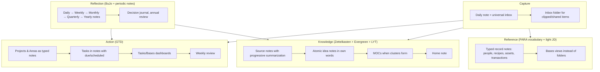

Concretely:

| Job | Method borrowed | Obsidian implementation |
| --- | --- | --- |
| Capture | GTD inboxes, BuJo daily log, CODE "capture what resonates" | Daily note as default target; `Inbox/` folder for clipped/shared items; mobile quick-capture template |
| Action | GTD wholesale; PARA's Project/Area distinction; OKR-style goals | `project`, `area`, `goal` note types; Tasks plugin with due/scheduled/priority; Bases views for project portfolio; weekly review template |
| Reference | PARA vocabulary; Johnny.Decimal only for documents | Typed record notes (`person`, `recipe`, `asset`, `subscription`…) with properties; Bases tables as the "folders"; a few real folders |
| Knowledge | Zettelkasten discipline; Evergreen maturity; LYT MOCs; CODE progressive summarization | `Sources/` with distilled highlights; `Notes/` atomic claims with `status` maturity; `Maps/` MOCs created at squeeze points; `Home.md` |
| Reflection | BuJo, periodic notes, decision journals, annual review | Periodic Notes hierarchy with templates that roll up (weekly embeds/links dailies, monthly summarizes weeklies…); `decision` notes; yearly review template |

The folder skeleton that hosts this is a lightly modified ACCESS; Chapter 8 gives it in full.

## How to choose your emphasis

Everyone's vault leans one way. Decide yours explicitly:

- **Knowledge-heavy** (researcher, writer, student): invest in `Sources/`, `Notes/`, MOCs, spaced repetition, Zotero. Keep action management minimal — a project list and a weekly review.
- **Action-heavy** (manager, founder, parent running a household): invest in projects, tasks dashboards, people notes, meeting notes, periodic reviews. Keep knowledge as a curated reading pipeline.
- **Records-heavy** (life admin, health tracking, finances): invest in typed record notes and Bases; templates and quick-capture on mobile matter most.
- **Reflection-heavy** (journaling, self-development): invest in the periodic-notes hierarchy, mood/energy properties, decision journal, and the reviews.

The whole-life vault needs all four, but you will start with one, and the others come online over months. The [Roadmap](35-mastery-roadmap.md) sequences this.

## Key takeaways

- Methods solve different jobs: Zettelkasten/Evergreen/LYT → knowledge; GTD → action; PARA → vocabulary for projects vs areas; CODE → capture and distillation; BuJo/periodic notes → reflection; Johnny.Decimal → documents.
- Take the strongest component of each: daily-note capture, GTD action management with a weekly review, atomic idea notes with MOCs, typed record notes viewed through Bases, and a periodic-notes reflection ladder.
- Avoid the anti-patterns: deep folders, tag explosion, template and dashboard maximalism, the collector's fallacy, plugin churn, and no review ritual.
- Decide which of knowledge/action/records/reflection you are emphasizing first; the rest follows.

## Next

[Chapter 8: Vault Architecture — the Reference Design →](#vault-architecture-the-reference-design)

---

# Vault Architecture — the Reference Design

This chapter is the blueprint. It gives a complete, opinionated vault design for someone who wants to run their whole life in Obsidian: the folder tree, naming conventions, the note-type catalogue with schemas, the flow of information from capture to archive, the MOC hierarchy, and the policies for attachments and archiving. Every domain chapter in Part IV assumes this design (and says how to adapt it). You can copy it wholesale or take pieces; either way, write your own version down in a `Meta/Vault Guide.md` note so the design survives your memory.

## Design goals

1. **Shallow.** No more than two folder levels in daily use. Depth comes from links and Bases, not folders.
2. **Typed.** Every note has a `type` property. Dashboards, templates, and queries key off it.
3. **Capture-first.** There is always an obvious, zero-decision place to put something: the daily note or `Inbox/`.
4. **Query, don't file.** Lists of things are Bases/Dataview views over properties, never hand-maintained.
5. **Portable.** Nothing essential lives only in a plugin's `data.json`. Folder names and properties make sense without Obsidian.
6. **Mobile-sane.** Capture and reading work on a phone with a handful of plugins; administration happens on desktop.

## The folder tree

```text
Vault/
├── 00 Home.md                  ← the front door (dashboard)
├── Inbox/                      ← unprocessed captures (clips, shares, quick notes)
├── Journal/
│   ├── Daily/                  ← 2026-09-06.md
│   ├── Weekly/                 ← 2026-W36.md
│   ├── Monthly/                ← 2026-09.md
│   ├── Quarterly/              ← 2026-Q3.md
│   └── Yearly/                 ← 2026.md
├── Projects/                   ← one note per project (or one subfolder per big project)
├── Areas/                      ← one note per area of life + area MOCs
├── Goals/                      ← goal notes (year / quarter / life)
├── People/                     ← one note per person
├── Sources/                    ← things other people made
│   ├── Books/
│   ├── Articles/
│   ├── Papers/
│   ├── Podcasts/
│   ├── Videos/
│   └── Courses/
├── Notes/                      ← your atomic ideas (Zettelkasten "permanent notes")
├── Maps/                       ← MOCs (maps of content)
├── Work/                       ← meetings, decisions, docs (or a separate vault if confidentiality demands)
│   ├── Meetings/
│   └── Docs/
├── Life/                       ← records: admin, home, travel, recipes, inventory, habits
│   ├── Admin/
│   ├── Home/
│   ├── Travel/
│   ├── Recipes/
│   ├── Inventory/
│   └── Habits/
├── Health/
│   ├── Workouts/
│   └── Log/
├── Finance/
│   ├── Accounts/
│   ├── Subscriptions/
│   └── Ledger/
├── Mind/                       ← reflection: decisions, values, principles, quotes, reviews
├── Bases/                      ← .base files (dashboards)
├── Canvases/
├── Templates/                  ← excluded from search/suggestions
├── Scripts/                    ← Templater user scripts, CSS snippets source, misc
├── Attachments/                ← everything binary (auto-routed)
├── Archive/                    ← mirrors the top-level structure for finished/inactive items
└── Meta/                       ← Vault Guide.md, Schema.md, Plugin list.md, Changelog.md
```

Why this shape:

- It is **ACCESS-adjacent** (Atlas→Maps, Calendar→Journal, Cards→Notes, Extras→Templates/Attachments/Scripts, Sources→Sources, Spaces→Projects/Areas/Work/Life…) but names folders by *what is inside* so they make sense without reading Nick Milo.
- **Projects, Areas, Goals, People** are top-level because they are the nouns every other note links to; you want them visible and quick to reach.
- **Life/Health/Finance** are separate from Areas: `Areas/Health.md` is the *area note* (standards, goals, review cadence); `Health/` holds the *records*. This distinction keeps the area note readable.
- **Work** is separate so it can be excluded from Publish, moved to its own vault, or deleted when you change jobs.
- **`00 Home.md`** sorts first; the numeric prefix is the only one in the vault.
- **Bases/** collects `.base` files so they are easy to find and embed; embedded bases in notes are fine too.
- **Archive/** mirrors the structure so moving something is mechanical and finding it later is predictable. Archiving is a *status change first*, a move second (see policy below).

!!! tip "Adapting"
    Fewer folders is always fine. A minimal variant: `Inbox, Journal, Notes, Sources, Projects, People, Life, Templates, Attachments, Archive`. Add a folder only when a Base filter by `type` is not enough — usually because of attachment routing, templates-per-folder, or publish/sync exclusion.

## Naming conventions

| Thing | Convention | Example |
| --- | --- | --- |
| Daily note | `YYYY-MM-DD` | `2026-09-06` |
| Weekly | `YYYY-[W]WW` (ISO week) | `2026-W36` |
| Monthly | `YYYY-MM` | `2026-09` |
| Quarterly | `YYYY-[Q]Q` | `2026-Q3` |
| Yearly | `YYYY` | `2026` |
| Project | Imperative or noun phrase, Title Case | `Launch Newsletter`, `Kitchen Renovation` |
| Area | Single noun, Title Case | `Health`, `Finances`, `Career`, `Family` |
| Goal | Outcome statement, optionally with year | `Run a Half Marathon 2027` |
| Person | Full name as you would say it | `Jane Doe`; aliases for nicknames |
| Source | Title of the work (no author) | `Deep Work`; author is a property + link |
| Idea note | A declarative claim in sentence case | `Constraints increase creativity` |
| MOC | Topic + " MOC" (or "Map") | `Sleep MOC`, `Stoicism Map` |
| Meeting | `YYYY-MM-DD Topic` | `2026-09-06 Alpha kickoff` |
| Decision | `YYYY-MM-DD Decision - Topic` or claim | `2026-09-06 Decision - Switch to Fastmail` |
| Recipe | Dish name | `Shakshuka` |
| Workout | `YYYY-MM-DD Kind` | `2026-09-06 Strength A` |
| Templates | `tpl-<type>` | `tpl-project`, `tpl-daily` |
| Bases | `<Noun> Base` or purpose | `Projects.base`, `Reading List.base` |
| Attachments | `<note-slug>-<description>.<ext>` or `YYYYMMDD-<desc>` | `kitchen-renovation-floorplan.png` |

Rules:

- **Unique names across the vault.** If two things want the same name, disambiguate with a qualifier in the title (`Alpha (project)` / `Alpha (person)`) — or better, rename one.
- **No dates in idea-note titles; always dates in event-note titles.**
- **Title Case for nouns (people, projects, sources); sentence case for claims.** It signals the note type at a glance.
- **Avoid special characters** (`: / \ | # ^ [ ] ?`) — Obsidian forbids most of them anyway; `&` and `'` are fine but hurt URLs on Publish.
- **Do not put the type in the filename** (`Project - Alpha`). The `type` property and the folder carry that.

## Note types and schemas (the catalogue)

Chapter 5 listed the schema; here are the *templates' skeletons* for the core types. Full Templater versions are in Chapters 11 and 36.

### Daily note

```markdown
---
type: daily
date: 2026-09-06
mood:
energy:
sleep_h:
tags: []
---
« [[2026-09-05]] | [[2026-W36]] | [[2026-09-07]] »

## Plan
- [ ]

## Log
- 07:10

## Notes

## Gratitude / reflection
```

### Project

```markdown
---
type: project
status: active          # idea | active | on-hold | done | dropped
area: "[[Career]]"
goal:
priority: 2             # 1 high · 2 normal · 3 low
start: 2026-09-01
due:
completed:
tags: []
---
## Outcome
One sentence: what "done" looks like.

## Next actions
- [ ]

## Log
- 2026-09-01 — Kicked off.

## Notes & links

## Review
Last reviewed: 2026-09-06
```

### Area

```markdown
---
type: area
review_cadence: monthly
standard: "Sleep 7.5h avg, train 3×/week, resting HR < 60"
tags: []
---
## Why this matters

## Current standard
(what "good enough" looks like — the bar you maintain)

## Active projects
```base
filters:
  and:
    - type == "project"
    - status == "active"
    - area == this
views:
  - type: table
    name: Active
    order: [file.name, due, priority]
```

## Habits & routines

## Related maps
```

### Person

```markdown
---
type: person
relationship: friend    # family | friend | colleague | acquaintance | professional
birthday:
email:
phone:
company:
location:
last_contact:
contact_every: 60       # days
tags: []
---
## About

## Interactions
(Backlinks from daily notes and meetings do most of the work; add a line here for significant events.)

## Gift ideas / preferences

## Family & connections
```

### Source (book example)

```markdown
---
type: source
medium: book            # book | article | paper | podcast | video | course
author: ["[[Cal Newport]]"]
status: reading         # to-read | reading | read | abandoned
rating:
started: 2026-08-14
finished:
url:
isbn:
topics: ["[[Focus]]", "[[Productivity]]"]
tags: []
---
> [!summary] In one paragraph
> (fill in after finishing)

## Key ideas (own words, one per bullet → candidates for [[Notes]])
-

## Highlights & notes
(progressive summarization: **bold** the important, ==highlight== the essential)

## Quotes
```

### Idea note

```markdown
---
type: note
status: seedling        # seedling | budding | evergreen
topics: []
sources: []
tags: []
---
(The claim in the title, argued in 1–5 paragraphs, in your own words. Link generously, with reasons.)

## Related
-
```

### MOC

```markdown
---
type: moc
area:
tags: [moc]
---
> [!abstract] Scope
> What this map covers and how it is organized.

## Start here
-

## Core ideas
-

## Sources
-

## Open questions
-

## Unsorted (recent notes tagged/linked here)
```dataview
LIST FROM [[]] AND -"Maps" WHERE type = "note" SORT file.ctime DESC LIMIT 20
```
```

### Meeting

```markdown
---
type: meeting
date: 2026-09-06
attendees: ["[[Jane Doe]]"]
project: "[[Launch Newsletter]]"
decisions: []
next_meeting:
tags: []
---
## Agenda
## Notes
## Decisions
## Actions
- [ ] 👤 Jane —
- [ ] Me —
```

### Decision

```markdown
---
type: decision
date: 2026-09-06
status: decided         # open | decided | reviewed
confidence: 7
review_on: 2027-03-06
options: []
chosen:
tags: []
---
## Context
## Options considered
## Decision & reasoning
## Expected outcome (falsifiable)
## Review (fill on review_on)
```

## The flow: capture → process → organize → use → archive

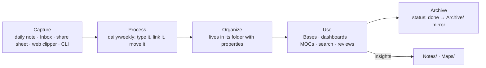

**Capture** — four entrances, all zero-decision:

1. *Daily note* (hotkey): tasks, log lines, fleeting ideas, links to people and projects as they come up.
2. *Inbox/* (default new-note location for quick switcher creates, Web Clipper, mobile Share Sheet, `obsidian create` from scripts).
3. *Directly typed* when the type is obvious (a new person, a new recipe) via a QuickAdd/Templater command that asks for the type and files it.
4. *Automated* (Readwise export, calendar → meeting notes, email-to-vault) landing in `Inbox/` or the correct folder with properties pre-filled.

**Process** — daily (5 min) or weekly (30 min): open `Inbox/` (a Base sorted by ctime), for each item: give it a `type` (template), link it to its project/area/person/topic, move it to its folder (or delete it). Tasks written in daily notes need no processing — queries surface them. Ideas noted in the daily note that deserve their own page get extracted (Note composer) into `Notes/`.

**Organize** — the folder + properties are the organization. Nothing else to do.

**Use** — `00 Home.md` is the daily entry (embedded Bases: today's tasks, active projects, people to contact, reading in progress; links to this week's note and top MOCs). Area notes are the monthly entry. MOCs are the knowledge entry. Search for everything else.

**Archive** — see policy below.

## The MOC hierarchy

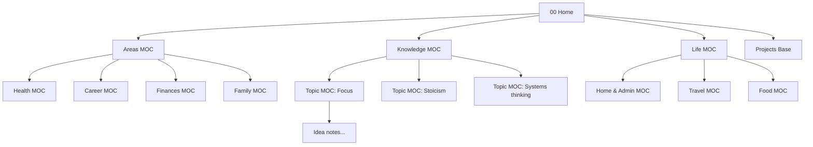

- **Home** links to ≤ 12 things. If it needs more, add a level.
- **Area MOCs** (one per area) combine the area note's standards with links to its projects, habits, records bases, and topic MOCs.
- **Topic MOCs** curate idea notes and sources on a subject. Create one when ~15 notes cluster (local graph tells you).
- **Life MOCs** index records: recipes, travel, home. Often just an embedded Base plus a few links.
- Every MOC links *up* to its parent in a first line (`Up: [[Knowledge MOC]]`) so navigation works both ways; the **Breadcrumbs** plugin can formalize this if you like hierarchies.

## Attachments policy

- Everything binary goes to `Attachments/` (setting). One flat folder is fine up to a few thousand files; beyond that, `Attachments/YYYY/` via the **Attachment Management** or **Custom Attachment Location** plugins.
- Rename pasted images at paste time (`Pasted image 2026….png` is unsearchable). Plugins: *Paste image rename*, *Attachment Management* (auto-renames to `<note>-<n>`).
- PDFs of sources go to `Attachments/` and are *embedded* in the source note (`![[book.pdf#page=12]]`); annotations live in the note (PDF++ writes highlights as links).
- Large media (video, raw photos, datasets) live **outside** the vault (cloud drive or NAS) and are linked with `file:///` or `https://` links; the vault stays small enough to sync to a phone.
- Exclude `Attachments/` in *Excluded files* so it never pollutes search or the `[[` suggester.
- Monthly: the **Janitor** plugin (or 1.12's delete-attachments prompt as you go) removes orphans.

## Archive policy

1. **Status first.** When a project finishes: `status: done`, `completed: <date>`. Bases and dashboards already hide it. Do this immediately.
2. **Move later.** Quarterly, move `done`/`dropped` projects, finished trips, past years' meetings, etc. into `Archive/<mirrored path>`. Links keep working (shortest-path or auto-update).
3. **Never archive** People, Sources, Notes, Maps, or Areas — they are timeless. A person you lost contact with gets `relationship: former`; a dead source is still a source.
4. **Journal is never moved.** `Journal/Daily/` grows forever; years of daily notes are the point.
5. **Exclude `Archive/`** from search suggestions if it gets noisy (it still searches when you use `path:Archive`).

## Templates set

The minimum: `tpl-daily`, `tpl-weekly`, `tpl-monthly`, `tpl-quarterly`, `tpl-yearly`, `tpl-project`, `tpl-area`, `tpl-goal`, `tpl-person`, `tpl-source`, `tpl-note`, `tpl-moc`, `tpl-meeting`, `tpl-decision`. Domain-specific (`tpl-recipe`, `tpl-workout`, `tpl-trip`, `tpl-subscription`…) get added as domains come online. Chapter 11 implements them with Templater (folder templates auto-apply: new note in `People/` → `tpl-person`), Chapter 36 collects them.

## Bases set (dashboards)

Kept in `Bases/`, embedded where needed:

| Base | Filter | Views |
| --- | --- | --- |
| `Inbox.base` | `file.inFolder("Inbox")` | table by ctime |
| `Projects.base` | `type == "project"` | Active (table), By area (grouped), Timeline (sorted by due), Done this year |
| `People.base` | `type == "person"` | Contact due (`last_contact + contact_every days < today()`), Birthdays this month, By relationship |
| `Reading.base` | `type == "source"` | To read, Reading, Finished by year (cards with covers) |
| `Ideas.base` | `type == "note"` | Seedlings to develop, Evergreens, Recently touched |
| `Meetings.base` | `type == "meeting"` | This week, By project |
| `Decisions.base` | `type == "decision"` | Open, Due for review |
| `Recipes.base` | `type == "recipe"` | Cards by cuisine, Not made in 60 days |
| `Subscriptions.base` | `type == "subscription"` | Active with monthly cost sum, Renewing in 30 days |
| `Workouts.base` | `type == "workout"` | Last 30 days, By kind with duration sums |
| `Habits.base` | `type == "habit"` | Active |

Chapter 10 provides the YAML for all of these.

## The Home note

```markdown
---
type: moc
cssclasses: [dashboard]
---
# Home
**Today:** [[<% tp.date.now("YYYY-MM-DD") %>]] · **Week:** [[<% tp.date.now("YYYY-[W]WW") %>]] · [[Weekly Review]]

## Today's tasks
```tasks
not done
(due before tomorrow) OR (scheduled before tomorrow)
sort by priority
```

## Active projects
![[Projects.base#Active]]

## People to reach out to
![[People.base#Contact due]]

## Reading
![[Reading.base#Reading]]

## Maps
[[Areas MOC]] · [[Knowledge MOC]] · [[Life MOC]] · [[Inbox.base|Inbox]]
```

(The `<% %>` date is a Templater snippet — the Home note is regenerated daily by a Templater "startup template", or use the **Homepage** plugin to open it on launch and Dataview inline `= date(today)` for the date.)

## Multi-vault vs single vault (final word)

Single vault for personal life. Consider a second vault only for: an employer's confidential material (legal/contractual separation), a shared vault with family or a team (different sync permissions), or a publish-only vault (a digital garden built from copied notes). If you split, keep the *same* folder skeleton and templates in both so muscle memory transfers.

## Setting it up in 30 minutes

1. Create the folders (copy the tree; delete what you will not use this quarter).
2. Settings: attachments → `Attachments/`; new notes → `Inbox/`; excluded files → `Templates/`, `Attachments/`, `Archive/`; Templates folder → `Templates/`; Daily notes → `Journal/Daily`, format `YYYY-MM-DD`, template `tpl-daily`.
3. Install Templater, Tasks, Dataview (Chapter 14 tiers) — three plugins are enough to start.
4. Paste the templates above into `Templates/` (Templater versions in Chapter 11).
5. Create `00 Home.md`, `Areas/` notes for your 5–8 areas, and one project note per active project.
6. Create `Projects.base` and `Inbox.base` (Chapter 10) and embed them in Home.
7. Write today's daily note. Stop building. Use it for two weeks before adding anything.

## Key takeaways

- Shallow, typed, capture-first, query-not-file, portable, mobile-sane — every decision in the design follows from these six goals.
- The folder tree is ACCESS-shaped with plain names; Projects/Areas/Goals/People are top-level nouns; records (Life/Health/Finance) are separate from area notes; Archive mirrors the tree.
- Naming: dates for events, claims for ideas, Title Case for nouns, unique names always, no type in filenames.
- Four capture entrances (daily note, Inbox, typed create, automation), one processing ritual, Bases as the organization layer, Home → Area/Topic/Life MOCs as the navigation layer.
- Archive by status first, move quarterly; never archive people, sources, ideas, maps or the journal.
- Set it up in 30 minutes, then use it for two weeks before building more.

## Next

[Chapter 9: Core Plugins — Every One, Mastered →](#core-plugins-every-one-mastered)

---

# Core Plugins — Every One, Mastered

Core plugins ship with Obsidian, are maintained by the Obsidian team, work identically on desktop and mobile, and are the most stable foundation you can build on. Many users never look past the defaults and then install a community plugin for something a core plugin already does. This chapter goes through every core plugin (as of 1.13): what it does, the settings that matter, and the non-obvious tricks. Bases gets its own chapter (10) because of its depth.

## Enabling and finding them

Settings → Core plugins (searchable since 1.13). Each has a toggle and, where relevant, a gear for options. Their commands appear in the command palette prefixed by the plugin name; hotkeys are assignable for all of them. Disabled core plugins cost nothing; enabled-but-unused ones cost almost nothing (unlike community plugins).

## Navigation & structure

### File explorer

The tree of files and folders.

- Sort: by name, modified, created (ascending/descending); the sort is saved with the layout (1.10+).
- **Auto reveal current file** (gear) keeps the tree following your active note; turn off if you find it jumpy (since 1.13 it no longer fires while you are renaming).
- Multi-select with ++shift++-click (range) or ++ctrl++-click (toggle); ++alt++-click adds the previously active item to the selection (1.12). Then drag, delete, or move together.
- Copy/paste files with ++ctrl+c++/++ctrl+v++ (1.12); duplicate via context menu.
- Right-click a folder → *New note*, *New canvas*, *New base*, *New folder*, *Set as attachment folder*, *Search in folder*.
- Drag a note into the editor to insert a link. Drag a folder from your OS onto the app to import it with structure (1.13).
- Collapse all / expand all icons at the top; ++esc++ clears selection.
- The explorer honours *Excluded files* only for dimming; to hide folders entirely use a CSS snippet (Chapter 28) or the *Hider* plugin.

### Search

Covered in Chapter 6.

### Quick switcher

Covered in Chapters 2 and 6. Setting worth knowing: *Show existing only* (hides the "create new" suggestion) and *Show attachments* / *Show all file types*.

### Bookmarks

Bookmarks replace the old "Starred" plugin and can bookmark **files, folders, headings, blocks, searches, graph views, and URLs**, organized in nested groups with drag-and-drop. 1.13 added a search box to the pane and keyboard navigation.

Use it for: a "Daily driver" group (Home, this week, current project), "Saved searches" (Chapter 6), "Reference blocks" (the exact paragraph with your Wi-Fi setup, the block with your standard meeting agenda), and per-project groups you delete when the project ends. Bookmarks are stored in `.obsidian/bookmarks.json`; the CLI can add them (`obsidian bookmark file=… subpath=…`).

### Outline

Heading tree of the current note in a sidebar. Click to jump; drag headings to reorder sections (with their content); right-click → rename heading (updates links). Settings: *Auto-follow cursor*, *Show search*. For long notes, pin an Outline tab in the right sidebar and never scroll again. The community *Quiet Outline* adds levels, search-as-you-type, and better styling.

### Tags view

All tags with counts, nested tags collapsible, sort by name or frequency, click to search. Renaming and drag-nesting need **Tag Wrangler**.

### Properties view

Two views: the in-note property editor (managed under Editor → Properties in document) and the **All properties** sidebar view listing every property name in the vault with counts. From the sidebar: rename a property everywhere, change its type, delete it from all notes (1.10). Keyboard: arrows to move, ++backspace++ to delete (1.13). This is your schema-hygiene console.

### Backlinks / Outgoing links

Chapter 4. Settings: *Backlink in document* (footer section on every note), *Show more context*, *Collapse results*.

### Page preview

Hover a link with ++ctrl++ (or without, per setting) to see a popup preview of the target — including the specific heading or block. Works for images, PDFs, and bases. Setting per-context (editor, search, backlinks…). **Hover Editor** (community) upgrades previews into editable floating windows.

### Graph view

Chapter 4.

### Canvas

Chapter 4. Settings: default new-file location for canvases, snap to grid/objects, zoom sensitivity, show label at zoom threshold. Canvas rendering got faster in 1.13.

### Workspaces

Save/load layouts (Chapter 2). *Save layout*, *Load layout*, *Manage workspaces* commands; keep 3–5 named ones. CLI: `workspace:save`, `workspace:load name=…`.

### Web viewer

Since 1.8. Opens external links in an in-app browser tab (desktop). Settings: open external links in-app or in the default browser; search engine; whether to save browsing history. Useful when researching (highlight text → *Save to note*, *Copy link to selection*), and you can embed a web page in Canvas. Ad blocking is not included; heavy sites are slow. For clipping, the Web Clipper browser extension (Chapter 29) is better.

## Creating & editing

### Daily notes

The most-used core plugin. Settings: **Date format** (`YYYY-MM-DD` — never anything else), **New file location** (`Journal/Daily`), **Template file** (`Templates/tpl-daily`), **Open daily note on startup**. Commands: *Open today's daily note* (hotkey it), *Open previous/next daily note* (great for reading back through the week). The template's `{{date}}`, `{{time}}`, `{{title}}` placeholders work with core Templates; Templater can be set to process the daily note instead. For weekly/monthly/quarterly/yearly you need **Periodic Notes** (community) or Templater-generated notes. The CLI has `daily`, `daily:append`, `daily:prepend`, `daily:read`, `daily:path`.

### Templates

Insert a template file into the current note at the cursor. Settings: template folder, date format (`YYYY-MM-DD`), time format (`HH:mm`). Placeholders: `{{title}}`, `{{date}}`, `{{time}}`, `{{date:YYYY-MM-DD HH:mm}}` (Moment.js format). That is the whole feature. It is enough for simple vaults, and *Templater* (Chapter 11) supersedes it entirely for anything dynamic. Keep both enabled: core Templates is what the Daily notes plugin, the CLI (`template:insert`, `create template=…`) and the Unique note creator use by default.

### Unique note creator

Creates a note whose name is a timestamp (`YYYYMMDDHHmm` by default — set your own format) in a chosen folder with a chosen template. This is the Zettelkasten-ID workflow; also useful for quick capture when you do not want to think of a title (the title becomes an alias or H1 later). Since 1.13 it links to its own settings when it cannot find the template. The 1.12 `unique` URI action and the CLI `unique` command trigger it externally.

### Note composer

Three commands: **Extract current selection** (moves selected text to a new note, replaces with link/embed/nothing), **Extract this heading** (right-click a heading), **Merge entire file with…** (appends/prepends the current note into another and redirects links). Settings control the replacement text and whether extracted heading links are rewritten (1.13 does this automatically). This is how daily-note scribbles become idea notes without copying and pasting.

### Slash commands

Type `/` at the start of a line (or anywhere, depending on setting) to search and run any command inline. Configure the trigger character. Mobile users love it; desktop users mostly use the palette.

### Format converter

Converts legacy syntaxes (Roam-style `#[[tag]]`, `__bold__` variants, `{{TODO}}` tasks, etc.) after an import. Run once, then disable.

### Footnotes view

A sidebar listing the current note's footnotes; click to jump between reference and definition. Academic writers turn it on; everyone else can leave it off.

### Slides

Turns a note into a presentation: `---` separates slides; the *Start presentation* command shows it full screen with arrow-key navigation. Minimal styling, no speaker notes. For real talks use the **Advanced Slides** community plugin (reveal.js with themes, fragments, speaker view, PDF export) — but core Slides is enough for a 5-slide stand-up.

### Word count

Status bar word/character count; counts the selection when text is selected. Click for details. CLI: `wordcount`.

### Random note

Opens a random note (optionally limited to a folder via the CLI `random folder=Notes`). The cheapest possible spaced-review system: hit it three times a day and read old ideas. Use with the **Smart Random Note** plugin to restrict to a search query (e.g. `type: note status: seedling`).

## Data & files

### File recovery

Snapshots every changed file at an interval (default 5 minutes) and keeps them for N days (default 7). Settings → File recovery → *Snapshot interval*, *History length* — raise to 30+ days; the storage cost is small (it lives in IndexedDB, not your vault). Recover via the *Open file recovery* command or the CLI (`history`, `history:read`, `history:restore version=…`, `diff file=… from=1`). It is not a backup (it lives on the device) but it saves you from bad edits and plugin mishaps constantly.

### Importer

Imports from Notion (including databases → Bases, since Nov 2025), Evernote (.enex), Apple Notes, Bear, Roam Research (JSON), Google Keep, OneNote, Microsoft OneNote, HTML, Markdown variants, Airtable (Aug 2026), and more. Chapter 33 covers migration end-to-end.

### Sync

The paid Obsidian Sync service; end-to-end encrypted; selective sync of folders and settings/plugins/themes; version history (up to a year on Plus); multiple vaults. Settings: what to sync (images, audio, video, PDFs, other types, size limits — since 1.12 Sync logs skipped-too-large files), which settings to sync (appearance, hotkeys, core plugins, community plugins + their data; 1.13 warns before syncing community plugins because plugin data can be device-specific). The Sync view in the sidebar (1.13) shows recent changes with context menus, drag-and-drop, multi-select, and delete. The CLI adds `sync`, `sync:status`, `sync:history`, `sync:read`, `sync:restore`, `sync:deleted`. Chapter 26 compares Sync with alternatives.

### Publish

The paid Obsidian Publish service: choose notes to publish, get a hosted site with graph, search, backlinks, and custom domain. `publish: true/false` property controls inclusion; `permalink`, `description`, `image` customize pages. CLI: `publish:add`, `publish:remove`, `publish:status`, `publish:site`. Chapter 31 covers Publish and free alternatives.

## Interface

### Command palette

++ctrl+p++. Settings → *Pinned commands* puts your favourites on top. Recent commands rise automatically. Type a few letters of each word to fuzzy match. ++ctrl+n++/++ctrl+p++ move through suggestions on all platforms (1.13).

### Bases

Chapter 10. Enabled by default on new vaults; older vaults need to toggle it on.

## Core plugin combinations worth stealing

- **Daily notes + Templates + Note composer** = capture-in-daily-note, extract-to-idea-note.
- **Bookmarks (search) + Backlinks in document** = a review workflow with no plugins.
- **Random note + Outline** = resurfacing old notes and skimming them quickly.
- **Workspaces + Canvas** = a "Planning" layout with a project board.
- **File recovery + Sync history + CLI `diff`** = three layers of undo.
- **Unique note creator + Slash commands** = mobile quick capture without thinking.
- **Web viewer + Canvas** = research board with live web pages beside your notes.

## What core plugins cannot do (so you know what to install)

| Need | Core answer | Community answer |
| --- | --- | --- |
| Weekly/monthly/quarterly notes | none | Periodic Notes, or Templater |
| Dynamic templates (prompts, dates math, logic) | Templates placeholders only | Templater, QuickAdd |
| Task queries with due dates/recurrence | Search operators `task-todo:` | Tasks |
| Computed tables with inline fields | Bases (properties only) | Dataview |
| Rename tags | none | Tag Wrangler |
| Kanban boards | Bases (no kanban view) | Kanban plugin, or Bases + a Kanban view plugin |
| Spaced repetition | Random note (crude) | Spaced Repetition |
| Calendar widget | none | Calendar, Full Calendar |
| Git sync | none | Git |
| Drawings | Canvas (boxes/arrows) | Excalidraw |
| Per-folder auto templates | none | Templater folder templates |
| Vault-wide find & replace | none | Regex Find/Replace |
| Hide folders | Excluded files (dims only) | CSS / Hider |

## Key takeaways

- Core plugins are stable, mobile-safe, and free of maintenance risk — exhaust them before installing community alternatives.
- The highest-value ones for a whole-life vault: Daily notes, Templates, Bookmarks, Backlinks, Outline, Properties view, Note composer, File recovery, Workspaces, Bases, Canvas, Random note.
- Raise File recovery's history length; bookmark your searches; hotkey today's daily note; learn Note composer's extract/merge.
- Know the gaps (periodic notes, dynamic templates, task queries, computed tables, tag renaming, Git) so you install exactly the community plugins that fill them.

## Next

[Chapter 10: Bases — the Native Database →](#bases-the-native-database)

---

# Bases — the Native Database

Bases (core plugin, Obsidian 1.9, August 2025) turns any set of notes into a database view — table, cards, list, map, and (from 1.14) kanban — driven by properties, with filters, formulas, grouping, summaries, inline editing, and an open YAML file format. For most "show me all my X sorted by Y" needs it replaces Dataview with something faster, editable, mobile-native, and maintained by the Obsidian team. This chapter is the complete practical reference: the file format, every view type, the filter and formula language with the full function list condensed, and two dozen ready-to-paste bases for a whole-life vault.

## What a base is

A `.base` file is YAML describing **filters** (which notes), **formulas** (computed columns), **properties** (display config), **summaries** (aggregations), and **views** (how to show them). The set of notes is always "every file in the vault, narrowed by filters" — there is no `FROM`. Bases read **properties** (frontmatter), **file metadata** (name, path, folder, size, times, tags, links, embeds, backlinks) and, for non-Markdown files, file properties only. They do **not** read inline `key:: value` fields, tasks, or body text.

Create one: File explorer right-click → *New base*, the ribbon, or *Bases: Create new base* command. Or type it by hand — the UI and the YAML stay in sync. Embed with `![[Name.base]]` or `![[Name.base#View name]]`, or inline in any note:

````markdown
```base
filters:
  and:
    - type == "project"
    - status == "active"
views:
  - type: table
    name: Active projects
    order: [file.name, due, priority]
```
````

Inline bases are ideal for a project list inside an Area note; `.base` files are better for anything embedded in more than one place.

## The file format

```yaml
# Projects.base
filters:                       # global — applied to every view (AND-ed with view filters)
  and:
    - type == "project"
    - '!file.inFolder("Archive")'

formulas:                      # computed properties, referenced as formula.<name>
  days_left: 'if(due, (due - today()) / 86400000, "")'
  overdue: 'due && due < today() && status != "done"'
  age_days: '((now() - file.ctime) / 86400000).round(0)'

properties:                    # display configuration only (not used in filters/formulas)
  status:
    displayName: Status
  formula.days_left:
    displayName: Days left
  file.name:
    displayName: Project

summaries:                     # custom aggregations (optional; built-ins exist)
  pct_done: 'values.filter(value == "done").length / values.length'

views:
  - type: table
    name: Active
    filters:
      and:
        - status == "active"
    order:                     # columns, in order
      - file.name
      - area
      - due
      - formula.days_left
      - priority
    sort:
      - property: due
        direction: ASC
      - property: priority
        direction: ASC
    limit: 50
    summaries:
      formula.days_left: Min
  - type: table
    name: By area
    groupBy:
      property: area
      direction: ASC
    order: [file.name, status, due]
  - type: cards
    name: Gallery
    order: [file.name, status, area]
    image: cover               # property holding an image link/URL/hex colour
    imageFit: cover
    imageAspectRatio: 0.6
    cardSize: 240
  - type: list
    name: Quick list
    order: [file.name, status]
```

Key facts:

- Filters: a **string expression** or a **nested object** with exactly one of `and`, `or`, `not`, containing a list of expressions or further objects. Global `filters` and view `filters` are combined with AND.
- Formulas are strings in YAML; text literals inside need their own quotes (`'if(x, "yes", "no")'`). Output type follows the data (a formula returning a date sorts as a date).
- `order` lists the columns/properties shown; `sort` is a list of `{property, direction}`; `groupBy` takes one property (and a direction); `limit` caps rows.
- Property references: `note.price` or just `price` for frontmatter; `file.<x>` for file metadata; `formula.<x>` for formulas. Hyphenated names need brackets: `note["sleep-hours"]` — one more reason to use `snake_case`.
- Views can store extra keys for their layout (cards' `image`, `cardSize`, table column widths, etc.). The UI writes these; you rarely hand-edit them.

## Views

### Table

Rows are files; columns are properties/formulas. Cells for **note properties are editable inline** (text, number, date pickers, checkboxes, lists), and edits write straight to the note's frontmatter. Since 1.10: cell **selection** (shift-click, ++ctrl+shift+arrow++), **copy/paste** across cells (paste a value down a column — the fastest way to fix a hundred `status` typos), **undo/redo**, full keyboard navigation (++tab++, ++enter++ to edit, ++esc++, ++home++/++end++, ++ctrl+space++ column, ++shift+space++ row), **row height** setting, column resize (1.13 menu item), and right-click on a row for the file's context menu (1.12). Formula cells open a formula editor on ++enter++.

**Summaries** (1.10): right-click a column header → *Summarize…* → Average, Min, Max, Sum, Range, Median, Stddev (numbers); Earliest, Latest, Range (dates); Checked, Unchecked (booleans); Empty, Filled, Unique (any); or a custom summary formula operating on `values`. Summaries appear in a footer row and respect the current filters — a live "total monthly subscription cost" or "average mood this month".

**Group by** (1.10): one property; groups collapse; summaries apply per group when grouped.

### Cards

A gallery grid. Settings: card size, image property (a property holding `"[[cover.jpg]]"`, an `https://` URL, or a hex colour like `#7c3aed`), image fit (cover/contain), aspect ratio. Perfect for books with covers, recipes with photos, people with avatars, trips with a hero image, and colour-coded projects (put a hex colour in a `color` property).

### List

Bulleted or numbered list of files with chosen properties inline; supports multi-line content and nested properties. Great embedded in MOCs and area notes where a table is too heavy.

### Map

Requires the official **Maps** plugin (community directory, open source — also the reference implementation of a Bases view plugin). Pins are placed by latitude/longitude properties with a title property. Travel logs, restaurants, running routes' start points, people by city.

### Kanban (1.14+, early access at time of writing)

Columns are the values of the **group-by property**; drag a card to another column to change that property in the note; `+` in a column creates a note pre-filled with the value; drag column headers to reorder (right-click → *Reset order*). Options: hide empty columns, column width, image property. Grouping by a formula or file property makes the board read-only. This replaces the community Kanban plugin for property-driven boards (project status, reading pipeline, hiring pipeline, recipe test status) — the community plugin remains better for free-form boards of ad-hoc cards.

### Plugin views

The Bases API (1.10) lets plugins register view types. Beyond Maps, expect calendar, timeline, gallery, chart, and graph views from the community. Check the plugin directory for "Bases view".

## The toolbar

View menu (add/switch/reorder/configure views) · Results (count, **limit**, **Copy to clipboard** as a table that pastes into Sheets/Excel, **Export CSV**) · Sort (sort and group) · Filter (point-and-click builder with **All views** / **This view** sections and an *advanced* code editor for raw expressions) · Properties (choose displayed columns, **create formulas**) · Search (1.12: filter rows by displayed text) · New (create a file that satisfies the current filters — Bases infers `type: project` and `status: active` from equality filters).

Drag-and-drop: drop files onto a base to import them (1.12); drag a row's link from a base into the File explorer to move the file (1.13).

## Filters and formulas: the language

Bases expressions follow JavaScript semantics. Property names are bare identifiers; strings are quoted; numbers plain; booleans `true`/`false`; regex literals `/pattern/flags`.

### Operators

| Kind | Operators |
| --- | --- |
| Arithmetic | `+ - * / %` and parentheses |
| Comparison | `== != > < >= <=` (dates and numbers; `==`/`!=` on anything, including links vs files) |
| Boolean | `!`, `&&`, `\|\|` |
| Date arithmetic | `date + "1M"`, `now() - "2h"`, `today() + "7d"`; units `y M d w h m s` and long forms (`"1 week"`). `date - date` → milliseconds. `duration("5h") * 2` (duration on the left). |

### `this`

- In a base opened in the main area: `this` = the base file.
- In a base **embedded** in a note or canvas: `this` = the embedding note. So `area == this` inside `Areas/Health.md` shows Health's projects; `file.hasLink(this.file)` shows the note's backlinks.
- In a base in the **sidebar**: `this` = the active note in the main area — a live "related items" panel that follows you around.

### Global functions

`date(str)` · `duration(str)` · `now()` · `today()` · `file(pathOrLink)` · `link(path, display?)` · `image(pathOrUrl)` · `icon(lucideName)` · `html(str)` · `escapeHTML(str)` · `if(cond, a, b?)` · `list(x)` (wrap non-list into list — essential when a property is sometimes a string, sometimes a list) · `number(x)` · `min(...)` · `max(...)` · `random()`.

### By type (condensed)

| Type | Fields / functions |
| --- | --- |
| **Any** | `.isTruthy()`, `.isType("string")` etc., `.toString()`, `.isEmpty()` |
| **String** | `.length`, `.contains(s)`, `.containsAll(...)`, `.containsAny(...)`, `.startsWith(s)`, `.endsWith(s)`, `.lower()`, `.title()`, `.trim()`, `.slice(a,b?)`, `.split(sep, n?)`, `.replace(pattern\|regex, repl)` (capture groups `$1`), `.repeat(n)`, `.reverse()` |
| **Number** | `.abs()`, `.ceil()`, `.floor()`, `.round(digits?)`, `.toFixed(digits)` |
| **Date** | `.year .month .day .hour .minute .second .millisecond`, `.date()` (strip time), `.time()`, `.format("YYYY-MM-DD")` (Moment format), `.relative()` ("3 days ago") |
| **List** | `.length`, `.contains(v)`, `.containsAll(...)`, `.containsAny(...)`, `.filter(expr)` and `.map(expr)` (use `value`, `index`), `.reduce(expr, init)` (use `acc`, `value`), `.flat()`, `.join(sep)`, `.reverse()`, `.slice(a,b?)`, `.sort()`, `.unique()`, `.mean()`, `.median()`, `.stddev()` |
| **Link** | `.asFile()`, `.linksTo(file)` |
| **File** | `.name .basename .path .folder .ext .size .ctime .mtime .tags .links .embeds .backlinks .properties`, `.asLink(display?)`, `.hasLink(fileOrPath)`, `.hasTag(...tags)` (nested included), `.hasProperty(name)`, `.inFolder(folder)` (subfolders included) |
| **Object** | `.keys()`, `.values()`, `.isEmpty()` |
| **Regexp** | `.matches(str)` |

`file.backlinks` and `file.properties` are expensive and do not auto-refresh; prefer reversing the lookup (`file.hasLink(this.file)` on the other side).

### Formula cookbook

```yaml
formulas:
  # Days until due (negative = overdue), blank if no due date
  days_left: 'if(due, ((due - today()) / 86400000).round(0), "")'
  # Traffic light
  health: 'if(!due, "", if(due < today(), "🔴", if(due < today() + "7d", "🟡", "🟢")))'
  # Age of note in days
  age: '((now() - file.ctime) / 86400000).floor()'
  # Reading progress
  progress: 'if(pages && pages_read, (pages_read / pages * 100).round(0) + "%", "")'
  # Monthly cost normalised
  monthly: 'if(billing == "yearly", (cost / 12).round(2), cost)'
  # Contact overdue?
  contact_due: 'if(last_contact && contact_every, last_contact + (contact_every + "d") < today(), false)'
  # Birthday this year
  bday_this_year: 'if(birthday, date(today().year + "-" + birthday.format("MM-DD")), "")'
  # Link back to the area with an icon
  area_link: 'if(area, link(area, icon("compass")), "")'
  # Cover image from URL or attachment
  cover_img: 'if(cover, image(cover), "")'
  # First topic only, when topics may be string or list
  first_topic: 'list(topics)[0]'
  # Tag list as a string
  tag_str: 'file.tags.join(", ")'
  # Size in KB
  size_kb: '(file.size / 1024).toFixed(1) + " KB"'
  # Week number of the daily note
  week: 'if(date, date.format("YYYY-[W]WW"), "")'
  # Rating stars
  stars: 'if(rating, "★".repeat(rating) + "☆".repeat(5 - rating), "")'
  # Relative modified
  touched: 'file.mtime.relative()'
```

### Filter cookbook

```yaml
# Notes modified this week
- file.mtime > now() - "1w"
# Created this month
- file.ctime.month == today().month && file.ctime.year == today().year
# Any of several tags (nested included)
- file.hasTag("idea", "question")
# Property list contains a link to the current note
- topics.contains(this)
# Notes linking to this note (backlinks)
- file.hasLink(this.file)
# Notes this note links to (outlinks)
- this.file.hasLink(file)
# Empty or missing property
- status.isEmpty()
# Regex on file name
- /^\d{4}-\d{2}-\d{2}/.matches(file.name)
# Only Markdown, exclude templates
- file.ext == "md"
- '!file.inFolder("Templates")'
# Overdue and not done
- due < today() && status != "done"
# Big attachments
- file.ext != "md" && file.size > 5000000
```

YAML gotcha: expressions starting with `!` must be quoted (`'!file.inFolder("Archive")'`), and expressions containing `: ` or `#` should be quoted too.

## Ready-made bases for a whole-life vault

Paste each into `Bases/<name>.base`. They assume the Chapter 5/8 schema.

### Inbox

```yaml
filters:
  and:
    - file.inFolder("Inbox")
views:
  - type: table
    name: To process
    order: [file.name, type, file.ctime, file.size]
    sort:
      - property: file.ctime
        direction: DESC
```

### Projects

```yaml
filters:
  and:
    - type == "project"
formulas:
  days_left: 'if(due, ((due - today()) / 86400000).round(0), "")'
  health: 'if(status == "done", "✅", if(!due, "", if(due < today(), "🔴", if(due < today() + "7d", "🟡", "🟢"))))'
  last_review_age: 'if(reviewed, ((today() - reviewed) / 86400000).floor(), "")'
properties:
  formula.days_left: {displayName: "Days left"}
  formula.health: {displayName: ""}
views:
  - type: table
    name: Active
    filters:
      and:
        - status == "active"
    order: [formula.health, file.name, area, due, formula.days_left, priority]
    sort:
      - {property: priority, direction: ASC}
      - {property: due, direction: ASC}
  - type: table
    name: By area
    filters:
      and:
        - status != "done"
        - status != "dropped"
    groupBy: {property: area, direction: ASC}
    order: [file.name, status, due, priority]
  - type: table
    name: Needs review
    filters:
      and:
        - status == "active"
        - 'formula.last_review_age > 14 || reviewed.isEmpty()'
    order: [file.name, reviewed, formula.last_review_age]
  - type: table
    name: Done this year
    filters:
      and:
        - status == "done"
        - completed.year == today().year
    order: [file.name, area, completed]
    sort: [{property: completed, direction: DESC}]
  - type: table
    name: Someday
    filters:
      and:
        - 'status == "idea" || status == "on-hold"'
    order: [file.name, area, file.mtime]
```

### People

```yaml
filters:
  and:
    - type == "person"
formulas:
  next_contact: 'if(last_contact && contact_every, last_contact + (contact_every + "d"), "")'
  overdue_days: 'if(formula.next_contact, ((today() - formula.next_contact) / 86400000).floor(), "")'
  bday_md: 'if(birthday, birthday.format("MM-DD"), "")'
  age: 'if(birthday, ((today() - birthday) / 31557600000).floor(), "")'
views:
  - type: table
    name: Contact due
    filters:
      and:
        - 'formula.next_contact && formula.next_contact <= today()'
        - relationship != "former"
    order: [file.name, relationship, last_contact, formula.overdue_days]
    sort: [{property: formula.overdue_days, direction: DESC}]
  - type: table
    name: Birthdays this month
    filters:
      and:
        - birthday.month == today().month
    order: [file.name, birthday, formula.age]
    sort: [{property: formula.bday_md, direction: ASC}]
  - type: cards
    name: Directory
    groupBy: {property: relationship, direction: ASC}
    order: [file.name, company, location, email]
    image: photo
    cardSize: 180
```

### Reading / sources

```yaml
filters:
  and:
    - type == "source"
formulas:
  stars: 'if(rating, "★".repeat(rating), "")'
  days_reading: 'if(started && !finished, ((today() - started) / 86400000).floor(), "")'
  progress: 'if(pages && pages_read, (pages_read / pages * 100).round(0) + "%", "")'
views:
  - type: table
    name: Reading now
    filters: {and: [status == "reading"]}
    order: [file.name, author, medium, started, formula.days_reading, formula.progress]
  - type: cards
    name: To read
    filters: {and: [status == "to-read"]}
    order: [file.name, author, medium]
    image: cover
    imageAspectRatio: 1.5
    cardSize: 160
    sort: [{property: file.ctime, direction: DESC}]
  - type: table
    name: Finished by year
    filters: {and: [status == "read"]}
    groupBy: {property: finished, direction: DESC}
    order: [file.name, author, medium, formula.stars, finished]
    summaries:
      rating: Average
  - type: table
    name: By topic
    filters: {and: [status != "abandoned"]}
    groupBy: {property: topics, direction: ASC}
    order: [file.name, medium, status]
```

### Ideas (evergreen pipeline)

```yaml
filters:
  and:
    - type == "note"
views:
  - type: table
    name: Seedlings to develop
    filters: {and: [status == "seedling"]}
    order: [file.name, topics, file.mtime]
    sort: [{property: file.mtime, direction: ASC}]
    limit: 25
  - type: list
    name: Evergreens
    filters: {and: [status == "evergreen"]}
    order: [file.name, topics]
  - type: table
    name: Recently touched
    order: [file.name, status, file.mtime]
    sort: [{property: file.mtime, direction: DESC}]
    limit: 30
```

### Meetings

```yaml
filters:
  and:
    - type == "meeting"
views:
  - type: table
    name: This week
    filters:
      and:
        - date >= today() - "7d"
    order: [file.name, date, project, attendees]
    sort: [{property: date, direction: DESC}]
  - type: table
    name: By project
    groupBy: {property: project, direction: ASC}
    order: [file.name, date, attendees]
    sort: [{property: date, direction: DESC}]
  - type: table
    name: With this person   # embed in a person note
    filters:
      and:
        - attendees.contains(this)
    order: [file.name, date, project]
    sort: [{property: date, direction: DESC}]
```

### Decisions

```yaml
filters:
  and:
    - type == "decision"
views:
  - type: table
    name: Open
    filters: {and: [status == "open"]}
    order: [file.name, date, options]
  - type: table
    name: Due for review
    filters:
      and:
        - status == "decided"
        - review_on <= today()
    order: [file.name, date, chosen, confidence, review_on]
  - type: table
    name: All
    order: [file.name, date, status, confidence]
    sort: [{property: date, direction: DESC}]
    summaries:
      confidence: Average
```

### Recipes

```yaml
filters:
  and:
    - type == "recipe"
formulas:
  total_min: '(prep_min + cook_min)'
  since_made: 'if(last_made, ((today() - last_made) / 86400000).floor(), "never")'
views:
  - type: cards
    name: Gallery
    groupBy: {property: cuisine, direction: ASC}
    order: [file.name, course, formula.total_min, rating]
    image: photo
    imageAspectRatio: 0.75
  - type: table
    name: Quick weeknight
    filters:
      and:
        - formula.total_min <= 35
        - course == "main"
    order: [file.name, cuisine, formula.total_min, rating]
    sort: [{property: rating, direction: DESC}]
  - type: table
    name: Not made in 60 days
    filters:
      and:
        - 'last_made.isEmpty() || last_made < today() - "60d"'
        - rating >= 4
    order: [file.name, cuisine, formula.since_made]
```

### Subscriptions

```yaml
filters:
  and:
    - type == "subscription"
formulas:
  monthly: 'if(billing == "yearly", (cost / 12).round(2), cost)'
  yearly: 'if(billing == "yearly", cost, (cost * 12).round(2))'
  renews_in: 'if(renews, ((renews - today()) / 86400000).floor(), "")'
views:
  - type: table
    name: Active
    filters: {and: [status == "active"]}
    order: [file.name, cost, billing, formula.monthly, formula.yearly, renews, formula.renews_in]
    sort: [{property: formula.monthly, direction: DESC}]
    summaries:
      formula.monthly: Sum
      formula.yearly: Sum
  - type: table
    name: Renewing in 30 days
    filters:
      and:
        - status == "active"
        - renews <= today() + "30d"
    order: [file.name, cost, renews, cancel_url]
```

### Workouts

```yaml
filters:
  and:
    - type == "workout"
views:
  - type: table
    name: Last 30 days
    filters: {and: [date >= today() - "30d"]}
    order: [file.name, date, kind, duration_min, distance_km, rpe]
    sort: [{property: date, direction: DESC}]
    summaries:
      duration_min: Sum
      distance_km: Sum
      rpe: Average
  - type: table
    name: By kind (this year)
    filters: {and: [date.year == today().year]}
    groupBy: {property: kind, direction: ASC}
    order: [file.name, date, duration_min, distance_km]
    summaries:
      duration_min: Sum
      distance_km: Sum
```

### Daily notes (mood/energy/sleep)

```yaml
filters:
  and:
    - type == "daily"
formulas:
  week: 'if(date, date.format("YYYY-[W]WW"), "")'
views:
  - type: table
    name: Last 30 days
    filters: {and: [date >= today() - "30d"]}
    order: [file.name, mood, energy, sleep_h, highlights]
    sort: [{property: date, direction: DESC}]
    summaries:
      mood: Average
      energy: Average
      sleep_h: Average
  - type: table
    name: This month by week
    filters: {and: [date.month == today().month, date.year == today().year]}
    groupBy: {property: formula.week, direction: DESC}
    order: [file.name, mood, energy, sleep_h]
    summaries:
      sleep_h: Average
```

### Attachments audit

```yaml
filters:
  and:
    - file.ext != "md"
    - file.ext != "base"
    - file.ext != "canvas"
formulas:
  mb: '(file.size / 1048576).toFixed(2)'
  linked: file.backlinks.length > 0
views:
  - type: table
    name: Largest
    order: [file.name, file.ext, formula.mb, file.folder]
    sort: [{property: file.size, direction: DESC}]
    limit: 100
  - type: table
    name: Possibly unused
    filters: {and: ['!formula.linked']}
    order: [file.name, file.ext, formula.mb]
```

### Sidebar "related to active note"

Open this base in a right-sidebar tab; `this` becomes the active note.

```yaml
views:
  - type: list
    name: Backlinks
    filters: {and: [file.hasLink(this.file)]}
    order: [file.name, type]
    sort: [{property: file.mtime, direction: DESC}]
  - type: list
    name: Same topics
    filters:
      and:
        - file != this.file
        - 'list(topics).filter(list(this.topics).contains(value)).length > 0'
    order: [file.name, status]
```

### Schema audit

```yaml
views:
  - type: table
    name: Missing type
    filters:
      and:
        - file.ext == "md"
        - type.isEmpty()
        - '!file.inFolder("Templates")'
        - '!file.inFolder("Journal")'
    order: [file.name, file.folder, file.mtime]
  - type: table
    name: Project status values
    filters: {and: [type == "project"]}
    groupBy: {property: status, direction: ASC}
    order: [file.name]
```

## Bases vs Dataview

| | Bases | Dataview |
| --- | --- | --- |
| Maintained by | Obsidian team (core) | Community (feature-frozen, maintenance only) |
| Data sources | Properties, file metadata | Properties, file metadata, **inline fields, tasks, list items** |
| Editing | **Inline** in table/kanban | Read-only (JS API can write) |
| Views | Table, cards, list, map, kanban (1.14), plugin views | Table, list, task, calendar, DataviewJS custom rendering |
| Computation | Formulas (expression language) | DQL functions + full JavaScript |
| Cross-note joins | Limited (`file()`, `link.asFile()`) | Full via JS |
| Aggregations | Summaries (footer), groupBy | `GROUP BY` with `rows`, JS |
| Performance | Fast, indexed, lazy | Fine to a few thousand notes; JS can be slow |
| Mobile | Native | Works; heavy JS slow |
| Export | CSV / clipboard | Via JS |
| Charts | Via plugin views | Via Charts + DataviewJS |
| Future | Actively expanding | Stable, no new features |

Rule: **Bases first.** Use Dataview when you need inline fields, task queries with custom rendering, joins, charts from computed data, or arbitrary JavaScript. Chapter 12 covers Dataview in the same depth.

### Migrating a Dataview table to a Base

```text
TABLE author, status, rating FROM "Sources" WHERE status = "reading" SORT started DESC
```

becomes

```yaml
filters:
  and:
    - file.inFolder("Sources")
    - status == "reading"
views:
  - type: table
    name: Reading
    order: [file.name, author, status, rating]
    sort: [{property: started, direction: DESC}]
```

Mapping: `FROM "folder"` → `file.inFolder()`; `FROM #tag` → `file.hasTag()`; `FROM [[Note]]` → `file.hasLink("Note")`; `WHERE` → filters; `SORT` → `sort`; `TABLE cols` → `order`; `GROUP BY` → `groupBy` (one level); `contains(list, x)` → `list.contains(x)`; `dateformat(d, "…")` → `d.format("…")`; `date(today)` → `today()`; `dur(7 days)` → `"7d"`; `length(rows)` → summaries `Filled`/`Unique` or `values.length`.

## Performance and hygiene

- Global filters that cut the vault early (`type == …`, `file.inFolder()`) make everything faster.
- Avoid `file.backlinks` and `file.properties` in large bases.
- A view embedded in a note re-renders when the note is opened; a dozen embedded bases in one dashboard is fine, fifty is not.
- Keep `.base` files in `Bases/`; name views as you would say them ("Contact due", "Renewing soon").
- The CLI's `obsidian base:query file=Projects view=Active format=csv` exports a view from the terminal — use it for backups, spreadsheets, or feeding scripts (Chapter 29).

## Key takeaways

- Bases are property-driven, editable, fast, core, and expanding (kanban in 1.14, plugin views). Default to them for every list-of-things.
- Learn the file format — filters (`and`/`or`/`not`), formulas (`if`, date math, list ops), views (`order`, `sort`, `groupBy`, `limit`, `summaries`) — so you can paste and adapt bases as fast as you can type.
- `this` changes meaning by context (base file / embedding note / active note) and enables area-scoped, person-scoped, and sidebar-related views.
- Summaries and group-by turn tables into dashboards without any scripting.
- Keep Dataview for inline fields, tasks, joins and JavaScript; migrate everything else.

## Next

[Chapter 11: Templates and Templater →](#templates-and-templater)

---

# Templates and Templater

Templates are how a vault enforces its own schema without willpower. Core Templates handles static text with a date; **Templater** (community, by SilentVoid13) adds a full scripting layer — dates with arithmetic, prompts, file operations, conditional content, folder-based auto-templates, and user-defined JavaScript. Almost every "how do I automate X in Obsidian" question that does not involve external tools is answered by Templater. This chapter covers the syntax and modules exhaustively, the patterns that matter, and a full set of production templates for the reference vault.

## Core Templates (recap)

Settings: template folder, date/time formats. Insert with *Templates: Insert template*. Placeholders: `{{title}}`, `{{date}}`, `{{time}}`, `{{date:YYYY-MM-DD}}` (Moment format). Used by Daily notes, Unique note creator, CLI `create template=…`. Keep it enabled; write everything real in Templater.

## Templater: setup

Install **Templater** from the community directory. Settings that matter:

| Setting | Recommended | Why |
| --- | --- | --- |
| Template folder location | `Templates` | Same folder as core Templates. |
| Syntax highlighting | On | |
| Automatic jump to cursor | On | Enables `<% tp.file.cursor() %>`. |
| **Trigger Templater on new file creation** | **On** | The key setting: every new note (from quick switcher, link click, daily notes, Unique note creator, URI, CLI) gets processed. |
| Enable folder templates | On | Map folders → templates (see below). |
| Enable file regex templates | Optional | Match file *names* to templates (e.g. `^\d{4}-W\d{2}$` → weekly template). Mutually exclusive with folder templates in older versions; newer versions allow both. |
| Startup templates | Optional | Run a template when Obsidian starts (regenerate Home dashboard). |
| Template hotkeys | Assign for daily, meeting, person, quick capture | Each template can have its own hotkey. |
| User script functions | Point to `Scripts/templater` | Enables `tp.user.*`. |
| System command user functions | Off unless needed | Runs shell commands — powerful but a security surface. |

**Daily notes integration.** Either set the Daily notes core plugin's template to your Templater file (Templater processes it because "trigger on new file creation" is on), or use Templater's own daily-note command. Both work; the first is simpler.

!!! warning "Templater and core Templates use different syntax"
    Core: `{{date}}`. Templater: `<% tp.date.now("YYYY-MM-DD") %>`. If a template contains `{{date}}` and Templater processes it, `{{date}}` stays literal. Convert templates fully when you adopt Templater.

## Syntax

```text
<% expression %>          output the value
<%* code %>               execute JavaScript, no output (use tR += "text" to output)
<%- expression -%>        whitespace control (trim newline before/after)
<%_ … _%>                 trim all whitespace
<% "text" %>              string literal
```

Everything inside `<% %>` is JavaScript. `tp` is the Templater object. Multi-line code blocks use `<%* … %>`; to emit text from them, append to the special string `tR`:

```javascript
<%*
const status = await tp.system.suggester(["active", "idea", "on-hold"], ["active", "idea", "on-hold"]);
tR += `status: ${status}\n`;
%>
```

## The `tp` modules

### `tp.date`

| Function | Purpose |
| --- | --- |
| `tp.date.now(format?, offset?, reference?, reference_format?)` | Now, formatted (Moment). `offset` in days (number) or ISO duration string (`"P1M"`, `"-P1W"`). `reference` lets you compute relative to another date string. |
| `tp.date.tomorrow(format?)` / `tp.date.yesterday(format?)` | |
| `tp.date.weekday(format, weekday, reference?, reference_format?)` | Day of the current week; `weekday` 0 = Monday … 6 = Sunday (locale-dependent). |
| `moment` | Full Moment.js is available globally in Templater code. |

```text
<% tp.date.now("YYYY-MM-DD") %>
<% tp.date.now("dddd, D MMMM YYYY") %>                     → Saturday, 6 September 2026
<% tp.date.now("YYYY-MM-DD", 7) %>                          → +7 days
<% tp.date.now("YYYY-MM-DD", "P1M") %>                      → +1 month
<% tp.date.now("YYYY-[W]WW") %>                             → 2026-W36
<% tp.date.now("YYYY-MM-DD", -1, tp.file.title, "YYYY-MM-DD") %>   → the day before this daily note's date
<% tp.date.weekday("YYYY-MM-DD", 0) %>                      → Monday of this week
<% moment(tp.file.title, "YYYY-MM-DD").add(1, "week").format("YYYY-[W]WW") %>
```

### `tp.file`

| Function | Purpose |
| --- | --- |
| `tp.file.title` | Filename without extension. |
| `tp.file.path(relative?)` | Path. |
| `tp.file.folder(relative?)` | Folder name (or path). |
| `tp.file.content` | Current content. |
| `tp.file.creation_date(format?)` / `tp.file.last_modified_date(format?)` | |
| `tp.file.tags` | Tags in the file (array). |
| `tp.file.selection()` | Selected text at insertion time. |
| `tp.file.cursor(order?)` | Where the cursor lands after insertion; multiple cursors with ordering. |
| `tp.file.cursor_append(text)` | Append at cursor. |
| `tp.file.include(link_or_path)` | Include another template/file — **templates inside templates**. `tp.file.include("[[tpl-meeting-checklist]]")`. |
| `tp.file.exists(path)` | Boolean. |
| `tp.file.find_tfile(name)` | Get a TFile for other API calls. |
| `tp.file.create_new(template_or_content, filename?, open_new?, folder?)` | **Create another note** from a template. |
| `tp.file.rename(new_title)` | Rename the current note (e.g. after prompting for a title). |
| `tp.file.move(new_path)` | Move to a folder (`"People/" + tp.file.title`). |

### `tp.frontmatter`

Read the current note's properties: `tp.frontmatter.status`, `tp.frontmatter["due"]`. Works after the file exists; in a new-file template the frontmatter is whatever the template itself produced above the call — so put reads below the YAML block, or better, compute values in JS first and emit the YAML.

### `tp.system`

| Function | Purpose |
| --- | --- |
| `tp.system.prompt(prompt_text?, default?, throw_on_cancel?, multiline?)` | Text input dialog. |
| `tp.system.suggester(text_items, items, throw_on_cancel?, placeholder?, limit?)` | Fuzzy pick from a list; `text_items` shown, `items` returned. Both can be arrays or functions. |
| `tp.system.clipboard()` | Clipboard contents. |

The suggester over vault files is the workhorse:

```javascript
<%*
const people = app.vault.getMarkdownFiles().filter(f => f.path.startsWith("People/"));
const person = await tp.system.suggester(f => f.basename, people, false, "Who did you meet?");
tR += person ? `attendees: ["[[${person.basename}]]"]` : "attendees: []";
%>
```

### `tp.web`

`tp.web.daily_quote()`, `tp.web.random_picture(size?, query?, include_size?)`, `tp.web.request(url, path?)` (fetch JSON and optionally pick a path). Use sparingly — templates should not fail offline.

### `tp.obsidian` and `app`

`tp.obsidian` exposes the Obsidian API module (Notice, requestUrl, normalizePath, etc.); `app` is the global app object (vault, metadataCache, workspace, fileManager). This means a template can do anything a plugin can:

```javascript
<%*
const file = tp.file.find_tfile("Projects/Alpha");
await app.fileManager.processFrontMatter(file, fm => { fm.reviewed = tp.date.now("YYYY-MM-DD"); });
new tp.obsidian.Notice("Alpha marked reviewed");
%>
```

### `tp.hooks`

`tp.hooks.on_all_templates_executed(callback)` — run code after the template finishes (e.g. move the file *after* the rename has happened).

### `tp.config`

`tp.config.active_file`, `tp.config.run_mode`, `tp.config.target_file`, `tp.config.template_file`. Useful for templates that behave differently when inserted vs. applied on creation.

### `tp.user`

Your own functions. Put `.js` files in the user-scripts folder; each exports one function:

```javascript
// Scripts/templater/slug.js
function slug(text) {
  return text.toLowerCase().replace(/[^a-z0-9]+/g, "-").replace(/(^-|-$)/g, "");
}
module.exports = slug;
```

Call with `<% tp.user.slug(tp.file.title) %>`. Functions receive `tp` if you pass it (`tp.user.fn(tp, …)`) — anything the template can do, a user script can do, and you keep templates readable.

## Patterns

### Folder templates

Settings → Folder templates: `People/` → `tpl-person`, `Projects/` → `tpl-project`, `Sources/Books/` → `tpl-book`, `Journal/Daily/` → `tpl-daily`, `Work/Meetings/` → `tpl-meeting`, `Inbox/` → `tpl-inbox`. Now *creating a note in a folder types it* — from the file explorer, from a link click when the new-note location is that folder, from the CLI, from Bases' *New* button. This is the single most valuable Templater feature for schema discipline.

### Ask-then-file ("one command to create anything")

A single `tpl-new` template with a hotkey: pick a type, prompt for a title, create the note from the type's template in the right folder.

```javascript
<%*
const types = {
  "Project": ["Projects", "tpl-project"],
  "Person": ["People", "tpl-person"],
  "Source (book)": ["Sources/Books", "tpl-book"],
  "Idea note": ["Notes", "tpl-note"],
  "Meeting": ["Work/Meetings", "tpl-meeting"],
  "Decision": ["Mind/Decisions", "tpl-decision"],
  "Recipe": ["Life/Recipes", "tpl-recipe"],
};
const choice = await tp.system.suggester(Object.keys(types), Object.keys(types), false, "Create what?");
if (!choice) return;
let title = await tp.system.prompt("Title");
if (!title) return;
const [folder, tplName] = types[choice];
if (choice === "Meeting") title = tp.date.now("YYYY-MM-DD") + " " + title;
const tpl = tp.file.find_tfile(tplName);
await tp.file.create_new(tpl, title, true, app.vault.getAbstractFileByPath(folder));
%>
```

Because the target template is applied by `create_new`, the folder template is not needed for this path — but keep both so either entrance works.

### Prompt-driven frontmatter

```javascript
---
type: project
status: <% await tp.system.suggester(["active","idea","on-hold"], ["active","idea","on-hold"]) %>
area: "[[<% (await tp.system.suggester(f => f.basename, app.vault.getMarkdownFiles().filter(f => f.path.startsWith("Areas/")))).basename %>]]"
priority: <% await tp.system.suggester(["1 — high","2 — normal","3 — low"], [1,2,3]) %>
start: <% tp.date.now("YYYY-MM-DD") %>
due:
---
```

Keep prompts to two or three per template; more and you will avoid creating notes.

### Rename from a prompt (for untitled captures)

```javascript
<%*
if (tp.file.title.startsWith("Untitled")) {
  const t = await tp.system.prompt("Note title");
  if (t) await tp.file.rename(t);
}
%>
```

### Move after creation

```javascript
<%* await tp.file.move("/Notes/" + tp.file.title) %>
```

### Conditional sections

```javascript
<%* if (tp.date.now("d") === "1") { %>
## Monday planning
- [ ] Review calendar for the week
<%* } %>
<%* if (tp.date.now("D") === "1") tR += "## Monthly review due\n" %>
```

### Include shared fragments

`<% tp.file.include("[[frag-review-checklist]]") %>` — the checklist lives once; every weekly note gets the current version at creation.

### Cursor placement

```text
## Notes
<% tp.file.cursor(1) %>

## Actions
- [ ] <% tp.file.cursor(2) %>
```

The *Jump to next cursor location* command (assign ++ctrl+j++… or any hotkey) hops between them.

### Insert into another note (append to a log)

```javascript
<%*
const daily = tp.file.find_tfile(tp.date.now("YYYY-MM-DD"));
if (daily) await app.vault.append(daily, `\n- ${tp.date.now("HH:mm")} Created [[${tp.file.title}]]`);
%>
```

### Dynamic commands (execute on view, not on creation)

Templater's **dynamic commands** `<%+ … %>` re-evaluate every time the note is rendered in Reading view — a live clock or "days since" counter. Rarely needed; Dataview inline `= …` and Bases formulas cover most live needs.

### Startup template (regenerate Home)

Settings → Startup templates → `tpl-home-refresh`, which rewrites the date links in `00 Home.md`:

```javascript
<%*
const home = tp.file.find_tfile("00 Home");
let c = await app.vault.read(home);
c = c.replace(/\*\*Today:\*\* \[\[.*?\]\]/, `**Today:** [[${tp.date.now("YYYY-MM-DD")}]]`)
     .replace(/\*\*Week:\*\* \[\[.*?\]\]/, `**Week:** [[${tp.date.now("YYYY-[W]WW")}]]`);
await app.vault.modify(home, c);
%>
```

## The production template set

These are the Templater versions of the Chapter 8 skeletons plus a few more. Navigation links assume ISO weeks and the `Journal/` folders; adjust formats to your conventions.

### `tpl-daily`

```markdown
---
type: daily
date: <% tp.date.now("YYYY-MM-DD", 0, tp.file.title, "YYYY-MM-DD") %>
mood:
energy:
sleep_h:
tags: []
---
« [[<% tp.date.now("YYYY-MM-DD", -1, tp.file.title, "YYYY-MM-DD") %>]] · [[<% moment(tp.file.title, "YYYY-MM-DD").format("YYYY-[W]WW") %>|week]] · [[<% tp.date.now("YYYY-MM-DD", 1, tp.file.title, "YYYY-MM-DD") %>]] »

## Plan
```tasks
not done
(due on <% tp.date.now("YYYY-MM-DD", 0, tp.file.title, "YYYY-MM-DD") %>) OR (scheduled on <% tp.date.now("YYYY-MM-DD", 0, tp.file.title, "YYYY-MM-DD") %>) OR (due before <% tp.date.now("YYYY-MM-DD", 0, tp.file.title, "YYYY-MM-DD") %>)
sort by priority
short mode
```
- [ ] <% tp.file.cursor(1) %>

## Log
- <% tp.date.now("HH:mm") %>

## Notes

## Evening
- Went well:
- Could improve:
- Grateful for:
```

### `tpl-weekly` (file regex `^\d{4}-W\d{2}$` or Periodic Notes)

```markdown
---
type: weekly
period_start: <% moment(tp.file.title, "YYYY-[W]WW").startOf("isoWeek").format("YYYY-MM-DD") %>
period_end: <% moment(tp.file.title, "YYYY-[W]WW").endOf("isoWeek").format("YYYY-MM-DD") %>
tags: []
---
« [[<% moment(tp.file.title, "YYYY-[W]WW").subtract(1, "week").format("YYYY-[W]WW") %>]] · [[<% moment(tp.file.title, "YYYY-[W]WW").format("YYYY-MM") %>|month]] · [[<% moment(tp.file.title, "YYYY-[W]WW").add(1, "week").format("YYYY-[W]WW") %>]] »

## Days
<%*
const start = moment(tp.file.title, "YYYY-[W]WW").startOf("isoWeek");
for (let i = 0; i < 7; i++) tR += `- [[${start.clone().add(i, "days").format("YYYY-MM-DD")}|${start.clone().add(i, "days").format("ddd D")}]]\n`;
%>

## Focus this week
1. <% tp.file.cursor(1) %>
2.
3.

## Review (fill on Sunday)
<% tp.file.include("[[frag-weekly-review]]") %>

## Mood & energy
```base
filters:
  and:
    - type == "daily"
    - date >= this.period_start
    - date <= this.period_end
views:
  - type: table
    name: Week
    order: [file.name, mood, energy, sleep_h]
    summaries: {mood: Average, energy: Average, sleep_h: Average}
```
```

### `frag-weekly-review`

```markdown
- [ ] Inbox to zero (`Inbox/`, email, downloads, photos)
- [ ] Daily notes of the week skimmed; loose tasks captured or dropped
- [ ] Every active project has a next action
- [ ] Waiting-for list reviewed
- [ ] Calendar: last week (anything to capture?) and next two weeks
- [ ] Someday/maybe skimmed
- [ ] People: contact-due list
- [ ] Health, finance, home quick check
- [ ] Three wins · one lesson · one thing to change
```

### `tpl-monthly`

```markdown
---
type: monthly
period_start: <% moment(tp.file.title, "YYYY-MM").startOf("month").format("YYYY-MM-DD") %>
period_end: <% moment(tp.file.title, "YYYY-MM").endOf("month").format("YYYY-MM-DD") %>
---
« [[<% moment(tp.file.title, "YYYY-MM").subtract(1, "month").format("YYYY-MM") %>]] · [[<% moment(tp.file.title, "YYYY-MM").format("YYYY-[Q]Q") %>|quarter]] · [[<% moment(tp.file.title, "YYYY-MM").add(1, "month").format("YYYY-MM") %>]] »

## Weeks
<%*
const s = moment(tp.file.title, "YYYY-MM").startOf("month").startOf("isoWeek");
const e = moment(tp.file.title, "YYYY-MM").endOf("month");
for (let w = s.clone(); w.isSameOrBefore(e); w.add(1, "week")) tR += `- [[${w.format("YYYY-[W]WW")}]]\n`;
%>

## Goals for the month
- [ ] <% tp.file.cursor() %>

## Areas check-in
<%*
const areas = app.vault.getMarkdownFiles().filter(f => f.path.startsWith("Areas/")).sort((a,b)=>a.basename.localeCompare(b.basename));
for (const a of areas) tR += `### [[${a.basename}]]\n- \n\n`;
%>

## Month in review
- Highlights:
- Lowlights:
- Finished projects: ![[Projects.base#Done this year]]
```

### `tpl-project`

```markdown
---
type: project
status: <% await tp.system.suggester(["active","idea","on-hold"], ["active","idea","on-hold"], false, "Status") %>
area: "[[<% (await tp.system.suggester(f => f.basename, app.vault.getMarkdownFiles().filter(f => f.path.startsWith("Areas/")), false, "Area")).basename %>]]"
goal:
priority: 2
start: <% tp.date.now("YYYY-MM-DD") %>
due:
completed:
reviewed: <% tp.date.now("YYYY-MM-DD") %>
tags: []
---
## Outcome
<% tp.file.cursor(1) %>

## Next actions
- [ ]

## Log
- <% tp.date.now("YYYY-MM-DD") %> — Created.

## Meetings
![[Meetings.base#By project]]

## Notes & links
```

### `tpl-person`

```markdown
---
type: person
relationship: <% await tp.system.suggester(["family","friend","colleague","acquaintance","professional"], ["family","friend","colleague","acquaintance","professional"]) %>
birthday:
email:
phone:
company:
location:
last_contact: <% tp.date.now("YYYY-MM-DD") %>
contact_every: 60
photo:
aliases: []
tags: []
---
## About
<% tp.file.cursor() %>

## Interactions
![[Meetings.base#With this person]]

## Gift ideas & preferences

## Connections
```

### `tpl-book`

```markdown
---
type: source
medium: book
author: []
status: to-read
rating:
started:
finished:
pages:
pages_read:
isbn:
cover:
url:
topics: []
tags: []
---
> [!summary] In one paragraph
>

## Key ideas (own words)
- <% tp.file.cursor() %>

## Highlights & notes

## Quotes
```

(The **Book Search** plugin fills author/cover/ISBN/pages from an online lookup and then applies this template — see Chapter 17.)

### `tpl-note` (idea)

```markdown
---
type: note
status: seedling
topics: []
sources: []
created: <% tp.date.now("YYYY-MM-DD") %>
tags: []
---
<% tp.file.cursor() %>

## Related
-
```

### `tpl-meeting`

```markdown
---
type: meeting
date: <% tp.date.now("YYYY-MM-DD") %>
attendees: <%* const ppl = app.vault.getMarkdownFiles().filter(f => f.path.startsWith("People/")); const p = await tp.system.suggester(f => f.basename, ppl, false, "Main attendee (Esc to skip)"); tR += p ? `["[[${p.basename}]]"]` : "[]"; %>
project: <%* const prj = app.vault.getMarkdownFiles().filter(f => f.path.startsWith("Projects/")); const q = await tp.system.suggester(f => f.basename, prj, false, "Project (Esc to skip)"); tR += q ? `"[[${q.basename}]]"` : '""'; %>
decisions: []
next_meeting:
tags: []
---
## Agenda
- <% tp.file.cursor(1) %>

## Notes

## Decisions

## Actions
- [ ] 👤 
- [ ] Me — 
```

### `tpl-decision`

```markdown
---
type: decision
date: <% tp.date.now("YYYY-MM-DD") %>
status: open
confidence:
review_on: <% tp.date.now("YYYY-MM-DD", "P6M") %>
options: []
chosen:
tags: []
---
## Context
<% tp.file.cursor() %>

## Options considered
| Option | Pros | Cons | Reversible? |
| --- | --- | --- | --- |

## Decision & reasoning

## What would change my mind

## Expected outcome (check on review_on)

## Review
```

### `tpl-recipe`

```markdown
---
type: recipe
cuisine:
course: main
servings: 2
prep_min:
cook_min:
rating:
last_made:
photo:
source:
tags: []
---
## Ingredients
- <% tp.file.cursor() %>

## Method
1.

## Notes & variations
```

### `tpl-workout`

```markdown
---
type: workout
date: <% tp.date.now("YYYY-MM-DD") %>
kind: <% await tp.system.suggester(["strength","run","bike","swim","yoga","walk","other"], ["strength","run","bike","swim","yoga","walk","other"]) %>
duration_min:
distance_km:
rpe:
tags: []
---
| Exercise | Set 1 | Set 2 | Set 3 | Notes |
| --- | --- | --- | --- | --- |
| <% tp.file.cursor() %> | | | | |

## How it felt
```

### `tpl-inbox` (quick capture)

```markdown
---
type: inbox
created: <% tp.date.now("YYYY-MM-DD HH:mm") %>
source: <% tp.config.run_mode === 0 ? "manual" : "auto" %>
---
<% tp.file.cursor() %>
```

### `tpl-quick-task` (insert into daily note from anywhere)

Bind to a hotkey; works from any note:

```javascript
<%*
const text = await tp.system.prompt("Task");
if (!text) return;
const dailyName = tp.date.now("YYYY-MM-DD");
let daily = tp.file.find_tfile(dailyName);
if (!daily) {
  const tpl = tp.file.find_tfile("tpl-daily");
  daily = await tp.file.create_new(tpl, dailyName, false, app.vault.getAbstractFileByPath("Journal/Daily"));
}
let content = await app.vault.read(daily);
content = content.replace(/## Plan\n/, `## Plan\n- [ ] ${text}\n`);
await app.vault.modify(daily, content);
new tp.obsidian.Notice("Added to today: " + text);
%>
```

## Templater vs QuickAdd vs Meta Bind

- **Templater**: templates + scripting; runs on file creation; the foundation.
- **QuickAdd**: a *command builder* — captures (append text to a target file with a format), templates (create from template into a folder with a name format), macros (chains of commands/scripts/prompts), multis (menus). QuickAdd is faster to configure for "append a line to my daily note under ## Log" or "create a book note with these prompts" and has a nicer choice menu. Many power users run both: Templater for templates, QuickAdd for capture commands and macros. QuickAdd can call Templater templates.
- **Meta Bind**: in-note **input widgets** bound to properties (`INPUT[toggle:done]`, `INPUT[inlineSelect(option(a), option(b)):status]`, `INPUT[date:due]`, `INPUT[slider(minValue(1), maxValue(10)):mood]`) and buttons that run commands/JS. It is how you make a daily note *form* on mobile without editing YAML.

## Debugging templates

- A template that errors shows a Notice with the JS error; open the developer console (++ctrl+shift+i++) for the stack trace.
- YAML errors after generation: usually an unquoted `[[link]]`, a stray colon, or a prompt cancelled (returning `null` into YAML). Guard: `const x = await …; if (!x) return;` or emit a default.
- "Template not applied" on new files: check *Trigger Templater on new file creation* and that the folder template mapping matches the actual folder path (case-sensitive).
- Templates with `await` must be inside `<%* %>` blocks or single-expression `<% await … %>`.
- Templater runs `tp.file.rename`/`move` asynchronously; use `tp.hooks.on_all_templates_executed` if later code depends on the new path.

## Key takeaways

- Templater's *Trigger on new file creation* plus folder templates makes every new note typed and structured with zero effort.
- Learn `tp.date.now` (with offsets and reference dates), `tp.system.suggester`/`prompt`, `tp.file.create_new/rename/move/include`, `tp.file.cursor`, and `tR` — that is 90% of daily use.
- Templates can call the full Obsidian API (`app`, `tp.obsidian`) and your own `tp.user` scripts; keep templates readable by moving logic to scripts.
- Use a single "create anything" command, keep prompts to a few per template, and include shared fragments so checklists live in one place.
- Pair with QuickAdd for capture commands and Meta Bind for in-note inputs.

## Next

[Chapter 12: Dataview — Queries and Scripting →](#dataview-queries-and-scripting)

---

# Dataview — Queries and Scripting

Dataview (community, by blacksmithgu) was for years the reason people chose Obsidian over everything else: SQL-like queries over your notes' metadata, rendered live as tables, lists, task lists, and calendars, plus a JavaScript API for anything the query language cannot express. Bases now covers the common cases better (Chapter 10), but Dataview remains essential for **inline fields**, **task queries with custom logic**, **cross-note joins**, **charts**, and **arbitrary computation**. Dataview is in maintenance mode — stable, widely used, not gaining features — which is fine: it does what it does. This chapter is the complete practical reference plus 40+ queries for a whole-life vault.

## Setup

Install **Dataview**. Settings that matter:

| Setting | Recommended |
| --- | --- |
| Enable JavaScript queries | On (you will need DataviewJS) |
| Enable inline JavaScript queries | On |
| Enable inline field highlighting | On |
| Date format / Date + time format | `yyyy-MM-dd`, `yyyy-MM-dd HH:mm` (Luxon tokens — lowercase `yyyy`, unlike Moment) |
| Automatic view refreshing | On; refresh interval 2500 ms |
| Inline query prefix | `=` (default) |
| Recursive sub-task completion | On if you use nested tasks |
| Task completion tracking | On + `completion` text if you want `[completion:: date]` stamped when checking boxes in Dataview views |

## Data model

Every Markdown file is a page with:

- **Frontmatter properties** as fields (`status`, `due`, …). Names are also available sanitized: `Sleep Hours` → `sleep-hours`; `snake_case` stays as is.
- **Inline fields** `key:: value` (own line), `[key:: value]` (inline, visible key) or `(key:: value)` (inline, hidden key). Inline fields inside list items/tasks attach to that item.
- **Implicit fields** under `file`: `file.name`, `file.folder`, `file.path`, `file.ext`, `file.link`, `file.size`, `file.ctime`, `file.cday`, `file.mtime`, `file.mday`, `file.tags` (with nesting expanded), `file.etags` (exact tags), `file.inlinks`, `file.outlinks`, `file.aliases`, `file.tasks`, `file.lists`, `file.frontmatter`, `file.day` (a date parsed from the filename like `2026-09-06`), `file.starred`.
- **Types**: text, number, boolean, date (`2026-09-06` or `2026-09-06T14:30`), duration (`3 days`, `2h 30m`), link, list, object. Types are inferred; property types set in Obsidian are respected for dates.

## DQL — the query language

````markdown
```dataview
TABLE [WITHOUT ID] col1 [AS "Name"], col2, ...
FROM source
WHERE condition
SORT field [ASC|DESC], field2 ...
GROUP BY field [AS "name"]
FLATTEN field [AS name]
LIMIT n
```
````

### Query types

| Type | Renders |
| --- | --- |
| `LIST` / `LIST expr` | Bulleted list of page links, optionally with one expression after each |
| `TABLE cols` | Table with a first column of page links (suppress with `WITHOUT ID`) |
| `TASK` | Interactive task list (check boxes update source files); `GROUP BY file.link` groups per note |
| `CALENDAR date_field` | Month calendar with dots per page on the date |

### `FROM` sources

```text
FROM "Projects"                      folder (and subfolders)
FROM "Projects/Active"
FROM #project                        tag (nested included)
FROM [[Alpha]]                       pages linking TO Alpha (inlinks)
FROM outgoing([[Alpha]])             pages Alpha links to
FROM "Projects" OR #project
FROM #a AND -#b                      exclude
FROM -"Templates"                    everything except a folder
FROM csv("Files/data.csv")           a CSV file as rows
(omit FROM)                          entire vault
```

### `WHERE` and expressions

Operators: `= != > < >= <=`, `AND OR !`, `+ - * / %`, `contains(list_or_string, x)`, `!contains(...)`. Field access `a.b`, `a[0]`, `a["key with space"]`. Dates and durations: `date(today)`, `date(now)`, `date(tomorrow)`, `date(yesterday)`, `date(sow)` / `date(eow)` (start/end of week), `date(som)`/`date(eom)`, `date(soy)`/`date(eoy)`, `dur(7 days)`, `date(today) - dur(1 week)`, `due - date(today)` gives a duration; `(due - date(today)).days`.

### Functions (the ones you will actually use)

| Category | Functions |
| --- | --- |
| Constructors | `date(x)`, `dur(x)`, `number(x)`, `string(x)`, `link(path, display?)`, `elink(url, display?)`, `list(...)`, `object(k, v, …)`, `typeof(x)`, `embed(link)` |
| Numeric | `round(n, digits?)`, `trunc`, `floor`, `ceil`, `min`, `max`, `sum(list)`, `average(list)`, `minby(list, fn)`, `maxby(list, fn)`, `product`, `reduce(list, op)` |
| Object/list | `contains`, `icontains`, `econtains` (exact), `containsword`, `extract(obj, keys…)`, `sort(list)`, `reverse`, `length`, `nonnull`, `all`, `any`, `none`, `join(list, sep)`, `filter(list, (x) => …)`, `map(list, (x) => …)`, `flat(list, depth?)`, `slice(list, a, b)`, `unique(list)`, `first(list)`, `last(list)` |
| String | `regextest(pattern, s)`, `regexmatch`, `regexreplace(s, pattern, repl)`, `replace`, `lower`, `upper`, `split(s, sep)`, `startswith`, `endswith`, `padleft`, `padright`, `substring`, `truncate(s, n, suffix?)` |
| Date | `dateformat(date, "yyyy-MM-dd")` (Luxon), `durationformat(dur, "h'h' m'm'")`, `striptime(date)`, `date.year/.month/.day/.weekday/.week/.hour`, `localtime` |
| Utility | `default(x, fallback)`, `choice(cond, a, b)`, `hash(seed, …)`, `striptime`, `meta(link)` (link metadata: `.display`, `.embed`, `.path`, `.subpath`) |

### `GROUP BY` and `rows`

After `GROUP BY`, each result is a group with `key` and `rows` (the pages). `TABLE rows.file.link, length(rows) GROUP BY status` shows each status with its notes. `FLATTEN` does the reverse — explodes a list field into one row per element (`FLATTEN attendees AS person`), which is how you count "meetings per person".

### Inline queries

`` `= this.due - date(today)` `` renders inside a sentence. `` `= length(filter(this.file.tasks, (t) => !t.completed))` `` gives a live count. `this` is the current page. Inline DataviewJS: `` `$= dv.current().file.mtime` ``.

## DataviewJS

````markdown
```dataviewjs
const pages = dv.pages('"Projects"').where(p => p.status === "active");
dv.table(["Project", "Due", "Days left"], pages.map(p => [p.file.link, p.due, p.due ? Math.round(p.due.diff(dv.date("today"), "days").days) : ""]));
```
````

The `dv` API:

| Method | Purpose |
| --- | --- |
| `dv.pages(source)` | Data array of pages (`'"Folder"'`, `'#tag'`, `'[[Note]]'`, combinations) |
| `dv.page(path)` / `dv.current()` | One page |
| `dv.pagePaths(source)` | Paths only |
| `dv.list(arr)`, `dv.table(headers, rows)`, `dv.taskList(tasks, groupByFile?)` | Render |
| `dv.header(level, text)`, `dv.paragraph(text)`, `dv.span(text)`, `dv.el(tag, text, attrs)` | Render arbitrary content (Markdown rendered) |
| `dv.date(x)`, `dv.duration(x)`, `dv.fileLink(path, embed?, display?)`, `dv.sectionLink`, `dv.blockLink` | Constructors |
| `dv.array(...)` | Wrap a JS array as a Data array (`.where`, `.sort`, `.groupBy`, `.map`, `.flatMap`, `.limit`, `.distinct`, `.sum`, `.length`) |
| `dv.compare`, `dv.equal` | Comparisons that understand Dataview types |
| `dv.io.csv(path)`, `dv.io.load(path)` | Read CSV / file text |
| `dv.view("Scripts/views/name", input)` | Run a `.js`/`.css` view script from a folder (reusable widgets) |
| `dv.execute(dql)`, `dv.executeJs(js)`, `dv.query(dql)`, `dv.tryQuery` | Run DQL from JS (returns structured results) |
| `app`, `dv.app` | Full Obsidian API — read and *write* files |

Dates are **Luxon** DateTime objects (`.diff()`, `.plus({days: 7})`, `.toFormat("yyyy-MM-dd")`, `.startOf("week")`), durations are Luxon Durations.

### Reusable views

`Scripts/views/progress/view.js`:

```javascript
// input: {source: '"Projects"', field: "status", done: "done"}
const pages = dv.pages(input.source);
const done = pages.where(p => p[input.field] === input.done).length;
const pct = pages.length ? Math.round(100 * done / pages.length) : 0;
dv.paragraph(`**${done}/${pages.length}** (${pct}%)  \n\`${"█".repeat(pct/5)}${"░".repeat(20 - pct/5)}\``);
```

Use anywhere: `` ```dataviewjs dv.view("Scripts/views/progress", {source: '"Projects"', field: "status", done: "done"}) ``` ``.

## Query library for a whole-life vault

Assumes the Chapter 5 schema. Each fits in a `dataview` block unless marked `dataviewjs`.

### Daily note widgets

Notes created or modified on this day (put in `tpl-daily`; uses `this.file.day`):

```text
TABLE WITHOUT ID file.link AS "Note", type
FROM -"Journal" AND -"Templates"
WHERE file.cday = this.file.day OR file.mday = this.file.day
SORT file.mtime DESC
```

Tasks due today or overdue:

```text
TASK
FROM -"Templates"
WHERE !completed AND due AND due <= this.file.day
SORT due ASC
```

"On this day" in previous years:

```text
LIST
FROM "Journal/Daily"
WHERE file.day.month = this.file.day.month AND file.day.day = this.file.day.day AND file.day.year != this.file.day.year
```

Interstitial log with inline mood: given lines like `- 14:30 finished draft [mood:: 7] [energy:: 6]` in daily notes:

```text
TABLE WITHOUT ID file.link AS Day, round(average(rows.L.mood),1) AS Mood, round(average(rows.L.energy),1) AS Energy
FROM "Journal/Daily"
FLATTEN file.lists AS L
WHERE L.mood
GROUP BY file.link
SORT file.link DESC
LIMIT 30
```

### Weekly review

Completed tasks this week (uses `[completion:: date]` stamped by Dataview or Tasks' `✅ 2026-09-06`):

```text
TASK
WHERE completed AND completion >= date(sow) AND completion <= date(eow)
GROUP BY file.link
```

Projects without a next action:

```text
TABLE WITHOUT ID file.link AS Project, status
FROM "Projects"
WHERE status = "active" AND length(filter(file.tasks, (t) => !t.completed)) = 0
```

Stale active projects (no edit in 14 days):

```text
TABLE file.mtime AS "Last touched", (date(today) - file.mday).days AS "Days"
FROM "Projects"
WHERE status = "active" AND file.mday < date(today) - dur(14 days)
SORT file.mday ASC
```

Waiting-for items across the vault (tasks containing `#waiting` or the `👤` convention):

```text
TASK
WHERE !completed AND (contains(tags, "#waiting") OR contains(text, "👤"))
GROUP BY file.link
```

### Projects & goals

Project portfolio with task progress:

```text
TABLE WITHOUT ID file.link AS Project, area, due,
  length(filter(file.tasks, (t) => t.completed)) + "/" + length(file.tasks) AS Tasks,
  choice(due AND due < date(today), "🔴", "🟢") AS ""
FROM "Projects"
WHERE status = "active"
SORT priority ASC, due ASC
```

Goals with linked project counts:

```text
TABLE WITHOUT ID file.link AS Goal, horizon, status, length(filter(file.inlinks, (l) => meta(l).path AND contains(string(l), "Projects"))) AS Projects
FROM "Goals"
WHERE status != "done"
```

(Bases handles most of these more cleanly; keep Dataview where task counting is needed.)

### People

Last mention of each person in daily notes:

```text
TABLE WITHOUT ID file.link AS Person, max(filter(file.inlinks, (l) => contains(string(l), "Journal/Daily"))) AS "Last daily mention"
FROM "People"
SORT file.name ASC
```

Meetings per person (FLATTEN):

```text
TABLE WITHOUT ID person AS Person, length(rows) AS Meetings, max(rows.date) AS Last
FROM "Work/Meetings"
FLATTEN attendees AS person
GROUP BY person
SORT length(rows) DESC
```

Upcoming birthdays (next 30 days, year-agnostic):

```dataviewjs
const today = dv.date("today");
const rows = dv.pages('"People"').where(p => p.birthday).map(p => {
  let next = p.birthday.set({year: today.year});
  if (next < today) next = next.plus({years: 1});
  return {p, next, days: Math.ceil(next.diff(today, "days").days), age: next.year - p.birthday.year};
}).where(r => r.days <= 30).sort(r => r.days);
dv.table(["Person", "Birthday", "In", "Turns"], rows.map(r => [r.p.file.link, r.next.toFormat("d MMM"), r.days + " d", r.age]));
```

### Reading & learning

Reading stats by year:

```text
TABLE WITHOUT ID finished.year AS Year, length(rows) AS Books, round(average(rows.rating), 2) AS "Avg rating", sum(rows.pages) AS Pages
FROM "Sources/Books"
WHERE status = "read" AND finished
GROUP BY finished.year
SORT finished.year DESC
```

Highlights tagged for review (lines with `#review` inside source notes):

```text
TABLE WITHOUT ID L.text AS Highlight, file.link AS Source
FROM "Sources"
FLATTEN file.lists AS L
WHERE contains(L.tags, "#review")
LIMIT 50
```

Ideas without sources / sources without ideas:

```text
LIST FROM "Notes" WHERE !sources OR length(sources) = 0
```

```text
LIST FROM "Sources" WHERE status = "read" AND length(filter(file.inlinks, (l) => contains(string(l), "Notes/"))) = 0
```

### Health & habits

Habit streaks from daily-note checkboxes (tasks in a `## Habits` section like `- [x] Meditate #habit/meditate`):

```dataviewjs
const habit = "#habit/meditate";
const days = dv.pages('"Journal/Daily"').sort(p => p.file.day, "desc");
let streak = 0;
for (const d of days) {
  const t = d.file.tasks.find(t => t.tags.includes(habit));
  if (t && t.completed) streak++; else break;
}
dv.paragraph(`**${habit}** current streak: **${streak}** days`);
```

Workout volume by week:

```text
TABLE WITHOUT ID dateformat(date, "kkkk-'W'WW") AS Week, length(rows) AS Sessions, sum(rows.duration_min) AS Minutes, round(sum(rows.distance_km),1) AS km
FROM "Health/Workouts"
GROUP BY dateformat(date, "kkkk-'W'WW")
SORT dateformat(date, "kkkk-'W'WW") DESC
LIMIT 12
```

Sleep vs mood correlation (quick and dirty):

```dataviewjs
const ps = dv.pages('"Journal/Daily"').where(p => p.sleep_h && p.mood);
const n = ps.length; if (n < 5) { dv.paragraph("Not enough data"); return; }
const mx = ps.map(p=>p.sleep_h).array().reduce((a,b)=>a+b)/n, my = ps.map(p=>p.mood).array().reduce((a,b)=>a+b)/n;
let num=0, dx=0, dy=0;
for (const p of ps) { num += (p.sleep_h-mx)*(p.mood-my); dx += (p.sleep_h-mx)**2; dy += (p.mood-my)**2; }
dv.paragraph(`Sleep↔mood correlation over ${n} days: **r = ${(num/Math.sqrt(dx*dy)).toFixed(2)}**`);
```

### Finance

Monthly spend from a transactions ledger note where each line is `- 2026-09-03 Groceries [amount:: 54.20] [cat:: food]`:

```text
TABLE WITHOUT ID cat AS Category, round(sum(rows.L.amount), 2) AS Total, length(rows) AS Items
FROM "Finance/Ledger"
FLATTEN file.lists AS L
FLATTEN L.cat AS cat
WHERE L.amount AND dateformat(date(regexreplace(L.text, "^(\d{4}-\d{2}-\d{2}).*", "$1")), "yyyy-MM") = dateformat(date(today), "yyyy-MM")
GROUP BY cat
SORT sum(rows.L.amount) DESC
```

Subscriptions total (Bases does this better, but for completeness):

```text
TABLE WITHOUT ID file.link AS Service, cost, billing, round(choice(billing = "yearly", cost/12, cost), 2) AS Monthly
FROM "Finance/Subscriptions"
WHERE status = "active"
SORT choice(billing = "yearly", cost/12, cost) DESC
```

Inline total for a sentence (inline DQL cannot query other pages, so use inline JS): `` `$= Math.round(dv.pages('"Finance/Subscriptions"').where(p=>p.status==="active").map(p=>p.billing==="yearly"?p.cost/12:p.cost).array().reduce((a,b)=>a+b,0)*100)/100` ``.

### Knowledge maintenance

Orphans and dead ends:

```text
TABLE WITHOUT ID file.link, length(file.inlinks) AS In, length(file.outlinks) AS Out
FROM -"Templates" AND -"Journal" AND -"Attachments"
WHERE length(file.inlinks) = 0 AND length(file.outlinks) = 0
```

Most linked notes (hub candidates without MOCs):

```text
TABLE WITHOUT ID file.link AS Note, length(file.inlinks) AS Inlinks
FROM -"Maps"
WHERE type != "moc" AND length(file.inlinks) > 15
SORT length(file.inlinks) DESC
```

Notes touched in the last 7 days, by type:

```text
TABLE WITHOUT ID type AS Type, rows.file.link AS Notes
FROM -"Journal" AND -"Templates"
WHERE file.mday >= date(today) - dur(7 days)
GROUP BY type
```

Unresolved-link frequency (DataviewJS via metadataCache):

```dataviewjs
const unres = app.metadataCache.unresolvedLinks;
const counts = {};
for (const src in unres) for (const t in unres[src]) counts[t] = (counts[t] || 0) + unres[src][t];
const rows = Object.entries(counts).sort((a,b)=>b[1]-a[1]).slice(0, 25);
dv.table(["Missing note", "Referenced"], rows.map(([t,c]) => [t, c]));
```

### MOC helpers

Unsorted notes that link to this MOC's topic but are not listed in it:

```text
LIST
FROM [[]] AND -"Maps"
WHERE !contains(this.file.outlinks, file.link)
SORT file.ctime DESC
```

Random note from this MOC's neighbourhood for review:

```dataviewjs
const ps = dv.pages("[[]]").where(p => p.type === "note").array();
if (ps.length) { const p = ps[Math.floor(Math.random()*ps.length)]; dv.paragraph(`🎲 ${p.file.link}`); }
```

## Charts

Dataview does not chart, but two plugins render charts from Dataview output:

- **Obsidian Charts** — a `chart` code block (Chart.js). DataviewJS can build one: `dv.paragraph("```chart\ntype: bar\nlabels: [" + labels + "]\nseries:\n  - title: km\n    data: [" + data + "]\n```")` — or use `window.renderChart(config, container)`.
- **Tracker** — habit/metric charts over daily notes with its own query language (line, bar, heatmap, summary).
- **Heatmap Calendar** — GitHub-style yearly heatmaps from a DataviewJS array (mood, workouts, words written).

```dataviewjs
// Heatmap Calendar of workout minutes
const entries = dv.pages('"Health/Workouts"').where(p => p.date && p.duration_min).map(p => ({date: p.date.toFormat("yyyy-MM-dd"), intensity: p.duration_min, content: ""})).array();
renderHeatmapCalendar(this.container, {year: dv.date("today").year, colors: {c: ["#ede9fe","#c4b5fd","#8b5cf6","#6d28d9"]}, entries});
```

## Performance

- Dataview indexes the whole vault at startup; on mobile with 10k+ notes this can take seconds. There is no per-folder exclusion (Obsidian's *Excluded files* does not affect Dataview), so keep the vault lean instead.
- `FROM` a folder or tag before `WHERE` — it narrows before evaluating expressions.
- Avoid `file.inlinks`/`file.outlinks` computations over the whole vault in notes you open often.
- DataviewJS that loops over all pages and reads files (`app.vault.read`) is slow; read metadata (`file.tasks`, `file.lists`) instead — it is already indexed.
- Every open note with queries re-renders on the refresh interval; dashboards with 20 queries are fine on desktop, sluggish on phones. Move heavy dashboards to Bases.

## Common errors

| Symptom | Cause |
| --- | --- |
| "No results" but notes exist | `FROM "Folder"` case/path mismatch; property is a string but compared to a number; date property stored as text (`due: "2026-09-01"` in quotes is still parsed; `due: 1 Sept` is not) |
| Field shows as `-` | Field missing on that page; use `default(field, "")` |
| `contains()` on a link field fails | Compare links properly: `contains(attendees, [[Jane Doe]])`, or `contains(string(attendees), "Jane")` |
| Dates off by hours | Property has time/timezone; use `striptime()` |
| Query renders in Live Preview but not in Reading view (or vice versa) | Usually a nested code fence issue — use four backticks around examples |
| `TASK` query shows tasks twice | Nested tasks with *Recursive sub-task completion*; add `WHERE !parent` or flatten intentionally |
| Slow vault open | Too many pages with heavy DataviewJS; disable the plugin to confirm |

## Dataview ↔ Bases coexistence

Use Dataview for: `TASK` queries with logic, inline fields (`[mood:: 7]`), FLATTEN-based stats, joins, charts, anything JavaScript. Use Bases for: every list of notes filtered by properties, anything you edit, anything on mobile. When you write a new Dataview `TABLE`, ask whether a Base would do; usually yes.

## Key takeaways

- Dataview reads properties, inline fields, tasks, and list items — the last three are what Bases cannot see, and where Dataview remains irreplaceable.
- DQL: `TABLE/LIST/TASK/CALENDAR` + `FROM/WHERE/SORT/GROUP BY/FLATTEN/LIMIT`; learn `contains`, `filter`, `map`, `length`, `sum`, `dateformat`, `default`, `choice`, and date/duration arithmetic.
- DataviewJS with `dv.pages/.where/.map/.table` and Luxon dates handles everything else; `dv.view` makes widgets reusable; `app` gives write access.
- Keep a library of the queries above in `Meta/Query Library.md` and copy from it.
- Use charts plugins for visuals, keep heavy dashboards on desktop, and migrate plain tables to Bases.

## Next

[Chapter 13: Tasks, Time and Planning →](#tasks-time-and-planning)

---

# Tasks, Time and Planning

Obsidian is not a task manager, and that is exactly why it can be a better one: tasks live *inside the context that created them* — the meeting, the project, the daily note, the book — instead of in a separate app that knows nothing about why they exist. The **Tasks** plugin makes those scattered checkboxes queryable with due dates, recurrence, priorities, and dependencies; **Periodic Notes**, **Calendar**, **Day Planner**, and **Full Calendar** add the time dimension. This chapter covers the mechanics of each and then assembles a complete task-and-time system. Chapter 16 layers the GTD-style workflow (projects, goals, reviews) on top of it.

## Tasks plugin — the mechanics

Install **Tasks** (by Clare Macrae and contributors — the best-documented plugin in the ecosystem; its docs site is worth bookmarking).

### Task syntax

A task is any list item with a checkbox. Tasks adds metadata via **emoji signifiers** (default) or **Dataview-style** fields (`[due:: 2026-09-10]`) — choose one format in settings and stick to it.

```markdown
- [ ] Write the quarterly report 📅 2026-09-12 ⏳ 2026-09-08 🛫 2026-09-01 ⏫ 🔁 every month ➕ 2026-09-01 #work/reports
- [x] Book dentist 📅 2026-09-03 ✅ 2026-09-02
- [-] Cancelled task ❌ 2026-09-02
- [ ] Depends on the report 🆔 abc123 ⛔ def456
```

| Signifier | Meaning | Notes |
| --- | --- | --- |
| `📅 date` | **Due** | The hard date |
| `⏳ date` | **Scheduled** | When you plan to work on it |
| `🛫 date` | **Start** | Not actionable before this date |
| `➕ date` | Created | Auto-added if enabled |
| `✅ date` | Done | Auto-added on completion |
| `❌ date` | Cancelled | Auto-added on cancel |
| `🔺 ⏫ 🔼 🔽 ⏬` | Priority: highest, high, medium, low, lowest | No emoji = normal |
| `🔁 every …` | **Recurrence** | `every day`, `every week on Monday`, `every 2 weeks`, `every month on the 1st`, `every year`, `every weekday`; add `when done` to base the next date on completion |
| `🆔 id` / `⛔ id1,id2` | Dependencies (id / blocked by) | Tasks blocked by unfinished tasks can be hidden |
| `#tag` | Tags | Anywhere in the task line |
| `[key:: value]` | Custom inline fields | Visible to Dataview; Tasks can filter on some via `filter by function` |

The **Create or edit task** command (assign a hotkey — ++ctrl+shift+t++ is a good one) opens a modal with fields for all of this, plus natural-language date entry ("next friday"). Dates in the text are also recognised when you type `📅 ` followed by a date-suggestion popup.

### Statuses

Tasks maps checkbox characters to status types: **Todo** `[ ]`, **In progress** `[/]`, **Done** `[x]`, **Cancelled** `[-]`, **Non-task** (e.g. `[i]` info bullets you do not want counted). Settings → Task statuses lets you add custom statuses (including theme sets for Minimal/AnuPpuccin/Things themes) and set what each *cycles to* when clicked. Only Done and Cancelled add completion dates; only Done triggers recurrence.

### Recurrence behaviour

When you check a recurring task, Tasks inserts a **new task above** the completed one with the next dates (due/scheduled/start all shift). `when done` variants compute from the completion date (good for "water plants every 3 days when done"). Recurring tasks in daily notes are an anti-pattern — the new copy lands in an old daily note. Keep recurring tasks in a dedicated `Life/Routines.md` or in the relevant area/project note.

### Queries

````markdown
```tasks
not done
due before tomorrow
sort by priority
group by folder
short mode
```
````

Filters (combine freely; each on its own line, AND-ed; use `(a) OR (b)` and `NOT (…)` for logic):

| Category | Filters |
| --- | --- |
| Status | `done`, `not done`, `status.type is IN_PROGRESS`, `status.name includes …` |
| Dates | `due today`, `due before tomorrow`, `due after 2026-09-01`, `due on or before next week`, `due in 2026-09`, `due this week`, `due next month`, `has due date`, `no due date`, `scheduled …`, `starts …`, `happens …` (any of due/scheduled/start), `created …`, `done …`, `cancelled …` |
| Relative dates | `today`, `tomorrow`, `yesterday`, `this week`, `next week`, `last month`, `in two weeks`, `in 3 days`, `next monday` |
| Priority | `priority is high`, `priority is above medium`, `priority is not lowest` |
| Recurrence | `is recurring`, `is not recurring` |
| Location | `path includes Projects`, `path does not include Archive`, `folder includes …`, `filename includes …`, `heading includes Next actions`, `root includes Work` |
| Content | `description includes call`, `description does not include ~`, `description regex matches /^Call/` |
| Tags | `tags include #waiting`, `tag does not include #someday`, `tags regex matches /#ctx\//` |
| Dependencies | `is blocked`, `is not blocked`, `is blocking` |
| Misc | `has id`, `hide task count`, `limit 20`, `explain` (prints how the query was interpreted) |
| Functions | `filter by function task.due.moment?.isoWeekday() === 1`, `filter by function task.file.property("type") === "project"`, `filter by function task.tags.some(t => t.startsWith("#ctx/"))` |

Sorting: `sort by due`, `sort by priority`, `sort by status`, `sort by path`, `sort by description`, `sort by urgency` (Tasks' composite score — the best default), `sort by function …`; `reverse` suffix.

Grouping: `group by due`, `group by folder`, `group by filename`, `group by heading`, `group by priority`, `group by tags`, `group by status.type`, `group by function task.file.property("area")`, `group by function task.due.category.groupText` (Overdue/Today/Future).

Layout: `short mode` (hides dates/emoji behind an icon), `hide due date`, `hide recurrence rule`, `hide backlink`, `hide edit button`, `hide tags`, `hide priority`, `show urgency`, `hide postpone button`, `show tree` (nested subtasks).

Placeholders: `{{query.file.path}}`, `{{query.file.folder}}`, `{{query.file.property('project')}}` — so a template can contain `path includes {{query.file.path}}` and show the current note's tasks.

Global filter (settings): e.g. `#task` — only lines containing it are treated as tasks. Useful if you use checkboxes for non-tasks (packing lists, habit ticks); the alternative is custom Non-task statuses.

Global query (settings): appended to every query — typically `path does not include Templates` and `path does not include Archive`.

### Urgency

Tasks computes an urgency score from due date proximity, priority, scheduled and start dates. `sort by urgency` gives a sane "what now" order without thinking. The exact weights are documented; you can tune them mentally by adjusting priorities.

### Postpone, edit, toggle

In rendered queries each task has an edit pencil (opens the modal), a postpone button (push due/scheduled a day/week), and the checkbox itself. Checking a task in a query view updates the source file — the query is a live view, never a copy.

## Where tasks live

The architecture decision that makes or breaks the system:

| Location | Use for | Query |
| --- | --- | --- |
| **Daily note `## Plan`** | Today's intentions, quick captures | Surface everything not done via a global query; do not migrate by hand |
| **Project note `## Next actions`** | The actionable steps of a project | Per-project view (`path includes {{query.file.path}}`) and portfolio views grouped by folder/filename |
| **Meeting note `## Actions`** | Commitments from meetings, with 👤 for delegated | Waiting-for view: `description includes 👤` |
| **Area note or `Life/Routines.md`** | Recurring chores and routines | `is recurring` views; daily "routine" section |
| **Person note** | "Ask Jane about…" agenda items | `path includes People` grouped by filename = agendas for the next conversation |
| **Source note** | "Try this idea", "look up X" from reading | `path includes Sources` |
| **`Someday.md`** | Someday/maybe | Excluded from active views by tag `#someday` or by folder |

Every task is written *where it arises*; the dashboards assemble them. Nothing is copied.

## The dashboard set

### Today (in `tpl-daily` or the Home note)

````markdown
```tasks
not done
(due before tomorrow) OR (scheduled before tomorrow) OR (starts before tomorrow AND has start date AND no due date AND no scheduled date)
is not blocked
tags do not include #someday
sort by urgency
group by function task.due.category.groupText
short mode
```
````

### This week

````markdown
```tasks
not done
happens this week
is not blocked
sort by due
group by due
```
````

### Next actions by project (portfolio)

````markdown
```tasks
not done
path includes Projects
filter by function task.file.property("status") === "active"
is not blocked
limit groups 3
sort by urgency
group by filename
short mode
```
````

### Waiting for

````markdown
```tasks
not done
(description includes 👤) OR (tags include #waiting)
sort by due
group by filename
```
````

### Overdue

````markdown
```tasks
not done
due before today
sort by due
```
````

### No date, no project (loose ends)

````markdown
```tasks
not done
no due date
no scheduled date
path does not include Projects
path does not include Routines
path does not include Someday
sort by created
limit 30
```
````

### Done this week (for the weekly review)

````markdown
```tasks
done this week
sort by done reverse
group by folder
```
````

### Routines today

````markdown
```tasks
not done
path includes Routines
(due before tomorrow) OR (scheduled before tomorrow)
sort by scheduled
```
````

### Blocked / dependency chain

````markdown
```tasks
not done
is blocked
show tree
```
````

## Periodic Notes

The **Periodic Notes** plugin (by liamcain) extends daily notes to **weekly, monthly, quarterly, yearly** with per-period folder, format, and template, plus commands *Open this week's note*, *Open next/previous …*, and a setting to open a period's note on startup. Formats: `YYYY-MM-DD`, `YYYY-[W]WW` (ISO weeks — make sure the locale week start matches; the Calendar plugin has a "Start week on" setting), `YYYY-MM`, `YYYY-[Q]Q`, `YYYY`. It integrates with the Calendar plugin (click a week number to open the weekly note) and with Templater (templates are processed if "Trigger on new file creation" is on).

If you prefer fewer plugins, Templater alone can create period notes via a command that computes the name — but Periodic Notes' commands and Calendar integration are worth the install.

## Calendar

The **Calendar** plugin shows a month grid in the sidebar; days with notes show dots (sized by word count or task count — configurable); click to open/create the daily note; click the week number for the weekly note; hover previews. Settings: week start day, show week numbers, words-per-dot, confirm before creating. It is the fastest way to navigate journal history and to spot gaps.

## Day Planner

**Day Planner** turns timestamped tasks in the daily note into a visual timeline in the sidebar and a "current task" status bar with progress:

```markdown
## Plan
- [ ] 07:00 - 07:30 Morning routine
- [ ] 07:30 - 09:00 Deep work: report
- [ ] 09:00 Standup
- [ ] 12:00 - 13:00 Lunch + walk
```

It supports time blocks with durations, drag-to-reschedule in the timeline, multi-day view, and can read events from ICS calendar feeds (read-only) alongside your tasks. This is the "timeboxing in Obsidian" tool. Keep it to the daily note; do not use it for long-term planning.

## Full Calendar

**Full Calendar** renders a proper week/month calendar (FullCalendar.js) from notes: each event is a note with `date`, `startTime`, `endTime` (or `allDay`) in a chosen folder, or from daily-note inline events, plus remote ICS/CalDAV feeds (read-only for ICS; some CalDAV write support). Click-drag to create events (notes). It is the closest thing to a real calendar inside Obsidian and pairs well with `type: meeting` notes. Limits: no notifications, no invites; it is a *view* of your notes and your real calendar, not a replacement.

## Kanban

Two options: **Bases kanban view** (1.14+) for boards driven by a property (project status, pipeline stage) — cards are notes, drag updates the property; and the **Kanban** plugin (by mgmeyers) for free-form boards where cards are list items in a single Markdown note (`## Backlog`, `## Doing`, `## Done` as lanes), with dates, tags, archive, and a toggle to view the note as Markdown. The plugin excels at brainstorming and sprint boards; Bases excels at structured pipelines. Kanban plugin tasks are ordinary `- [ ]` items, so Tasks queries see them.

## Reminders and notifications

Obsidian has no native notifications. Options: the **Reminder** plugin (parses `(@2026-09-10 09:00)` or Tasks' due dates and pops up in-app reminders when Obsidian is open — desktop only in practice); syncing tasks to a real task app (Todoist plugin, Things via URL scheme, Apple Reminders via Shortcuts — Chapter 29); or accepting that Obsidian is the planning layer and your calendar app is the alarm layer. The last is the honest answer for most people.

## Time tracking

- **Simple Time Tracker**: start/stop timers stored in a code block in the note; totals per note; CSV export.
- **Super Simple Time Tracker** / **Toggl Track** integration for people who bill time.
- Interstitial journaling in the daily log (`- 14:32 switched to X`) gives a free-form record that Dataview can parse (`regexmatch`) if you keep the format consistent.
- The **Day Planner** progress bar is a lightweight Pomodoro substitute; **Pomodoro Timer** plugins exist if you want the ritual.

## Designing the complete system

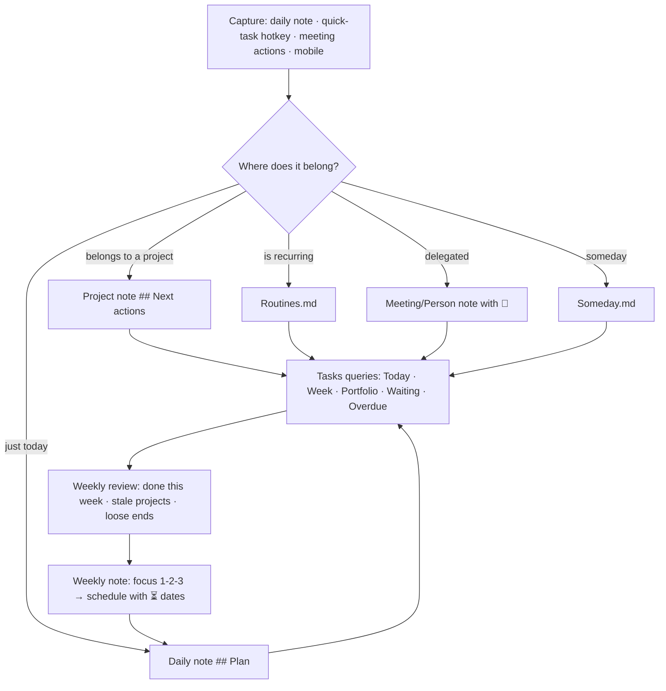

Principles:

1. **Due dates are promises; scheduled dates are plans.** Use `📅` sparingly (real deadlines) and `⏳` liberally (when you intend to do it). The Today view shows both; the Overdue view only shows broken promises.
2. **Every active project has at least one next action** with a scheduled date or none at all — never "someday" in disguise. The weekly review checks this (query: projects with zero open tasks).
3. **Capture in the daily note, but move project tasks to the project note** during processing so the project's history is coherent. Or leave them in the daily note and rely on the `#project/alpha` tag — either works, pick one.
4. **Use priority only for the top 10%.** If everything is high, nothing is.
5. **Recurring tasks live in `Routines.md`** (or area notes), never in daily notes.
6. **Dependencies (`⛔`) for real sequences**, not for everything; hide blocked tasks in the Today view.
7. **Weekly: plan; daily: execute; monthly: review the system itself** (are the queries still right? are you actually looking at them?).

## Mobile

The Tasks modal works on mobile; add *Tasks: Create or edit task* to the mobile toolbar. Queries render fine. Checking boxes is easy; editing dates via the modal is easier than typing emoji. Keep the mobile daily-note template light (fewer queries) — mobile re-rendering of five Tasks queries is noticeable.

## Key takeaways

- Tasks stay in the notes that gave rise to them; the Tasks plugin's queries assemble Today / Week / Portfolio / Waiting / Overdue views live.
- Learn the signifiers (📅 ⏳ 🛫 🔁 ⏫ 🆔 ⛔), the modal hotkey, and the query filters (`happens`, `is not blocked`, `filter by function`, `group by function`) — then build the dashboard set once.
- Due = promise, scheduled = plan; recurring tasks live in a Routines note; every active project has a next action.
- Periodic Notes + Calendar give the time skeleton; Day Planner for timeboxing today; Full Calendar for a real calendar view; Bases kanban or the Kanban plugin for boards.
- Obsidian is the planning layer; your calendar app remains the alarm layer.

## Next

[Chapter 14: Essential Community Plugins →](#essential-community-plugins)

---

# Essential Community Plugins

There are well over two thousand community plugins. Perhaps forty matter, and no single vault needs more than about twenty-five. This chapter is a curated, tiered map: what each plugin is for, when you need it, how to configure it, and what to watch out for. Plugins are listed by the name shown in Obsidian's plugin browser. Where two plugins compete, the guide picks one and says why.

## How to think about plugins

- **Every plugin is code with full access to your vault and network.** Obsidian's review process checks for obvious abuse, not for bugs. Prefer plugins that are popular (100k+ downloads), recently updated, and open source with visible issue tracking.
- **Every plugin costs startup time**, especially on mobile. The developer console (++ctrl+shift+i++ → Console) logs plugin load times at startup; more practically, when mobile startup is slow, disable everything and re-enable in halves until you find the culprit.
- **Every plugin is a dependency.** If it stores data only in its own `data.json` (not in your notes), ask what happens when it is abandoned. Kanban, Excalidraw, and Tasks store in Markdown; Spaced Repetition stores review data in your notes as inline text; Tracker and Charts store nothing (they read your notes). Good signs.
- **Core first.** Chapter 9's table of gaps tells you what actually needs a community plugin.
- **Audit quarterly** (Chapter 32): for each enabled plugin, can you name what it does for you this month? If not, disable it.

## Tier 1 — the foundation (install these first)

| Plugin | Purpose | Key config / gotchas |
| --- | --- | --- |
| **Templater** | Dynamic templates, scripting, folder templates | Chapter 11. Turn on *Trigger on new file creation*. |
| **Tasks** | Task metadata and queries | Chapter 13. Set a global query excluding Templates/Archive. |
| **Dataview** | Queries over inline fields, tasks, lists; DataviewJS | Chapter 12. Enable JS queries. Use Bases for plain tables. |
| **Periodic Notes** | Weekly/monthly/quarterly/yearly notes | Match formats to your naming; use with Calendar. |
| **Calendar** | Sidebar month view for daily/weekly notes | Set week start; enable week numbers. |
| **Omnisearch** | Ranked full-text search with fuzzy matching, PDF/OCR | Keep core search too. Enable diacritics ignore. |
| **Linter** | Normalizes formatting and frontmatter on save | Configure: YAML key order, trailing spaces, heading blank lines, `created`/`modified` insertion (optional). Run on the whole vault once, then on save. |
| **Style Settings** | UI for theme/snippet variables | Required by most themes to expose options. |

## Tier 2 — high value for most whole-life vaults

### Capture and creation

| Plugin | Purpose | Notes |
| --- | --- | --- |
| **QuickAdd** | Capture commands, template commands, macros, menus | "Append to today's log", "New book with prompts", "Quick idea to Inbox". Can call Templater. Chapter 11 compares. |
| **Meta Bind** | Input widgets (toggle, select, slider, date, text) bound to properties; buttons | Mobile-friendly daily-note forms; `INPUT[slider(minValue(1),maxValue(10)):mood]`. |
| **Various Complements** | Autocomplete words/phrases from vault and custom dictionaries | Speeds typing of recurring names and terms. |
| **Paste image rename** or **Attachment Management** | Rename pasted images meaningfully; per-note attachment folders | Attachment Management is more complete; either fixes `Pasted image ….png`. |
| **Auto Note Mover** | Move new notes to folders by tag/title rules | Alternative to folder templates when capture lands in Inbox. |
| **Note Refactor** | Extract selections/headings to new notes with templates | Batch version of Note composer. |
| **Advanced URI** | URI actions for everything (open by UID, append to heading, run commands, set frontmatter) | Foundation for external automation. Chapter 29. |

### Organization and navigation

| Plugin | Purpose | Notes |
| --- | --- | --- |
| **Tag Wrangler** | Rename/merge tags, drag to nest | Core cannot rename tags. |
| **Homepage** | Open a chosen note/workspace on launch | Point at `00 Home`. |
| **Recent Files** | Sidebar list of recent files | Simple and constantly used. |
| **Quick Switcher++** | Modes: headings, symbols, related, commands, editors, bookmarks | Replaces the core switcher for power users. |
| **Folder notes** | Click a folder to open its index note; hides the note in the folder | Turns folders into MOCs. |
| **Waypoint** | Auto-generated folder indexes (lists of notes) inside folder notes | Pairs with Folder notes. |
| **Breadcrumbs** | Explicit hierarchies (`up`, `down`, `next`, `same`) via properties, with trail views and graphs | For people who want typed hierarchy on top of links; heavy. Optional. |
| **Iconize** | Icons for folders and notes (Lucide, FontAwesome, emoji) | Cosmetic but genuinely helps scanning the explorer. |
| **Commander** | Add commands to ribbon, toolbar, status bar, tab bar, explorer; hide default items | Tailor the UI without CSS. |
| **Hover Editor** | Page previews become editable floating windows | Excellent for editing a linked note without leaving context. |
| **Strange New Worlds** | Inline reference counts for blocks/headings | Shows what is transcluded where. |

### Writing and editing

| Plugin | Purpose | Notes |
| --- | --- | --- |
| **Editing Toolbar** (or **cMenu**) | Formatting toolbar | Mobile already has one; desktop optional. |
| **Code Editor Shortcuts** | Duplicate line, move line, select word, join lines, transform case… | Fills editor gaps. |
| **Outliner** + **Zoom** | Workflowy-style list manipulation and focus | For outline-heavy thinkers. |
| **Advanced Tables** | Table formulas, navigation, CSV import/export | Core table editing covers basics; keep for formulas. |
| **Table Enhancer** | Excel-like table editing in Live Preview | Alternative to Advanced Tables. |
| **Footnote Shortcut** | Insert/jump footnotes | Academic writers. |
| **Latex Suite** | Snippets and autocompletion for math | Students/scientists. |
| **Typewriter Scroll** | Keep cursor line centred; dim other paragraphs | Focus mode for writers. |
| **Longform** | Manuscript management: scenes, drafts, compile to one document | Novelists and long-form writers (Chapter 24). |
| **Regex Find/Replace** | Vault-wide or note-wide regex replace | Core lacks vault-wide replace. |
| **Text Extractor** | Extract text from images/PDFs for search (used by Omnisearch) | |

### Visual and spatial

| Plugin | Purpose | Notes |
| --- | --- | --- |
| **Excalidraw** | Freehand drawing, diagrams, whiteboards with Obsidian links; scripts library | Huge, excellent, actively developed. Drawings are `.md` files with embedded JSON — searchable and linkable. Chapter 24. |
| **Kanban** | Free-form kanban boards as Markdown | Bases kanban (1.14) for property-driven boards. |
| **Charts** (Obsidian Charts) | Chart.js charts from code blocks or DataviewJS | Chapter 12. |
| **Heatmap Calendar** | Year heatmap from DataviewJS arrays | Habits, mood, workouts. |
| **Tracker** | Charts and stats over daily-note metrics with its own query DSL | Alternative to hand-rolled DataviewJS. |
| **Mind Map** / **Enhancing Mindmap** | Render outlines as mind maps | Niche. |
| **Map View** | Map of notes with `location` properties; geolocation search; routing | Travel, places; Bases map view is the lighter core alternative. |
| **Image Toolkit** / **Image Converter** | Zoom/rotate/convert images; compress on paste | Core 1.13 covers viewing; Converter is useful for WebP compression. |

### Reading, research and learning

| Plugin | Purpose | Notes |
| --- | --- | --- |
| **Book Search** | Create book notes from Google Books/OpenLibrary lookups with a template | Chapter 17. |
| **Zotero Integration** | Import Zotero items and annotations with templates; cite | Chapter 18. |
| **Citations** | Cite from a BibTeX/CSL JSON library | Lighter alternative to Zotero Integration. |
| **PDF++** | PDF annotation with highlights written back as Markdown links; backlink from PDF selections | The best PDF workflow in Obsidian. |
| **Annotator** | Annotate PDFs/EPUBs with Hypothesis-style highlights | Alternative to PDF++. |
| **Spaced Repetition** | Flashcards from notes (`::` / `?` syntax) and note-level review scheduling (SM-2) | Chapter 17. Data stored in-note. |
| **Readwise Official** | Sync Readwise highlights to notes | If you use Readwise. |
| **Kindle Highlights** | Import Kindle highlights | Free alternative for Kindle users. |
| **Media Extended** | Embed and timestamp-link YouTube/local video/audio; notes tied to playback | Lecture and podcast notes. |
| **Web Clipper** (browser extension) | Clip pages to Markdown with templates; highlighter; Interpreter (AI extraction) | Official; not a plugin but essential. Chapter 29. |
| **Surfing** | Enhanced in-app web browsing | Extends core Web viewer; mostly superseded. |

### Sync, backup, publishing

| Plugin | Purpose | Notes |
| --- | --- | --- |
| **Git** (Obsidian Git) | Auto commit/push/pull; history view; diff | Chapter 26. Desktop-strong; mobile works with caveats. |
| **Remotely Save** | Sync to S3/WebDAV/Dropbox/OneDrive/Google Drive with optional E2E encryption | Best free cross-platform sync. |
| **Self-hosted LiveSync** | CouchDB-based near-real-time sync with E2E encryption | For self-hosters; the most "Obsidian Sync-like" free option. |
| **Enveloppe** (ex Publisher) | Push selected notes to a GitHub repo for static-site publishing | Chapter 31. |
| **Digital Garden** | Publish notes via a Netlify/Vercel template | Chapter 31. |
| **Pandoc Plugin** / **Enhancing Export** | Export to DOCX/PDF/HTML/LaTeX via Pandoc | Chapter 31. |
| **Advanced Slides** | reveal.js presentations from notes | |

### Automation and integration

| Plugin | Purpose | Notes |
| --- | --- | --- |
| **Shell commands** | Run shell commands from Obsidian with variables; output to note | Desktop. Chapter 29. |
| **Local REST API** | HTTP API to read/write/search the vault (with API key) | Foundation for external scripts, MCP servers, Raycast. Chapter 29/30. |
| **Buttons** | Buttons that run commands/templates/links inside notes | Meta Bind also does buttons; pick one. |
| **Hotkeys for specific files** / **Hotkeys++** | Open specific notes with hotkeys; extra editor commands | |
| **Obsidian Tasks Calendar Wrapper** / **Tasks Calendar** | Calendar rendering of Tasks | |
| **Todoist Sync** / **TickTick** | Two-way sync with external task apps | If your team uses one. |
| **Google Calendar** | View/create GCal events inside Obsidian | OAuth setup required. |
| **Terminal** | Embedded terminal pane (desktop) | Pairs with the Obsidian CLI. |

### AI

| Plugin | Purpose | Notes |
| --- | --- | --- |
| **Copilot** | Chat with your vault (RAG), inline edits, custom prompts; supports OpenAI/Anthropic/Gemini/Ollama | Chapter 30. |
| **Smart Connections** | Embedding-based related notes + chat | Local embeddings option. |
| **Text Generator** | Prompt templates that generate into notes | |

API keys belong in **Keychain** (Obsidian 1.11+) where plugins support it, not in `data.json`.

## Tier 3 — situational (install when the need is concrete)

**Templater alternatives**: none needed. **Sliding Panes**: superseded by core Stack tabs. **Calendar alternatives**: **Big Calendar**, **Full Calendar** (Chapter 13). **Habit trackers**: **Habit Tracker 21**, or roll your own with tasks + Heatmap Calendar (Chapter 20). **Journaling**: **Journals** plugin (structured multi-journal setup; alternative to Periodic Notes). **Focus**: **Focus Mode**, **Stille**, **ProZen**. **Numbers**: **Numerals** (inline calculator blocks), **Math Calculator**. **Finances**: **Ledger** (plain-text accounting in Obsidian), **Beancount** helpers. **Languages**: **Language Tool Integration** (grammar), **Translate**. **Music**: **Chords**, **abcjs**. **Timelines**: **Timeline**, **Chronos Timeline**. **Diagrams**: **PlantUML**, **Diagrams.net**, **D2**. **Reading**: **Reading Time**, **Novel Word Count**. **Vim**: **Vimrc Support**. **Privacy**: **Password Protect** (folder-level, cosmetic), **Meld Encrypt** (real in-note encryption). **Databases**: **DB Folder**, **Projects** — largely superseded by Bases. **Search**: **Better Search Views**. **Files**: **File Tree Alternative**, **Hider**, **Explorer Hider**. **Canvas**: **Advanced Canvas** (more node types, presentation mode, encapsulate), **Canvas Mindmap**. **Emoji**: **Emoji Shortcodes**, **Icon Shortcodes**. **Sorting**: **Custom File Explorer Sorting**. **Colors**: **Colored Text**, **Highlightr**. **Links**: **Auto Link Title**, **Link Favicon**, **Supercharged Links** (style links by properties — great for people/projects colouring). **Frontmatter**: **Metadata Menu** (schema enforcement and bulk edit — powerful if you want strict types), **Update time on edit** (maintains `modified`; only if you truly need it). **Daily notes**: **Daily Note Outline**, **Day Planner** (Chapter 13). **Templates**: **Templater** alone suffices. **Random**: **Smart Random Note**. **Telegram**: **Telegram Sync** (capture from Telegram to vault). **Email**: no good plugin — use automation (Chapter 29).

## Avoid or retire

- Plugins abandoned for 2+ years with open crash issues (check the repo).
- Anything that "syncs settings across devices" outside Obsidian Sync/Git — fragile.
- Duplicates: two toolbars, two calendars, two AI chats. Pick one.
- **Sliding Panes**, **Starred**, **Settings Search**, **Table of Contents**, **Better Word Count** where core covers it (Stack tabs, Bookmarks, 1.13 Settings search, Outline, Word count).
- Cosmetic plugins that inject heavy CSS/JS on every render if you notice lag.

## Recommended starting sets

**Minimal (8):** Templater, Tasks, Periodic Notes, Calendar, Omnisearch, Linter, Style Settings, Homepage.

**Whole-life standard (~20):** Minimal + Dataview, QuickAdd, Meta Bind, Tag Wrangler, Recent Files, Excalidraw, Book Search, PDF++, Spaced Repetition, Heatmap Calendar, Git or Remotely Save, Advanced URI, Attachment Management, Commander, Iconize.

**Researcher add-ons:** Zotero Integration, Citations, Pandoc, Latex Suite, Footnote Shortcut, Longform.

**Automation add-ons:** Shell commands, Local REST API, Buttons, Terminal, Copilot or Smart Connections.

## Installing, updating, and configuring safely

- Install from Settings → Community plugins → Browse; or paste a GitHub URL into **BRAT** (Beta Reviewers Auto-update Tool) for pre-release plugins — use BRAT sparingly and only for plugins you trust.
- Update weekly (*Check for updates*). Read release notes for plugins that touch your files (Linter, Tasks, Templater).
- Plugin settings live in `.obsidian/plugins/<id>/data.json`. Back them up; they are part of your system. Sync selectively (1.13 warns about syncing plugins because some settings are device-specific — e.g. Shell commands, Git paths).
- The CLI: `obsidian plugins:enabled`, `plugin:install id=… enable`, `plugin:disable id=…`, `plugins:restrict on` — scriptable plugin management for setting up a new device (Chapter 29).
- When something breaks: Settings → Community plugins → *Restricted mode* (or CLI `plugins:restrict on`); since 1.13 you can leave restricted mode without re-enabling everything, so bisect by re-enabling in halves.

## Key takeaways

- Fewer, better plugins: Tier 1 (8) is the foundation, Tier 2 fills concrete gaps, Tier 3 only when a real need appears.
- Prefer plugins that store data in your notes (Tasks, Kanban, Excalidraw, Spaced Repetition) over ones that keep it in `data.json`.
- Bases has retired the database plugins; core has retired Sliding Panes, Starred, Settings Search and basic word count.
- Audit quarterly, update weekly, back up `.obsidian/plugins`, and know how to bisect with Restricted mode.

## Next

[Chapter 15: Daily Notes and Journaling →](#daily-notes-and-journaling)

---

# Daily Notes and Journaling

The daily note is the heartbeat of a whole-life vault. It is the universal inbox, the log, the place tasks are born, the mood and energy record, and — read back over months — the most honest account of your life you will ever have. Get the daily note right and everything else has somewhere to land. This chapter designs the periodic-notes ladder (daily → weekly → monthly → quarterly → yearly), the journaling practices that survive contact with real life, the metrics worth tracking, and the review rituals that turn logs into change.

## Why the daily note works

1. **Zero-decision capture.** "Where does this go?" has one answer: today. Processing happens later, if at all.
2. **Automatic context.** Everything you link from a daily note (people, projects, ideas) receives a dated backlink. You never wrote a "history" section anywhere — yet every project and person has one.
3. **Time as a spine.** Ideas, moods, events, and tasks are correlated by the one dimension you cannot get wrong: the date.
4. **Low stakes.** A daily note has no audience and no standard. You can write one word or two thousand.

## The ladder

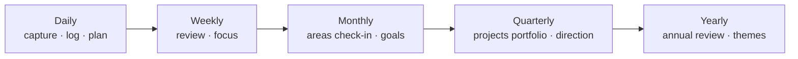

Each level *rolls up* the one below by linking or embedding (never copying): the weekly note lists its seven days and summarizes; the monthly lists its weeks; and so on. Each level also *rolls down*: the yearly theme appears in every quarterly note as an embed; the quarterly goals appear in every weekly.

| Level | Filename | When written | Time budget | Core question |
| --- | --- | --- | --- | --- |
| Daily | `2026-09-06` | Through the day; 5 min evening | 5–15 min | What happened, what did I think, what's next? |
| Weekly | `2026-W36` | Sunday evening or Monday morning | 30–45 min | What matters this week? What did I learn last week? |
| Monthly | `2026-09` | First weekend | 45–60 min | Are the areas of my life in shape? Are goals on track? |
| Quarterly | `2026-Q3` | First weekend of the quarter | 2 hours | Which projects, which goals, what to stop? |
| Yearly | `2026` | Late December / early January | Half a day | What was this year? What is next year for? |

Tooling: **Daily notes** (core) + **Periodic Notes** for the other levels + **Calendar** for navigation + **Templater** for templates (Chapter 11 has the full templates; Chapter 36 collects them).

## Designing the daily note

The template from Chapter 11 has five sections. Why each exists:

**Navigation line** (`« yesterday · week · tomorrow »`) — reading back a week takes seven clicks instead of seven searches. The Calendar plugin does this too, but the inline links work on mobile with no sidebar.

**Plan** — a Tasks query for today (due/scheduled/overdue) plus a blank checkbox for intentions. Two or three intentions, not ten. Tasks written here are *captured*; if they belong to a project, move them during processing or tag them `#project/alpha`.

**Log** — timestamped one-liners (interstitial journaling): `- 09:12 starting report; anxious about the numbers section`. A hotkey or QuickAdd capture that inserts `- HH:mm ` makes this frictionless. Value: it externalizes task-switching (you notice how often you do it), records what actually happened (the plan rarely survives), and gives Dataview parseable data if you add inline fields (`[mood:: 6]`).

**Notes** — anything longer: an idea, a conversation summary, a quote. Link generously. Extract to `Notes/` later if it earns it.

**Evening** — three prompts (went well / could improve / grateful). Skip freely; the fields are there so the tired version of you does not have to think of questions.

**Properties** — `mood`, `energy`, `sleep_h` as numbers. Fill them in the morning (sleep) and evening (mood/energy) via the property editor or a **Meta Bind** slider so it takes five seconds on a phone:

```markdown
Mood `INPUT[slider(minValue(1), maxValue(10), addLabels):mood]`
Energy `INPUT[slider(minValue(1), maxValue(10), addLabels):energy]`
Sleep `INPUT[number:sleep_h]` h
```

### What *not* to put in the daily note

- Recurring tasks (they spawn copies in old notes — keep them in `Routines.md`).
- Reference information (Wi-Fi passwords, recipes) — it will be unfindable by date.
- Long-form writing that should be its own note — write it there and link from today.
- Ten Dataview queries — mobile will crawl. Two or three widgets, max.

### Optional widgets

- **On this day** (Dataview, Chapter 12): daily notes from previous years with the same month/day. Surprisingly powerful after year two.
- **Created/modified today**: what you touched, without remembering.
- **Habits** as a checklist with a tag per habit (`- [ ] Meditate #habit/meditate`) — a Heatmap Calendar or streak query reads them (Chapter 20).
- **Weather / location** — Templater `tp.web.request` to a weather API, or the mobile Share Sheet. Nice for travel journals; noise otherwise.
- **Quote of the day** — `tp.web.daily_quote()`. Cute for a week.

## Journaling practices that actually stick

**Interstitial journaling** (Tony Stubblebine): timestamped notes at transitions between tasks. Two minutes per switch. It doubles as a time log and a worry dump, and it is the practice with the best effort-to-insight ratio.

**Morning pages / free writing**: three pages, no editing, no reading back. In Obsidian: a `## Morning` section or a separate `Journal/Freewrite/` folder excluded from search (some people find it easier to write freely when they know they will not stumble on it). Word count in the status bar is the only metric.

**Evening three lines**: went well · could improve · grateful. Or the *Five-Minute Journal* variant (three grateful, three intentions, affirmation; evening: three amazing things, one improvement). The template pre-writes the prompts.

**Prompted journaling**: a rotating list of prompts inserted by Templater (`tp.user.prompt_of_day()` picks from `Mind/Prompts.md` by day-of-year). Useful when the blank page wins.

**Bullet-journal rapid logging**: `-` note, `- [ ]` task, `- [i]` event (custom status styled by the theme). Fast, scannable, and Tasks/Dataview see the tasks.

**Gratitude / wins log**: a `## Wins` list in the weekly note, aggregated yearly by a query — the antidote to annual reviews that only remember failures.

**Decision journal**: significant decisions get their own `type: decision` note (Chapter 25); the daily note links to it.

**Mood tracking with reasons**: a number is data; a number plus one sentence is insight. `mood: 4` and a log line `- 21:00 [mood:: 4] rough call with the landlord` — the Dataview correlation queries then have something to explain.

!!! tip "Lower the bar until you clear it"
    A daily note with a single log line is a success. Streaks matter more than depth; depth comes on the days that need it. If the template feels heavy, remove sections until it does not.

## Weekly note

Sections and their purpose (template in Chapter 11):

1. **Days** — links to the seven daily notes, generated by Templater.
2. **Focus this week** — three outcomes, not tasks. Everything on the Today view should trace back to one of these or to maintenance.
3. **Review checklist** (embedded fragment) — the GTD weekly review adapted: inboxes to zero, daily notes skimmed for loose tasks, every active project has a next action, waiting-for reviewed, calendar backward and forward, someday skimmed, people to contact, quick health/finance/home check, three wins · one lesson · one change.
4. **Mood & energy** — an embedded Base of the week's daily notes with averages. Over months this is how you notice patterns (Thursdays are bad; weeks after travel are low-energy).
5. **Done this week** — a Tasks query `done this week` grouped by folder. Concrete evidence of progress; cures the "I got nothing done" feeling.
6. **Notes** — anything else.

The weekly review is the highest-leverage ritual in the system; protect a recurring calendar slot for it. Sunday evening or Monday morning; 30–45 minutes; same place; same music if that helps.

## Monthly note

1. **Weeks** — links.
2. **Goals for the month** — pulled from the quarterly note; 3–5 checkboxes.
3. **Areas check-in** — Templater generates a heading per `Areas/` note with a blank line; write one or two sentences each: is this area at its standard? Anything neglected? This ten-minute scan is the whole point of having explicit areas.
4. **Finance snapshot** — embed the subscriptions total, note the month's big expenses (Chapter 21).
5. **Health snapshot** — embed the workouts-by-kind Base filtered to the month and the sleep average.
6. **Month in review** — highlights, lowlights, finished projects (embedded Base view), one paragraph of narrative.
7. **Photo of the month** — one image embed. Years later, this is what you will look at.

## Quarterly note

The quarter is the natural unit for projects (a project longer than a quarter is a program or an area).

1. **Direction** — re-read the yearly theme; write what this quarter is *for* in two sentences.
2. **Goals** — 3–5 `goal` notes with `horizon: quarter` linked; each with a measurable target.
3. **Project portfolio** — an embedded Projects Base: what is active, what is on hold, what to drop. Killing projects is the most valuable act of the quarterly review.
4. **Stop doing** — explicit list.
5. **Retrospective of last quarter** — what happened vs. what was planned; why; what to learn.
6. **Systems review** — is the vault serving you? Plugins to remove, templates to trim, dashboards unused.

## Yearly note

1. **Theme** — one phrase or a "year of X" statement. Embedded into every quarterly note.
2. **Annual review** — a structured retrospective. A good set of prompts (adapted from several public annual-review templates):
    - What went well? What did not? What did I learn?
    - Month by month: skim each monthly note; one line each.
    - People: who mattered this year? Who did I lose touch with?
    - Health, money, work, relationships, learning, play, home, spirit: a paragraph each, one score out of 10.
    - Best decisions; worst decisions; luckiest events.
    - What did I read/watch/listen to that changed me? (Reading Base filtered to the year.)
    - What am I proud of? What do I want to leave behind?
3. **Goals for next year** — 3–7 `goal` notes with `horizon: year`.
4. **Stats** — Dataview/Bases: notes created, books read, workouts, words written, days journaled (a streak count).
5. **Photos** — twelve embeds, one per month.

## Reading your journal back

A journal nobody reads is a diary; a journal you read is a feedback loop. Build the reading in:

- **On this day** widget in the daily note (last year, two years ago).
- **Random daily note** command (Random note plugin scoped to `Journal/Daily` via Smart Random Note) once a day.
- **Weekly**: skim the seven dailies (that is what the "Days" links are for).
- **Monthly/quarterly/yearly**: skim the level below.
- **Search your own history**: `path:Journal "anxious"` or `[mood:1..3]`-style hunts — property search cannot do ranges, but a Base of `type == "daily"` filtered `mood <= 3` sorted by date is a two-minute build and a sobering read.

## Metrics worth tracking (and ones that are noise)

| Track | Because | How |
| --- | --- | --- |
| Sleep hours | Explains most bad days | Property; from a wearable via Shortcuts/Health Auto Export if you want automation |
| Mood 1–10 | The outcome variable | Property, evening |
| Energy 1–10 | Different from mood; explains productivity | Property, midday or evening |
| Exercise done (y/n or minutes) | Strong mood predictor | Workout note or habit checkbox |
| Alcohol / caffeine | Sleep confounders | Habit checkbox or inline field |
| Deep work hours | If work output matters to you | Inline field `[deep:: 2.5]` in the log |
| Social contact (y/n) | Loneliness creeps | Backlinks from People notes count it for free |
| Weight (weekly, not daily) | Trends, not noise | Property on the weekly note |

Noise: steps (your phone already has it), water glasses (unless medical), screen time (feel bad, learn nothing), anything with more than one decimal place.

Visualize with **Heatmap Calendar** (one per metric, in the yearly note), **Tracker** (line charts over months), or a Base with monthly group-by and averages. Look at charts monthly, not daily.

## Mobile journaling

- Add *Open today's daily note* to the mobile toolbar and as the app's startup note (Homepage plugin, or Daily notes' *Open on startup*).
- A QuickAdd capture "Log line" that prompts for text and inserts `- HH:mm text` under `## Log`.
- Meta Bind sliders for mood/energy so YAML is never touched by thumb.
- iOS **Share Sheet** (1.13): share a photo, link, or text from any app straight into today's note or `Inbox/` with a configurable location and template.
- Voice: dictate into the log line (system dictation), or use a voice-memo → Whisper → note pipeline (Chapter 30).
- Photos: one per day, pasted into `## Notes`. Attachment Management renames to `2026-09-06-1.jpg`.

## Journaling privacy

The journal is the most sensitive folder in the vault. Options, from lightest to heaviest: exclude `Journal/` from Publish and from any shared vault; keep the vault on encrypted disks and E2E-encrypted sync (Obsidian Sync, Remotely Save with encryption, LiveSync); encrypt specific passages with **Meld Encrypt**; keep a separate encrypted vault for the truly private (Chapter 26).

## Anti-patterns

- **Template creep**: a daily note that takes ten minutes to fill before you write anything. Trim.
- **Migration by hand**: copying unfinished tasks forward every day. Queries do this.
- **Metrics without reading**: tracking twelve numbers and never looking. Track three; chart monthly.
- **Skipping weeks and abandoning**: missed a week? Write one line in the weekly note ("skipped — travel") and move on. Gaps are data too.
- **Journaling only when miserable**: your archive becomes a distorted record. The evening "went well" prompt exists for this reason.

## Key takeaways

- The daily note is the universal inbox and log; everything else in the vault gets its history from daily-note backlinks.
- Build the ladder — daily, weekly, monthly, quarterly, yearly — with each level linking down and embedding up; protect the weekly review above all.
- Keep the daily template light: navigation, plan (query + intentions), timestamped log, notes, three evening prompts, three numeric properties.
- Interstitial journaling and evening three-liners are the practices with the best return; prompts and Meta Bind sliders lower the bar on hard days.
- Read the journal back — on-this-day, random daily, skim at each review — or it is not a feedback loop.
- Track few metrics, chart monthly, and protect the journal's privacy.

## Next

[Chapter 16: Tasks, Projects and Goals — the Action System →](#tasks-projects-and-goals-the-action-system)

---

# Tasks, Projects and Goals — the Action System

Chapter 13 gave the mechanics of tasks and time; this chapter builds the *system*: how commitments flow from a vague "I should…" to a done project, how projects connect to areas and goals so daily action serves long-term direction, and how the weekly and quarterly rituals keep the whole thing honest. It is GTD's structure with PARA's vocabulary, implemented entirely in notes, properties, Tasks queries and Bases.

## The horizons

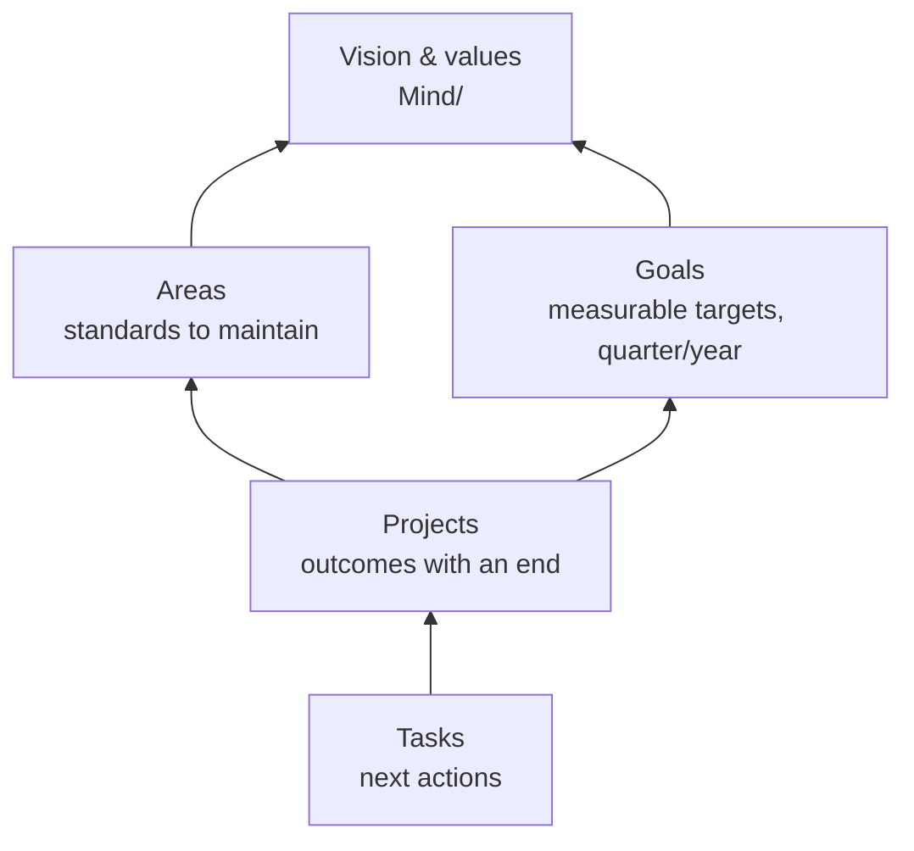

| Horizon | Note type | Lives in | Reviewed |
| --- | --- | --- | --- |
| Tasks | checkboxes in any note | where they arise | daily |
| Projects | `type: project` | `Projects/` | weekly |
| Areas | `type: area` | `Areas/` | monthly |
| Goals | `type: goal` | `Goals/` | quarterly |
| Vision / values / principles | `Mind/Values.md`, `Mind/Vision.md` | `Mind/` | yearly |

The rule that connects them: **every project has an `area`** (which area of life does this serve?) and **optionally a `goal`** (which target does it advance?). Every task belongs to a project, a routine, or today. When you cannot answer "which area?" the project is probably someone else's priority.

## Areas

An area is a domain you maintain forever: Health, Finances, Career, Family, Friends, Home, Learning, Play, Spirit/Mind, Community. Most people have 6–10. Each gets a note:

```markdown
---
type: area
review_cadence: monthly
standard: "Train 3×/week · sleep ≥ 7h · resting HR < 60 · annual check-up done"
tags: []
---
## Why this matters
(one paragraph — the *motivation*; you will re-read it when the area is neglected)

## Standard
(what "good enough" looks like — concrete, checkable)

## Active projects
```base
filters:
  and: [type == "project", status == "active", area == this]
views:
  - type: table
    name: Active
    order: [file.name, due, priority]
```

## Goals
```base
filters:
  and: [type == "goal", status != "done", area == this]
views:
  - type: list
    name: Goals
    order: [file.name, horizon, target, current]
```

## Routines
- [ ] Weekly: … 🔁 every week
(or link to the section in Routines.md)

## Metrics
(embed the relevant Base: workouts, spend, contact-due people)

## Notes & maps
[[Health MOC]]
```

The **standard** is the key line. It turns "I should exercise more" into a checkable statement. The monthly review asks, per area, "is the standard met?" — a yes/no question that takes ten seconds.

## Goals

A goal is a *measurable target with a horizon*. Not "get fit" but "run 10 km under 55 minutes by 2027-06-30". Properties: `horizon` (quarter/year/life), `status`, `area`, `metric`, `target`, `current`, `due`.

```markdown
---
type: goal
horizon: year
status: active
area: "[[Health]]"
metric: "10k time (minutes)"
target: 55
current: 61
due: 2027-06-30
tags: []
---
## Why
## Definition of done
## Projects serving this goal
```base
filters:
  and: [type == "project", goal == this]
views:
  - type: table
    name: Projects
    order: [file.name, status, due]
```
## Progress log
- 2026-09-01 — 61:20 (baseline)
```

A Goals Base shows progress (`(current / target * 100).round(0) + "%"` or the inverse for lower-is-better) and days left. Quarterly goals are stepping stones of yearly goals — link them with a `parent` property.

Frameworks that fit this shape: **OKRs** (goal = objective; `metric/target/current` = key result — use one goal note per KR or a table in the objective note), **12-Week Year**, **SMART**. The vault does not care which; it cares that `target` and `current` are numbers.

## Projects

A project is an outcome with an end, needing more than one action. Kitchen renovation, Q3 report, plan the trip to Japan, read and summarize *Thinking Fast and Slow*, migrate email provider. Each gets a note (template in Chapter 11). The parts that matter:

- **`status`**: `idea` (someday/maybe) → `active` → `on-hold` / `done` / `dropped`. The Projects Base filters on this; nothing else moves.
- **`area`** and optional **`goal`** links.
- **`due`** only when there is a real deadline; **`priority`** 1–3.
- **`reviewed`** — set to today each time you touch the project in a review; a Base view flags projects unreviewed for 14 days.
- **Outcome** — one sentence describing done. If you cannot write it, it is not a project yet; it is an area concern or a someday item.
- **Next actions** — the checkbox list. At least one, ideally with a `⏳` scheduled date.
- **Log** — dated one-liners of progress; also filled by backlinks from daily notes and meetings.

### Work-in-progress limit

Cap active projects. For most people with a job and a life: **3–5 personal projects active** at once, plus work projects tracked separately or in `Work/`. Everything else is `idea` or `on-hold`. The Projects Base makes the count visible; the quarterly review enforces it. This one constraint does more for completion rates than any tool.

### Project sizes

- **Tiny** (under a day): do not make a project; a task with a due date in the area note or daily note.
- **Small** (days–weeks): one note, one list of tasks.
- **Large** (months): one note as the hub, plus sub-notes per phase or workstream in a `Projects/<Name>/` folder; a Canvas board for the plan; meetings linked via `project:`.
- **Programs / ongoing**: probably an area, not a project. If it never ends, it is an area.

### Someday / maybe

Projects with `status: idea`. Review quarterly; promote to active when a slot frees; drop without guilt when they no longer excite you. A `Someday.base` view sorted by `file.mtime` ascending shows the oldest untouched ideas first — the ones to drop.

## Tasks (recap of the rules)

- Written where they arise; surfaced by queries (Chapter 13).
- Due = promise, scheduled = plan.
- Project tasks live in the project note's `## Next actions` (moved there during processing) or carry the project's tag.
- Delegated: `👤 Name` or `#waiting`; surfaced in the Waiting-for view.
- Recurring: in `Life/Routines.md` or area notes.
- Contexts (GTD's `@phone`, `@errands`): as tags `#ctx/errands` if you find them useful — they are for batching, and batching still works (`tags include #ctx/errands` view for when you are out).
- Energy/time tagging (`#quick`, `#deep`): optional; the Today view sorted by urgency usually suffices.

## The dashboards

`00 Home.md` gets the Today view and active projects; the weekly note gets the review set; and a dedicated `Action Dashboard.md` (or a Workspace) holds everything:

```markdown
## Today
(Tasks: due/scheduled before tomorrow, not blocked, sort by urgency)

## Focus this week
![[<% tp.date.now("YYYY-[W]WW") %>#Focus this week]]

## Active projects
![[Projects.base#Active]]

## Waiting for
(Tasks: 👤 or #waiting)

## Loose ends
(Tasks: no date, not in Projects/Routines/Someday)

## Goals
![[Goals.base#Active]]

## Areas below standard
(manual list from the last monthly review, or a checkbox property `at_standard` on area notes → Base filter)
```

## Processing: the daily five minutes

1. Open today's note. Skim the log for anything that is actually a task, a person to follow up, or an idea → convert.
2. Open `Inbox/` (Base). For each item: delete, do (< 2 min), make a task (in the right project), make a project, or file as reference (type + folder).
3. Look at the Today view. Choose tomorrow's three intentions if it is evening; or today's if morning.

## The weekly review (the engine)

Sunday evening or Monday morning; 30–45 minutes. The checklist fragment from Chapter 11, explained:

| Step | Why | Tool |
| --- | --- | --- |
| Inboxes to zero | Nothing lurking | `Inbox.base`, email, downloads, photos, voice memos |
| Skim the week's daily notes | Catch loose tasks, promises, ideas | Weekly note's Days links |
| Every active project has a next action | Stalled projects are invisible otherwise | Dataview "projects with zero open tasks" or scan the Portfolio view |
| Mark `reviewed` on each project | Keeps the "needs review" view honest | Edit in the Base table, or a Templater button |
| Waiting-for | Chase or drop | Waiting view |
| Calendar back 1 week, forward 2 | Capture from past events; prepare for future ones | Your calendar app; Full Calendar |
| Someday skim (monthly is enough) | Promote or drop | Someday view |
| People contact-due | Relationships need scheduling too | People.base |
| Health/finance/home 60-second check | Areas do not wait for the monthly | Area notes |
| Three wins · one lesson · one change | Reflection, not just administration | Weekly note |
| Set focus for the week (3 outcomes) | Direction for the Today view | Weekly note `## Focus` |
| Schedule the outcomes' tasks with ⏳ | Plans, not wishes | Tasks modal |

If you only do one thing from this whole guide, do this weekly.

## Monthly and quarterly (portfolio management)

**Monthly**: area standards check (yes/no each), goals `current` values updated, monthly goals set (3–5), finance and health snapshots, month narrative (Chapter 15).

**Quarterly**: the portfolio decision. Open `Projects.base`: for each active project — continue, pause, drop, or done? Promote 1–3 ideas to active if slots opened. Re-read goals; kill the ones you no longer want (killing a goal is a decision worth a `decision` note). Re-read `Mind/Vision.md`; adjust. Trim the system: plugins, templates, dashboards unused in the quarter.

## Work projects vs personal projects

Two acceptable designs:

1. **One vault, `Work/` folder, `area: "[[Career]]"`** — everything in one place; Bases views filter by area; Publish and shares exclude `Work/`. Best if confidentiality allows.
2. **Separate work vault** — the same templates and skeleton; nothing crosses. Best if an employer's data cannot sit next to your journal, or if you switch jobs and want a clean handover (export/delete the vault).

Either way, the meeting note (Chapter 19) is the work-side capture point, with `project:` links and `👤` actions feeding the same Waiting-for view.

## Habits and routines

Habits are not projects (they never end) and not goals (they are behaviours, not outcomes). Treat them as **routines** in `Life/Routines.md` (recurring tasks with 🔁) or as **habit checkboxes** in the daily note with tags (`#habit/x`), visualized by Heatmap Calendar / streak queries (Chapter 20). A `habit` note type (`Life/Habits/Meditate.md`) is worth it only for habits with a *why*, a plan, and a review — otherwise a checkbox is enough.

Habit design tips that translate to the vault: start with one or two; tie to an existing routine (habit stacking); track completion, not intensity; review monthly (a `## Habits` section in the monthly template with the heatmaps embedded).

## Anti-patterns

- **Twenty active projects.** Nothing finishes. Cap it.
- **Projects without outcomes.** "Website" is not a project; "Launch the new site with 5 pages by Oct 15" is.
- **Tasks without homes.** Hundreds of orphan tasks in daily notes. Process weekly; the Loose ends view shows the backlog.
- **Goals with no metric.** "Be healthier" cannot be reviewed. Attach a number or make it an area standard instead.
- **Reviews skipped for a month.** The system goes stale and you blame the tool. Put the review in the calendar and treat it like a meeting.
- **Rebuilding instead of reviewing.** When the system feels wrong, the fix is usually one fewer project, not a new plugin.

## Key takeaways

- Tasks → projects → areas/goals → vision; every project has an area, optionally a goal; every task has a project, a routine, or today.
- Areas carry a written *standard*; goals carry numeric `target`/`current`; projects carry `status`, an outcome sentence, and at least one next action.
- Cap active projects at 3–5 personal; someday is a status, not a graveyard.
- The weekly review is the engine; monthly checks standards; quarterly manages the portfolio and prunes the system.
- Habits are routines or checkboxes, not projects; track completion and review monthly.

## Next

[Chapter 17: Knowledge and Learning →](#knowledge-and-learning)

---

# Knowledge and Learning

This is the domain Obsidian was built for: taking what you read, watch, hear and study, and turning it into understanding you can find, connect, and use years later. The pipeline is **capture → source note → distilled highlights → atomic idea notes → maps → output**, with spaced repetition for the things that must be remembered rather than merely findable. This chapter builds the whole pipeline for books, articles, papers, podcasts, videos, courses, languages and skills.

## The pipeline

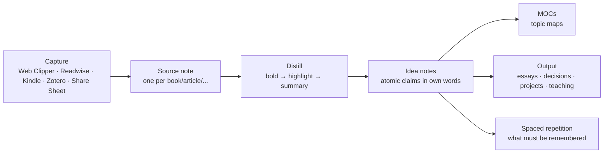

Two principles govern it:

1. **Sources are not knowledge.** A clipped article is a *pointer*. Knowledge is what you write in your own words about it. The system should make writing idea notes easy and clipping slightly inconvenient.
2. **Process on demand.** You do not distill every source. You distill the ones you return to (progressive summarization). Unread clippings are fine as long as they are visibly a pile you can prune.

## Source notes

One note per source, `type: source`, `medium:` book/article/paper/podcast/video/course/talk/documentation, in `Sources/<Medium>/`. Template in Chapter 11 (`tpl-book` generalizes). The sections:

- **Summary callout** at the top — written *after* finishing, in one paragraph. This is the note's payload for future you.
- **Key ideas (own words)** — one bullet each; every bullet is a candidate idea note. Link them when they become notes.
- **Highlights & notes** — the raw material, progressively summarized: `**bold**` the important, `==highlight==` the essential.
- **Quotes** — verbatim, with page/timestamp, for citing.

Properties worth having: `author` (list of links → author notes accumulate everything you have read by them), `status`, `rating`, `started`/`finished`, `topics` (links to MOCs), `url`/`isbn`/`doi`, `cover`, `pages`/`pages_read` or `duration`.

### Books

**Book Search** plugin: run the command, type a title, pick the match, and it creates a note from your template with author, publisher, year, ISBN, page count, cover URL, and description pre-filled from Google Books/OpenLibrary. Set its output folder to `Sources/Books` and its template to `tpl-book` (it uses `{{title}}`, `{{author}}`, `{{coverUrl}}`… placeholders; Templater tags also process if enabled).

Highlights: **Kindle Highlights** plugin (imports from Amazon or a `My Clippings.txt`), **Readwise Official** (syncs everything Readwise collects with a configurable template; set it to append new highlights to existing notes), or manual — typing highlights by hand is slower and *that is a feature*; you only type what matters.

Reading log: `status: reading`, `started`, `pages_read` updated occasionally; a Base view shows what you are reading with progress. `finished` + `rating` when done; the Reading Base's "Finished by year" view with an average rating summary becomes your annual reading list for free.

### Articles and web pages

**Web Clipper** (official browser extension): clips a page to Markdown with a template per site pattern — properties (`title`, `url`, `author`, `published`, `clipped`, `type: source`, `medium: article`, `status: to-read`), the article body, and your highlights (the extension has a highlighter; highlights can be clipped alone). **Interpreter** lets a template call an LLM with natural-language instructions ("extract the three main claims as bullets", "summarize in 50 words", "list the people mentioned as wikilinks") so the note arrives pre-distilled. Clips land in `Inbox/` or straight into `Sources/Articles/`.

Rule for the pile: clip only what you would be sad to lose; anything with `status: to-read` older than 90 days gets a Base view — read it or delete it.

### Papers (see Chapter 18)

Zotero → Zotero Integration → literature note with citekey, metadata, and annotations. PDF++ for in-Obsidian reading with highlights written as links.

### Podcasts and videos

**Media Extended** embeds YouTube/Bilibili/local media with **timestamp links** (`[12:34](…&t=754)`): take notes while listening; each timestamp is a clickable seek. For podcasts, Readwise/Snipd exports (Snipd transcribes and syncs "snips" to Obsidian via Readwise or its own export). For long videos, the YouTube transcript + an LLM summary (Chapter 30) into the source note is a legitimate first pass — then watch the parts that matter.

### Courses

One `course` source note as a hub (`medium: course`, `provider`, `url`, `status`, `progress`), with one note per lecture/module in `Sources/Courses/<Course>/` linking back. A Base view groups lectures by course with completion checkboxes. Exercises and projects from the course become real project notes.

### Documentation and technical reading

Developers: a `Sources/Docs/` folder of clipped reference pages is rarely worth it — docs change. Instead, write *your* notes on the concept (`Notes/`) and link to the live URL. Snippets go in a `Notes/Snippets/` folder with code blocks and tags by language; Omnisearch finds them.

## Distillation

**Progressive summarization** (Forte) in practice:

- Layer 0: the captured text.
- Layer 1: **bold** the passages that made you stop (on first read, or when you return).
- Layer 2: ==highlight== the best of the bold (on second return).
- Layer 3: write the summary callout at the top (when you need to use the source or have returned twice).
- Layer 4: turn the best highlights into idea notes.

Do not do all layers at capture. The layers are *how you read the second and third time*. A source you never return to stays at layer 0 or 1 — appropriately.

**Reading modes**: for dense material, read in Reading view with the Outline pane; annotate in a split Source-mode pane of the same note so highlights and your comments sit beside the text. For PDFs, PDF++ (highlight → link in your note; click the link to jump to the page).

## Idea notes (the Zettelkasten core)

An idea note is one claim, in your own words, argued in a few paragraphs, linked with reasons. `type: note`, `status: seedling/budding/evergreen`, `topics` (links), `sources` (links), in `Notes/`.

**Titles are claims**: "Working memory holds about four chunks", "Constraints increase creativity", "Most productivity advice is about attention, not time". You can link a claim into a sentence (`as [[constraints increase creativity]] suggests…`); you cannot do that with "Creativity".

**Writing the note**: what is the claim? Why do I believe it (evidence, sources)? What does it connect to (link, and say how: *supports*, *contradicts*, *is an example of*, *generalizes*)? What follows from it? What would change my mind? Two to five paragraphs; longer means it is two notes.

**From source to idea**: in the source note's "Key ideas" list, each bullet that survives a second look gets turned into an idea note (Note composer → *Extract current selection* with a link left behind; or `[[` the claim, click through, write). The idea note's `sources` property links back; the source's bullet now links forward.

**Maturity**: `seedling` (a claim and a source), `budding` (argued, linked to 3+ notes), `evergreen` (revised at least once after a month, connected to a MOC, used in an output). The Ideas Base's "Seedlings to develop" view is your writing queue; **Random note** scoped to `Notes/` is your revision prompt.

**Contradictions are gold**: when a new source contradicts an idea note, do not pick a side immediately — add a `## Tension` section linking both and write what would resolve it. Half the best essays start there.

## Maps of Content for topics

When a topic has ~15 idea notes (local graph or a `topics.contains(this)` Base tells you), create `Maps/<Topic> MOC.md`: a curated, ordered list of the ideas with one-line commentary each, sections for sources and open questions, and an embedded Base of notes tagged with the topic that are not yet listed (the "unsorted" section from Chapter 8). MOCs are gardened quarterly: promote, demote, merge, prune.

Topic MOCs link up to a **Knowledge MOC** (or several domain maps) which links up to Home. Depth rarely exceeds three levels.

## Spaced repetition

Some knowledge must be *remembered*, not just findable: vocabulary, formulas, anatomy, legal definitions, the names of your partner's colleagues. The **Spaced Repetition** plugin does two things:

1. **Flashcards** inside notes: `Question::Answer` (single-line), `Question\n?\nAnswer` (multi-line), `Answer:::Answer` (reversible), cloze `==deletion==` or `{{deletion}}`. Cards are tagged (`#flashcards/anatomy`) and reviewed in a modal with SM-2 scheduling; scheduling metadata is written back as an HTML comment on the card line (data stays in your notes).
2. **Note review**: tag a note `#review` and it enters a queue of notes to re-read on a schedule — light spaced repetition for idea notes ("does this still hold?").

Practice: create cards *from idea notes*, not from sources — the act of phrasing a question is a second distillation. Keep decks small (20–50 new cards a week is a lot). Review daily in a two-minute session; mobile works.

Alternatives: **Flashcards** (Anki sync — cards written in Obsidian, reviewed in Anki, which has better scheduling and mobile apps), **Obsidian to Anki**. If you already live in Anki, sync; otherwise the built-in plugin is enough.

## Language learning

- `Sources/Courses/` for the course; `Notes/Languages/<Lang>/` for grammar notes as claims ("German verb goes second in main clauses").
- Vocabulary as flashcards in topic notes (`#flashcards/de/food`), reversible `:::` cards for production, cloze for grammar in context.
- A `Life/Language Log.md` or daily-note inline field `[de_min:: 25]` for minutes practiced → Heatmap Calendar.
- Reading in the target language: Web Clipper the article, annotate unknown words as footnotes; the note becomes a mini-course.
- Conversation notes: after a tutoring session, a `meeting` note with corrections → flashcards.

## Skills (deliberate practice)

A skill is an area or a goal, not a source. `Goals/Learn Blender basics 2026.md` with a metric (hours, or a concrete deliverable), a plan (the course as a source, projects as practice), a **practice log** (dated one-liners or a daily-note inline field), and a **mistakes/insights** section that feeds idea notes. Skills with a physical component (instrument, sport) benefit from short video embeds in the practice log — progress you can see.

## Learning dashboard

`Maps/Learning MOC.md` (or the Learning area note):

```markdown
## Reading now
![[Reading.base#Reading now]]
## To read (oldest first — read or delete)
![[Reading.base#To read]]
## Seedlings to develop
![[Ideas.base#Seedlings to develop]]
## Review queue
(Spaced Repetition status bar shows due cards; or a Dataview query of `#review` notes)
## Courses in progress
```base
filters: {and: [type == "source", medium == "course", status == "in-progress"]}
views: [{type: table, name: Courses, order: [file.name, provider, progress]}]
```
## Stats this year
(Dataview: books read, notes created, cards reviewed)
```

## Output: the reason for all of this

Knowledge that never leaves the vault decays into a collection. Build outputs into the system:

- **Writing**: essays, blog posts, newsletters drafted in `Notes/Drafts/` from idea notes (embed blocks, then rewrite). Chapter 24.
- **Decisions**: decision notes cite idea notes as reasoning. Chapter 25.
- **Teaching**: explaining an idea to someone (a talk, a mentoring session) is the best test; the talk outline lives in the vault and links to the ideas.
- **Projects**: a book on habits should change a routine; link the project to the source.
- **Answering your own questions**: keep `Mind/Open Questions.md` (Feynman's twelve favourite problems). Every capture is checked against it; every idea note that advances a question is linked from it.

## Anti-patterns

- Clipping everything; reading nothing. Cap the to-read pile; prune monthly.
- Highlights without own words. A source note with 40 highlights and no summary is a photocopy.
- Idea notes titled with topics ("Creativity") — they become dumping grounds. Titles are claims.
- Flashcards from sources rather than from understanding — you memorize phrasing.
- MOCs built before notes exist. Wait for the squeeze.
- Never revisiting. Random note, review tags, and the seedlings view exist to force encounters.

## Key takeaways

- Sources are pointers; knowledge is what you write. Make idea notes easy and clipping slightly inconvenient.
- One source note per item with a summary callout, own-words key ideas, progressively summarized highlights, and typed properties; Book Search, Web Clipper (+Interpreter), Readwise/Kindle, Zotero and Media Extended feed it.
- Idea notes are atomic claims in your own words with `status` maturity; MOCs curate them when clusters form; Random note and the seedlings view force revisits.
- Spaced Repetition for what must be remembered; cards from ideas, not sources; small decks, daily two-minute reviews.
- Build outputs — writing, decisions, teaching, projects, open questions — or the knowledge decays into a collection.

## Next

[Chapter 18: Academic Research →](#academic-research)

---

# Academic Research

Research adds three hard requirements to the knowledge pipeline: **citations** that must be exact, **PDFs** that must be annotated and findable, and **long documents** (theses, papers, grant proposals) that must be exported in formats reviewers demand. Obsidian handles all three with Zotero as the reference manager, PDF++ for annotation, Pandoc for export, and the idea-note discipline from Chapter 17 for the actual thinking. This chapter is the complete research workflow, from literature search to submitted manuscript.

## The stack

| Job | Tool | Why |
| --- | --- | --- |
| Reference management | **Zotero** (free, open source) + **Better BibTeX** add-on | Citekeys, auto-exported `.bib`/CSL JSON, stable item keys, Obsidian integration |
| Import references & annotations | **Zotero Integration** plugin | Templated literature notes with metadata, abstract, annotations (with colours), links back to Zotero |
| Cite while writing | Zotero Integration's insert-citation, or **Citations** plugin, or plain Pandoc syntax `[@key]` | Pandoc resolves `[@key]` to any CSL style on export |
| PDF reading & annotation | **PDF++** (in Obsidian) or Zotero's reader (annotations import) | PDF++ writes highlights as links into your notes; Zotero keeps annotations in its DB |
| Writing | Obsidian, **Longform** for multi-file manuscripts | Chapter 24 |
| Export | **Pandoc** via the Pandoc plugin / Enhancing Export / Shell commands | DOCX, PDF (LaTeX), HTML, LaTeX with bibliography |
| Math | MathJax in notes, **Latex Suite** for speed | Chapter 3 |
| Figures | Excalidraw, Mermaid, or images from analysis tools | |
| Data & code | Link to repo/notebooks; do not store data in the vault | |

## Zotero setup

1. Install Zotero and the **Better BibTeX** (BBT) add-on.
2. BBT → citekey format, e.g. `auth.lower + year + shorttitle(1,1).lower` → `newport2016deep`. Pin keys so they never change.
3. Right-click your library (or a collection) → *Export Library* → format **Better CSL JSON** (or Better BibLaTeX), tick **Keep updated**, save outside the vault (e.g. `~/Zotero/library.json`). This auto-updating export is what Pandoc reads.
4. Zotero's PDF reader: annotate (highlight colours, notes, image areas); annotations are stored in Zotero and imported by the plugin.
5. Optional: install CSL styles you need; the **Zotero Connector** browser extension for one-click saving of papers.

Colour convention for highlights, so the import template can sort them:

| Colour | Meaning |
| --- | --- |
| Yellow | Key claim / result |
| Green | Method / definition |
| Blue | Connection to my work |
| Red | Disagreement / limitation |
| Purple | Quote worth citing verbatim |

## Zotero Integration plugin

Settings: **Database** = Zotero; **Citation formats**: add one (name `pandoc`, format *Pandoc* → produces `[@key]`) and one formatted-bibliography format; **Import formats**: add "Literature note" with output path `Sources/Papers/{{citekey}}.md`, image output path `Attachments/zotero/`, and a template file (Nunjucks templating):

```markdown
---
type: source
medium: paper
citekey: {{citekey}}
title: "{{title | replace('"', "'")}}"
author: ["[[{{a.firstName}} {{a.lastName}}]]", ]
year: {{date | format("YYYY")}}
journal: "{{publicationTitle}}"
doi: {{DOI}}
url: {{url}}
zotero: {{desktopURI}}
status: to-read
rating:
topics: []
tags: [{{t.tag | replace(" ", "-")}}, ]
---
> [!abstract]- Abstract
> {{abstractNote}}

[Open in Zotero]({{desktopURI}}) · [PDF]({{pdfLink}})

## Summary (own words)


## Key claims
- {{a.annotatedText}} ([p. {{a.pageLabel}}]({{a.desktopURI}}))


## Methods & definitions
- {{a.annotatedText}} ([p. {{a.pageLabel}}]({{a.desktopURI}}))


## Connections to my work
- {{a.annotatedText}} ([p. {{a.pageLabel}}]({{a.desktopURI}})) — *{{a.comment}}*


## Limitations / disagreements
- {{a.annotatedText}} ([p. {{a.pageLabel}}]({{a.desktopURI}}))


## Quotes
> {{a.annotatedText}} ([p. {{a.pageLabel}}]({{a.desktopURI}}))


## Images
![[{{a.imageRelativePath}}]]
{{a.comment}}


## Notes



```

`` blocks survive re-imports: re-running the import after adding annotations in Zotero updates the annotation sections but keeps your notes. Each annotation links back to the exact page in Zotero (`zotero://open-pdf/…`).

Commands: *Zotero Integration: Literature note* (pick an item from the Zotero picker; creates/updates the note), *Insert citation (pandoc)* (inserts `[@newport2016deep]`), *Insert bibliography*. Hotkey the first two.

## Reading and annotating inside Obsidian (PDF++)

If you prefer to read in Obsidian: keep the PDF in `Attachments/papers/`, open it (PDF++ enhances the built-in viewer), select text → *Copy link to selection* → paste into your literature note: `[[paper.pdf#page=4&selection=12,0,14,20|highlight text]]`. Clicking the link opens the PDF at the highlight. PDF++ can also write highlights into the PDF file, colour-code them, show backlinks *from* the PDF to your notes, and embed page regions as images. Zotero and PDF++ coexist well: Zotero for the library and metadata, PDF++ for reading sessions with notes and PDF side by side.

## Literature review workflow

1. **Search & collect** in Zotero (connector, database exports). Collections per project/theme.
2. **Triage**: skim abstract; tag `to-read` / `skip`. Import only `to-read` items to Obsidian.
3. **Read & annotate** with the colour convention.
4. **Import** → literature note with sorted annotations. Write the **own-words summary** immediately (five minutes; the step everyone skips and regrets).
5. **Extract claims** into idea notes (`Notes/`), each with `sources: ["[[citekey]]"]`. A claim supported by several papers links to all of them — synthesis emerging.
6. **Synthesis matrix**: add properties to the literature notes (`method`, `sample`, `finding`, `quality`) and view them as a Base:

```yaml
filters:
  and: [type == "source", medium == "paper", topics.contains(link("Attention Restoration"))]
views:
  - type: table
    name: Matrix
    order: [file.name, year, method, sample, finding, quality, rating]
    sort: [{property: year, direction: ASC}]
```

7. **Map**: `Maps/<Topic> MOC.md` organizes the idea notes into an argument — themes, tensions, gaps. The gaps section is your research question.
8. **Write** the review from the MOC: outline = MOC headings; paragraphs = idea notes rewritten for the audience; citations = `[@key]` from the `sources` properties.

## Writing with citations

Pandoc citation syntax inside notes:

```markdown
Attention is a limited resource [@kahneman1973attention, p. 12; see also @newport2016deep].
As @kahneman1973attention argues, ...
[-@kahneman1973attention] (year only)
```

Export resolves them with a CSL style and appends the bibliography. While writing, hover previews do not resolve `@keys`; Zotero Integration's picker and a `Sources/Papers/` Base sorted by author help you find them. Convention for drafts: `[[newport2016deep]] [@newport2016deep]` (wikilink for navigation, key for export) with the wikilinks stripped by a filter on export — or keep manuscripts wikilink-free.

## Export with Pandoc

Install Pandoc (and a LaTeX distribution for PDF — TinyTeX is enough). Then the **Pandoc plugin** (export current note to DOCX/PDF/HTML/LaTeX/EPUB with a configured bibliography and CSL), **Enhancing Export** (more options, templates, batch), or **Shell commands** with:

```bash
pandoc "{{file_path:absolute}}" -o "{{file_path:absolute:noext}}.docx" \
  --citeproc --bibliography ~/Zotero/library.json --csl ~/csl/apa.csl \
  --reference-doc ~/templates/journal.docx --lua-filter ~/filters/obsidian-links.lua
```

Handling Obsidian syntax on export:

- **Wikilinks** → a Lua filter strips or converts them, or keep manuscripts wikilink-free.
- **Embeds** `![[section]]` → Longform's compile step or a preprocessing script expands them.
- **Callouts** → become blockquotes; acceptable, or filter them.
- **Highlights** `==x==` → `-f markdown+mark` or strip.
- **Images** `![[fig.png|400]]` → `{width=400px}` via filter, or write Markdown image syntax in manuscripts.
- **Math** and **footnotes** work as-is.
- **Cross-references** (figures, sections, equations): `pandoc-crossref` (`{#fig:one}`, `[@fig:one]`).

Keep a `Templates/pandoc/` folder with the reference DOCX (styles), CSL files, and filters; they are part of the vault.

## Thesis / long manuscript structure

```text
Projects/PhD Thesis/
├── Thesis.md                 ← hub: outline, status, deadlines, supervisor meetings (Base), decision log
├── Chapters/
│   ├── 01 Introduction.md
│   ├── 02 Literature Review.md
│   ├── 03 Methods.md
│   ├── 04 Results.md
│   ├── 05 Discussion.md
│   └── 06 Conclusion.md
├── Data notes/               ← what each dataset is, where it lives, how processed (not the data)
└── (Longform project index)
```

- **Longform** manages chapter order, per-scene word counts and targets, and compiles to a single document with front matter — then Pandoc. Daily word goals with visible progress.
- Chapter notes embed idea notes' blocks during drafting; rewrite to prose before submission.
- `Thesis.md` holds a Base of `type: meeting` with `project: "[[PhD Thesis]]"`, a Tasks query for the project, milestones with due dates, and a **decision log** (why this method, why this framing) — reviewers ask, and future-you forgets.
- Versioning: Git (Chapter 26) with a tag per submitted draft; File recovery/Sync for minute-level history.

## Experiments, lab notebooks, fieldwork

- One note per experiment/session: `type: experiment`, `date`, `project`, `hypothesis`, `protocol` (link), `status`, `outcome`. Body: setup, timestamped observations, results (tables, embedded figures), interpretation, next steps.
- Protocols as versioned notes; experiments link to the version used.
- `Experiments.base` grouped by project with outcome and date.
- Data lives in a proper store (repo, LabArchives, S3); the note holds paths/URLs and checksums.
- Fieldwork: mobile daily notes with a `location` property (Share Sheet / Map View) and photos; Bases map view later.

## Collaboration with non-Obsidian colleagues

- Export DOCX for tracked changes; bring comments back manually (or `pandoc --track-changes=all` on the way in).
- Publish site or Quartz garden for read-only access to your notes (Chapter 31).
- Zotero group libraries for shared references; Obsidian notes stay yours.
- Overleaf for LaTeX-first co-authoring: write in Obsidian, export LaTeX, paste; or keep the paper in Overleaf and only the *thinking* in Obsidian. Do not fight the co-authors' tool.

## Research dashboard

```markdown
## Reading queue (papers)
![[Papers.base#To read]]
## Recently imported
![[Papers.base#Recent]]
## Claims with a single source
(Dataview: type = note AND length(sources) < 2 AND contains(topics, [[This Topic]]))
## Manuscript status
(Longform word counts; Tasks: path includes "PhD Thesis")
## Supervisor meetings
![[Meetings.base#By project]]
## Deadlines
(Tasks: path includes "PhD Thesis", has due date, sort by due)
```

## Key takeaways

- Zotero + Better BibTeX is the reference backbone; Zotero Integration imports templated literature notes with colour-sorted annotations that link back to the exact PDF page; `` keeps your notes across re-imports.
- Read with a colour convention, write the own-words summary immediately, extract claims into idea notes with `sources`, build a synthesis matrix as a Base, and let the MOC become the review's outline.
- Cite with `[@key]`; export with Pandoc plus a Lua filter for wikilinks/embeds and a reference DOCX/CSL; Longform compiles multi-file manuscripts.
- Theses are projects with chapter notes, a hub holding meetings/tasks/decisions, and Git tags per draft.
- Experiments are typed notes pointing at data stored elsewhere; collaborators get exports, Publish sites or Zotero groups — not your vault.

## Next

[Chapter 19: Work and Career →](#work-and-career)

---

# Work and Career

Work generates more notes than any other domain — meetings, decisions, people, documents, one-on-ones, projects — and most of them are lost within a month in email threads and chat scrollback. A vault that captures them turns you into the person who remembers what was decided, who said what, and why. This chapter covers the work-side capture points (meetings, people, decisions, docs), the career layer (brag document, feedback, job search, career journal), and the confidentiality decisions that come first.

## Confidentiality first

Decide before you write a single work note:

| Situation | Design |
| --- | --- |
| Employer permits personal tools; no regulated data | `Work/` folder in the main vault, `area: "[[Career]]"`; exclude `Work/` from Publish/shares; sync only via E2E-encrypted means |
| Employer prohibits external storage of company data, or you handle regulated data (health, finance, legal) | **Separate work vault** on the work machine only, no personal sync; same templates. When you leave, the vault leaves with the laptop |
| Contractor / multiple clients | One vault, `Work/<Client>/` subfolders and a `client` property; or one vault per client if contracts require |

Rule of thumb: names of colleagues and the *fact* that a meeting happened are usually fine in a personal vault; customer data, unreleased numbers, and anything under NDA are not. When in doubt, the work vault.

## Meetings

The meeting note is the single highest-value work artifact. Template in Chapter 11; the fields and why:

- **`date`** — obvious; also makes the Meetings Base sortable.
- **`attendees`** — list of `[[People]]` links. Each person's note now shows every meeting they were in (backlinks) and the "With this person" Base view.
- **`project`** — link; the project note shows its meetings.
- **`decisions`** — list; the reason meetings exist. Also written as prose under `## Decisions`.
- **`next_meeting`** — date, for the follow-up.
- **Agenda / Notes / Decisions / Actions** — actions as tasks with `👤 Name` for others, plain for you, `📅` dates where promised.

Workflow: create the note *before* the meeting (agenda items accumulate — see person agendas below), take notes in it during, spend two minutes after tidying decisions and actions. Naming `YYYY-MM-DD Topic` keeps them chronological and unique.

**Recurring meetings** (weekly team sync): one note per occurrence, not one growing note — Bases and backlinks work per file. A `series` property (`series: "Team sync"`) groups them.

**Agendas for the next conversation**: in a person's note or a project note, a `## Next time` list; the meeting template can pull it in (Templater: read the person's note, extract the section). Simpler: a Tasks query in the meeting note `path includes People/Jane` + `heading includes Next time`.

**Calendar integration**: the Google Calendar plugin or Full Calendar can create meeting notes from events; an Apple Shortcut / Raycast script can call `obsidian create name="2026-09-06 Alpha kickoff" template=tpl-meeting` (CLI) from a calendar event. Chapter 29.

## People at work

`type: person`, `relationship: colleague`, plus work-specific properties: `company`, `team`, `role`, `manager` (link), `reports` (list of links), `timezone`, `slack`, `started` (date). The note body: how to work well with them, what they care about, personal details they shared (kids' names, hobbies — the human layer), and the `## Next time` agenda. Backlinks supply the interaction history automatically.

**One-on-ones** (if you manage or are managed): a `1:1` meeting series per person with a template: wins since last time, blockers, feedback both ways, growth topic, actions. A Base filtered `series == "1:1"` grouped by attendee shows cadence gaps (`Latest` summary of `date`). Keep sensitive performance notes in the work vault if you have one.

**Org map**: a Canvas of people notes with reporting lines, refreshed quarterly; or Breadcrumbs with `manager` properties for an auto hierarchy.

## Decisions

`type: decision` notes (Chapter 25 has the full method) for anything that took a meeting to decide or that you will be asked about in six months: architecture choices, vendor selection, hiring, process changes. Properties `date`, `status`, `options`, `chosen`, `confidence`, `review_on`; body: context, options with trade-offs, decision and reasoning, expected outcome, review. Linked from the meeting where it happened and the project it affects. A `Decisions.base` per project is a **decision log** — the artifact that makes you look organized when leadership asks "why did we…".

Architecture Decision Records (ADRs) are exactly this; if your team keeps ADRs in a repo, mirror the ones you own in your vault with a link.

## Documents and knowledge

`Work/Docs/`: your working documents — proposals, plans, specs, retrospectives, runbooks — drafted in Markdown and exported (Pandoc → DOCX/Google Docs paste; 1.12+ copies rich text to the clipboard so pasting into Docs keeps formatting). Properties: `type: doc`, `doc_kind` (proposal/spec/plan/retro/runbook/howto), `status` (draft/review/final/superseded), `project`, `audience`. A Base view "Docs in review" reminds you to chase.

**Runbooks and how-tos**: the highest-return work notes — "how to rotate the API key", "how to run the monthly report". Each saves an hour next quarter. Tag `#howto`, keep steps as numbered lists with code blocks, date the last verification.

**Team knowledge** belongs in the team's wiki. Your vault holds *your* understanding of it: links to the wiki pages, your annotations, your mental model. Do not duplicate the wiki.

## Projects at work

Same `project` type with `area: "[[Career]]"` (or the work vault's areas: Team, Product, Platform…). Extra properties: `stakeholders` (links), `status_report` cadence, `ticket` URL. The project note's `## Log` becomes your status-report source: a Dataview or Tasks query of what was done this week, plus the log lines, is a status update in 90 seconds.

Weekly status template (in the weekly note's work section or a `Work/Status/` note):

```markdown
## Status — <% tp.date.now("YYYY-[W]WW") %>
### Done
```tasks
done this week
path includes Work
short mode
```
### Next
```tasks
not done
path includes Work
happens next week
short mode
```
### Blockers / needs
- 
```

## The career layer

### Brag document

`Work/Career/Brag Document 2026.md` — a running record of accomplishments with dates, impact, evidence links (the doc, the meeting where it was praised, the metric). Update weekly during the review (one line). This is the raw material for performance reviews, promotion cases, and CVs, and it corrects the recency bias of "what did I do this year?". Structure: by quarter, or by theme (delivery, leadership, learning, collaboration).

### Feedback log

`Work/Career/Feedback.md` — every piece of feedback received, dated, sourced, with your reflection. Patterns emerge over a year that no single review shows. Feedback *given* can live in the person's note.

### Career journal

Monthly, three prompts in the monthly note's Career area check-in: what energized me; what drained me; what did I learn. Yearly: a `Career` area review — am I growing, am I paid fairly (link to comp research), what is the next role, what skills does it need (→ goals).

### Skills and learning

Skills as `goal` notes (Chapter 16/17) with courses as sources and projects as practice. A `Work/Career/Skills Matrix.md` table (skill × level × evidence × plan) reviewed yearly.

### Network

People notes with `relationship: professional` and `contact_every`. Former colleagues are the network that finds you your next job; the People Base's contact-due view is how you keep them warm without a CRM subscription. After each conversation: one line in their note, `last_contact` updated.

### Job search (when it happens)

`Projects/Job Search 2027/` with:

- `Companies/<Company>.md` (`type: company`, `status`: interested/applied/interviewing/offer/rejected/declined, `role`, `source`, `contact` links, `salary_range`, `applied` date).
- A `Job Search.base` kanban (1.14) or table grouped by `status` — the pipeline.
- `Interviews/YYYY-MM-DD Company Round.md` as meeting notes with `company` link, questions asked, your answers, follow-ups.
- Preparation notes: `Stories.md` (STAR stories drawn from the brag document), `Questions to ask.md`, `Compensation.md` (research + your numbers).
- Offers compared in a Base: base, bonus, equity, benefits, commute, growth — with formula columns for total comp.

### Comp and benefits records

`Life/Admin/` or `Finance/`: offer letters, comp history (a table with dates), benefits enrolment decisions, equity grants and vesting schedule (a Base with `vests` dates → "vesting in 90 days" view). Handy at review time and tax time.

## Freelancers and founders

Add: `type: client` notes (contacts, rates, contracts linked from `Life/Admin/Contracts/`, active projects Base), `type: invoice` records (or a ledger note — Chapter 21) with `client`, `amount`, `issued`, `due`, `paid` → an Invoices Base with "Unpaid" and "Overdue" views and `Sum` summaries; time tracking per project (Simple Time Tracker blocks in project notes; export CSV for invoicing); a pipeline Base for leads (`status`: lead/proposal/won/lost). Founders: investor CRM (people with `relationship: investor`, `stage`, `last_contact`), board meeting notes as meetings with `series: "Board"`, a metrics note updated weekly.

## Work dashboard

```markdown
## Today at work
```tasks
not done
path includes Work
(due before tomorrow) OR (scheduled before tomorrow)
sort by urgency
```
## Waiting on others
```tasks
not done
path includes Work
description includes 👤
group by filename
```
## Meetings this week
![[Meetings.base#This week]]
## Active work projects
```base
filters: {and: [type == "project", status == "active", area == link("Career")]}
views: [{type: table, name: Active, order: [file.name, due, priority, stakeholders]}]
```
## 1:1s overdue
(Base: series == "1:1", grouped by attendee, Latest(date) summary — eyeball gaps)
## Docs in review
```base
filters: {and: [type == "doc", status == "review"]}
views: [{type: list, name: Review, order: [file.name, audience, file.mtime]}]
```
```

## Anti-patterns

- Meeting notes that are transcripts. Capture decisions and actions; a recording/transcript tool can hold the rest (link it).
- One giant note per project that becomes unnavigable. Meetings, decisions, and docs are separate typed notes linked to the project.
- Work tasks without owners or dates. `👤` and `📅` or it did not happen.
- Mixing NDA material into a synced personal vault. Decide the vault boundary first.
- Skipping the brag document because "I'll remember". You will not.

## Key takeaways

- Decide the confidentiality boundary (folder vs. separate vault) before anything else.
- Meeting notes with `attendees`, `project`, `decisions`, and 👤-tagged actions are the core capture; people notes and project notes get their history from them automatically.
- Decision notes are your decision log; runbooks are your highest-return documents; the weekly status writes itself from tasks and project logs.
- The career layer — brag document, feedback log, career journal, skills matrix, warm network, job-search pipeline as a Base — is what turns a work vault into a career asset.
- Freelancers add clients, invoices, time tracking and a pipeline; founders add investors, board notes and metrics.

## Next

[Chapter 20: Health, Fitness and Food →](#health-fitness-and-food)

---

# Health, Fitness and Food

Health data is scattered across apps that do not talk to each other and companies that may not exist in five years. A vault gives you one place where the workout log, the symptom you noticed in March, the doctor's answer in April, the recipe that fixed your lunches, and the sleep numbers all sit next to each other — and where a Base can show you the pattern. This chapter designs the health records, the training log, nutrition and meal planning, habit tracking, and the quantified-self dashboards, with a realistic view of what to automate and what to type.

## What to keep in the vault (and what not to)

| Keep | Why | Don't keep | Why |
| --- | --- | --- | --- |
| Workout log (sessions, exercises, loads) | Programs need history; apps lose it | Second-by-second HR/GPS data | Belongs in the fitness app; link the activity URL |
| Symptoms, appointments, medications, lab results (summaries) | Timeline for you and your doctor | Full DICOM/imaging | Store files elsewhere; link |
| Recipes, meal plans, grocery patterns | Reuse and iteration | Every meal's macros | Unless medically required; a nutrition app does it better |
| Sleep hours, mood, energy (daily properties) | The three numbers that explain most weeks | Every wearable metric | Noise |
| Habits (completion) | Behaviour change | Habit *intensity* | Completion is the lever |
| Injuries and rehab protocols | Recur; you forget | | |
| Insurance, providers, records locations | Admin you need under stress | | |

## Folder and types

```text
Health/
├── Workouts/            type: workout      2026-09-06 Strength A.md
├── Log/                 type: health-event symptoms, appointments, meds, labs
├── Programs/            training programs (blocks), rehab protocols
├── Providers/           doctors, clinics (type: person with relationship: professional, or type: provider)
├── Body/                measurements over time (a single note with a table, or weekly-note properties)
└── Health MOC.md
Life/Recipes/            type: recipe
Life/Meal Plans/         weekly plans (or a section of the weekly note)
Life/Habits/             type: habit (only for habits with a why and a plan)
Areas/Health.md          the area note: standard, projects, goals
```

## Training log

One note per session, `type: workout`, from `tpl-workout` (Chapter 11): `date`, `kind` (strength/run/bike/swim/yoga/walk/climb/…), `duration_min`, `distance_km`, `rpe` (1–10), optional `program` (link), `location`, `activity_url` (Strava/Garmin link). Body: an exercise table for strength, splits for endurance, and a one-line "how it felt".

```markdown
| Exercise | Set 1 | Set 2 | Set 3 | Notes |
| --- | --- | --- | --- | --- |
| Squat | 80×5 | 80×5 | 80×5 | felt heavy |
| Bench | 60×5 | 60×5 | 60×4 | |
| Row | 50×8 | 50×8 | 50×8 | |
```

**Exercise history without a database**: for the exercises you care about, add inline fields on the table rows or a summary line: `- squat:: 80×5×3`. A DataviewJS widget in the program note then charts the top set over time:

```dataviewjs
const ex = "squat";
const rows = dv.pages('"Health/Workouts"').where(p => p[ex] && p.date).sort(p => p.date)
  .map(p => [p.file.link, p.date.toFormat("yyyy-MM-dd"), p[ex]]);
dv.table(["Session", "Date", ex], rows);
```

Alternative: keep a `Health/Programs/PRs.md` table updated by hand when a PR happens — often enough.

**Programs**: a `Programs/Strength Block 3.md` note with the plan (weeks × sessions), the rationale, and an embedded Base of its sessions (`program == this`) with `Sum` of duration and a count. When the block ends, a short retrospective at the bottom. The next block links to the previous one.

**Endurance**: `distance_km`, `duration_min`, `avg_hr`, `elevation_m` properties; a weekly Base grouped by `formula.week` with `Sum` of distance and duration is your training volume chart; a formula `pace: (duration_min / distance_km).toFixed(2)` for pace.

**Automation**: Strava/Garmin have no official Obsidian plugins but do have exports and APIs; a small script (Chapter 29) or an n8n/Zapier flow can create a workout note per activity via the CLI (`obsidian create path="Health/Workouts/2026-09-06 Run.md" template=tpl-workout`) and set properties (`property:set`). Apple Health → **Health Auto Export** app → JSON/CSV to a folder → script. For most people, typing five properties after a workout is fine and the friction is part of the reflection.

## Health records and events

`type: health-event` in `Health/Log/`, one per occurrence, `date`, `kind` (symptom/appointment/medication/lab/vaccination/injury/procedure), `provider` (link), `severity` (1–5 for symptoms), `body_part`, `tags`. Body: what happened, what was said, what was decided, follow-ups as tasks.

Why one note per event and not a running log: Bases can then filter "all knee events", "all appointments with Dr. X", "symptoms severity ≥ 3 in the last 90 days" — which is exactly what you want to hand a doctor.

**Medications**: a `Health/Medications.md` note with a table (name, dose, schedule, started, stopped, prescriber, why) plus a health-event note for each start/stop/change. Recurring tasks in `Routines.md` for daily doses if you need reminders (or the phone alarm — honest answer).

**Labs**: a `Health/Labs.md` note with one table per marker over time (date, value, reference range, lab) or one health-event per lab date with the values as properties (`ldl: 2.9`, `hba1c: 5.4`) — the property approach lets a Base chart a marker over time. Attach the PDF report in `Attachments/health/` and link it.

**Providers**: `type: person` with `relationship: professional`, `specialty`, `clinic`, `phone`, `portal_url`; their backlinks list every appointment.

**Injuries and rehab**: a `Health/Programs/Knee rehab 2026.md` note with the protocol, a Base of related workouts and events, and a `## Timeline`. Injuries recur; the note is a reusable playbook.

**Family health**: for children and dependants, a `Health/Family/<Name>/` mirror of the above, or a `person` property on health events. Vaccination records as a table per person.

**Emergency sheet**: `Health/Emergency.md` — blood type, allergies, medications, conditions, emergency contacts, insurance numbers, GP. Export to PDF and keep in your phone's wallet/medical ID too. This note alone justifies the folder.

## Sleep, mood, energy

Three numbers in the daily note (Chapter 15), five seconds each via Meta Bind sliders. Analysis: the Daily Base's monthly averages; the sleep↔mood correlation DataviewJS from Chapter 12; a **Heatmap Calendar** per metric in the yearly note; **Tracker** for line charts over months.

Wearable sleep data: Apple Health / Oura / Whoop exports can set `sleep_h` automatically via a script; or type it from the app each morning — the act of typing keeps you aware.

## Habits

Two mechanisms, pick per habit:

1. **Daily-note checkboxes** with a tag: `- [ ] Meditate #habit/meditate`, `- [ ] 10k steps #habit/steps`. Free, visible, mobile-friendly. Tracking: streak query (Chapter 12), Heatmap Calendar per habit, or a Dataview completion-rate table for the month:

```text
TABLE WITHOUT ID H AS Habit, length(filter(rows.T, (t) => t.completed)) + "/" + length(rows) AS "Done/Days"
FROM "Journal/Daily"
WHERE file.day >= date(som) AND file.day <= date(eom)
FLATTEN file.tasks AS T
FLATTEN T.tags AS H
WHERE startswith(H, "#habit/")
GROUP BY H
```

2. **Habit notes** (`Life/Habits/Meditate.md`, `type: habit`) for habits with a *why*, a cue/routine/reward design, and a monthly review — the note holds the reasoning; the daily checkbox holds the data.

Design rules that the vault enforces: few habits at once (the daily template only has room for 3–5 checkboxes), completion not intensity, monthly review (`## Habits` section in the monthly template embedding the heatmaps), and dropping habits that have become automatic to free the slot.

## Body measurements

Weight weekly (a property on the weekly note, or a `Health/Body/Measurements.md` table), waist monthly, photos quarterly (in `Attachments/health/body/`, embedded in the quarterly note if you like). Daily weight is noise; a Base of weekly notes with `weight` and a `Range` summary is signal.

## Food: recipes

`type: recipe` in `Life/Recipes/`, from `tpl-recipe`: `cuisine`, `course`, `servings`, `prep_min`, `cook_min`, `rating`, `last_made`, `photo`, `source` (URL or book link), `tags` (vegetarian, quick, batch, freezer-friendly, kid-approved). Body: ingredients as a list (one per line — scaling and shopping lists depend on it), numbered method, notes & variations (what you changed, what to try).

Capture: **Web Clipper** with a recipe template that extracts ingredients and steps (Interpreter does this well: "return the ingredients as a Markdown list and the method as numbered steps"); cookbook recipes typed or photographed (photo embedded, key steps typed).

The Recipes Base (Chapter 10): gallery by cuisine, quick weeknight (`total_min <= 35`), not-made-in-60-days favourites (`rating >= 4`). When you cook something, set `last_made` (Bases table cell or the property editor) — that one edit powers the rotation view.

**Scaling**: a Templater snippet or the **Numerals** plugin to multiply ingredient quantities; or keep servings at your household size and skip it.

## Meal planning and groceries

Weekly, in the weekly note (or `Life/Meal Plans/2026-W36.md`):

```markdown
## Meals
| Day | Lunch | Dinner |
| --- | --- | --- |
| Mon | leftovers | [[Shakshuka]] |
| Tue | [[Lentil salad]] | [[Chicken stir-fry]] |
| ... | | |

## Groceries
- [ ] eggs
- [ ] tomatoes
```

A DataviewJS block can generate the grocery list by reading the `## Ingredients` sections of the linked recipes and de-duplicating — a nice 20-line script; or copy-paste ingredients under the list. On the phone, the grocery list is a checklist in the weekly note (mobile toolbar → toggle checkbox). Some people prefer the shared family shopping app for the list itself and keep only the plan in Obsidian; sensible.

**Pantry / staples**: `Life/Home/Pantry.md` list of staples with `- [ ]` for "need to buy"; reset weekly.

**Nutrition tracking**: leave it to a dedicated app unless a clinician asks for it. If you do track, an inline field per meal in the daily log (`[kcal:: 650] [protein:: 40]`) and a Dataview sum is enough for a few weeks of awareness.

## Dashboards

**Health area note** (`Areas/Health.md`):

```markdown
## Standard
Train 3×/week · sleep ≥ 7h avg · resting HR < 60 · annual check-up · dentist 2×/year

## This month
![[Workouts.base#Last 30 days]]
![[Daily.base#Last 30 days]]

## Habits (heatmaps)
(Heatmap Calendar DataviewJS blocks: meditate, steps, alcohol-free)

## Open health items
```tasks
not done
path includes Health
sort by due
```

## Recent health events
```base
filters: {and: [type == "health-event", date >= today() - "90d"]}
views: [{type: table, name: Recent, order: [file.name, date, kind, severity, provider], sort: [{property: date, direction: DESC}]}]
```

## Programs
[[Strength Block 3]] · [[Knee rehab 2026]]
## Records
[[Medications]] · [[Labs]] · [[Emergency]] · [[Health MOC]]
```

**Yearly note health section**: workouts by kind with sums (Base), sleep average by month (Base grouped by `formula.month`), habit heatmaps, weight range, health events count, one paragraph.

## Privacy

Health notes are second only to the journal in sensitivity. Same rules: E2E-encrypted sync only, excluded from Publish/shares, optionally Meld Encrypt for specific notes, or the whole `Health/` folder in a separate encrypted vault if you share your main vault with anyone.

## Anti-patterns

- Logging every metric a wearable offers. Three daily numbers, weekly weight, per-session workout basics.
- Recipes as clipped web pages with 2,000 words of blog preamble. Clip with a template that extracts only ingredients and method.
- Health events buried in daily notes. One typed note per event or the doctor's question ("when did this start?") is unanswerable.
- Habit trackers with fifteen habits. Three to five.
- Never reading the dashboards. Put them in the monthly review template.

## Key takeaways

- Keep summaries, logs and decisions in the vault; keep raw sensor data and images in their apps and link.
- One note per workout with typed properties and an exercise table; programs embed their sessions; PRs tracked by hand or inline fields.
- One note per health event (`kind`, `severity`, `provider`) so Bases can answer the doctor's questions; medications, labs, providers, injuries and an emergency sheet as records.
- Sleep/mood/energy as daily properties; habits as tagged daily checkboxes (heatmaps, streaks) with habit notes only where the why matters.
- Recipes as typed notes with ingredient lists, `last_made` powering rotation views; meal plans and groceries in the weekly note.
- Health and journal share the same privacy rules.

## Next

[Chapter 21: Finance →](#finance)

---

# Finance

Money is the domain where "plain text you own" matters most and where Obsidian is least obviously suited — it is not a spreadsheet, not a bank aggregator, not accounting software. The right design uses Obsidian for what it does well (records, decisions, subscriptions, net-worth snapshots, financial narrative, documents) and delegates transaction-level bookkeeping to a tool built for it — or, for the plain-text purists, to a ledger format that Obsidian can host and query. This chapter covers both paths and the Bases/Dataview dashboards that make the numbers visible.

## Choose your depth

| Level | What lives in Obsidian | Tool for the rest |
| --- | --- | --- |
| **Light** (most people) | Subscriptions, big purchases, accounts registry, net-worth snapshots (monthly), financial decisions, tax notes, documents index | Bank app + a budgeting app (YNAB, Actual, a spreadsheet) |
| **Medium** | Above + a monthly budget note with actuals typed in, + expense log of *notable* transactions | Same |
| **Full plain-text** | Above + every transaction in a **plain-text accounting** ledger (Ledger/hledger/Beancount) stored in the vault | The ledger CLI for reports; Obsidian for editing, notes, and dashboards |

The guide's default is **Light with a monthly snapshot** — it captures 90% of the value (you know what you own, owe, pay for, and decided) at 5% of the effort. Full plain-text is excellent if you enjoy it.

## Folder and types

```text
Finance/
├── Accounts/          type: account     one per bank/broker/loan/card
├── Subscriptions/     type: subscription
├── Purchases/         type: purchase    notable purchases (warranty, receipts)
├── Snapshots/         type: networth    monthly: 2026-09.md
├── Budgets/           yearly/monthly budget notes
├── Taxes/             per tax year: documents index, notes, deadlines
├── Decisions/         (or Mind/Decisions with area: Finances)
├── Ledger/            (full path only) main.ledger / *.beancount
└── Finances MOC.md
Areas/Finances.md      the area note
```

## Accounts registry

`type: account`, one note per account: `institution`, `kind` (checking/savings/brokerage/retirement/credit/loan/mortgage/crypto/cash), `currency`, `owner`, `opened`, `closed`, `rate` (interest %), `status`, `login_hint` (never the password — a pointer to your password manager entry), `statements_url`, `notes`. Body: why the account exists, fees, quirks, beneficiaries, what to do with it in an emergency. An Accounts Base grouped by `kind` is your financial map — the document your partner or executor needs (Chapter 22, digital legacy).

## Subscriptions

The single most valuable finance Base. `type: subscription`: `cost`, `currency`, `billing` (monthly/yearly), `renews` (next date), `status` (active/cancelled/trial), `category` (software/media/utilities/insurance/fitness/…), `account` (link to the paying account), `cancel_url`, `shared_with`. The Base (Chapter 10) shows normalized monthly/yearly cost with `Sum` summaries and a "Renewing in 30 days" view. Review at the monthly snapshot: anything unused → cancel, `status: cancelled`, note the date. Annual subscriptions get a task `📅` one week before renewal.

## Purchases and warranties

For anything over a threshold you set (say €100) or with a warranty: `type: purchase`: `date`, `item`, `price`, `merchant`, `category`, `account`, `warranty_until`, `serial`, `receipt` (embed of the PDF/photo in `Attachments/receipts/`), `manual_url`, `location` (where it lives at home), `status` (owned/sold/gifted/broken). This doubles as the **home inventory** (Chapter 22) and the insurance claim list. Base views: "Warranty expiring in 90 days", "By category with Sum", "Owned electronics".

## Monthly snapshot (net worth)

`Finance/Snapshots/2026-09.md`, `type: networth`, created from a template on the first weekend of the month:

```markdown
---
type: networth
date: 2026-09-01
cash: 
investments: 
retirement: 
property: 
other_assets: 
debts: 
---
# Snapshot <% tp.date.now("YYYY-MM") %>

## Balances
| Account | Balance |
| --- | --- |
<%* for (const a of app.vault.getMarkdownFiles().filter(f => f.path.startsWith("Finance/Accounts/"))) tR += `| [[${a.basename}]] | |\n`; %>

## Month
- Income:
- Spend:
- Saved / invested:
- Notable: 

## Notes
```

Bases formula `net: cash + investments + retirement + property + other_assets - debts` with a Base sorted by date gives the net-worth series; `Range` summary shows the year's change. Chart it with Obsidian Charts from a DataviewJS array if you like a line. Ten minutes a month; the most motivating finance habit there is.

## Budget

`Finance/Budgets/2026.md`: a table of categories × planned monthly amount; the monthly snapshot records actuals per category (typed from the bank/budget app's summary). A DataviewJS block compares planned vs actual for the month. Keep categories to ~12. If you use YNAB/Actual, do not duplicate the envelope logic — just paste the month's category totals.

## Expense log (medium depth)

If you want *notable* transactions searchable without full bookkeeping: a single `Finance/Ledger/2026 Expenses.md` note with one line per item — `- 2026-09-03 Dentist [amount:: 120] [cat:: health] [acct:: Checking]` — queried by the Dataview monthly-by-category query from Chapter 12. Or one `type: expense` note per item if you want Bases (heavier; only for big items). Do not try to log every coffee this way; that is what the full ledger is for.

## Full plain-text accounting

**Ledger**, **hledger**, and **Beancount** are double-entry accounting systems whose data is a text file:

```text
2026-09-03 * "Dentist" "Check-up"
  Expenses:Health:Dental      120.00 EUR
  Assets:Bank:Checking
```

Why this belongs in Obsidian: the ledger file lives in the vault (`Finance/Ledger/main.beancount`), is versioned with the rest, edited with syntax highlighting (the **Ledger** plugin adds a transaction form, autocompletion of accounts/payees, and a dashboard; Beancount users use a code block with `beancount` highlighting and the **Shell commands** plugin to run `bean-report`/`fava`), and its reports can be rendered into notes via Shell commands (`hledger balance -M` → output into a code block in the monthly snapshot).

Import: banks export CSV; hledger/beancount have importers with rules files; a Shell command or CLI script runs the import and appends to the ledger. Reconcile monthly.

Who should do this: people who like it. The reward is complete, queryable, permanent financial history in a format that will open in 2050. The cost is 15–30 minutes a week.

## Investments

A `Finance/Investments.md` note (or the Finances area note) with the *policy*: allocation targets, rebalancing rules, contribution schedule, what you will not do. Holdings: a table per account updated at the monthly snapshot (ticker, units, value) or left to the broker app with only totals in the snapshot. Investment **decisions** (buy/sell/change allocation) as `decision` notes with `area: Finances` — the review-after-six-months property is precisely what investing needs. Do not track prices in Obsidian.

## Taxes

`Finance/Taxes/2026.md`: deadlines as tasks (`📅`), a checklist of documents needed (with links to `Attachments/tax/2026/` as they arrive), a table of deductible items logged through the year (pull from purchases with `deductible: true` via a Base view), notes on decisions and the accountant's advice, and the final filed return PDF linked. A yearly template pre-fills the checklist. Recurring task in `Routines.md`: "Photograph and file receipts" weekly.

## Debts and loans

`type: account` with `kind: loan`, plus `principal`, `rate`, `term_months`, `payment`, `payoff_date`. A payoff plan as a table; extra payments logged; a `decision` note if you change strategy. The Accounts Base's loans view with `Sum` of balances is the debt dashboard.

## Insurance

`Life/Admin/Insurance/` (Chapter 22) or `Finance/`: one note per policy: `insurer`, `policy_no`, `kind`, `premium`, `billing`, `renews`, `coverage` summary, `claim_phone`, documents linked. A Base view "Renewing in 60 days"; premiums also appear in the Subscriptions total if you type them as subscriptions with `category: insurance` — do one or the other, not both.

## Financial decisions and narrative

The part no app does: **why**. Big purchases, job/comp choices, rent-vs-buy, moving money between accounts, changing allocation, taking a loan — each a `decision` note with context, options, reasoning, expected outcome, review date. Over years this is a record of your financial judgement improving (or not). Link decisions from the yearly review.

The yearly note's Finances section: net worth change, savings rate, biggest expenses, subscriptions trimmed, decisions made, one paragraph of narrative, and next year's targets as `goal` notes with numeric `target`/`current`.

## Shared finances

With a partner: a shared vault or shared folder synced between two people (Obsidian Sync supports it; Remotely Save with a shared bucket; or Git). Keep it to the shared parts — accounts registry, subscriptions, snapshots, big decisions. Personal spending stays personal.

## Dashboards

**Finances area note**:

```markdown
## Standard
Savings rate ≥ 20% · emergency fund 6 months · no card debt · net worth snapshot monthly · taxes filed by …

## Subscriptions
![[Subscriptions.base#Active]]
![[Subscriptions.base#Renewing in 30 days]]

## Net worth
```base
filters: {and: [type == "networth"]}
formulas:
  net: 'cash + investments + retirement + property + other_assets - debts'
views:
  - type: table
    name: Series
    order: [file.name, formula.net, cash, investments, debts]
    sort: [{property: date, direction: DESC}]
    limit: 13
    summaries: {formula.net: Range}
```

## Warranties expiring
```base
filters: {and: [type == "purchase", warranty_until >= today(), warranty_until <= today() + "90d"]}
views: [{type: list, name: Expiring, order: [file.name, warranty_until, merchant]}]
```

## Open finance tasks
```tasks
not done
path includes Finance
sort by due
```

## Decisions
```base
filters: {and: [type == "decision", area == link("Finances")]}
views: [{type: table, name: Decisions, order: [file.name, date, status, review_on], sort: [{property: date, direction: DESC}]}]
```
```

## Security

- Never store passwords, full card numbers, or account numbers beyond the last four digits. Point to the password manager.
- Statements and tax documents in `Attachments/` are sensitive: E2E-encrypted sync only; consider **Meld Encrypt** for the accounts registry or a separate encrypted vault for finance if the main vault is shared or published.
- The emergency/legacy document (Chapter 22) tells a trusted person *where* things are, not *how to get in*.

## Anti-patterns

- Rebuilding a budgeting app in Dataview. Use a budgeting app; keep the narrative and records in Obsidian.
- Tracking prices or daily balances. Monthly snapshots.
- A subscriptions list that is never reviewed. Embed it in the monthly template.
- Receipts as a shoebox. Photograph weekly into `Attachments/receipts/YYYY/` and link from purchase notes.

## Key takeaways

- Pick a depth: Light (records + monthly snapshot) is the default; full plain-text accounting (Ledger/hledger/Beancount in the vault) for those who enjoy it.
- Accounts registry, subscriptions (with monthly/yearly Sum), purchases with warranties/receipts, monthly net-worth snapshots, taxes per year, and decision notes are the core types.
- Bases summaries and formulas make subscriptions totals, net-worth series, and warranty alerts free; Dataview handles inline expense logs.
- Obsidian's unique contribution to finance is the *why*: decisions with review dates and the yearly narrative.
- Never store secrets; encrypt or separate sensitive finance material.

## Next

[Chapter 22: Home and Life Admin →](#home-and-life-admin)

---

# Home and Life Admin

Life admin is the unglamorous domain that, unmanaged, produces the most stress per hour: the boiler service you forgot, the passport that expired the week before the trip, the document you know you have somewhere, the appliance manual, the plumber's number, the thing you lent someone. A vault handles it with a few typed record notes, a handful of Bases with date-driven views, and recurring tasks. This chapter covers household and maintenance, documents and admin, inventory, vehicles, travel, pets, kids, gifts, contacts, and the digital-legacy document that ties it together.

## Principles

- **One record note per thing that has dates or documents** — appliance, policy, vehicle, passport, lease. Bases turn dates into alerts.
- **Recurring maintenance as recurring tasks** in `Life/Routines.md` or the relevant record note, with `🔁`.
- **Documents as attachments linked from records**, named predictably (`2026-03-lease-flat.pdf`), in `Attachments/admin/<year>/`.
- **The `Emergency & Legacy` note** is the index a trusted person could use. Everything else supports it.

## Folder and types

```text
Life/
├── Admin/
│   ├── Documents/      type: document   passports, IDs, certificates, contracts, leases
│   ├── Insurance/      type: policy
│   ├── Utilities/      type: account (kind: utility) or type: service
│   └── Emergency & Legacy.md
├── Home/
│   ├── Home.md         the property/flat note: address, landlord/mortgage, floor plan, key facts
│   ├── Appliances/     type: asset (subtype: appliance)
│   ├── Maintenance Log.md
│   ├── Pantry.md, Cleaning.md (routines)
│   └── Projects & renovations → Projects/
├── Inventory/          type: asset (electronics, furniture, tools, valuables)
├── Vehicles/           type: vehicle + service log
├── Travel/             type: trip
├── Pets/               type: pet (+ health events)
├── Kids/               per child: milestones, school, health, documents
├── Gifts.md            or type: gift-idea notes
├── Recipes/            (Chapter 20)
├── Habits/, Routines.md
└── Life MOC.md
```

## Home

`Life/Home/Home.md` — the hub: address, purchase/lease details (dates, amounts, links to documents), landlord/agent/mortgage contacts (People), utilities (links), Wi-Fi details (SSID; password in the password manager or a Meld-encrypted block), meter locations and numbers, stopcock and fuse box locations (with a photo), floor plan (image), paint colours and materials (the note you will thank yourself for), neighbours, HOA/building rules, a Base of appliances, a Base of maintenance due, and links to renovation projects.

**Appliances and systems** (`type: asset`, `subtype: appliance`): `bought`, `price`, `merchant`, `model`, `serial`, `warranty_until`, `manual_url` (or embedded PDF), `service_interval_months`, `last_service`, `location`, `status`. Formula `next_service: last_service + (service_interval_months + "M")` → Base view "Service due in 60 days". The boiler, HVAC, water heater, car, bike, dishwasher, and smoke detectors all fit.

**Maintenance log**: `Life/Home/Maintenance Log.md` with dated one-liners (`- 2026-09-02 Boiler serviced, [[Plumber Joe]], €120, next 2027-09`) — searchable, and the backlinks from People (the plumber) make "who did we use last time?" instant. Or one `maintenance` note per job if you want Bases; the log is enough for most homes.

**Recurring chores** in `Routines.md`: filters (🔁 every 3 months), gutters (every year on October 1), smoke alarm test (every month), deep-clean rotation (every week on Saturday), etc. The Today view surfaces them; the "Routines today" query in the daily note groups them.

**Renovations and home projects** are `project` notes with `area: "[[Home]]"`: quotes (Base of `type: quote` or a table), decisions (paint, fixtures — with photos), contractor People notes, before/after photos, costs summed.

## Documents and admin

`type: document`, one note per important document: `kind` (passport/ID/driver licence/birth certificate/marriage certificate/degree/contract/lease/deed/will/visa/vaccination record), `owner` (link, for family), `number` (partial or none — sensitive), `issued`, `expires`, `location` (physical: "safe, blue folder"; digital: link to the scan in `Attachments/admin/`), `renewal_notes` (how to renew, lead time). The Documents Base: "Expiring in 180 days" (passports need lead time), "By owner". Scans in the vault only if the sync is E2E-encrypted; otherwise store scans in an encrypted drive and link.

**Utilities and services**: `type: account` (`kind: utility`) or `type: service`: provider, account number (partial), `contract_ends`, `notice_period_days`, `cost`, `billing`, `login_hint`, contact. Formula `switch_by: contract_ends - (notice_period_days + "d")` → a view of contracts to review. Also appear in Subscriptions if you type them there (Chapter 21) — choose one home.

**Insurance**: `type: policy` — insurer, kind (home/contents/car/health/life/travel/liability), `policy_no` (partial), `premium`, `billing`, `renews`, `excess`, coverage summary, claim phone, documents. Base: "Renewing in 60 days"; claims as `maintenance`-style dated entries or a `## Claims` table.

**Official correspondence**: tax office, city, immigration — one note per matter (`type: case`, `status`, `deadline`, documents, timeline of letters/calls). Deadlines as tasks.

## Inventory

`type: asset` for anything you would list in an insurance claim or want to find: electronics, furniture, tools, instruments, art, jewellery, bikes. Properties as for appliances plus `category`, `estimated_value`, `photo`. Base views: "By category with Sum(price)", "By room" (group by `location`), "Warranty active". The purchase note from Chapter 21 and the asset note are the same note (`type: purchase` vs `type: asset` — pick `asset` with a `purchased` date; use `status: sold/gifted/broken` to retire).

**Lending**: `lent_to` (link) and `lent_on` properties on an asset → a Base view of things out on loan. Small but satisfying.

**Digital assets**: domains (`renews`, registrar), software licences (`key` in the password manager, `purchased`, `version`), cloud storage plans — as `asset` or `subscription`.

## Vehicles

`Life/Vehicles/<Car>.md`, `type: vehicle`: make/model/year, `plate`, `vin`, `bought`, `price`, `insurance` (link to policy), `registration_renews`, `inspection_due`, `service_interval_km`, `odometer` (updated at services), `tyres` (type, date), documents. Body: `## Service log` table (date, km, work, garage link, cost) or `type: maintenance` notes with `vehicle` link if you want Bases across vehicles. Formula `inspection_in: (inspection_due - today()) / 86400000` → alert view. Fuel logs belong in an app unless you are curious for a month.

Bikes, boats, e-scooters: same type, fewer fields.

## Travel

`type: trip` in `Life/Travel/`: `destination`, `country`, `start`, `end`, `status` (idea/planned/booked/done), `companions` (links), `budget`, `spent`, `photo`, `lat`/`long` for the Bases map view. Body sections: **Bookings** (flights, hotels, cars — confirmation numbers partial, times, links to PDFs), **Itinerary** (day-by-day; each day can link a daily note), **Packing list** (checkboxes; copied from `Templates/frag-packing-<kind>` fragments), **Research** (links to places, restaurants, clipped articles — Web Clipper with a `travel` template), **Budget** (table), **Journal** (or just link the daily notes of the trip), **Afterwards** (what worked, what to do differently, photos of the month).

Bases: cards gallery of trips by year (with `photo`), a "Planned & booked" table with days-until-start, a map of everywhere you have been (`type == "trip" && status == "done"` with lat/long), Sum of `spent` by year.

Place notes (`type: place`, `city`, `country`, `kind`: restaurant/museum/hotel/hike, `rating`, `visited` dates, `lat`/`long`) build a personal atlas over time; trips link to them; the map view shows them all. Wishlist places get `status: want`.

Packing fragments: `frag-packing-city-3-days`, `frag-packing-hiking`, `frag-packing-baby` — checklists included by Templater into the trip note when created (`tp.system.suggester` picks the kind).

## Pets

`type: pet`: species, breed, `born`, `chip`, vet (People link), insurance (link), food and dose, medications, vaccination table with `next_due`, weight log, quirks. Health events as `health-event` notes with `patient` = the pet (reuse Chapter 20's type). Recurring tasks: flea/worm treatment 🔁, vaccinations from `next_due`. A photo. If the pet has a sitter, the note *is* the handover document — export to PDF.

## Kids

Per child, `Life/Kids/<Name>/`: `<Name>.md` hub (birth details, documents links, doctor, school, allergies, sizes — clothes and shoes, updated twice a year, a lifesaver), `Milestones.md` (dated list — first words, first steps, lost teeth), `School/` (year notes: teacher, class, schedule, contacts, reports linked), `Health/` (health events with `patient`), `Memories.md` (quotes, funny things said — the note you will treasure most), photos monthly in the monthly note. Documents (passport, birth certificate) as `document` notes with `owner`. Babysitter/handover note exportable to PDF. Consider a separate shared vault with the co-parent for this folder.

## Gifts and occasions

`Life/Gifts.md`: a section per person with `- [ ] idea` items and `given:: date` inline fields on given ones; or `## Gift ideas` in each person note (Chapter 23) — the person-note approach wins because the idea surfaces when you look them up. Occasions: birthdays from People `birthday` (Base view "this month"), anniversaries as `anniversary` property on the couple's or the relationship's note, holidays as recurring tasks (`🔁 every year on December 1: plan gifts`). A `Gifts Given.md` log prevents repeats.

## Contacts and service providers

Plumber, electrician, GP, dentist, vet, accountant, cleaner, mechanic, babysitter: `type: person`, `relationship: professional`, `service` property, `rating`, `last_used`, `phone`. Base grouped by `service`. Their backlinks (maintenance log, health events, vehicle service) show history. This replaces the sticky note on the fridge.

## The emergency & legacy note

`Life/Admin/Emergency & Legacy.md` — the index someone else could follow if you were incapacitated. It links, it does not contain secrets:

- Who to call (family, doctor, lawyer, accountant, employer HR).
- Where documents are (physical locations; which folder in the vault; which cloud).
- Accounts registry (link to the Base), insurance (link), subscriptions to cancel (link), utilities (link), vehicles, home facts.
- Password manager: which one, and where the emergency access/recovery kit is (not the master password).
- Digital estate: email, social accounts, domains, 2FA device location, this vault's location and sync.
- Pets: care instructions (link). Kids: school, guardians, routines (link).
- Wishes: will location, medical directives, funeral preferences if you have them.

Export to PDF yearly (the yearly review template has a task for it); give a copy to the trusted person; keep the source in the vault. Chapter 26 covers the vault's own legacy (how someone opens it).

## Life admin dashboard (`Areas/Home.md` or `Life MOC.md`)

```markdown
## Due soon
```base
formulas:
  when: 'if(expires, expires, if(renews, renews, if(inspection_due, inspection_due, "")))'
filters:
  and:
    - 'type == "document" || type == "policy" || type == "vehicle" || type == "subscription"'
    - 'formula.when && formula.when <= today() + "90d"'
views:
  - type: table
    name: Next 90 days
    order: [file.name, type, formula.when]
    sort: [{property: formula.when, direction: ASC}]
```

## Service due
(Appliances Base: next_service ≤ today + 60d)

## Routines this week
```tasks
not done
path includes Routines
happens this week
```

## Trips
![[Trips.base#Planned & booked]]

## Out on loan
(Assets Base: lent_to not empty)

## Providers
(People Base: relationship == professional, grouped by service)

## Records
[[Home]] · [[Emergency & Legacy]] · [[Maintenance Log]] · [[Gifts]] · [[Pantry]]
```

## Anti-patterns

- Scanning every piece of paper into the vault. Scan what has a date or a legal function; recycle the rest.
- One "Admin" note with 300 lines. Typed records + Bases.
- Maintenance in your head. `🔁` tasks and the service-due view.
- Storing passwords, full card/account numbers, or scans in an unencrypted synced vault.
- Never exporting the emergency note. It exists for someone who cannot open Obsidian.

## Key takeaways

- One typed record note per thing with dates or documents — appliances, documents, policies, utilities, vehicles, assets, trips, pets — and Bases date-driven views turn them into alerts.
- Recurring maintenance and chores live as 🔁 tasks; the maintenance log and provider People notes hold history via backlinks.
- Travel gets trip notes with bookings, itinerary, packing fragments, budget, and a personal atlas of place notes on a map.
- Kids and pets get hub notes that double as handover documents.
- The Emergency & Legacy note is the index for someone else — export yearly, contain no secrets.

## Next

[Chapter 23: Relationships and People →](#relationships-and-people)

---

# Relationships and People

People notes are the most quietly transformative part of a whole-life vault. Not because Obsidian is a good CRM — it is a mediocre one — but because a person note sits in the same graph as your journal, meetings, books, trips, and decisions, so it accumulates a complete, honest record of a relationship without you maintaining anything. This chapter covers the person note, the interaction record that backlinks build for free, the light structure that keeps important relationships from drifting, family history, and the ethics of writing about people.

## The person note

`type: person` in `People/`, from `tpl-person` (Chapter 11). Filename: the full name as you say it; aliases for nicknames and maiden/married names. Properties:

| Property | Purpose |
| --- | --- |
| `relationship` | family / partner / friend / colleague / acquaintance / professional / former |
| `circle` (optional) | inner / close / wider — a coarser tier for the contact cadence |
| `birthday` | date; drives the birthdays view (year can be a placeholder like 1900 if unknown) |
| `met` | date or year; where/how in the body |
| `location` | city; for travel ("who do I know in Lisbon?") |
| `email`, `phone`, `handles` | contact channels (phone optional — your contacts app has it; the vault needs enough to disambiguate) |
| `company`, `role` | for professional contacts (link company notes if useful) |
| `partner`, `children`, `parents` | links — the family graph |
| `last_contact` | date; updated when you actually talk |
| `contact_every` | days; cadence you intend (7 / 30 / 90 / 180 / 365) |
| `photo` | for the cards view |
| `tags` | interests, groups (`#climbing`, `#book-club`) |

Body sections: **About** (who they are to you, what they care about — the human summary), **Interactions** (mostly backlinks; add lines for significant moments), **Gift ideas & preferences** (sizes, allergies, favourites, what you already gave), **Connections** (how you met, mutual friends — links), **Next time** (things to ask, follow up on, tell them).

## The interaction record you never write

Every time a daily note says `coffee with [[Jane Doe]]`, a meeting note lists her in `attendees`, a trip note names her in `companions`, or a book note says `recommended by [[Jane Doe]]` — Jane's backlinks pane grows. Open her note before you meet and read the last five backlinks: the promises, the news, the thing she was worried about. That is the CRM. The only discipline it requires is **linking people's names when you write them**, which the `[[` autocomplete makes nearly free. Unlinked mentions catch the ones you missed.

The "With this person" Base view (Chapter 10) shows meetings; a Dataview list of daily notes mentioning them (`FROM [[Jane Doe]] AND "Journal"`) shows the social history. Both embedded in the person template.

## Keeping relationships from drifting

The problem structure solves: the people who matter most are often the ones you least need to schedule — and so months pass. Two properties fix it: `contact_every` and `last_contact`. The People Base's **Contact due** view lists who is overdue, sorted by how overdue. Review it in the weekly review; pick one or two; message them; update `last_contact` (a cell edit in the Base, or a Templater command "Log contact" that sets the date and appends a line to the daily note).

Cadence guidance (yours will differ): partner/kids — no property needed; parents and siblings — 7–14; inner circle friends — 14–30; close friends — 30–60; wider friends and mentors — 90–180; professional network — 180–365. Reassess yearly; `relationship: former` for people you consciously let go.

**Birthdays**: the Base "Birthdays this month" view plus a monthly-review task "Check birthdays" covers it. For reminders on the day, your calendar app is still better — export once a year via a script or keep birthdays in both.

**Occasions**: anniversaries, kids' birthdays, memorial dates as properties on the person or family note; a `Life/Occasions.base` with a `formula` computing next occurrence.

## Family

`People/Family/` or just `relationship: family`. A **family hub note** (`Family.md`) with a Canvas or Mermaid tree of the closest generations, links to each person, shared traditions, recipes (links), addresses, the family group's logistics.

**Family history**: for genealogy, one person note per ancestor with `born`, `died`, `birthplace`, `parents`/`children` links, sources (links to documents, photos, records), stories. Mermaid or Canvas for trees; the Bases map for birthplaces; a Dataview query for "people born in the 1800s without a death date" — the genealogist's to-do list. Dedicated genealogy software handles GEDCOM and citations better; Obsidian holds the *narrative* — the stories your grandmother told, transcribed interviews (Chapter 30 for voice → text), scanned letters.

**Partner**: a shared vault or folder for the logistical parts (Chapter 22: home, kids, finances, trips); personal reflections about the relationship stay in your journal or `Mind/`. A `## Us` section in the yearly review — things you did together, what you want next year — is a good ritual.

**Kids**: Chapter 22's per-child folders; plus `Memories.md` per child. Interview them yearly with the same ten questions; record and transcribe.

## Friends and community

- **Groups**: a `group` note (`type: group`: book club, climbing crew, alumni) with members (links), cadence, history, and the Base of meetings/events with `group` link. Person notes list their groups via backlinks.
- **Events**: `type: event` (dinner, party, trip) with `attendees` — same shape as a meeting note; the person's backlinks include them.
- **Introductions**: when you connect two people, a line in both notes; a `introduced` list property if you enjoy graph queries.
- **Hospitality**: a `Hosting.md` note — who has been over, what you cooked (link recipes), dietary needs (also on person notes). Prevents serving the same dish twice and forgetting the vegetarian.

## Professional network

Chapter 19 covers colleagues and the warm network. Additions: `type: company` notes (people link to them; company note's backlinks list everyone you know there); `source` of the contact (conference, intro by X); `can_help_with` / `i_can_help_with` free-text — the fields that make a network reciprocal.

## Difficult relationships and boundaries

The vault is a safe place to think. A person note can hold a `## Boundaries` or `## Patterns` section — what tends to happen, what you decided to do about it (a `decision` note), how the last conversation went. Written calmly once, it prevents relitigating each time. Keep such notes in the journal's privacy tier.

## Gratitude and appreciation

A `## Appreciation` section in person notes, or a weekly-review prompt "who helped me this week?" with links — and then *tell them*. A Dataview query of people linked from `Gratitude` sections over the year is a beautiful thing to read in December.

## People dashboard (`Areas/Relationships.md` or `People MOC.md`)

```markdown
## Contact due
![[People.base#Contact due]]

## Birthdays this month
![[People.base#Birthdays this month]]

## Recently in touch
```base
filters: {and: [type == "person", last_contact >= today() - "14d"]}
views: [{type: list, name: Recent, order: [file.name, last_contact], sort: [{property: last_contact, direction: DESC}]}]
```

## Who's in [[Lisbon]]?
```base
filters: {and: [type == "person", location == "Lisbon"]}
views: [{type: list, name: Lisbon, order: [file.name, relationship]}]
```

## Groups
[[Book club]] · [[Climbing crew]] · [[Family]]

## Directory
![[People.base#Directory]]
```

## Capture habits

- Link names in daily notes and meeting notes. Always.
- After a meaningful conversation: one line in their note (or in the daily note with their link), `last_contact` updated, `## Next time` topped up.
- When they mention something (a book, a trip, a worry): capture in `## Next time` or as a task `Ask [[Jane]] about the Lisbon trip ⏳ 2026-09-20`.
- New person met: `tpl-new` → Person; fill `met` and `About` while you remember.
- Mobile: a QuickAdd "Log contact" capture — pick person (suggester), type a line → appended to their note and today's note, `last_contact` set.

## Ethics and privacy

You are writing about people who did not consent. Rules that keep it decent:

1. Write what *you* would be comfortable with them reading. Facts, your feelings, your plans — yes. Cruelty, gossip, others' secrets told in confidence — no.
2. Health, legal, and financial details about others only when you need them for care (kids, parents) — and in the privacy tier.
3. Never publish `People/`. Exclude it from Publish and shared vaults by default.
4. Sync only E2E-encrypted.
5. If someone asks what you have written about them, you should be able to show them.

## Anti-patterns

- Turning the vault into a full CRM with pipelines and scores for friends. Two properties (`contact_every`, `last_contact`) are the whole system.
- Person notes without links from anywhere — the interaction record only builds if you link names when writing.
- Copying your phone's contacts into notes. Only people you will write about.
- Never opening the note before a conversation — the payoff step.

## Key takeaways

- A person note plus the habit of linking names gives you a complete relationship record from backlinks, for free.
- `contact_every` + `last_contact` + one Base view is the entire anti-drift system; review weekly, message one or two people.
- Family gets a hub, history notes hold stories rather than genealogy data, shared logistics go in a shared vault, reflections stay private.
- Groups, events, hosting, gift ideas and `## Next time` sections make you the friend who remembers.
- Write about people as if they might read it; never publish or share `People/`.

## Next

[Chapter 24: Creativity, Writing and Media →](#creativity-writing-and-media)

---

# Creativity, Writing and Media

Obsidian is a superb writing environment and an underrated creative studio: idea capture that never loses a thought, long-form manuscripts with Longform, worldbuilding with a graph you can see, drawing with Excalidraw, and media logs (films, music, games, art) that become a record of taste. This chapter covers the creative pipeline from spark to finished work, the writing workflows for essays, newsletters, fiction and non-fiction books, worldbuilding, visual thinking, hobbies, and media consumption logs.

## Idea capture

Creative ideas arrive at the wrong time. The system: a **zero-friction capture** (mobile quick note to `Inbox/`, a `- 💡` line in the daily log, voice memo → transcription), and a weekly sweep that moves ideas into `Notes/Ideas/` (or `type: idea`) with one property — `status`: spark / developing / parked / used. An Ideas Base view "Sparks older than 30 days" forces a decision: develop, park, or delete. Parked ideas are not failures; the note exists so you stop re-having the idea.

**Idea collisions**: the graph's value for creativity is juxtaposition. Random note across `Notes/` and `Notes/Ideas/`, or a DataviewJS "two random ideas" widget in the daily note, produces combinations you would not have chosen.

## Writing: the general pipeline

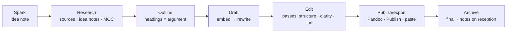

**Drafting from notes**: start the draft with `![[idea note#^block]]` embeds in outline order — your own thinking, already written. Then rewrite each embed as prose for the audience (embeds are quotes of notes, not final text). This "assemble then rewrite" method is the practical payoff of atomic notes: a 2,000-word essay from twelve idea notes is an afternoon, not a week.

**Editing passes** as checklists in a `frag-editing-passes` fragment: structure (does each section earn its place?), argument (are claims supported — link the sources?), clarity (one idea per paragraph, topic sentences), line (cut adverbs, passive voice, hedges), read aloud. **LanguageTool** plugin for grammar; the **Typewriter Scroll** for focus; word count in the status bar; **Longform** for anything multi-part.

**Versions**: File recovery and Git handle history; for deliberate drafts, `Drafts/Essay v1.md`, `v2.md`, or Longform's draft management. Do not keep five copies inline.

## Essays, blog posts, newsletters

`Projects/Writing/<Piece>.md` (or `Notes/Drafts/`) with properties: `type: draft`, `kind` (essay/post/newsletter/talk), `status` (idea/outline/drafting/editing/published), `target` (words), `publish_on`, `published_url`, `audience`. A Writing Base kanban (1.14) by status is the editorial calendar; a table sorted by `publish_on` is the schedule.

**Newsletter workflow**: one project note per issue from a template (sections pre-set), a `Newsletter Ideas.md` list fed by the weekly sweep, a Base of published issues with `open_rate`/`clicks` properties if you track them, and a `## Reception` section for replies worth keeping. Publishing: copy rich text (1.12+) into the newsletter tool, or Pandoc → HTML.

**Blogging**: Quartz / Digital Garden / Hugo via Enveloppe for publishing straight from the vault (Chapter 31), with `publish: true` and `date` properties controlling the site. Drafts stay unpublished by default.

## Books and long-form (non-fiction)

`Projects/Book/`: `Book.md` hub (premise, audience, promise, table of contents as links, word targets, deadlines, agent/editor People, decisions), `Chapters/` one note per chapter (`type: chapter`, `status`, `target`, `order`), `Research/` (or links to `Sources/` and `Notes/`), `Longform` index. Each chapter is a mini-essay drafted from idea notes. Longform: scenes = sections within chapters if you like; compile → Pandoc → DOCX for the editor. Word-count tracking per chapter via Longform or Novel Word Count; a Base of chapters with `target` and a formula `pct: (words / target * 100).round(0)` if you type `words` (or let Longform show it).

**Research for non-fiction**: exactly Chapter 17/18's pipeline; the book's MOC is the outline; interviews as `meeting` notes with `project: Book`; quotes with sources ready for endnotes via Pandoc footnotes.

## Fiction

`Projects/Novel/`:

- `Novel.md` hub: premise, themes, POV/tense decisions, timeline, status, targets.
- `Scenes/` or Longform scenes: one note per scene (`type: scene`, `chapter`, `pov` (character link), `location` (link), `time` (story date), `status`, `words`, `beat` (one-line purpose), `tension` 1–5). A Scenes Base: by chapter (group), by POV (who has been absent too long?), by location, timeline sort by `time`.
- `Characters/` (`type: character`: role, age, appearance, wants/needs, arc, voice notes, relationships as links, `first_appears` scene link). Backlinks from scenes = every appearance. A cards Base with portraits (Excalidraw or generated images).
- `World/` — see worldbuilding below.
- `Plot.md` or a Canvas: acts, beats, threads as coloured cards; scenes as embedded notes you drag into order. The **Kanban** plugin for the outline board (lanes = acts) or Bases kanban by `status`.
- `Style.md`: rules for this book (tense, banned words, how dialogue tags work), and a `Names.md` list.

Longform compiles scenes in order to a manuscript; Pandoc to DOCX in standard manuscript format via a reference doc. Daily word goals (Longform sessions) plus a `words_today` inline field in the daily log → Heatmap Calendar of writing days — the single best motivator.

## Worldbuilding

A world is a graph, which is why Obsidian fits so well. `World/` with typed notes: `place` (kind, region, population, ruler link, climate, map coordinates), `faction`, `character` (shared with fiction), `event` (date in an in-world calendar as a sortable string or number, participants, consequences), `item`, `concept` (magic system rule, technology, law), `species`, `language`. Every note links generously; the local graph at depth 2 on a place is a gazetteer.

**Timelines**: `event` notes with a numeric `year` (in-world) → a Base sorted by `year`, or the **Timeline**/**Chronos** plugins for a visual line. **Maps**: an image with the **Leaflet** plugin (pins linked to place notes on a custom map image) or the Bases map view with fake lat/long on a custom tile layer. **Consistency**: a `Canon.md` MOC of established facts; a Dataview list of `character` notes missing `birth_year`; contradictions found by searching.

**Reference vs prose**: the World notes are reference (retrieval); the scenes are prose. Keep them separate so world notes stay skimmable; use `![[Place#Summary]]` embeds in the scene's margin (a callout) while drafting.

## Visual thinking: Excalidraw and Canvas

**Excalidraw** (plugin): freehand drawing and diagramming with a full shape/text/arrow toolkit, libraries of shapes, dark/light, export to PNG/SVG, and — the Obsidian superpower — **links inside drawings** (text elements that are `[[wikilinks]]`; embedded notes as frames; the drawing's backlinks). A drawing is a `.md` file (`.excalidraw.md`) with the JSON compressed inside, so it is searchable and versioned. Uses: sketches of ideas, story maps, room layouts, UI mockups, mind maps (Excalidraw's own or the ExcaliBrain script, which draws your note graph), hand-drawn explanations to embed in idea notes (`![[Diagram.excalidraw]]`). The Excalidraw script library (community scripts inside the plugin) adds automation like "create a mind map from an outline".

**Canvas** (core, Chapter 4): arranging *existing notes* spatially — plot boards, moodboards (images + cards), argument maps, project plans. Canvas for arrangement; Excalidraw for drawing. Both embed in notes.

**Moodboards**: a Canvas of images (drag from the web via the Web viewer, or paste) with cards for notes; or a `Moodboard.md` note with an image grid via CSS (`cssclasses: [gallery]` and a snippet — Chapter 28). Images are attachments; keep the vault lean by resizing (Image Converter).

## Music, art, craft, photography, games — hobby logs

Any practice benefits from a **practice log** and a **works log**:

- **Music**: `Life/Music/` — pieces being learned (`type: piece`, `composer`, `status`, `started`, `performed`), practice sessions as daily-note inline fields (`[practice_min:: 40]`) → heatmap; chord charts with the **Chords** plugin or **abcjs** for notation; setlists as notes with embeds; recordings (audio embeds, small files only).
- **Art/craft**: `type: work` notes (medium, started, finished, photo, sold/gifted, notes on technique); a cards Base gallery — your portfolio; technique notes as idea notes (`Notes/Craft/`); materials inventory as assets (Chapter 22).
- **Photography**: the vault holds *selects*, not libraries: `type: photo-set` per shoot/trip with 5–10 embedded images, settings notes, edits notes; the RAW library stays in Lightroom/Capture One; link the catalog folder. A yearly "best 24" note.
- **Games**: `type: game` in `Sources/Games/` (platform, `status`: backlog/playing/finished/dropped, `rating`, `hours`, `started`, `finished`, cover) — a cards Base backlog; notes for games that made you think (they are sources too); a play log in the daily note.
- **Cooking as craft**: Chapter 20's recipes with `## Notes & variations` is the practice log.

## Media logs: film, TV, music, podcasts, art seen

`type: source` with `medium: film/tv/album/podcast/exhibition/theatre` — same shape as books (Chapter 17): `creator`/`director`/`artist`, `year`, `status`, `rating`, `watched`/`finished` date, `with` (People links), `cover`. Quick capture: a QuickAdd "Log film" prompting title/rating/companions → note with template. Bases: cards by year with covers ("the year in film"), average rating summaries, "watched with [[Partner]]" view via `with.contains(this)` in the partner's note. Reviews only when you have something to say; a rating and a line is fine. Import: Letterboxd/Trakt CSV exports → a script → notes (Chapter 29); Last.fm for music if you want listening history (mostly noise — log albums that mattered).

Why bother: taste is part of who you are; a decade of ratings and one-line reactions is a portrait no algorithm gives you. And "what was that film we saw in Lisbon?" becomes answerable.

## Creative dashboard (`Areas/Creativity.md` or `Creative MOC.md`)

```markdown
## Writing pipeline
![[Writing.base#Kanban]]
## Words this month
(Dataview: sum of [words_today::] in daily notes this month; Heatmap Calendar of writing days)
## Sparks to decide
![[Ideas.base#Sparks older than 30 days]]
## Current project
[[Novel]] — ![[Scenes.base#By chapter]]
## Recently watched / read / played
![[Media.base#Recent]]
## Practice this month
(heatmaps: music, drawing)
## Inspiration
[[Moodboard 2026.canvas]] · [[Commonplace Book]]
```

## Anti-patterns

- Building the perfect worldbuilding wiki and never writing a scene. Set a rule: no world note without a scene that needs it.
- Drafting inside idea notes. Drafts are separate notes; ideas stay atomic.
- Keeping the photo library in the vault. Selects only.
- Logging media out of completionism. Log what mattered; the rating is enough.
- Ten writing tools. Obsidian + Longform + Pandoc covers manuscripts; the newsletter/blog tool is the *publishing* step only.

## Key takeaways

- Capture sparks with zero friction, decide weekly (develop/park/delete), and let the graph collide ideas.
- Draft by assembling idea-note embeds in outline order, then rewriting for the audience; edit in named passes; Longform + Pandoc for anything multi-part.
- Fiction and worldbuilding are graphs: typed scene/character/place/event notes with Bases views by chapter, POV, location and timeline; Canvas and Kanban for plot boards; reference and prose kept separate.
- Excalidraw for drawing with links; Canvas for arranging notes; moodboards as canvases or CSS galleries.
- Hobbies get practice logs (inline fields → heatmaps) and works logs (typed notes → cards galleries); media logs are sources with ratings — a portrait of taste over time.

## Next

[Chapter 25: Mind and Self →](#mind-and-self)

---

# Mind and Self

The last life domain is the one that gives the others direction: what you value, how you decide, what you believe, what you have learned about yourself, and what you want your life to be for. It is also the domain where a plain-text vault you fully own is not merely convenient but necessary — nobody writes honestly about themselves into a company's database. This chapter covers values and principles, the decision journal, mental models and beliefs, therapy and emotional work, the commonplace book, reflection rituals, and the annual review that ties the year together.

## The `Mind/` folder

```text
Mind/
├── Values.md               what matters, ranked, with evidence
├── Principles.md           operating rules you have adopted (and why)
├── Vision.md               the life you are building toward; 3–5 year picture
├── Open Questions.md       Feynman's "favourite problems"
├── Decisions/              type: decision
├── Beliefs/                type: belief — claims about the world/yourself with confidence
├── Models/                 mental models as idea notes (or in Notes/ tagged #model)
├── Reviews/                annual reviews, life audits (or in Journal/Yearly)
├── Therapy/                session notes, exercises, patterns (privacy tier)
├── Commonplace/            quotes and passages by theme (or a single note + Base)
├── Prompts.md              journaling prompts, rotated by Templater
└── Mind MOC.md
```

## Values and principles

**Values** (`Mind/Values.md`): five to eight words with a paragraph each — what it means to you, what it looks like in practice, when you have honoured or betrayed it. Ranked, because conflicts between values are where hard decisions live. Revisit yearly; the diff between years is interesting. Values are *discovered* more than chosen: mine your journal (search for what made you angry, proud, ashamed) and your decisions.

**Principles** (`Mind/Principles.md`, or one note per principle in `Mind/Principles/`): operating rules — "Decide reversible things fast", "Never send the angry email the same day", "Default to the more generous interpretation". Each with: the rule, why (the incident that taught it — link the daily note or decision), exceptions, and a `confidence` or `adopted` date. One note per principle lets other notes link to it (`I broke [[Never send the angry email the same day]]`) and lets a Base show which principles have the most backlinks (the ones you keep needing).

**Vision** (`Mind/Vision.md`): a page describing an ordinary day 3–5 years out, in the present tense, across the areas. Embedded (`![[Vision#…]]`) into the yearly note and read at each quarterly review. Rewritten yearly.

## The decision journal

The highest-leverage practice in this chapter. `type: decision` notes (template in Chapter 11) for decisions that are consequential, hard to reverse, or that you will be asked about: jobs, moves, money, relationships, health choices, projects to start or kill, principles to adopt.

The fields matter because they make the decision *gradable later*:

- **Context** — what was true, what you knew, what you did not know.
- **Options** — including the one you did not take, with trade-offs (a table).
- **Decision & reasoning** — the actual argument.
- **Confidence** (1–10) — your calibration data.
- **Expected outcome** — falsifiable: "by March, X will have happened".
- **What would change my mind** — the pre-registered exit.
- **`review_on`** — six months, a year; the Decisions Base "Due for review" view surfaces it.
- **Review** — filled later: what happened, was the reasoning right (not just the outcome — good decisions have bad outcomes and vice versa), what to learn.

Over years the Base becomes a track record: average confidence vs. outcomes, domains where you decide well or badly, recurring failure modes (a `failure_mode` property: rushed / sunk cost / social pressure / overconfidence / analysis paralysis) — a personal epistemics dataset nobody else has about you. The yearly review reads all decisions of the year.

**Small decisions** do not get notes. The threshold: would I want to know, in a year, why I did this? If yes, five minutes now.

## Beliefs and mental models

**Beliefs** (`type: belief`, `Mind/Beliefs/`): claims about the world or yourself with `confidence` (%), `domain`, `sources` (links), `last_updated`, and a `## Evidence for / against` structure. "I do my best creative work before 10 am — 80%". "Index funds beat my stock picks — 95%". When evidence changes the confidence, update it and log the change — belief revision made visible. A Base sorted by confidence ascending shows what you are unsure about; one sorted by `last_updated` ascending shows what you have not re-examined.

**Mental models** (`Notes/` with `tags: [model]` or `Mind/Models/`): idea notes about thinking tools — inversion, second-order effects, base rates, opportunity cost, regression to the mean — each with a definition in your words, when it applies, when it misleads, and links to decisions where you used it. A `Models MOC` grouped by domain. The value is in the *links from decisions*: a model you have never actually applied is trivia.

**Cognitive patterns** — your own biases and tendencies, noticed in the journal ("I catastrophize on Sunday evenings", "I over-commit when flattered"): one note each in `Mind/Patterns/` with examples (links to daily notes), triggers, and the counter-move. Therapy work often produces these; see below.

## Therapy and emotional work

If you are in therapy or doing structured self-work (CBT, ACT, journaling protocols), the vault is an excellent companion — with the strictest privacy tier (Chapter 26: encrypted sync only, excluded from everything, optionally Meld Encrypt or a separate vault).

- **Session notes** (`type: meeting`, `series: Therapy`, `Mind/Therapy/`): what came up, insights, homework as tasks. Written within an hour of the session.
- **Thought records** (CBT): a template — situation, automatic thought, emotion (0–100), evidence for/against, balanced thought, emotion after. As a note per record or a table in a monthly note; a Base of records with the emotion delta as a formula shows the technique working.
- **Mood and triggers**: the daily `mood` property plus a `[trigger:: …]` inline field when notable; monthly Dataview correlations.
- **Patterns** notes (above) fed by sessions.
- **Values and ACT work**: `Values.md` is literally the ACT values exercise.
- **Gratitude, self-compassion letters, unsent letters**: `Mind/Letters/` — writing you never send. Dated. Read at the annual review, or never.
- **Crisis plan**: `Mind/Safety Plan.md` — warning signs, coping strategies, people to call, professionals, reasons. Written when well; pinned; also exported to the phone.

None of this replaces a clinician; all of it makes sessions more productive and progress visible.

## The commonplace book

A centuries-old practice: collecting passages that struck you, by theme. In Obsidian: `Mind/Commonplace/` with one note per **theme** (Attention, Courage, Grief, Craft, Money) holding quotes with sources (`— [[Author]], [[Book]] p. 45`), or one note per **quote** (`type: quote`: `author`, `source`, `themes`, `text`) with a Base grouped by theme. The per-quote approach is heavier but lets a Random note surface one quote a day and lets a person/book note show its quotes via backlinks. Either way: quotes are for *re-reading*, so build a re-reading ritual — the daily note's random quote widget (DataviewJS picks from `type: quote`), or the monthly review opens one theme.

## Reflection rituals

The periodic-notes ladder (Chapter 15) carries the schedule; this domain supplies the *content* for the reflective sections:

| Cadence | Prompt set |
| --- | --- |
| Daily (evening) | Went well · could improve · grateful · (optional) what did I avoid today? |
| Weekly | Three wins · one lesson · one change · who helped me · what drained me · what did I learn about myself |
| Monthly | Area standards met? · one principle I honoured, one I broke · a belief that shifted · a decision to log · what am I avoiding? |
| Quarterly | Direction check against Vision · what to stop · what surprised me · energy audit (what gave/took energy — from the daily `energy` data) |
| Yearly | The annual review (below) |

**Prompted journaling**: `Mind/Prompts.md` — a list of 50–100 prompts; a Templater user script picks one deterministically by day-of-year for the daily note ("What would I do today if I were not afraid?" appears on the same day every year — you get to compare answers). Sources for prompts: the *Five-Minute Journal*, Stoic journaling (morning intention, evening review), *Atomic Habits* reflection questions, your therapist.

**Stoic evening review** (Seneca/Epictetus): what did I do badly, what did I do well, what did I leave undone — three lines, template-ready.

## The annual review

Late December or the first week of January; half a day; a template in the yearly note (Chapter 15 gave the prompt list). The mind-and-self parts specifically:

1. **Read the year**: skim the twelve monthly notes; read every decision note of the year and grade the reasoning; read the beliefs updated this year; read the letters.
2. **Values check**: for each value, one example of honouring it and one of betraying it this year. Re-rank if needed.
3. **Principles**: which were used (backlinks count)? Any to add from this year's lessons? Any to retire?
4. **Patterns**: which recurred? Which improved?
5. **Themes**: the year in three words; the story you would tell about it; what it was *for*.
6. **Next year**: theme, 3–7 goals (numeric where possible), what to stop, what to protect, the vision paragraph revised.
7. **Gratitude list**: people (linked), events, luck.
8. **Letter to next year's self**: sealed in `Mind/Letters/2027 from 2026.md`, opened by a task `📅 2027-12-20`.

A **life audit** every few years (or at a transition): a longer version across all areas with 1–10 scores and a Canvas of the "wheel of life"; compare with the previous audit.

## Mind dashboard (`Mind MOC.md`)

```markdown
## Decisions due for review
![[Decisions.base#Due for review]]
## Open decisions
![[Decisions.base#Open]]
## Beliefs not re-examined in a year
```base
filters: {and: [type == "belief", last_updated < today() - "365d"]}
views: [{type: table, name: Stale, order: [file.name, confidence, last_updated]}]
```
## Least confident beliefs
```base
filters: {and: [type == "belief"]}
views: [{type: table, name: Uncertain, order: [file.name, confidence, domain], sort: [{property: confidence, direction: ASC}], limit: 10}]
```
## Principles most needed (by backlinks)
(Dataview: FROM "Mind/Principles" SORT length(file.inlinks) DESC LIMIT 10)
## Quote of the day
(DataviewJS random from type == "quote")
## Open questions
![[Open Questions]]
## Values · Principles · Vision
[[Values]] · [[Principles]] · [[Vision]] · [[Safety Plan]]
```

## Privacy, again

`Mind/` and `Journal/` are the two folders that must never leak. Excluded from Publish and any shared vault by default; synced only end-to-end encrypted (Obsidian Sync, Remotely Save with E2E, LiveSync); device disk encryption on; optionally Meld Encrypt for therapy notes and letters; a separate vault if the main vault is ever shared. Chapter 26 has the mechanics. The freedom to write honestly depends on knowing it is safe.

## Anti-patterns

- Values copied from a list. Mine your own journal and decisions.
- Decision notes only for decisions that went well. Log before the outcome is known — that is the point.
- Beliefs without confidence numbers. Vague beliefs cannot be updated.
- Mental-model collections never linked from a real decision. Trivia.
- Reflection prompts so numerous you skip them. Three at each cadence.
- Reading none of it back. The annual review is the reading.

## Key takeaways

- `Mind/` holds values (ranked, evidenced), principles (one note each, backlinkable), vision (embedded upward), open questions, decisions, beliefs, models, patterns, therapy work, a commonplace book, and prompts.
- The decision journal — context, options, reasoning, confidence, falsifiable expectation, review date, later grading — is the single highest-leverage practice here.
- Beliefs with confidence and last-updated dates make belief revision visible; models earn their place only when linked from decisions.
- Reflection content rides the periodic-notes ladder with three prompts per cadence; the annual review reads the year's decisions, beliefs, letters and values.
- This is the most private material you own; protect it accordingly.

## Next

[Chapter 26: Sync, Backup and Security →](#sync-backup-and-security)

---

# Sync, Backup and Security

A whole-life vault is, by construction, the most valuable and most sensitive collection of files you own. Three separate problems protect it, and people conflate them constantly: **sync** (the same vault on several devices), **backup** (recovering from loss, corruption, or your own mistakes), and **security** (keeping others out). Sync is not backup. Backup is not security. This chapter gives a decision matrix for sync, a 3-2-1 backup design that works with Obsidian's quirks, and a security posture covering encryption, plugins, URIs, secrets, and sharing.

## Sync

### The options

| Method | Platforms | E2E encrypted | Conflict handling | Version history | Cost | Best for |
| --- | --- | --- | --- | --- | --- | --- |
| **Obsidian Sync** | All (incl. iOS, Android) | Yes | Merges Markdown line-by-line; keeps versions | 1 month (Standard) / 12 months (Plus); per-file restore; 1.13 Sync sidebar view | ~$4–8/mo | Most people; mobile; zero maintenance |
| **iCloud Drive** | macOS, iOS (Windows client is poor) | No (Apple holds keys unless Advanced Data Protection is on) | Duplicates as "conflicted copy"; occasional file eviction | None (Time Machine on Mac) | Included | Apple-only users who accept the risks |
| **Syncthing** | Desktop, Android (no iOS) | Device-to-device TLS; no server | Conflict files `.sync-conflict-…` | File versioning optional | Free | Privacy-focused, Android, self-managed |
| **Git** (Obsidian Git plugin) | Desktop excellent; mobile possible (isomorphic-git, slow, large vaults struggle) | Repo host sees content unless private + trusted; use git-crypt/private repo | Merge conflicts you resolve | Complete, forever | Free/private repo | Developers; also a backup |
| **Remotely Save** | All | Optional E2E (password) | Last-writer-wins with checks; keeps deleted-file trash | Provider's versioning | Free + storage | Cross-platform free sync to S3/WebDAV/Dropbox/OneDrive/GDrive/Box/Nextcloud |
| **Self-hosted LiveSync** | All | Yes | Near-real-time, document-level, handles conflicts with a resolver UI | Configurable | Self-hosted CouchDB (or fly.io/IBM Cloudant free tiers) | Self-hosters wanting real-time sync |
| **Dropbox / OneDrive / Google Drive** | Desktop; mobile via third-party file providers only | No | Conflicted copies; OneDrive "files on demand" breaks indexing | Provider versions | Included/paid | Not recommended as the primary; fine as a backup target |
| **Resilio / rsync / Unison** | Desktop | Varies | Manual | None | Varies | Edge cases |

### Recommendation

- **Default: Obsidian Sync.** It is the only option that is E2E-encrypted, works flawlessly on iOS, merges Markdown intelligently, versions everything, and funds the app. Standard tier suffices for one vault; Plus for multiple vaults, larger attachments, longer history.
- **Free and cross-platform: Remotely Save** with E2E encryption enabled, pointed at any S3-compatible bucket (Backblaze B2 is cheap) or WebDAV (Nextcloud). Set sync to run on start/interval; avoid editing on two devices simultaneously.
- **Self-hosters: Self-hosted LiveSync.**
- **Developers: Git** — but usually as *backup + history* alongside Sync, not as the mobile sync mechanism.
- **Avoid as primary**: iCloud (eviction, conflicts, no Windows), OneDrive (files on demand), Google Drive on mobile.

### Sync hygiene (all methods)

- **Do not sync `.obsidian/workspace.json`** (Obsidian Sync excludes it by default; Git → `.gitignore`; Remotely Save → skip pattern). It changes constantly and is device-specific.
- **Plugins across devices**: Obsidian Sync can sync community plugins and their settings (1.13 warns before enabling because some settings are device-specific — Shell commands paths, Git executable, Local REST API ports). Sync plugins if your devices are similar; otherwise sync `community-plugins.json` and let each device install.
- **Hotkeys, appearance, snippets, core plugin settings**: sync them (Obsidian Sync options; Git includes them naturally).
- **Attachments**: set size limits (Sync: per-type toggles and max size — 1.12 logs skipped files). Large media outside the vault.
- **Never two sync systems on the same folder** (iCloud + Obsidian Sync on one vault is a classic corruption source).
- **Mobile**: iOS vault location must be "On My iPhone" for Obsidian Sync/Remotely Save/LiveSync or "iCloud Drive" for iCloud — not both. Android: any folder; Syncthing folders work.
- **Conflicts**: Obsidian Sync merges; others create conflict copies — search `conflict` weekly and resolve. The **Sync sidebar view** (1.13) and the CLI's `sync:history` / `sync:read` / `sync:restore` and `diff` make comparing versions fast.

### Git setup (Obsidian Git)

```gitignore
# .gitignore at vault root
.obsidian/workspace.json
.obsidian/workspace-mobile.json
.obsidian/cache
.trash/
.DS_Store
# optional: keep plugin data but not caches
.obsidian/plugins/*/cache*
```

Plugin settings: auto backup every N minutes (commit), auto pull on startup, auto push after commit, commit message with `{{date}}` template, "pull before push". Desktop uses your system `git` (with credentials configured — SSH keys or a credential helper). Mobile uses isomorphic-git with a personal access token; workable for vaults under a few hundred MB, slow beyond. Use a **private** repository; treat the host (GitHub/GitLab/Gitea) as able to read your notes unless you add **git-crypt** or keep the repo on your own server. Branches are unnecessary; if a merge conflict appears, resolve in Source mode (conflict markers) and commit.

Git also gives you a **complete history forever** and `git log -p Journal/Daily/2026-09-06.md` archaeology. Even Obsidian Sync users often add a nightly Git commit as a backup layer.

## Backup

Sync propagates mistakes instantly — a deleted folder disappears everywhere. Backup is separate. Design: **3-2-1** — three copies, two media, one off-site — adapted:

| Layer | What | Recovers from |
| --- | --- | --- |
| **File recovery** (core) | Snapshots of edited files every 5 min for N days (raise to 30–90) | Bad edits, plugin damage to a note |
| **Sync version history** | Obsidian Sync (1–12 months) / Git history / provider versions | Deleted or overwritten files, cross-device errors |
| **`.trash/`** | Obsidian's trash folder (setting: move to Obsidian trash) | Accidental deletes; empty it quarterly, not weekly |
| **Local automated backup** | Time Machine / Windows File History / restic / Borg / `rsync` snapshots of the vault folder, hourly or daily | Disk failure, ransomware (if versions are immutable), mass corruption |
| **Off-site backup** | The Git remote, and/or a nightly `tar` of the vault to encrypted cloud storage (restic → B2/S3, Arq, Duplicati, Kopia) | House fire, theft, account lockout |
| **Cold copy** | Quarterly zip to an external drive or USB kept elsewhere; yearly export to PDF of the Emergency & Legacy note and key records | Everything else, including your own death (Chapter 22) |

Practical notes:

- Back up the **whole vault folder including `.obsidian/`** — the config is part of the system.
- Test restores twice a year: pick a note, restore it from each layer.
- Backups must be **versioned** (snapshots), not a mirror — a mirror faithfully copies your deletion.
- Encrypt off-site backups (restic/Borg/Kopia/Arq do by default).
- A script with the **Obsidian CLI** can export Bases to CSV nightly (`obsidian base:query file=Accounts format=csv > backup/accounts.csv`) for a spreadsheet-readable fallback of key records.
- `File recovery` data lives in the app's IndexedDB, *not* in the vault — it does not sync or back up; it is a per-device safety net only.

## Security

### Threat model, briefly

Who might read your vault? A thief with your laptop (disk encryption solves it); a cloud provider or a subpoena (E2E encryption solves it); malware or a malicious plugin (plugin discipline and OS security); someone you share a vault with (vault boundaries); a URI or link that triggers actions (1.13's confirmation dialogs); future you locked out (recovery planning).

### Device and disk

- Full-disk encryption on every device (FileVault, BitLocker, LUKS; iOS/Android default). Non-negotiable for a vault with journal and finance.
- Strong device passcodes; auto-lock; Obsidian mobile does not have its own lock, so the device lock *is* the vault lock. (Third-party "lock" plugins are cosmetic — the files are plain text on disk regardless.)

### Encryption in transit and at rest in the cloud

- Obsidian Sync: E2E with your password; **write down the encryption password** — Obsidian cannot recover it. Losing it means re-uploading the vault.
- Remotely Save: enable E2E; same warning.
- LiveSync: E2E passphrase; same warning.
- Git: private repo is *access control*, not encryption; add git-crypt for sensitive folders or accept the host's trust model.
- iCloud: Advanced Data Protection makes iCloud Drive E2E; otherwise Apple holds keys.

### Encrypting inside the vault

- **Meld Encrypt**: encrypts selected text or whole notes with a password (AES); encrypted notes show a decrypt button; searchable only when decrypted. Right for therapy notes, letters, the accounts registry — a handful of notes, not the whole vault (that is what disk/sync encryption is for).
- **Separate encrypted vault** (e.g. on a Cryptomator/VeraCrypt volume, or an encrypted disk image) for material you never want in the main vault's sync at all.
- Do not put passwords, recovery codes, or private keys in *any* note, encrypted or not. Password managers exist for a reason; the note links to the manager entry name.

### Plugins

Plugins run with full Node/Electron privileges on desktop: they can read every file, make network requests, and run processes. Mitigations: install only from the community directory (reviewed) or BRAT for well-known authors; prefer popular, open-source, maintained; read the permissions-equivalent (does a "table formatter" need network access? check the repo); avoid plugins that require pasting API keys into plain settings — use ones that support **Keychain** (1.11+, OS-level secret storage); keep plugins updated; review the list quarterly. **Restricted mode** disables all community plugins instantly if something looks wrong (1.13: exit without re-enabling all). Untrusted vaults: when opening a vault you did not create (a downloaded showcase), Obsidian 1.13 warns about the plugins it contains — keep Restricted mode on until you have read them.

### URIs, links, and external content

- `obsidian://` URIs can run actions (open, create, append, run commands via Advanced URI). 1.13 shows a **confirmation dialog** per action with an allow list — keep it on; allow only actions you use from trusted automations.
- 1.12+: confirmation when opening files in external apps; warning for executables.
- 1.13: warning before loading HTML resources from network drives; one-time confirmation before rendering **Mermaid** in a vault (Mermaid can embed links).
- Web Clipper content is Markdown; `<iframe>`s and scripts are neutralized by Obsidian's renderer, but be aware that a note can embed a remote image whose server logs the fetch (tracking pixel) — Obsidian fetches external images when rendering. Clip images locally if it matters.
- DataviewJS and Templater run arbitrary JavaScript from *your notes*. A note someone sends you with a `dataviewjs` block is executable code. Do not paste untrusted notes into a vault with JS plugins enabled; or paste them into a Restricted-mode scratch vault first.

### Secrets and API keys

AI plugins, Zotero, Readwise, Todoist, Local REST API all need keys. Prefer plugins that use **Keychain** (Settings → Keychain shows stored secrets). For plugins that store keys in `data.json`, know that Sync/Git will propagate them — exclude those files from Git (`.obsidian/plugins/<id>/data.json` in `.gitignore`) or accept the risk of a private repo. Rotate keys when a device is lost.

### Sharing a vault

- **With a partner/family**: a *separate shared vault* (Obsidian Sync supports multiple collaborators per vault on Plus/with shared vaults; Remotely Save with a shared bucket; LiveSync shared DB; Git with both as collaborators). Never share your main vault — the journal and Mind folders should not be one misclick from view.
- **Read-only sharing**: Publish (Chapter 31) with a password, or export PDF/HTML.
- **Work**: separate vault when confidentiality requires (Chapter 19).

### Recovery planning

- Write the sync encryption password, Git credentials, and backup encryption keys into your password manager, and the *existence and location* of the vault into the Emergency & Legacy note (Chapter 22).
- Keep one unencrypted-at-rest but disk-encrypted cold copy somewhere a trusted person can reach with instructions.
- Practice opening the vault on a fresh device from backups once a year — it exposes every missing credential.

## Checklist

- [ ] Sync method chosen; only one system on the vault folder; `workspace.json` excluded.
- [ ] Sync/backup encryption passwords stored in the password manager.
- [ ] File recovery history raised to 30+ days.
- [ ] Automated local versioned backup of the vault folder (incl. `.obsidian/`).
- [ ] Off-site encrypted backup (Git remote and/or restic-style) running nightly.
- [ ] Quarterly cold copy; yearly restore test.
- [ ] Full-disk encryption on all devices.
- [ ] Plugin list reviewed; API keys in Keychain where possible; `data.json` with secrets excluded from Git.
- [ ] URI confirmation on; allow list minimal.
- [ ] Sensitive folders (Journal, Mind, Health, Finance, People) excluded from Publish/shared vaults; Meld Encrypt or a separate vault for the most sensitive.
- [ ] Emergency & Legacy note updated and exported.

## Key takeaways

- Sync, backup, and security are three problems. Obsidian Sync (or Remotely Save with E2E / LiveSync) for sync; versioned local + off-site encrypted backups plus File recovery, history, and trash for backup; disk encryption, E2E sync, plugin discipline, URI confirmations, Keychain, and vault boundaries for security.
- Never run two sync systems on one folder; exclude `workspace.json`; keep large media out.
- Git is the best *history and backup* layer even if you sync another way.
- Encrypt a few notes with Meld Encrypt; encrypt everything at rest with the disk and in transit with E2E; put secrets in a password manager, never in notes.
- Plan recovery: passwords written down, restore tested yearly, the vault's existence documented for someone else.

## Next

[Chapter 27: Mobile →](#mobile)

---

# Mobile

Obsidian on iOS and Android is the same app — same vault, same plugins, same Markdown — running on a smaller screen with a touch keyboard and an operating system that suspends it constantly. Used for what phones are good at (capture, reading, quick edits, checking things off) it is excellent; used for vault administration it is frustrating. This chapter covers setup on each platform, the mobile UI's specific features, workflows tuned for thumbs, OS-level automation (Shortcuts, Tasker, Share Sheet), and performance.

## Setup

### iOS / iPadOS

- Install from the App Store. On first launch choose **Create new vault** (local, "On My iPhone/Obsidian") or **Open folder as vault** (iCloud Drive) or **Set up Obsidian Sync**.
- **Storage location decides your sync method**: iCloud Drive vault → iCloud sync only. Local vault → Obsidian Sync, Remotely Save, or LiveSync. Never combine.
- iPad supports split view and Stage Manager; sidebars behave like desktop in landscape; keyboard shortcuts work with a hardware keyboard (++cmd+p++, ++cmd+o++, etc.).
- Background: iOS suspends the app; sync happens when you open it. Obsidian Sync catches up in seconds; Remotely Save runs on open (set "sync on start").

### Android

- Play Store, F-Droid, or the GitHub APK. Grant **All files access** if you keep the vault outside the app's private storage (recommended — private storage is deleted with the app).
- Vault anywhere on internal storage; **Syncthing** folders work natively (the best free Android sync); Remotely Save and Obsidian Sync also fine.
- Some keyboards (Gboard) autocorrect Markdown syntax; add `[[`, `#`, `- [ ]` to the personal dictionary or use a Markdown-friendly keyboard. **Swiftkey** and **Unexpected Keyboard** are popular among Obsidian users.
- Back gesture closes modals; long-press for context menus.

### Both

- Settings → **Appearance → Mobile**: quick-action (swipe down) command, ribbon items, and the **mobile toolbar** — the row of buttons above the keyboard. Configure it (Settings → Toolbar) with 8–12 actions: toggle checkbox, indent/outdent, insert link, insert template, Tasks: create/edit, insert timestamp (Templater), undo/redo, toggle bold, heading, Daily note. The toolbar is the mobile command palette.
- **Pull-down gesture** on the editor runs a configurable command (default: command palette; set to *Quick switcher* or *Open today's daily note*).
- **Tab switcher** (1.7+): a grid of open tabs; swipe to close.
- Sync **hotkeys/appearance/core settings** from desktop, but be selective with plugins (below).

## What mobile does well

- **Capture**: daily note, quick switcher create, Share Sheet (iOS 1.13), share intent (Android), voice dictation, camera → paste image.
- **Reading**: Reading view, embedded Bases, dashboards (light ones), PDFs (built-in viewer), Publish-like browsing of your own notes.
- **Ticking**: tasks in queries, habit checkboxes, Meta Bind sliders/toggles.
- **Light editing**: fixing a line, adding a log entry, a property value.
- **Bases**: table and cards views render well; inline editing works; kanban (1.14) on a phone is cramped but usable on tablet.
- **Canvas**: view and light editing on tablet; awkward on phone.

## What to avoid on mobile

- Heavy DataviewJS dashboards (slow to render, battery-hungry).
- Vault-wide refactors (renames are fine; moving folders and mass edits are not).
- Plugin installation/configuration (do it on desktop; sync).
- Git as the sync method for big vaults (isomorphic-git is slow; works for small vaults).
- Excalidraw complex drawings on phone (fine on tablet with pencil).

## The mobile capture kit

### Daily note as the landing page

Settings → Daily notes → *Open daily note on startup*; or Homepage plugin → today's note on mobile only (it has a separate mobile setting). Template: light on queries (one Tasks query, no DataviewJS), Meta Bind sliders for mood/energy, a `## Log` section.

### Log line command

QuickAdd capture "Log": target today's daily note, insert under `## Log`, format `- {{DATE:HH:mm}} {{VALUE}}`. Add to the mobile toolbar. Two taps and dictation → a timestamped entry.

### Quick task

QuickAdd capture "Task" → today's `## Plan` as `- [ ] {{VALUE}}`; or the Tasks plugin's *Create or edit task* on the toolbar (the modal has date pickers — much easier than emoji on a phone).

### Share Sheet (iOS, Obsidian 1.13)

Share text, links, images, or files from any app to Obsidian **without opening the app**. Configure **Locations** in Settings → Share: each location defines a vault, a folder or "daily note", and a template with variables (`{{title}}`, `{{url}}`, `{{content}}`, `{{date}}`, `{{selection}}`). Typical locations: "Inbox" (new note in `Inbox/` with a clipping template), "Today" (append to the daily note's `## Notes`), "Reading list" (create in `Sources/Articles/` with `status: to-read`). Shared images land in Attachments with an embed.

### Android share intent

Obsidian appears in the share menu; shared text/links open a new note (or, with **Advanced URI**/**Tasker** flows, can be appended to a target). Third-party: **Obsidian Share** style apps, Tasker with `obsidian://` URIs, or the **Telegram Sync** plugin for a Telegram-to-vault capture channel that works from any device.

### Voice

System dictation into the log line is the simplest. Better: record a voice memo, transcribe (Whisper via a Shortcut, Otter, or the **Whisper** plugin on desktop later), and land the text in `Inbox/`. Chapter 30 covers pipelines.

### Photos

Camera → share to Obsidian (Share Sheet) → today's note. Or paste from the clipboard in the editor. Attachment Management renames on desktop later; on mobile, filenames are timestamps — acceptable.

### Web Clipper on mobile

The extension works in **Safari on iOS** (as a Safari extension), **Firefox/Kiwi/Edge on Android**; Chrome Android does not support extensions. Alternatively share the URL to Obsidian via Share Sheet with a template that stores the URL for desktop clipping later.

## Reading and reviewing on mobile

- **Reading view by default** for a review session (Settings → Editor → Default view for new tabs: Reading, on mobile only via a mobile-specific setting or a CSS snippet).
- **Bases**: pin a "Today" and "Contact due" view as bookmarks; the bookmarks pane is one tap from the ribbon.
- **Random note** on the toolbar for commute reviews of idea notes.
- **Spaced Repetition** flashcards review works on mobile — a two-minute queue session.
- **Outline pane** for long notes; **fold all** to skim.

## Templater and QuickAdd on mobile

Both work. Templater's *Trigger on new file creation* applies templates on mobile too; user scripts run (they are JS; `tp.system.prompt/suggester` render as modals). Shell-command functions do not (no shell). QuickAdd captures and template commands are the backbone of thumb capture; assign them to the toolbar via **Commander** (which can add any command to the mobile toolbar) or QuickAdd's own toolbar option.

## OS automation

### iOS Shortcuts

Shortcuts can:

- Open URLs: `obsidian://new?vault=Main&name=Inbox/Quick&content=...` (URL-encode content) — the built-in URI (Chapter 29). With **Advanced URI**: `obsidian://adv-uri?vault=Main&daily=true&heading=Log&data=- 14:32 text&mode=append`.
- Write files directly to the vault folder if the vault is in "On My iPhone/Obsidian" (the *Save File* action to the Obsidian folder) — no Obsidian launch needed; the app indexes on next open. This is how to build "append to daily note without opening Obsidian" reliably.
- Chain: *Dictate Text* → *Save File* to `Inbox/`; *Get Current Location* → text → daily note; *Health samples* (sleep) → daily note property via a small text transform; *Calendar events today* → daily note `## Agenda`.
- Run from the Action button, back tap, widgets, Siri, or automations (time of day, arriving at a location: "when I leave the gym, ask for workout RPE and write a workout note").

### Android Tasker / Automate

Same idea: `obsidian://` intents, direct file writes to the vault folder (Tasker's *Write File*), triggers (time, location, NFC tag on the fridge → open Pantry note). **Termux** on Android can run scripts against the vault folder (and Git); **Syncthing** keeps it in sync.

### Widgets

No official widget. iOS: a Shortcuts widget with your capture shortcuts; Scriptable widgets can *read* a note (e.g. today's tasks) from the Obsidian folder and display it. Android: Tasker/KWGT widgets can do similar; some third-party "Markdown note widget" apps can display a file from the vault.

## Performance on mobile

- Startup time is dominated by plugin count and vault size. Under 20 plugins and under ~10k notes is comfortable; beyond, prune.
- Disable heavy desktop-only plugins on mobile: many have a mobile toggle in their settings; or use a `.obsidian` **profile per device** (Obsidian Sync can exclude plugin sync; Git can ignore `community-plugins.json` per device — advanced).
- Dataview indexing on open is the usual culprit; Bases are cheaper.
- Attachments: keep the vault under a few GB; exclude video from sync.
- Turn off *Auto reveal current file* in File explorer if the tree is huge.
- iOS: if the app is killed in the background, unsaved edits are lost only in the last second or two — Obsidian saves continuously; nonetheless, avoid switching away mid-sentence during a long edit.

## Mobile-specific settings worth setting

| Setting | Recommendation |
| --- | --- |
| Appearance → Font size | Larger than desktop (18–20) |
| Editor → Readable line length | On |
| Mobile toolbar | 8–12 curated actions |
| Pull-down quick action | Open today's daily note or Quick switcher |
| Daily notes → Open on startup | On (mobile is capture-first) |
| Files & links → Confirm deletion | On (fat fingers) |
| Spellcheck | System |
| Community plugins | Only what mobile needs: Templater, Tasks, QuickAdd, Meta Bind, Calendar, Periodic Notes, Omnisearch (optional), Spaced Repetition; consider disabling Dataview-heavy dashboards |

## Tablet as a middle ground

iPad/Android tablets with a keyboard are near-desktop: sidebars, split panes, Canvas, Excalidraw with a stylus, PDF++ annotation (excellent with a pencil), long-form writing. Use a separate workspace layout; Obsidian keeps mobile and desktop layouts separately.

## Key takeaways

- Mobile is for capture, reading, and ticking; administration stays on desktop.
- Configure the mobile toolbar and pull-down action, land on the daily note, and build a capture kit: log line, quick task, Share Sheet/share intent locations, voice, photos.
- Keep mobile templates and dashboards light; prefer Bases over DataviewJS; prune plugins.
- OS automation (Shortcuts/Tasker) can write to the vault folder or fire `obsidian://` URIs — daily-note appends without opening the app.
- Tablets with keyboards are a legitimate primary device; phones are not.

## Next

[Chapter 28: Customization — Themes, CSS and Layout →](#customization-themes-css-and-layout)

---

# Customization — Themes, CSS and Layout

Obsidian's interface is HTML and CSS, which means everything about how it looks is changeable — from a theme you install in one click to a five-line snippet that hides a folder or colours a callout. Customization is partly aesthetics and partly ergonomics: a vault you enjoy looking at is a vault you open. This chapter covers themes worth using, Style Settings, the CSS snippet mechanism with thirty ready-to-paste snippets, per-note styling with `cssclasses`, the 1.13 callout colour change, fonts, icons, and workspace tuning.

## Themes

Settings → Appearance → Themes → *Manage*. Themes are CSS files in `.obsidian/themes/<Name>/theme.css` plus a manifest. One theme active at a time; snippets layer on top.

| Theme | Character | Notes |
| --- | --- | --- |
| **Default** | Clean, neutral, always compatible | Underrated. With a few snippets it is excellent. Migrated to OKLCH colours in 1.13. |
| **Minimal** (kepano) | Refined, minimalist, hugely configurable via Style Settings + the *Minimal Theme Settings* plugin (colour schemes, line widths, image grids, table/checkbox styles, focus mode) | The most popular power-user theme; maintained by Obsidian's CEO. |
| **AnuPpuccin** | Catppuccin colours, rainbow folders, alternate checkboxes, colourful callouts, many layout toggles | Pretty and very configurable; heavier CSS. |
| **Things** | Inspired by the Things app; light, friendly, good checkboxes | Simple and warm. |
| **Border** | Bordered panes, colourful, many Style Settings options | Distinctive. |
| **Catppuccin**, **Tokyo Night**, **Nord**, **Dracula**, **Rosé Pine**, **Everforest** | Colour-scheme ports | Choose to match your terminal/editor. |
| **Prism**, **ITS Theme**, **Primary**, **Shimmering Focus**, **Blue Topaz** | Feature-rich; some add callout types, banners, layouts | Powerful; check maintenance status. |

Advice: start with **Minimal** or **Default** plus snippets. Themes that add many features tend to break with Obsidian updates; the theme's GitHub activity is the health signal.

## Style Settings

The **Style Settings** plugin gives themes and snippets a settings UI: colours, toggles, sliders, fonts, defined by the theme author. Install it before Minimal/AnuPpuccin — without it, most of their options are unreachable.

## CSS snippets

Settings → Appearance → CSS snippets → open the folder (`.obsidian/snippets/`) → drop `.css` files → toggle each on. Snippets apply on top of the theme; they reload instantly; they sync with the vault. Disabling a snippet properly removes styles from pop-out windows (1.13).

### How to find selectors

++ctrl+shift+i++ opens the developer tools; the element picker shows the class of anything you click. Obsidian's CSS variables (`--text-normal`, `--background-primary`, `--accent-h/s/l`, `--font-text-size`, `--callout-color`, …) are documented at docs.obsidian.md → CSS variables, and the CLI has `obsidian dev:css selector=".markdown-preview-view" prop=color` for querying computed styles. Prefer variables over hardcoded values so light/dark modes and themes keep working.

### The snippet library

**Layout and chrome**

```css
/* 01 Hide the status bar */
.status-bar { display: none; }
```

```css
/* 02 Hide the ribbon (use hotkeys) */
.workspace-ribbon.mod-left { display: none; }
```

```css
/* 03 Wider readable line length (default ~700px) */
.markdown-source-view.mod-cm6.is-readable-line-width .cm-sizer,
.markdown-preview-view.is-readable-line-width .markdown-preview-sizer {
  max-width: 880px;
}
```

```css
/* 04 Per-note full width via cssclasses: [wide] */
.wide .markdown-source-view.mod-cm6.is-readable-line-width .cm-sizer,
.wide .markdown-preview-view.is-readable-line-width .markdown-preview-sizer {
  max-width: 100%;
}
```

```css
/* 05 Hide the inline title on notes with cssclasses: [no-title] */
.no-title .inline-title { display: none; }
```

```css
/* 06 Compact file explorer */
.nav-file-title, .nav-folder-title { padding-top: 2px; padding-bottom: 2px; }
.nav-file-title-content, .nav-folder-title-content { font-size: 0.9em; }
```

```css
/* 07 Hide specific folders in the explorer (Templates, Attachments) */
.nav-folder-title[data-path="Templates"],
.nav-folder-title[data-path="Templates"] + .nav-folder-children,
.nav-folder-title[data-path="Attachments"],
.nav-folder-title[data-path="Attachments"] + .nav-folder-children { display: none; }
```

```css
/* 08 Colour folders by name */
.nav-folder-title[data-path^="Projects"] { color: #10b981; }
.nav-folder-title[data-path^="Journal"]  { color: #94a3b8; }
.nav-folder-title[data-path^="People"]   { color: #f59e0b; }
.nav-folder-title[data-path^="Mind"]     { color: #a78bfa; }
```

```css
/* 09 Dim the tab bar until hovered */
.workspace-tab-header-container { opacity: 0.5; transition: opacity .2s; }
.workspace-tab-header-container:hover { opacity: 1; }
```

**Typography**

```css
/* 10 Heading sizes and weights (modest hierarchy) */
.markdown-preview-view h1, .cm-header-1 { font-size: 1.7em; font-weight: 700; }
.markdown-preview-view h2, .cm-header-2 { font-size: 1.4em; font-weight: 650; }
.markdown-preview-view h3, .cm-header-3 { font-size: 1.15em; font-weight: 600; }
.markdown-preview-view h4, .cm-header-4 { font-size: 1em; font-weight: 600; text-transform: uppercase; letter-spacing: .04em; }
```

```css
/* 11 Coloured headings */
.cm-header-2, .markdown-preview-view h2 { color: var(--color-purple); }
.cm-header-3, .markdown-preview-view h3 { color: var(--color-blue); }
```

```css
/* 12 Serif body for reading-heavy vaults */
body { --font-text: "Source Serif 4", "Iowan Old Style", Georgia, serif; }
```

```css
/* 13 Justified text in Reading view */
.markdown-preview-view p { text-align: justify; hyphens: auto; }
```

```css
/* 14 Highlight colour */
.markdown-preview-view mark, .cm-highlight { background: rgba(250, 204, 21, .35); color: inherit; }
```

```css
/* 15 Blockquote as a left-accent bar */
.markdown-preview-view blockquote, .cm-quote { border-left: 3px solid var(--interactive-accent); font-style: normal; }
```

**Links and tags**

```css
/* 16 Distinguish unresolved links */
.cm-s-obsidian span.cm-hmd-internal-link.is-unresolved, .markdown-preview-view a.internal-link.is-unresolved {
  opacity: .6; text-decoration: underline dotted;
}
```

```css
/* 17 Tags as pills */
.tag, .cm-hashtag { background: var(--background-modifier-hover); border-radius: 999px; padding: 0 .5em; font-size: .85em; text-decoration: none; }
```

```css
/* 18 Colour specific tags (Reading view) */
a.tag[href="#waiting"] { background: #fde68a; color: #78350f; }
a.tag[href="#urgent"]  { background: #fecaca; color: #7f1d1d; }
a.tag[href^="#habit/"] { background: #bbf7d0; color: #14532d; }
```

**Callouts** (1.13 change: `--callout-color` takes a full CSS colour, not an RGB triplet)

```css
/* 19–21 Custom callouts */
.callout[data-callout="decision"] { --callout-color: #7c3aed; --callout-icon: lucide-gavel; }
.callout[data-callout="person"]   { --callout-color: #f59e0b; --callout-icon: lucide-user; }
.callout[data-callout="money"]    { --callout-color: #10b981; --callout-icon: lucide-wallet; }
/* 22 Quieter default callouts */
.callout { background: color-mix(in oklch, var(--callout-color) 8%, transparent); }
```

```css
/* 23 Callout without title bar: > [!note|no-title] */
.callout[data-callout-metadata~="no-title"] .callout-title { display: none; }
```

**Tasks and lists**

```css
/* 24 Dim and strike completed tasks */
.markdown-preview-view .task-list-item.is-checked { opacity: .55; }
.markdown-preview-view .task-list-item.is-checked .task-list-item-text { text-decoration: line-through; }
```

```css
/* 25 Basic custom checkbox statuses (themes do more) */
li[data-task="-"] .task-list-item-text { text-decoration: line-through; opacity: .5; }
li[data-task="!"] > input { border-color: #ef4444; }
li[data-task="/"] > input { background: linear-gradient(90deg, var(--interactive-accent) 50%, transparent 50%); }
```

```css
/* 26 Tighter lists */
.markdown-preview-view ul, .markdown-preview-view ol { margin-block: .2em; }
.markdown-preview-view li { margin-block: .1em; }
```

**Tables, images, code**

```css
/* 27 Striped, compact tables with sticky header */
.markdown-preview-view table { font-size: .9em; }
.markdown-preview-view tbody tr:nth-child(even) { background: var(--background-secondary); }
.markdown-preview-view th { position: sticky; top: 0; background: var(--background-primary); }
```

```css
/* 28 Image grid for notes with cssclasses: [gallery] */
.gallery .markdown-preview-view p:has(> img + img) { display: grid; grid-template-columns: repeat(auto-fill, minmax(200px, 1fr)); gap: 8px; }
.gallery .markdown-preview-view p:has(> img + img) img { width: 100%; height: 200px; object-fit: cover; border-radius: 6px; }
```

```css
/* 29 Rounded, bordered images */
.markdown-preview-view img, .cm-content img { border-radius: 6px; border: 1px solid var(--background-modifier-border); }
```

```css
/* 30 Code block font size and line-height */
.markdown-preview-view pre, .cm-s-obsidian .HyperMD-codeblock { font-size: .85em; line-height: 1.5; }
```

**Dashboard styling** (`cssclasses: [dashboard]`)

```css
/* 31 Dashboard look */
.dashboard .inline-title { display: none; }
.dashboard .markdown-preview-view h2 { font-size: 1.05em; text-transform: uppercase; letter-spacing: .05em; color: var(--text-muted); border-bottom: 1px solid var(--background-modifier-border); }
.dashboard .bases-view { font-size: .9em; }
```

Multi-column layouts: the **Multi-Column Markdown** plugin, or Minimal's side-by-side callouts, or raw `<div>` grids (Markdown inside `<div>` renders in Reading view when separated by blank lines).

**Bases**

```css
/* 32 Denser Bases tables (class names may change between versions — inspect first) */
.bases-view .bases-table-cell { padding: 2px 6px; }
```

## Per-note styling with `cssclasses`

```yaml
---
cssclasses: [wide, no-title, dashboard]
---
```

Classes are added to the note's view container (editor and reading), so any snippet scoped `.classname …` applies to that note only. A standard set: `wide`, `no-title`, `dashboard`, `gallery`, `serif`, `print`. Minimal ships many built-ins (`wide-page`, `img-grid`, `table-max`, `cards` — which renders Dataview tables as cards).

## Fonts

Settings → Appearance → Font: interface, text, monospace. Fonts must be installed on each device (mobile uses system fonts plus installed profiles on iOS). Good text fonts for notes: Inter, iA Writer Quattro/Duo, Source Serif, Literata, Atkinson Hyperlegible; monospace: JetBrains Mono, Fira Code, IBM Plex Mono. Keep line-height ~1.5–1.6.

## Icons

**Iconize**: icons on folders and files (Lucide, FontAwesome, emoji, custom SVG packs), in the tab and inline title, with per-folder inheritance. Ten minutes on top-level folders pays back in scanning speed. Emoji in folder names also works without a plugin — `📥 Inbox`, `📅 Journal` — but complicates paths in queries (`file.inFolder("📥 Inbox")`). Iconize keeps paths clean.

## Workspace tuning

- **Default layout**: left sidebar File explorer + Search + Bookmarks; right sidebar Backlinks + Outline + Calendar + Properties (+ a sidebar Base for related items). Collapse sidebars when writing.
- **Stack tabs** for research; **pinned tabs** for Home and the weekly note; **pop-out** a reference note to a second monitor.
- **Workspaces** per mode (Chapter 2); switch via CLI or hotkeys.
- **Zoom**: ++ctrl+plus++/++ctrl+minus++ per window; Appearance → Zoom level for the base.
- **Hide UI you never use**: Commander removes ribbon/tab-bar/status items; snippets 01–02 hide bars entirely.
- **Window frame**: Appearance → Window frame style: *Hidden* for the cleanest look.

## Print and export styling

Export to PDF uses the theme's print CSS. A `print` snippet tunes typography for paper:

```css
@media print {
  .print .markdown-preview-view { font-size: 11pt; }
  .print .callout { break-inside: avoid; }
}
```

Export as PDF from the command palette (paper size, margins, downscale). For Word/HTML, Pandoc (Chapter 31).

## Debugging CSS

- Snippet not applying: `.css` extension, toggle on, no syntax error (devtools console shows warnings), specificity (theme may win — add a parent class or `!important` as a last resort).
- After Obsidian updates, check the changelog's *Developers* section for CSS variable changes (1.13: `--callout-color`, OKLCH base colours, `corner-shape`).
- Keep snippets small and named by purpose so you can toggle them individually.
- Theme + many snippets + many plugins = rendering slowness on mobile; test.

## Key takeaways

- Start from Default or Minimal with Style Settings; add small purpose-named CSS snippets rather than a heavy theme.
- The devtools element picker and Obsidian's CSS variables are all you need; prefer variables so themes and dark mode keep working.
- `cssclasses` gives per-note layouts (wide, dashboard, gallery, no-title) with zero plugins.
- Custom callouts (`--callout-color` as a full CSS colour since 1.13) and folder colours/icons give a vault identity and scanning speed.
- Tune the workspace and check the changelog's developer notes after updates.

## Next

[Chapter 29: Automation and Integrations →](#automation-and-integrations)

---

# Automation and Integrations

Because a vault is a folder of text files, anything that can write a file can write to your vault — and because Obsidian exposes a URI scheme, a command-line interface (1.12), and (via plugins) a REST API and shell access, anything can also trigger Obsidian itself. This chapter is the complete automation toolkit: the `obsidian://` URI scheme and Advanced URI, the Obsidian CLI with a full command cheat sheet and working scripts, Shell commands, the Local REST API, launcher integrations (Raycast, Alfred, AutoHotkey), Apple Shortcuts and Tasker, the Web Clipper and its Interpreter, and common integration recipes (calendar → meeting notes, email → inbox, Readwise, Strava, Letterboxd).

## The automation surfaces

| Surface | Direction | Needs Obsidian running? | Platforms | Use for |
| --- | --- | --- | --- | --- |
| **Write files to the vault folder** | in | No (indexed on next open/focus) | All | The most robust automation: scripts, Shortcuts, Tasker, cron, cloud functions writing Markdown |
| **`obsidian://` URIs** | in | Launches it | All | Open/create/append notes, search; from browsers, launchers, other apps |
| **Advanced URI plugin** | in | Launches it | All | Everything the core URI cannot: append to headings, set properties, run commands, open by UID, daily notes |
| **Obsidian CLI** (1.12+) | in/out | Yes (launches if not) | Desktop | Scripting: read/create/append/search/tasks/properties/bases/plugins/sync/publish/dev |
| **Shell commands plugin** | out | Yes | Desktop | Run scripts from inside Obsidian with note variables; output to notes |
| **Local REST API plugin** | in/out | Yes | Desktop (mobile experimental) | HTTP access for external tools, MCP servers, launchers |
| **Templater / QuickAdd / DataviewJS** | internal | Yes | All | Automation inside notes and commands (Chapters 11–12) |
| **Web Clipper** | in | No (writes via URI or file) | Browser | Capture from the web with templates and AI extraction |
| **Share Sheet / share intent** | in | No | Mobile | Capture from any app (Chapter 27) |

Rule: **prefer writing files** for anything that runs unattended (cron, webhooks); use URIs/CLI when you need Obsidian to *do* something (open, run a command, use a template's logic).

## The `obsidian://` URI scheme (core)

```text
obsidian://open?vault=Main&file=Projects/Alpha
obsidian://open?path=/absolute/path/to/note.md
obsidian://new?vault=Main&name=Inbox/Quick%20note&content=Hello%0A-%20item
obsidian://new?vault=Main&file=Journal/Daily/2026-09-06&append=true&content=...   (append to existing)
obsidian://new?vault=Main&name=Note&silent=true      (create without opening)
obsidian://new?vault=Main&name=Note&prepend=true&content=...
obsidian://new?vault=Main&name=Note&overwrite=true&content=...
obsidian://new?vault=Main&clipboard=true             (content from clipboard)
obsidian://search?vault=Main&query=tag%3A%23waiting
obsidian://hook-get-address                          (Hookmark integration)
obsidian://unique?vault=Main&name=...&content=...    (1.12: Unique note creator; paneType=tab|split|window)
```

Parameters must be URL-encoded (`%20` space, `%0A` newline, `%23` `#`). `vault` is the vault *name* (or its ID). Since 1.13, every URI action shows a **confirmation dialog** the first time; choose *Don't ask again* to allow-list that action type (managed in Settings).

## Advanced URI (plugin)

`obsidian://adv-uri?vault=Main&…` with far more parameters:

| Goal | URI |
| --- | --- |
| Append to today's daily note under a heading | `obsidian://adv-uri?vault=Main&daily=true&heading=Log&data=-%2014%3A32%20text&mode=append` |
| Prepend/append/overwrite/new | `…&filepath=Inbox/Quick.md&data=…&mode=append` (modes: `append`, `prepend`, `overwrite`, `new`) |
| Open by UID (survives renames) | `…&uid=abc-123` (plugin writes a `uid` property) |
| Set a property | `…&filepath=Projects/Alpha.md&frontmatterkey=status&data=done` |
| Run a command | `…&commandid=daily-notes` or `…&commandname=Templater%3A%20Open%20insert%20template%20modal` |
| Open in new pane/window | `…&openmode=split` / `tab` / `window` / `popover` / `silent` |
| Search & replace | `…&filepath=…&search=foo&replace=bar` |
| Open a specific block/heading | `…&filepath=Note.md&heading=Section` or `&block=id` |
| Navigate workspace | `…&workspace=Planning` |
| Run a template's logic | Not directly; run a Templater/QuickAdd command via `commandid=` |

The plugin adds commands *Copy URI for current file / block / daily note / command* — use them to generate URIs without memorizing the syntax. Cross-vault links inside notes are also Advanced URIs.

## Obsidian CLI (1.12+)

Enable in Settings → General → *Command line interface* and let it register the PATH (installer 1.12.7+; macOS symlinks `/usr/local/bin/obsidian`, Linux copies to `~/.local/bin/obsidian`, Windows adds `Obsidian.com` redirector). Obsidian must be running (the first command launches it). Syntax: `obsidian <command> param=value flag`; quote values with spaces; `\n` for newlines; `vault=Name` as the first parameter targets a vault; if your terminal's cwd is a vault, that vault is used. `--copy` copies output to the clipboard. Run `obsidian` alone for the TUI with autocomplete and history.

### Command cheat sheet

| Area | Commands |
| --- | --- |
| General | `help [command]`, `version`, `reload`, `restart` |
| Vault | `vault [info=name\|path\|files\|folders\|size]`, `vaults [verbose]`, `vault:open name=…` (TUI) |
| Files | `file [file=\|path=]`, `files [folder= ext= total]`, `folder path= [info=]`, `folders`, `open file= [newtab]`, `create name=\|path= [content= template= overwrite open newtab]`, `read [file=]`, `append content= [file= inline]`, `prepend content=`, `move to=`, `rename name=`, `delete [permanent]` |
| Daily | `daily [paneType=]`, `daily:path`, `daily:read`, `daily:append content= [inline open]`, `daily:prepend content=` |
| Search | `search query= [path= limit= format=text\|json total case]`, `search:context query=` (grep-style `path:line: text`), `search:open [query=]` |
| Tasks | `tasks [file= path= status= total done todo verbose format= active daily]`, `task ref=path:line \| file= line= [status= toggle done todo]` |
| Properties | `properties [file= name= count sort=count format=yaml\|json\|tsv total counts active]`, `property:set name= value= [type= file=]`, `property:read name=`, `property:remove name=`, `aliases`, `tags [sort=count counts total active]`, `tag name= [verbose]` |
| Links | `backlinks [file= counts total format=]`, `links [file= total]`, `unresolved [total counts verbose]`, `orphans [total]`, `deadends [total]` |
| Outline | `outline [file= format=tree\|md\|json total]` |
| Bases | `bases`, `base:views`, `base:create [file= view= name= content= open]`, `base:query file= [view= format=json\|csv\|tsv\|md\|paths]` |
| Bookmarks | `bookmarks [total verbose format=]`, `bookmark file= [subpath= folder= search= url= title=]` |
| Commands/hotkeys | `commands [filter=]`, `command id=`, `hotkeys`, `hotkey id=` |
| Templates | `templates`, `template:read name= [title= resolve]`, `template:insert name=` |
| Unique | `unique [name= content= paneType= open]` |
| Plugins | `plugins [filter=core\|community versions format=]`, `plugins:enabled`, `plugins:restrict on\|off`, `plugin id=`, `plugin:enable id=`, `plugin:disable id=`, `plugin:install id= [enable]`, `plugin:uninstall id=`, `plugin:reload id=` |
| Themes/snippets | `themes`, `theme [name=]`, `theme:set name=`, `theme:install name= [enable]`, `snippets`, `snippets:enabled`, `snippet:enable name=`, `snippet:disable name=` |
| History | `diff [file= from= to= filter=local\|sync]`, `history [file=]`, `history:list`, `history:read version=`, `history:restore version=`, `history:open` |
| Sync | `sync on\|off`, `sync:status`, `sync:history`, `sync:read version=`, `sync:restore version=`, `sync:open`, `sync:deleted` |
| Publish | `publish:site`, `publish:list`, `publish:status [new changed deleted]`, `publish:add [file= changed]`, `publish:remove`, `publish:open` |
| Workspace | `workspace [ids]`, `workspaces`, `workspace:save [name=]`, `workspace:load name=`, `workspace:delete name=`, `tabs [ids]`, `tab:open [group= file= view=]`, `recents` |
| Misc | `random [folder= newtab]`, `random:read`, `web url= [newtab]`, `wordcount [file= words characters]` |
| Developer | `devtools`, `dev:debug on\|off`, `dev:cdp method= params=`, `dev:errors [clear]`, `dev:screenshot path=`, `dev:console [limit= level= clear]`, `dev:css selector= [prop=]`, `dev:dom selector= [attr= css= total text inner all]`, `dev:mobile on\|off`, `eval code=` |

### Scripts

**Morning routine** (shell alias `morning`):

```bash
#!/usr/bin/env bash
obsidian workspace:load name=Planning
obsidian daily
obsidian daily:append content="- $(date +%H:%M) Started the day. Weather: $(curl -s 'wttr.in/?format=%C+%t')"
obsidian tasks daily todo
```

**Quick capture from anywhere** (bind to a global hotkey via your launcher):

```bash
#!/usr/bin/env bash
# usage: cap "text"   → appends to today's Log
obsidian daily:append content="- $(date +%H:%M) $*"
```

**Nightly export of key bases to CSV** (cron):

```bash
#!/usr/bin/env bash
out=~/Backups/obsidian-csv/$(date +%F); mkdir -p "$out"
for b in Accounts Subscriptions People Projects; do
  obsidian base:query file="$b" format=csv > "$out/$b.csv"
done
```

**Create a meeting note from a calendar event** (called by a calendar hook / Shortcut with title and attendee):

```bash
#!/usr/bin/env bash
title="$1"; who="$2"
name="$(date +%F) $title"
obsidian create path="Work/Meetings/$name.md" template=tpl-meeting open
obsidian property:set file="$name" name=attendees value="[[${who}]]" type=list
```

**Vault health report** (weekly):

```bash
#!/usr/bin/env bash
{
  echo "# Vault health $(date +%F)"
  echo "- Files: $(obsidian files total)"
  echo "- Orphans: $(obsidian orphans total)"
  echo "- Dead ends: $(obsidian deadends total)"
  echo "- Unresolved links: $(obsidian unresolved total)"
  echo "- Open tasks: $(obsidian tasks todo total)"
  echo "## Top unresolved"
  obsidian unresolved counts | head -20 | sed 's/^/- /'
} > /tmp/health.md
obsidian create path="Meta/Health $(date +%F).md" content="$(cat /tmp/health.md)" overwrite
```

**Set up a new machine's plugins** (from a list exported with `obsidian plugins:enabled filter=community`):

```bash
for id in templater-obsidian obsidian-tasks-plugin dataview periodic-notes calendar omnisearch obsidian-linter obsidian-style-settings; do
  obsidian plugin:install id="$id" enable
done
```

**JavaScript inside Obsidian from the terminal**: `obsidian eval code="app.vault.getMarkdownFiles().filter(f=>f.path.startsWith('Inbox/')).length"` — anything the plugin API can do. Combine with `dev:screenshot` and `dev:errors` for testing templates and plugins.

## Shell commands plugin

Define commands with variables — `{{file_path:absolute}}`, `{{file_name}}`, `{{title}}`, `{{selection}}`, `{{clipboard}}`, `{{date:YYYY-MM-DD}}`, `{{yaml_value:status}}`, `{{folder_path}}`, `{{vault_path}}`, custom prompt variables — and choose where output goes (notice, current note at cursor, clipboard, a new note, a modal). Assign hotkeys. Examples:

- **Pandoc export** of the current note (Chapter 31).
- **Open the note's folder** in Finder/Explorer.
- **Run a Python script** over the vault (e.g. generate a Base from a CSV; fetch weather into the daily note).
- **Git snapshot**: `git -C "{{vault_path}}" add -A && git -C "{{vault_path}}" commit -qm "snapshot {{date:YYYY-MM-DD HH:mm}}"`.
- **Whisper transcription** of a dropped audio file into the note.
- **hledger/beancount report** into a code block (Chapter 21).
- **Image compression** of a pasted image (`cwebp`).

Security: commands run with your user privileges; do not sync command definitions blindly to machines with different paths; the plugin's "confirm before execution" option is worth enabling for destructive commands.

## Local REST API plugin

Runs an HTTPS server on `localhost:27124` (HTTP on 27123 optional) with an API key. Endpoints: `GET/PUT/POST/PATCH/DELETE /vault/{path}` (read/write/append/patch notes — PATCH can insert under a heading or block), `/periodic/daily/` (today's note), `/search/simple/?query=` and `/search/` (Dataview DQL or JsonLogic), `/commands/` (list/execute), `/open/{path}`, `/active/` (the active note). Uses: Raycast/Alfred extensions, browser bookmarklets, MCP servers for AI assistants (Chapter 30), Home Assistant, n8n/Zapier via a tunnel (careful), scripts from other machines on your LAN.

```bash
curl -sk -H "Authorization: Bearer $OBS_KEY" \
  -H "Content-Type: text/markdown" \
  -X POST "https://127.0.0.1:27124/periodic/daily/" \
  --data-binary "- $(date +%H:%M) logged via REST"
```

With the CLI now in core, the REST API's niche is *remote* and *programmatic* access from tools that cannot shell out.

## Launchers

- **Raycast** (macOS): the Obsidian extension (search notes, create, append to daily, random note, bookmarked notes) plus Script Commands wrapping the CLI. Global hotkey → "Append to daily" is the best capture there is.
- **Alfred** (macOS): the Obsidian workflow; or a `bash` script filter around `obsidian search`.
- **AutoHotkey / PowerToys Run / Flow Launcher / Keypirinha** (Windows): scripts calling `obsidian …` or `start obsidian://…`.
- **Albert / Ulauncher / rofi** (Linux): same.
- **Hookmark** (macOS): bidirectional links between Obsidian notes and files/emails/URLs in other apps (`obsidian://hook-get-address`).
- **Keyboard Maestro / BetterTouchTool / Espanso**: text expansion and macros (Espanso snippets for `;;date`, `;;meet` templates work in any app including Obsidian).

## Apple Shortcuts and Tasker

Chapter 27 covered the mobile side. Desktop Shortcuts (macOS) can run shell scripts (CLI) and AppleScript; a Shortcut in the menu bar "New meeting from selected calendar event" → CLI create is a two-action shortcut. Tasker: `obsidian://` intents, file writes, HTTP requests to the REST API on the LAN.

## Web Clipper

The official browser extension (Chrome, Firefox, Safari, Edge, Brave, Arc; iOS Safari; Android Firefox). Settings:

- **Templates** with **triggers** (URL patterns or schema.org types): a default clipping template, plus specialized ones — `recipe` (schema Recipe → ingredients/steps), `youtube.com` (title, channel, URL, transcript if available), `arxiv.org` (paper metadata), `amazon`/`goodreads` (book metadata → `tpl-book` properties), `github.com` (repo, stars, README summary).
- **Variables**: `{{title}}`, `{{url}}`, `{{author}}`, `{{published}}`, `{{date}}`, `{{content}}` (readability-extracted body), `{{selection}}`, `{{highlights}}`, `{{schema:@Recipe.recipeIngredient}}`, `{{meta:property:og:image}}`, plus filters (`|date:"YYYY-MM-DD"`, `|slice`, `|wikilink`, `|list`, `|strip_tags`, `|markdown`, `|camel`, `|safe_name`…).
- **Properties** section per template → typed frontmatter (`type: source`, `medium: article`, `status: to-read`, `topics: []`).
- **Behavior**: create a new note in a folder, or append to an existing note / today's daily note; note name template (`{{title|safe_name}}`).
- **Highlighter**: highlight on the page; clip only highlights (with context) or highlights + article.
- **Interpreter**: attach a model (OpenAI/Anthropic/Gemini/Ollama local) and add prompt variables to the template: `{{"three bullet summary"}}`, `{{"list people mentioned as wikilinks"}}`, `{{"extract ingredients as a markdown list"}}`. The model fills them at clip time. Use it to arrive pre-distilled; keep prompts short and structural.

Capture lands in `Inbox/` or straight into `Sources/Articles/`; the vault's folder templates do not run (the clipper writes the whole note), so put the full frontmatter in the clipper template.

## Integration recipes

| Integration | Approach |
| --- | --- |
| **Calendar → meeting notes** | Google Calendar plugin (creates notes from events), Full Calendar (ICS view), or a Shortcut/script per event calling the CLI with `template=tpl-meeting`; a cron job each morning that lists today's events into the daily note's `## Agenda` (icalBuddy on macOS, `gcalcli`, or the Google Calendar API). |
| **Email → vault** | Forward to a mailbox polled by a script (IMAP → Markdown → `Inbox/`); Zapier/n8n/Make "email parser → write file to Dropbox folder inside vault" (only if the vault is on a synced folder); Apple Mail rule → Shortcut → file; Hookmark links to messages instead of copying them. |
| **Readwise / Snipd / Kindle** | Readwise Official plugin (highlights → notes with templates); Kindle Highlights plugin; Snipd → Readwise or its own Obsidian export. |
| **Zotero** | Chapter 18. |
| **Strava / Garmin / Apple Health** | Strava API or Health Auto Export → script → `create` workout notes with properties (Chapter 20). |
| **Letterboxd / Goodreads / Trakt / Last.fm** | CSV export → Python script → `type: source` notes; run yearly or on demand. |
| **Todoist / Things / Reminders / TickTick** | Todoist Sync plugin (two-way); Things via URL scheme and a script; Apple Reminders via Shortcuts (read reminders → tasks in the daily note). Most people keep tasks *in* Obsidian and use the external app only for alarms. |
| **Slack / Teams / Discord** | A bot or Zap that posts messages you react to (e.g. 📌) into `Inbox/`; or copy-paste with the Advanced URI bookmarklet. |
| **Browser bookmarks / Pocket / Instapaper** | Export → script → `Sources/Articles/` with `status: to-read`; or switch to the Web Clipper as the single capture path. |
| **Photos** | Monthly: a script copies "favourited this month" photos (downscaled) into `Attachments/photos/YYYY-MM/` and writes embeds into the monthly note. |
| **Weather / location / quotes** | Templater `tp.web.request` in the daily template; or a cron `daily:prepend`. |
| **Home Assistant** | REST API or file writes: sensor summaries into the daily note; a "log energy use" automation. |
| **Git hooks** | Post-commit hook that runs a Linter pass or regenerates a Base/CSV. |
| **AI assistants** | Chapter 30: MCP servers over the vault folder or REST API; Copilot/Smart Connections inside Obsidian; CLI `read`/`search` piped to an LLM CLI. |

## Design principles for automations

1. **Idempotent**: running twice should not duplicate (check for existing note; use `overwrite` deliberately or `append` with a marker).
2. **Type on arrival**: automations write full frontmatter so Bases see the note immediately.
3. **Land in `Inbox/` unless certain**: automated notes with a `source: automation` property, reviewed in the weekly sweep.
4. **Log**: automations append a line to `Meta/Automation Log.md` (`daily:append` to a dedicated note) so failures are visible.
5. **Secrets outside the vault**: API keys in the OS keychain/environment, never in scripts stored in the vault (or `.gitignore` them).
6. **Fail safe**: if Obsidian is not running and the script needs it, the CLI launches it; for unattended jobs, write files instead.

## Key takeaways

- Four surfaces: write files (most robust), `obsidian://` + Advanced URI (open/append/run from anywhere), the Obsidian CLI (full scripting of the running app), and Shell commands / Local REST API (out of and into Obsidian from other tools).
- The CLI cheat sheet covers files, daily notes, search, tasks, properties, links, bases, plugins, sync, publish, workspaces and developer commands; wrap it in shell scripts bound to launcher hotkeys and cron.
- Web Clipper templates with triggers, typed properties and Interpreter prompts make web capture arrive structured and pre-distilled.
- Integration recipes (calendar, email, reading services, fitness, media, tasks, home automation) all reduce to: get data → write typed Markdown → land in Inbox or the right folder.
- Automations should be idempotent, typed on arrival, logged, and keep secrets out of the vault.

## Next

[Chapter 30: AI in Your Vault →](30-ai.md)

---
