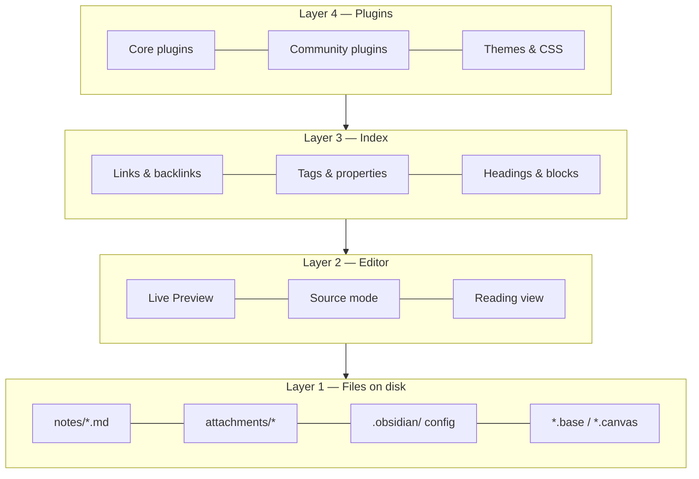

# Philosophy and Mental Model

Most people who "fail" with Obsidian do not fail because of a missing feature. They fail because they carry a mental model from another tool — Notion's databases, Evernote's notebooks, Apple Notes' folders — and fight Obsidian instead of using it. This chapter installs the correct mental model. Everything later in the guide builds on it.

## What Obsidian actually is

Strip away the marketing and Obsidian is four things stacked on top of each other:

1. **A folder of plain-text files on your disk.** The vault is a directory. Every note is a `.md` file. Attachments are ordinary files. Configuration is JSON in a hidden `.obsidian/` folder. Nothing is stored in a proprietary database. You can open the folder in Finder or Explorer, `grep` it, back it up with any tool, or point another editor at it.
2. **A Markdown editor with a live-rendering mode.** It is a good editor — multi-cursor, Vim mode, folding, a formatting menu, tables, callouts — but it is still fundamentally editing text.
3. **A link-and-metadata index.** Obsidian scans your vault and builds an in-memory index of links, backlinks, tags, properties, headings and blocks. The graph view, backlinks pane, Bases, and every query plugin read from this index.
4. **A plugin platform.** Core plugins (shipped with the app, toggleable) and community plugins (open-source, installed from a directory) extend all three layers above. The app itself is Electron on desktop and Capacitor on mobile, and plugins are JavaScript with full access to the vault and the UI.



The reason this matters: **the file layer is the truth**. Everything above it is a view. If Obsidian disappeared tomorrow you would lose nothing but convenience. This is the "file over app" principle that Obsidian's CEO Steph Ango has written about, and it has practical consequences throughout this guide: prefer formats and conventions that survive without Obsidian, and treat plugins as accelerators, not as the place where your data lives.

## The five primitives

Everything you will ever build in Obsidian is a combination of five primitives. Learn to see them.

### 1. Notes (files)

A note is a file. Its **title is its filename**. This is more consequential than it sounds:

- Filenames cannot contain `/ \ : * ? " < > |` and Obsidian also forbids `#`, `^`, `[`, `]` and `|` in note names because they conflict with link syntax.
- Renaming a note is a filesystem rename, and Obsidian rewrites every link that points to it (if the setting is on — keep it on).
- Two notes cannot share a name in the same folder, but *can* share a name in different folders — which makes `[[Name]]` links ambiguous. Avoid this.
- Because the title is the filename, "what should I call this note?" is a real design decision. The methodology chapter covers naming conventions in depth.

A note optionally has **properties** (YAML frontmatter), a body of Markdown, and any number of headings and blocks that can be addressed individually.

### 2. Links

A link is a pointer from one note to another: `[[Target]]`, `[[Target#Heading]]`, `[[Target#^blockid]]`, or `[[Target|Shown text]]`. Links are the connective tissue of a vault and the thing Obsidian does better than any competitor. Key properties:

- **Links are bidirectional in the index.** Write `[[Berlin]]` in your travel note and the Berlin note's backlinks pane now shows the travel note — with no action on your part.
- **Links can point to notes that don't exist yet.** They render dimmer and become real the moment you click them. This lets you link *first* and write *later*, which is the core of "bottom-up" knowledge building.
- **Unlinked mentions** surface places where a note's name appears as plain text, offering one-click linking.
- **Embeds** are links with a `!` prefix: `![[Target]]` shows the target's content inline. You can embed notes, headings, blocks, images, PDFs (with page numbers), audio, video, canvases, and bases.

### 3. Tags

`#tag` and `#nested/tag`, in the body or in the `tags` property. Tags are lightweight, cross-cutting labels. They are cheap to add and cheap to query. They are also the most over-used primitive by beginners; Chapter 5 gives a decision framework for tags vs properties vs links vs folders.

### 4. Properties (metadata)

Structured `key: value` data at the top of a note in YAML. Since Obsidian 1.4 they have typed UI (text, list, number, checkbox, date, datetime), and since 1.9 they are the fuel for Bases. Properties turn a pile of notes into a *database* without leaving plain text. A note with:

```yaml
---
type: book
author: "[[Cal Newport]]"
status: reading
rating: 4
started: 2026-08-14
tags: [productivity, focus]
---
```

…is simultaneously a readable page and a row in any table you care to build.

### 5. Folders

Folders are the physical location of a file. They are the primitive people over-invest in first and regret later, because a note can live in only one folder while it can have unlimited links, tags, and properties. Folders still matter — for attachment routing, for templates that auto-apply per folder, for Bases filters like `file.inFolder("Projects")`, and for keeping the file explorer sane — but they should be *few and stable*.

## The three ways to organize, and why you need all of them

There are three fundamentally different organizing strategies, and mature vaults use all three deliberately:

| Strategy | Primitive | Strengths | Weaknesses | Use it for |
| --- | --- | --- | --- | --- |
| **Hierarchy** | Folders | Familiar, physical, works with any tool, supports per-folder automation | One location per note; deep trees rot; encourages filing over thinking | A small number of top-level "kinds of thing" (e.g. `Notes`, `Journal`, `Projects`, `Sources`, `Templates`, `Attachments`) |
| **Network** | Links, MOCs | Emergent structure; supports multiple contexts; serendipity via backlinks | Needs active tending; can become an undifferentiated hairball | Ideas, concepts, people, projects — anything with relationships |
| **Attributes** | Tags, properties | Precise filtering and sorting; enables dashboards; machine-readable | Requires discipline and a schema; meaningless without queries | Status, type, dates, ratings, categories — anything you want to *query* |

The single most useful habit is to ask, for each note, "which of these strategies does this note need?" A meeting note needs attributes (date, attendees, project) and links (to the people and the project) but no special folder. A permanent idea note needs links above all. A recipe needs attributes (cuisine, time, servings) and belongs to one obvious folder.

## Bottom-up vs top-down

Two schools argue about how to build a vault.

**Top-down** designs the structure first: folders, templates, property schemas, MOCs, dashboards. Then notes are filed into it. This is how most productivity content online approaches Obsidian and it produces beautiful screenshots. Its failure mode is a cathedral with no congregation — an elaborate system you stop using after three weeks because maintaining it is a job.

**Bottom-up** writes notes first, links freely, and lets structure emerge. When a cluster of notes becomes noticeable, you create a Map of Content (MOC) to index it. When a pattern of properties recurs, you formalize a template. This is the Zettelkasten / LYT lineage. Its failure mode is a swamp — thousands of notes with no way in.

The guide's position: **structure the containers top-down, let the content grow bottom-up.** Decide your folder skeleton, your note types, your property schema, and your naming conventions up front (Chapter 8 gives you a complete one). Then within that skeleton, write and link without asking permission from your system. Create MOCs and dashboards only when the volume of notes demands them.

## Two modes of use: retrieval and thinking

Obsidian serves two very different jobs and you should know which one you are doing at any moment.

**Retrieval** is "where did I put that?" — the Wi-Fi password, the recipe, the meeting decision, the article you clipped. Retrieval wants *predictability*: consistent names, consistent properties, consistent locations, good search. Bases, properties, folders, and search are the tools. Over-linking retrieval notes wastes time.

**Thinking** is "what do I believe about this?" — ideas, arguments, decisions, syntheses. Thinking wants *connection*: links to related ideas, backlinks that surface forgotten context, writing in your own words, revisiting. Links, MOCs, the local graph, and daily notes are the tools. Over-structuring thinking notes kills them.

A "whole life" vault contains both, and one of the reasons it is worth putting *everything* in Obsidian is that the boundary is porous: a retrieval note (a book you read) becomes a thinking note (what you took from it), and thinking notes feed action (a project). Keeping them in one place with one link syntax is the actual killer feature.

## What Obsidian is bad at (and what to do about it)

Honesty about limits saves months.

- **Real-time collaboration.** Two people editing the same note simultaneously is not a thing. Obsidian Sync supports multiple users on one vault, but with last-writer-wins at the file level (with version history to recover). For team wikis and shared docs, use something else and link to it.
- **Relational data with joins.** Bases and Dataview are excellent for single-table views over notes. Multi-table relational queries are possible (DataviewJS) but awkward. If you need a real database — an inventory with thousands of SKUs, accounting — use one, and keep the *narrative* in Obsidian.
- **Heavy attachments.** Obsidian stores files fine, but a vault with 50 GB of video syncs badly and indexes slowly. Keep large media outside the vault and link to it, or in a separate vault.
- **Rich text fidelity.** Markdown cannot represent every formatting nuance of a Word document. If you need pixel-perfect documents, write in Obsidian and export via Pandoc.
- **Structured forms and input validation.** Plugins like Meta Bind get you far, but there is no native form builder.
- **Mobile power features.** Mobile Obsidian is remarkably complete, but plugins with heavy UI, huge vaults, and Git-based sync are painful on phones. Design mobile workflows for *capture and reading*, not administration.
- **Being a calendar or email client.** It can display calendars (plugins) and you can email into it (automation), but it should not replace them.

## Principles that survive every chapter

These come up again and again. Internalizing them now makes the rest of the guide faster.

!!! tip "1. Plain text is the API"
    Any feature that stores its data as human-readable text in your notes (properties, tasks, inline fields, callouts) is durable and portable. Any feature that stores data in `.obsidian/plugins/*/data.json` is convenient but fragile. Prefer the former for anything you would grieve losing.

!!! tip "2. Titles are links"
    Because the filename is both the title and the link target, name notes the way you would *refer to them in a sentence*. `[[Cal Newport]]` reads naturally; `[[newport_cal_author]]` does not. Aliases handle synonyms.

!!! tip "3. Friction goes at the exit, not the entrance"
    Capturing must be near-zero-friction (hotkey, template, mobile share sheet). Processing — deciding where a note lives, what it links to — can be batched later in a review. Systems that demand perfect filing at capture time die.

!!! tip "4. Query, don't file"
    If you find yourself maintaining a list by hand — "all open projects", "books to read", "recent meetings" — stop. That list should be a Base or a Dataview query driven by properties. Hand-maintained lists are always out of date.

!!! tip "5. One vault unless you have a reason"
    Links do not cross vaults. Search does not cross vaults. Every split costs you connections. Legitimate reasons to split: legal separation (work confidentiality), radically different sync requirements, or a vault that is really a project (a book manuscript, a shared family vault). "It feels cleaner" is not a reason.

!!! tip "6. Plugins are power tools — count them"
    Every plugin is code running with full access to your files, load time on mobile, and a maintenance dependency. A healthy vault has 10–25 community plugins that you can each name the purpose of. Chapter 14 gives tiers; Chapter 32 gives an audit routine.

!!! tip "7. Build for the tired version of you"
    You will use the vault at 11 pm, on a phone, after a bad day. Templates, hotkeys, and dashboards exist so the system works when your willpower does not.

## The four layers of mastery

It helps to know where you are and what comes next. Most users plateau at layer 2.

| Layer | You can… | Typical signs | This guide's chapters |
| --- | --- | --- | --- |
| **1. Editor** | Write Markdown, make links, use folders, search | Vault looks like a fancier Apple Notes | 2, 3, 4 |
| **2. Networker** | Use backlinks deliberately, MOCs, daily notes, tags, a few plugins | Graph view has recognizable clusters | 5, 6, 7, 9 |
| **3. Systems builder** | Design property schemas, templates, Bases/Dataview dashboards, task system, reviews | You *query* your vault; you rarely make lists by hand | 8, 10–13, 15–25 |
| **4. Operator** | Automate with CLI/URI/scripts, integrate external apps and AI, customize the UI, write small plugins, maintain and migrate at scale | The vault is your life's control panel and it runs itself | 26–34 |

The [Mastery Roadmap](35-mastery-roadmap.md) turns this into a schedule.

## Key takeaways

- Obsidian is a folder of text files plus an index plus plugins. The files are the truth; everything else is a view.
- Five primitives — notes, links, tags, properties, folders — combine into every system you will build. Learn to see them.
- Use hierarchy for containers, network for ideas, attributes for anything you will query. Mature vaults use all three deliberately.
- Structure containers top-down; let content grow bottom-up.
- Know whether a note is for *retrieval* or *thinking* and organize accordingly.
- Prefer plain-text-stored features, query instead of filing, keep one vault, count your plugins, and design for your tired self.

## Next

[Chapter 2: Setup, Settings and Interface →](02-setup-and-interface.md)
