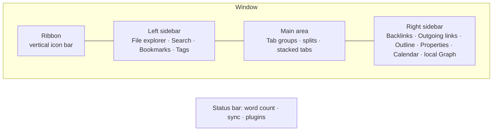

# Setup, Settings and Interface

A vault configured thoughtfully in the first hour saves hundreds of small frustrations later. This chapter is a complete audit: every setting that materially affects how you work, what to set it to and why, plus the interface anatomy and keyboard-first habits that separate fluent users from clickers.

## Installation and installer versions

Obsidian has two version numbers and confusing them causes real problems.

- **App version** (e.g. 1.13.4) — the JavaScript application. Updates automatically in-app on desktop; via the store on mobile.
- **Installer version** — the Electron shell (Chromium + Node) the app runs in. It only updates when you **download and reinstall from obsidian.md**. Check it under **Settings → General → About** ("Installer version").

!!! warning "Reinstall the installer at least once a year"
    Features like the Obsidian CLI require installer 1.12.7+, Bases performance improved with newer Electron builds, and several rendering bugs are installer-level. Reinstalling does not touch your vault. On Windows use the same edition (system vs. per-user) you originally installed to avoid two copies.

| Platform | Recommended install | Notes |
| --- | --- | --- |
| Windows | Official installer from obsidian.md | winget (`winget install Obsidian.Obsidian`) also works and tracks installer versions. |
| macOS | Official DMG or `brew install --cask obsidian` | Universal build; Apple Silicon native. |
| Linux | AppImage (most portable), Flatpak, Snap, or `.deb` | Flatpak and Snap sandbox file access; the CLI and some sync tools work best with AppImage or `.deb`. If using Flatpak, grant filesystem access with Flatseal to your vault folder. |
| iOS/iPadOS | App Store | Vault location: "On My iPhone/Obsidian" (local) or iCloud Drive. See [Sync](26-sync-backup-security.md). |
| Android | Play Store, F-Droid, or GitHub APK | Grant "All files access" for vaults outside app storage. |

## Where to put the vault

Decide this once. Moving later is possible but annoying.

- **Local disk, non-synced folder** — fastest, safest for plugins, zero conflicts. Use if you sync with Obsidian Sync, Git, or Remotely Save (they handle sync themselves).
- **iCloud Drive / OneDrive / Dropbox / Google Drive folder** — works on desktop; on mobile only iCloud is natively supported by Obsidian (iOS). Risks: "files on demand" placeholders (OneDrive) break indexing; conflicts create duplicate files; `.obsidian/` config churn triggers constant re-upload. If you must, exclude nothing and turn off "files on demand" for the vault folder.
- **Syncthing folder** — excellent on desktop and Android; not available on iOS.
- **Network drive / NAS** — avoid. Latency makes the editor sluggish and file watchers unreliable. Obsidian 1.13 warns when loading HTML resources from network paths for the same reason.

Chapter 26 has the full sync matrix.

## Vault-level decisions before you write

1. **One vault or several?** One, unless you have a hard reason (Chapter 1, principle 5). You *can* keep a scratch vault for experimenting with plugins.
2. **Attachment folder.** Set **Settings → Files and links → Default location for new attachments** to *In the folder specified below* → `Attachments` (or `_attachments`, `zz-attachments` to sort last). Never leave it as "vault root" or "same folder as current file" unless you like clutter.
3. **Link format.** *Wikilinks* (`[[Note]]`) are the Obsidian default, faster to type, and every plugin understands them. *Markdown links* (`[Note](Note.md)`) are more portable to other tools and required by some publishing pipelines. For the path style, **Shortest path when possible** produces clean `[[Note]]` links but is only safe if you keep filenames unique across the vault; **Absolute path in vault** produces `[[Folder/Note]]` and is unambiguous but noisier; **Relative path to file** breaks when notes move. Recommendation for a whole-life vault: Wikilinks on, unique filenames enforced by convention, shortest path.
4. **New note location.** *Same folder as current file* is the least surprising once you have a folder skeleton; combined with an `Inbox` folder as your default landing zone for quick capture.
5. **Naming convention.** Decide capitalisation (Title Case vs sentence case) and whether dates are `YYYY-MM-DD`. Decide now; consistency matters more than the choice.

## The complete settings audit

Settings are searchable since 1.13 (++ctrl+comma++ then type). Below, every setting that matters, grouped as Obsidian groups them. Defaults are fine where a setting is not listed.

### General

| Setting | Recommended | Why |
| --- | --- | --- |
| Automatic updates | On | Security and Bases/CLI improvements ship often. |
| Command line interface | On (desktop) | Enables `obsidian` CLI — see Chapter 29. Follow the prompt to register PATH. |
| Language | Your choice | Affects UI only, not your notes. |

### Editor

| Setting | Recommended | Why |
| --- | --- | --- |
| Default editing mode | Live Preview | WYSIWYG-ish while still Markdown. Switch to Source with ++ctrl+e++ (toggle) when you need to see raw syntax. |
| Default view for new tabs | Editing view | Reading view is for consumption; you are mostly writing. |
| Show line numbers | Off (on for code-heavy notes via `cssclasses`) | Noise for prose. |
| Readable line length | On | ~700px measure; disable per note with a CSS class if you need wide tables. |
| Strict line breaks | Off | With off, a single newline renders as a line break (like most note apps). With on, you need two spaces or a blank line — stricter CommonMark. Off is friendlier; on is more portable. Pick and never change (it changes how existing notes render). |
| Properties in document | Visible | Shows the typed property editor. "Source" shows raw YAML; "Hidden" hides it. |
| Show indentation guides | On | Helps with nested lists and tasks. |
| Fold heading / Fold indent | On | You will use folding constantly in long notes. |
| Spellcheck | On; add languages | Right-click → Add to dictionary for your jargon. |
| Auto pair brackets / Markdown syntax | On | Typing `[[` yields `[[]]`. |
| Smart indent lists | On | Tab/Shift-Tab indent list items. |
| Vim key bindings | Off unless you are a Vim user | If you are, it is remarkably complete (see Chapter 3). |
| Auto convert HTML | On | Pasting from the web becomes Markdown. |
| Indent using tabs / Tab size | Spaces, 4 (or tabs) | Some plugins (Tasks, Dataview) were historically picky about mixed indentation. Consistency is what matters. |

### Files and links

| Setting | Recommended | Why |
| --- | --- | --- |
| Confirm file deletion | On | Your trash is one accidental ++del++ away. |
| Deleted files | Move to Obsidian trash (`.trash` folder) | Recoverable within the vault; system trash is the alternative. Chapter 32 covers File Recovery. |
| Always update internal links | On | The reason renaming is safe. |
| Automatically delete attachments | Ask every time (1.12+) | When you delete a note, Obsidian offers to delete attachments only that note used. |
| Default location for new notes | Same folder as current file, *or* a fixed `Inbox` | See above. |
| New link format | Shortest path when possible (unique names) | See above. |
| Use Wikilinks | On | Toggle off only for portability requirements. |
| Detect all file extensions | Off (on temporarily to find stray files) | Otherwise your explorer shows `.DS_Store` and friends. |
| Default location for new attachments | In the folder specified below → `Attachments` | See above. |
| Excluded files | Add `Templates/`, `Attachments/`, `Archive/` if noisy | Excluded files are dimmed in search/suggestions/graph but still linkable and still indexed. Use it liberally for templates so `[[` suggestions are not polluted. |

### Appearance

| Setting | Recommended | Why |
| --- | --- | --- |
| Base color scheme | Adapt to system | Toggle command exists (1.10 replaced the separate light/dark commands with a single **Toggle light/dark mode**). |
| Accent color | Your call | Also used by links and selection. |
| Font size | 16 (desktop) | Zoom with ++ctrl+plus++ / ++ctrl+minus++ as needed. |
| Interface / text / monospace font | System UI; a good reading font (e.g. Inter, iA Writer Duo, Source Serif); JetBrains Mono / Fira Code | Fonts must be installed on each device. |
| Quick font size adjustment | On | ++ctrl++ + scroll. |
| Show inline title | On | The filename rendered as an H1 at the top; means you do not put `# Title` in the body. |
| Show tab title bar | On (desktop) | Off saves vertical space, but you lose the breadcrumb. |
| Ribbon | Reorder / hide items you never click | Right-click the ribbon → Configure. |
| Native menus (macOS) | Off | Obsidian's own menus are more consistent across platforms. |
| Window frame | Hidden (native title bar off) | Less chrome. |
| Zoom level | 100% | |
| Themes / CSS snippets | See Chapter 28 | |

### Hotkeys

Chapter 37 has the complete default list. The philosophy: leave defaults alone unless they conflict, and add hotkeys for the ~15 commands you use hourly. Non-negotiable additions for most people:

| Command | Suggested hotkey | Reason |
| --- | --- | --- |
| Toggle left / right sidebar | ++ctrl+alt+left++ / ++ctrl+alt+right++ (or click) | Focus mode on demand. |
| Open today's daily note | ++ctrl+shift+d++ | Your home base. |
| Insert template | ++alt+t++ | Constantly used until Templater takes over. |
| Toggle reading view | ++ctrl+e++ (default) | |
| Focus on last note / Focus on tab group | | Useful with split panes. |
| Move current file to another folder | ++ctrl+shift+m++ | Processing your inbox. |
| Add file property | ++ctrl+semicolon++ | Metadata without leaving the keyboard. |
| Toggle bullet / checkbox | ++ctrl+l++ (default toggles checkbox) | |
| Navigate back / forward | ++alt+left++ / ++alt+right++ | Web-browser habits. |
| Search in all files | ++ctrl+shift+f++ | |
| Open command palette | ++ctrl+p++ | |
| Open quick switcher | ++ctrl+o++ | |
| Toggle Bases view / Open Bases | | Once you build dashboards. |

!!! tip "Hotkeys are stored in `.obsidian/hotkeys.json`"
    Sync that file (Obsidian Sync can sync hotkeys; Git syncs everything) so your muscle memory survives device changes.

### Core plugins

Turn on: File explorer, Search, Quick switcher, Graph view, Backlinks, Outgoing links, Canvas, Daily notes, Templates, Note composer, Command palette, Bookmarks, Outline, Word count, File recovery, Page preview, Properties view, Tags view, Bases, Slash commands (optional), Unique note creator (if you use Zettelkasten IDs), Workspaces (once you have layouts), Web viewer (if you want in-app browsing), Random note (for serendipitous review), Importer (when migrating), Footnotes view (if you write academically), Sync/Publish (if subscribed), Slides (rarely). Chapter 9 details each.

### Community plugins

Turn off **Restricted mode**. Since 1.13 you can exit Restricted mode *without* re-enabling plugins, which is useful for debugging. Install nothing yet; Chapter 14 curates. The **Check for updates** button is in this tab — do it weekly.

### Sync / Publish

See Chapters 26 and 31. Notable 1.13 behaviour: Sync warns before syncing plugins between devices (because plugin data can be device-specific), and the status-bar icon no longer spins to save battery.

## Interface anatomy

**Ribbon.** Vertical strip of icons on the far left. Every core and community plugin can add one. Right-click → hide the ones you never click; the actions remain in the command palette.

**Sidebars.** Both hold *tabs of views*. Drag any view between sidebars or into the main area (a Backlinks view in the main area is a legitimate way to review connections). Collapse with the small arrows or hotkeys. Pin a sidebar tab to keep it visible.

**Main area.** Tabs, like a browser. Split any tab horizontally/vertically (right-click the tab → Split, or drag it to an edge). A *tab group* is a set of tabs sharing a pane. **Stacked tabs** (right-click tab header → Stack tabs) turns a group into Andy Matuschak-style sliding cards — outstanding for research where you open six notes from one MOC.

**Status bar.** Bottom right: word/character count, backlink count, sync status, plugin indicators. Click items for menus. Hide with CSS if you prefer minimal.

**Tab title bar / inline title.** The breadcrumb (folder › note) and the note's H1-like title. Click the breadcrumb to navigate the folder; click the inline title to rename.

**Settings window.** Since 1.13 opens in a separate window with search and keyboard navigation (arrows to move, ++enter++ to open, ++ctrl+f++ to focus search). Disable "Open settings in new window" under Interface if you prefer the modal.

**Pop-out windows.** Drag a tab out of the app to make it a standalone window (desktop). Useful for a reference note on a second monitor.

## Navigation you should do from the keyboard

The fluent-user baseline. Everything else is optional; these are not.

- **Command palette** ++ctrl+p++ — type any command. Pin favourites (Settings → Command palette) to the top. Also try `>` prefix in Quick switcher.
- **Quick switcher** ++ctrl+o++ — fuzzy-find by filename. Type a new name and ++enter++ to create. ++shift+enter++ creates even if a fuzzy match exists. ++ctrl+enter++ opens in a new tab. Since 1.12 results can be dragged.
- **Search** ++ctrl+shift+f++ — full-text with operators (Chapter 6). ++ctrl+f++ searches within the current note.
- **Follow link under cursor** ++alt+enter++ (or ++ctrl+enter++ to open in a new tab). Hover with ++ctrl++ for a page preview.
- **Back / forward** ++alt+left++ / ++alt+right++ (++cmd+bracket-left++ / ++cmd+bracket-right++ on mac).
- **Go to next/previous tab** ++ctrl+tab++ / ++ctrl+shift+tab++; go to tab N ++ctrl+1++ … ++ctrl+9++.
- **Close tab** ++ctrl+w++; **reopen closed tab** ++ctrl+shift+t++.
- **Toggle sidebars** — assign hotkeys.
- **Reveal current file in navigation** — assign; essential in big trees.
- **Fold/unfold** ++ctrl+up++ / ++ctrl+down++ at heading; **Fold all / Unfold all** commands.
- **Focus on editor** ++esc++ from most panes.

## Workspaces and layouts

The **Workspaces** core plugin saves the entire layout (which panes, which files, which sidebar tabs) under a name and restores it in one command. Build three or four:

- **Writing** — single pane, sidebars collapsed, Outline in right sidebar.
- **Planning** — daily note left, task dashboard right, Calendar in sidebar.
- **Research** — stacked tabs in main, Backlinks + local Graph on the right.
- **Review** — weekly note, project Base, Habit tracker.

Save with *Workspaces: Save layout*, load with *Workspaces: Load layout*. The Obsidian CLI can load them (`obsidian workspace:load name=Planning`), which means a shell alias or a Raycast/Alfred/AutoHotkey script can put you in a mode instantly. Chapter 29 shows this.

!!! note "Workspaces + mobile"
    Mobile has its own layout; workspaces are per-device. The **Workspaces Plus** community plugin adds a switcher and per-workspace settings on desktop.

## Multiple vaults strategy (if you really need it)

- Vaults are completely isolated: separate plugins, settings, index. Cross-vault links use `obsidian://open?vault=Other&file=Note` URIs (they work but feel foreign).
- Share configuration between vaults with a symlink of `.obsidian/` subfolders (snippets, themes) — fragile with sync; do it only on a single machine.
- **Change vault…** (renamed *Manage vaults* in 1.12) lists vaults; the **Open vault…** command (1.12) opens another vault while keeping the current one open. The CLI accepts `vault=Name` as the first parameter.

## First-hour checklist

- [ ] Installer updated; app updated.
- [ ] Vault created in a sensible location; sync approach chosen (Chapter 26).
- [ ] Attachments folder set; excluded files set; link format decided.
- [ ] Editor: Live Preview, readable line length, folding, spellcheck, indentation guides.
- [ ] Appearance: theme (Chapter 28), inline title on, fonts.
- [ ] Core plugins enabled per list above; Restricted mode off.
- [ ] Hotkeys added for daily note, insert template, sidebars, move file, add property.
- [ ] Folder skeleton created (Chapter 8) with `Inbox`, `Templates`, `Attachments` at minimum.
- [ ] Templates folder set in **Templates** core plugin settings; Daily notes folder + format set.
- [ ] `.obsidian/` backed up (Chapter 26).

## Key takeaways

- App version and installer version are different; reinstall the installer periodically.
- Put the vault on a local disk unless your sync method requires a synced folder; avoid network drives.
- Decide attachments folder, link format, new-note location, and naming convention in the first hour.
- Learn the ten keyboard navigation commands; they are the difference between using Obsidian and living in it.
- Use Workspaces (and later the CLI) to switch between purpose-built layouts.

## Next

[Chapter 3: Markdown and Editing Mastery →](03-markdown-and-editing.md)
