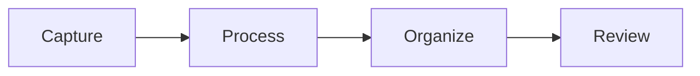
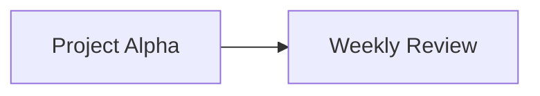

# Markdown and Editing Mastery

Obsidian speaks a specific dialect: CommonMark plus GitHub-Flavored Markdown extensions plus its own additions (wikilinks, embeds, callouts, block IDs, comments, highlights, properties). Knowing the entire dialect — including the odd corners — lets you write faster, produce notes that render the way you intend, and understand why a query or plugin behaves the way it does. This chapter is the complete reference plus the editing techniques that make writing in Obsidian genuinely fast.

## The three views

| View | Shortcut | What it shows | Use it for |
| --- | --- | --- | --- |
| **Live Preview** | default editing mode | Rendered Markdown that turns into raw syntax where your cursor is | 90% of writing |
| **Source mode** | toggle via command *Toggle Live Preview/Source mode* (assign a hotkey) | Raw text, syntax highlighted | Fixing tables, YAML, nested structures, stubborn formatting |
| **Reading view** | ++ctrl+e++ | Fully rendered, read-only; embeds, queries and Bases render fully | Reading, reviewing dashboards, copying rendered text |

!!! tip "Two-pane editing"
    Right-click a tab → *Open linked view* → *Open in reading view* gives you a side-by-side render that follows your scroll. Useful for complex tables and Mermaid.

In Reading view, if nothing is selected, ++ctrl+c++ copies the *full source* of the note (1.10+). Copying from the editor includes HTML formatting on the clipboard (1.12+) so pasting into Google Docs preserves headings and bold.

## Headings and structure

```markdown
# H1 — avoid in body if "Show inline title" is on (the filename is your H1)
## H2 — main sections
### H3 — subsections
#### H4 …up to ###### H6
```

- Headings are link targets: `[[Note#Heading]]`. Renaming a heading does **not** update links to it automatically unless you rename via the Outline pane or the right-click *Rename* on the heading, which does.
- Headings are foldable (Settings → Editor → Fold heading). ++ctrl+up++/++ctrl+down++ fold/unfold at cursor.
- The Outline pane and the *Go to heading* commands (community: Quiet Outline, or the core Outline view) navigate by heading.
- **Note composer** (core) can *extract* a heading's section into a new note and leave a link or embed behind. Since 1.13 it also rewrites links inside the extracted section to be relative to their new home.

## Paragraphs and line breaks

With **Strict line breaks off** (recommended), a single ++enter++ renders as a line break. With it on, you need two trailing spaces, a backslash `\`, or a blank line. Paragraphs are separated by a blank line either way. ++shift+enter++ inserts a hard break `<br>`-equivalent regardless of setting.

## Emphasis and inline formatting

| Syntax | Result | Notes |
| --- | --- | --- |
| `*italic*` or `_italic_` | *italic* | ++ctrl+i++ |
| `**bold**` or `__bold__` | **bold** | ++ctrl+b++ |
| `***bold italic***` | ***bold italic*** | |
| `~~strike~~` | ~~strike~~ | |
| `==highlight==` | ==highlight== | Obsidian-specific; searchable; styled per theme |
| `` `code` `` | `code` | Inline code; ++ctrl+`++ in some themes/plugins |
| `<u>underline</u>` | <u>underline</u> | No Markdown syntax; use HTML |
| `<sup>2</sup>` / `<sub>2</sub>` | superscript / subscript | HTML |
| `<kbd>Ctrl</kbd>` | keyboard key | HTML; themes style it |
| `<mark>text</mark>` | highlight | Alternative to `==` |
| `<span style="color:red">red</span>` | inline colour | Works but is not portable; prefer CSS classes |
| `%%hidden%%` | (nothing) | Obsidian **comment** — invisible in Reading view and Publish; visible in edit modes. Multi-line: `%%` on its own lines. Always exactly two `%`. |

The **formatting menu** (right-click or the mobile toolbar) offers all of these plus tables and lists for when you forget syntax.

## Lists

```markdown
- Unordered with hyphen (preferred), * or +
    - Nested with 4 spaces or a tab (be consistent — Settings → Editor → Indent using tabs)
1. Ordered
2. Numbers auto-renumber in Live Preview
   1. Nested ordered
- [ ] Task
- [x] Completed task
- [-] Cancelled (rendered by many themes; Tasks plugin treats as cancelled)
- [/] In progress (theme-dependent; see custom checkboxes below)
```

Editing power:

- ++tab++ / ++shift+tab++ indent/outdent list items (Smart indent lists on).
- ++alt+up++ / ++alt+down++ **move line up/down** — with a list item, moves the whole item (and its children with the *Outliner* plugin).
- ++ctrl+enter++ on a task toggles its checkbox; ++ctrl+l++ cycles bullet → checkbox → checked.
- ++enter++ on an empty list item ends the list.
- *Toggle bullet list*, *Toggle numbered list* commands convert selected paragraphs.
- The **Outliner** community plugin adds workflowy-style behaviours (drag-reorder, fold, select whole subtree); **Zoom** focuses on a single subtree.

**Custom checkbox statuses.** `- [?]`, `- [!]`, `- [>]`, `- [<]`, `- [i]`, `- [*]`, `- ["]`, `- [l]`, `- [b]`, `- [S]`, `- [I]`, `- [p]`, `- [c]`, `- [f]`, `- [k]`, `- [w]`, `- [u]`, `- [d]` are all just characters in brackets. Themes like Minimal and AnuPpuccin style many of them (question, important, forwarded, scheduled, info, star, quote, location, bookmark, savings, idea, pros, cons, fire, key, win, up, down). The Tasks plugin can map each to a status type (Todo / In Progress / Done / Cancelled / Non-task). The CLI's `tasks status="?"` filters by them.

## Tables

```markdown
| Column | Aligned right | Centered |
| --- | ---: | :---: |
| Cell | 12.50 | yes |
| Pipe in cell needs escaping \| like this | | |
```

- Live Preview has a table editor: click a cell to edit; ++tab++ moves right; ++enter++ moves down; right-click a cell for insert/delete row/column, align, move. The formatting menu → *Insert table* creates one.
- Inside a cell, `\|` is a literal pipe; `<br>` is a line break.
- Links inside tables work, including embeds (they render small).
- The **Advanced Tables** plugin adds spreadsheet-like formulas (`<!-- TBLFM: @>$3=sum(@I..@-1) -->`), auto-formatting, Excel-style navigation. Since core table editing improved, Advanced Tables is mainly for formulas and CSV import/export.
- Large data tables belong in Bases, not Markdown tables (Chapter 10). Markdown tables are for small, hand-written matrices.

## Blockquotes and callouts

```markdown
> Quote line
> — Attribution
```

**Callouts** are Obsidian's boxed, coloured, optionally collapsible blocks:

```markdown
> [!note] Optional title
> Body. Supports **Markdown**, [[links]], lists, code, nested callouts.

> [!tip]- Collapsed by default (minus sign)
> Hidden until clicked.

> [!warning]+ Expanded by default but collapsible (plus sign)
> Content.

> [!custom-type] Unknown types fall back to "note" styling and can be styled with CSS
```

Built-in types and aliases: `note`, `abstract`/`summary`/`tldr`, `info`, `todo`, `tip`/`hint`/`important`, `success`/`check`/`done`, `question`/`help`/`faq`, `warning`/`caution`/`attention`, `failure`/`fail`/`missing`, `danger`/`error`, `bug`, `example`, `quote`/`cite`.

Custom callouts via CSS snippet (note the **1.13 change**: `--callout-color` now takes a full CSS colour, not an RGB triplet):

```css
.callout[data-callout="decision"] {
  --callout-color: #7c3aed;
  --callout-icon: lucide-gavel;
}
```

Callouts are the right tool for: summaries at the top of long notes, decision records, warnings inside procedures, foldable "details" sections, and dashboard sections (embed a Dataview query inside a callout). Do not use them as your only structure — headings remain the navigable unit.

## Code

````markdown
Inline `code`.

```python
def hello():
    print("fenced code block with language for syntax highlighting")
```

~~~
Tildes also fence.
~~~
````

- Language identifiers follow Prism.js names: `js`, `ts`, `python`, `bash`/`sh`, `yaml`, `json`, `css`, `html`, `sql`, `rust`, `go`, `java`, `c`, `cpp`, `csharp`, `powershell`, `markdown`, `latex`, `mermaid`, `dataview`, `dataviewjs`, `tasks`, `base`, `query` (embedded search), `meta-bind`, `button`, etc. Plugins register their own.
- Code blocks show a **Copy** button on hover in Reading view.
- Indented code (4 spaces) also works but is fragile in lists.
- To show a triple-backtick block *inside* Markdown (like this guide does), fence the outer block with four backticks or tildes.
- Line numbers in code: not native; the *Code Styler* plugin adds numbering, titles, folding, and highlighting lines.

## Links, embeds and block references

Covered in depth in Chapter 4; the syntax summary:

```markdown
[[Note]]                      wikilink
[[Note|Display text]]         alias display
[[Note#Heading]]              heading link
[[Note#Heading#Subheading]]   nested heading path
[[Note#^blockid]]             block link
[[#Heading]]                  heading in the current note
[Display](Note.md)            markdown link (URL-encode spaces as %20)
[Display](<Note with spaces.md>)  angle brackets avoid encoding
[Display](https://example.com)    external link
<https://example.com>         autolink
![[Note]]                     embed whole note
![[Note#Heading]]             embed a section
![[Note#^blockid]]            embed a block
![[image.png]]                embed image
![[image.png|300]]            image width 300px
![[image.png|300x200]]        width x height
![[document.pdf#page=5]]      PDF at page 5
![[document.pdf#height=600]]  PDF viewer height
![[audio.mp3]]  ![[video.mp4]]  media players
![[Drawing.canvas]]           embed a canvas
![[Tracker.base]]             embed a base
![[Tracker.base#ViewName]]    embed a specific base view
   external image
   external image sized (1.13+, Reading view)
```

Block IDs: type `^` followed by an identifier at the end of any paragraph/list item/table/callout: `Some paragraph. ^my-id`. Obsidian generates random ones (`^a1b2c3`) when you type `[[Note#^` and choose a block. IDs must be letters, numbers and hyphens.

## Footnotes

```markdown
Claim that needs a source.[^1] Inline footnote.^[This is written inline.]

[^1]: The footnote text. Can be multiple paragraphs if indented.
```

Footnotes render as superscripts with hover preview and a list at the bottom of Reading view. The **Footnotes view** core plugin (2025) shows them in a sidebar. Named footnotes `[^smith2020]` are fine.

## Math

```markdown
Inline: $E = mc^2$

Block:
$$
\int_0^\infty e^{-x^2}\,dx = \frac{\sqrt{\pi}}{2}
$$
```

MathJax 3. Most LaTeX math works; `\begin{aligned}`, `\begin{cases}`, matrices, `\text{}`. Currency: `$5 and $10` can trigger math — write `\$5` or enable *Auto pair Markdown syntax* awareness; the **Latex Suite** plugin adds snippets and autocompletion for heavy users.

## Diagrams: Mermaid

````markdown

````

Supported: flowchart, sequenceDiagram, classDiagram, stateDiagram, erDiagram, gantt, pie, gitGraph, mindmap, timeline, quadrantChart, xychart-beta, sankey-beta, C4. Mermaid version 11.13 as of Obsidian 1.13. Obsidian 1.13 shows a one-time banner asking to confirm rendering Mermaid in a vault (a security measure). Internal links inside Mermaid nodes work via `click A "obsidian://open?file=Note"` with a URI, or with the `class A internal-link` trick:

````markdown

````

(The node text must equal the note name.)

## HTML

Obsidian renders a safe subset of inline HTML: `<div>`, `<span>`, `<br>`, `<details><summary>`, ``, `<iframe>` (with restrictions), `<table>`, `<kbd>`, `<sup>`, `<sub>`, `<u>`, `<center>` (deprecated but works), `<font>`, `<mark>`, `<abbr title="">`. Scripts are stripped. Markdown *inside* HTML blocks is not rendered unless the block is simple inline HTML on a single line.

`<iframe src="https://…">` embeds web pages (YouTube, maps, Google Docs). Obsidian 1.10 fixed YouTube "Error 153" embeds. The Web viewer core plugin is usually better for browsing.

## Escaping

Backslash escapes any Markdown character: `\*not italic\*`, `\[\[not a link\]\]`, `\#not-a-tag`, `\|`, `\$`. Inside code spans nothing needs escaping. To show `[[wikilink]]` literally in prose, use a code span or escape the first bracket.

## Properties (frontmatter) syntax essentials

Full treatment in Chapter 5. Syntax reminders that trip people:

```yaml
---
title: "Colons: need quotes if the value contains a colon"
aliases:
  - Alias One
  - Alias Two
tags: [one, two/nested]         # or a bulleted list; no leading #
date: 2026-09-06                # date type
created: 2026-09-06T14:30:00    # datetime type
rating: 4                       # number
done: false                     # checkbox
author: "[[Cal Newport]]"       # link — MUST be quoted
related:
  - "[[Note A]]"
  - "[[Note B]]"
url: https://example.com
description: >-
  Multi-line folded text
  continues here.
cssclasses: [wide, no-inline-title]
---
```

- Frontmatter must start on line 1 with `---` and end with `---`.
- Wikilinks in YAML must be quoted or YAML sees a list.
- Since 1.13, text and list properties render Markdown links.
- Duplicate values in list properties are allowed (1.10+).

## Editing techniques that compound

### Selection and multi-cursor

- ++alt++ + click adds a cursor. ++ctrl+d++ (in many setups) or the *Add next occurrence* command via CodeMirror… Obsidian's built-in: ++alt+click++ for extra cursors; ++ctrl+shift+l++ style "select all occurrences" is not native — use *Find and replace* (++ctrl+h++) or the **Multi-cursor** behaviours from plugins like *Code Editor Shortcuts* (adds duplicate line, select word, expand selection, join lines, transform case, etc.).
- ++shift+alt+up++ / ++down++ **duplicate line** — with Code Editor Shortcuts.
- ++ctrl+shift+k++ delete line (plugin) — native is *Delete paragraph*.
- Double-click selects a word; triple-click a paragraph.
- ++ctrl+a++ selects all; inside an embedded Base cell (1.13) it now selects the cell text.

### Find and replace

- ++ctrl+f++ in-note find with match highlighting; ++ctrl+h++ find & replace within the note; supports regex (toggle in the panel).
- Vault-wide search & replace: not native. Use the **Regex Find/Replace** plugin, or VS Code / `sed` on the vault folder (safe because files are plain text — close Obsidian or let it reindex).

### Moving and restructuring

- ++alt+up++/++alt+down++ move line. *Swap line up/down* commands.
- **Note composer**: *Extract current selection* (to a new note, leaving a link), *Merge entire file with…* (append/prepend another note and redirect links). Configure whether it leaves a link, an embed, or nothing.
- **Note Refactor** plugin: extract by heading in bulk, with templates for the new note.
- Drag headings in the **Outline** pane to reorder sections (Outline supports drag-and-drop reordering).
- Drag a file from the explorer into the editor to insert a link; hold ++alt++ (mac: ++shift++?) to insert an embed — behaviour is platform-dependent; alternatively type `![[`.
- Drag text out to another pane to move it.

### Paste behaviours

- Pasting HTML converts to Markdown (setting). ++ctrl+shift+v++ pastes as plain text.
- Pasting an image from the clipboard saves it to the attachments folder as `Pasted image YYYYMMDDHHMMSS.png` and inserts an embed. Rename immediately (right-click → Rename) or use the **Paste image rename** or **Attachment Management** plugins to auto-name by note title.
- Pasting a URL onto selected text makes a Markdown link (with the *Paste URL into selection* plugin; native as of recent versions when text is selected).
- Since 1.13, dragging a folder into the app imports it preserving structure.

### Images

- Resize in Live Preview by dragging the corner (1.12); double-click the corner to reset.
- Select an image with keyboard (1.13); ++plus++/++minus++ resize, ++0++ reset, ++enter++ edit, ++tab++ edit size, ++del++ removes.
- Click or the Zoom button opens the **full-screen viewer** (1.13), navigable between all images in the note; drag to pan; swipe down to dismiss on mobile.
- Right-click → *Copy image* (1.12).
- `![[image.png|200]]` sizes by width. Alignment: not native — use `cssclasses` or the *Image Converter* plugin.

### Slash commands and autocompletion

- The **Slash commands** core plugin: type `/` at line start to search commands inline. Set a trigger character you rarely type.
- `[[` autocompletes notes and aliases; `[[Note#` headings; `[[Note#^` blocks; `#` tags; `[!` callout types; `:emoji:` with the *Emoji Shortcodes* plugin; property names when editing YAML.
- **Various Complements** adds word/phrase autocompletion from your vault and custom dictionaries.
- **Templater** commands run on trigger (Chapter 11).

### Vim mode

Turn on in Settings → Editor. Coverage: normal/insert/visual/visual-line, `:` Ex commands (`:w`, `:noh`, `:s`, `:%s`, `:image grow|shrink|reset` in 1.13 for images with counts), motions, text objects, registers, marks, `.` repeat, search `/`, macros. Missing: some plugins' UI ignore Vim; folding commands differ. The **Vimrc Support** plugin loads a `.obsidian.vimrc` with mappings (`imap jk <Esc>`), `exmap` for Obsidian commands (`exmap back obcommand app:go-back`), and `unmap`. Vim + Obsidian is a legitimate power setup for people who already think in Vim; everyone else should skip it.

### Focus and typewriter modes

- **Toggle sidebars** for focus.
- Community: *Typewriter Scroll* (keeps the cursor line centred, dims other paragraphs), *Focus Mode*, *Stille*.
- *Readable line length* off + zoom for presentation-style reading.

### Word count and reading time

Status bar word count (core Word count plugin) counts the selection when text is selected. *Better Word Count* adds character/sentence/page counts and per-folder totals; *Novel Word Count* shows counts in the file explorer.

## Rendering gotchas worth knowing

- A line starting with `#` followed by a space is a heading; without a space it is a tag. `#1` is not a tag (tags cannot be all-numeric); `#2026-goals` is fine.
- `*` at the start of a line starts a list; to start a paragraph with an asterisk, escape it.
- Numbered lists that start with a number other than 1 render starting from that number.
- Four spaces of indentation on a non-list line creates a code block. This bites when pasting.
- Two callouts in a row need a blank line between them or they merge.
- An embed inside a list item renders with the list indentation (fixed in 1.13).
- `%%%%` is *not* a special comment — comments are exactly two `%` (clarified in 1.13).
- Trailing `\` at end of line forces a line break (CommonMark).
- HTML comments `<!-- -->` are hidden in Reading view but *do* get published/exported; `%% %%` comments do not.

## Key takeaways

- Live Preview for writing, Source for surgery, Reading for consumption; learn the toggles.
- Callouts, block IDs, embeds with sizes, footnotes, math and Mermaid are all part of the core dialect — no plugin needed.
- Keep frontmatter YAML valid: quote wikilinks and colon-containing values.
- Invest in list-manipulation hotkeys, multi-cursor, Note composer, and paste behaviours; those are where minutes per day are saved.
- Know the rendering gotchas so notes render as intended in Obsidian, on Publish, and in other tools.

## Next

[Chapter 4: Links, Backlinks, Graph and Canvas →](04-links-and-graph.md)
