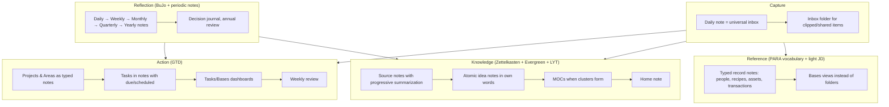

# PKM Methodologies Compared

Every popular knowledge-management method — Zettelkasten, PARA, LYT, GTD, Johnny.Decimal, Building a Second Brain — was designed for a specific problem and a specific kind of person. Adopting one wholesale usually means adopting its blind spots too. This chapter explains each method faithfully, shows exactly how it maps onto Obsidian primitives, states what it is good and bad at, and then assembles a hybrid that works for someone who wants to run *all* of life in one vault. Chapter 8 turns that hybrid into a concrete folder tree and templates.

## The problems the methods solve

Before the methods, the problems. Any system for a whole life must handle five distinct jobs:

1. **Capture** — get things out of your head and off the web with minimal friction.
2. **Action** — track commitments (tasks, projects, goals) and surface the right ones at the right time.
3. **Reference** — store and retrieve facts, documents, and records.
4. **Knowledge** — develop understanding: read, connect, write, revisit.
5. **Reflection** — journal, review, and course-correct.

| Method | Capture | Action | Reference | Knowledge | Reflection |
| --- | :-: | :-: | :-: | :-: | :-: |
| Zettelkasten | ○ | – | – | ●●● | ○ |
| Evergreen notes | ○ | – | – | ●●● | ○ |
| LYT / MOCs | ○ | ○ | ● | ●●● | ○ |
| PARA | ● | ●● | ●●● | ○ | ○ |
| CODE / Second Brain | ●●● | ● | ●● | ●● | ○ |
| GTD | ●●● | ●●● | ● | – | ●● |
| Johnny.Decimal | – | – | ●●● | – | – |
| Bullet Journal / Daily notes | ●● | ●● | – | ○ | ●●● |
| Periodic reviews (weekly/quarterly/annual) | – | ●● | – | ○ | ●●● |

No single method covers the row. That is the argument for a hybrid.

## Zettelkasten

**Origin.** Niklas Luhmann's slip-box: ~90,000 index cards, each one idea, each numbered so that it could be placed *next to* related cards (branching IDs like `21/3a7`), each linking to others by number. Popularized for digital use by Sönke Ahrens' *How to Take Smart Notes*.

**Core rules.**

- **Atomicity**: one idea per note, so it can be linked from many contexts.
- **Own words**: rewrite, never copy — the rewriting *is* the thinking.
- **Link with reasons**: every link says *why* it connects ("contradicts", "generalizes", "example of").
- **Note types**: *fleeting* (scratch, discard within days), *literature* (what a source says, with page refs), *permanent* (your ideas, written for your future self), plus *structure/hub notes* (entry points).
- **No categories up front**: structure emerges from links.

**In Obsidian.** Permanent notes live in one flat folder (`Notes/`), titled as *claims* rather than topics (`Attention is the scarce resource, not time` rather than `Attention`). Links carry context in the sentence around them. Fleeting notes go to daily notes or `Inbox/`. Literature notes live with their source. Structure notes are MOCs. Unique IDs (`202609061430`) via the **Unique note creator** core plugin are *optional* — Obsidian resolves links by title, so IDs mainly help when titles change often or when you want chronology in the filename. Most Obsidian users drop the numeric IDs and keep the rest.

**Strengths.** Unmatched for generating original thinking over years; scales because atomic notes stay relevant; forces understanding.

**Weaknesses.** Useless for tasks, records, and admin. Overhead is real — proper permanent notes take 10–30 minutes each. Purists' insistence on IDs and folder-less-ness confuses newcomers. Many people build a Zettelkasten and never *use* it because there is no output driving the input.

**Verdict.** Adopt the *note-making discipline* (atomic, own words, linked with reasons, claim-titles) for the knowledge job. Ignore the rest.

## Evergreen notes (Andy Matuschak)

A modern restatement of Zettelkasten principles for digital tools: notes should be *atomic*, *concept-oriented* (about concepts, not sources or projects), *densely linked*, and *evergreen* — revised over time rather than written once. Matuschak adds "prefer associative ontologies to hierarchical taxonomies" and "write notes for yourself by default, disregarding audience". He also popularized the *stacked panes* reading interface that Obsidian's Stack tabs reproduces.

**In Obsidian.** Same as Zettelkasten in practice. The practical addition is a `status` property on idea notes — `seedling` → `budding` → `evergreen` — which lets a Base show you which ideas to develop next. Stack tabs for exploration.

**Verdict.** The best short articulation of *how to write* notes that stay valuable. Read Matuschak's public notes on the subject once; they are the manual.

## LYT — Linking Your Thinking (Nick Milo)

**Core idea.** Networks of notes need *navigational* structures that are not folders: **Maps of Content (MOCs)** — notes that curate links to other notes, with commentary, in a deliberate order. MOCs are created *when the pressure of related notes demands it* ("mental squeeze point"), not in advance. A **Home note** sits at the top; MOCs link down to notes and up to Home; notes link laterally. The **ACCESS** folder scheme (Atlas, Calendar, Cards, Extras, Sources, Spaces) is Milo's suggested skeleton: *Atlas* for maps, *Calendar* for time-based notes, *Cards* for ideas, *Extras* for templates and attachments, *Sources* for external material, *Spaces* for areas/projects/efforts. LYT also emphasizes "fluid frameworks" — structure that can be reorganized cheaply because it is made of links.

**In Obsidian.** MOCs are ordinary notes with `type: moc`. A `Home.md` with links to top-level MOCs (and, in a modern vault, embedded Bases for tasks and projects). The local graph and backlinks find MOC candidates. Nothing is prescribed about properties or tasks.

**Strengths.** The single most useful structural idea for an Obsidian vault after links themselves. MOCs make big vaults navigable without deep folders. ACCESS is a sane, shallow folder skeleton.

**Weaknesses.** Thin on action management and records; MOCs need periodic gardening or they rot; "fluid" can become "never decided".

**Verdict.** Adopt MOCs completely. Use ACCESS or a close variant as the top-level folder skeleton (Chapter 8 does).

## PARA — Projects, Areas, Resources, Archive (Tiago Forte)

**Core idea.** Organize *everything* — notes, files, tasks — into four buckets by **actionability**: **Projects** (goal with a deadline), **Areas** (standards to maintain indefinitely: Health, Finances, Career), **Resources** (topics of interest), **Archive** (inactive items from the other three). The same four folders appear in every tool you use. Items move between buckets as their status changes — a Resource becomes a Project when you commit to doing something with it.

**In Obsidian.** Four top-level folders, or a `type` property with those values, or both. PARA maps nicely onto the `project`/`area` note types with `status` and `area` links from Chapter 5. "Move to Archive" is a status change (`status: done`) plus, optionally, a folder move; a Base view with `status != "done"` makes the folder move unnecessary.

**Strengths.** Dead simple; the Project/Area distinction is genuinely clarifying ("is this something I finish, or something I maintain?"); it forces you to *have* a project list, which is where most productivity failures start.

**Weaknesses.** Designed around folders and moving things, which fights Obsidian's link-centric nature — a note about *Sleep* is a Resource, an Area (Health), and relevant to a Project (Fix insomnia) all at once. "Resources" becomes a landfill. Nothing about how to write notes or think.

**Verdict.** Adopt the *vocabulary* and the Projects/Areas split as note types and dashboards. Do not literally move files between four folders; use `status` and links instead.

## CODE / Building a Second Brain (Tiago Forte)

**Core idea.** The workflow layer over PARA: **Capture** (only what resonates), **Organize** (by actionability — PARA), **Distill** (progressive summarization: bold the key passages, then highlight the best of the bold, then write an executive summary at the top — layers you add *on revisit*, not at capture), **Express** (produce output; "intermediate packets" — reusable chunks of past work).

**In Obsidian.** Capture via Web Clipper, mobile share sheet, daily note. Distill with `**bold**` and `==highlight==` layers plus a `> [!summary]` callout at the top of source notes. Express via writing notes that embed blocks (`![[Source#^key-claim]]`) from distilled sources.

**Strengths.** Progressive summarization is a practical, low-guilt way to process the firehose — you invest in a note only when you return to it, so attention follows actual use. "Intermediate packets" reframes notes as reusable assets.

**Weaknesses.** Bias toward *collecting*; many Second Brains are huge and unread. Weak on original thinking compared to Zettelkasten.

**Verdict.** Adopt progressive summarization for source notes and the "express" mindset that every capture should eventually feed an output.

## GTD — Getting Things Done (David Allen)

**Core idea.** The complete action-management system: **Capture** everything into inboxes; **Clarify** each item (actionable? what's the next action? is it a project?); **Organize** into lists — Next Actions (by context), Projects (anything requiring >1 action), Waiting For, Someday/Maybe, Calendar (hard landscape), Reference; **Reflect** with a **Weekly Review** (empty inboxes, review every list, review calendar, update projects); **Engage** by choosing actions by context, time, energy, priority. The **Horizons of Focus** (runway actions → projects → areas of responsibility → 1–2 year goals → 3–5 year vision → purpose/principles) connect daily action to life direction.

**In Obsidian.** Inbox = `Inbox/` folder plus tasks captured in the daily note. Projects = `type: project` notes with a `## Next actions` list. Next Actions = tasks with `#context` tags or emoji signifiers, surfaced by a **Tasks** query. Waiting For = tasks tagged `#waiting` or with a `👤` delegate convention. Someday/Maybe = projects with `status: someday`. Calendar = due/scheduled dates on tasks, optionally synced to a real calendar. Weekly Review = a weekly note template with the checklist embedded. Horizons = `area` and `goal` notes.

**Strengths.** The only method here that fully solves *Action*. The weekly review is the highest-leverage habit in personal productivity. The "next action" question dissolves procrastination on vague projects.

**Weaknesses.** Says nothing about knowledge; the full system is heavy for people with few commitments; contexts (`@phone`, `@office`) matter less in a laptop-everywhere world.

**Verdict.** Adopt: inboxes, next-action thinking, project list, waiting-for, someday/maybe, the weekly review, horizons (as `area` and `goal` notes). Chapter 16 builds the whole thing.

## Johnny.Decimal

**Core idea.** A numbering system for reference material: at most 10 **areas** (`10-19 Finance`), each with at most 10 **categories** (`11 Banking`), each with numbered **IDs** (`11.01 Current account`). Everything has one place, the number is short enough to remember, and the same numbers are used in files, email folders, and paper.

**In Obsidian.** Folder names prefixed with numbers, or a `jd` property. Works for the *Reference* job (documents, admin records) and for people who like fixed shelves.

**Strengths.** Ends "where does this go?" for admin material; numbers sort predictably everywhere; excellent for shared or cross-tool file systems.

**Weaknesses.** Hierarchical and rigid — exactly what links make unnecessary for ideas. 10×10 limits are arbitrary. Adds cognitive load for every new item.

**Verdict.** Optional. Useful for the `Life/Admin` and documents corner of the vault (and your actual filesystem); pointless for notes that live by links.

## Bullet Journal and daily-note methods

**Core idea.** (Ryder Carroll) A dated log where tasks, events, and notes are rapid-logged with symbols; monthly and future logs; **migration** — periodically rewriting unfinished tasks forward, which forces a decision about each. Digital equivalent: the **daily note** as the default landing page for everything, with structure extracted later.

**In Obsidian.** The Daily notes core plugin (or Periodic Notes for weekly/monthly/quarterly/yearly). Tasks written in the daily note are surfaced by Tasks/Dataview queries so they never need manual migration. **Interstitial journaling** — timestamped one-liners throughout the day (`- 14:32 finished the draft; switching to email`) — provides a record and a focus ritual. Chapter 15 goes deep.

**Verdict.** Adopt the daily note as the *universal inbox and log*. Let queries do migration.

## Other frameworks worth knowing

- **Progressive summarization** — see CODE.
- **Cornell / Feynman / Zettel-style literature notes** — techniques for the *reading* stage; Chapter 17.
- **Digital Gardening** — publishing notes publicly as they grow, with maturity labels; Chapter 31.
- **12 Favorite Problems** (Feynman, via Forte) — a note listing the open questions you care about; every capture is checked against them. Cheap and powerful as a filter.
- **OKRs / 12-Week Year / Quarterly planning** — goal frameworks that slot into the `goal` type; Chapter 16.
- **Commonplace book** — quotes and passages by theme; a `Mind/Commonplace` MOC in Chapter 25.
- **Hipster PDA / Pocket notebook** — analog capture feeding the daily note; fine.

## Anti-patterns (things that look like systems but kill vaults)

1. **Folder taxonomies deeper than three levels.** Every level is a decision at filing time and a dead end at retrieval time.
2. **Tag explosion.** Hundreds of tags used once. Tags should be a short, stable vocabulary; everything else is a link or a property.
3. **Template maximalism.** Twenty-property templates that take longer to fill than the note takes to write. Start with 3–5 properties; add when a query needs one.
4. **Dashboard-first.** Building elaborate Dataview dashboards before there is data. Build the dashboard when the hand-maintained list becomes annoying.
5. **Collector's fallacy.** Clipping hundreds of articles that are never read. Add a `status: to-read` and a Base that shows the pile; if it grows unbounded, stop clipping and start deleting.
6. **Plugin churn.** Rebuilding the system around every new plugin. Freeze the architecture; evaluate plugins against it.
7. **Perfectionist processing.** Refusing to write until you know where a note goes. Write in the daily note; process later.
8. **Single-method zealotry.** "A real Zettelkasten has no folders" / "PARA says move it to Archive". The vault is yours.
9. **No review ritual.** Every method above assumes periodic review. Without it, all of them decay into a pile within months.
10. **Copying someone's vault.** Downloaded showcase vaults encode *their* life. Take ideas; build your own.

## The hybrid this guide recommends

Combine the strongest component of each method for each job:

Concretely:

| Job | Method borrowed | Obsidian implementation |
| --- | --- | --- |
| Capture | GTD inboxes, BuJo daily log, CODE "capture what resonates" | Daily note as default target; `Inbox/` folder for clipped/shared items; mobile quick-capture template |
| Action | GTD wholesale; PARA's Project/Area distinction; OKR-style goals | `project`, `area`, `goal` note types; Tasks plugin with due/scheduled/priority; Bases views for project portfolio; weekly review template |
| Reference | PARA vocabulary; Johnny.Decimal only for documents | Typed record notes (`person`, `recipe`, `asset`, `subscription`…) with properties; Bases tables as the "folders"; a few real folders |
| Knowledge | Zettelkasten discipline; Evergreen maturity; LYT MOCs; CODE progressive summarization | `Sources/` with distilled highlights; `Notes/` atomic claims with `status` maturity; `Maps/` MOCs created at squeeze points; `Home.md` |
| Reflection | BuJo, periodic notes, decision journals, annual review | Periodic Notes hierarchy with templates that roll up (weekly embeds/links dailies, monthly summarizes weeklies…); `decision` notes; yearly review template |

The folder skeleton that hosts this is a lightly modified ACCESS; Chapter 8 gives it in full.

## How to choose your emphasis

Everyone's vault leans one way. Decide yours explicitly:

- **Knowledge-heavy** (researcher, writer, student): invest in `Sources/`, `Notes/`, MOCs, spaced repetition, Zotero. Keep action management minimal — a project list and a weekly review.
- **Action-heavy** (manager, founder, parent running a household): invest in projects, tasks dashboards, people notes, meeting notes, periodic reviews. Keep knowledge as a curated reading pipeline.
- **Records-heavy** (life admin, health tracking, finances): invest in typed record notes and Bases; templates and quick-capture on mobile matter most.
- **Reflection-heavy** (journaling, self-development): invest in the periodic-notes hierarchy, mood/energy properties, decision journal, and the reviews.

The whole-life vault needs all four, but you will start with one, and the others come online over months. The [Roadmap](35-mastery-roadmap.md) sequences this.

## Key takeaways

- Methods solve different jobs: Zettelkasten/Evergreen/LYT → knowledge; GTD → action; PARA → vocabulary for projects vs areas; CODE → capture and distillation; BuJo/periodic notes → reflection; Johnny.Decimal → documents.
- Take the strongest component of each: daily-note capture, GTD action management with a weekly review, atomic idea notes with MOCs, typed record notes viewed through Bases, and a periodic-notes reflection ladder.
- Avoid the anti-patterns: deep folders, tag explosion, template and dashboard maximalism, the collector's fallacy, plugin churn, and no review ritual.
- Decide which of knowledge/action/records/reflection you are emphasizing first; the rest follows.

## Next

[Chapter 8: Vault Architecture — the Reference Design →](08-vault-architecture.md)
