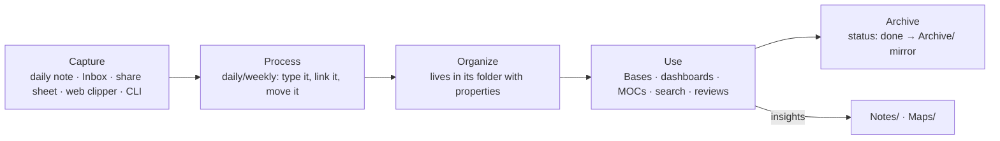
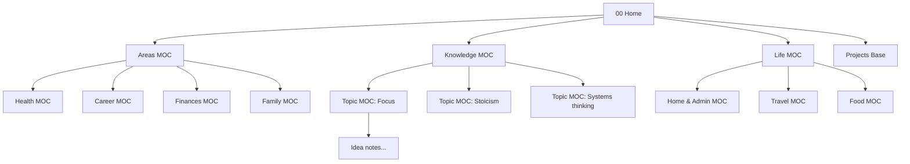

# Vault Architecture — the Reference Design

This chapter is the blueprint. It gives a complete, opinionated vault design for someone who wants to run their whole life in Obsidian: the folder tree, naming conventions, the note-type catalogue with schemas, the flow of information from capture to archive, the MOC hierarchy, and the policies for attachments and archiving. Every domain chapter in Part IV assumes this design (and says how to adapt it). You can copy it wholesale or take pieces; either way, write your own version down in a `Meta/Vault Guide.md` note so the design survives your memory.

## Design goals

1. **Shallow.** No more than two folder levels in daily use. Depth comes from links and Bases, not folders.
2. **Typed.** Every note has a `type` property. Dashboards, templates, and queries key off it.
3. **Capture-first.** There is always an obvious, zero-decision place to put something: the daily note or `Inbox/`.
4. **Query, don't file.** Lists of things are Bases/Dataview views over properties, never hand-maintained.
5. **Portable.** Nothing essential lives only in a plugin's `data.json`. Folder names and properties make sense without Obsidian.
6. **Mobile-sane.** Capture and reading work on a phone with a handful of plugins; administration happens on desktop.

## The folder tree

```text
Vault/
├── 00 Home.md                  ← the front door (dashboard)
├── Inbox/                      ← unprocessed captures (clips, shares, quick notes)
├── Journal/
│   ├── Daily/                  ← 2026-09-06.md
│   ├── Weekly/                 ← 2026-W36.md
│   ├── Monthly/                ← 2026-09.md
│   ├── Quarterly/              ← 2026-Q3.md
│   └── Yearly/                 ← 2026.md
├── Projects/                   ← one note per project (or one subfolder per big project)
├── Areas/                      ← one note per area of life + area MOCs
├── Goals/                      ← goal notes (year / quarter / life)
├── People/                     ← one note per person
├── Sources/                    ← things other people made
│   ├── Books/
│   ├── Articles/
│   ├── Papers/
│   ├── Podcasts/
│   ├── Videos/
│   └── Courses/
├── Notes/                      ← your atomic ideas (Zettelkasten "permanent notes")
├── Maps/                       ← MOCs (maps of content)
├── Work/                       ← meetings, decisions, docs (or a separate vault if confidentiality demands)
│   ├── Meetings/
│   └── Docs/
├── Life/                       ← records: admin, home, travel, recipes, inventory, habits
│   ├── Admin/
│   ├── Home/
│   ├── Travel/
│   ├── Recipes/
│   ├── Inventory/
│   └── Habits/
├── Health/
│   ├── Workouts/
│   └── Log/
├── Finance/
│   ├── Accounts/
│   ├── Subscriptions/
│   └── Ledger/
├── Mind/                       ← reflection: decisions, values, principles, quotes, reviews
├── Bases/                      ← .base files (dashboards)
├── Canvases/
├── Templates/                  ← excluded from search/suggestions
├── Scripts/                    ← Templater user scripts, CSS snippets source, misc
├── Attachments/                ← everything binary (auto-routed)
├── Archive/                    ← mirrors the top-level structure for finished/inactive items
└── Meta/                       ← Vault Guide.md, Schema.md, Plugin list.md, Changelog.md
```

Why this shape:

- It is **ACCESS-adjacent** (Atlas→Maps, Calendar→Journal, Cards→Notes, Extras→Templates/Attachments/Scripts, Sources→Sources, Spaces→Projects/Areas/Work/Life…) but names folders by *what is inside* so they make sense without reading Nick Milo.
- **Projects, Areas, Goals, People** are top-level because they are the nouns every other note links to; you want them visible and quick to reach.
- **Life/Health/Finance** are separate from Areas: `Areas/Health.md` is the *area note* (standards, goals, review cadence); `Health/` holds the *records*. This distinction keeps the area note readable.
- **Work** is separate so it can be excluded from Publish, moved to its own vault, or deleted when you change jobs.
- **`00 Home.md`** sorts first; the numeric prefix is the only one in the vault.
- **Bases/** collects `.base` files so they are easy to find and embed; embedded bases in notes are fine too.
- **Archive/** mirrors the structure so moving something is mechanical and finding it later is predictable. Archiving is a *status change first*, a move second (see policy below).

!!! tip "Adapting"
    Fewer folders is always fine. A minimal variant: `Inbox, Journal, Notes, Sources, Projects, People, Life, Templates, Attachments, Archive`. Add a folder only when a Base filter by `type` is not enough — usually because of attachment routing, templates-per-folder, or publish/sync exclusion.

## Naming conventions

| Thing | Convention | Example |
| --- | --- | --- |
| Daily note | `YYYY-MM-DD` | `2026-09-06` |
| Weekly | `YYYY-[W]WW` (ISO week) | `2026-W36` |
| Monthly | `YYYY-MM` | `2026-09` |
| Quarterly | `YYYY-[Q]Q` | `2026-Q3` |
| Yearly | `YYYY` | `2026` |
| Project | Imperative or noun phrase, Title Case | `Launch Newsletter`, `Kitchen Renovation` |
| Area | Single noun, Title Case | `Health`, `Finances`, `Career`, `Family` |
| Goal | Outcome statement, optionally with year | `Run a Half Marathon 2027` |
| Person | Full name as you would say it | `Jane Doe`; aliases for nicknames |
| Source | Title of the work (no author) | `Deep Work`; author is a property + link |
| Idea note | A declarative claim in sentence case | `Constraints increase creativity` |
| MOC | Topic + " MOC" (or "Map") | `Sleep MOC`, `Stoicism Map` |
| Meeting | `YYYY-MM-DD Topic` | `2026-09-06 Alpha kickoff` |
| Decision | `YYYY-MM-DD Decision - Topic` or claim | `2026-09-06 Decision - Switch to Fastmail` |
| Recipe | Dish name | `Shakshuka` |
| Workout | `YYYY-MM-DD Kind` | `2026-09-06 Strength A` |
| Templates | `tpl-<type>` | `tpl-project`, `tpl-daily` |
| Bases | `<Noun> Base` or purpose | `Projects.base`, `Reading List.base` |
| Attachments | `<note-slug>-<description>.<ext>` or `YYYYMMDD-<desc>` | `kitchen-renovation-floorplan.png` |

Rules:

- **Unique names across the vault.** If two things want the same name, disambiguate with a qualifier in the title (`Alpha (project)` / `Alpha (person)`) — or better, rename one.
- **No dates in idea-note titles; always dates in event-note titles.**
- **Title Case for nouns (people, projects, sources); sentence case for claims.** It signals the note type at a glance.
- **Avoid special characters** (`: / \ | # ^ [ ] ?`) — Obsidian forbids most of them anyway; `&` and `'` are fine but hurt URLs on Publish.
- **Do not put the type in the filename** (`Project - Alpha`). The `type` property and the folder carry that.

## Note types and schemas (the catalogue)

Chapter 5 listed the schema; here are the *templates' skeletons* for the core types. Full Templater versions are in Chapters 11 and 36.

### Daily note

```markdown
---
type: daily
date: 2026-09-06
mood:
energy:
sleep_h:
tags: []
---
« [[2026-09-05]] | [[2026-W36]] | [[2026-09-07]] »

## Plan
- [ ]

## Log
- 07:10

## Notes

## Gratitude / reflection
```

### Project

```markdown
---
type: project
status: active          # idea | active | on-hold | done | dropped
area: "[[Career]]"
goal:
priority: 2             # 1 high · 2 normal · 3 low
start: 2026-09-01
due:
completed:
tags: []
---
## Outcome
One sentence: what "done" looks like.

## Next actions
- [ ]

## Log
- 2026-09-01 — Kicked off.

## Notes & links

## Review
Last reviewed: 2026-09-06
```

### Area

```markdown
---
type: area
review_cadence: monthly
standard: "Sleep 7.5h avg, train 3×/week, resting HR < 60"
tags: []
---
## Why this matters

## Current standard
(what "good enough" looks like — the bar you maintain)

## Active projects
```base
filters:
  and:
    - type == "project"
    - status == "active"
    - area == this
views:
  - type: table
    name: Active
    order: [file.name, due, priority]
```

## Habits & routines

## Related maps
```

### Person

```markdown
---
type: person
relationship: friend    # family | friend | colleague | acquaintance | professional
birthday:
email:
phone:
company:
location:
last_contact:
contact_every: 60       # days
tags: []
---
## About

## Interactions
(Backlinks from daily notes and meetings do most of the work; add a line here for significant events.)

## Gift ideas / preferences

## Family & connections
```

### Source (book example)

```markdown
---
type: source
medium: book            # book | article | paper | podcast | video | course
author: ["[[Cal Newport]]"]
status: reading         # to-read | reading | read | abandoned
rating:
started: 2026-08-14
finished:
url:
isbn:
topics: ["[[Focus]]", "[[Productivity]]"]
tags: []
---
> [!summary] In one paragraph
> (fill in after finishing)

## Key ideas (own words, one per bullet → candidates for [[Notes]])
-

## Highlights & notes
(progressive summarization: **bold** the important, ==highlight== the essential)

## Quotes
```

### Idea note

```markdown
---
type: note
status: seedling        # seedling | budding | evergreen
topics: []
sources: []
tags: []
---
(The claim in the title, argued in 1–5 paragraphs, in your own words. Link generously, with reasons.)

## Related
-
```

### MOC

```markdown
---
type: moc
area:
tags: [moc]
---
> [!abstract] Scope
> What this map covers and how it is organized.

## Start here
-

## Core ideas
-

## Sources
-

## Open questions
-

## Unsorted (recent notes tagged/linked here)
```dataview
LIST FROM [[]] AND -"Maps" WHERE type = "note" SORT file.ctime DESC LIMIT 20
```
```

### Meeting

```markdown
---
type: meeting
date: 2026-09-06
attendees: ["[[Jane Doe]]"]
project: "[[Launch Newsletter]]"
decisions: []
next_meeting:
tags: []
---
## Agenda
## Notes
## Decisions
## Actions
- [ ] 👤 Jane —
- [ ] Me —
```

### Decision

```markdown
---
type: decision
date: 2026-09-06
status: decided         # open | decided | reviewed
confidence: 7
review_on: 2027-03-06
options: []
chosen:
tags: []
---
## Context
## Options considered
## Decision & reasoning
## Expected outcome (falsifiable)
## Review (fill on review_on)
```

## The flow: capture → process → organize → use → archive



**Capture** — four entrances, all zero-decision:

1. *Daily note* (hotkey): tasks, log lines, fleeting ideas, links to people and projects as they come up.
2. *Inbox/* (default new-note location for quick switcher creates, Web Clipper, mobile Share Sheet, `obsidian create` from scripts).
3. *Directly typed* when the type is obvious (a new person, a new recipe) via a QuickAdd/Templater command that asks for the type and files it.
4. *Automated* (Readwise export, calendar → meeting notes, email-to-vault) landing in `Inbox/` or the correct folder with properties pre-filled.

**Process** — daily (5 min) or weekly (30 min): open `Inbox/` (a Base sorted by ctime), for each item: give it a `type` (template), link it to its project/area/person/topic, move it to its folder (or delete it). Tasks written in daily notes need no processing — queries surface them. Ideas noted in the daily note that deserve their own page get extracted (Note composer) into `Notes/`.

**Organize** — the folder + properties are the organization. Nothing else to do.

**Use** — `00 Home.md` is the daily entry (embedded Bases: today's tasks, active projects, people to contact, reading in progress; links to this week's note and top MOCs). Area notes are the monthly entry. MOCs are the knowledge entry. Search for everything else.

**Archive** — see policy below.

## The MOC hierarchy



- **Home** links to ≤ 12 things. If it needs more, add a level.
- **Area MOCs** (one per area) combine the area note's standards with links to its projects, habits, records bases, and topic MOCs.
- **Topic MOCs** curate idea notes and sources on a subject. Create one when ~15 notes cluster (local graph tells you).
- **Life MOCs** index records: recipes, travel, home. Often just an embedded Base plus a few links.
- Every MOC links *up* to its parent in a first line (`Up: [[Knowledge MOC]]`) so navigation works both ways; the **Breadcrumbs** plugin can formalize this if you like hierarchies.

## Attachments policy

- Everything binary goes to `Attachments/` (setting). One flat folder is fine up to a few thousand files; beyond that, `Attachments/YYYY/` via the **Attachment Management** or **Custom Attachment Location** plugins.
- Rename pasted images at paste time (`Pasted image 2026….png` is unsearchable). Plugins: *Paste image rename*, *Attachment Management* (auto-renames to `<note>-<n>`).
- PDFs of sources go to `Attachments/` and are *embedded* in the source note (`![[book.pdf#page=12]]`); annotations live in the note (PDF++ writes highlights as links).
- Large media (video, raw photos, datasets) live **outside** the vault (cloud drive or NAS) and are linked with `file:///` or `https://` links; the vault stays small enough to sync to a phone.
- Exclude `Attachments/` in *Excluded files* so it never pollutes search or the `[[` suggester.
- Monthly: the **Janitor** plugin (or 1.12's delete-attachments prompt as you go) removes orphans.

## Archive policy

1. **Status first.** When a project finishes: `status: done`, `completed: <date>`. Bases and dashboards already hide it. Do this immediately.
2. **Move later.** Quarterly, move `done`/`dropped` projects, finished trips, past years' meetings, etc. into `Archive/<mirrored path>`. Links keep working (shortest-path or auto-update).
3. **Never archive** People, Sources, Notes, Maps, or Areas — they are timeless. A person you lost contact with gets `relationship: former`; a dead source is still a source.
4. **Journal is never moved.** `Journal/Daily/` grows forever; years of daily notes are the point.
5. **Exclude `Archive/`** from search suggestions if it gets noisy (it still searches when you use `path:Archive`).

## Templates set

The minimum: `tpl-daily`, `tpl-weekly`, `tpl-monthly`, `tpl-quarterly`, `tpl-yearly`, `tpl-project`, `tpl-area`, `tpl-goal`, `tpl-person`, `tpl-source`, `tpl-note`, `tpl-moc`, `tpl-meeting`, `tpl-decision`. Domain-specific (`tpl-recipe`, `tpl-workout`, `tpl-trip`, `tpl-subscription`…) get added as domains come online. Chapter 11 implements them with Templater (folder templates auto-apply: new note in `People/` → `tpl-person`), Chapter 36 collects them.

## Bases set (dashboards)

Kept in `Bases/`, embedded where needed:

| Base | Filter | Views |
| --- | --- | --- |
| `Inbox.base` | `file.inFolder("Inbox")` | table by ctime |
| `Projects.base` | `type == "project"` | Active (table), By area (grouped), Timeline (sorted by due), Done this year |
| `People.base` | `type == "person"` | Contact due (`last_contact + contact_every days < today()`), Birthdays this month, By relationship |
| `Reading.base` | `type == "source"` | To read, Reading, Finished by year (cards with covers) |
| `Ideas.base` | `type == "note"` | Seedlings to develop, Evergreens, Recently touched |
| `Meetings.base` | `type == "meeting"` | This week, By project |
| `Decisions.base` | `type == "decision"` | Open, Due for review |
| `Recipes.base` | `type == "recipe"` | Cards by cuisine, Not made in 60 days |
| `Subscriptions.base` | `type == "subscription"` | Active with monthly cost sum, Renewing in 30 days |
| `Workouts.base` | `type == "workout"` | Last 30 days, By kind with duration sums |
| `Habits.base` | `type == "habit"` | Active |

Chapter 10 provides the YAML for all of these.

## The Home note

```markdown
---
type: moc
cssclasses: [dashboard]
---
# Home
**Today:** [[<% tp.date.now("YYYY-MM-DD") %>]] · **Week:** [[<% tp.date.now("YYYY-[W]WW") %>]] · [[Weekly Review]]

## Today's tasks
```tasks
not done
(due before tomorrow) OR (scheduled before tomorrow)
sort by priority
```

## Active projects
![[Projects.base#Active]]

## People to reach out to
![[People.base#Contact due]]

## Reading
![[Reading.base#Reading]]

## Maps
[[Areas MOC]] · [[Knowledge MOC]] · [[Life MOC]] · [[Inbox.base|Inbox]]
```

(The `<% %>` date is a Templater snippet — the Home note is regenerated daily by a Templater "startup template", or use the **Homepage** plugin to open it on launch and Dataview inline `= date(today)` for the date.)

## Multi-vault vs single vault (final word)

Single vault for personal life. Consider a second vault only for: an employer's confidential material (legal/contractual separation), a shared vault with family or a team (different sync permissions), or a publish-only vault (a digital garden built from copied notes). If you split, keep the *same* folder skeleton and templates in both so muscle memory transfers.

## Setting it up in 30 minutes

1. Create the folders (copy the tree; delete what you will not use this quarter).
2. Settings: attachments → `Attachments/`; new notes → `Inbox/`; excluded files → `Templates/`, `Attachments/`, `Archive/`; Templates folder → `Templates/`; Daily notes → `Journal/Daily`, format `YYYY-MM-DD`, template `tpl-daily`.
3. Install Templater, Tasks, Dataview (Chapter 14 tiers) — three plugins are enough to start.
4. Paste the templates above into `Templates/` (Templater versions in Chapter 11).
5. Create `00 Home.md`, `Areas/` notes for your 5–8 areas, and one project note per active project.
6. Create `Projects.base` and `Inbox.base` (Chapter 10) and embed them in Home.
7. Write today's daily note. Stop building. Use it for two weeks before adding anything.

## Key takeaways

- Shallow, typed, capture-first, query-not-file, portable, mobile-sane — every decision in the design follows from these six goals.
- The folder tree is ACCESS-shaped with plain names; Projects/Areas/Goals/People are top-level nouns; records (Life/Health/Finance) are separate from area notes; Archive mirrors the tree.
- Naming: dates for events, claims for ideas, Title Case for nouns, unique names always, no type in filenames.
- Four capture entrances (daily note, Inbox, typed create, automation), one processing ritual, Bases as the organization layer, Home → Area/Topic/Life MOCs as the navigation layer.
- Archive by status first, move quarterly; never archive people, sources, ideas, maps or the journal.
- Set it up in 30 minutes, then use it for two weeks before building more.

## Next

[Chapter 9: Core Plugins — Every One, Mastered →](09-core-plugins.md)
