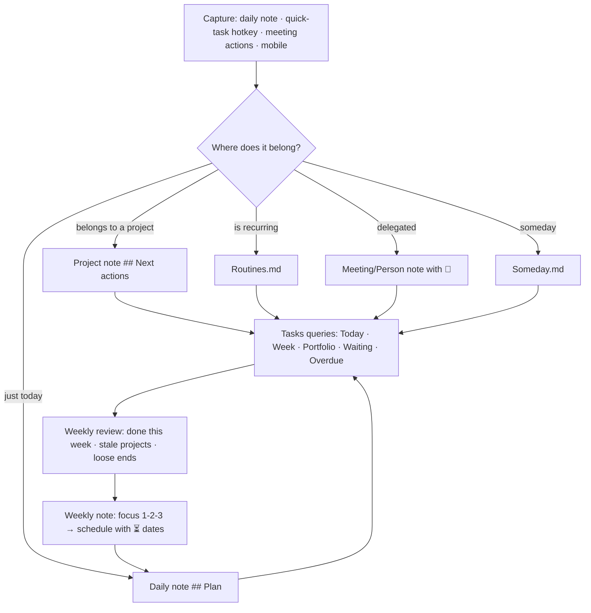

# Tasks, Time and Planning

Obsidian is not a task manager, and that is exactly why it can be a better one: tasks live *inside the context that created them* — the meeting, the project, the daily note, the book — instead of in a separate app that knows nothing about why they exist. The **Tasks** plugin makes those scattered checkboxes queryable with due dates, recurrence, priorities, and dependencies; **Periodic Notes**, **Calendar**, **Day Planner**, and **Full Calendar** add the time dimension. This chapter covers the mechanics of each and then assembles a complete task-and-time system. Chapter 16 layers the GTD-style workflow (projects, goals, reviews) on top of it.

## Tasks plugin — the mechanics

Install **Tasks** (by Clare Macrae and contributors — the best-documented plugin in the ecosystem; its docs site is worth bookmarking).

### Task syntax

A task is any list item with a checkbox. Tasks adds metadata via **emoji signifiers** (default) or **Dataview-style** fields (`[due:: 2026-09-10]`) — choose one format in settings and stick to it.

```markdown
- [ ] Write the quarterly report 📅 2026-09-12 ⏳ 2026-09-08 🛫 2026-09-01 ⏫ 🔁 every month ➕ 2026-09-01 #work/reports
- [x] Book dentist 📅 2026-09-03 ✅ 2026-09-02
- [-] Cancelled task ❌ 2026-09-02
- [ ] Depends on the report 🆔 abc123 ⛔ def456
```

| Signifier | Meaning | Notes |
| --- | --- | --- |
| `📅 date` | **Due** | The hard date |
| `⏳ date` | **Scheduled** | When you plan to work on it |
| `🛫 date` | **Start** | Not actionable before this date |
| `➕ date` | Created | Auto-added if enabled |
| `✅ date` | Done | Auto-added on completion |
| `❌ date` | Cancelled | Auto-added on cancel |
| `🔺 ⏫ 🔼 🔽 ⏬` | Priority: highest, high, medium, low, lowest | No emoji = normal |
| `🔁 every …` | **Recurrence** | `every day`, `every week on Monday`, `every 2 weeks`, `every month on the 1st`, `every year`, `every weekday`; add `when done` to base the next date on completion |
| `🆔 id` / `⛔ id1,id2` | Dependencies (id / blocked by) | Tasks blocked by unfinished tasks can be hidden |
| `#tag` | Tags | Anywhere in the task line |
| `[key:: value]` | Custom inline fields | Visible to Dataview; Tasks can filter on some via `filter by function` |

The **Create or edit task** command (assign a hotkey — ++ctrl+shift+t++ is a good one) opens a modal with fields for all of this, plus natural-language date entry ("next friday"). Dates in the text are also recognised when you type `📅 ` followed by a date-suggestion popup.

### Statuses

Tasks maps checkbox characters to status types: **Todo** `[ ]`, **In progress** `[/]`, **Done** `[x]`, **Cancelled** `[-]`, **Non-task** (e.g. `[i]` info bullets you do not want counted). Settings → Task statuses lets you add custom statuses (including theme sets for Minimal/AnuPpuccin/Things themes) and set what each *cycles to* when clicked. Only Done and Cancelled add completion dates; only Done triggers recurrence.

### Recurrence behaviour

When you check a recurring task, Tasks inserts a **new task above** the completed one with the next dates (due/scheduled/start all shift). `when done` variants compute from the completion date (good for "water plants every 3 days when done"). Recurring tasks in daily notes are an anti-pattern — the new copy lands in an old daily note. Keep recurring tasks in a dedicated `Life/Routines.md` or in the relevant area/project note.

### Queries

````markdown
```tasks
not done
due before tomorrow
sort by priority
group by folder
short mode
```
````

Filters (combine freely; each on its own line, AND-ed; use `(a) OR (b)` and `NOT (…)` for logic):

| Category | Filters |
| --- | --- |
| Status | `done`, `not done`, `status.type is IN_PROGRESS`, `status.name includes …` |
| Dates | `due today`, `due before tomorrow`, `due after 2026-09-01`, `due on or before next week`, `due in 2026-09`, `due this week`, `due next month`, `has due date`, `no due date`, `scheduled …`, `starts …`, `happens …` (any of due/scheduled/start), `created …`, `done …`, `cancelled …` |
| Relative dates | `today`, `tomorrow`, `yesterday`, `this week`, `next week`, `last month`, `in two weeks`, `in 3 days`, `next monday` |
| Priority | `priority is high`, `priority is above medium`, `priority is not lowest` |
| Recurrence | `is recurring`, `is not recurring` |
| Location | `path includes Projects`, `path does not include Archive`, `folder includes …`, `filename includes …`, `heading includes Next actions`, `root includes Work` |
| Content | `description includes call`, `description does not include ~`, `description regex matches /^Call/` |
| Tags | `tags include #waiting`, `tag does not include #someday`, `tags regex matches /#ctx\//` |
| Dependencies | `is blocked`, `is not blocked`, `is blocking` |
| Misc | `has id`, `hide task count`, `limit 20`, `explain` (prints how the query was interpreted) |
| Functions | `filter by function task.due.moment?.isoWeekday() === 1`, `filter by function task.file.property("type") === "project"`, `filter by function task.tags.some(t => t.startsWith("#ctx/"))` |

Sorting: `sort by due`, `sort by priority`, `sort by status`, `sort by path`, `sort by description`, `sort by urgency` (Tasks' composite score — the best default), `sort by function …`; `reverse` suffix.

Grouping: `group by due`, `group by folder`, `group by filename`, `group by heading`, `group by priority`, `group by tags`, `group by status.type`, `group by function task.file.property("area")`, `group by function task.due.category.groupText` (Overdue/Today/Future).

Layout: `short mode` (hides dates/emoji behind an icon), `hide due date`, `hide recurrence rule`, `hide backlink`, `hide edit button`, `hide tags`, `hide priority`, `show urgency`, `hide postpone button`, `show tree` (nested subtasks).

Placeholders: `{{query.file.path}}`, `{{query.file.folder}}`, `{{query.file.property('project')}}` — so a template can contain `path includes {{query.file.path}}` and show the current note's tasks.

Global filter (settings): e.g. `#task` — only lines containing it are treated as tasks. Useful if you use checkboxes for non-tasks (packing lists, habit ticks); the alternative is custom Non-task statuses.

Global query (settings): appended to every query — typically `path does not include Templates` and `path does not include Archive`.

### Urgency

Tasks computes an urgency score from due date proximity, priority, scheduled and start dates. `sort by urgency` gives a sane "what now" order without thinking. The exact weights are documented; you can tune them mentally by adjusting priorities.

### Postpone, edit, toggle

In rendered queries each task has an edit pencil (opens the modal), a postpone button (push due/scheduled a day/week), and the checkbox itself. Checking a task in a query view updates the source file — the query is a live view, never a copy.

## Where tasks live

The architecture decision that makes or breaks the system:

| Location | Use for | Query |
| --- | --- | --- |
| **Daily note `## Plan`** | Today's intentions, quick captures | Surface everything not done via a global query; do not migrate by hand |
| **Project note `## Next actions`** | The actionable steps of a project | Per-project view (`path includes {{query.file.path}}`) and portfolio views grouped by folder/filename |
| **Meeting note `## Actions`** | Commitments from meetings, with 👤 for delegated | Waiting-for view: `description includes 👤` |
| **Area note or `Life/Routines.md`** | Recurring chores and routines | `is recurring` views; daily "routine" section |
| **Person note** | "Ask Jane about…" agenda items | `path includes People` grouped by filename = agendas for the next conversation |
| **Source note** | "Try this idea", "look up X" from reading | `path includes Sources` |
| **`Someday.md`** | Someday/maybe | Excluded from active views by tag `#someday` or by folder |

Every task is written *where it arises*; the dashboards assemble them. Nothing is copied.

## The dashboard set

### Today (in `tpl-daily` or the Home note)

````markdown
```tasks
not done
(due before tomorrow) OR (scheduled before tomorrow) OR (starts before tomorrow AND has start date AND no due date AND no scheduled date)
is not blocked
tags do not include #someday
sort by urgency
group by function task.due.category.groupText
short mode
```
````

### This week

````markdown
```tasks
not done
happens this week
is not blocked
sort by due
group by due
```
````

### Next actions by project (portfolio)

````markdown
```tasks
not done
path includes Projects
filter by function task.file.property("status") === "active"
is not blocked
limit groups 3
sort by urgency
group by filename
short mode
```
````

### Waiting for

````markdown
```tasks
not done
(description includes 👤) OR (tags include #waiting)
sort by due
group by filename
```
````

### Overdue

````markdown
```tasks
not done
due before today
sort by due
```
````

### No date, no project (loose ends)

````markdown
```tasks
not done
no due date
no scheduled date
path does not include Projects
path does not include Routines
path does not include Someday
sort by created
limit 30
```
````

### Done this week (for the weekly review)

````markdown
```tasks
done this week
sort by done reverse
group by folder
```
````

### Routines today

````markdown
```tasks
not done
path includes Routines
(due before tomorrow) OR (scheduled before tomorrow)
sort by scheduled
```
````

### Blocked / dependency chain

````markdown
```tasks
not done
is blocked
show tree
```
````

## Periodic Notes

The **Periodic Notes** plugin (by liamcain) extends daily notes to **weekly, monthly, quarterly, yearly** with per-period folder, format, and template, plus commands *Open this week's note*, *Open next/previous …*, and a setting to open a period's note on startup. Formats: `YYYY-MM-DD`, `YYYY-[W]WW` (ISO weeks — make sure the locale week start matches; the Calendar plugin has a "Start week on" setting), `YYYY-MM`, `YYYY-[Q]Q`, `YYYY`. It integrates with the Calendar plugin (click a week number to open the weekly note) and with Templater (templates are processed if "Trigger on new file creation" is on).

If you prefer fewer plugins, Templater alone can create period notes via a command that computes the name — but Periodic Notes' commands and Calendar integration are worth the install.

## Calendar

The **Calendar** plugin shows a month grid in the sidebar; days with notes show dots (sized by word count or task count — configurable); click to open/create the daily note; click the week number for the weekly note; hover previews. Settings: week start day, show week numbers, words-per-dot, confirm before creating. It is the fastest way to navigate journal history and to spot gaps.

## Day Planner

**Day Planner** turns timestamped tasks in the daily note into a visual timeline in the sidebar and a "current task" status bar with progress:

```markdown
## Plan
- [ ] 07:00 - 07:30 Morning routine
- [ ] 07:30 - 09:00 Deep work: report
- [ ] 09:00 Standup
- [ ] 12:00 - 13:00 Lunch + walk
```

It supports time blocks with durations, drag-to-reschedule in the timeline, multi-day view, and can read events from ICS calendar feeds (read-only) alongside your tasks. This is the "timeboxing in Obsidian" tool. Keep it to the daily note; do not use it for long-term planning.

## Full Calendar

**Full Calendar** renders a proper week/month calendar (FullCalendar.js) from notes: each event is a note with `date`, `startTime`, `endTime` (or `allDay`) in a chosen folder, or from daily-note inline events, plus remote ICS/CalDAV feeds (read-only for ICS; some CalDAV write support). Click-drag to create events (notes). It is the closest thing to a real calendar inside Obsidian and pairs well with `type: meeting` notes. Limits: no notifications, no invites; it is a *view* of your notes and your real calendar, not a replacement.

## Kanban

Two options: **Bases kanban view** (1.14+) for boards driven by a property (project status, pipeline stage) — cards are notes, drag updates the property; and the **Kanban** plugin (by mgmeyers) for free-form boards where cards are list items in a single Markdown note (`## Backlog`, `## Doing`, `## Done` as lanes), with dates, tags, archive, and a toggle to view the note as Markdown. The plugin excels at brainstorming and sprint boards; Bases excels at structured pipelines. Kanban plugin tasks are ordinary `- [ ]` items, so Tasks queries see them.

## Reminders and notifications

Obsidian has no native notifications. Options: the **Reminder** plugin (parses `(@2026-09-10 09:00)` or Tasks' due dates and pops up in-app reminders when Obsidian is open — desktop only in practice); syncing tasks to a real task app (Todoist plugin, Things via URL scheme, Apple Reminders via Shortcuts — Chapter 29); or accepting that Obsidian is the planning layer and your calendar app is the alarm layer. The last is the honest answer for most people.

## Time tracking

- **Simple Time Tracker**: start/stop timers stored in a code block in the note; totals per note; CSV export.
- **Super Simple Time Tracker** / **Toggl Track** integration for people who bill time.
- Interstitial journaling in the daily log (`- 14:32 switched to X`) gives a free-form record that Dataview can parse (`regexmatch`) if you keep the format consistent.
- The **Day Planner** progress bar is a lightweight Pomodoro substitute; **Pomodoro Timer** plugins exist if you want the ritual.

## Designing the complete system



Principles:

1. **Due dates are promises; scheduled dates are plans.** Use `📅` sparingly (real deadlines) and `⏳` liberally (when you intend to do it). The Today view shows both; the Overdue view only shows broken promises.
2. **Every active project has at least one next action** with a scheduled date or none at all — never "someday" in disguise. The weekly review checks this (query: projects with zero open tasks).
3. **Capture in the daily note, but move project tasks to the project note** during processing so the project's history is coherent. Or leave them in the daily note and rely on the `#project/alpha` tag — either works, pick one.
4. **Use priority only for the top 10%.** If everything is high, nothing is.
5. **Recurring tasks live in `Routines.md`** (or area notes), never in daily notes.
6. **Dependencies (`⛔`) for real sequences**, not for everything; hide blocked tasks in the Today view.
7. **Weekly: plan; daily: execute; monthly: review the system itself** (are the queries still right? are you actually looking at them?).

## Mobile

The Tasks modal works on mobile; add *Tasks: Create or edit task* to the mobile toolbar. Queries render fine. Checking boxes is easy; editing dates via the modal is easier than typing emoji. Keep the mobile daily-note template light (fewer queries) — mobile re-rendering of five Tasks queries is noticeable.

## Key takeaways

- Tasks stay in the notes that gave rise to them; the Tasks plugin's queries assemble Today / Week / Portfolio / Waiting / Overdue views live.
- Learn the signifiers (📅 ⏳ 🛫 🔁 ⏫ 🆔 ⛔), the modal hotkey, and the query filters (`happens`, `is not blocked`, `filter by function`, `group by function`) — then build the dashboard set once.
- Due = promise, scheduled = plan; recurring tasks live in a Routines note; every active project has a next action.
- Periodic Notes + Calendar give the time skeleton; Day Planner for timeboxing today; Full Calendar for a real calendar view; Bases kanban or the Kanban plugin for boards.
- Obsidian is the planning layer; your calendar app remains the alarm layer.

## Next

[Chapter 14: Essential Community Plugins →](14-essential-community-plugins.md)
