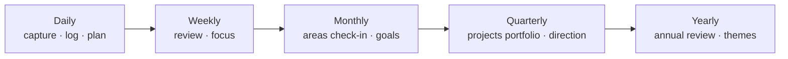

# Daily Notes and Journaling

The daily note is the heartbeat of a whole-life vault. It is the universal inbox, the log, the place tasks are born, the mood and energy record, and — read back over months — the most honest account of your life you will ever have. Get the daily note right and everything else has somewhere to land. This chapter designs the periodic-notes ladder (daily → weekly → monthly → quarterly → yearly), the journaling practices that survive contact with real life, the metrics worth tracking, and the review rituals that turn logs into change.

## Why the daily note works

1. **Zero-decision capture.** "Where does this go?" has one answer: today. Processing happens later, if at all.
2. **Automatic context.** Everything you link from a daily note (people, projects, ideas) receives a dated backlink. You never wrote a "history" section anywhere — yet every project and person has one.
3. **Time as a spine.** Ideas, moods, events, and tasks are correlated by the one dimension you cannot get wrong: the date.
4. **Low stakes.** A daily note has no audience and no standard. You can write one word or two thousand.

## The ladder



Each level *rolls up* the one below by linking or embedding (never copying): the weekly note lists its seven days and summarizes; the monthly lists its weeks; and so on. Each level also *rolls down*: the yearly theme appears in every quarterly note as an embed; the quarterly goals appear in every weekly.

| Level | Filename | When written | Time budget | Core question |
| --- | --- | --- | --- | --- |
| Daily | `2026-09-06` | Through the day; 5 min evening | 5–15 min | What happened, what did I think, what's next? |
| Weekly | `2026-W36` | Sunday evening or Monday morning | 30–45 min | What matters this week? What did I learn last week? |
| Monthly | `2026-09` | First weekend | 45–60 min | Are the areas of my life in shape? Are goals on track? |
| Quarterly | `2026-Q3` | First weekend of the quarter | 2 hours | Which projects, which goals, what to stop? |
| Yearly | `2026` | Late December / early January | Half a day | What was this year? What is next year for? |

Tooling: **Daily notes** (core) + **Periodic Notes** for the other levels + **Calendar** for navigation + **Templater** for templates (Chapter 11 has the full templates; Chapter 36 collects them).

## Designing the daily note

The template from Chapter 11 has five sections. Why each exists:

**Navigation line** (`« yesterday · week · tomorrow »`) — reading back a week takes seven clicks instead of seven searches. The Calendar plugin does this too, but the inline links work on mobile with no sidebar.

**Plan** — a Tasks query for today (due/scheduled/overdue) plus a blank checkbox for intentions. Two or three intentions, not ten. Tasks written here are *captured*; if they belong to a project, move them during processing or tag them `#project/alpha`.

**Log** — timestamped one-liners (interstitial journaling): `- 09:12 starting report; anxious about the numbers section`. A hotkey or QuickAdd capture that inserts `- HH:mm ` makes this frictionless. Value: it externalizes task-switching (you notice how often you do it), records what actually happened (the plan rarely survives), and gives Dataview parseable data if you add inline fields (`[mood:: 6]`).

**Notes** — anything longer: an idea, a conversation summary, a quote. Link generously. Extract to `Notes/` later if it earns it.

**Evening** — three prompts (went well / could improve / grateful). Skip freely; the fields are there so the tired version of you does not have to think of questions.

**Properties** — `mood`, `energy`, `sleep_h` as numbers. Fill them in the morning (sleep) and evening (mood/energy) via the property editor or a **Meta Bind** slider so it takes five seconds on a phone:

```markdown
Mood `INPUT[slider(minValue(1), maxValue(10), addLabels):mood]`
Energy `INPUT[slider(minValue(1), maxValue(10), addLabels):energy]`
Sleep `INPUT[number:sleep_h]` h
```

### What *not* to put in the daily note

- Recurring tasks (they spawn copies in old notes — keep them in `Routines.md`).
- Reference information (Wi-Fi passwords, recipes) — it will be unfindable by date.
- Long-form writing that should be its own note — write it there and link from today.
- Ten Dataview queries — mobile will crawl. Two or three widgets, max.

### Optional widgets

- **On this day** (Dataview, Chapter 12): daily notes from previous years with the same month/day. Surprisingly powerful after year two.
- **Created/modified today**: what you touched, without remembering.
- **Habits** as a checklist with a tag per habit (`- [ ] Meditate #habit/meditate`) — a Heatmap Calendar or streak query reads them (Chapter 20).
- **Weather / location** — Templater `tp.web.request` to a weather API, or the mobile Share Sheet. Nice for travel journals; noise otherwise.
- **Quote of the day** — `tp.web.daily_quote()`. Cute for a week.

## Journaling practices that actually stick

**Interstitial journaling** (Tony Stubblebine): timestamped notes at transitions between tasks. Two minutes per switch. It doubles as a time log and a worry dump, and it is the practice with the best effort-to-insight ratio.

**Morning pages / free writing**: three pages, no editing, no reading back. In Obsidian: a `## Morning` section or a separate `Journal/Freewrite/` folder excluded from search (some people find it easier to write freely when they know they will not stumble on it). Word count in the status bar is the only metric.

**Evening three lines**: went well · could improve · grateful. Or the *Five-Minute Journal* variant (three grateful, three intentions, affirmation; evening: three amazing things, one improvement). The template pre-writes the prompts.

**Prompted journaling**: a rotating list of prompts inserted by Templater (`tp.user.prompt_of_day()` picks from `Mind/Prompts.md` by day-of-year). Useful when the blank page wins.

**Bullet-journal rapid logging**: `-` note, `- [ ]` task, `- [i]` event (custom status styled by the theme). Fast, scannable, and Tasks/Dataview see the tasks.

**Gratitude / wins log**: a `## Wins` list in the weekly note, aggregated yearly by a query — the antidote to annual reviews that only remember failures.

**Decision journal**: significant decisions get their own `type: decision` note (Chapter 25); the daily note links to it.

**Mood tracking with reasons**: a number is data; a number plus one sentence is insight. `mood: 4` and a log line `- 21:00 [mood:: 4] rough call with the landlord` — the Dataview correlation queries then have something to explain.

!!! tip "Lower the bar until you clear it"
    A daily note with a single log line is a success. Streaks matter more than depth; depth comes on the days that need it. If the template feels heavy, remove sections until it does not.

## Weekly note

Sections and their purpose (template in Chapter 11):

1. **Days** — links to the seven daily notes, generated by Templater.
2. **Focus this week** — three outcomes, not tasks. Everything on the Today view should trace back to one of these or to maintenance.
3. **Review checklist** (embedded fragment) — the GTD weekly review adapted: inboxes to zero, daily notes skimmed for loose tasks, every active project has a next action, waiting-for reviewed, calendar backward and forward, someday skimmed, people to contact, quick health/finance/home check, three wins · one lesson · one change.
4. **Mood & energy** — an embedded Base of the week's daily notes with averages. Over months this is how you notice patterns (Thursdays are bad; weeks after travel are low-energy).
5. **Done this week** — a Tasks query `done this week` grouped by folder. Concrete evidence of progress; cures the "I got nothing done" feeling.
6. **Notes** — anything else.

The weekly review is the highest-leverage ritual in the system; protect a recurring calendar slot for it. Sunday evening or Monday morning; 30–45 minutes; same place; same music if that helps.

## Monthly note

1. **Weeks** — links.
2. **Goals for the month** — pulled from the quarterly note; 3–5 checkboxes.
3. **Areas check-in** — Templater generates a heading per `Areas/` note with a blank line; write one or two sentences each: is this area at its standard? Anything neglected? This ten-minute scan is the whole point of having explicit areas.
4. **Finance snapshot** — embed the subscriptions total, note the month's big expenses (Chapter 21).
5. **Health snapshot** — embed the workouts-by-kind Base filtered to the month and the sleep average.
6. **Month in review** — highlights, lowlights, finished projects (embedded Base view), one paragraph of narrative.
7. **Photo of the month** — one image embed. Years later, this is what you will look at.

## Quarterly note

The quarter is the natural unit for projects (a project longer than a quarter is a program or an area).

1. **Direction** — re-read the yearly theme; write what this quarter is *for* in two sentences.
2. **Goals** — 3–5 `goal` notes with `horizon: quarter` linked; each with a measurable target.
3. **Project portfolio** — an embedded Projects Base: what is active, what is on hold, what to drop. Killing projects is the most valuable act of the quarterly review.
4. **Stop doing** — explicit list.
5. **Retrospective of last quarter** — what happened vs. what was planned; why; what to learn.
6. **Systems review** — is the vault serving you? Plugins to remove, templates to trim, dashboards unused.

## Yearly note

1. **Theme** — one phrase or a "year of X" statement. Embedded into every quarterly note.
2. **Annual review** — a structured retrospective. A good set of prompts (adapted from several public annual-review templates):
    - What went well? What did not? What did I learn?
    - Month by month: skim each monthly note; one line each.
    - People: who mattered this year? Who did I lose touch with?
    - Health, money, work, relationships, learning, play, home, spirit: a paragraph each, one score out of 10.
    - Best decisions; worst decisions; luckiest events.
    - What did I read/watch/listen to that changed me? (Reading Base filtered to the year.)
    - What am I proud of? What do I want to leave behind?
3. **Goals for next year** — 3–7 `goal` notes with `horizon: year`.
4. **Stats** — Dataview/Bases: notes created, books read, workouts, words written, days journaled (a streak count).
5. **Photos** — twelve embeds, one per month.

## Reading your journal back

A journal nobody reads is a diary; a journal you read is a feedback loop. Build the reading in:

- **On this day** widget in the daily note (last year, two years ago).
- **Random daily note** command (Random note plugin scoped to `Journal/Daily` via Smart Random Note) once a day.
- **Weekly**: skim the seven dailies (that is what the "Days" links are for).
- **Monthly/quarterly/yearly**: skim the level below.
- **Search your own history**: `path:Journal "anxious"` or `[mood:1..3]`-style hunts — property search cannot do ranges, but a Base of `type == "daily"` filtered `mood <= 3` sorted by date is a two-minute build and a sobering read.

## Metrics worth tracking (and ones that are noise)

| Track | Because | How |
| --- | --- | --- |
| Sleep hours | Explains most bad days | Property; from a wearable via Shortcuts/Health Auto Export if you want automation |
| Mood 1–10 | The outcome variable | Property, evening |
| Energy 1–10 | Different from mood; explains productivity | Property, midday or evening |
| Exercise done (y/n or minutes) | Strong mood predictor | Workout note or habit checkbox |
| Alcohol / caffeine | Sleep confounders | Habit checkbox or inline field |
| Deep work hours | If work output matters to you | Inline field `[deep:: 2.5]` in the log |
| Social contact (y/n) | Loneliness creeps | Backlinks from People notes count it for free |
| Weight (weekly, not daily) | Trends, not noise | Property on the weekly note |

Noise: steps (your phone already has it), water glasses (unless medical), screen time (feel bad, learn nothing), anything with more than one decimal place.

Visualize with **Heatmap Calendar** (one per metric, in the yearly note), **Tracker** (line charts over months), or a Base with monthly group-by and averages. Look at charts monthly, not daily.

## Mobile journaling

- Add *Open today's daily note* to the mobile toolbar and as the app's startup note (Homepage plugin, or Daily notes' *Open on startup*).
- A QuickAdd capture "Log line" that prompts for text and inserts `- HH:mm text` under `## Log`.
- Meta Bind sliders for mood/energy so YAML is never touched by thumb.
- iOS **Share Sheet** (1.13): share a photo, link, or text from any app straight into today's note or `Inbox/` with a configurable location and template.
- Voice: dictate into the log line (system dictation), or use a voice-memo → Whisper → note pipeline (Chapter 30).
- Photos: one per day, pasted into `## Notes`. Attachment Management renames to `2026-09-06-1.jpg`.

## Journaling privacy

The journal is the most sensitive folder in the vault. Options, from lightest to heaviest: exclude `Journal/` from Publish and from any shared vault; keep the vault on encrypted disks and E2E-encrypted sync (Obsidian Sync, Remotely Save with encryption, LiveSync); encrypt specific passages with **Meld Encrypt**; keep a separate encrypted vault for the truly private (Chapter 26).

## Anti-patterns

- **Template creep**: a daily note that takes ten minutes to fill before you write anything. Trim.
- **Migration by hand**: copying unfinished tasks forward every day. Queries do this.
- **Metrics without reading**: tracking twelve numbers and never looking. Track three; chart monthly.
- **Skipping weeks and abandoning**: missed a week? Write one line in the weekly note ("skipped — travel") and move on. Gaps are data too.
- **Journaling only when miserable**: your archive becomes a distorted record. The evening "went well" prompt exists for this reason.

## Key takeaways

- The daily note is the universal inbox and log; everything else in the vault gets its history from daily-note backlinks.
- Build the ladder — daily, weekly, monthly, quarterly, yearly — with each level linking down and embedding up; protect the weekly review above all.
- Keep the daily template light: navigation, plan (query + intentions), timestamped log, notes, three evening prompts, three numeric properties.
- Interstitial journaling and evening three-liners are the practices with the best return; prompts and Meta Bind sliders lower the bar on hard days.
- Read the journal back — on-this-day, random daily, skim at each review — or it is not a feedback loop.
- Track few metrics, chart monthly, and protect the journal's privacy.

## Next

[Chapter 16: Tasks, Projects and Goals — the Action System →](16-tasks-projects-goals.md)
