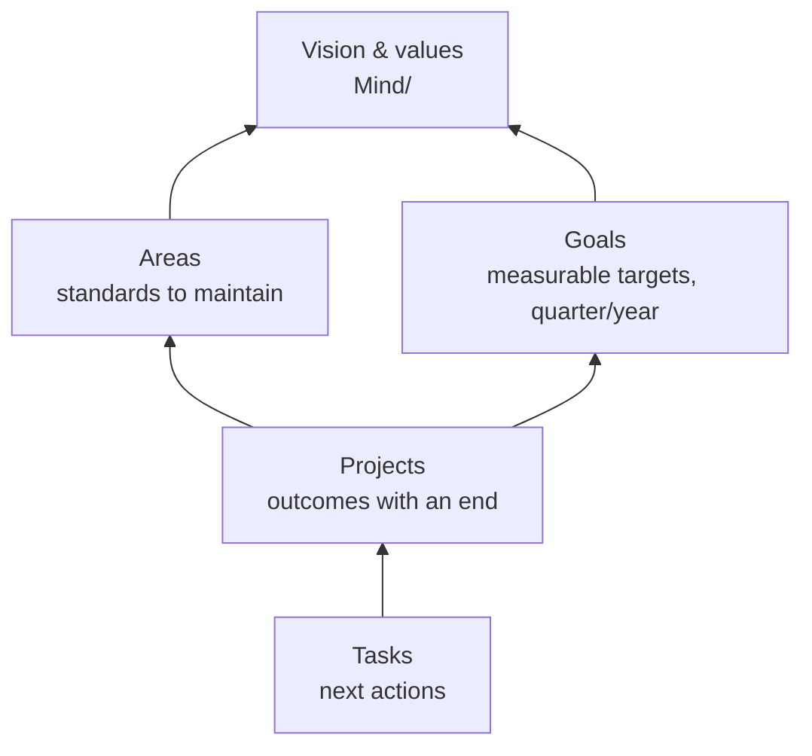

# Tasks, Projects and Goals — the Action System

Chapter 13 gave the mechanics of tasks and time; this chapter builds the *system*: how commitments flow from a vague "I should…" to a done project, how projects connect to areas and goals so daily action serves long-term direction, and how the weekly and quarterly rituals keep the whole thing honest. It is GTD's structure with PARA's vocabulary, implemented entirely in notes, properties, Tasks queries and Bases.

## The horizons



| Horizon | Note type | Lives in | Reviewed |
| --- | --- | --- | --- |
| Tasks | checkboxes in any note | where they arise | daily |
| Projects | `type: project` | `Projects/` | weekly |
| Areas | `type: area` | `Areas/` | monthly |
| Goals | `type: goal` | `Goals/` | quarterly |
| Vision / values / principles | `Mind/Values.md`, `Mind/Vision.md` | `Mind/` | yearly |

The rule that connects them: **every project has an `area`** (which area of life does this serve?) and **optionally a `goal`** (which target does it advance?). Every task belongs to a project, a routine, or today. When you cannot answer "which area?" the project is probably someone else's priority.

## Areas

An area is a domain you maintain forever: Health, Finances, Career, Family, Friends, Home, Learning, Play, Spirit/Mind, Community. Most people have 6–10. Each gets a note:

```markdown
---
type: area
review_cadence: monthly
standard: "Train 3×/week · sleep ≥ 7h · resting HR < 60 · annual check-up done"
tags: []
---
## Why this matters
(one paragraph — the *motivation*; you will re-read it when the area is neglected)

## Standard
(what "good enough" looks like — concrete, checkable)

## Active projects
```base
filters:
  and: [type == "project", status == "active", area == this]
views:
  - type: table
    name: Active
    order: [file.name, due, priority]
```

## Goals
```base
filters:
  and: [type == "goal", status != "done", area == this]
views:
  - type: list
    name: Goals
    order: [file.name, horizon, target, current]
```

## Routines
- [ ] Weekly: … 🔁 every week
(or link to the section in Routines.md)

## Metrics
(embed the relevant Base: workouts, spend, contact-due people)

## Notes & maps
[[Health MOC]]
```

The **standard** is the key line. It turns "I should exercise more" into a checkable statement. The monthly review asks, per area, "is the standard met?" — a yes/no question that takes ten seconds.

## Goals

A goal is a *measurable target with a horizon*. Not "get fit" but "run 10 km under 55 minutes by 2027-06-30". Properties: `horizon` (quarter/year/life), `status`, `area`, `metric`, `target`, `current`, `due`.

```markdown
---
type: goal
horizon: year
status: active
area: "[[Health]]"
metric: "10k time (minutes)"
target: 55
current: 61
due: 2027-06-30
tags: []
---
## Why
## Definition of done
## Projects serving this goal
```base
filters:
  and: [type == "project", goal == this]
views:
  - type: table
    name: Projects
    order: [file.name, status, due]
```
## Progress log
- 2026-09-01 — 61:20 (baseline)
```

A Goals Base shows progress (`(current / target * 100).round(0) + "%"` or the inverse for lower-is-better) and days left. Quarterly goals are stepping stones of yearly goals — link them with a `parent` property.

Frameworks that fit this shape: **OKRs** (goal = objective; `metric/target/current` = key result — use one goal note per KR or a table in the objective note), **12-Week Year**, **SMART**. The vault does not care which; it cares that `target` and `current` are numbers.

## Projects

A project is an outcome with an end, needing more than one action. Kitchen renovation, Q3 report, plan the trip to Japan, read and summarize *Thinking Fast and Slow*, migrate email provider. Each gets a note (template in Chapter 11). The parts that matter:

- **`status`**: `idea` (someday/maybe) → `active` → `on-hold` / `done` / `dropped`. The Projects Base filters on this; nothing else moves.
- **`area`** and optional **`goal`** links.
- **`due`** only when there is a real deadline; **`priority`** 1–3.
- **`reviewed`** — set to today each time you touch the project in a review; a Base view flags projects unreviewed for 14 days.
- **Outcome** — one sentence describing done. If you cannot write it, it is not a project yet; it is an area concern or a someday item.
- **Next actions** — the checkbox list. At least one, ideally with a `⏳` scheduled date.
- **Log** — dated one-liners of progress; also filled by backlinks from daily notes and meetings.

### Work-in-progress limit

Cap active projects. For most people with a job and a life: **3–5 personal projects active** at once, plus work projects tracked separately or in `Work/`. Everything else is `idea` or `on-hold`. The Projects Base makes the count visible; the quarterly review enforces it. This one constraint does more for completion rates than any tool.

### Project sizes

- **Tiny** (under a day): do not make a project; a task with a due date in the area note or daily note.
- **Small** (days–weeks): one note, one list of tasks.
- **Large** (months): one note as the hub, plus sub-notes per phase or workstream in a `Projects/<Name>/` folder; a Canvas board for the plan; meetings linked via `project:`.
- **Programs / ongoing**: probably an area, not a project. If it never ends, it is an area.

### Someday / maybe

Projects with `status: idea`. Review quarterly; promote to active when a slot frees; drop without guilt when they no longer excite you. A `Someday.base` view sorted by `file.mtime` ascending shows the oldest untouched ideas first — the ones to drop.

## Tasks (recap of the rules)

- Written where they arise; surfaced by queries (Chapter 13).
- Due = promise, scheduled = plan.
- Project tasks live in the project note's `## Next actions` (moved there during processing) or carry the project's tag.
- Delegated: `👤 Name` or `#waiting`; surfaced in the Waiting-for view.
- Recurring: in `Life/Routines.md` or area notes.
- Contexts (GTD's `@phone`, `@errands`): as tags `#ctx/errands` if you find them useful — they are for batching, and batching still works (`tags include #ctx/errands` view for when you are out).
- Energy/time tagging (`#quick`, `#deep`): optional; the Today view sorted by urgency usually suffices.

## The dashboards

`00 Home.md` gets the Today view and active projects; the weekly note gets the review set; and a dedicated `Action Dashboard.md` (or a Workspace) holds everything:

```markdown
## Today
(Tasks: due/scheduled before tomorrow, not blocked, sort by urgency)

## Focus this week
![[<% tp.date.now("YYYY-[W]WW") %>#Focus this week]]

## Active projects
![[Projects.base#Active]]

## Waiting for
(Tasks: 👤 or #waiting)

## Loose ends
(Tasks: no date, not in Projects/Routines/Someday)

## Goals
![[Goals.base#Active]]

## Areas below standard
(manual list from the last monthly review, or a checkbox property `at_standard` on area notes → Base filter)
```

## Processing: the daily five minutes

1. Open today's note. Skim the log for anything that is actually a task, a person to follow up, or an idea → convert.
2. Open `Inbox/` (Base). For each item: delete, do (< 2 min), make a task (in the right project), make a project, or file as reference (type + folder).
3. Look at the Today view. Choose tomorrow's three intentions if it is evening; or today's if morning.

## The weekly review (the engine)

Sunday evening or Monday morning; 30–45 minutes. The checklist fragment from Chapter 11, explained:

| Step | Why | Tool |
| --- | --- | --- |
| Inboxes to zero | Nothing lurking | `Inbox.base`, email, downloads, photos, voice memos |
| Skim the week's daily notes | Catch loose tasks, promises, ideas | Weekly note's Days links |
| Every active project has a next action | Stalled projects are invisible otherwise | Dataview "projects with zero open tasks" or scan the Portfolio view |
| Mark `reviewed` on each project | Keeps the "needs review" view honest | Edit in the Base table, or a Templater button |
| Waiting-for | Chase or drop | Waiting view |
| Calendar back 1 week, forward 2 | Capture from past events; prepare for future ones | Your calendar app; Full Calendar |
| Someday skim (monthly is enough) | Promote or drop | Someday view |
| People contact-due | Relationships need scheduling too | People.base |
| Health/finance/home 60-second check | Areas do not wait for the monthly | Area notes |
| Three wins · one lesson · one change | Reflection, not just administration | Weekly note |
| Set focus for the week (3 outcomes) | Direction for the Today view | Weekly note `## Focus` |
| Schedule the outcomes' tasks with ⏳ | Plans, not wishes | Tasks modal |

If you only do one thing from this whole guide, do this weekly.

## Monthly and quarterly (portfolio management)

**Monthly**: area standards check (yes/no each), goals `current` values updated, monthly goals set (3–5), finance and health snapshots, month narrative (Chapter 15).

**Quarterly**: the portfolio decision. Open `Projects.base`: for each active project — continue, pause, drop, or done? Promote 1–3 ideas to active if slots opened. Re-read goals; kill the ones you no longer want (killing a goal is a decision worth a `decision` note). Re-read `Mind/Vision.md`; adjust. Trim the system: plugins, templates, dashboards unused in the quarter.

## Work projects vs personal projects

Two acceptable designs:

1. **One vault, `Work/` folder, `area: "[[Career]]"`** — everything in one place; Bases views filter by area; Publish and shares exclude `Work/`. Best if confidentiality allows.
2. **Separate work vault** — the same templates and skeleton; nothing crosses. Best if an employer's data cannot sit next to your journal, or if you switch jobs and want a clean handover (export/delete the vault).

Either way, the meeting note (Chapter 19) is the work-side capture point, with `project:` links and `👤` actions feeding the same Waiting-for view.

## Habits and routines

Habits are not projects (they never end) and not goals (they are behaviours, not outcomes). Treat them as **routines** in `Life/Routines.md` (recurring tasks with 🔁) or as **habit checkboxes** in the daily note with tags (`#habit/x`), visualized by Heatmap Calendar / streak queries (Chapter 20). A `habit` note type (`Life/Habits/Meditate.md`) is worth it only for habits with a *why*, a plan, and a review — otherwise a checkbox is enough.

Habit design tips that translate to the vault: start with one or two; tie to an existing routine (habit stacking); track completion, not intensity; review monthly (a `## Habits` section in the monthly template with the heatmaps embedded).

## Anti-patterns

- **Twenty active projects.** Nothing finishes. Cap it.
- **Projects without outcomes.** "Website" is not a project; "Launch the new site with 5 pages by Oct 15" is.
- **Tasks without homes.** Hundreds of orphan tasks in daily notes. Process weekly; the Loose ends view shows the backlog.
- **Goals with no metric.** "Be healthier" cannot be reviewed. Attach a number or make it an area standard instead.
- **Reviews skipped for a month.** The system goes stale and you blame the tool. Put the review in the calendar and treat it like a meeting.
- **Rebuilding instead of reviewing.** When the system feels wrong, the fix is usually one fewer project, not a new plugin.

## Key takeaways

- Tasks → projects → areas/goals → vision; every project has an area, optionally a goal; every task has a project, a routine, or today.
- Areas carry a written *standard*; goals carry numeric `target`/`current`; projects carry `status`, an outcome sentence, and at least one next action.
- Cap active projects at 3–5 personal; someday is a status, not a graveyard.
- The weekly review is the engine; monthly checks standards; quarterly manages the portfolio and prunes the system.
- Habits are routines or checkboxes, not projects; track completion and review monthly.

## Next

[Chapter 17: Knowledge and Learning →](17-knowledge-learning.md)
