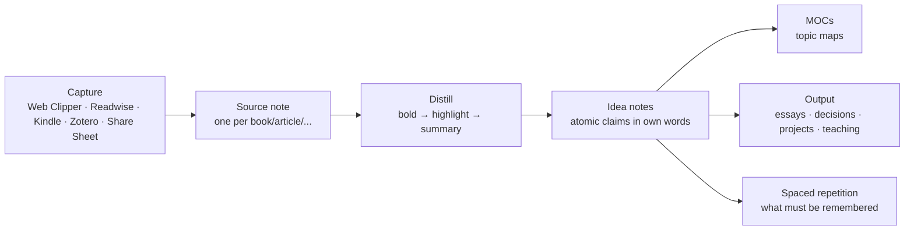

# Knowledge and Learning

This is the domain Obsidian was built for: taking what you read, watch, hear and study, and turning it into understanding you can find, connect, and use years later. The pipeline is **capture → source note → distilled highlights → atomic idea notes → maps → output**, with spaced repetition for the things that must be remembered rather than merely findable. This chapter builds the whole pipeline for books, articles, papers, podcasts, videos, courses, languages and skills.

## The pipeline



Two principles govern it:

1. **Sources are not knowledge.** A clipped article is a *pointer*. Knowledge is what you write in your own words about it. The system should make writing idea notes easy and clipping slightly inconvenient.
2. **Process on demand.** You do not distill every source. You distill the ones you return to (progressive summarization). Unread clippings are fine as long as they are visibly a pile you can prune.

## Source notes

One note per source, `type: source`, `medium:` book/article/paper/podcast/video/course/talk/documentation, in `Sources/<Medium>/`. Template in Chapter 11 (`tpl-book` generalizes). The sections:

- **Summary callout** at the top — written *after* finishing, in one paragraph. This is the note's payload for future you.
- **Key ideas (own words)** — one bullet each; every bullet is a candidate idea note. Link them when they become notes.
- **Highlights & notes** — the raw material, progressively summarized: `**bold**` the important, `==highlight==` the essential.
- **Quotes** — verbatim, with page/timestamp, for citing.

Properties worth having: `author` (list of links → author notes accumulate everything you have read by them), `status`, `rating`, `started`/`finished`, `topics` (links to MOCs), `url`/`isbn`/`doi`, `cover`, `pages`/`pages_read` or `duration`.

### Books

**Book Search** plugin: run the command, type a title, pick the match, and it creates a note from your template with author, publisher, year, ISBN, page count, cover URL, and description pre-filled from Google Books/OpenLibrary. Set its output folder to `Sources/Books` and its template to `tpl-book` (it uses `{{title}}`, `{{author}}`, `{{coverUrl}}`… placeholders; Templater tags also process if enabled).

Highlights: **Kindle Highlights** plugin (imports from Amazon or a `My Clippings.txt`), **Readwise Official** (syncs everything Readwise collects with a configurable template; set it to append new highlights to existing notes), or manual — typing highlights by hand is slower and *that is a feature*; you only type what matters.

Reading log: `status: reading`, `started`, `pages_read` updated occasionally; a Base view shows what you are reading with progress. `finished` + `rating` when done; the Reading Base's "Finished by year" view with an average rating summary becomes your annual reading list for free.

### Articles and web pages

**Web Clipper** (official browser extension): clips a page to Markdown with a template per site pattern — properties (`title`, `url`, `author`, `published`, `clipped`, `type: source`, `medium: article`, `status: to-read`), the article body, and your highlights (the extension has a highlighter; highlights can be clipped alone). **Interpreter** lets a template call an LLM with natural-language instructions ("extract the three main claims as bullets", "summarize in 50 words", "list the people mentioned as wikilinks") so the note arrives pre-distilled. Clips land in `Inbox/` or straight into `Sources/Articles/`.

Rule for the pile: clip only what you would be sad to lose; anything with `status: to-read` older than 90 days gets a Base view — read it or delete it.

### Papers (see Chapter 18)

Zotero → Zotero Integration → literature note with citekey, metadata, and annotations. PDF++ for in-Obsidian reading with highlights written as links.

### Podcasts and videos

**Media Extended** embeds YouTube/Bilibili/local media with **timestamp links** (`[12:34](…&t=754)`): take notes while listening; each timestamp is a clickable seek. For podcasts, Readwise/Snipd exports (Snipd transcribes and syncs "snips" to Obsidian via Readwise or its own export). For long videos, the YouTube transcript + an LLM summary (Chapter 30) into the source note is a legitimate first pass — then watch the parts that matter.

### Courses

One `course` source note as a hub (`medium: course`, `provider`, `url`, `status`, `progress`), with one note per lecture/module in `Sources/Courses/<Course>/` linking back. A Base view groups lectures by course with completion checkboxes. Exercises and projects from the course become real project notes.

### Documentation and technical reading

Developers: a `Sources/Docs/` folder of clipped reference pages is rarely worth it — docs change. Instead, write *your* notes on the concept (`Notes/`) and link to the live URL. Snippets go in a `Notes/Snippets/` folder with code blocks and tags by language; Omnisearch finds them.

## Distillation

**Progressive summarization** (Forte) in practice:

- Layer 0: the captured text.
- Layer 1: **bold** the passages that made you stop (on first read, or when you return).
- Layer 2: ==highlight== the best of the bold (on second return).
- Layer 3: write the summary callout at the top (when you need to use the source or have returned twice).
- Layer 4: turn the best highlights into idea notes.

Do not do all layers at capture. The layers are *how you read the second and third time*. A source you never return to stays at layer 0 or 1 — appropriately.

**Reading modes**: for dense material, read in Reading view with the Outline pane; annotate in a split Source-mode pane of the same note so highlights and your comments sit beside the text. For PDFs, PDF++ (highlight → link in your note; click the link to jump to the page).

## Idea notes (the Zettelkasten core)

An idea note is one claim, in your own words, argued in a few paragraphs, linked with reasons. `type: note`, `status: seedling/budding/evergreen`, `topics` (links), `sources` (links), in `Notes/`.

**Titles are claims**: "Working memory holds about four chunks", "Constraints increase creativity", "Most productivity advice is about attention, not time". You can link a claim into a sentence (`as [[constraints increase creativity]] suggests…`); you cannot do that with "Creativity".

**Writing the note**: what is the claim? Why do I believe it (evidence, sources)? What does it connect to (link, and say how: *supports*, *contradicts*, *is an example of*, *generalizes*)? What follows from it? What would change my mind? Two to five paragraphs; longer means it is two notes.

**From source to idea**: in the source note's "Key ideas" list, each bullet that survives a second look gets turned into an idea note (Note composer → *Extract current selection* with a link left behind; or `[[` the claim, click through, write). The idea note's `sources` property links back; the source's bullet now links forward.

**Maturity**: `seedling` (a claim and a source), `budding` (argued, linked to 3+ notes), `evergreen` (revised at least once after a month, connected to a MOC, used in an output). The Ideas Base's "Seedlings to develop" view is your writing queue; **Random note** scoped to `Notes/` is your revision prompt.

**Contradictions are gold**: when a new source contradicts an idea note, do not pick a side immediately — add a `## Tension` section linking both and write what would resolve it. Half the best essays start there.

## Maps of Content for topics

When a topic has ~15 idea notes (local graph or a `topics.contains(this)` Base tells you), create `Maps/<Topic> MOC.md`: a curated, ordered list of the ideas with one-line commentary each, sections for sources and open questions, and an embedded Base of notes tagged with the topic that are not yet listed (the "unsorted" section from Chapter 8). MOCs are gardened quarterly: promote, demote, merge, prune.

Topic MOCs link up to a **Knowledge MOC** (or several domain maps) which links up to Home. Depth rarely exceeds three levels.

## Spaced repetition

Some knowledge must be *remembered*, not just findable: vocabulary, formulas, anatomy, legal definitions, the names of your partner's colleagues. The **Spaced Repetition** plugin does two things:

1. **Flashcards** inside notes: `Question::Answer` (single-line), `Question\n?\nAnswer` (multi-line), `Answer:::Answer` (reversible), cloze `==deletion==` or `{{deletion}}`. Cards are tagged (`#flashcards/anatomy`) and reviewed in a modal with SM-2 scheduling; scheduling metadata is written back as an HTML comment on the card line (data stays in your notes).
2. **Note review**: tag a note `#review` and it enters a queue of notes to re-read on a schedule — light spaced repetition for idea notes ("does this still hold?").

Practice: create cards *from idea notes*, not from sources — the act of phrasing a question is a second distillation. Keep decks small (20–50 new cards a week is a lot). Review daily in a two-minute session; mobile works.

Alternatives: **Flashcards** (Anki sync — cards written in Obsidian, reviewed in Anki, which has better scheduling and mobile apps), **Obsidian to Anki**. If you already live in Anki, sync; otherwise the built-in plugin is enough.

## Language learning

- `Sources/Courses/` for the course; `Notes/Languages/<Lang>/` for grammar notes as claims ("German verb goes second in main clauses").
- Vocabulary as flashcards in topic notes (`#flashcards/de/food`), reversible `:::` cards for production, cloze for grammar in context.
- A `Life/Language Log.md` or daily-note inline field `[de_min:: 25]` for minutes practiced → Heatmap Calendar.
- Reading in the target language: Web Clipper the article, annotate unknown words as footnotes; the note becomes a mini-course.
- Conversation notes: after a tutoring session, a `meeting` note with corrections → flashcards.

## Skills (deliberate practice)

A skill is an area or a goal, not a source. `Goals/Learn Blender basics 2026.md` with a metric (hours, or a concrete deliverable), a plan (the course as a source, projects as practice), a **practice log** (dated one-liners or a daily-note inline field), and a **mistakes/insights** section that feeds idea notes. Skills with a physical component (instrument, sport) benefit from short video embeds in the practice log — progress you can see.

## Learning dashboard

`Maps/Learning MOC.md` (or the Learning area note):

```markdown
## Reading now
![[Reading.base#Reading now]]
## To read (oldest first — read or delete)
![[Reading.base#To read]]
## Seedlings to develop
![[Ideas.base#Seedlings to develop]]
## Review queue
(Spaced Repetition status bar shows due cards; or a Dataview query of `#review` notes)
## Courses in progress
```base
filters: {and: [type == "source", medium == "course", status == "in-progress"]}
views: [{type: table, name: Courses, order: [file.name, provider, progress]}]
```
## Stats this year
(Dataview: books read, notes created, cards reviewed)
```

## Output: the reason for all of this

Knowledge that never leaves the vault decays into a collection. Build outputs into the system:

- **Writing**: essays, blog posts, newsletters drafted in `Notes/Drafts/` from idea notes (embed blocks, then rewrite). Chapter 24.
- **Decisions**: decision notes cite idea notes as reasoning. Chapter 25.
- **Teaching**: explaining an idea to someone (a talk, a mentoring session) is the best test; the talk outline lives in the vault and links to the ideas.
- **Projects**: a book on habits should change a routine; link the project to the source.
- **Answering your own questions**: keep `Mind/Open Questions.md` (Feynman's twelve favourite problems). Every capture is checked against it; every idea note that advances a question is linked from it.

## Anti-patterns

- Clipping everything; reading nothing. Cap the to-read pile; prune monthly.
- Highlights without own words. A source note with 40 highlights and no summary is a photocopy.
- Idea notes titled with topics ("Creativity") — they become dumping grounds. Titles are claims.
- Flashcards from sources rather than from understanding — you memorize phrasing.
- MOCs built before notes exist. Wait for the squeeze.
- Never revisiting. Random note, review tags, and the seedlings view exist to force encounters.

## Key takeaways

- Sources are pointers; knowledge is what you write. Make idea notes easy and clipping slightly inconvenient.
- One source note per item with a summary callout, own-words key ideas, progressively summarized highlights, and typed properties; Book Search, Web Clipper (+Interpreter), Readwise/Kindle, Zotero and Media Extended feed it.
- Idea notes are atomic claims in your own words with `status` maturity; MOCs curate them when clusters form; Random note and the seedlings view force revisits.
- Spaced Repetition for what must be remembered; cards from ideas, not sources; small decks, daily two-minute reviews.
- Build outputs — writing, decisions, teaching, projects, open questions — or the knowledge decays into a collection.

## Next

[Chapter 18: Academic Research →](18-academic-research.md)
