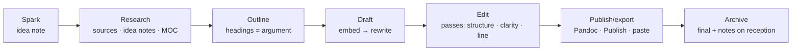

# Creativity, Writing and Media

Obsidian is a superb writing environment and an underrated creative studio: idea capture that never loses a thought, long-form manuscripts with Longform, worldbuilding with a graph you can see, drawing with Excalidraw, and media logs (films, music, games, art) that become a record of taste. This chapter covers the creative pipeline from spark to finished work, the writing workflows for essays, newsletters, fiction and non-fiction books, worldbuilding, visual thinking, hobbies, and media consumption logs.

## Idea capture

Creative ideas arrive at the wrong time. The system: a **zero-friction capture** (mobile quick note to `Inbox/`, a `- 💡` line in the daily log, voice memo → transcription), and a weekly sweep that moves ideas into `Notes/Ideas/` (or `type: idea`) with one property — `status`: spark / developing / parked / used. An Ideas Base view "Sparks older than 30 days" forces a decision: develop, park, or delete. Parked ideas are not failures; the note exists so you stop re-having the idea.

**Idea collisions**: the graph's value for creativity is juxtaposition. Random note across `Notes/` and `Notes/Ideas/`, or a DataviewJS "two random ideas" widget in the daily note, produces combinations you would not have chosen.

## Writing: the general pipeline



**Drafting from notes**: start the draft with `![[idea note#^block]]` embeds in outline order — your own thinking, already written. Then rewrite each embed as prose for the audience (embeds are quotes of notes, not final text). This "assemble then rewrite" method is the practical payoff of atomic notes: a 2,000-word essay from twelve idea notes is an afternoon, not a week.

**Editing passes** as checklists in a `frag-editing-passes` fragment: structure (does each section earn its place?), argument (are claims supported — link the sources?), clarity (one idea per paragraph, topic sentences), line (cut adverbs, passive voice, hedges), read aloud. **LanguageTool** plugin for grammar; the **Typewriter Scroll** for focus; word count in the status bar; **Longform** for anything multi-part.

**Versions**: File recovery and Git handle history; for deliberate drafts, `Drafts/Essay v1.md`, `v2.md`, or Longform's draft management. Do not keep five copies inline.

## Essays, blog posts, newsletters

`Projects/Writing/<Piece>.md` (or `Notes/Drafts/`) with properties: `type: draft`, `kind` (essay/post/newsletter/talk), `status` (idea/outline/drafting/editing/published), `target` (words), `publish_on`, `published_url`, `audience`. A Writing Base kanban (1.14) by status is the editorial calendar; a table sorted by `publish_on` is the schedule.

**Newsletter workflow**: one project note per issue from a template (sections pre-set), a `Newsletter Ideas.md` list fed by the weekly sweep, a Base of published issues with `open_rate`/`clicks` properties if you track them, and a `## Reception` section for replies worth keeping. Publishing: copy rich text (1.12+) into the newsletter tool, or Pandoc → HTML.

**Blogging**: Quartz / Digital Garden / Hugo via Enveloppe for publishing straight from the vault (Chapter 31), with `publish: true` and `date` properties controlling the site. Drafts stay unpublished by default.

## Books and long-form (non-fiction)

`Projects/Book/`: `Book.md` hub (premise, audience, promise, table of contents as links, word targets, deadlines, agent/editor People, decisions), `Chapters/` one note per chapter (`type: chapter`, `status`, `target`, `order`), `Research/` (or links to `Sources/` and `Notes/`), `Longform` index. Each chapter is a mini-essay drafted from idea notes. Longform: scenes = sections within chapters if you like; compile → Pandoc → DOCX for the editor. Word-count tracking per chapter via Longform or Novel Word Count; a Base of chapters with `target` and a formula `pct: (words / target * 100).round(0)` if you type `words` (or let Longform show it).

**Research for non-fiction**: exactly Chapter 17/18's pipeline; the book's MOC is the outline; interviews as `meeting` notes with `project: Book`; quotes with sources ready for endnotes via Pandoc footnotes.

## Fiction

`Projects/Novel/`:

- `Novel.md` hub: premise, themes, POV/tense decisions, timeline, status, targets.
- `Scenes/` or Longform scenes: one note per scene (`type: scene`, `chapter`, `pov` (character link), `location` (link), `time` (story date), `status`, `words`, `beat` (one-line purpose), `tension` 1–5). A Scenes Base: by chapter (group), by POV (who has been absent too long?), by location, timeline sort by `time`.
- `Characters/` (`type: character`: role, age, appearance, wants/needs, arc, voice notes, relationships as links, `first_appears` scene link). Backlinks from scenes = every appearance. A cards Base with portraits (Excalidraw or generated images).
- `World/` — see worldbuilding below.
- `Plot.md` or a Canvas: acts, beats, threads as coloured cards; scenes as embedded notes you drag into order. The **Kanban** plugin for the outline board (lanes = acts) or Bases kanban by `status`.
- `Style.md`: rules for this book (tense, banned words, how dialogue tags work), and a `Names.md` list.

Longform compiles scenes in order to a manuscript; Pandoc to DOCX in standard manuscript format via a reference doc. Daily word goals (Longform sessions) plus a `words_today` inline field in the daily log → Heatmap Calendar of writing days — the single best motivator.

## Worldbuilding

A world is a graph, which is why Obsidian fits so well. `World/` with typed notes: `place` (kind, region, population, ruler link, climate, map coordinates), `faction`, `character` (shared with fiction), `event` (date in an in-world calendar as a sortable string or number, participants, consequences), `item`, `concept` (magic system rule, technology, law), `species`, `language`. Every note links generously; the local graph at depth 2 on a place is a gazetteer.

**Timelines**: `event` notes with a numeric `year` (in-world) → a Base sorted by `year`, or the **Timeline**/**Chronos** plugins for a visual line. **Maps**: an image with the **Leaflet** plugin (pins linked to place notes on a custom map image) or the Bases map view with fake lat/long on a custom tile layer. **Consistency**: a `Canon.md` MOC of established facts; a Dataview list of `character` notes missing `birth_year`; contradictions found by searching.

**Reference vs prose**: the World notes are reference (retrieval); the scenes are prose. Keep them separate so world notes stay skimmable; use `![[Place#Summary]]` embeds in the scene's margin (a callout) while drafting.

## Visual thinking: Excalidraw and Canvas

**Excalidraw** (plugin): freehand drawing and diagramming with a full shape/text/arrow toolkit, libraries of shapes, dark/light, export to PNG/SVG, and — the Obsidian superpower — **links inside drawings** (text elements that are `[[wikilinks]]`; embedded notes as frames; the drawing's backlinks). A drawing is a `.md` file (`.excalidraw.md`) with the JSON compressed inside, so it is searchable and versioned. Uses: sketches of ideas, story maps, room layouts, UI mockups, mind maps (Excalidraw's own or the ExcaliBrain script, which draws your note graph), hand-drawn explanations to embed in idea notes (`![[Diagram.excalidraw]]`). The Excalidraw script library (community scripts inside the plugin) adds automation like "create a mind map from an outline".

**Canvas** (core, Chapter 4): arranging *existing notes* spatially — plot boards, moodboards (images + cards), argument maps, project plans. Canvas for arrangement; Excalidraw for drawing. Both embed in notes.

**Moodboards**: a Canvas of images (drag from the web via the Web viewer, or paste) with cards for notes; or a `Moodboard.md` note with an image grid via CSS (`cssclasses: [gallery]` and a snippet — Chapter 28). Images are attachments; keep the vault lean by resizing (Image Converter).

## Music, art, craft, photography, games — hobby logs

Any practice benefits from a **practice log** and a **works log**:

- **Music**: `Life/Music/` — pieces being learned (`type: piece`, `composer`, `status`, `started`, `performed`), practice sessions as daily-note inline fields (`[practice_min:: 40]`) → heatmap; chord charts with the **Chords** plugin or **abcjs** for notation; setlists as notes with embeds; recordings (audio embeds, small files only).
- **Art/craft**: `type: work` notes (medium, started, finished, photo, sold/gifted, notes on technique); a cards Base gallery — your portfolio; technique notes as idea notes (`Notes/Craft/`); materials inventory as assets (Chapter 22).
- **Photography**: the vault holds *selects*, not libraries: `type: photo-set` per shoot/trip with 5–10 embedded images, settings notes, edits notes; the RAW library stays in Lightroom/Capture One; link the catalog folder. A yearly "best 24" note.
- **Games**: `type: game` in `Sources/Games/` (platform, `status`: backlog/playing/finished/dropped, `rating`, `hours`, `started`, `finished`, cover) — a cards Base backlog; notes for games that made you think (they are sources too); a play log in the daily note.
- **Cooking as craft**: Chapter 20's recipes with `## Notes & variations` is the practice log.

## Media logs: film, TV, music, podcasts, art seen

`type: source` with `medium: film/tv/album/podcast/exhibition/theatre` — same shape as books (Chapter 17): `creator`/`director`/`artist`, `year`, `status`, `rating`, `watched`/`finished` date, `with` (People links), `cover`. Quick capture: a QuickAdd "Log film" prompting title/rating/companions → note with template. Bases: cards by year with covers ("the year in film"), average rating summaries, "watched with [[Partner]]" view via `with.contains(this)` in the partner's note. Reviews only when you have something to say; a rating and a line is fine. Import: Letterboxd/Trakt CSV exports → a script → notes (Chapter 29); Last.fm for music if you want listening history (mostly noise — log albums that mattered).

Why bother: taste is part of who you are; a decade of ratings and one-line reactions is a portrait no algorithm gives you. And "what was that film we saw in Lisbon?" becomes answerable.

## Creative dashboard (`Areas/Creativity.md` or `Creative MOC.md`)

```markdown
## Writing pipeline
![[Writing.base#Kanban]]
## Words this month
(Dataview: sum of [words_today::] in daily notes this month; Heatmap Calendar of writing days)
## Sparks to decide
![[Ideas.base#Sparks older than 30 days]]
## Current project
[[Novel]] — ![[Scenes.base#By chapter]]
## Recently watched / read / played
![[Media.base#Recent]]
## Practice this month
(heatmaps: music, drawing)
## Inspiration
[[Moodboard 2026.canvas]] · [[Commonplace Book]]
```

## Anti-patterns

- Building the perfect worldbuilding wiki and never writing a scene. Set a rule: no world note without a scene that needs it.
- Drafting inside idea notes. Drafts are separate notes; ideas stay atomic.
- Keeping the photo library in the vault. Selects only.
- Logging media out of completionism. Log what mattered; the rating is enough.
- Ten writing tools. Obsidian + Longform + Pandoc covers manuscripts; the newsletter/blog tool is the *publishing* step only.

## Key takeaways

- Capture sparks with zero friction, decide weekly (develop/park/delete), and let the graph collide ideas.
- Draft by assembling idea-note embeds in outline order, then rewriting for the audience; edit in named passes; Longform + Pandoc for anything multi-part.
- Fiction and worldbuilding are graphs: typed scene/character/place/event notes with Bases views by chapter, POV, location and timeline; Canvas and Kanban for plot boards; reference and prose kept separate.
- Excalidraw for drawing with links; Canvas for arranging notes; moodboards as canvases or CSS galleries.
- Hobbies get practice logs (inline fields → heatmaps) and works logs (typed notes → cards galleries); media logs are sources with ratings — a portrait of taste over time.

## Next

[Chapter 25: Mind and Self →](25-mind-and-self.md)
