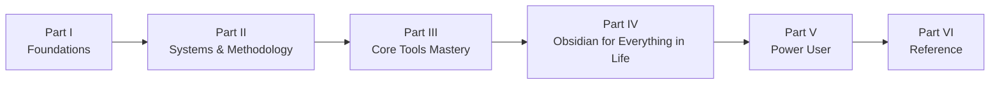

# The Complete Obsidian Mastery Guide

**A deep, opinionated, end-to-end guide to mastering Obsidian and turning it into the operating system for your entire life.**

This is not a quick-start tutorial. It assumes you already know what a vault is, how to make a `[[link]]`, and that plugins exist. From there it goes as deep as the tool allows: every feature that matters, every methodology worth knowing, working code for Dataview, Bases, Templater and Tasks, and complete, ready-to-copy systems for every domain of life — tasks, projects, knowledge, health, money, people, home, creativity, and self-reflection.

!!! info "Version baseline"
    Written against **Obsidian 1.13** (mid-2026). It covers Bases (with summaries, group-by, list and map views), the Obsidian CLI, Keychain, the new Settings panel, the iOS Share Sheet, Web Clipper + Interpreter, and the current state of the plugin ecosystem. Where behaviour changed recently, the guide says so.

## How to read this guide

There are three sensible paths:

| You are… | Read… |
| --- | --- |
| **Rebuilding your vault from scratch** | Part I quickly, then Part II carefully (especially [Vault Architecture](08-vault-architecture.md)), then the domain chapters in Part IV that matter to you, then Part V as needed. |
| **A daily user who wants to level up** | Skim Part I for gaps, then [Bases](10-bases.md), [Dataview](12-dataview.md), [Templater](11-templates-and-templater.md), [Tasks](13-tasks-and-time.md), then [Automation](29-automation-and-integrations.md) and [AI](30-ai.md). |
| **Looking for a specific answer** | Use the search box (top of the page). Every chapter is self-contained and the [cheatsheets](37-cheatsheets.md) collect the syntax references in one place. |

Each chapter ends with **Key takeaways** and a link to the next chapter, so reading linearly works too. The total is book-length; treat it as a reference you return to, not a weekend read.

## What's inside

**Part I — Foundations.** The mental model that makes everything else click, a full settings audit, exhaustive Markdown and editing, links/graph/canvas, properties and metadata design, and the complete search language.

**Part II — Systems & methodology.** Zettelkasten, Evergreen notes, LYT/MOCs, PARA, CODE, Johnny.Decimal, GTD — compared honestly, then combined into a recommended hybrid architecture for a "whole life" vault.

**Part III — Core tools mastery.** Every core plugin; then deep dives into Bases, Templates/Templater, Dataview, Tasks and time management, and the curated community-plugin landscape.

**Part IV — Obsidian for everything in life.** Eleven domain chapters — daily notes & journaling, tasks/projects/goals, learning, academic research, work & career, health/fitness/food, finance, home & life admin, relationships, creativity & media, mind & self — each with note schemas, templates, dashboards, and workflows.

**Part V — Power user.** Sync/backup/security, mobile, customization & CSS, automation (URI, CLI, Shell commands, REST), AI integration, publishing, performance & troubleshooting, migration, and a plugin-development primer.

**Part VI — Reference.** A 30/60/90-day mastery roadmap, the full templates library, cheat sheets, and a glossary with resources.

## Conventions used

- `!!! tip` / `!!! warning` / `!!! note` callouts flag shortcuts, pitfalls, and context.
- Code blocks are copy-ready. Dataview queries are labelled `dataview` / `dataviewjs`; Bases files are shown as YAML; Templater templates use `<% %>` syntax.
- Keyboard shortcuts are given as ++ctrl+p++ on Windows/Linux — on macOS substitute ++cmd++ for ++ctrl++ unless stated.
- "Properties" and "frontmatter" mean the same thing (YAML metadata at the top of a note).
- When the guide recommends a plugin, it names the plugin ID as shown in Obsidian's community plugin browser.

## A note on opinions

Where there is a genuine trade-off, the guide shows the options and the reasoning. Where there is a clearly better answer for most people, it says so plainly. You are free to disagree — the whole point of Obsidian is that the system is yours.

---

**Start here →** [Chapter 1: Philosophy and Mental Model](01-philosophy.md)
